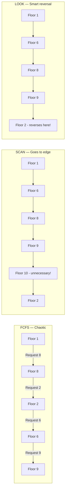
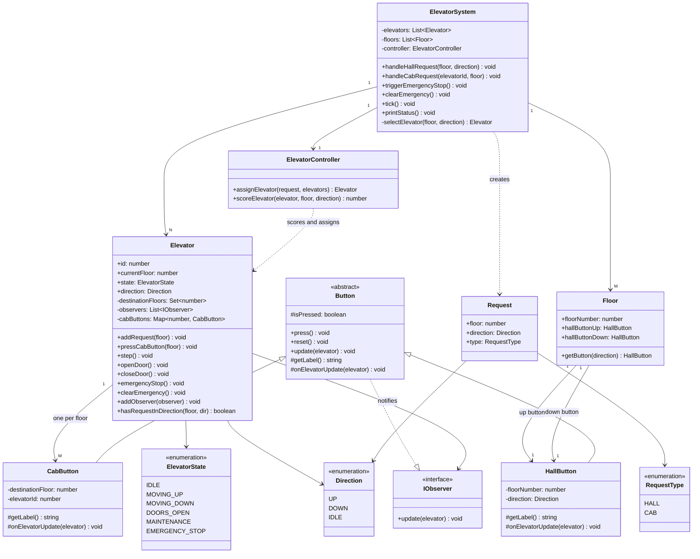
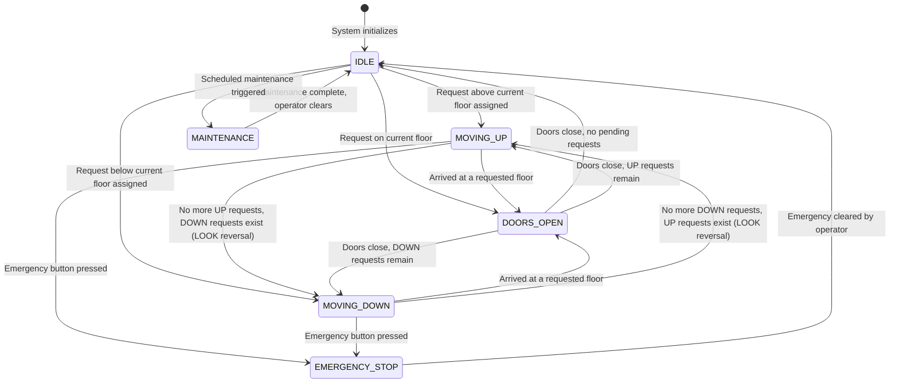
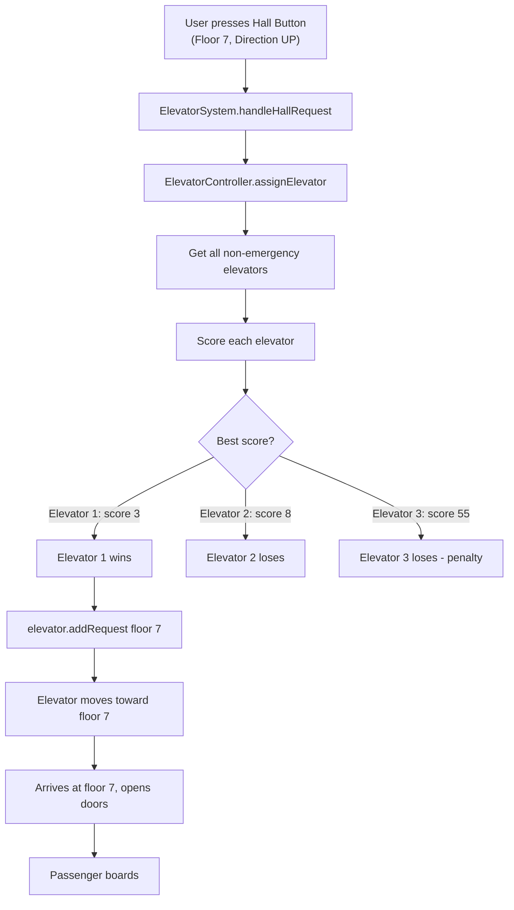
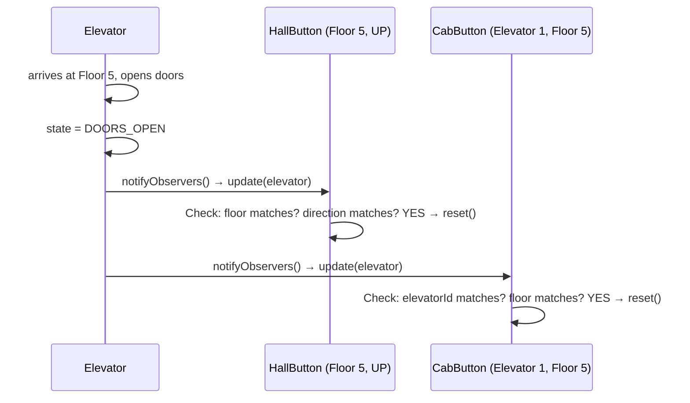
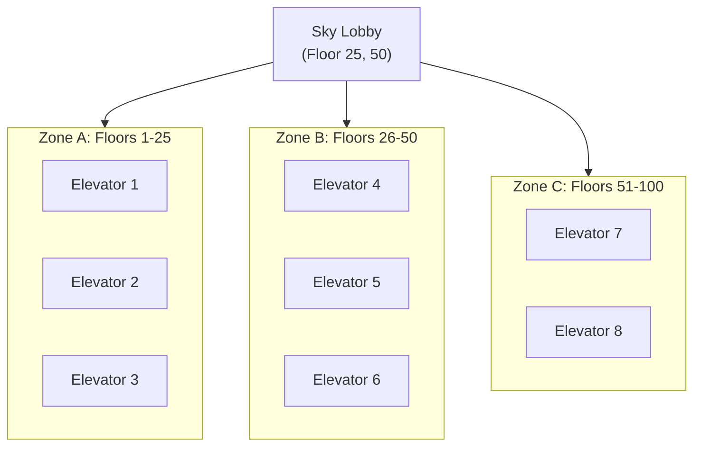

# LLD Case Study: Design an Elevator System

> The definitive guide — state machines, scheduling algorithms, OOP design, concurrency, and complete working code. Everything you need, nothing you don't.

---

## Why Should You Care? (The Real Story)

Yeh kyun important hai? Let me tell you.

You walk into a Swiggy or Zomato office for an LLD interview. The interviewer says "design an elevator system." Half the candidates start listing classes. The smart ones ask — "before I write a single class, can I understand what problem we're actually solving?"

The elevator problem is NOT about elevators. It is a disguised test of four things:

1. **State machine thinking** — can you model systems that change state in specific, predictable ways?
2. **Scheduling algorithm knowledge** — do you know FCFS, SCAN, LOOK and when to use each?
3. **Object-oriented design** — can you identify the right entities, assign responsibilities cleanly, and use design patterns purposefully?
4. **Concurrency awareness** — multiple buttons pressed simultaneously — how do you handle that without race conditions?

Samjho aise: every distributed system you'll ever build — a food delivery order state (PLACED → COOKING → OUT_FOR_DELIVERY → DELIVERED), a ride state in Uber (SEARCHING → DRIVER_ASSIGNED → IN_PROGRESS → COMPLETED) — is a state machine in disguise. Nail the elevator, nail every state machine problem.

---

## The Building Problem (A 5-Year-Old's Version)

Imagine you are playing with toy cars. You have three toy elevators in a building with 10 floors. People press buttons on floors saying "I want to go UP" or "I want to go DOWN." People inside the elevator press buttons saying "take me to floor 7."

Now you are the "controller" — the boss. Every time someone presses a button, you decide: which elevator goes? How? In what order?

**That is exactly what we are building.** A controller that is smart, fair, and efficient.

---

## Step 1: Gather Requirements (Never Skip This)

In a real interview, spend the first 3-5 minutes here. Yeh step skip mat karo — interviewers notice.

### Functional Requirements

- Building has N elevators and M floors
- **Hall buttons** (on each floor): Up and Down — user signals which direction they want to go
- **Cab buttons** (inside each elevator): destination floor — user tells the elevator where to stop
- Elevator moves floor-by-floor, stops at requested floors
- Doors open when elevator arrives at a requested floor, then close after timeout
- Emergency stop — immediately halts all elevators
- Elevator dispatched to best available elevator using an algorithm (LOOK)

### Non-Functional Requirements

- **Low wait time** — pick the most optimal elevator, not just any elevator
- **No starvation** — a floor should not wait forever because the elevator keeps serving other floors
- **Extensible** — adding more floors or elevators should not require rewriting everything
- **Thread-safe** — multiple button presses can happen simultaneously
- **Consistent state** — an elevator is always in exactly one well-defined state

### Out of Scope (Say This in Interview)

- Weight sensors / overload detection (mention it, but skip implementation)
- VIP floor access / keycards
- Real-time safety hardware interlocks
- Energy optimization

---

## Step 2: Identify the Entities

Analogy: Think of a hospital. You have patients (requests), doctors (elevators), the hospital reception (ElevatorSystem/controller), rooms (floors), and call buttons (HallButton/CabButton). Each thing has ONE job. Same principle here.

| Real-World Thing | Code Entity | Responsibility |
|---|---|---|
| The control room | `ElevatorSystem` | Receives requests, dispatches elevators, coordinates all |
| A single elevator car | `Elevator` | Moves, opens/closes door, tracks destinations |
| What the elevator is doing | `ElevatorState` | IDLE, MOVING_UP, MOVING_DOWN, DOORS_OPEN, MAINTENANCE |
| Which way it's going | `Direction` | UP, DOWN, IDLE |
| Button on a floor wall | `HallButton` | Signals direction from a floor |
| Button inside the elevator | `CabButton` | Signals destination floor |
| A floor in the building | `Floor` | Holds the hall buttons for that level |
| A movement request | `Request` | Captures floor + direction (for hall) or just floor (for cab) |
| The dispatch brain | `ElevatorController` | Implements the scheduling algorithm |

---

## Step 3: The Three Scheduling Algorithms (Yeh Samajhna Zaroori Hai)

Before writing any code, understand the algorithms. This is where most candidates lose marks — they implement LOOK but can't explain why it's better than FCFS or SCAN.

### Algorithm 1: FCFS (First Come, First Served)

**Analogy: Imagine a confused pizza delivery person.**

Orders come in: Floor 8, Floor 2, Floor 6, Floor 9. The delivery person goes 1 → 8 → 1 → 2 → 1 → 6 → 1 → 9. Travelling back to floor 1 every single time. Completely inefficient.

That is FCFS. The elevator serves requests in the order they were received, regardless of position.

```
Requests received: [Floor 8, Floor 2, Floor 6, Floor 9]
Elevator starts at Floor 1

FCFS Path: 1 → 8 → 2 → 6 → 9
Total floors travelled: 7 + 6 + 4 + 3 = 20 floors
```

**Problems with FCFS:**
- Elevator bounces up and down randomly
- Long wait times for passengers
- Total distance travelled is high
- In real buildings with 50+ floors, this is a disaster

**When would you use it?** Only when fairness matters more than efficiency and request volume is very low. In an interview, mention it as a baseline, then immediately explain why you're going with LOOK.

### Algorithm 2: SCAN (The Elevator Algorithm — Originally from Disk Scheduling)

**Analogy: Think of a lawnmower on a field.**

The lawnmower goes from left to right, cuts everything in its path. When it reaches the right edge, it turns around and goes left, cutting everything in its path. It always goes to the edge before turning.

SCAN does exactly this — the elevator moves in one direction (say UP), serves ALL requests in that direction, then goes all the way to the TOP floor, and THEN reverses and goes DOWN.

```
Requests received: [Floor 8, Floor 2, Floor 6, Floor 9]
Elevator starts at Floor 1, going UP

SCAN Path: 1 → 6 → 8 → 9 → 10 (top floor!) → 2
Total floors travelled: 5 + 2 + 1 + 1 + 8 = 17 floors (if max = 10)
```

**Better than FCFS.** But notice that "→ 10" step — the elevator went to the top floor even though Floor 10 had no request! That is wasteful.

### Algorithm 3: LOOK (What Real Elevators Actually Use)

**Analogy: Same lawnmower, but smarter.**

Instead of mowing to the edge of the field, the smart lawnmower stops when it runs out of grass to cut, turns around immediately, and starts cutting the other way. No unnecessary trips to the edge.

LOOK is SCAN but with early reversal — the elevator reverses direction when there are no more requests in the current direction. It does NOT go to the topmost/bottommost floor unnecessarily.

```
Requests received: [Floor 8, Floor 2, Floor 6, Floor 9]
Elevator starts at Floor 1, going UP

LOOK Path: 1 → 6 → 8 → 9 → 2
Total floors travelled: 5 + 2 + 1 + 7 = 15 floors
```

LOOK saves the unnecessary trip to Floor 10.

### Algorithm Comparison

| Feature | FCFS | SCAN | LOOK |
|---|---|---|---|
| Order of service | Request arrival order | Direction-based sweep | Direction-based sweep |
| Goes to extreme floor? | No | YES (wasteful) | No — reverses early |
| Efficiency | Poor | Good | Best |
| Starvation risk | High | Medium (edge floors wait) | Low |
| Implementation complexity | Trivial | Simple | Moderate |
| Used in real elevators? | No | No (theoretical baseline) | YES |
| Analogy | Confused waiter | Lawnmower (all the way) | Smart lawnmower |

**Interview tip:** When they ask "which algorithm would you use?" — say LOOK, explain WHY it beats SCAN (avoids unnecessary trips to extreme floors), and mention FCFS as a baseline you consciously rejected. This shows you've thought through the tradeoffs.



---

## Step 4: Complete Class Diagram



---

## Step 5: The Elevator State Machine

**Analogy: Think of a traffic signal at an intersection.**

A traffic signal has states: RED, GREEN, YELLOW. It can only be in ONE state at a time. And transitions are strict — GREEN never directly becomes RED; it goes GREEN → YELLOW → RED. If it could randomly jump between states, cars would crash.

An elevator is identical. It has fixed states and strict transitions. If it could jump from MOVING_UP to MOVING_DOWN without DOORS_OPEN in between, passengers would be trapped between floors. State machines prevent impossible, dangerous transitions.



### Why These Transitions Are Designed This Way

| Transition | Reason |
|---|---|
| MOVING_UP → DOORS_OPEN (not directly to MOVING_DOWN) | Safety: elevator must stop and open doors before reversing. Real physics. |
| EMERGENCY_STOP clears all requests | Safety: in an emergency, you start fresh. No stale requests. |
| IDLE → MOVING_UP or MOVING_DOWN (not both) | Physics: elevator can only travel one direction at a time |
| DOORS_OPEN → IDLE only if no pending requests | Efficiency: don't stay IDLE if there's more work to do |
| MAINTENANCE is separate from EMERGENCY_STOP | Semantic clarity: maintenance is planned, emergency is unplanned |

**Key insight for interviews:** The elevator NEVER jumps from MOVING_UP to MOVING_DOWN directly. It always goes through DOORS_OPEN. This is not just good design — it is a safety requirement that maps to real hardware interlocks.

---

## Step 6: Request Assignment — Which Elevator Gets the Job?

**Analogy: Uber surge pricing and nearest driver assignment.**

When you open Uber and request a ride, Uber doesn't just pick a random driver. It calculates which driver can reach you fastest, considering their current location, direction of travel, and whether they're already serving someone. Same logic here.

When a user presses a hall button (floor 7, going UP), we need to pick the best elevator. Here's the scoring model:

### Scoring Formula

```
score = distance_penalty + direction_penalty + load_penalty
```

- **distance_penalty** = `|elevator.currentFloor - requestFloor|`
- **direction_penalty** = 0 if elevator is moving toward request in right direction, 50 if moving away or wrong direction
- **load_penalty** = number of pending stops (a busy elevator should be less preferred)

Lower score = better fit. Assign to the lowest-scoring elevator.

### Scoring Priority Table

| Priority | Elevator State | Condition | Score |
|---|---|---|---|
| 1st (Best) | IDLE | On the same floor as request | 0 |
| 2nd | MOVING UP | Moving toward request floor, request is UP | distance only |
| 2nd | MOVING DOWN | Moving toward request floor, request is DOWN | distance only |
| 3rd | IDLE | Different floor | distance only |
| 4th | MOVING UP | Moving toward request, but request is DOWN | distance + 50 penalty |
| 5th (Worst) | MOVING DOWN | Moving away from request | distance + 50 penalty |

### Dispatch Flow



---

## Step 7: Concurrency — Multiple Buttons Pressed Simultaneously

**Analogy: Think of a bank's multiple ATMs.**

Multiple people use ATMs simultaneously. Each ATM has its own queue. But the bank's core system processes transactions one at a time per account (locks). If two people tried to withdraw from the same account at the exact same millisecond without locks, you'd get inconsistent balances.

Same problem in elevators: if two people on different floors press buttons at the exact same millisecond, and two threads try to modify the same elevator's request queue simultaneously — you get race conditions.

### The Problem: Race Condition Example

```
Thread A: Person on Floor 3 presses UP
Thread B: Person on Floor 7 presses UP

Both threads: scoreElevator(Elevator1) simultaneously
Both see: Elevator1 is idle, score = distance
Both decide: assign to Elevator1

Result: Elevator1.requests = {3, 7} — fine
BUT: if the request Set is not thread-safe, you might lose one request
```

### Solutions for Thread Safety

**Option 1: Synchronized request queue per elevator (simplest)**

```typescript
// Use a mutex/lock around addRequest
class Elevator {
  private mutex = new Mutex(); // or use synchronized in Java

  async addRequest(floor: number): Promise<void> {
    await this.mutex.acquire();
    try {
      this.requests.add(floor);
    } finally {
      this.mutex.release();
    }
  }
}
```

**Option 2: Separate dispatcher thread with a shared concurrent queue**

```
[Button Press Thread 1] → ConcurrentQueue → [Dispatcher Thread]
[Button Press Thread 2] → ConcurrentQueue     picks one request at a time
[Button Press Thread 3] → ConcurrentQueue     assigns to best elevator
```

**Option 3: Actor model (message passing)**

Each elevator is an Actor. Messages (requests) are sent to its inbox. The actor processes one message at a time — inherently thread-safe. This is the architecture used in systems like Akka (Scala/Java).

### What to Say in an Interview

In TypeScript (single-threaded via event loop), concurrency is handled by ensuring the dispatcher runs on a single event loop tick. In Java, use `ConcurrentLinkedQueue` for the request queue and `synchronized` on the dispatcher's `assignElevator` method.

For the LLD interview, acknowledging concurrency is enough — say "I'd use a thread-safe queue (like Java's BlockingQueue) per elevator and a single dispatcher thread to avoid race conditions in assignment logic."

---

## Step 8: Full TypeScript Implementation

### Enums and Interfaces

```typescript
// ── Direction enum ──────────────────────────────────────────────────────────
enum Direction {
  UP = "UP",
  DOWN = "DOWN",
  IDLE = "IDLE",
}

// ── ElevatorState enum ─────────────────────────────────────────────────────
enum ElevatorState {
  IDLE = "IDLE",
  MOVING_UP = "MOVING_UP",
  MOVING_DOWN = "MOVING_DOWN",
  DOORS_OPEN = "DOORS_OPEN",
  MAINTENANCE = "MAINTENANCE",
  EMERGENCY_STOP = "EMERGENCY_STOP",
}

// ── RequestType enum ───────────────────────────────────────────────────────
enum RequestType {
  HALL = "HALL",   // pressed on a floor (external request)
  CAB  = "CAB",    // pressed inside elevator (internal request)
}

// ── Request interface ──────────────────────────────────────────────────────
interface IRequest {
  floor: number;
  direction: Direction;    // meaningful only for HALL requests
  type: RequestType;
}

// ── Observer interface (for Observer pattern) ──────────────────────────────
interface IObserver {
  update(elevator: Elevator): void;
}
```

### Button Classes (Observer Pattern)

```typescript
// ── Button (abstract base) ─────────────────────────────────────────────────
// Analogy: A WhatsApp read-receipt. The button "observes" elevator state
// and resets itself (like a blue tick appearing) when the elevator arrives.
abstract class Button implements IObserver {
  protected isPressed: boolean = false;

  press(): void {
    this.isPressed = true;
    console.log(`[Button] ${this.getLabel()} pressed`);
  }

  reset(): void {
    this.isPressed = false;
    console.log(`[Button] ${this.getLabel()} reset (elevator served this request)`);
  }

  // Called by Elevator.notifyObservers() on every state change
  update(elevator: Elevator): void {
    this.onElevatorUpdate(elevator);
  }

  protected abstract getLabel(): string;
  protected abstract onElevatorUpdate(elevator: Elevator): void;
}

// ── HallButton ─────────────────────────────────────────────────────────────
// Lives on a floor. Represents the UP or DOWN button you press in a hallway.
class HallButton extends Button {
  constructor(
    private readonly floorNumber: number,
    private readonly direction: Direction
  ) {
    super();
  }

  protected getLabel(): string {
    return `HallButton[Floor-${this.floorNumber} ${this.direction}]`;
  }

  // Reset when an elevator arrives at this floor going in the right direction
  protected onElevatorUpdate(elevator: Elevator): void {
    if (
      elevator.currentFloor === this.floorNumber &&
      elevator.state === ElevatorState.DOORS_OPEN &&
      (elevator.direction === this.direction || elevator.direction === Direction.IDLE)
    ) {
      this.reset();
    }
  }
}

// ── CabButton ──────────────────────────────────────────────────────────────
// Lives inside an elevator. The floor buttons you press after boarding.
class CabButton extends Button {
  constructor(
    private readonly destinationFloor: number,
    private readonly elevatorId: number
  ) {
    super();
  }

  protected getLabel(): string {
    return `CabButton[Elevator-${this.elevatorId} → Floor-${this.destinationFloor}]`;
  }

  // Reset when THIS elevator arrives at this destination floor
  protected onElevatorUpdate(elevator: Elevator): void {
    if (
      elevator.id === this.elevatorId &&
      elevator.currentFloor === this.destinationFloor &&
      elevator.state === ElevatorState.DOORS_OPEN
    ) {
      this.reset();
    }
  }
}
```

### Floor Class

```typescript
// ── Floor ──────────────────────────────────────────────────────────────────
// Represents a physical floor. Holds two hall buttons: UP and DOWN.
// Note: Ground floor has no DOWN button; top floor has no UP button.
// For simplicity we create both buttons for all floors.
class Floor {
  readonly hallButtonUp: HallButton;
  readonly hallButtonDown: HallButton;

  constructor(readonly floorNumber: number) {
    this.hallButtonUp   = new HallButton(floorNumber, Direction.UP);
    this.hallButtonDown = new HallButton(floorNumber, Direction.DOWN);
  }

  getButton(direction: Direction): HallButton {
    return direction === Direction.UP
      ? this.hallButtonUp
      : this.hallButtonDown;
  }
}
```

### Elevator Class (The Core — LOOK Algorithm Lives Here)

```typescript
// ── Elevator ───────────────────────────────────────────────────────────────
// Represents a single elevator car.
// Implements the LOOK algorithm: moves in one direction,
// reverses ONLY when no more requests exist in current direction.
class Elevator {
  readonly id: number;
  currentFloor: number;
  state: ElevatorState;
  direction: Direction;

  // All pending floors to stop at (merged from hall + cab requests)
  private destinationFloors: Set<number> = new Set();

  // Observer pattern: buttons that watch this elevator
  private observers: IObserver[] = [];

  // One cab button per floor (buttons inside this elevator)
  private cabButtons: Map<number, CabButton> = new Map();

  constructor(id: number, startFloor: number, totalFloors: number) {
    this.id           = id;
    this.currentFloor = startFloor;
    this.state        = ElevatorState.IDLE;
    this.direction    = Direction.IDLE;

    // Create cab button for every floor and register as observers
    for (let floor = 1; floor <= totalFloors; floor++) {
      const btn = new CabButton(floor, id);
      this.cabButtons.set(floor, btn);
      this.addObserver(btn);
    }
  }

  // ── Observer pattern methods ───────────────────────────────────────────
  addObserver(observer: IObserver): void {
    this.observers.push(observer);
  }

  private notifyObservers(): void {
    // Tells all subscribed buttons about state change
    // (they decide themselves whether to reset)
    this.observers.forEach(o => o.update(this));
  }

  // ── Request management ─────────────────────────────────────────────────
  addRequest(floor: number): void {
    if (this.state === ElevatorState.EMERGENCY_STOP ||
        this.state === ElevatorState.MAINTENANCE) {
      console.log(`[Elevator ${this.id}] Cannot accept requests in state ${this.state}`);
      return;
    }
    this.destinationFloors.add(floor);
    console.log(
      `[Elevator ${this.id}] Added floor ${floor}. Queue: [${[...this.destinationFloors].join(', ')}]`
    );
    // If idle, decide direction and start moving
    if (this.state === ElevatorState.IDLE) {
      this.updateDirectionAndState();
    }
  }

  // Called when passenger presses button inside the elevator
  pressCabButton(floor: number): void {
    const btn = this.cabButtons.get(floor);
    if (btn) btn.press();
    this.addRequest(floor);
  }

  // ── LOOK Algorithm — direction update ─────────────────────────────────
  // This is the brain of the elevator. It decides what direction to go next.
  private updateDirectionAndState(): void {
    if (this.destinationFloors.size === 0) {
      this.direction = Direction.IDLE;
      this.state     = ElevatorState.IDLE;
      return;
    }

    const above = [...this.destinationFloors].filter(f => f > this.currentFloor);
    const below = [...this.destinationFloors].filter(f => f < this.currentFloor);

    if (this.direction === Direction.UP || this.direction === Direction.IDLE) {
      if (above.length > 0) {
        // Continue or start going UP
        this.direction = Direction.UP;
        this.state     = ElevatorState.MOVING_UP;
      } else if (below.length > 0) {
        // LOOK: no more UP requests — reverse to DOWN
        this.direction = Direction.DOWN;
        this.state     = ElevatorState.MOVING_DOWN;
        console.log(`[Elevator ${this.id}] LOOK: No more UP requests. Reversing to DOWN.`);
      }
    } else if (this.direction === Direction.DOWN) {
      if (below.length > 0) {
        // Continue going DOWN
        this.direction = Direction.DOWN;
        this.state     = ElevatorState.MOVING_DOWN;
      } else if (above.length > 0) {
        // LOOK: no more DOWN requests — reverse to UP
        this.direction = Direction.UP;
        this.state     = ElevatorState.MOVING_UP;
        console.log(`[Elevator ${this.id}] LOOK: No more DOWN requests. Reversing to UP.`);
      }
    }
  }

  // ── One simulation tick (called by scheduler) ──────────────────────────
  // Each tick = elevator moves one floor in its current direction
  step(): void {
    // Skip if not in a movable state
    if (
      this.state === ElevatorState.EMERGENCY_STOP ||
      this.state === ElevatorState.MAINTENANCE    ||
      this.state === ElevatorState.IDLE           ||
      this.destinationFloors.size === 0
    ) return;

    // If doors are open, close them first and decide next direction
    if (this.state === ElevatorState.DOORS_OPEN) {
      this.closeDoor();
      return;
    }

    // Move one floor in current direction
    if (this.direction === Direction.UP) {
      this.currentFloor++;
    } else if (this.direction === Direction.DOWN) {
      this.currentFloor--;
    }

    console.log(`[Elevator ${this.id}] At floor ${this.currentFloor} (${this.direction})`);

    // Check if this floor is a stop
    if (this.destinationFloors.has(this.currentFloor)) {
      this.destinationFloors.delete(this.currentFloor);
      this.openDoor();
      return;
    }

    // LOOK: check if we need to reverse direction
    this.updateDirectionAndState();
  }

  // ── Door operations ────────────────────────────────────────────────────
  openDoor(): void {
    this.state = ElevatorState.DOORS_OPEN;
    console.log(`[Elevator ${this.id}] DOORS OPEN at floor ${this.currentFloor}`);
    // Notify all subscribed buttons — they will reset if conditions match
    this.notifyObservers();
  }

  closeDoor(): void {
    console.log(`[Elevator ${this.id}] DOORS CLOSED at floor ${this.currentFloor}`);
    // Decide: is there more work to do?
    this.updateDirectionAndState();
  }

  // ── Emergency operations ───────────────────────────────────────────────
  emergencyStop(): void {
    this.state     = ElevatorState.EMERGENCY_STOP;
    this.direction = Direction.IDLE;
    this.destinationFloors.clear();
    console.log(`[Elevator ${this.id}] !!! EMERGENCY STOP at floor ${this.currentFloor} !!!`);
    this.notifyObservers();
  }

  clearEmergency(): void {
    if (this.state === ElevatorState.EMERGENCY_STOP) {
      this.state = ElevatorState.IDLE;
      console.log(`[Elevator ${this.id}] Emergency cleared. Now IDLE.`);
    }
  }

  enterMaintenance(): void {
    this.state     = ElevatorState.MAINTENANCE;
    this.direction = Direction.IDLE;
    this.destinationFloors.clear();
    console.log(`[Elevator ${this.id}] Entering MAINTENANCE mode.`);
  }

  exitMaintenance(): void {
    if (this.state === ElevatorState.MAINTENANCE) {
      this.state = ElevatorState.IDLE;
      console.log(`[Elevator ${this.id}] Exiting MAINTENANCE. Now IDLE.`);
    }
  }

  // ── Helper for dispatcher scoring ─────────────────────────────────────
  // Returns true if this elevator is moving toward the floor in the right direction
  hasRequestInDirection(targetFloor: number, requestDirection: Direction): boolean {
    if (requestDirection === Direction.UP) {
      return (
        this.direction === Direction.UP &&
        targetFloor >= this.currentFloor
      );
    }
    if (requestDirection === Direction.DOWN) {
      return (
        this.direction === Direction.DOWN &&
        targetFloor <= this.currentFloor
      );
    }
    return false;
  }

  get pendingStopCount(): number {
    return this.destinationFloors.size;
  }
}
```

### ElevatorController (Strategy Pattern — Plug-and-Play Algorithms)

```typescript
// ── ElevatorController ─────────────────────────────────────────────────────
// Encapsulates the dispatch algorithm. Strategy pattern — you can swap
// scoreElevator() logic without touching ElevatorSystem.
//
// Analogy: Zomato's delivery partner assignment algorithm.
// Multiple delivery partners available. Pick the best one based on
// distance, direction, current load, and whether they're heading your way.
class ElevatorController {

  assignElevator(
    request: IRequest,
    elevators: Elevator[]
  ): Elevator | null {
    // Filter out unavailable elevators
    const available = elevators.filter(
      e => e.state !== ElevatorState.EMERGENCY_STOP &&
           e.state !== ElevatorState.MAINTENANCE
    );

    if (available.length === 0) return null;

    let bestElevator: Elevator | null = null;
    let bestScore = Infinity;

    for (const elevator of available) {
      const score = this.scoreElevator(elevator, request.floor, request.direction);
      console.log(
        `[Controller] Elevator ${elevator.id}: ` +
        `floor=${elevator.currentFloor}, state=${elevator.state}, score=${score}`
      );
      if (score < bestScore) {
        bestScore     = score;
        bestElevator  = elevator;
      }
    }

    return bestElevator;
  }

  /**
   * Score an elevator for a given hall request.
   * Lower is better.
   *
   * Scoring model:
   *   distance          = |elevator.currentFloor - requestFloor|
   *   direction_penalty = +50 if elevator is moving away or wrong direction
   *   load_penalty      = pendingStops * 2 (busier elevators are less preferred)
   *
   * Cases:
   *   IDLE, same floor           → 0           (perfect match)
   *   Moving toward, right dir   → distance    (on-the-way pickup)
   *   IDLE, different floor      → distance    (neutral)
   *   Moving wrong direction     → dist + 50   (heavy penalty)
   */
  scoreElevator(
    elevator: Elevator,
    targetFloor: number,
    direction: Direction
  ): number {
    const distance    = Math.abs(elevator.currentFloor - targetFloor);
    const loadPenalty = elevator.pendingStopCount * 2;

    // Perfect: idle on the exact floor
    if (elevator.state === ElevatorState.IDLE && distance === 0) {
      return 0 + loadPenalty;
    }

    // Good: moving toward the floor in the correct direction (can pick up on the way)
    if (elevator.hasRequestInDirection(targetFloor, direction)) {
      return distance + loadPenalty;
    }

    // OK: idle or doors open on a different floor
    if (
      elevator.state === ElevatorState.IDLE ||
      elevator.state === ElevatorState.DOORS_OPEN
    ) {
      return distance + loadPenalty;
    }

    // Suboptimal: moving in wrong direction or away from target — penalize heavily
    return distance + 50 + loadPenalty;
  }
}
```

### ElevatorSystem — The Coordinator

```typescript
// ── ElevatorSystem ─────────────────────────────────────────────────────────
// The top-level manager. Like the Uber backend:
//   - Receives requests (button presses)
//   - Uses ElevatorController to pick the best elevator
//   - Delegates movement to individual elevators
//   - Runs the simulation tick by tick
class ElevatorSystem {
  private static instance: ElevatorSystem; // Singleton
  private readonly elevators: Elevator[];
  private readonly floors: Floor[];
  private readonly controller: ElevatorController;

  private constructor(numElevators: number, numFloors: number) {
    this.floors     = Array.from({ length: numFloors  }, (_, i) => new Floor(i + 1));
    this.elevators  = Array.from({ length: numElevators }, (_, i) =>
      new Elevator(i + 1, 1, numFloors)
    );
    this.controller = new ElevatorController();

    // Register all hall buttons as observers on all elevators.
    // When any elevator opens doors on a floor, that floor's hall button resets.
    this.floors.forEach(floor => {
      this.elevators.forEach(elevator => {
        elevator.addObserver(floor.hallButtonUp);
        elevator.addObserver(floor.hallButtonDown);
      });
    });

    console.log(
      `[System] Initialized: ${numElevators} elevators, ${numFloors} floors`
    );
  }

  // Singleton getInstance
  static getInstance(
    numElevators = 3,
    numFloors    = 10
  ): ElevatorSystem {
    if (!ElevatorSystem.instance) {
      ElevatorSystem.instance = new ElevatorSystem(numElevators, numFloors);
    }
    return ElevatorSystem.instance;
  }

  // ── Handle hall button press (user on a floor pressing UP/DOWN) ────────
  handleHallRequest(floorNumber: number, direction: Direction): void {
    const floor = this.floors[floorNumber - 1];
    floor.getButton(direction).press();

    const request: IRequest = {
      floor: floorNumber,
      direction,
      type: RequestType.HALL,
    };

    const best = this.controller.assignElevator(request, this.elevators);
    if (best) {
      console.log(
        `[System] Assigned Elevator ${best.id} to floor ${floorNumber} (${direction})`
      );
      best.addRequest(floorNumber);
    } else {
      console.log(
        `[System] No elevator available for floor ${floorNumber} (${direction})`
      );
    }
  }

  // ── Handle cab button press (user inside elevator pressing a floor) ────
  handleCabRequest(elevatorId: number, destinationFloor: number): void {
    const elevator = this.elevators.find(e => e.id === elevatorId);
    if (!elevator) {
      console.log(`[System] Elevator ${elevatorId} not found`);
      return;
    }
    elevator.pressCabButton(destinationFloor);
  }

  // ── Advance simulation by one floor-movement tick ──────────────────────
  tick(): void {
    this.elevators.forEach(e => e.step());
  }

  // ── Emergency controls ─────────────────────────────────────────────────
  triggerEmergencyStop(): void {
    console.log("[System] !!! GLOBAL EMERGENCY STOP !!!");
    this.elevators.forEach(e => e.emergencyStop());
  }

  clearEmergency(): void {
    this.elevators.forEach(e => e.clearEmergency());
  }

  // ── Maintenance controls ───────────────────────────────────────────────
  sendToMaintenance(elevatorId: number): void {
    const elevator = this.elevators.find(e => e.id === elevatorId);
    if (elevator) elevator.enterMaintenance();
  }

  releaseMaintenance(elevatorId: number): void {
    const elevator = this.elevators.find(e => e.id === elevatorId);
    if (elevator) elevator.exitMaintenance();
  }

  // ── Status snapshot ────────────────────────────────────────────────────
  printStatus(): void {
    console.log("\n╔══════════════════════════════╗");
    console.log("║      Elevator Status          ║");
    console.log("╠══════════════════════════════╣");
    this.elevators.forEach(e => {
      console.log(
        `║ E${e.id}: Floor ${String(e.currentFloor).padEnd(2)} ` +
        `| ${e.state.padEnd(15)} | ${e.direction} ║`
      );
    });
    console.log("╚══════════════════════════════╝\n");
  }
}
```

### Demo: Full Walkthrough

```typescript
// ── Demo Simulation ────────────────────────────────────────────────────────
function runDemo(): void {
  // Building: 3 elevators, 10 floors
  const system = ElevatorSystem.getInstance(3, 10);
  system.printStatus();

  // ── Scenario 1: Person on floor 5 wants to go UP ──────────────────────
  console.log("=== Scenario 1: Hall request — Floor 5, UP ===");
  system.handleHallRequest(5, Direction.UP);
  // Elevator 1 is idle at floor 1, score = 4 (distance)
  // It should be assigned and start moving up
  system.tick(); // Floor 1 → 2
  system.tick(); // Floor 2 → 3
  system.tick(); // Floor 3 → 4
  system.tick(); // Floor 4 → 5 (STOP — opens doors)
  system.printStatus();

  // ── Scenario 2: Person inside Elevator 1 presses floor 8 ──────────────
  console.log("=== Scenario 2: Cab request — Elevator 1, floor 8 ===");
  system.handleCabRequest(1, 8);
  system.tick(); // Doors close → Move 5 → 6
  system.tick(); // Floor 7
  system.tick(); // Floor 8 (STOP — opens doors)
  system.printStatus();

  // ── Scenario 3: Multiple simultaneous hall requests ────────────────────
  console.log("=== Scenario 3: Simultaneous requests — Floor 3 UP, Floor 9 DOWN ===");
  system.handleHallRequest(3, Direction.UP);   // Elevator 2 or 3 assigned
  system.handleHallRequest(9, Direction.DOWN); // Another elevator assigned
  for (let i = 0; i < 8; i++) system.tick();
  system.printStatus();

  // ── Scenario 4: Emergency stop ─────────────────────────────────────────
  console.log("=== Scenario 4: Emergency Stop ===");
  system.triggerEmergencyStop();
  system.printStatus();
  system.clearEmergency();
  system.printStatus();

  // ── Scenario 5: Maintenance ────────────────────────────────────────────
  console.log("=== Scenario 5: Send Elevator 2 for maintenance ===");
  system.sendToMaintenance(2);
  system.handleHallRequest(4, Direction.UP); // Elevator 2 should be skipped
  system.printStatus();
}

runDemo();
```

---

## Step 9: Design Patterns Deep Dive

### Pattern 1: Observer Pattern (for Buttons)

**Analogy: Netflix notification when a new season drops.**

You subscribed to "Stranger Things". Netflix (the Subject) doesn't call you personally. It sends a notification to all subscribers. You (the Observer) decide whether the notification is relevant to you.

In our system:
- **Subject:** `Elevator` — publishes state changes (doors opening)
- **Observers:** `HallButton`, `CabButton` — subscribe and decide when to reset



**Why Observer here?** The elevator doesn't need to know WHICH buttons exist. It just fires the event. Buttons self-manage. This is loose coupling — adding new button types doesn't require changing Elevator.

### Pattern 2: Strategy Pattern (for Dispatch Algorithm)

**Analogy: Swiggy's restaurant ranking algorithm.**

Swiggy ranks restaurants by rating, distance, delivery time, and offers. Tomorrow they might add "eco-friendly packaging" as a factor. They swap the ranking algorithm without changing how restaurants are displayed.

`ElevatorController` is the Strategy. Its `scoreElevator()` method is the algorithm. Tomorrow you can swap it with a `EnergyEfficientController` or `FairnessOptimizedController` without touching `ElevatorSystem`.

```typescript
// Tomorrow's energy-efficient version — swap without touching ElevatorSystem
class EnergyEfficientController extends ElevatorController {
  scoreElevator(elevator: Elevator, targetFloor: number, direction: Direction): number {
    // Prefer elevators already moving — saves motor start-up energy
    const baseScore = super.scoreElevator(elevator, targetFloor, direction);
    const movingBonus = elevator.state === ElevatorState.IDLE ? 10 : 0; // penalize idle start
    return baseScore + movingBonus;
  }
}
```

### Pattern 3: Singleton (for ElevatorSystem)

**Analogy: A building has exactly ONE control room.**

Multiple threads/modules calling `ElevatorSystem.getInstance()` must get the SAME instance. A second instance would create two separate dispatcher brains that don't know about each other.

This was shown in `ElevatorSystem.getInstance()` above.

### Pattern Summary

| Pattern | Class | Why Used |
|---|---|---|
| Observer | `Elevator` (Subject), `Button` (Observer) | Decoupled button reset — elevator doesn't manage buttons |
| Strategy | `ElevatorController` | Swap dispatch algorithm without system changes |
| Singleton | `ElevatorSystem` | Only one control room per building |
| Factory (optional) | `ElevatorFactory` | Create elevators with consistent config |

---

## Step 10: Trade-offs and Design Decisions

### Trade-off 1: Centralized vs. Distributed Dispatch

| | Centralized (Our Design) | Distributed |
|---|---|---|
| How it works | One `ElevatorSystem` / `ElevatorController` decides for everyone | Each elevator independently bids for requests |
| Pros | Globally optimal, easy to reason about, single source of truth | Fault tolerant — no single point of failure |
| Cons | Single point of failure | Hard to ensure global optimality, coordination overhead |
| Real-world analogy | Uber's central matching engine | Peer-to-peer ridesharing |
| Interview answer | Start with centralized | Mention distributed as fault-tolerance improvement |

### Trade-off 2: Set vs. Priority Queue for Destination Floors

| | Set (Our Design) | PriorityQueue |
|---|---|---|
| Structure | Unordered set of floors | Min/max-heap ordered by floor number |
| Pros | O(1) add/lookup, no duplicates naturally | Natural ordering — floor traversal without filtering |
| Cons | Must filter above/below on each step | Adding to heap: O(log n); not a true ordering for LOOK |
| When to prefer PQ | N/A for LOOK | For FCFS where order matters |
| Our choice | Set — simpler, LOOK doesn't need ordering | |

### Trade-off 3: Step-by-step vs. Direct Jump to Destination

| | Step-by-Step (Our Design) | Direct Jump |
|---|---|---|
| How | Elevator moves one floor per tick, checks for stops | Teleport to destination |
| Pros | Realistic, allows mid-journey pickup (LOOK behavior) | Simpler code |
| Cons | More ticks needed, simulation overhead | Cannot pick up passengers en route |
| Real elevators | Step-by-step — can always pick up mid-journey | Not possible |

### Trade-off 4: Global Queue vs. Per-Elevator Queue

| | Per-Elevator Queue (Our Design) | Global Queue |
|---|---|---|
| How | Each elevator has its own `Set<number>` of destinations | One global queue, dispatcher pulls from it |
| Pros | Simple, predictable, no reassignment needed | Can reassign if a closer elevator becomes available |
| Cons | Cannot reassign once assigned | Complex dispatcher, locking overhead |
| Our choice | Per-elevator — sufficient for LLD interview | |

---

## Step 11: Scalability Considerations (For Senior Roles)

If the interviewer asks "what if this is a 100-story skyscraper with 20 elevators?" — here's what to say:

### Zone-Based Dispatching

Divide the building into zones. Floors 1-25 are served by elevators 1-5. Floors 26-50 by elevators 6-10. This reduces dispatch complexity from O(N elevators × M floors) to O(elevators_in_zone × zone_height).



### Sky Lobbies

Passengers transfer between zone banks at sky lobby floors (like Burj Khalifa). This is how the world's tallest buildings are actually designed.

### Express Elevators

Separate elevators for high floors only. You board an express to floor 30+, then switch to a local. This is EXACTLY the zone + transfer model used in international airports too.

---

## Step 12: Real-World Elevator Systems

Understanding how real systems are built helps you answer "how would you improve this?" in interviews:

| Company / System | Approach |
|---|---|
| Otis (Compass System) | Machine learning based dispatch — predicts peak times, pre-positions elevators |
| ThyssenKrupp MULTI | Rope-free, multiple cars in one shaft, circular routes (no reversal needed!) |
| Schindler PORT | Destination dispatch — passenger enters destination at lobby, system groups passengers going same direction, assigns an elevator BEFORE boarding |
| Mitsubishi DOAS | Zonal dispatching with traffic pattern learning |

**Destination Dispatch (most modern approach):** Instead of pressing UP/DOWN on each floor, passengers enter their destination at the lobby. The system groups passengers going to nearby floors into the same elevator. Like Uber Pool — group people going to the same area. This is better than LOOK because it minimizes in-elevator stops.

---

## Common Interview Questions

### Q1: "Walk me through your class design for an elevator system."

**Answer structure:**
1. Start with entities: ElevatorSystem, Elevator, Floor, Button (HallButton, CabButton), Request, ElevatorController
2. Explain responsibilities: ElevatorSystem is the coordinator, ElevatorController is the algorithm, Elevator is the state machine
3. Mention the Observer pattern for buttons
4. Explain the Strategy pattern for dispatch
5. Draw the state machine (IDLE → MOVING → DOORS_OPEN → IDLE cycle)

### Q2: "What scheduling algorithm would you use and why?"

**Answer:**
> "I'd use the LOOK algorithm. FCFS is simple but wildly inefficient — the elevator bounces randomly with no regard for position. SCAN improves this by sweeping in one direction, but it always travels to the extreme floor even if no requests exist there. LOOK is SCAN with early reversal — it reverses the moment no more requests exist in the current direction. This is what real elevators use because it minimizes total travel distance while preventing starvation."

### Q3: "How does your elevator state machine work?"

**Answer:**
> "An elevator has five states: IDLE, MOVING_UP, MOVING_DOWN, DOORS_OPEN, and EMERGENCY_STOP. Key constraint: you cannot go from MOVING_UP to MOVING_DOWN directly — you must pass through DOORS_OPEN. This mirrors real-world physics and safety requirements. The state machine is implemented as an enum — I avoid string-based state flags because enums give compile-time safety."

### Q4: "How do you handle concurrency? Multiple people press buttons simultaneously."

**Answer:**
> "In a real system, I'd use a thread-safe queue — Java's BlockingQueue or ConcurrentLinkedQueue — for each elevator's destination set. The dispatcher runs as a single thread pulling from a shared request queue. This ensures that request assignment is serialized even if button presses are concurrent. In TypeScript (single-threaded via event loop), the event loop naturally serializes handler calls — but I'd still use async/await carefully to avoid interleaving."

### Q5: "What design patterns did you use and why?"

**Answer:**
> "Three patterns. First, Observer: buttons subscribe to elevators. When the elevator opens its doors, it fires notifyObservers(). Each button checks if this arrival satisfies its condition and resets itself. This decouples the elevator from button logic. Second, Strategy: the dispatch algorithm is encapsulated in ElevatorController. I can swap it for an energy-efficient or fairness-optimized algorithm without touching ElevatorSystem. Third, Singleton: only one ElevatorSystem should exist per building — a second instance would create two independent dispatch brains that don't coordinate."

### Q6: "What are the trade-offs in your design?"

**Answer:**
> "I chose centralized dispatch — one controller assigns elevators globally. This gives optimal decisions but is a single point of failure. I chose per-elevator queues for simplicity, but a global queue with reassignment would be better for efficiency. I use a Set for destinations, which requires manual filtering in the LOOK implementation; a priority queue would give natural ordering but adds complexity. For a production system, I'd add zone-based dispatch for skyscrapers and destination dispatch (passengers enter destination at lobby) for high-traffic buildings."

### Q7: "How would you handle an elevator breaking down mid-journey?"

**Answer:**
> "I'd add a heartbeat/health check from each elevator to the ElevatorSystem. If an elevator misses N consecutive heartbeats, the system marks it as EMERGENCY_STOP, redistributes its pending requests to remaining elevators, and alerts the maintenance team. The Observer pattern already handles door state notifications — I'd extend the same pattern for health events."

### Q8: "Can an elevator take a DOWN request while going UP?"

**Answer:**
> "No, and this is by design. In LOOK, an elevator going UP only picks up UP requests in its upward path. It ignores DOWN requests (someone wanting to go down) because stopping for them would be confusing — the person sees an UP elevator arrive, boards it, and then the elevator goes down. That is a bad user experience. DOWN requests are held until the elevator reverses direction and comes back down. The exception: if the elevator is IDLE and the floor happens to be current floor, it can serve any direction."

### Q9: "How would you design this for a skyscraper with 100 floors and 20 elevators?"

**Answer:**
> "Zone-based dispatching. Divide the building into zones — floors 1-25, 26-50, 51-75, 76-100. Each zone has its dedicated elevator bank. Passengers use sky lobbies (floors 25, 50, 75) to transfer between zones. This reduces the dispatch problem per zone. For ultra-high-rise, add destination dispatch at the lobby — passengers scan a card or enter destination, and the system groups nearby-destination passengers into the same elevator before they board. This dramatically reduces in-elevator stops."

### Q10: "What happens if two people press the button on the same floor simultaneously?"

**Answer:**
> "In our design, the hallButton.press() is idempotent — pressing it twice has the same effect as pressing once (isPressed = true). The dispatcher runs once per request event. If two simultaneous button presses generate two dispatch events before the elevator arrives, the second dispatch attempt should check if an elevator is already assigned to that floor (de-duplication). In a real system, this is handled by a debounce mechanism — if an elevator is already en route to floor X in direction Y, ignore duplicate hall requests for (X, Y)."

---

## Key Takeaways

1. **State machines prevent impossible transitions.** MOVING_UP can never become MOVING_DOWN without DOORS_OPEN in between. This maps to real physics AND real safety interlocks. Always model state machines explicitly.

2. **LOOK beats SCAN because it avoids unnecessary trips to extreme floors.** LOOK reverses when no more requests exist in current direction. SCAN always goes to the topmost/bottommost floor. Both beat FCFS which has no directional intelligence at all.

3. **Scoring-based dispatch is flexible and future-proof.** A simple distance function today. Add load balancing, energy optimization, or wait-time fairness tomorrow — without restructuring the system. This is the Strategy pattern working in practice.

4. **Observer pattern keeps buttons self-managing.** The Elevator doesn't manage button state. Buttons subscribe and decide when to reset. The Elevator just announces "I arrived at floor X with doors open." This is loose coupling that scales to any number of button types.

5. **Hall requests carry direction intent; cab requests carry only destination.** These are semantically different. A hall request (Floor 7, UP) means "I want an elevator going UP." A cab request (Floor 3) means "take me to floor 3." The dispatch algorithm must respect this difference — a DOWN elevator should not pick up UP hall requests.

6. **Concurrency is a first-class concern.** Multiple simultaneous button presses → race conditions on request queues. Use thread-safe data structures and a single dispatcher thread. In interviews, acknowledging concurrency (even if not fully implementing it) separates mid-level from senior candidates.

7. **Emergency Stop is a terminal, authoritative state.** It clears ALL requests. Only an operator (not a passenger) can clear it. Model this explicitly — do not let it be just a flag.

8. **Singleton ElevatorSystem, Strategy ElevatorController, Observer Buttons.** Three patterns, each with a clear justification. Not pattern for pattern's sake — each solves a real design problem.

9. **Real elevator systems use destination dispatch and zone-based routing for high-rises.** Knowing this shows you can connect LLD problems to real-world engineering at scale.

10. **In interviews: requirements → entities → state machine → algorithm → code → patterns → trade-offs.** In that order. Never start with code. Never end without discussing trade-offs.

---

## Quick Reference Card

| Interview Question | One-Line Answer |
|---|---|
| Which algorithm? | LOOK — sweeps direction, reverses when no more requests in that direction |
| Why not FCFS? | Elevator bounces randomly, high total distance, long wait times |
| Why not SCAN? | Goes to extreme floor even with no requests there — wasteful |
| Key state transitions | IDLE → MOVING → DOORS_OPEN → IDLE (never skip DOORS_OPEN) |
| Patterns used | Observer (buttons), Strategy (dispatch), Singleton (system) |
| Concurrency solution | Thread-safe queue per elevator, single dispatcher thread |
| Hall vs. Cab request | Hall = floor + direction (external); Cab = destination only (internal) |
| Elevator selection criteria | Distance + direction alignment + pending load |
| Skyscraper design | Zone-based dispatch + sky lobbies + destination dispatch |
| LOOK's core rule | Continue direction until no more requests in that direction, then reverse |
