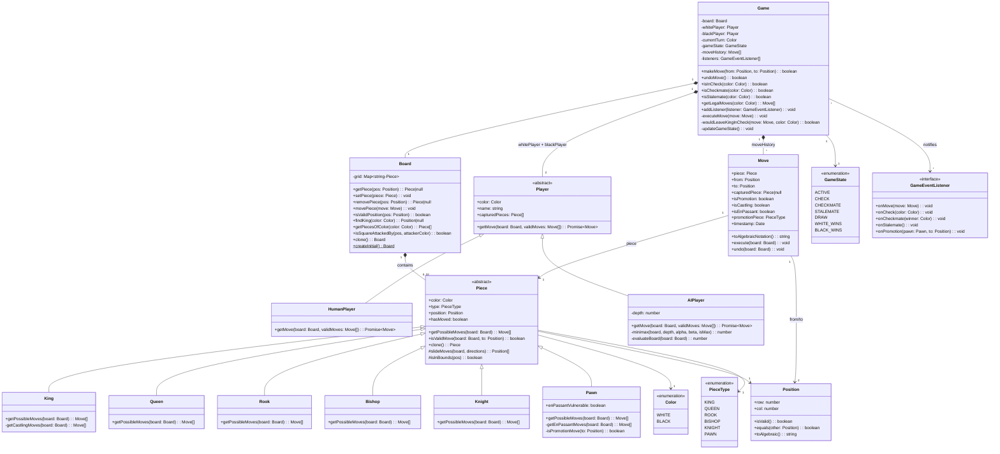
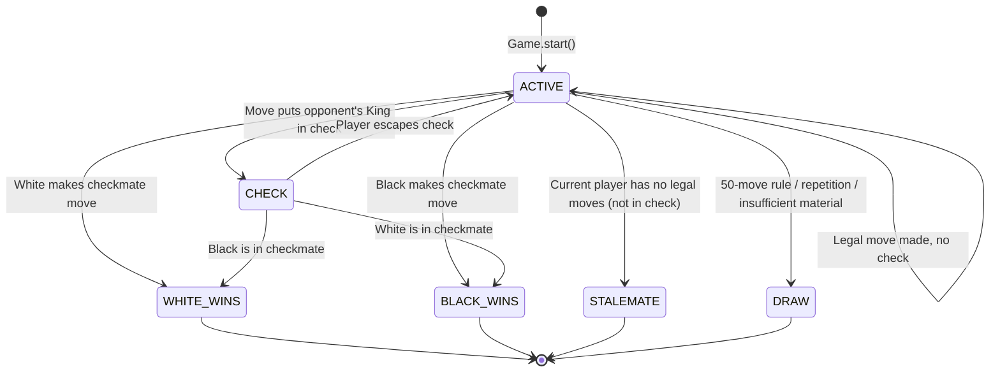
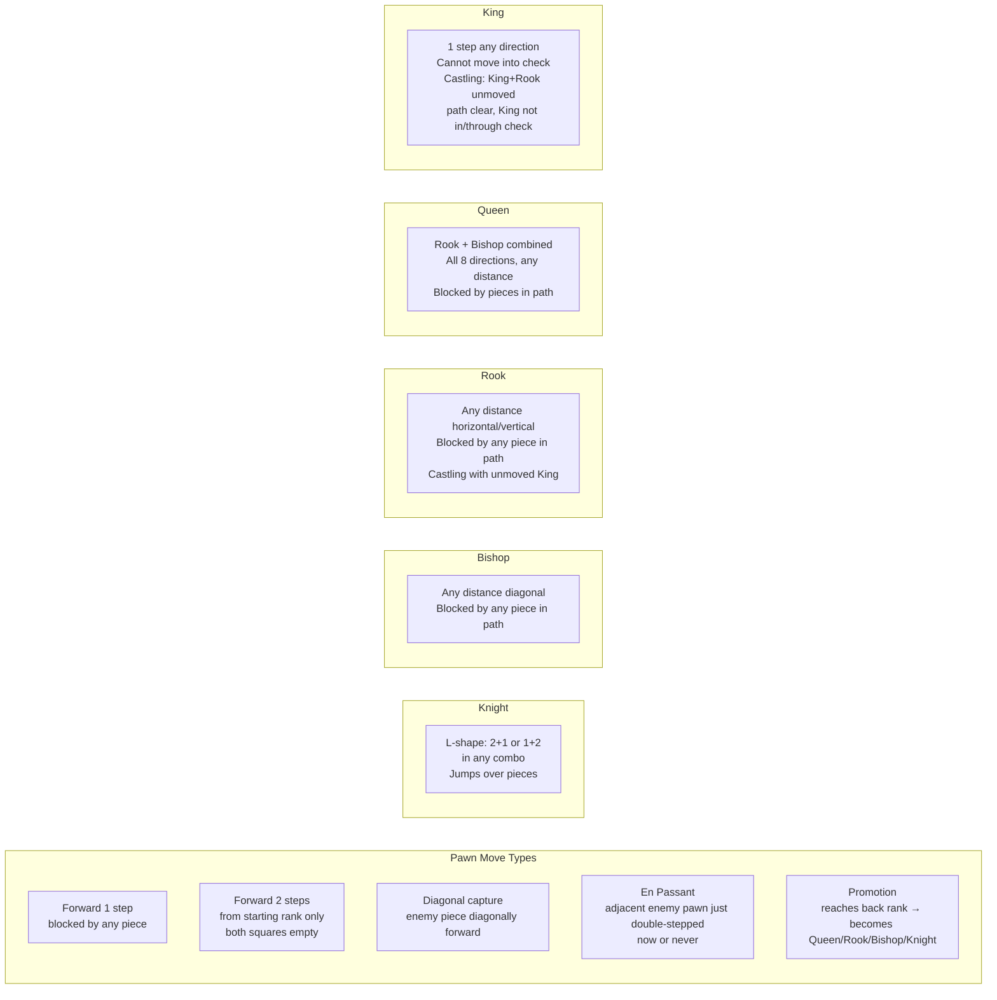
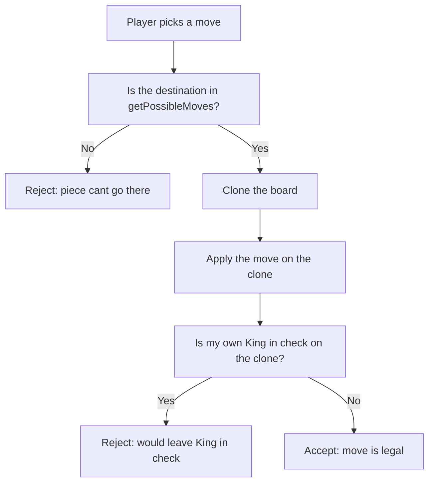
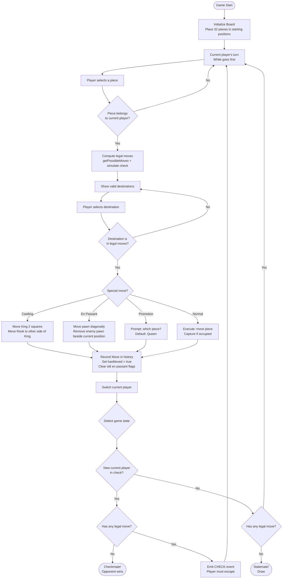
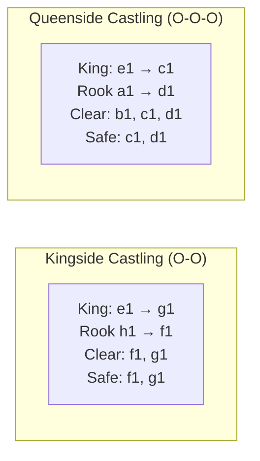
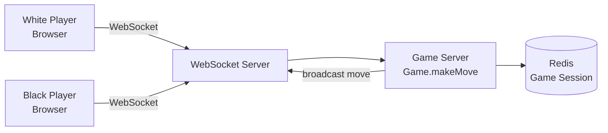

# LLD Case Study: Design a Chess Game

> **Interview Difficulty:** Hard
> **Topics Covered:** OOP, Inheritance, Polymorphism, Abstract Classes, Observer Pattern, Command Pattern, State Machine, Strategy Pattern, Prototype Pattern
> **Language:** TypeScript

---

## Why This Problem Is Asked in Every Senior Interview

Chess is the perfect OOP stress test. Interviewers love it because it forces you to demonstrate every pillar of object-oriented design at once:

- **Inheritance done right** — 6 piece types, one abstract parent, each child knows only its own logic
- **Polymorphism** — the Game class treats all pieces the same way, calling `getPossibleMoves()` without caring which piece it is
- **State machine** — game has distinct states (ACTIVE, CHECK, CHECKMATE, STALEMATE, DRAW) with rules about which transitions are valid
- **Command pattern** — every move is an object you can execute, undo, replay, or serialize
- **Observer pattern** — the game engine doesn't know or care how it's displayed; it just fires events

If you can design Chess cleanly in 45 minutes, you can design almost any domain-rich system.

---

## The 5-Year-Old Analogy (Before We Write a Single Line of Code)

Samjho aise: Chess ek office building jaisa hai.

- The **Board** is the office floor — 8 rows, 8 columns of desks (64 cells total)
- Each **Piece** is an employee with a job title (King, Queen, Rook...) and a company ID card (color: White or Black)
- Every employee has a rulebook — "these are the desks I can move to, and these are the ones I can't"
- The **Game** is the HR manager who enforces the rulebook, keeps an attendance log (move history), and announces when someone wins or the game is a tie
- A **Move** is a formal meeting-room booking — it records who moved, from which desk, to which desk, and whether anyone was kicked out (captured)
- **Check** is when the boss (King) gets an angry email saying "your desk will be flipped" — they must act immediately
- **Checkmate** is when the boss's desk WILL be flipped and no one in the office can stop it — game over
- **Stalemate** is when the boss has nowhere to move but no one is threatening them — awkward draw

That's it. Now let's build it properly.

---

## Step 1: Requirements Gathering

Before coding, nail down requirements like an interviewer expects.

### Functional Requirements

1. Two players (human or AI) take alternating turns
2. All 6 piece types with correct move validation (Pawn, Knight, Bishop, Rook, Queen, King)
3. Special moves: castling, en passant, pawn promotion
4. Check detection — is the King under attack after a move?
5. Checkmate detection — no legal move gets the player out of check
6. Stalemate detection — no legal move but King not in check
7. Move history log — every move recorded
8. Undo functionality — revert last move
9. Game state management — ACTIVE, CHECK, CHECKMATE, DRAW, WHITE_WINS, BLACK_WINS

### Non-Functional Requirements

1. Move validation must be fast — on a human timescale, even brute-force simulation is fine
2. System must be extensible — easy to add AI player, Chess960 variant, online multiplayer
3. Clean separation between game engine and UI

### What We Are NOT Designing (Scope boundary)

- Online multiplayer (that's system design, not LLD)
- A chess AI with minimax (we'll mention it but not implement)
- Tournament pairing or ELO rating systems

---

## Step 2: Identify the Entities

Think of this as casting the characters in your movie before writing the script.

| Entity | Real-World Analogy | Responsibility |
|---|---|---|
| `Board` | The 8x8 office floor with 64 desks | Holds all pieces, provides lookup and manipulation |
| `Position` | A desk coordinate (row 3, column E) | Represents one square — validates if it's on the board |
| `Piece` (abstract) | An employee contract | Base class — every piece has color, position, hasMoved |
| `King, Queen, Rook, Bishop, Knight, Pawn` | Specific job roles | Each implements its own movement rules |
| `Move` | A meeting-room booking form | Records what happened — enables undo, replay, notation |
| `Player` (abstract) | A participant | Has color, name — HumanPlayer reads input, AIPlayer computes |
| `HumanPlayer` | You | Gets move from user input |
| `AIPlayer` | Chess engine | Computes best move programmatically |
| `Game` | The HR manager + referee | Controls turns, validates moves, detects check/checkmate |
| `GameState` | Current office situation | Enum: ACTIVE, CHECK, CHECKMATE, STALEMATE, DRAW, WHITE_WINS, BLACK_WINS |

---

## Step 3: Full Class Diagram

Yeh diagram exam hall mein draw karo — it immediately shows you understand the full system.



---

## Step 4: Game State Machine

Chess behaves like a state machine. Yeh samajhna important hai kyunki interviewers often ask "how do you know when the game is over?"

Think of it like a WhatsApp message status: Sent → Delivered → Read → Replied. Each state has clear transitions and conditions.



---

## Step 5: Core Data Types

Shuru karo foundation se — Position, Color, GameState. Ye sab building blocks hain.

### Enums

```typescript
// types.ts

export enum Color {
  WHITE = 'WHITE',
  BLACK = 'BLACK',
}

export enum PieceType {
  KING   = 'KING',
  QUEEN  = 'QUEEN',
  ROOK   = 'ROOK',
  BISHOP = 'BISHOP',
  KNIGHT = 'KNIGHT',
  PAWN   = 'PAWN',
}

export enum GameState {
  ACTIVE      = 'ACTIVE',
  CHECK       = 'CHECK',
  CHECKMATE   = 'CHECKMATE',
  STALEMATE   = 'STALEMATE',
  DRAW        = 'DRAW',
  WHITE_WINS  = 'WHITE_WINS',
  BLACK_WINS  = 'BLACK_WINS',
}
```

### Position Class

Why a class and not just `{ row, col }`? Because position has behavior: validation, equality checks, algebraic notation. In an interview, this signals you understand encapsulation.

```typescript
// Position.ts

export class Position {
  constructor(
    public readonly row: number, // 0-7 (0 = rank 8 for standard orientation)
    public readonly col: number, // 0-7 (0 = file 'a', 7 = file 'h')
  ) {}

  isValid(): boolean {
    return this.row >= 0 && this.row <= 7
        && this.col >= 0 && this.col <= 7;
  }

  equals(other: Position): boolean {
    return this.row === other.row && this.col === other.col;
  }

  // Converts to chess notation, e.g., row=6 col=4 → "e2"
  toAlgebraic(): string {
    const files = 'abcdefgh';
    return `${files[this.col]}${8 - this.row}`;
  }

  // Adjacent positions (useful for King and castling path checks)
  offset(dr: number, dc: number): Position {
    return new Position(this.row + dr, this.col + dc);
  }

  static fromAlgebraic(notation: string): Position {
    const files = 'abcdefgh';
    const col = files.indexOf(notation[0]);
    const row = 8 - parseInt(notation[1]);
    return new Position(row, col);
  }
}
```

---

## Step 6: Piece Hierarchy — Polymorphism in Action

This is the heart of the design. Ek real analogy deta hoon:

Imagine a company where every employee has a badge (color) and a desk (position). The HR manual says every employee must answer the question: "Which desks can you move to right now?" But HOW each employee answers that question depends on their role (piece type).

- The **CEO (King)** can only move one desk at a time in any direction — and has a special partnership with the Head of Security (Rook) for castling
- The **COO (Queen)** can move any number of desks in any direction — the most flexible person
- The **Head of Security (Rook)** patrols straight corridors — rows and columns only
- The **Strategist (Bishop)** only works the diagonal conference rooms
- The **Consultant (Knight)** jumps over people to reach a very specific L-shaped desk — the only one who can leap over others
- The **Intern (Pawn)** can only walk forward, but can become anyone when they reach the other side

### Abstract Base Class

```typescript
// Piece.ts

import { Color, PieceType } from './types';
import { Position } from './Position';
import { Move } from './Move';

export abstract class Piece {
  public hasMoved: boolean = false;

  constructor(
    public readonly color: Color,
    public readonly type: PieceType,
    public position: Position,
  ) {}

  // THE contract — every piece must implement this
  // Returns all geometrically possible moves (without checking for self-check)
  abstract getPossibleMoves(board: Board): Move[];

  // Used by Game — delegates to getPossibleMoves then cross-references
  isValidMove(board: Board, to: Position): boolean {
    return this.getPossibleMoves(board).some(m => m.to.equals(to));
  }

  // Deep copy — needed for board simulation during check validation
  abstract clone(): Piece;

  // Shared helper for Rook, Bishop, Queen — slide in a direction until blocked
  // Analogy: roll a ball in one direction; it stops at a wall or another piece
  protected slideMoves(board: Board, directions: [number, number][]): Position[] {
    const positions: Position[] = [];

    for (const [dr, dc] of directions) {
      let pos = this.position.offset(dr, dc);

      while (pos.isValid()) {
        const occupant = board.getPiece(pos);

        if (!occupant) {
          positions.push(pos);       // empty square — keep going
        } else {
          if (occupant.color !== this.color) {
            positions.push(pos);     // enemy piece — can capture, but stop
          }
          break;                     // blocked — stop regardless
        }

        pos = pos.offset(dr, dc);
      }
    }

    return positions;
  }
}
```

### King — The Most Complex Piece

King has two kinds of moves: regular one-step and castling (special partnership with Rook). Both need careful handling.

Castling analogy: Like two executives switching offices — only works if neither has moved before, no furniture is blocking the hallway, and the boss's office isn't under threat during the move.

```typescript
// pieces/King.ts

export class King extends Piece {
  constructor(color: Color, position: Position) {
    super(color, PieceType.KING, position);
  }

  getPossibleMoves(board: Board): Move[] {
    const moves: Move[] = [];

    // Regular king moves — one step in any of 8 directions
    const directions: [number, number][] = [
      [-1, -1], [-1, 0], [-1, 1],
      [ 0, -1],          [ 0, 1],
      [ 1, -1], [ 1, 0], [ 1, 1],
    ];

    for (const [dr, dc] of directions) {
      const to = this.position.offset(dr, dc);
      if (!to.isValid()) continue;

      const occupant = board.getPiece(to);
      if (!occupant || occupant.color !== this.color) {
        // Capture is handled by Game layer — just record the geometrically valid square
        const move = new Move(this, this.position, to);
        if (occupant) move.capturedPiece = occupant;
        moves.push(move);
      }
    }

    // Castling moves
    moves.push(...this.getCastlingMoves(board));

    return moves;
  }

  private getCastlingMoves(board: Board): Move[] {
    const moves: Move[] = [];

    // King cannot castle if it has already moved
    if (this.hasMoved) return moves;

    const row = this.position.row;

    // --- Kingside castling (short castle, O-O) ---
    // Rook is at column 7. Squares 5 and 6 must be empty.
    const kRook = board.getPiece(new Position(row, 7));
    if (
      kRook instanceof Rook &&
      !kRook.hasMoved &&
      !board.getPiece(new Position(row, 5)) &&
      !board.getPiece(new Position(row, 6))
    ) {
      const castleMove = new Move(this, this.position, new Position(row, 6));
      castleMove.isCastling = true;
      moves.push(castleMove);
    }

    // --- Queenside castling (long castle, O-O-O) ---
    // Rook is at column 0. Squares 1, 2, 3 must be empty.
    const qRook = board.getPiece(new Position(row, 0));
    if (
      qRook instanceof Rook &&
      !qRook.hasMoved &&
      !board.getPiece(new Position(row, 1)) &&
      !board.getPiece(new Position(row, 2)) &&
      !board.getPiece(new Position(row, 3))
    ) {
      const castleMove = new Move(this, this.position, new Position(row, 2));
      castleMove.isCastling = true;
      moves.push(castleMove);
    }

    return moves;
  }

  clone(): King {
    const k = new King(this.color, new Position(this.position.row, this.position.col));
    k.hasMoved = this.hasMoved;
    return k;
  }
}
```

### Pawn — The Most Rule-Dense Piece

Pawn is deceptively complex. It has 4 different move types:
1. Forward one step (cannot capture)
2. Forward two steps from starting rank (cannot capture)
3. Diagonal capture (forward-left or forward-right)
4. En passant — capture a pawn that just did a double step beside you

And if it reaches the last rank, it promotes to any piece (usually Queen).

```typescript
// pieces/Pawn.ts

export class Pawn extends Piece {
  // Set to true when this pawn just did a double-step move
  // Cleared at the start of the NEXT turn
  public enPassantVulnerable: boolean = false;

  constructor(color: Color, position: Position) {
    super(color, PieceType.PAWN, position);
  }

  getPossibleMoves(board: Board): Move[] {
    const moves: Move[] = [];
    // White moves UP the board (decreasing row index)
    // Black moves DOWN the board (increasing row index)
    const dir      = this.color === Color.WHITE ? -1 : 1;
    const startRow = this.color === Color.WHITE ? 6 : 1;
    const promoRow = this.color === Color.WHITE ? 0 : 7;
    const { row, col } = this.position;

    // ─── 1. Single step forward ───────────────────────────────
    const oneStep = this.position.offset(dir, 0);
    if (oneStep.isValid() && !board.getPiece(oneStep)) {
      const move = new Move(this, this.position, oneStep);
      if (oneStep.row === promoRow) move.isPromotion = true;
      moves.push(move);

      // ─── 2. Double step from starting rank ─────────────────
      if (row === startRow) {
        const twoStep = this.position.offset(2 * dir, 0);
        if (!board.getPiece(twoStep)) {
          moves.push(new Move(this, this.position, twoStep));
        }
      }
    }

    // ─── 3. Diagonal captures ─────────────────────────────────
    for (const dc of [-1, 1]) {
      const capPos = this.position.offset(dir, dc);
      if (!capPos.isValid()) continue;

      const target = board.getPiece(capPos);
      if (target && target.color !== this.color) {
        const move = new Move(this, this.position, capPos);
        move.capturedPiece = target;
        if (capPos.row === promoRow) move.isPromotion = true;
        moves.push(move);
      }
    }

    // ─── 4. En passant ────────────────────────────────────────
    moves.push(...this.getEnPassantMoves(board, dir));

    return moves;
  }

  private getEnPassantMoves(board: Board, dir: number): Move[] {
    const moves: Move[] = [];
    const { row, col } = this.position;

    // En passant rank: rank 5 for White (row 3), rank 4 for Black (row 4)
    const enPassantRank = this.color === Color.WHITE ? 3 : 4;
    if (row !== enPassantRank) return moves;

    for (const dc of [-1, 1]) {
      const adjacentPos = new Position(row, col + dc);
      if (!adjacentPos.isValid()) continue;

      const adjacent = board.getPiece(adjacentPos);
      // The adjacent piece must be an enemy pawn that JUST did a double step
      if (adjacent instanceof Pawn && adjacent.color !== this.color && adjacent.enPassantVulnerable) {
        const landingPos = this.position.offset(dir, dc);
        const move = new Move(this, this.position, landingPos);
        move.isEnPassant = true;
        move.capturedPiece = adjacent; // the pawn being captured (not at landingPos!)
        moves.push(move);
      }
    }

    return moves;
  }

  clone(): Pawn {
    const p = new Pawn(this.color, new Position(this.position.row, this.position.col));
    p.hasMoved = this.hasMoved;
    p.enPassantVulnerable = this.enPassantVulnerable;
    return p;
  }
}
```

### Queen, Rook, Bishop, Knight — Elegant Reuse

Queen is basically Rook + Bishop combined. This is where `slideMoves()` from the base class shines — no code duplication.

```typescript
// pieces/Queen.ts
export class Queen extends Piece {
  constructor(color: Color, position: Position) {
    super(color, PieceType.QUEEN, position);
  }

  // Queen = all 8 directions, sliding
  getPossibleMoves(board: Board): Move[] {
    return this.positionsToMoves(this.slideMoves(board, [
      [-1,  0], [ 1,  0], [ 0, -1], [ 0,  1],  // straight (Rook-style)
      [-1, -1], [-1,  1], [ 1, -1], [ 1,  1],  // diagonal (Bishop-style)
    ]), board);
  }

  clone(): Queen {
    const q = new Queen(this.color, new Position(this.position.row, this.position.col));
    q.hasMoved = this.hasMoved;
    return q;
  }

  private positionsToMoves(positions: Position[], board: Board): Move[] {
    return positions.map(to => {
      const move = new Move(this, this.position, to);
      move.capturedPiece = board.getPiece(to);
      return move;
    });
  }
}

// pieces/Rook.ts
export class Rook extends Piece {
  constructor(color: Color, position: Position) {
    super(color, PieceType.ROOK, position);
  }

  // Rook = 4 straight directions, sliding
  getPossibleMoves(board: Board): Move[] {
    return this.slideMoves(board, [[-1, 0], [1, 0], [0, -1], [0, 1]])
      .map(to => {
        const move = new Move(this, this.position, to);
        move.capturedPiece = board.getPiece(to);
        return move;
      });
  }

  clone(): Rook {
    const r = new Rook(this.color, new Position(this.position.row, this.position.col));
    r.hasMoved = this.hasMoved;
    return r;
  }
}

// pieces/Bishop.ts
export class Bishop extends Piece {
  constructor(color: Color, position: Position) {
    super(color, PieceType.BISHOP, position);
  }

  // Bishop = 4 diagonal directions, sliding
  getPossibleMoves(board: Board): Move[] {
    return this.slideMoves(board, [[-1, -1], [-1, 1], [1, -1], [1, 1]])
      .map(to => {
        const move = new Move(this, this.position, to);
        move.capturedPiece = board.getPiece(to);
        return move;
      });
  }

  clone(): Bishop {
    const b = new Bishop(this.color, new Position(this.position.row, this.position.col));
    b.hasMoved = this.hasMoved;
    return b;
  }
}

// pieces/Knight.ts
export class Knight extends Piece {
  constructor(color: Color, position: Position) {
    super(color, PieceType.KNIGHT, position);
  }

  // Knight = fixed L-shape jumps — the ONLY piece that ignores blocking
  getPossibleMoves(board: Board): Move[] {
    const jumps: [number, number][] = [
      [-2, -1], [-2,  1],
      [-1, -2], [-1,  2],
      [ 1, -2], [ 1,  2],
      [ 2, -1], [ 2,  1],
    ];

    return jumps
      .map(([dr, dc]) => this.position.offset(dr, dc))
      .filter(to => {
        if (!to.isValid()) return false;
        const occupant = board.getPiece(to);
        return !occupant || occupant.color !== this.color; // empty or enemy
      })
      .map(to => {
        const move = new Move(this, this.position, to);
        move.capturedPiece = board.getPiece(to);
        return move;
      });
  }

  clone(): Knight {
    const k = new Knight(this.color, new Position(this.position.row, this.position.col));
    k.hasMoved = this.hasMoved;
    return k;
  }
}
```

---

## Step 7: Move Validation Rules Reference

Print this table and keep it next to you in the interview.



### Move Validation Table

| Piece | Direction | Distance | Blocked By Pieces? | Special Rules |
|---|---|---|---|---|
| **Pawn** | Forward only | 1 (or 2 from start) | Yes | Captures diagonally; en passant; promotion |
| **Knight** | L-shape | Fixed | No (jumps!) | None |
| **Bishop** | Diagonal | Unlimited | Yes | Stays on same color squares all game |
| **Rook** | Horizontal/Vertical | Unlimited | Yes | Part of castling |
| **Queen** | All 8 directions | Unlimited | Yes | Most powerful piece |
| **King** | All 8 directions | 1 | Yes | Cannot move into check; castling |

---

## Step 8: Board Class

Board is basically the "database" of the game. It stores where every piece is and provides fast lookup.

```typescript
// Board.ts

export class Board {
  // Using a flat 2D array for O(1) lookup by position
  private grid: (Piece | null)[][];

  constructor() {
    this.grid = Array.from({ length: 8 }, () => Array(8).fill(null));
  }

  // Factory method — creates standard starting position
  static createInitial(): Board {
    const board = new Board();
    const backRank: PieceType[] = [
      PieceType.ROOK, PieceType.KNIGHT, PieceType.BISHOP, PieceType.QUEEN,
      PieceType.KING, PieceType.BISHOP, PieceType.KNIGHT, PieceType.ROOK,
    ];

    for (let col = 0; col < 8; col++) {
      // Black pieces (rows 0 and 1)
      board.setPiece(Board.makePiece(Color.BLACK, backRank[col], new Position(0, col)));
      board.setPiece(new Pawn(Color.BLACK, new Position(1, col)));
      // White pieces (rows 6 and 7)
      board.setPiece(new Pawn(Color.WHITE, new Position(6, col)));
      board.setPiece(Board.makePiece(Color.WHITE, backRank[col], new Position(7, col)));
    }

    return board;
  }

  private static makePiece(color: Color, type: PieceType, pos: Position): Piece {
    switch (type) {
      case PieceType.KING:   return new King(color, pos);
      case PieceType.QUEEN:  return new Queen(color, pos);
      case PieceType.ROOK:   return new Rook(color, pos);
      case PieceType.BISHOP: return new Bishop(color, pos);
      case PieceType.KNIGHT: return new Knight(color, pos);
      case PieceType.PAWN:   return new Pawn(color, pos);
    }
  }

  getPiece(pos: Position): Piece | null {
    if (!this.isValidPosition(pos)) return null;
    return this.grid[pos.row][pos.col];
  }

  setPiece(piece: Piece): void {
    this.grid[piece.position.row][piece.position.col] = piece;
  }

  removePiece(pos: Position): Piece | null {
    const piece = this.grid[pos.row][pos.col];
    this.grid[pos.row][pos.col] = null;
    return piece;
  }

  isValidPosition(pos: Position): boolean {
    return pos.row >= 0 && pos.row < 8 && pos.col >= 0 && pos.col < 8;
  }

  findKing(color: Color): Position | null {
    for (let r = 0; r < 8; r++) {
      for (let c = 0; c < 8; c++) {
        const p = this.grid[r][c];
        if (p?.type === PieceType.KING && p.color === color) {
          return new Position(r, c);
        }
      }
    }
    return null;
  }

  getPiecesOfColor(color: Color): Piece[] {
    const result: Piece[] = [];
    for (let r = 0; r < 8; r++) {
      for (let c = 0; c < 8; c++) {
        const p = this.grid[r][c];
        if (p?.color === color) result.push(p);
      }
    }
    return result;
  }

  // Is a specific square under attack by the given color?
  // Used for: castling path validation, king safety check
  isSquareAttackedBy(pos: Position, attackerColor: Color): boolean {
    return this.getPiecesOfColor(attackerColor).some(piece =>
      piece.getPossibleMoves(this).some(move => move.to.equals(pos))
    );
  }

  // Deep clone — needed for move simulation without mutating real state
  // Analogy: like creating a parallel universe to test "what if"
  clone(): Board {
    const copy = new Board();
    for (let r = 0; r < 8; r++) {
      for (let c = 0; c < 8; c++) {
        const piece = this.grid[r][c];
        if (piece) copy.grid[r][c] = piece.clone();
      }
    }
    return copy;
  }
}
```

---

## Step 9: Move Class (Command Pattern)

Every move is an object. Why? Because then it can:
1. **Execute itself** — apply the change to the board
2. **Undo itself** — reverse the change
3. **Serialize itself** — into algebraic notation, JSON for network play, etc.
4. **Be replayed** — rebuild game history from a list of moves

Real-world analogy: Think of moves like UPI transactions. Each transaction object stores all the details (sender, receiver, amount, timestamp), can be logged, reversed (refund), and audited. The bank (Game) doesn't need to remember "what happened" — it just applies or reverses the transaction object.

```typescript
// Move.ts

export class Move {
  public capturedPiece: Piece | null = null;
  public isPromotion: boolean = false;
  public promotionPiece: PieceType = PieceType.QUEEN; // default
  public isCastling: boolean = false;
  public isEnPassant: boolean = false;
  public timestamp: Date = new Date();

  // Snapshot of state before move — needed for full undo
  private rookFromCol?: number;
  private rookToCol?: number;

  constructor(
    public readonly piece: Piece,
    public readonly from: Position,
    public readonly to: Position,
  ) {}

  // Execute this move on a board (called by Game.executeMove)
  execute(board: Board): void {
    // 1. Handle castling — also move the Rook
    if (this.isCastling && this.piece instanceof King) {
      const row = this.from.row;
      this.rookFromCol = this.to.col > this.from.col ? 7 : 0;
      this.rookToCol   = this.to.col > this.from.col ? 5 : 3;
      const rook = board.removePiece(new Position(row, this.rookFromCol))!;
      rook.position = new Position(row, this.rookToCol);
      rook.hasMoved = true;
      board.setPiece(rook);
    }

    // 2. Handle en passant capture — captured piece is NOT at `to`
    if (this.isEnPassant && this.capturedPiece) {
      board.removePiece(this.capturedPiece.position);
    }

    // 3. Handle standard capture
    if (!this.isEnPassant && this.capturedPiece) {
      board.removePiece(this.to);
    }

    // 4. Move the piece itself
    board.removePiece(this.from);
    this.piece.position = this.to;
    this.piece.hasMoved = true;
    board.setPiece(this.piece);

    // 5. Handle promotion — replace pawn with chosen piece
    if (this.isPromotion) {
      board.removePiece(this.to);
      const promoted = Board['makePiece'](this.piece.color, this.promotionPiece, this.to);
      promoted.hasMoved = true;
      board.setPiece(promoted);
    }
  }

  // Human-readable algebraic notation
  toAlgebraicNotation(): string {
    if (this.isCastling) {
      return this.to.col > this.from.col ? 'O-O' : 'O-O-O';
    }
    const symbol = this.piece.type === PieceType.PAWN ? '' : this.piece.type[0];
    const capture = this.capturedPiece || this.isEnPassant ? 'x' : '';
    const fromFile = this.piece.type === PieceType.PAWN && capture
      ? 'abcdefgh'[this.from.col]
      : '';
    const dest = this.to.toAlgebraic();
    const promoSuffix = this.isPromotion ? `=${this.promotionPiece[0]}` : '';
    return `${symbol}${fromFile}${capture}${dest}${promoSuffix}`;
  }
}
```

---

## Step 10: Player Hierarchy — Open for Extension

Why abstract Player? Because today you have HumanPlayer and AIPlayer. Tomorrow you might add NetworkPlayer (receives moves over WebSocket), ReplayPlayer (replays a recorded game), etc.

Open/Closed Principle at work: the Game class is closed for modification but open for extension via new Player subclasses.

```typescript
// Player.ts

export abstract class Player {
  public capturedPieces: Piece[] = [];

  constructor(
    public readonly color: Color,
    public readonly name: string,
  ) {}

  // Returns a Move the player wants to make.
  // Human reads from UI, AI computes internally.
  abstract getMove(board: Board, legalMoves: Move[]): Promise<Move>;
}

// HumanPlayer.ts — gets move from external input (UI callback, CLI, etc.)
export class HumanPlayer extends Player {
  private pendingMoveResolver?: (move: Move) => void;

  async getMove(board: Board, legalMoves: Move[]): Promise<Move> {
    // In a real app, this resolves when the user clicks on the board
    return new Promise((resolve) => {
      this.pendingMoveResolver = resolve;
    });
  }

  // Called by UI when user clicks from→to
  submitMove(move: Move): void {
    this.pendingMoveResolver?.(move);
  }
}

// AIPlayer.ts — simple random AI (real AI would use minimax)
export class AIPlayer extends Player {
  constructor(color: Color, name: string = 'AI', private depth: number = 3) {
    super(color, name);
  }

  async getMove(board: Board, legalMoves: Move[]): Promise<Move> {
    // Simplified: pick a random legal move
    // Real implementation: minimax with alpha-beta pruning
    const idx = Math.floor(Math.random() * legalMoves.length);
    return legalMoves[idx];
  }
}
```

---

## Step 11: Check, Checkmate, and Stalemate Detection

This is where most candidates fumble. Let's build the intuition first.

### Check Detection — The Core Algorithm

**Analogy**: Is anyone pointing a gun at the King right now?

To check if Color X's King is in check:
1. Find where Color X's King is
2. Get all of Color Y's (the opponent's) pieces
3. For each opponent piece, compute its possible moves
4. If ANY of those moves land on the King's square — it's check

Key insight: yeh kyun simple hai — we REUSE the `getPossibleMoves()` method we already wrote for each piece. No special "threat detection" logic needed.

```typescript
isInCheck(board: Board, color: Color): boolean {
  const kingPos = board.findKing(color);
  if (!kingPos) return false; // King not found (shouldn't happen in normal game)

  const opponentColor = color === Color.WHITE ? Color.BLACK : Color.WHITE;

  // Any opponent piece that can reach the King's square = check
  return board.getPiecesOfColor(opponentColor).some(piece =>
    piece.getPossibleMoves(board).some(move => move.to.equals(kingPos))
  );
}
```

### The Self-Check Problem

Here's the tricky part: a move might be geometrically valid (piece can go there) but ILLEGAL because it would leave your own King in check.

Example: White Rook is on e1, White King is on d1, Black Queen is on h1. Moving the Rook anywhere along row 1 would expose the King to the Queen — illegal!

Solution: **simulate first, then validate**.



```typescript
private wouldLeaveKingInCheck(move: Move, color: Color, board: Board): boolean {
  const simBoard = board.clone();
  // Apply the move on the simulated board
  move.execute(simBoard);
  // Check if our own King is now in danger
  return this.isInCheck(simBoard, color);
}
```

### Checkmate Detection

**Analogy**: Building is on fire AND every single exit is locked. No way out.

Checkmate = in check AND zero legal moves exist.

```typescript
isCheckmate(board: Board, color: Color): boolean {
  // Must be in check first
  if (!this.isInCheck(board, color)) return false;
  // Must have zero legal moves
  return this.getLegalMoves(board, color).length === 0;
}
```

### Stalemate Detection

**Analogy**: Building is NOT on fire, but every single door is blocked. Awkward impasse.

Stalemate = NOT in check AND zero legal moves exist.

```typescript
isStalemate(board: Board, color: Color): boolean {
  // Must NOT be in check
  if (this.isInCheck(board, color)) return false;
  // Must have zero legal moves
  return this.getLegalMoves(board, color).length === 0;
}
```

### getLegalMoves — The Foundation of Both

```typescript
getLegalMoves(board: Board, color: Color): Move[] {
  const legal: Move[] = [];

  for (const piece of board.getPiecesOfColor(color)) {
    for (const move of piece.getPossibleMoves(board)) {
      // Only include moves that don't leave own King in check
      if (!this.wouldLeaveKingInCheck(move, color, board)) {
        legal.push(move);
      }
    }
  }

  return legal;
}
```

---

## Step 12: Game Class — The Orchestrator

Game class is the conductor of the orchestra. It doesn't play any instrument itself — it just coordinates all the players and enforces the rules.

```typescript
// Game.ts

export class Game {
  private board: Board;
  private whitePlayer: Player;
  private blackPlayer: Player;
  private currentTurn: Color = Color.WHITE; // White always goes first
  private gameState: GameState = GameState.ACTIVE;
  private moveHistory: Move[] = [];
  private listeners: GameEventListener[] = [];

  constructor(whitePlayer: Player, blackPlayer: Player) {
    this.board = Board.createInitial();
    this.whitePlayer = whitePlayer;
    this.blackPlayer = blackPlayer;
  }

  // ── Observer registration ─────────────────────────────────
  addListener(listener: GameEventListener): void {
    this.listeners.push(listener);
  }

  private emit(event: string, payload?: unknown): void {
    this.listeners.forEach(l => (l as any)[event]?.(payload));
  }

  // ── Main API: make a move ─────────────────────────────────
  makeMove(from: Position, to: Position, promotionPiece?: PieceType): boolean {
    // Game already ended?
    if (this.gameState === GameState.CHECKMATE ||
        this.gameState === GameState.STALEMATE ||
        this.gameState === GameState.DRAW) {
      return false;
    }

    const piece = this.board.getPiece(from);
    if (!piece) return false;

    // Piece must belong to current player
    if (piece.color !== this.currentTurn) return false;

    // Check if this is a legal move (geometrically valid AND doesn't expose own King)
    const legalMoves = this.getLegalMoves(this.board, this.currentTurn);
    const selectedMove = legalMoves.find(m => m.from.equals(from) && m.to.equals(to));
    if (!selectedMove) return false;

    // Set promotion piece if applicable
    if (selectedMove.isPromotion && promotionPiece) {
      selectedMove.promotionPiece = promotionPiece;
    }

    // Clear en passant vulnerability for all current player's pawns
    // (vulnerability lasts exactly one turn)
    this.board.getPiecesOfColor(this.currentTurn).forEach(p => {
      if (p instanceof Pawn) p.enPassantVulnerable = false;
    });

    // Mark double-step pawn as en-passant vulnerable
    if (piece instanceof Pawn && Math.abs(to.row - from.row) === 2) {
      (piece as Pawn).enPassantVulnerable = true;
    }

    // Execute the move on the real board
    selectedMove.execute(this.board);
    this.moveHistory.push(selectedMove);

    this.emit('onMove', selectedMove);
    if (selectedMove.isPromotion) this.emit('onPromotion', selectedMove);

    // Switch turns
    this.currentTurn = this.currentTurn === Color.WHITE ? Color.BLACK : Color.WHITE;

    // Evaluate new game state for the player who just became active
    this.updateGameState();

    return true;
  }

  private updateGameState(): void {
    const color = this.currentTurn;

    if (this.isInCheck(this.board, color)) {
      if (this.isCheckmate(this.board, color)) {
        this.gameState = color === Color.WHITE ? GameState.BLACK_WINS : GameState.WHITE_WINS;
        this.emit('onCheckmate', color === Color.WHITE ? Color.BLACK : Color.WHITE);
      } else {
        this.gameState = GameState.CHECK;
        this.emit('onCheck', color);
      }
    } else if (this.isStalemate(this.board, color)) {
      this.gameState = GameState.STALEMATE;
      this.emit('onStalemate');
    } else {
      this.gameState = GameState.ACTIVE;
    }
  }

  // ── Undo (Command Pattern) ────────────────────────────────
  // Analogy: Ctrl+Z — restore to the state before the last action
  // Strategy: rebuild from scratch using history minus last move
  // Why not just "reverse the move"? Because fully reversing castling,
  // en passant, and promotion is complex and error-prone.
  undoMove(): boolean {
    if (this.moveHistory.length === 0) return false;

    const movesToReplay = this.moveHistory.slice(0, -1);

    // Reset to initial state
    this.board = Board.createInitial();
    this.currentTurn = Color.WHITE;
    this.gameState = GameState.ACTIVE;
    this.moveHistory = [];

    // Replay all moves except the last
    for (const move of movesToReplay) {
      this.makeMove(move.from, move.to, move.isPromotion ? move.promotionPiece : undefined);
    }

    this.emit('onUndo');
    return true;
  }

  // ── Getters ───────────────────────────────────────────────
  getBoard(): Board       { return this.board; }
  getState(): GameState   { return this.gameState; }
  getHistory(): Move[]    { return [...this.moveHistory]; }
  getCurrentTurn(): Color { return this.currentTurn; }
}
```

---

## Step 13: Observer Pattern — Decoupling Game Engine from UI

**Why Observer here?**

Samjho: Chess game engine (the referee) should not know whether you're displaying the game in a React app, a terminal, or sending it over WebSocket to a mobile app. The engine just says "something happened" — whoever cares can subscribe.

Just like how Swiggy's order service doesn't know whether the customer is watching the order on Android app, iOS app, or WhatsApp — it just publishes an order status event. Each platform subscribes and updates its own UI.

```typescript
// GameEventListener.ts

export interface GameEventListener {
  onMove?(move: Move): void;
  onCheck?(color: Color): void;
  onCheckmate?(winner: Color): void;
  onStalemate?(): void;
  onPromotion?(move: Move): void;
  onUndo?(): void;
}

// Example: Console logger — for debugging or game recording
export class ConsoleLogger implements GameEventListener {
  onMove(move: Move): void {
    console.log(`[MOVE] ${move.toAlgebraicNotation()}`);
  }
  onCheck(color: Color): void {
    console.log(`[CHECK] ${color} king is in check!`);
  }
  onCheckmate(winner: Color): void {
    console.log(`[CHECKMATE] ${winner} wins!`);
  }
  onStalemate(): void {
    console.log('[STALEMATE] Game is a draw.');
  }
  onPromotion(move: Move): void {
    console.log(`[PROMOTION] Pawn promoted to ${move.promotionPiece}`);
  }
}

// Example: React UI listener — updates state on events
export class ReactUIListener implements GameEventListener {
  constructor(private setState: (state: any) => void) {}

  onMove(move: Move): void {
    this.setState(prev => ({ ...prev, lastMove: move, history: [...prev.history, move] }));
  }
  onCheck(color: Color): void {
    this.setState(prev => ({ ...prev, status: `${color} is in check!` }));
  }
  onCheckmate(winner: Color): void {
    this.setState(prev => ({ ...prev, status: `${winner} wins by checkmate!`, gameOver: true }));
  }
}
```

---

## Step 14: Game Flow Diagram



---

## Step 15: Special Moves Deep Dive

### Castling — The 5 Conditions

Sab conditions yaad karo — interview mein poochha jata hai.

| Condition | Why It Exists |
|---|---|
| King has NOT moved | Castling is a one-time partnership. Once King moves, that trust is broken. |
| Chosen Rook has NOT moved | Same — Rook must also be in original position |
| All squares between King and Rook are empty | Can't castle through furniture |
| King is NOT currently in check | You can't castle your way out of check |
| King does NOT pass through a threatened square | The path itself must be safe |



### En Passant — The "Now or Never" Capture

**Analogy**: A spy tries to sneak past your border by running two steps at once. You have exactly ONE turn to catch them. Miss that window and they're gone.

```
BEFORE en passant:          AFTER en passant:
. . . . . . . .             . . . . . . . .
. . . . . . . .             . . . . . . . .
. . . . . . . .             . . . . P . . .    ← White pawn landed here
. . . p P . . .    →        . . . . . . . .    ← Black pawn removed from here
. . . . . . . .             . . . . . . . .
(Black pawn at d5 just did double step from d7)
(White pawn at e5 captures it by moving to d6)
```

Rules:
1. Black pawn just moved two squares forward (from row 1 to row 3)
2. White pawn is adjacent to that black pawn (same row)
3. White must capture immediately — next turn the opportunity expires
4. White moves diagonally to the square the black pawn "passed through"
5. The captured black pawn is removed from the board (not from the landing square!)

### Pawn Promotion

When a pawn reaches the opposite back rank, it must IMMEDIATELY transform into another piece. Rules:
- Can become: Queen, Rook, Bishop, or Knight (NOT King)
- In competitive play: almost always Queen (most powerful)
- In some endgame strategy: underpromotion to Knight (a Knight can create a fork immediately)
- The game must pause to ask the player their choice (or default to Queen)

---

## Step 16: Design Patterns Summary

```mermaid
mindmap
  root((Chess LLD\nDesign Patterns))
    Template Method
      Piece abstract class
      defines skeleton
      getPossibleMoves contract
      each subclass fills in details
    Polymorphism / Strategy
      each piece IS a strategy
      Game calls same method
      different behavior per piece
    Observer
      GameEventListener interface
      Game emits events
      UI subscribes
      decoupled from display tech
    Command
      Move object
      execute and undo
      serialize to notation
      replay history
    Prototype
      piece dot clone()
      board dot clone()
      safe simulation
      no mutation of real state
    Factory Method
      Board dot makePiece()
      centralizes construction
      one place to change
    State Machine
      GameState enum
      clear transitions
      illegal transitions prevented
```

| Pattern | Where Applied | Benefit |
|---|---|---|
| **Abstract Class + Polymorphism** | `Piece` → King/Queen/Rook/Bishop/Knight/Pawn | Each piece owns its move logic; Game doesn't need to know piece types |
| **Template Method** | `Piece.getPossibleMoves()` as contract; `slideMoves()` as shared helper | Forces consistency, reduces duplication |
| **Observer** | `GameEventListener` + `Game.emit()` | UI and engine completely decoupled |
| **Command** | `Move` object with `execute()` and history tracking | Enables undo, replay, algebraic notation, network serialization |
| **Prototype** | `Piece.clone()` and `Board.clone()` | Safe check simulation on a copy, not the real board |
| **Factory Method** | `Board.makePiece(type, color, pos)` | One place to create any piece type — easy to extend |
| **State Machine** | `GameState` enum + `updateGameState()` | Clear, auditable game lifecycle management |

---

## Step 17: Trade-Off Analysis

### Move Validation: Simulation vs Incremental Update

| Approach | How It Works | Pro | Con |
|---|---|---|---|
| **Clone + Simulate** | Deep clone board, apply move, check if own King is in check | Simple to implement, correct | O(n) board copy per move |
| **Incremental Attack Map** | Maintain a map of all threatened squares; update incrementally on each move | O(1) lookup | Complex to implement correctly; many edge cases (pins, discovered checks) |
| **Bitboard** | Store board state as 64-bit integers; use bit operations for moves | Extremely fast; used in real chess engines | Very complex; overkill for an interview |

**Our choice for LLD interview**: Clone + Simulate. It's correct, readable, and fast enough for human play.

### Undo Strategy: Full Replay vs State Snapshot

| Approach | Memory | Undo Speed | Complexity |
|---|---|---|---|
| **Full Replay** (our approach) | O(n moves) | O(n) — replay all previous moves | Low — reuses `makeMove` |
| **State Snapshot** | O(n × 64) — full board per move | O(1) — pop last snapshot | Medium — need deep clone every turn |
| **Incremental Undo** | O(n moves) | O(1) — reverse just the last move | High — must handle all special moves, captured piece positions, hasMoved flags |

**Chess games are short** — even grandmaster games rarely exceed 100 moves. Full replay is fine.

### Data Structure for Board

| Structure | Lookup | Iteration | Memory |
|---|---|---|---|
| `Piece[][]` 8×8 array | O(1) | O(64) | Fixed 64 cells |
| `Map<string, Piece>` | O(1) average | O(active pieces) | Dynamic |
| `Map<Position, Piece>` (object key) | Requires custom hash | O(active pieces) | Dynamic |

**Our choice**: `Piece[][]` — simplest, O(1) access by row/col, fixed size makes it easy to clone.

---

## Step 18: Extending the Design

### Adding AI Player

The `AIPlayer` class is already in our hierarchy. To add a real chess AI:

```typescript
export class MinimaxAIPlayer extends Player {
  async getMove(board: Board, legalMoves: Move[]): Promise<Move> {
    let bestMove = legalMoves[0];
    let bestScore = -Infinity;

    for (const move of legalMoves) {
      const simBoard = board.clone();
      move.execute(simBoard);
      const score = this.minimax(simBoard, 3, -Infinity, Infinity, false);
      if (score > bestScore) {
        bestScore = score;
        bestMove = move;
      }
    }

    return bestMove;
  }

  private minimax(board: Board, depth: number, alpha: number, beta: number, isMax: boolean): number {
    if (depth === 0) return this.evaluateBoard(board);
    // ... recursive minimax with alpha-beta pruning
    return 0;
  }

  private evaluateBoard(board: Board): number {
    const pieceValues: Record<PieceType, number> = {
      [PieceType.QUEEN]: 9, [PieceType.ROOK]: 5, [PieceType.BISHOP]: 3,
      [PieceType.KNIGHT]: 3, [PieceType.PAWN]: 1, [PieceType.KING]: 1000,
    };
    // Sum material advantage for this player's color
    let score = 0;
    for (const piece of board.getPiecesOfColor(this.color)) score += pieceValues[piece.type];
    for (const piece of board.getPiecesOfColor(this.color === Color.WHITE ? Color.BLACK : Color.WHITE)) {
      score -= pieceValues[piece.type];
    }
    return score;
  }
}
```

### Adding Online Multiplayer



Key changes:
- Add `NetworkPlayer` class — gets moves via WebSocket message
- Serialize `Move` objects to JSON for transmission
- Validate ALL moves server-side (never trust client)
- Store `moveHistory` in Redis by `gameId` for reconnection recovery
- Add `GameClock` with Observer callbacks for timed games

### Adding Chess960 (Fischer Random)

**Problem**: Standard setup is hardcoded. Chess960 uses 960 random starting positions.

**Solution**: Extract board setup to a Strategy.

```typescript
interface BoardSetupStrategy {
  setup(board: Board): void;
}

class StandardSetup implements BoardSetupStrategy {
  setup(board: Board): void { /* standard piece placement */ }
}

class Chess960Setup implements BoardSetupStrategy {
  setup(board: Board): void { /* random valid placement per Chess960 rules */ }
}

// Board.createInitial now accepts a strategy
static createInitial(strategy: BoardSetupStrategy = new StandardSetup()): Board {
  const board = new Board();
  strategy.setup(board);
  return board;
}
```

The rest of the game (move validation, check detection) needs zero changes. That's good design.

### Adding Draw by Repetition

After each move, hash the full board state (piece positions + whose turn). Store in `Map<string, number>`. If any state appears 3 times → draw.

```typescript
private boardStateHistory: Map<string, number> = new Map();

private getBoardStateHash(): string {
  // Serialize: all piece positions + type + color + hasMoved, plus whose turn
  const pieces = this.board.getPiecesOfColor(Color.WHITE)
    .concat(this.board.getPiecesOfColor(Color.BLACK))
    .map(p => `${p.type}${p.color}${p.position.toAlgebraic()}`)
    .sort()
    .join('|');
  return `${pieces}:${this.currentTurn}`;
}

private checkRepetition(): boolean {
  const hash = this.getBoardStateHash();
  const count = (this.boardStateHistory.get(hash) ?? 0) + 1;
  this.boardStateHistory.set(hash, count);
  return count >= 3;
}
```

---

## Step 19: Common Interview Questions

**Q1: Why use an abstract class for Piece instead of an interface?**

> An interface would give you the contract (`getPossibleMoves`) but no shared implementation. Using an abstract class lets us put shared behavior (`slideMoves`, `isInBounds`, `hasMoved`, `color`, `position`) in one place. All 6 piece classes get this for free. If we used an interface, every piece would duplicate these 5+ members. Abstract class = contract + shared implementation.

**Q2: How do you handle castling correctly — especially the "King can't pass through check" rule?**

> In `getCastlingMoves()`, we only add castling as a geometrically possible move if the squares are empty. Then in `getLegalMoves()`, when we simulate the castling move (apply it on a clone), if the King passes through a threatened square, the clone will show the King in check — and `wouldLeaveKingInCheck()` returns true. So that castling move is filtered out automatically. No special-casing needed! The simulation approach handles it.

**Q3: How do you detect en passant? When does the vulnerability expire?**

> Each `Pawn` has a boolean `enPassantVulnerable`. When a pawn does a double-step move, we set it to `true`. At the START of the next player's turn — before any moves are processed — we clear all `enPassantVulnerable` flags for the current player's pawns. This means the opportunity lasts exactly one turn. In `getPossibleMoves()`, we check adjacent enemy pawns for `enPassantVulnerable === true`.

**Q4: What's the time complexity of move validation?**

> - `getPossibleMoves()` for one piece: O(1) to O(board_size) = O(64) worst case (Queen sliding all directions)
> - `getLegalMoves()` for all pieces of one color: O(16 pieces × 64 squares × clone + check) = O(16 × 64 × 64) = O(65,536) ≈ O(1) for practical purposes on a chess board
> - Perfectly acceptable for human-paced gameplay

**Q5: Why clone the board for check simulation instead of making and undoing the move?**

> Making the move, checking, then undoing requires perfectly reversing all side effects: captured piece restoration, `hasMoved` flag reset, en passant flags, castling rook movement, promotion. Each of these is a potential bug. Cloning is simpler, harder to get wrong, and on a 64-cell board it's negligibly cheap. The prototype pattern earns its keep here.

**Q6: How would you add a 50-move draw rule?**

> Add a `halfMoveClock: number` counter to `Game`. Reset it to 0 whenever a pawn moves OR a capture happens. Increment by 1 for all other moves. After each move, check: if `halfMoveClock >= 100` (50 moves by each player = 100 half-moves) → declare draw.

**Q7: How does your design handle pawn promotion mid-game?**

> When `executeMove()` is called and the pawn reaches the back rank, `move.isPromotion = true`. The Game class emits an `onPromotion` event and waits for the player to specify a piece (via `promotionPiece` parameter). Default is Queen. The old pawn is removed, a new piece of the chosen type is placed at the same position with `hasMoved = true`.

**Q8: How would you serialize a game for network transmission?**

> The `Move` object has `toAlgebraicNotation()` for human-readable format. For machine transmission: serialize each Move as JSON with `{from, to, promotionPiece, timestamp}`. The server reconstructs the game by replaying moves on a fresh board. This is exactly what PGN (Portable Game Notation) does — the standard chess game record format.

**Q9: Can the same design support 4-player chess?**

> Sort of. The `Color` enum would need 4 values (WHITE, BLACK, RED, BLUE). `Game` would hold 4 Players with 4 Kings. Check/checkmate detection would need to check against 3 opponent colors, not 1. The `Board` stays the same. The main complexity is the larger 14×14 board variant used in 4-player chess — `Position.isValid()` bounds would change. OOP structure stays intact.

---

## Key Takeaways

1. **Abstract class + polymorphism is the correct tool for piece hierarchy** — each piece encapsulates its own movement logic; the Game never switches on piece type.

2. **`getPossibleMoves()` returns geometrically possible moves; `getLegalMoves()` filters by self-check** — never confuse these two layers.

3. **Check detection is just opponent's `getPossibleMoves()` reaching the King** — reuse existing logic, no special threat-detection code.

4. **Clone + simulate is the cleanest approach for self-check validation** — simpler than incremental undo, correct, fast enough.

5. **Checkmate = in check AND no legal moves. Stalemate = NOT in check AND no legal moves.** These are mirror conditions, tested by the same `getLegalMoves()` method.

6. **`hasMoved` flag is load-bearing** — castling, en passant, and pawn double-step all depend on it. Always set it after move execution.

7. **Observer decouples engine from UI** — Game emits events, has no import from UI code. This makes the engine independently testable.

8. **Command pattern (Move object) gives you undo, replay, notation, and network serialization for free.**

9. **Player hierarchy (abstract Player → HumanPlayer / AIPlayer)** follows Open/Closed Principle — add new player types without touching Game.

10. **Special moves (castling, en passant, promotion) are edge cases in `executeMove()`** — not in the Piece hierarchy. This keeps piece logic pure.

---

## Quick Reference: Piece Move Summary

| Piece | Symbol | Starting Squares | Move Rule |
|---|---|---|---|
| King | K | e1 (White), e8 (Black) | 1 square any direction + castling |
| Queen | Q | d1 (White), d8 (Black) | Any distance, any direction |
| Rook | R | a1,h1 (White), a8,h8 (Black) | Any distance, horizontal/vertical |
| Bishop | B | c1,f1 (White), c8,f8 (Black) | Any distance, diagonal only |
| Knight | N | b1,g1 (White), b8,g8 (Black) | L-shape, jumps over pieces |
| Pawn | P | rank 2 (White), rank 7 (Black) | Forward 1-2, capture diagonal |

---

*End of Case Study — Chess Game LLD. This file covers everything from OOP foundations to production extensions — yeh ek resource sufficient hai.*
