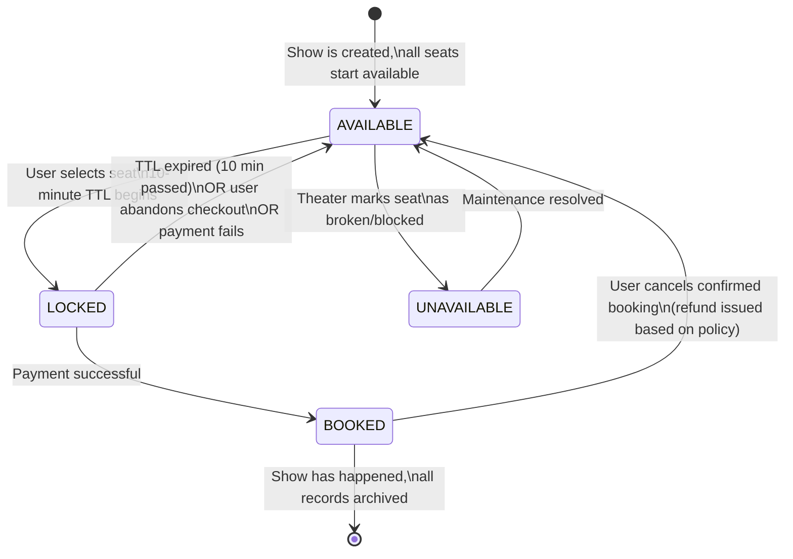
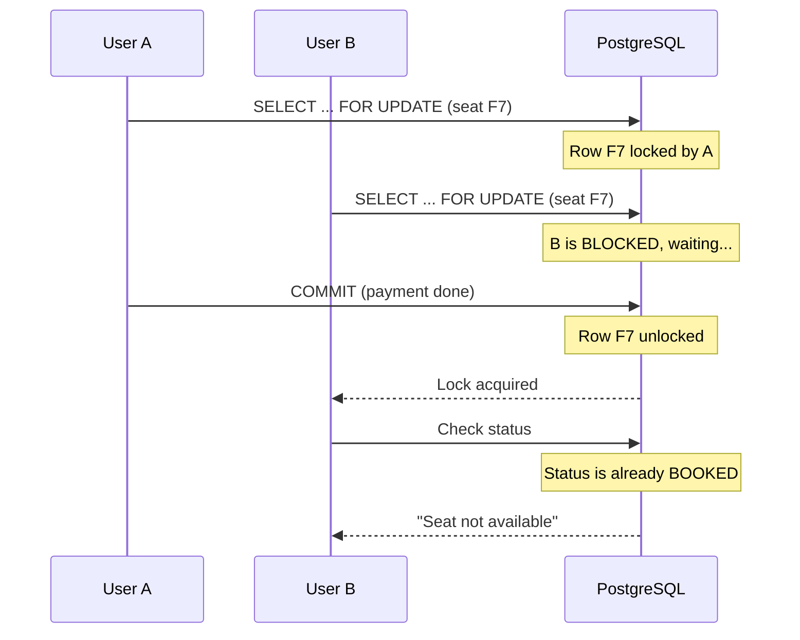
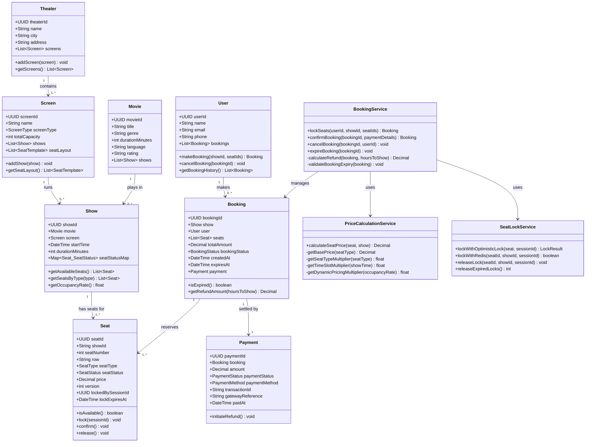
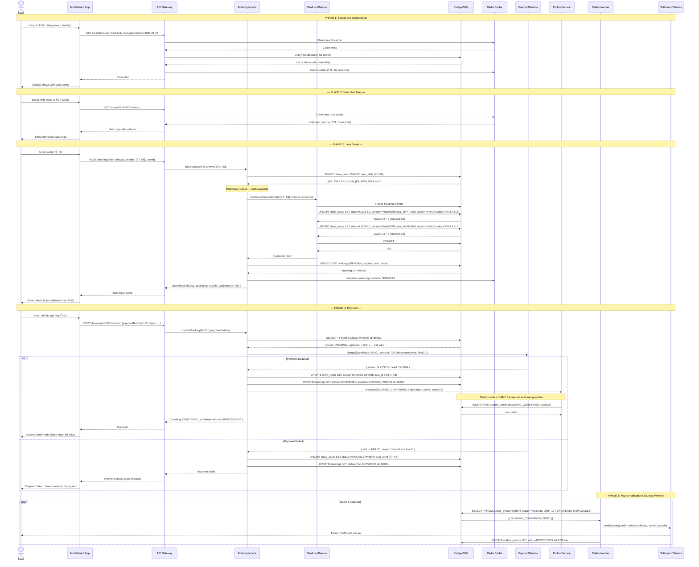
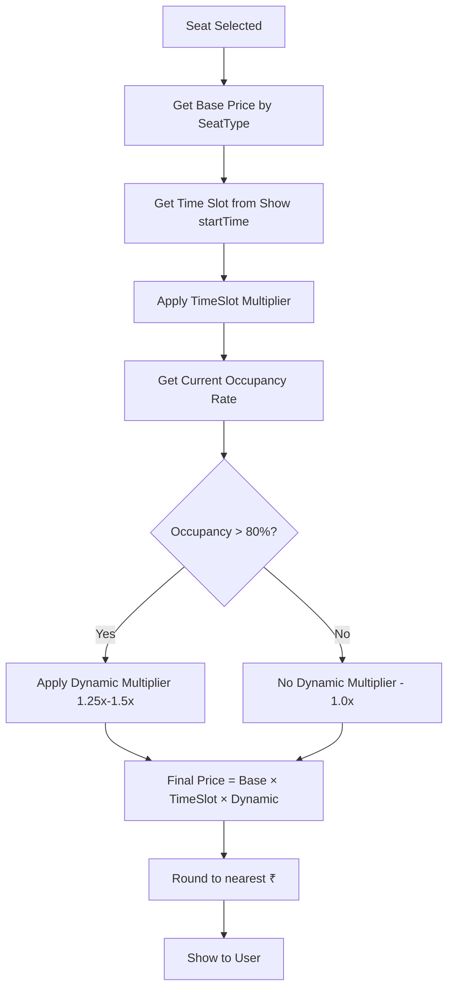
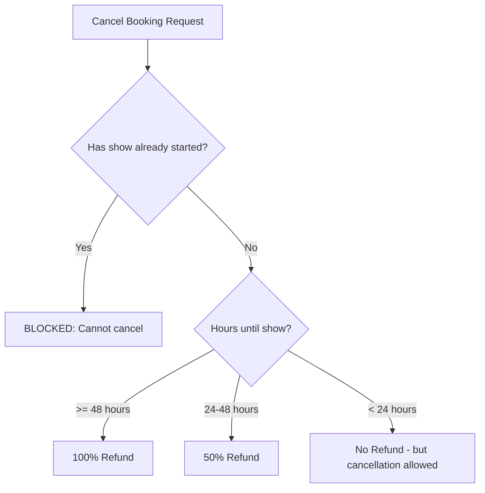
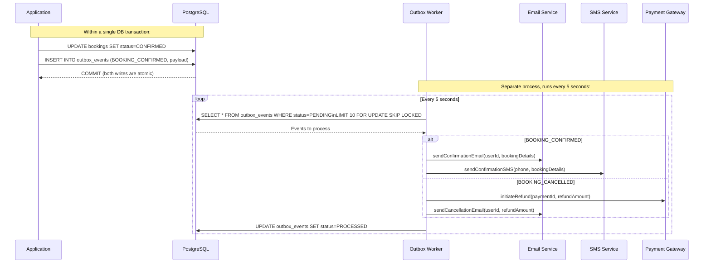
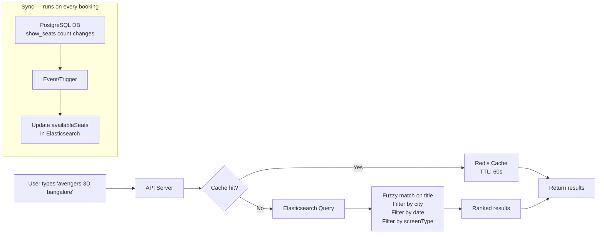
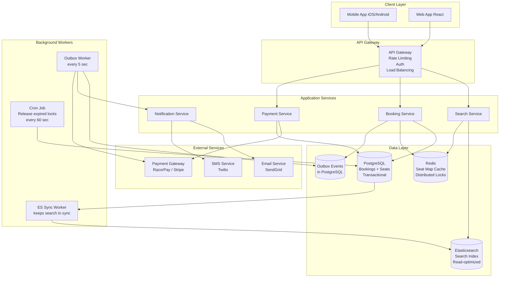

# LLD Case Study: Design BookMyShow (Movie Ticket Booking System)

> **Interview Difficulty:** Medium-Hard | **Time to explain:** 35-45 minutes
> **Core Themes:** Concurrency, State Machines, Payment Reliability, Price Calculation, Search
> **Why this is asked:** Tests whether you can handle real-world race conditions — not just theory

---

## The Story First: Why Does This Problem Exist?

Imagine it's Friday, 10 AM. Avengers: Endgame just got new shows released on BookMyShow. Ten lakh people — literally 10,00,000 users — hit refresh at the same time.

Now think about what happens at a single PVR Cinemas in Bangalore. There are only 250 seats. User A from Koramangala wants Seat F7. User B from Whitefield also wants Seat F7. They both click "Book" at the exact same millisecond. Without proper engineering, BOTH get a confirmation email for Seat F7. Two people show up. One person is turned away. BookMyShow's reputation is gone.

This is not a theoretical problem — **Ticketmaster had this exact crisis** when Taylor Swift's Eras Tour tickets went live in 2022. Their system buckled, millions of fans couldn't book, and the US Senate hauled their CEO in for questioning.

Yeh kyun important hai? Because this is where software meets real people's real plans. Getting this design wrong has consequences.

So the core engineering challenge of BookMyShow is this: **How do you ensure that when 10 lakh people are trying to book simultaneously, no two people ever end up with the same seat?**

That's what we're going to solve today — completely.

---

## Table of Contents

1. [System Scope and Requirements](#1-system-scope-and-requirements)
2. [Core Entities and Class Design](#2-core-entities-and-class-design)
3. [Enums and Type Definitions](#3-enums-and-type-definitions)
4. [The Seat State Machine](#4-the-seat-state-machine)
5. [The Core Challenge: Concurrent Seat Selection](#5-the-core-challenge-concurrent-seat-selection)
6. [Concurrency Solution 1: Optimistic Locking](#6-concurrency-solution-1-optimistic-locking)
7. [Concurrency Solution 2: Pessimistic Locking](#7-concurrency-solution-2-pessimistic-locking)
8. [Concurrency Solution 3: Redis Distributed Lock](#8-concurrency-solution-3-redis-distributed-lock)
9. [Full Class Diagram](#9-full-class-diagram)
10. [Complete TypeScript Implementation](#10-complete-typescript-implementation)
11. [Database Design](#11-database-design)
12. [Booking Flow: Full Sequence Diagram](#12-booking-flow-full-sequence-diagram)
13. [Price Calculation Engine](#13-price-calculation-engine)
14. [Cancellation and Refund Policy](#14-cancellation-and-refund-policy)
15. [Payment Reliability: The Outbox Pattern](#15-payment-reliability-the-outbox-pattern)
16. [Search: Finding Movies Fast](#16-search-finding-movies-fast)
17. [System Architecture Diagram](#17-system-architecture-diagram)
18. [Edge Cases and What-Ifs](#18-edge-cases-and-what-ifs)
19. [Common Interview Questions](#19-common-interview-questions)
20. [Key Takeaways](#20-key-takeaways)

---

## 1. System Scope and Requirements

### Functional Requirements

Think of this like defining the menu before you cook. What exactly does BookMyShow do?

1. **Search movies** — user types "Pushpa 2 Hyderabad Saturday" and gets relevant shows
2. **View shows** — pick a specific theater, screen, and show time
3. **Select seats** — see the seat map, choose your seats
4. **Lock seats temporarily** — prevent others from grabbing your seats while you pay (10-minute window)
5. **Make payment** — UPI, credit card, wallet, etc.
6. **Get confirmation** — email/SMS with booking ID and QR code
7. **Cancel booking** — with refund based on cancellation timing

### Non-Functional Requirements

| Requirement | Target | Why |
|---|---|---|
| Seat booking latency | < 300ms | User clicks "Book" — cannot wait 3 seconds |
| Search latency | < 100ms | Search is read-only, must feel instant |
| Concurrent users | 10,00,000+ | Peak: popular movie releases |
| Seat double-booking | Zero tolerance | Core correctness invariant |
| Availability | 99.99% | Downtime = revenue loss + reputation damage |
| Payment idempotency | Guaranteed | Same payment must never be charged twice |

### Scope Table

| Feature | In Scope | Out of Scope |
|---|---|---|
| Search movies and shows | Yes | AI-based recommendations |
| Seat selection and locking | Yes | Accessibility seat mapping |
| Payment + confirmation | Yes | Multiple currency support |
| Seat lock with 10-min TTL | Yes | Partial seat group booking |
| Cancellation + refund | Yes | Group/corporate bookings |
| Concurrent booking safety | Yes | Load balancing infrastructure |
| Dynamic pricing | Yes | Surge pricing algorithm details |
| Price by seat type + time | Yes | Loyalty points/coupons |

---

## 2. Core Entities and Class Design

Samjho aise — think of it like a real cinema building.

- A **Theater** is the building (PVR Orion Mall, INOX Garuda)
- Inside are multiple **Screens** (Screen 1 is regular 2D, Screen 2 is IMAX, Screen 3 is 4DX)
- Each screen runs **Shows** — different movies at different times (Avengers at 10 AM, KGF at 2 PM)
- Each show has its own set of **Seats** with their own statuses
- A **User** selects seats, which creates a **Booking**
- A **Payment** settles the booking

Why are Show and Seat separate? Because the same physical seat (Row F, Seat 7) has different pricing and status for each show. Seat F7 for the 2 PM show is BOOKED, but for the 7 PM show it's AVAILABLE. The Seat entity in our design represents a seat *for a specific show*.

### Entity Descriptions

**Theater**
```
id: UUID
name: "PVR Orion Mall"
address: "Rajajinagar, Bangalore"
city: "Bangalore"
screens: List<Screen>
```

**Screen**
```
id: UUID
name: "Screen 3 - IMAX"
screenType: IMAX / 2D / 3D / 4DX
totalCapacity: 250
seatLayout: List<Seat>  (physical layout — rows, types)
shows: List<Show>       (which movies run here)
```

**Seat** (represents a seat FOR a specific show)
```
id: UUID
seatNumber: 7
row: "F"
seatType: REGULAR / PREMIUM / RECLINER
seatStatus: AVAILABLE / LOCKED / BOOKED
price: (calculated dynamically)
version: int            (for optimistic locking — this is CRITICAL)
lockedBySessionId: UUID (which booking session holds the lock)
lockExpiresAt: DateTime (when the lock auto-expires)
```

**Show**
```
id: UUID
movie: Movie
screen: Screen
startTime: DateTime
duration: int (minutes)
seatStatusMap: Map<Seat, SeatStatus>  (the live seat availability grid)
```

**Movie**
```
id: UUID
title: "Pushpa 2: The Rule"
genre: "Action/Drama"
duration: 190 (minutes)
language: "Telugu"
rating: "U/A"
```

**Booking**
```
id: UUID
show: Show
user: User
seats: List<Seat>
totalAmount: Decimal
bookingStatus: PENDING / CONFIRMED / CANCELLED / EXPIRED / FAILED
createdAt: DateTime
expiresAt: DateTime     (10 minutes from creation for PENDING)
payment: Payment
```

**Payment**
```
id: UUID
booking: Booking
amount: Decimal
paymentStatus: INITIATED / SUCCESS / FAILED / REFUNDED
paymentMethod: UPI / CREDIT_CARD / DEBIT_CARD / NET_BANKING / WALLET
transactionId: String   (from payment gateway)
paidAt: DateTime
```

**User**
```
id: UUID
name: "Rahul Sharma"
email: "rahul@gmail.com"
phone: "9876543210"
bookings: List<Booking>
```

---

## 3. Enums and Type Definitions

```typescript
// Seat types — affects base price
enum SeatType {
  REGULAR = "REGULAR",       // standard seat
  PREMIUM = "PREMIUM",       // better position/larger seat
  RECLINER = "RECLINER",     // full recline, most expensive
  COUPLE = "COUPLE",         // double-width seat
}

// The LIFECYCLE of a seat — memorize this, it's the heart of the design
enum SeatStatus {
  AVAILABLE    = "AVAILABLE",    // Anyone can select this seat
  LOCKED       = "LOCKED",       // Someone is in checkout (10-min TTL)
  BOOKED       = "BOOKED",       // Payment confirmed, seat taken
  UNAVAILABLE  = "UNAVAILABLE",  // Maintenance / broken / blocked by theater
}

// Booking lifecycle
enum BookingStatus {
  PENDING    = "PENDING",    // Seats locked, awaiting payment
  CONFIRMED  = "CONFIRMED",  // Payment successful, booking done
  CANCELLED  = "CANCELLED",  // User cancelled after confirmation
  EXPIRED    = "EXPIRED",    // 10-min window passed, seats released
  FAILED     = "FAILED",     // Payment failed, seats released
}

// Payment lifecycle
enum PaymentStatus {
  INITIATED = "INITIATED",  // Payment gateway called
  SUCCESS   = "SUCCESS",    // Money deducted, confirmed
  FAILED    = "FAILED",     // Payment declined
  REFUNDED  = "REFUNDED",   // Money returned after cancellation
}

enum ScreenType {
  TWO_D   = "2D",
  THREE_D = "3D",
  IMAX    = "IMAX",
  FOUR_DX = "4DX",
}

enum PaymentMethod {
  CREDIT_CARD  = "CREDIT_CARD",
  DEBIT_CARD   = "DEBIT_CARD",
  UPI          = "UPI",
  NET_BANKING  = "NET_BANKING",
  WALLET       = "WALLET",
}

// For price calculation
enum ShowTimeSlot {
  MORNING   = "MORNING",   // before 12 PM — cheapest
  AFTERNOON = "AFTERNOON", // 12 PM - 5 PM
  EVENING   = "EVENING",   // 5 PM - 9 PM — most expensive
  NIGHT     = "NIGHT",     // after 9 PM
}
```

---

## 4. The Seat State Machine

This is the single most important concept in this entire design. Everything else flows from understanding this.

**Analogy:** Think of it like booking a hotel room on MakeMyTrip. You find a room (AVAILABLE). You start filling your details — the room is "held" for you for 15 minutes (LOCKED). If you complete the payment, it's yours (BOOKED). If you abandon the page, the room goes back to available after 15 minutes. If you cancel after paying, it goes back to available and you get a refund.

Seat status works exactly the same way.



**The Key Rule — say this in your interview:** The transition from `AVAILABLE → LOCKED` must be **atomic**. Atomic means: either the transition happens completely, or it doesn't happen at all. Two users cannot both successfully transition the same seat from AVAILABLE to LOCKED.

This atomicity is what every concurrency solution below is trying to guarantee.

---

## 5. The Core Challenge: Concurrent Seat Selection

**The race condition scenario:**

```
Time 0ms:  User A loads show page. Sees Seat F7 as AVAILABLE.
Time 0ms:  User B loads show page. Sees Seat F7 as AVAILABLE.
Time 100ms: User A clicks Seat F7.
Time 101ms: User B clicks Seat F7.
Time 150ms: Server receives User A's request.
Time 151ms: Server receives User B's request.
```

Without protection:
- Server checks F7 status → AVAILABLE → Lock for User A
- Server checks F7 status → still AVAILABLE (race!) → Lock for User B
- Both get LOCKED status. Both proceed to payment. Both pay. Both get confirmation.
- Two people show up for one seat. System has failed.

This is not hypothetical. BookMyShow, Ticketmaster, Zomato (during Dineout events) — all face this problem. The question is how to solve it.

There are three main approaches. Let's go through each one deeply.

---

## 6. Concurrency Solution 1: Optimistic Locking

### The Analogy

Samjho aise — you and your colleague are both editing the same Google Doc. You both open it, make changes, and hit save. Google doesn't let you blindly overwrite each other. It checks: "Has someone else changed this doc since you last loaded it?" If yes — "Hey, there's a conflict! Your version is stale." You have to reload, see the new version, and redo your changes.

That's optimistic locking. You "optimistically" assume no one else will conflict with you. You proceed without a lock. But at the moment of writing, you check: "Has anything changed since I read this?" If yes, your write fails and you retry.

### How It Works in BookMyShow

Every seat in the database has a `version` column. It's just an integer that increments every time the seat changes.

```
Seat F7 initial state:
  seat_id: "F7-SHOW123"
  status: AVAILABLE
  version: 5
  locked_by: NULL
```

User A and User B both read this row. Both see version=5.

User A's request arrives first:

```sql
-- User A tries to lock Seat F7
UPDATE show_seats
SET
  status         = 'LOCKED',
  locked_by      = 'SESSION_A',
  lock_expires_at = NOW() + INTERVAL '10 minutes',
  version        = version + 1        -- bump version to 6
WHERE
  seat_id        = 'F7-SHOW123'
  AND status     = 'AVAILABLE'        -- must still be available
  AND version    = 5;                 -- must still be version 5

-- Result: 1 row updated. User A wins. version is now 6.
```

User B's request arrives 1ms later:

```sql
-- User B tries to lock Seat F7 (also read version=5)
UPDATE show_seats
SET
  status         = 'LOCKED',
  locked_by      = 'SESSION_B',
  lock_expires_at = NOW() + INTERVAL '10 minutes',
  version        = version + 1
WHERE
  seat_id        = 'F7-SHOW123'
  AND status     = 'AVAILABLE'
  AND version    = 5;                 -- version is NOW 6, not 5!

-- Result: 0 rows updated. User B LOSES. The WHERE clause failed.
```

When User B gets 0 rows updated, the application knows: "Someone else grabbed this seat before me." Show User B an error: "Seat F7 was just taken. Please choose another seat."

### The Critical SQL Pattern

```sql
-- Read the seat (include version number)
SELECT seat_id, status, version, price
FROM show_seats
WHERE seat_id = $1 AND show_id = $2;

-- Atomically lock it (optimistic locking pattern)
UPDATE show_seats
SET
    status          = 'LOCKED',
    locked_by       = $3,          -- session/user ID
    lock_expires_at = NOW() + INTERVAL '10 minutes',
    version         = version + 1
WHERE
    seat_id         = $1
    AND show_id     = $2
    AND version     = $4           -- the version we read earlier
    AND (
        status = 'AVAILABLE'
        OR (status = 'LOCKED' AND lock_expires_at < NOW())
        -- also grab expired locks — free real estate
    );

-- Check affected rows:
-- affected_rows = 1  → SUCCESS, you have the seat
-- affected_rows = 0  → CONFLICT, someone else took it, show error
```

The second condition in the WHERE clause (`status = 'LOCKED' AND lock_expires_at < NOW()`) is clever — it lets us re-use a seat whose lock has expired without waiting for a cron job to clean it up.

### Locking Multiple Seats Atomically

When a user selects 3 seats together (F7, F8, F9), we need to lock ALL of them or NONE of them. Partial locking is worse than failing — the user pays and then you tell them one seat was unavailable.

```typescript
async lockSeats(seatIds: string[], showId: string, sessionId: string): Promise<boolean> {
  // Try to lock all seats in a single transaction
  return await this.db.transaction(async (trx) => {
    const results = await Promise.all(
      seatIds.map(seatId => trx.query(`
        UPDATE show_seats
        SET status='LOCKED', locked_by=$1, lock_expires_at=NOW()+INTERVAL '10 min', version=version+1
        WHERE seat_id=$2 AND show_id=$3 AND version=(SELECT version FROM show_seats WHERE seat_id=$2)
        AND (status='AVAILABLE' OR (status='LOCKED' AND lock_expires_at < NOW()))
      `, [sessionId, seatId, showId]))
    );

    const allLocked = results.every(r => r.rowCount === 1);

    if (!allLocked) {
      // ROLLBACK — this transaction rolls back all successful locks too
      throw new Error('SEAT_CONFLICT');
    }

    return true;
  });
}
```

The database transaction ensures atomicity across all seats. If locking F9 fails, the entire transaction rolls back — F7 and F8 are also released automatically. Clean.

### Trade-offs

| Aspect | Detail |
|---|---|
| **Works best when** | Most users want different seats (low conflict rate) |
| **Fails badly when** | Flash sale — 10,000 people want 50 premium seats (too many retries) |
| **Performance** | Excellent — no locks held between read and write |
| **User experience** | Can get "seat taken" error and must re-select |
| **Implementation complexity** | Medium — need version column in schema |
| **Industry use** | Used by most booking systems for normal traffic |

**Interview tip:** When the interviewer asks "what if there's a conflict?" — say you retry up to 3 times automatically, and if all retries fail, show the user a fresh seat map. This is the right answer.

---

## 7. Concurrency Solution 2: Pessimistic Locking

### The Analogy

Think of a public bathroom. When someone goes in, they lock the door. Nobody else can even try to enter — they wait outside. When the first person leaves, the next person can enter.

That's pessimistic locking. You lock the database row BEFORE reading it, preventing anyone else from touching it while you work with it.

### How It Works

```sql
BEGIN TRANSACTION;

-- Lock the row immediately — no one else can read/write it
SELECT seat_id, status, price
FROM show_seats
WHERE seat_id = 'F7-SHOW123'
FOR UPDATE;         -- This is the key — acquires an exclusive row lock

-- Now check if available
-- (only one thread gets here at a time for this seat)
-- If available:
UPDATE show_seats
SET status = 'LOCKED', locked_by = 'SESSION_A', lock_expires_at = NOW() + INTERVAL '10 min'
WHERE seat_id = 'F7-SHOW123';

COMMIT;
-- Lock released after COMMIT
```

While Session A holds the lock with `FOR UPDATE`, any other session trying to do `SELECT ... FOR UPDATE` on the same row will wait (block). Once Session A commits, the waiting session proceeds.

### Why Pessimistic Locking Has Problems

1. **Deadlocks:** User A wants F7 then F8. User B wants F8 then F7. A holds F7 lock, waiting for F8. B holds F8 lock, waiting for F7. Neither can proceed — deadlock. PostgreSQL detects this and kills one transaction.

2. **Lock held during network calls:** You lock the row, then call the payment gateway (takes 2-3 seconds), then commit. The row is locked for 2-3 seconds — during this time, thousands of other users wanting this seat are blocked waiting.

3. **Does not scale horizontally:** Pessimistic locks live in the database. If you have 10 app servers, they all contend on the same DB rows.



### When to Use Pessimistic Locking

Use it for the **final payment confirmation step** where you need absolute certainty and the operation is fast (milliseconds, no network calls inside the transaction). Don't use it for the initial seat selection which involves user think time.

---

## 8. Concurrency Solution 3: Redis Distributed Lock

### The Analogy

Imagine a physical locker with only one key. Whoever has the key can access the locker. Everyone else waits or tries later. When you're done, you put the key back. The key is the Redis lock.

This is especially important when you have multiple app servers. Database locks only work within a single database connection. But if you have 10 app servers talking to the same database, you need a coordination mechanism that works across all of them. Redis is that mechanism.

### How SETNX Works

Redis has a command called `SETNX` — "SET if Not eXists". It's atomic at the Redis level. If the key doesn't exist, it sets it and returns 1 (success). If the key already exists, it returns 0 (fail). Only one caller can get 1 for any given key.

```typescript
// Redis distributed lock for seat
const seatKey = `seat:lock:${showId}:${seatId}`;
const sessionId = generateUUID(); // unique for this booking attempt

// SET seatKey sessionId NX PX 600000
// NX = only set if not exists
// PX 600000 = expire in 600000ms (10 minutes)
const acquired = await redis.set(seatKey, sessionId, 'NX', 'PX', 600000);

if (!acquired) {
  throw new Error('Seat is being processed by another user');
}

// We have the lock — proceed with DB update
try {
  await db.query(`
    UPDATE show_seats SET status='LOCKED', locked_by=$1, lock_expires_at=NOW()+INTERVAL '10 min'
    WHERE seat_id=$2 AND show_id=$3 AND status='AVAILABLE'
  `, [sessionId, seatId, showId]);
} finally {
  // Release lock ONLY if we own it (Lua script for atomicity)
  await redis.eval(`
    if redis.call("get", KEYS[1]) == ARGV[1] then
      return redis.call("del", KEYS[1])
    else
      return 0
    end
  `, 1, seatKey, sessionId);
}
```

**Why the Lua script for release?** Because if you do two separate operations — GET (check if it's mine) and DEL (delete it) — another process could steal the lock between those two calls. The Lua script executes atomically in Redis, so it's safe.

### Comparison of All Three Approaches

| Aspect | Optimistic Locking | Pessimistic Locking | Redis Distributed Lock |
|---|---|---|---|
| **Where lock lives** | Version number in DB | DB row lock | Redis in-memory |
| **Best for** | Low-conflict scenarios | High-conflict, fast ops | Multi-server coordination |
| **Performance** | Best | Worst (blocking) | Excellent (in-memory) |
| **Risk** | Retry storms under high conflict | Deadlocks, long waits | Redis single point of failure |
| **Distributed systems** | Works naturally | Only in single DB | Purpose-built for this |
| **Complexity** | Medium | Low | High (Lua scripts, TTL tuning) |
| **BookMyShow uses** | For regular shows | For final payment confirm | For high-traffic releases |

**Interview tip:** The best answer is a hybrid. For normal shows: optimistic locking in PostgreSQL (simple, scalable). For blockbuster releases (Avengers, KGF premiere): Redis distributed lock as the first line of defense, with optimistic locking as backup. This is exactly what large-scale booking systems do.

---

## 9. Full Class Diagram



---

## 10. Complete TypeScript Implementation

### Seat Class

```typescript
class Seat {
  seatId: string;
  showId: string;
  seatNumber: number;
  row: string;
  seatType: SeatType;
  seatStatus: SeatStatus;
  price: number;
  version: number;           // for optimistic locking — CRITICAL field
  lockedBySessionId: string | null;
  lockExpiresAt: Date | null;

  constructor(
    seatId: string,
    showId: string,
    row: string,
    seatNumber: number,
    seatType: SeatType,
    price: number
  ) {
    this.seatId = seatId;
    this.showId = showId;
    this.row = row;
    this.seatNumber = seatNumber;
    this.seatType = seatType;
    this.seatStatus = SeatStatus.AVAILABLE;
    this.price = price;
    this.version = 0;
    this.lockedBySessionId = null;
    this.lockExpiresAt = null;
  }

  isAvailable(): boolean {
    // Seat is available if status is AVAILABLE
    // OR if it was LOCKED but the lock has expired (stale lock)
    if (this.seatStatus === SeatStatus.AVAILABLE) return true;
    if (this.seatStatus === SeatStatus.LOCKED && this.lockExpiresAt) {
      return new Date() > this.lockExpiresAt;
    }
    return false;
  }

  lock(sessionId: string): void {
    if (!this.isAvailable()) {
      throw new Error(`Seat ${this.seatId} is not available for locking`);
    }
    this.seatStatus = SeatStatus.LOCKED;
    this.lockedBySessionId = sessionId;
    this.lockExpiresAt = new Date(Date.now() + 10 * 60 * 1000); // 10 minutes
    this.version += 1;
  }

  confirm(): void {
    if (this.seatStatus !== SeatStatus.LOCKED) {
      throw new Error(`Cannot confirm seat ${this.seatId} — it is not LOCKED`);
    }
    this.seatStatus = SeatStatus.BOOKED;
    this.lockedBySessionId = null;
    this.lockExpiresAt = null;
    this.version += 1;
  }

  release(): void {
    this.seatStatus = SeatStatus.AVAILABLE;
    this.lockedBySessionId = null;
    this.lockExpiresAt = null;
    this.version += 1;
  }
}
```

### Show Class

```typescript
class Show {
  showId: string;
  movie: Movie;
  screen: Screen;
  startTime: Date;
  durationMinutes: number;
  seatStatusMap: Map<string, Seat>; // seatId -> Seat object

  constructor(showId: string, movie: Movie, screen: Screen, startTime: Date) {
    this.showId = showId;
    this.movie = movie;
    this.screen = screen;
    this.startTime = startTime;
    this.durationMinutes = movie.durationMinutes;
    this.seatStatusMap = new Map();
  }

  addSeat(seat: Seat): void {
    this.seatStatusMap.set(seat.seatId, seat);
  }

  getAvailableSeats(): Seat[] {
    return Array.from(this.seatStatusMap.values())
      .filter(seat => seat.isAvailable());
  }

  getSeatsByType(type: SeatType): Seat[] {
    return Array.from(this.seatStatusMap.values())
      .filter(seat => seat.seatType === type);
  }

  getAvailableSeatsByType(type: SeatType): Seat[] {
    return this.getSeatsByType(type).filter(seat => seat.isAvailable());
  }

  getOccupancyRate(): number {
    const total = this.seatStatusMap.size;
    const booked = Array.from(this.seatStatusMap.values())
      .filter(s => s.seatStatus === SeatStatus.BOOKED || s.seatStatus === SeatStatus.LOCKED)
      .length;
    return total === 0 ? 0 : booked / total;
  }

  // Group seats by row for display in seat map UI
  getSeatsByRow(): Map<string, Seat[]> {
    const rowMap = new Map<string, Seat[]>();
    for (const seat of this.seatStatusMap.values()) {
      const rowSeats = rowMap.get(seat.row) || [];
      rowSeats.push(seat);
      rowMap.set(seat.row, rowSeats);
    }
    // Sort each row by seat number
    for (const [row, seats] of rowMap) {
      rowMap.set(row, seats.sort((a, b) => a.seatNumber - b.seatNumber));
    }
    return rowMap;
  }

  getEndTime(): Date {
    return new Date(this.startTime.getTime() + this.durationMinutes * 60 * 1000);
  }
}
```

### Booking Service (Core Business Logic)

```typescript
class BookingService {
  constructor(
    private seatLockService: SeatLockService,
    private seatRepository: SeatRepository,
    private bookingRepository: BookingRepository,
    private showRepository: ShowRepository,
    private paymentService: PaymentService,
    private priceCalculationService: PriceCalculationService,
    private outboxService: OutboxService
  ) {}

  // ========================
  // STEP 1: Lock seats (10-min window)
  // ========================
  async lockSeats(
    userId: string,
    showId: string,
    seatIds: string[]
  ): Promise<Booking> {

    // 1. Load the show
    const show = await this.showRepository.findById(showId);
    if (!show) throw new Error('Show not found');

    // 2. Validate show is in the future
    if (show.startTime <= new Date()) {
      throw new Error('Cannot book — show has already started');
    }

    // 3. Fetch all requested seats
    const seats = await this.seatRepository.findByIds(seatIds, showId);

    if (seats.length !== seatIds.length) {
      throw new Error('One or more seats not found for this show');
    }

    // 4. Preliminary availability check (fast, non-atomic)
    const unavailableSeats = seats.filter(s => !s.isAvailable());
    if (unavailableSeats.length > 0) {
      const ids = unavailableSeats.map(s => `${s.row}${s.seatNumber}`).join(', ');
      throw new Error(`Seats not available: ${ids}. Please select different seats.`);
    }

    // 5. Calculate prices dynamically before locking
    const pricesWithSeats = seats.map(seat => ({
      seat,
      price: this.priceCalculationService.calculateSeatPrice(seat, show)
    }));

    // 6. Lock all seats atomically using optimistic locking
    // If ANY seat lock fails, ALL locks are rolled back (DB transaction)
    const sessionId = generateBookingSessionId(); // unique for this checkout
    const lockResult = await this.seatLockService.lockSeatsTransactionally(
      seats, showId, sessionId
    );

    if (!lockResult.success) {
      throw new Error(
        `Seat ${lockResult.conflictingSeatId} was just taken by another user. ` +
        `Please refresh and select again.`
      );
    }

    // 7. Create PENDING booking
    const totalAmount = pricesWithSeats.reduce((sum, { price }) => sum + price, 0);
    const expiresAt = new Date(Date.now() + 10 * 60 * 1000); // 10 minutes from now

    const booking = await this.bookingRepository.create({
      userId,
      showId,
      seatIds,
      totalAmount,
      sessionId,
      status: BookingStatus.PENDING,
      createdAt: new Date(),
      expiresAt,
    });

    return booking;
  }

  // ========================
  // STEP 2: Confirm payment + finalize booking
  // ========================
  async confirmBooking(
    bookingId: string,
    paymentDetails: { method: PaymentMethod; token: string }
  ): Promise<Booking> {

    // 1. Fetch and validate booking
    const booking = await this.bookingRepository.findById(bookingId);
    if (!booking) throw new Error('Booking not found');

    if (booking.status !== BookingStatus.PENDING) {
      throw new Error(`Booking is ${booking.status} — cannot confirm`);
    }

    // 2. Check if the 10-minute window has passed
    if (new Date() > booking.expiresAt) {
      await this.expireBooking(booking); // release seats, update status
      throw new Error('Booking window expired. Your seats have been released. Please start again.');
    }

    // 3. Initiate payment (call payment gateway)
    let payment: Payment;
    try {
      payment = await this.paymentService.charge({
        bookingId: booking.bookingId,
        userId: booking.userId,
        amount: booking.totalAmount,
        method: paymentDetails.method,
        token: paymentDetails.token,
        idempotencyKey: booking.bookingId, // prevents double charge on retry
      });
    } catch (paymentError) {
      // Network error calling payment gateway — don't release seats yet
      // User can retry payment within the 10-min window
      throw new Error('Payment gateway error. Please try again.');
    }

    if (payment.status === PaymentStatus.SUCCESS) {
      // 4. Payment succeeded — confirm all seats (LOCKED → BOOKED)
      await this.seatRepository.confirmSeats(booking.seatIds, booking.showId);

      // 5. Update booking status to CONFIRMED
      const confirmedBooking = await this.bookingRepository.update(bookingId, {
        status: BookingStatus.CONFIRMED,
        paymentId: payment.paymentId,
      });

      // 6. Enqueue notification (outbox pattern — never call directly)
      await this.outboxService.enqueue('BOOKING_CONFIRMED', {
        bookingId: booking.bookingId,
        userId: booking.userId,
        showId: booking.showId,
        seatIds: booking.seatIds,
        totalAmount: booking.totalAmount,
        paymentId: payment.paymentId,
      });

      return confirmedBooking;

    } else {
      // 4. Payment failed — release seats back to AVAILABLE
      await this.seatRepository.releaseSeats(booking.seatIds, booking.showId);
      await this.bookingRepository.update(bookingId, {
        status: BookingStatus.FAILED,
      });
      throw new Error('Payment failed. Your seats have been released.');
    }
  }

  // ========================
  // STEP 3: Cancel a confirmed booking
  // ========================
  async cancelBooking(bookingId: string, userId: string): Promise<void> {
    // 1. Fetch and validate
    const booking = await this.bookingRepository.findById(bookingId);
    if (!booking) throw new Error('Booking not found');
    if (booking.userId !== userId) throw new Error('Unauthorized — this is not your booking');
    if (booking.status !== BookingStatus.CONFIRMED) {
      throw new Error(`Cannot cancel a booking with status: ${booking.status}`);
    }

    // 2. Get show to calculate hours remaining
    const show = await this.showRepository.findById(booking.showId);
    const hoursToShow = (show.startTime.getTime() - Date.now()) / (1000 * 60 * 60);

    // 3. Apply cancellation policy
    if (hoursToShow < 0) {
      throw new Error('Show has already started — cancellation not allowed');
    }

    // 4. Calculate refund
    const refundAmount = this.calculateRefund(booking.totalAmount, hoursToShow);

    // 5. Release seats back to AVAILABLE
    await this.seatRepository.releaseSeats(booking.seatIds, booking.showId);

    // 6. Update booking status
    await this.bookingRepository.update(bookingId, {
      status: BookingStatus.CANCELLED,
      refundAmount,
    });

    // 7. Enqueue refund via outbox (reliable, retried if gateway is down)
    await this.outboxService.enqueue('BOOKING_CANCELLED', {
      bookingId: booking.bookingId,
      userId: booking.userId,
      paymentId: booking.paymentId,
      refundAmount,
      cancellationTime: new Date().toISOString(),
    });
  }

  // ========================
  // Handle expired bookings (called by cron or TTL event)
  // ========================
  async expireBooking(booking: Booking): Promise<void> {
    if (booking.status !== BookingStatus.PENDING) return; // idempotent

    await this.seatRepository.releaseSeats(booking.seatIds, booking.showId);
    await this.bookingRepository.update(booking.bookingId, {
      status: BookingStatus.EXPIRED,
    });
  }

  // Refund calculation (see Section 14 for full policy)
  private calculateRefund(totalAmount: number, hoursToShow: number): number {
    if (hoursToShow >= 48) return totalAmount * 1.0;    // 100% refund
    if (hoursToShow >= 24) return totalAmount * 0.5;    // 50% refund
    return 0;                                            // No refund within 24 hours
  }
}
```

### Seat Lock Service (Optimistic Locking in DB)

```typescript
interface LockResult {
  success: boolean;
  conflictingSeatId?: string;
}

class SeatLockService {
  constructor(private db: Database, private redis: RedisClient) {}

  // Lock multiple seats atomically — all or nothing
  async lockSeatsTransactionally(
    seats: Seat[],
    showId: string,
    sessionId: string
  ): Promise<LockResult> {
    const lockExpiry = new Date(Date.now() + 10 * 60 * 1000);

    return await this.db.transaction(async (trx) => {
      for (const seat of seats) {
        const result = await trx.query(`
          UPDATE show_seats
          SET
            status          = 'LOCKED',
            locked_by       = $1,
            lock_expires_at = $2,
            version         = version + 1
          WHERE
            seat_id         = $3
            AND show_id     = $4
            AND version     = $5
            AND (
              status = 'AVAILABLE'
              OR (status = 'LOCKED' AND lock_expires_at < NOW())
            )
          RETURNING seat_id
        `, [sessionId, lockExpiry, seat.seatId, showId, seat.version]);

        if (result.rowCount === 0) {
          // This seat was grabbed by someone else — rollback everything
          throw { type: 'CONFLICT', seatId: seat.seatId };
        }
      }
      return { success: true };
    }).catch((err) => {
      if (err.type === 'CONFLICT') {
        return { success: false, conflictingSeatId: err.seatId };
      }
      throw err; // re-throw unexpected errors
    });
  }

  // Redis lock for high-traffic scenarios (flash sales)
  async acquireRedisLock(
    showId: string,
    seatId: string,
    sessionId: string
  ): Promise<boolean> {
    const key = `seat:lock:${showId}:${seatId}`;
    const result = await this.redis.set(key, sessionId, 'NX', 'PX', 600000);
    return result === 'OK';
  }

  // Release Redis lock safely (Lua ensures we only delete our own lock)
  async releaseRedisLock(
    showId: string,
    seatId: string,
    sessionId: string
  ): Promise<void> {
    const key = `seat:lock:${showId}:${seatId}`;
    await this.redis.eval(`
      if redis.call("get", KEYS[1]) == ARGV[1] then
        return redis.call("del", KEYS[1])
      else
        return 0
      end
    `, 1, key, sessionId);
  }

  // Cleanup job — run every 60 seconds via cron
  async releaseExpiredLocks(): Promise<number> {
    const result = await this.db.query(`
      UPDATE show_seats
      SET
        status          = 'AVAILABLE',
        locked_by       = NULL,
        lock_expires_at = NULL,
        version         = version + 1
      WHERE
        status          = 'LOCKED'
        AND lock_expires_at < NOW()
      RETURNING seat_id
    `);
    console.log(`Released ${result.rowCount} expired seat locks`);
    return result.rowCount;
  }
}
```

### Price Calculation Service

```typescript
class PriceCalculationService {

  // Base prices by seat type (in INR)
  private readonly BASE_PRICES: Record<SeatType, number> = {
    [SeatType.REGULAR]:  200,
    [SeatType.PREMIUM]:  350,
    [SeatType.RECLINER]: 500,
    [SeatType.COUPLE]:   600,
  };

  // Seat type multiplier (already folded into base price above, but shown for clarity)
  private readonly SEAT_TYPE_MULTIPLIER: Record<SeatType, number> = {
    [SeatType.REGULAR]:  1.0,
    [SeatType.PREMIUM]:  1.4,
    [SeatType.RECLINER]: 2.0,
    [SeatType.COUPLE]:   2.5,
  };

  // Time-of-day multiplier
  private readonly TIME_SLOT_MULTIPLIER: Record<ShowTimeSlot, number> = {
    [ShowTimeSlot.MORNING]:   0.85,  // 15% cheaper in morning
    [ShowTimeSlot.AFTERNOON]: 1.0,   // baseline
    [ShowTimeSlot.EVENING]:   1.2,   // 20% premium for evening shows
    [ShowTimeSlot.NIGHT]:     1.1,   // slight premium for night shows
  };

  calculateSeatPrice(seat: Seat, show: Show): number {
    const basePrice = this.BASE_PRICES[seat.seatType];
    const timeMultiplier = this.getTimeSlotMultiplier(show.startTime);
    const dynamicMultiplier = this.getDynamicPricingMultiplier(show.getOccupancyRate());

    const finalPrice = basePrice * timeMultiplier * dynamicMultiplier;
    return Math.round(finalPrice); // round to nearest rupee
  }

  private getTimeSlotMultiplier(showTime: Date): number {
    const hour = showTime.getHours();
    if (hour < 12) return this.TIME_SLOT_MULTIPLIER[ShowTimeSlot.MORNING];
    if (hour < 17) return this.TIME_SLOT_MULTIPLIER[ShowTimeSlot.AFTERNOON];
    if (hour < 21) return this.TIME_SLOT_MULTIPLIER[ShowTimeSlot.EVENING];
    return this.TIME_SLOT_MULTIPLIER[ShowTimeSlot.NIGHT];
  }

  // Dynamic pricing — if 80%+ of seats are filled, increase price
  private getDynamicPricingMultiplier(occupancyRate: number): number {
    if (occupancyRate >= 0.95) return 1.5;  // 95%+ full: 50% price hike
    if (occupancyRate >= 0.80) return 1.25; // 80%+ full: 25% price hike
    if (occupancyRate >= 0.60) return 1.1;  // 60%+ full: 10% price hike
    return 1.0;                              // below 60%: standard price
  }
}
```

---

## 11. Database Design

Samjho aise — your database is the single source of truth. Everything else (Redis cache, Elasticsearch index) is derived from this. If there's ever a conflict, the database wins.

### Tables and Schema

```sql
-- =============================================
-- MOVIES
-- =============================================
CREATE TABLE movies (
  movie_id        UUID PRIMARY KEY DEFAULT gen_random_uuid(),
  title           TEXT NOT NULL,
  genre           TEXT,
  duration_mins   INT NOT NULL,
  language        TEXT NOT NULL,
  rating          TEXT,                    -- U, U/A, A
  release_date    DATE,
  created_at      TIMESTAMPTZ DEFAULT NOW()
);

-- =============================================
-- THEATERS
-- =============================================
CREATE TABLE theaters (
  theater_id      UUID PRIMARY KEY DEFAULT gen_random_uuid(),
  name            TEXT NOT NULL,
  city            TEXT NOT NULL,
  address         TEXT,
  pincode         TEXT,
  latitude        DECIMAL(9,6),
  longitude       DECIMAL(9,6),
  created_at      TIMESTAMPTZ DEFAULT NOW()
);

-- =============================================
-- SCREENS
-- =============================================
CREATE TABLE screens (
  screen_id       UUID PRIMARY KEY DEFAULT gen_random_uuid(),
  theater_id      UUID REFERENCES theaters(theater_id),
  name            TEXT NOT NULL,           -- "Screen 1", "IMAX Hall"
  screen_type     TEXT NOT NULL,           -- 2D, 3D, IMAX, 4DX
  total_capacity  INT NOT NULL,
  created_at      TIMESTAMPTZ DEFAULT NOW()
);

-- =============================================
-- SEAT TEMPLATES (physical layout of a screen)
-- These define where seats are in the screen.
-- Actual show-level seat status is in show_seats.
-- =============================================
CREATE TABLE seat_templates (
  template_id     UUID PRIMARY KEY DEFAULT gen_random_uuid(),
  screen_id       UUID REFERENCES screens(screen_id),
  row             TEXT NOT NULL,           -- A, B, C, ... Z
  seat_number     INT NOT NULL,
  seat_type       TEXT NOT NULL,           -- REGULAR, PREMIUM, RECLINER, COUPLE
  base_price      DECIMAL(10,2) NOT NULL,
  UNIQUE (screen_id, row, seat_number)
);

-- =============================================
-- SHOWS
-- =============================================
CREATE TABLE shows (
  show_id         UUID PRIMARY KEY DEFAULT gen_random_uuid(),
  movie_id        UUID REFERENCES movies(movie_id),
  screen_id       UUID REFERENCES screens(screen_id),
  start_time      TIMESTAMPTZ NOT NULL,
  end_time        TIMESTAMPTZ NOT NULL,
  created_at      TIMESTAMPTZ DEFAULT NOW(),
  UNIQUE (screen_id, start_time)          -- a screen can only run one show at a time
);

-- =============================================
-- SHOW_SEATS — The live seat availability table
-- This is the hot table — every booking read/write hits this
-- =============================================
CREATE TABLE show_seats (
  show_seat_id       UUID PRIMARY KEY DEFAULT gen_random_uuid(),
  show_id            UUID REFERENCES shows(show_id),
  seat_id            UUID REFERENCES seat_templates(template_id),
  row                TEXT NOT NULL,
  seat_number        INT NOT NULL,
  seat_type          TEXT NOT NULL,
  status             TEXT NOT NULL DEFAULT 'AVAILABLE',
  price              DECIMAL(10,2) NOT NULL,
  version            INT NOT NULL DEFAULT 0,       -- OPTIMISTIC LOCKING KEY COLUMN
  locked_by          TEXT,                          -- session ID of the locker
  lock_expires_at    TIMESTAMPTZ,
  created_at         TIMESTAMPTZ DEFAULT NOW(),
  UNIQUE (show_id, row, seat_number)
);

-- Indexes on show_seats — CRITICAL for performance
CREATE INDEX idx_show_seats_show_status    ON show_seats (show_id, status);
CREATE INDEX idx_show_seats_lock_expiry    ON show_seats (status, lock_expires_at)
  WHERE status = 'LOCKED';                -- partial index — only on locked seats
CREATE INDEX idx_show_seats_show_type      ON show_seats (show_id, seat_type, status);

-- =============================================
-- USERS
-- =============================================
CREATE TABLE users (
  user_id         UUID PRIMARY KEY DEFAULT gen_random_uuid(),
  name            TEXT NOT NULL,
  email           TEXT UNIQUE NOT NULL,
  phone           TEXT UNIQUE,
  created_at      TIMESTAMPTZ DEFAULT NOW()
);

-- =============================================
-- BOOKINGS
-- =============================================
CREATE TABLE bookings (
  booking_id      UUID PRIMARY KEY DEFAULT gen_random_uuid(),
  user_id         UUID REFERENCES users(user_id),
  show_id         UUID REFERENCES shows(show_id),
  status          TEXT NOT NULL,            -- PENDING, CONFIRMED, CANCELLED, EXPIRED, FAILED
  total_amount    DECIMAL(10,2) NOT NULL,
  session_id      TEXT,                     -- matches locked_by in show_seats
  payment_id      UUID,                     -- filled after payment
  refund_amount   DECIMAL(10,2),
  expires_at      TIMESTAMPTZ,              -- for PENDING bookings (10-min window)
  created_at      TIMESTAMPTZ DEFAULT NOW()
);

CREATE INDEX idx_bookings_user             ON bookings (user_id);
CREATE INDEX idx_bookings_show             ON bookings (show_id);
CREATE INDEX idx_bookings_status_expiry    ON bookings (status, expires_at)
  WHERE status = 'PENDING';                -- partial index for expiry cron

-- =============================================
-- BOOKING_SEATS (many-to-many)
-- Which seats belong to which booking
-- =============================================
CREATE TABLE booking_seats (
  id              UUID PRIMARY KEY DEFAULT gen_random_uuid(),
  booking_id      UUID REFERENCES bookings(booking_id),
  show_seat_id    UUID REFERENCES show_seats(show_seat_id),
  row             TEXT,
  seat_number     INT,
  seat_type       TEXT,
  price           DECIMAL(10,2)
);

-- =============================================
-- PAYMENTS
-- =============================================
CREATE TABLE payments (
  payment_id        UUID PRIMARY KEY DEFAULT gen_random_uuid(),
  booking_id        UUID REFERENCES bookings(booking_id),
  amount            DECIMAL(10,2) NOT NULL,
  payment_method    TEXT NOT NULL,
  status            TEXT NOT NULL,          -- INITIATED, SUCCESS, FAILED, REFUNDED
  transaction_id    TEXT,                   -- from payment gateway
  gateway_reference TEXT,                   -- for reconciliation
  idempotency_key   TEXT UNIQUE,            -- prevents double charges
  paid_at           TIMESTAMPTZ,
  created_at        TIMESTAMPTZ DEFAULT NOW()
);

-- =============================================
-- OUTBOX (Transactional Outbox Pattern)
-- =============================================
CREATE TABLE outbox_events (
  id              UUID PRIMARY KEY DEFAULT gen_random_uuid(),
  event_type      TEXT NOT NULL,            -- BOOKING_CONFIRMED, BOOKING_CANCELLED
  payload         JSONB NOT NULL,
  status          TEXT DEFAULT 'PENDING',   -- PENDING, PROCESSED, FAILED
  retry_count     INT DEFAULT 0,
  created_at      TIMESTAMPTZ DEFAULT NOW(),
  processed_at    TIMESTAMPTZ
);

CREATE INDEX idx_outbox_pending ON outbox_events (status, created_at)
  WHERE status = 'PENDING';
```

### Why This Schema?

Note the separation between `seat_templates` and `show_seats`. This is deliberate.

- `seat_templates` is static — it defines the physical layout of a screen. Changes rarely.
- `show_seats` is created fresh for every show. It has the live status, pricing, and lock data for that specific show.

When a new show is created, we INSERT rows into `show_seats` from `seat_templates`. This way, seat status is always show-specific. Seat F7 for the 10 AM show and Seat F7 for the 7 PM show are separate rows.

---

## 12. Booking Flow: Full Sequence Diagram

This is the complete happy path + failure path for booking. Study this carefully — interviewers love walking through this.



---

## 13. Price Calculation Engine

### The Analogy

Think of it like Uber surge pricing. At 2 PM on a Tuesday, the base fare applies. But on New Year's Eve at midnight, the same ride costs 3x because everyone wants a cab at the same time. Dynamic pricing.

BookMyShow does the same thing, layered:

```
Final Price = Base Price × SeatType Multiplier × TimeSlot Multiplier × DynamicPricing Multiplier
```

### Base Prices (Example: PVR Bangalore)

| Seat Type | Base Price | Multiplier |
|---|---|---|
| REGULAR | ₹200 | 1.0x |
| PREMIUM | ₹350 | 1.4x |
| RECLINER | ₹500 | 2.0x |
| COUPLE | ₹600 | 2.5x |

### Time Slot Multipliers

| Show Time | Slot | Multiplier | Real-world reason |
|---|---|---|---|
| Before 12 PM | MORNING | 0.85x | Low demand — office hours |
| 12 PM - 5 PM | AFTERNOON | 1.0x | Baseline |
| 5 PM - 9 PM | EVENING | 1.2x | Peak demand — after work |
| After 9 PM | NIGHT | 1.1x | Late show premium |

### Dynamic Pricing (Occupancy-Based)

| Occupancy | Multiplier | Analogy |
|---|---|---|
| Below 60% | 1.0x | Normal price |
| 60% - 80% | 1.1x | Slight demand signal |
| 80% - 95% | 1.25x | "Almost full" premium |
| 95%+ | 1.5x | High demand surge |

### Worked Example

```
Movie: KGF Chapter 3
Show: 7:30 PM (EVENING slot)
Seat: Recliner, Row A, Seat 3
Occupancy: 85% (show is almost full)

Base Price:              ₹500
× SeatType Multiplier:   (already in base) × 1.0
× TimeSlot Multiplier:   × 1.2  (evening)
× Dynamic Multiplier:    × 1.25 (85% occupied)

Final Price = 500 × 1.2 × 1.25 = ₹750

What you see on BookMyShow: ₹750
```



**Interview tip:** "When do you calculate the price — at seat selection time, or at payment time?" The right answer: **at lock time** (when user selects seats). Lock in the price at that moment. If price changes in the next 10 minutes due to more people booking, your price stays as it was when you locked. This is fair and predictable from the user's perspective.

---

## 14. Cancellation and Refund Policy

### The Analogy

Think of airline tickets. If you cancel 30 days before the flight, you get most of your money back. Cancel the day before — smaller refund. Cancel at the gate — no refund. Same logic applies here.

### BookMyShow Refund Policy (as specified)



| Time Before Show | Refund | Example |
|---|---|---|
| 48+ hours | 100% | Book Friday, cancel Sunday (show Monday 8 PM) — full refund |
| 24–48 hours | 50% | Cancel on Sunday for Monday 8 PM — half refund |
| Less than 24 hours | 0% | Show at 8 PM, cancel at 6 PM — no refund |
| Show started | Blocked | Cannot cancel once show is in progress |

### Refund Implementation

```typescript
private calculateRefund(totalAmount: number, hoursToShow: number): number {
  if (hoursToShow >= 48) return totalAmount;            // 100%
  if (hoursToShow >= 24) return totalAmount * 0.5;      // 50%
  return 0;                                              // 0%
}
```

### The Refund Async Flow

When a user cancels, the refund doesn't happen immediately — it's processed asynchronously via the Outbox pattern. Here's why:

1. Payment gateway refund API calls can take 30-60 seconds
2. The gateway might be temporarily down (maintenance window)
3. We need retry capability if the refund fails

So we: (1) mark booking as CANCELLED, (2) release seats, (3) write a BOOKING_CANCELLED event to the outbox table. A background worker picks this up and calls the payment gateway's refund API. If it fails, it retries up to 5 times over 24 hours.

The user gets an immediate acknowledgment: "Your cancellation is confirmed. Refund of ₹350 will be credited in 5-7 business days."

---

## 15. Payment Reliability: The Outbox Pattern

### The Problem (and Why It Matters)

Imagine you've confirmed a payment and need to do two things:
1. Update the booking status to CONFIRMED in the database
2. Send the user a confirmation email via your email service

You do step 1. Then step 2 fails (email service is down). Your booking is CONFIRMED, but the user never got their ticket. They're at the cinema. No ticket. Chaos.

Or worse — you do step 2 first, send the email, then your server crashes before step 1. Now the booking is still PENDING in the DB, but the user has an email saying "Booking Confirmed." Double trouble.

**The root cause:** You can't atomically commit to a database AND send an email (two different systems) at the same time.

### The Solution: Transactional Outbox

**Analogy:** Think of the Outbox as a physical outbox tray on your desk. You write a letter (event) and drop it in the tray. A mail carrier (worker) comes periodically, picks up all letters, and delivers them. Even if the carrier was sick yesterday, they'll deliver your letters today. The letter is safely in the tray regardless of what happens to the carrier.

The key insight: **write the letter (event) to the tray (outbox table) in the SAME database transaction as the booking update**. If the transaction commits, both the booking update AND the event are saved atomically. If it rolls back, neither is saved.



**`FOR UPDATE SKIP LOCKED`** is the secret sauce. If you have multiple worker instances (for high throughput), this SQL clause means each worker skips rows that another worker has already locked. No duplicate processing.

```typescript
// Outbox worker (runs every 5 seconds as a separate process/cron job)
class OutboxWorker {
  async run(): Promise<void> {
    const events = await this.db.query(`
      SELECT * FROM outbox_events
      WHERE status = 'PENDING' AND retry_count < 5
      ORDER BY created_at ASC
      LIMIT 10
      FOR UPDATE SKIP LOCKED    -- multiple workers can run safely
    `);

    for (const event of events) {
      try {
        await this.processEvent(event);
        await this.db.query(
          `UPDATE outbox_events SET status='PROCESSED', processed_at=NOW() WHERE id=$1`,
          [event.id]
        );
      } catch (error) {
        // Increment retry count — will try again next run
        await this.db.query(
          `UPDATE outbox_events SET retry_count=retry_count+1 WHERE id=$1`,
          [event.id]
        );
        // After 5 retries, move to dead letter queue / alert on-call team
        if (event.retry_count >= 4) {
          await this.alertTeam(event);
        }
      }
    }
  }

  private async processEvent(event: OutboxEvent): Promise<void> {
    switch (event.event_type) {
      case 'BOOKING_CONFIRMED':
        await this.notificationService.sendBookingConfirmation(event.payload);
        break;
      case 'BOOKING_CANCELLED':
        await this.paymentService.initiateRefund(event.payload);
        await this.notificationService.sendCancellationNotification(event.payload);
        break;
      default:
        throw new Error(`Unknown event type: ${event.event_type}`);
    }
  }
}
```

### Why Not Use Kafka/RabbitMQ Instead?

Great question — and interviewers might ask this.

| Approach | Pros | Cons |
|---|---|---|
| **Outbox (DB polling)** | Simple, no extra infra, transactional atomicity | Polling adds latency (5 sec), DB load from polling |
| **Kafka** | High throughput, real-time, scalable | Exactly-once semantics are complex, requires Kafka infra |
| **Direct service call** | Simple | No reliability, no retry, crashes lose events |

For BookMyShow at scale, you'd eventually move to Kafka for the event bus. But the Outbox pattern is a great starting point and a correct answer in interviews. In fact, many teams use the Outbox pattern to feed events INTO Kafka reliably (Debezium CDC is a popular approach).

---

## 16. Search: Finding Movies Fast

### The Problem

Your PostgreSQL database has:
- 10,000 movies
- 5,00,000 shows across India
- Users typing partial names, misspellings, natural language queries

A naive `SELECT * FROM shows WHERE movie_title LIKE '%kgf%'` would:
- Do a full table scan
- Not handle "KJF" (typo for KGF)
- Not rank results by relevance
- Take 2-3 seconds at scale

That's terrible. Search should feel instant.

### The Solution: Elasticsearch

Elasticsearch is a search engine built on top of Apache Lucene. Think of it as a super-index for your data. Instead of scanning all rows, it pre-computes inverted indexes: "which documents contain the word 'avengers'?" → `[show_id_42, show_id_87, show_id_123]`.



### Elasticsearch Document Structure

```typescript
// What we index in Elasticsearch for each show
interface ShowSearchDocument {
  showId: string;
  movieTitle: string;      // "Avengers: Endgame"
  movieGenre: string;      // "Action, Sci-Fi"
  movieLanguage: string;   // "English"
  movieRating: string;     // "U/A"
  theaterName: string;     // "PVR Orion Mall"
  theaterCity: string;     // "Bangalore"
  theaterArea: string;     // "Rajajinagar"
  showTime: string;        // "2025-01-26T19:30:00+05:30"
  availableSeats: number;  // Updated on every booking
  screenType: string;      // "3D"
  priceMin: number;        // cheapest seat price
  priceMax: number;        // most expensive seat
}
```

### How to Keep ES in Sync with PostgreSQL

Every time a seat is booked/released, `availableSeats` in Elasticsearch must be updated. There are two approaches:

1. **Synchronous update** — after every booking, immediately call `es.update(showId, {availableSeats: newCount})`. Simple, but if Elasticsearch is down, booking fails.

2. **Event-driven sync** — booking writes to Outbox, worker updates Elasticsearch. Eventually consistent (few seconds lag), but booking still succeeds even if ES is momentarily down.

For search, eventual consistency is fine. Users can tolerate a 5-second lag in seat count. So the event-driven approach is better.

---

## 17. System Architecture Diagram



---

## 18. Edge Cases and What-Ifs

These are the questions interviewers throw at you to see if you've thought deeply. Yeh questions zaroor aayenge.

### "What if a user's internet cuts off during payment?"

The booking stays in PENDING state. Seats remain LOCKED for 10 minutes. The user can:
- Come back, see the same booking is still PENDING, retry payment
- If 10 minutes pass, the cron job releases the seats automatically

**Key:** We never immediately release seats on a payment failure without giving the user a retry window. Only after the PENDING booking expires do seats go back to AVAILABLE.

### "What if the payment gateway is slow and takes 12 minutes?"

Interesting edge case. The payment is still processing when the 10-minute lock expires. Options:

1. Set a hard timeout on the payment API call (say, 30 seconds). If no response, treat as failed.
2. Before releasing the lock via cron, check if there's an in-flight payment attempt. If yes, extend the lock by 5 more minutes.

In practice, payment gateways are designed to respond in under 10 seconds. A 12-minute timeout is a bug on their end, and we'd handle it by having the payment gateway send us a callback webhook when the payment completes (async payment confirmation).

### "What if two people book the same seat but from different servers?"

This is exactly why the concurrency fix must be at the database level, not in application memory. The UPDATE ... WHERE version=X ... is atomic in PostgreSQL regardless of which application server sent the query. The database serializes concurrent writes to the same row. Only one UPDATE will succeed.

### "What if the cron job fails and expired locks are never released?"

Defense in depth:

1. The `isAvailable()` method on the Seat object also checks `lock_expires_at < now()` — so even without the cron, the app itself treats expired-locked seats as available when reading.
2. The optimistic lock UPDATE query also handles this: `(status='LOCKED' AND lock_expires_at < NOW())` is in the WHERE clause.
3. Set up monitoring/alerting: if the cron hasn't run in 5 minutes, page the on-call engineer.

### "What if the show changes (time change, cancellation)?"

The theater partner notifies BookMyShow's partner API. The system:
1. Marks all show seats as UNAVAILABLE
2. Cancels all PENDING bookings (releases seats)
3. Enqueues SHOW_CANCELLED events for all CONFIRMED bookings
4. Outbox worker sends notifications and initiates full refunds
5. Updates Elasticsearch to remove the show from search results

### "How do you handle partial failure — 2 out of 3 seats locked successfully?"

This is handled by the transactional approach. All 3 seats are locked in a single database transaction. If any one lock fails (0 rows updated), the transaction throws an exception and all changes are rolled back. Either all 3 are locked, or none are. This is the "all or nothing" guarantee.

### "What if a user tries to book 50 seats at once (bot-like behavior)?"

Rate limiting at the API Gateway:
- Max 10 seats per booking request
- Max 3 active PENDING bookings per user at any time
- Max 5 seat lock attempts per minute per user (throttled with Redis counter)

This prevents bots from holding all seats for ransom, which is a real problem for Ticketmaster.

---

## 19. Common Interview Questions

**Q1: How do you prevent two users from booking the same seat?**

"The core mechanism is atomic optimistic locking using a version column on the show_seats table. When User A selects Seat F7, we read it at version 5 and then execute UPDATE show_seats SET status=LOCKED, version=6 WHERE seat_id=F7 AND version=5 AND status=AVAILABLE. If 0 rows are updated, someone else grabbed it first. We detect the conflict and show an error. This works because PostgreSQL serializes concurrent writes to the same row — only one UPDATE with version=5 can succeed."

**Q2: What's the purpose of the 10-minute lock?**

"The lock bridges the gap between seat selection and payment completion. Without it, the seat stays AVAILABLE while the user is entering credit card details — another user could book it. With a 10-minute lock, the seat is held exclusively for the first user's checkout. If they don't pay within 10 minutes (payment abandoned, browser closed), the cron job releases the lock and makes the seat available again. This prevents seats from being blocked indefinitely."

**Q3: What's the difference between optimistic and pessimistic locking? Which would you use?**

"Optimistic locking assumes conflicts are rare. It doesn't acquire any lock during the read — it only checks for conflicts at write time via a version number. If there's a conflict, the write fails and the application retries. Pessimistic locking acquires a DB row lock immediately on read, blocking others until you commit.

For BookMyShow, I'd use optimistic locking for normal traffic because: (1) most users select different seats so conflicts are rare, (2) it doesn't block reads, (3) it scales better across multiple app servers. I'd add Redis distributed locking for flash sale events where thousands compete for a handful of seats, because the retry storm from optimistic locking could overwhelm the system."

**Q4: How would you handle a server crash after payment success but before booking confirmation?**

"This is exactly why we use the Transactional Outbox pattern. We write both the booking status update AND the notification event to the database in a single atomic transaction. If the server crashes after the transaction commits, the OutboxWorker (a separate process) will pick up the pending event on restart and process it. If the server crashes before the transaction commits, nothing is written and the payment gateway needs to be queried to reconcile the state. For payment reconciliation, we use the idempotency key — the same booking ID is passed to the payment gateway, so retrying the payment check never double-charges the user."

**Q5: How does your search scale to 10 lakh concurrent users?**

"Search doesn't touch the transactional database at all. We maintain an Elasticsearch cluster that's indexed by movie title, city, date, and screen type. Search results are also cached in Redis with a 60-second TTL. So a query for 'KGF Bangalore Sunday' will hit Redis if it was searched in the last 60 seconds. For seat availability counts in search results, we tolerate eventual consistency — the ES index is updated within 5 seconds of a booking. Users see a slightly stale seat count, which is acceptable."

**Q6: How do you calculate the price? When is it calculated?**

"Price is calculated at seat selection time (when the user locks the seat) and locked in for the 10-minute checkout window. The formula is: Base Price × Time Slot Multiplier × Dynamic Pricing Multiplier. Base price is by seat type (Regular ₹200, Premium ₹350, Recliner ₹500). Time slot adds up to 20% for evening shows and discounts morning shows by 15%. Dynamic pricing adds 10-50% when occupancy exceeds 60-95%. We lock the price at selection time because it would be a terrible UX to show someone a price, have them go through payment, and then charge them more because other people booked in the meantime."

**Q7: Walk me through what happens when a booking expires.**

"A cron job runs every 60 seconds. It queries show_seats WHERE status='LOCKED' AND lock_expires_at < NOW(). For each expired seat, it sets status=AVAILABLE, clears locked_by and lock_expires_at, and increments the version. It also updates the corresponding booking to status=EXPIRED. We also have a partial index on (status, lock_expires_at) WHERE status='LOCKED' so this cleanup query is fast even with millions of seats."

**Q8: How do you handle the refund?**

"Refund processing is async and goes through the outbox. When a user cancels, we: (1) check the cancellation policy based on hours until show, (2) calculate refund amount (100% if 48+ hours, 50% if 24-48 hours, 0% if less than 24 hours), (3) release the seats (status → AVAILABLE), (4) write a BOOKING_CANCELLED event to the outbox with the refund amount. The outbox worker calls the payment gateway's refund API. If the gateway is down, it retries up to 5 times over 24 hours. The user gets an immediate cancellation confirmation but the actual money appears in 5-7 business days."

**Q9: What indexes do you add on the show_seats table and why?**

"Three critical indexes: (1) `(show_id, status)` — every query for seat availability or the seat map filters by show AND status. Without this, every query scans the whole table. (2) `(status, lock_expires_at) WHERE status='LOCKED'` — a partial index only on locked seats, used by the cleanup cron job. (3) `(show_id, seat_type, status)` — for queries like 'show me available recliners for this show.' Without proper indexes, a theater with 500 shows and 200 seats each means 1,00,000 rows scanned for every query."

**Q10: How would you scale this system to handle 10 lakh concurrent users?**

"Multiple layers: (1) API Gateway with load balancing across horizontally scaled app servers. (2) PostgreSQL with read replicas — all SELECT queries go to replicas, all INSERTs/UPDATEs go to primary. (3) Connection pooling (PgBouncer) between app servers and DB — 100 app servers × 50 connections each = 5000 connections would overwhelm PostgreSQL without pooling. (4) Redis for seat map caching — the seat map for a popular show is loaded hundreds of times per second, caching it with a 5-second TTL dramatically reduces DB load. (5) Separate the booking service from the search service — they have completely different scaling needs. (6) For extreme events (blockbuster releases), use a queue-based booking system where users enter a virtual waiting room."

---

## 20. Key Takeaways

Think of these as the 10 things you MUST be able to explain cold, without thinking:

1. **Seat status is a state machine** — AVAILABLE → LOCKED → BOOKED. The LOCKED state with a TTL is the heart of the entire system. Without it, you either permanently block seats or risk double-booking.

2. **Optimistic locking via version column** — the UPDATE ... WHERE version=X pattern is atomic at the database level. If 0 rows updated, conflict detected. This is the cleanest concurrency solution for low-to-moderate conflict rates.

3. **"All seats or no seats"** — when a user selects 3 seats, lock all 3 in a single database transaction. If any one lock fails, rollback all. Partial locking is worse than failing completely.

4. **Lock price at seat selection time** — not at payment time. The user deserves a fixed price for their 10-minute checkout window, regardless of what others book in the meantime.

5. **Dynamic pricing multipliers** — base price × seat type × time of day × occupancy. When 80% of the hall is filled, prices go up. This is real behavior on BookMyShow.

6. **Transactional Outbox for reliability** — never call email/SMS/refund services directly from your booking transaction. Write the event to an outbox table in the same transaction. A worker delivers it reliably with retries.

7. **Elasticsearch for search, PostgreSQL for bookings** — fundamentally different read patterns require different tools. Fuzzy text search with fuzzy matching ≠ transactional row-level locking.

8. **The cleanup cron is not optional** — run `releaseExpiredLocks()` every 60 seconds. Without it, expired LOCKED seats never become AVAILABLE again and the hall appears full when it isn't.

9. **Cancellation policy is tiered** — 100% refund if 48+ hours before show, 50% if 24-48 hours, 0% if less than 24 hours. Implement as a simple conditional in code, process the refund async.

10. **Idempotency key on payment** — always pass the booking ID as the idempotency key to the payment gateway. This ensures that if the payment request is retried (network failure, server restart), the user is never charged twice.

---

## Quick Reference: The Booking Flow in 7 Steps

```
1. User searches → Elasticsearch returns shows → Redis cache for seat map
2. User selects seats → App reads current availability from DB
3. [CRITICAL] System locks seats → Optimistic lock UPDATE in DB transaction
4. Booking created with PENDING status, 10-minute expiry
5. User pays → Payment gateway called with idempotency key
6. Payment success → seats BOOKED, booking CONFIRMED, outbox event written (atomically)
7. Outbox worker → sends confirmation email/SMS, processes refunds if cancellation
```

---

## Related Topics to Study Next

| Topic | Why related |
|---|---|
| **Rate Limiter** | Prevent bots from locking all seats and holding them hostage |
| **Idempotency** | Safe payment retries — the most overlooked part of payment systems |
| **Distributed Locks (Redis)** | For flash sale scenarios where optimistic locking creates retry storms |
| **Event Sourcing** | Instead of just storing current state, store every state transition as an event |
| **CQRS** | Formally separate read models (Elasticsearch) from write models (PostgreSQL) |
| **Circuit Breaker** | What if the payment gateway is down? Don't keep trying and block users |
| **Database Sharding** | When bookings table gets too big for one PostgreSQL server |
| **Kafka** | Replace outbox polling with real-time event streaming for notifications |
