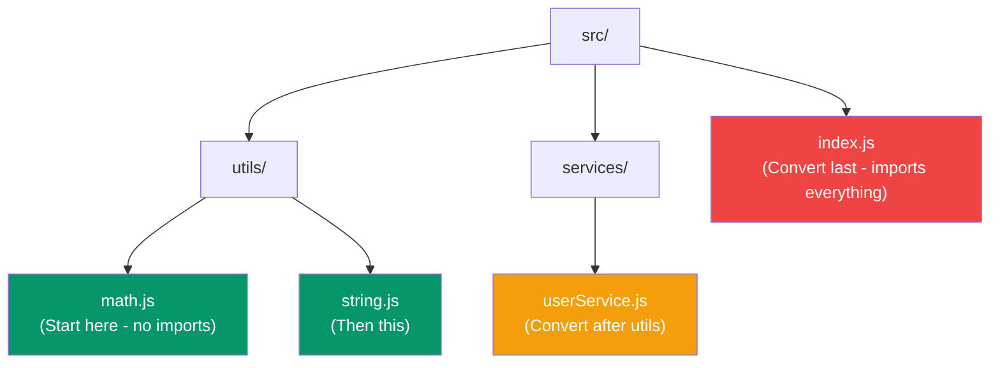

# From JavaScript to TypeScript

## What You'll Learn

- Strategies for migrating existing JavaScript projects to TypeScript
- How to use `allowJs` and `checkJs` for gradual migration
- How to leverage `@ts-check` comments in JavaScript files
- Common migration patterns for React, Node.js, and Express projects
- How to adopt TypeScript incrementally without rewriting everything
- Dealing with third-party libraries without types

---

## Why Migrate?

You're reading this because you're convinced TypeScript is valuable. But you have an existing JavaScript codebase. Good news: **you don't need to rewrite everything at once**.

TypeScript is designed for gradual adoption. You can:
1. Start with JavaScript files and enable basic checking
2. Rename files one at a time from `.js` to `.ts`
3. Add types incrementally, starting with `any` and tightening later
4. Mix `.js` and `.ts` files in the same project

---

## Migration Strategy Overview

### The 3-Phase Approach

**Phase 1: Enable Type Checking on JavaScript**
- Use `allowJs` and `checkJs` compiler options
- Add `@ts-check` comments to individual files
- Fix basic type errors without changing file extensions

**Phase 2: Convert Files to TypeScript**
- Rename `.js` → `.ts` incrementally (start with leaf nodes)
- Add explicit type annotations to function signatures
- Replace JSDoc comments with TypeScript types

**Phase 3: Enable Strict Mode**
- Turn on `strict` in `tsconfig.json`
- Fix remaining type errors
- Remove `any` types and improve type coverage

> **Coming from JavaScript:** Think of migration like adding tests to legacy code — start small, build confidence, then expand.

---

## Phase 1: Type Checking JavaScript

### Step 1: Install TypeScript

```bash
npm install --save-dev typescript
npx tsc --init
```

### Step 2: Configure `tsconfig.json` for JavaScript

```json
{
  "compilerOptions": {
    "target": "ES2020",
    "module": "commonjs",
    "allowJs": true,           // ✅ Allow .js files
    "checkJs": false,          // Don't check all JS files yet
    "outDir": "./dist",
    "rootDir": "./src",
    "esModuleInterop": true,
    "skipLibCheck": true,
    "forceConsistentCasingInFileNames": true,
    "noEmit": false            // Generate output files
  },
  "include": ["src/**/*"],
  "exclude": ["node_modules"]
}
```

### Step 3: Use `@ts-check` for Individual Files

Add a comment at the top of any `.js` file to enable type checking:

```javascript
// @ts-check

/**
 * @param {number} a
 * @param {number} b
 * @returns {number}
 */
function add(a, b) {
  return a + b;
}

add(5, 10);      // ✅ OK
add("5", 10);    // ❌ Error: Argument of type 'string' is not assignable to parameter of type 'number'
```

This gives you TypeScript's benefits **without changing file extensions**.

### Step 4: Fix Errors Gradually

```javascript
// @ts-check

function getUser(id) {
  // ❌ Error: 'id' is implicitly 'any'
  return { id: id, name: "Alice" };
}

// ✅ Fix with JSDoc
/**
 * @param {number} id
 * @returns {{ id: number; name: string }}
 */
function getUser2(id) {
  return { id: id, name: "Alice" };
}
```

---

## Phase 2: Converting Files to TypeScript

### Start with Leaf Nodes

**Leaf nodes** are files that don't import other files in your project — utility functions, constants, types.



### Rename `.js` → `.ts`

```bash
# Before
src/utils/math.js

# After
src/utils/math.ts
```

### Add Type Annotations

**Before (JavaScript):**
```javascript
// math.js
export function add(a, b) {
  return a + b;
}

export function multiply(a, b) {
  return a * b;
}
```

**After (TypeScript):**
```typescript
// math.ts
export function add(a: number, b: number): number {
  return a + b;
}

export function multiply(a: number, b: number): number {
  return a * b;
}
```

### Convert Complex Objects

**Before (JavaScript with JSDoc):**
```javascript
// @ts-check

/**
 * @typedef {Object} User
 * @property {number} id
 * @property {string} name
 * @property {string} email
 * @property {boolean} isActive
 */

/**
 * @param {User} user
 * @returns {string}
 */
function greetUser(user) {
  return `Hello, ${user.name}!`;
}
```

**After (TypeScript):**
```typescript
interface User {
  id: number;
  name: string;
  email: string;
  isActive: boolean;
}

function greetUser(user: User): string {
  return `Hello, ${user.name}!`;
}
```

Much cleaner!

---

## Common Migration Patterns

### Pattern 1: Node.js/Express Backend

**Before (JavaScript):**
```javascript
// server.js
const express = require("express");
const app = express();

app.get("/api/users/:id", (req, res) => {
  const userId = req.params.id;
  // ... fetch user
  res.json({ id: userId, name: "Alice" });
});

app.listen(3000, () => {
  console.log("Server running on port 3000");
});
```

**After (TypeScript):**
```typescript
// server.ts
import express, { Request, Response } from "express";

const app = express();

app.get("/api/users/:id", (req: Request, res: Response) => {
  const userId = req.params.id;
  // ... fetch user
  res.json({ id: userId, name: "Alice" });
});

app.listen(3000, () => {
  console.log("Server running on port 3000");
});
```

Install types for Express:
```bash
npm install --save-dev @types/express @types/node
```

### Pattern 2: React Components

**Before (JavaScript):**
```jsx
// Button.jsx
import React from "react";

export function Button({ label, onClick, disabled }) {
  return (
    <button onClick={onClick} disabled={disabled}>
      {label}
    </button>
  );
}
```

**After (TypeScript):**
```tsx
// Button.tsx
import React from "react";

interface ButtonProps {
  label: string;
  onClick: () => void;
  disabled?: boolean;
}

export function Button({ label, onClick, disabled = false }: ButtonProps) {
  return (
    <button onClick={onClick} disabled={disabled}>
      {label}
    </button>
  );
}
```

Install React types:
```bash
npm install --save-dev @types/react @types/react-dom
```

Update `tsconfig.json`:
```json
{
  "compilerOptions": {
    "jsx": "react-jsx",  // or "react" for older React versions
    // ... other options
  }
}
```

### Pattern 3: Async/Await and Promises

**Before (JavaScript):**
```javascript
async function fetchUser(id) {
  const response = await fetch(`/api/users/${id}`);
  const user = await response.json();
  return user;
}
```

**After (TypeScript):**
```typescript
interface User {
  id: number;
  name: string;
  email: string;
}

async function fetchUser(id: number): Promise<User> {
  const response = await fetch(`/api/users/${id}`);
  const user: User = await response.json();
  return user;
}
```

---

## Handling Third-Party Libraries

### Libraries with Built-In Types

Many popular libraries ship with TypeScript types:
- `express` (requires `@types/express`)
- `react` (requires `@types/react`)
- `lodash` (requires `@types/lodash`)
- `axios` (types included)

### Installing Type Definitions

```bash
# Check if types are available
npm search @types/library-name

# Install types
npm install --save-dev @types/express
npm install --save-dev @types/node
npm install --save-dev @types/jest
```

### Libraries Without Types

If no types exist, you have 3 options:

**Option 1: Declare module as `any`**
```typescript
// Create a file: src/types/custom.d.ts
declare module "some-untyped-library" {
  const lib: any;
  export default lib;
}

// Now you can import it
import lib from "some-untyped-library";
```

**Option 2: Write Your Own Types**
```typescript
// src/types/custom.d.ts
declare module "some-library" {
  export function doSomething(arg: string): number;
  export interface Config {
    apiKey: string;
    timeout: number;
  }
}
```

**Option 3: Use JSDoc in `.d.ts` Files**
```typescript
// src/types/some-library.d.ts
declare module "some-library" {
  export function doSomething(arg: string): number;
}
```

---

## Incremental Strictness

Start loose, tighten gradually:

### Stage 1: Basic Types (No Strict Mode)

```json
{
  "compilerOptions": {
    "strict": false,
    "noImplicitAny": false,
    "strictNullChecks": false
  }
}
```

Allow `any` everywhere. Just get the project compiling.

### Stage 2: Enable `noImplicitAny`

```json
{
  "compilerOptions": {
    "strict": false,
    "noImplicitAny": true,  // ✅ Turn this on
    "strictNullChecks": false
  }
}
```

Now you must annotate types. Use `any` explicitly where needed:

```typescript
// ❌ Error: Parameter 'data' implicitly has an 'any' type
function process(data) {
  return data;
}

// ✅ Explicit any
function process2(data: any): any {
  return data;
}
```

### Stage 3: Enable `strictNullChecks`

```json
{
  "compilerOptions": {
    "strict": false,
    "noImplicitAny": true,
    "strictNullChecks": true  // ✅ Turn this on
  }
}
```

Now handle `null` and `undefined`:

```typescript
function getUser(id: number): User | null {
  // ... might return null
}

const user = getUser(1);

// ❌ Error: Object is possibly 'null'
// console.log(user.name);

// ✅ Check first
if (user) {
  console.log(user.name);
}
```

### Stage 4: Full Strict Mode

```json
{
  "compilerOptions": {
    "strict": true  // ✅ All strict checks enabled
  }
}
```

This enables:
- `noImplicitAny`
- `strictNullChecks`
- `strictFunctionTypes`
- `strictPropertyInitialization`
- `noImplicitThis`
- `alwaysStrict`

---

## Dealing with `any` During Migration

### When `any` is Acceptable

```typescript
// ✅ Legacy code you'll fix later
function legacyParser(data: any): any {
  // TODO: Add proper types
  return data;
}

// ✅ Truly dynamic data
function parseJson(json: string): any {
  return JSON.parse(json);
}

// ✅ Third-party library without types
import UnTypedLib from "untyped-lib";
const result: any = UnTypedLib.doSomething();
```

### Reducing `any` Over Time

1. Search for `any` in your codebase: `grep -r ": any" src/`
2. Replace with `unknown` where possible (forces type checking)
3. Add proper interfaces/types
4. Use `@typescript-eslint/no-explicit-any` ESLint rule to prevent new `any`

---

## Common Migration Pitfalls

### Pitfall 1: Trying to Convert Everything at Once

```typescript
// ❌ Don't do this
// Day 1: Rename all 50 files to .ts
// Day 2: Fix 500 type errors
// Day 3: Give up and revert

// ✅ Do this instead
// Week 1: Convert utils/ folder (5 files)
// Week 2: Convert services/ folder (8 files)
// Week 3: Convert controllers/ folder (10 files)
```

### Pitfall 2: Not Using `allowJs` During Migration

```json
// ❌ Don't force all files to be .ts immediately
{
  "compilerOptions": {
    "allowJs": false  // This blocks migration
  }
}

// ✅ Allow .js and .ts to coexist
{
  "compilerOptions": {
    "allowJs": true
  }
}
```

### Pitfall 3: Enabling Strict Mode Too Early

```json
// ❌ Don't enable strict on day 1
{
  "compilerOptions": {
    "strict": true  // 1000+ errors on existing code
  }
}

// ✅ Enable strict flags incrementally
{
  "compilerOptions": {
    "strict": false,
    "noImplicitAny": true  // Start here
  }
}
```

### Pitfall 4: Ignoring Type Errors with `@ts-ignore`

```typescript
// ❌ Don't silence errors this way
// @ts-ignore
const user = getUserById("invalid");

// ✅ Fix the root cause
const user = getUserById(123);
```

Use `@ts-ignore` **only** as a last resort for broken third-party types.

---

## Migration Checklist

### Pre-Migration
- [ ] Install TypeScript: `npm install --save-dev typescript`
- [ ] Generate `tsconfig.json`: `npx tsc --init`
- [ ] Install type definitions for libraries: `npm install --save-dev @types/node @types/express`, etc.
- [ ] Set `allowJs: true` and `checkJs: false` in `tsconfig.json`

### Phase 1: Enable Checking
- [ ] Add `@ts-check` to a few `.js` files
- [ ] Fix basic type errors
- [ ] Add JSDoc comments for complex types

### Phase 2: Convert Files
- [ ] Identify leaf nodes (files with no imports)
- [ ] Rename `.js` → `.ts` one file at a time
- [ ] Add type annotations to function signatures
- [ ] Convert JSDoc types to TypeScript interfaces/types

### Phase 3: Tighten Strictness
- [ ] Enable `noImplicitAny`
- [ ] Fix all implicit `any` errors
- [ ] Enable `strictNullChecks`
- [ ] Handle `null`/`undefined` cases
- [ ] Enable full `strict` mode
- [ ] Remove remaining `any` types

### Post-Migration
- [ ] Set up ESLint with `@typescript-eslint`
- [ ] Add pre-commit hooks to run `tsc --noEmit`
- [ ] Update CI/CD to run type checking
- [ ] Document TypeScript patterns for your team

---

## Practice Exercises

### Exercise 1: Convert a Simple Module

Take this JavaScript module and convert it to TypeScript:

```javascript
// utils.js
export function capitalize(str) {
  return str.charAt(0).toUpperCase() + str.slice(1);
}

export function sum(numbers) {
  return numbers.reduce((total, num) => total + num, 0);
}

export function findById(items, id) {
  return items.find(item => item.id === id);
}
```

### Exercise 2: Add Types to Express Route

Convert this route handler:

```javascript
app.post("/api/users", (req, res) => {
  const { name, email, age } = req.body;
  
  const user = {
    id: Date.now(),
    name,
    email,
    age,
    createdAt: new Date()
  };
  
  res.status(201).json(user);
});
```

### Exercise 3: Migrate a React Component

Convert this component with proper prop types:

```jsx
function UserCard({ user, onEdit, onDelete }) {
  return (
    <div className="user-card">
      <h3>{user.name}</h3>
      <p>{user.email}</p>
      <button onClick={() => onEdit(user.id)}>Edit</button>
      <button onClick={() => onDelete(user.id)}>Delete</button>
    </div>
  );
}
```

### Exercise 4: Handle Third-Party Library

Create a type definition file for a fictional library:

```javascript
// fictional-library (no types available)
import { doSomething, Config } from "fictional-library";

doSomething({ apiKey: "key", timeout: 5000 });
```

Write a `.d.ts` file to add types for this library.

### Exercise 5: Gradual Strictness

Take a JavaScript function using `any` and progressively add types:

```javascript
function processData(data) {
  return data.map(item => ({
    id: item.id,
    value: item.value * 2,
    name: item.name.toUpperCase()
  }));
}
```

Convert it through these stages:
1. Add basic type annotations (allow `any`)
2. Replace `any` with proper interface
3. Make it work with `strictNullChecks`

---

## Next Steps

Congratulations! You've completed the TypeScript Getting Started guide. You now know:

- How to set up TypeScript projects from scratch
- All basic types (primitives, arrays, tuples, objects)
- How to type functions and create interfaces
- The power of generics for reusable code
- Everyday types (unions, literals, type aliases)
- How to migrate existing JavaScript projects to TypeScript

### Where to Go Next

Explore the other sections in this tutorial series:

1. **[01 — Foundations](../01-foundations/)** — Advanced type system mastery (unions, intersections, mapped types, conditional types)
2. **[02 — OOP in TypeScript](../02-oops-in-typescript/)** — Classes, interfaces, inheritance, design patterns
3. **[03 — TypeScript with React](../03-typescript-with-react/)** — Type-safe frontend development
4. **[04 — TypeScript with Express](../04-typescript-with-express/)** — Backend TypeScript with Express
5. **[05 — NestJS Deep Dive](../05-nestjs/)** — Production-grade backend framework

Keep practicing, and remember: **TypeScript is just JavaScript with types**. You already know most of it!
