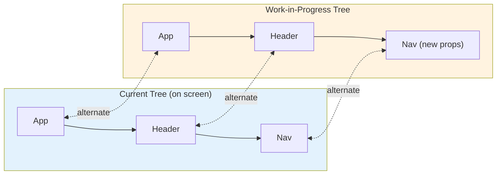
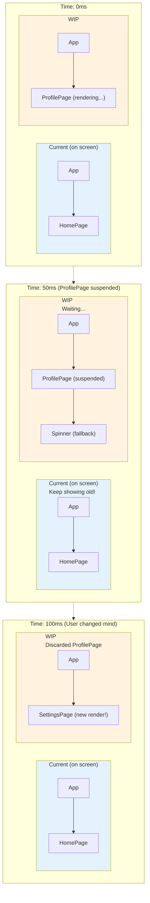
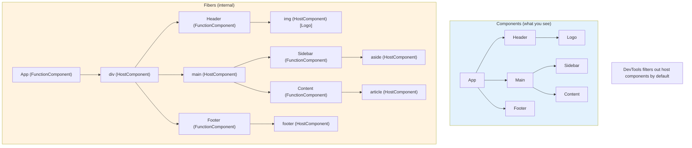

# React Fiber Architecture: A Deep Dive into React's Internals

## Introduction

This is an **advanced tutorial** for experienced React developers who want to understand how React works under the hood. Understanding Fiber architecture will help you write more performant React applications, debug complex issues, and leverage React's concurrent features effectively.

**Prerequisites:**
- Strong understanding of React fundamentals
- Experience with React Hooks
- Familiarity with JavaScript data structures (trees, linked lists)
- Understanding of browser rendering pipeline

**What You'll Learn:**
- The Fiber reconciliation algorithm and how it differs from the original stack reconciler
- How React schedules and prioritizes work
- Internal implementation of Hooks, Suspense, and Concurrent features
- Performance optimization strategies based on Fiber behavior
- Advanced debugging techniques using React DevTools

---

## 1. Introduction to React Fiber

### What is Fiber and Why Was It Created?

**Fiber** is React's reconciliation engine introduced in React 16. It's a complete rewrite of React's core algorithm that enables:

1. **Incremental Rendering**: The ability to split rendering work into chunks and spread it across multiple frames
2. **Pausable Work**: The ability to pause work and resume it later
3. **Priority-based Rendering**: The ability to assign priority to different types of updates
4. **Concurrency**: The ability to work on multiple updates simultaneously (React 18+)

### The Problem Fiber Solves

**Before Fiber (React 15 and earlier):**

```javascript
// Synchronous, non-interruptible reconciliation
function reconcile(element) {
  // Process the entire tree in one go
  processComponent(element);
  element.children.forEach(child => reconcile(child)); // Recursive, blocking
  commitChanges(); // All at once
}
```

**Problems with the Stack Reconciler:**
- **Blocking**: Once reconciliation started, it couldn't be interrupted
- **Frame drops**: Large component trees could block the main thread for 100ms+, causing janky animations
- **No prioritization**: All updates had the same priority
- **Synchronous**: CPU-bound work blocked user interactions

**Example of the problem:**

```javascript
function HeavyComponent() {
  // Imagine this renders 10,000 items
  const items = Array.from({ length: 10000 }, (_, i) => i);
  
  return (
    <div>
      {items.map(item => (
        <ExpensiveItem key={item} value={item} />
      ))}
    </div>
  );
}

// In React 15: Typing in an input would freeze while this updates
// The entire tree must be processed synchronously
```

### Reconciliation Algorithm Evolution

| Feature | Stack Reconciler (≤15) | Fiber Reconciler (16+) |
|---------|----------------------|----------------------|
| Algorithm | Recursive, synchronous | Iterative, asynchronous |
| Interruptible | ❌ No | ✅ Yes |
| Priority | ❌ No | ✅ Yes |
| Time slicing | ❌ No | ✅ Yes |
| Concurrent rendering | ❌ No | ✅ Yes (React 18+) |
| Implementation | Call stack | Linked list of fibers |

### Virtual DOM vs Fiber

**Virtual DOM** is a programming concept, **Fiber** is an implementation detail:

```javascript
// Virtual DOM: A plain JavaScript object representation of DOM
const vdom = {
  type: 'div',
  props: { className: 'container' },
  children: [
    { type: 'h1', props: {}, children: ['Hello'] },
    { type: 'p', props: {}, children: ['World'] }
  ]
};

// Fiber: A data structure (linked list node) that contains:
// 1. Component information (type, props, state)
// 2. Pointers to other fibers (parent, child, sibling)
// 3. Work tracking (effects, priority, alternate)
// 4. Hooks storage
const fiber = {
  type: 'div',
  props: { className: 'container' },
  stateNode: domNode,        // Actual DOM node
  child: h1Fiber,             // First child
  sibling: null,              // Next sibling
  return: parentFiber,        // Parent
  alternate: oldFiber,        // Previous version
  effectTag: 'UPDATE',        // What changed
  memoizedState: null,        // Hooks live here
  pendingProps: { ... },      // New props
  memoizedProps: { ... },     // Old props
  // ... more fields
};
```

---

## 2. Fiber Data Structure

### Anatomy of a Fiber Node

A Fiber is a JavaScript object that represents a unit of work. Here's a simplified TypeScript representation:

```typescript
interface Fiber {
  // Identity
  type: string | Function | Symbol;  // 'div', MyComponent, Fragment
  key: string | null;
  elementType: any;
  
  // Fiber relationships (linked list structure)
  return: Fiber | null;     // Parent fiber
  child: Fiber | null;      // First child
  sibling: Fiber | null;    // Next sibling
  index: number;            // Position among siblings
  
  // Work tracking
  pendingProps: any;        // New props from React elements
  memoizedProps: any;       // Props used in last render
  memoizedState: any;       // State used in last render (Hooks chain)
  dependencies: any;        // Context dependencies
  
  // Effects
  flags: number;            // Bitfield for effect tags (Update, Placement, Deletion)
  subtreeFlags: number;     // Effects in subtree
  deletions: Fiber[] | null;
  nextEffect: Fiber | null; // Next fiber with effects
  
  // Alternate (double buffering)
  alternate: Fiber | null;  // Work-in-progress ↔ current
  
  // State management
  updateQueue: UpdateQueue | null;
  
  // DOM
  stateNode: any;          // DOM node, class instance, or null
  
  // Scheduling
  lanes: number;           // Priority lanes
  childLanes: number;      // Priority in subtree
  
  // Profiling
  actualDuration: number;
  actualStartTime: number;
  selfBaseDuration: number;
  treeBaseDuration: number;
}
```

### Work-in-Progress Tree vs Current Tree (Double Buffering)

React maintains **two fiber trees** simultaneously:



**Why double buffering?**

```javascript
// 1. User triggers update
function handleClick() {
  setState(newValue); // Creates update on current tree
}

// 2. React clones affected fibers to work-in-progress tree
const workInProgress = createWorkInProgress(current);
workInProgress.pendingProps = newProps;

// 3. Work on WIP tree (can be interrupted/discarded)
while (workInProgress !== null && shouldYield() === false) {
  workInProgress = performUnitOfWork(workInProgress);
}

// 4. Once complete, atomically swap pointers
if (workCompleted) {
  // Swap the root pointers
  fiberRoot.current = fiberRoot.finishedWork;
  // Now the WIP tree becomes current, old current becomes WIP
}
```

**Benefits:**
- ✅ Can discard incomplete work without affecting what's on screen
- ✅ Can pause and resume work
- ✅ Can work on multiple updates with different priorities
- ✅ Enables concurrent rendering

### Effect List (Fiber's Optimization)

Instead of walking the entire tree during commit, React builds a **linear list of fibers with effects**:

```javascript
// During reconciliation, fibers with effects are linked
function completeWork(fiber) {
  // If this fiber has effects (Update, Placement, Deletion)
  if (fiber.flags !== NoFlags) {
    // Add to parent's effect list
    if (returnFiber.lastEffect !== null) {
      returnFiber.lastEffect.nextEffect = fiber;
    } else {
      returnFiber.firstEffect = fiber;
    }
    returnFiber.lastEffect = fiber;
  }
}

// During commit, walk the linear list
function commitMutationEffects(root) {
  let nextEffect = root.firstEffect;
  
  while (nextEffect !== null) {
    const flags = nextEffect.flags;
    
    if (flags & Placement) {
      commitPlacement(nextEffect);
    }
    if (flags & Update) {
      commitUpdate(nextEffect);
    }
    if (flags & Deletion) {
      commitDeletion(nextEffect);
    }
    
    nextEffect = nextEffect.nextEffect; // Linear traversal!
  }
}
```

**Effect list visualization:**

```
Fiber Tree:                    Effect List (linear):
    App                        
     ├─ Header                 Header → Nav → Button → Footer
     ├─ Nav (updated)          (Only nodes with effects)
     │   └─ Button (new)       
     └─ Footer (updated)       
```

### Priority Levels (Lanes)

React 18+ uses a **lanes** model for priority:

```typescript
// Simplified lanes (bit flags)
const NoLanes = 0b0000000000000000;
const SyncLane = 0b0000000000000001;              // Sync (discrete events)
const InputContinuousLane = 0b0000000000000100;   // Continuous input
const DefaultLane = 0b0000000000010000;           // Normal updates
const TransitionLane1 = 0b0000000001000000;       // startTransition
const IdleLane = 0b0100000000000000;              // Idle work

// Example: Click handler gets SyncLane
function handleClick() {
  // This update gets SyncLane (highest priority)
  setState(newValue);
}

// Example: startTransition gets TransitionLane
function handleChange(e) {
  setValue(e.target.value); // SyncLane (user input must be responsive)
  startTransition(() => {
    setSearchResults(search(e.target.value)); // TransitionLane (can be interrupted)
  });
}
```

### Fiber Tree Traversal

React uses **iterative depth-first traversal**:

```javascript
function workLoopConcurrent() {
  // Work until we run out of time or work
  while (workInProgress !== null && !shouldYield()) {
    workInProgress = performUnitOfWork(workInProgress);
  }
}

function performUnitOfWork(unitOfWork) {
  const current = unitOfWork.alternate;
  
  // 1. Begin work on this fiber
  let next = beginWork(current, unitOfWork);
  
  // 2. If there's child work, return it
  if (next !== null) {
    return next; // Continue with child
  }
  
  // 3. No more child work, complete this unit
  completeUnitOfWork(unitOfWork);
}

function completeUnitOfWork(unitOfWork) {
  let completedWork = unitOfWork;
  
  do {
    // Complete this fiber
    completeWork(completedWork);
    
    // If there's a sibling, work on it next
    const siblingFiber = completedWork.sibling;
    if (siblingFiber !== null) {
      return siblingFiber;
    }
    
    // No sibling, go back to parent
    completedWork = completedWork.return;
  } while (completedWork !== null);
  
  return null; // Reached root
}
```

**Traversal example:**

```
     1. App (begin)
     ├─ 2. Header (begin)
     │   └─ 3. Logo (begin → complete)
     │   4. Header (complete)
     ├─ 5. Main (begin)
     │   ├─ 6. Sidebar (begin → complete)
     │   └─ 7. Content (begin → complete)
     │   8. Main (complete)
     └─ 9. Footer (begin → complete)
     10. App (complete)

Order: Begin child, complete siblings, then parent
```

---

## 3. Reconciliation Process

### Render Phase vs Commit Phase

React's reconciliation happens in **two phases**:

```javascript
// ========================================
// RENDER PHASE (interruptible, async)
// ========================================
function renderPhase() {
  // Can be called multiple times
  // Can be paused and resumed
  // No side effects allowed
  
  workInProgress = createWorkInProgress(currentRoot);
  
  while (workInProgress !== null && !shouldYield()) {
    // Call render functions, compare props
    workInProgress = performUnitOfWork(workInProgress);
  }
  
  // Build effect list during this phase
}

// ========================================
// COMMIT PHASE (synchronous, blocking)
// ========================================
function commitPhase() {
  // Called exactly once
  // Cannot be interrupted
  // Side effects happen here
  
  // Sub-phases:
  // 1. Before Mutation
  commitBeforeMutationEffects(finishedWork);
  
  // 2. Mutation (DOM changes)
  commitMutationEffects(finishedWork);
  
  // Swap tree pointers (WIP becomes current)
  root.current = finishedWork;
  
  // 3. Layout (useLayoutEffect)
  commitLayoutEffects(finishedWork);
  
  // useEffect scheduled to run after paint
  schedulePassiveEffects(finishedWork);
}
```

**Phase comparison:**

| Aspect | Render Phase | Commit Phase |
|--------|--------------|--------------|
| Can interrupt? | ✅ Yes | ❌ No |
| Can call multiple times? | ✅ Yes | ❌ No (once) |
| Side effects? | ❌ No | ✅ Yes |
| Component lifecycle | render, getDerivedStateFromProps | componentDidMount, componentDidUpdate |
| Hooks called | All hooks | useLayoutEffect, useEffect (scheduled) |
| Duration | Can be slow | Must be fast |

### How Updates Are Scheduled

```typescript
// 1. User interaction creates update
function dispatchSetState(fiber, queue, action) {
  // Create update object
  const update = {
    lane: requestUpdateLane(fiber),  // Determine priority
    action: action,
    next: null,
  };
  
  // Enqueue update
  enqueueUpdate(fiber, queue, update);
  
  // Schedule work on the root
  scheduleUpdateOnFiber(fiber, lane);
}

// 2. Schedule work on the fiber root
function scheduleUpdateOnFiber(fiber, lane) {
  // Mark all ancestors with this lane
  markUpdateLaneFromFiberToRoot(fiber, lane);
  
  // Schedule work based on priority
  if (lane === SyncLane) {
    // Sync: schedule immediately
    scheduleSyncCallback(performSyncWorkOnRoot.bind(null, root));
    flushSyncCallbacks();
  } else {
    // Concurrent: schedule with React Scheduler
    scheduleCallback(
      priorityLevel,
      performConcurrentWorkOnRoot.bind(null, root)
    );
  }
}

// 3. Process update queue
function processUpdateQueue(fiber) {
  const queue = fiber.updateQueue;
  let firstUpdate = queue.firstUpdate;
  let newState = fiber.memoizedState;
  
  // Process updates in order
  let update = firstUpdate;
  while (update !== null) {
    newState = getStateFromUpdate(update, newState);
    update = update.next;
  }
  
  fiber.memoizedState = newState;
}
```

### Priority and Scheduling

React uses the **Scheduler** package to manage work:

```javascript
// React Scheduler priority levels
const ImmediatePriority = 1;  // 250ms timeout
const UserBlockingPriority = 2; // 250ms timeout  
const NormalPriority = 3;     // 5s timeout
const LowPriority = 4;        // 10s timeout
const IdlePriority = 5;       // Never expires

// Example: Multiple updates with different priorities
function App() {
  const [urgent, setUrgent] = useState(0);
  const [deferred, setDeferred] = useState(0);
  
  function handleClick() {
    // High priority: sync
    setUrgent(u => u + 1);
    
    // Low priority: can be interrupted
    startTransition(() => {
      setDeferred(d => d + 1);
    });
  }
  
  return (
    <div onClick={handleClick}>
      <div>Urgent: {urgent}</div>
      <ExpensiveComponent count={deferred} />
    </div>
  );
}

// Behind the scenes:
// 1. setUrgent creates update with SyncLane
// 2. setDeferred (in transition) creates update with TransitionLane
// 3. React processes SyncLane first
// 4. If user clicks again, TransitionLane work is interrupted and restarted
```

### Time Slicing

React breaks work into **5ms chunks** (by default):

```javascript
function workLoopConcurrent() {
  // Perform work in chunks
  while (workInProgress !== null && !shouldYield()) {
    performUnitOfWork(workInProgress);
  }
}

function shouldYield() {
  const currentTime = getCurrentTime();
  
  // Deadline exceeded?
  if (currentTime >= deadline) {
    // Check if browser needs to do work
    if (needsPaint || hasUserInput) {
      return true; // Yield to browser
    }
  }
  
  return false;
}

// Visualization over time:
// |React work|Browser|React work|Browser|React work|Commit|
// |   5ms    | paint |   5ms    | input |   5ms    | DOM  |
//             ↑ Yielded         ↑ Yielded           ↑ Done
```

**Example: Time slicing in action**

```javascript
function HeavyList({ items }) {
  // Rendering 10,000 items
  return (
    <div>
      {items.map(item => (
        <ExpensiveItem key={item.id} data={item} />
      ))}
    </div>
  );
}

// Without time slicing (React 15):
// User types → Freeze for 200ms → See text → Bad UX

// With time slicing (React 18):
// User types → See text immediately → List updates in background
// React work: [chunk][chunk][chunk][chunk][chunk][commit]
//             5ms    5ms    5ms    5ms    5ms     fast
//                ↑      ↑      ↑      ↑
//            Browser gets control to update input
```

### Cooperative Scheduling

React cooperates with the browser instead of blocking it:

```javascript
// React's scheduling strategy
function ensureRootIsScheduled(root) {
  // Find highest priority lane with pending work
  const nextLanes = getNextLanes(root);
  
  if (nextLanes === NoLanes) {
    return; // Nothing to do
  }
  
  // Determine priority
  const newCallbackPriority = getHighestPriorityLane(nextLanes);
  
  // Schedule callback with appropriate priority
  if (includesSyncLane(nextLanes)) {
    // Sync work: microtask queue
    scheduleSyncCallback(performSyncWorkOnRoot);
    scheduleMicrotask(flushSyncCallbacks);
  } else {
    // Concurrent work: scheduler
    const schedulerPriority = lanesToSchedulerPriority(nextLanes);
    scheduleCallback(
      schedulerPriority,
      performConcurrentWorkOnRoot.bind(null, root)
    );
  }
}

// The scheduler uses MessageChannel for time slicing
const channel = new MessageChannel();
const port = channel.port2;

channel.port1.onmessage = () => {
  // Continue work after yielding
  workLoop();
};

function schedulePerformWorkUntilDeadline() {
  port.postMessage(null); // Yields to browser event loop
}
```

---

## 4. Fiber and Concurrent Features

### How Suspense Works Internally

Suspense uses **promise throwing** to suspend rendering:

```javascript
// Component that suspends
function ProfilePage({ userId }) {
  const user = use(fetchUser(userId)); // Suspends if not ready
  return <div>{user.name}</div>;
}

// What happens under the hood
function use(promise) {
  const status = promise.status;
  
  if (status === 'fulfilled') {
    return promise.value; // Data ready
  }
  
  if (status === 'rejected') {
    throw promise.reason; // Error boundary catches this
  }
  
  // Status is 'pending'
  throw promise; // Suspense boundary catches this!
}

// React's handling in beginWork
function beginWork(current, workInProgress) {
  try {
    // Render component
    const children = renderComponent(workInProgress);
    return children;
  } catch (thrownValue) {
    // Is it a promise or thenable?
    if (typeof thrownValue?.then === 'function') {
      // Suspend!
      return handleSuspense(thrownValue, workInProgress);
    }
    // Regular error
    throw thrownValue;
  }
}

function handleSuspense(thenable, suspendedFiber) {
  // Find nearest Suspense boundary
  const suspenseBoundary = findSuspenseBoundary(suspendedFiber);
  
  // Mark it as suspended
  suspenseBoundary.lanes = markSuspended(suspenseBoundary.lanes);
  
  // Attach then callback
  thenable.then(
    () => {
      // Data loaded, retry render
      retryTimedOutBoundary(suspenseBoundary);
    },
    () => {
      // Error, show error boundary
      retrySuspendedRoot(suspenseBoundary);
    }
  );
  
  // Show fallback
  return suspenseBoundary.child; // The fallback fiber
}
```

**Suspense boundary fiber structure:**

```typescript
interface SuspenseFiber extends Fiber {
  type: typeof Suspense;
  pendingProps: {
    fallback: ReactNode;
    children: ReactNode;
  };
  // Special fields
  suspenseState: {
    dehydrated: null | DehydratedFragment;
    retryLane: Lane;
  } | null;
}

// Example usage
<Suspense fallback={<Spinner />}>
  <ProfilePage userId={123} />
</Suspense>

// Fiber structure:
// SuspenseFiber
//  ├─ fallback (Spinner) - shown when suspended
//  └─ children (ProfilePage) - primary content
```

### Transitions Implementation

`startTransition` marks updates as non-urgent:

```typescript
// startTransition API
function startTransition(callback: () => void) {
  const previousPriority = getCurrentUpdatePriority();
  
  try {
    // Set priority to transition
    setCurrentUpdatePriority(TransitionPriority);
    callback(); // Any setState calls here get TransitionLane
  } finally {
    // Restore previous priority
    setCurrentUpdatePriority(previousPriority);
  }
}

// Example: Search input
function SearchPage() {
  const [query, setQuery] = useState('');
  const [results, setResults] = useState([]);
  
  function handleChange(e) {
    const value = e.target.value;
    setQuery(value); // Urgent: SyncLane
    
    startTransition(() => {
      setResults(search(value)); // Non-urgent: TransitionLane
    });
  }
  
  return (
    <>
      <input value={query} onChange={handleChange} />
      <SearchResults results={results} />
    </>
  );
}

// What happens:
// 1. User types 'a'
//    - setQuery('a') → SyncLane → renders immediately
//    - setResults() → TransitionLane → starts rendering
// 2. User types 'ab' (before results for 'a' are done)
//    - setQuery('ab') → SyncLane → renders immediately
//    - Previous TransitionLane work is discarded!
//    - New setResults() → TransitionLane → starts fresh
// Result: Input stays responsive, results update when ready
```

### useTransition and useDeferredValue Internals

```typescript
// useTransition implementation
function useTransition(): [boolean, (callback: () => void) => void] {
  const [isPending, setIsPending] = useState(false);
  
  const startTransition = useCallback((callback) => {
    setIsPending(true); // Sync update
    
    startTransition(() => {
      callback(); // Transition updates
      setIsPending(false); // Sync update when done
    });
  }, []);
  
  return [isPending, startTransition];
}

// useDeferredValue implementation (simplified)
function useDeferredValue<T>(value: T): T {
  const [deferredValue, setDeferredValue] = useState(value);
  
  useEffect(() => {
    startTransition(() => {
      setDeferredValue(value); // Deferred update
    });
  }, [value]);
  
  return deferredValue;
}

// Usage example
function App() {
  const [text, setText] = useState('');
  const deferredText = useDeferredValue(text);
  
  // text updates immediately (SyncLane)
  // deferredText updates later (TransitionLane)
  
  return (
    <>
      <input value={text} onChange={e => setText(e.target.value)} />
      <Suspense fallback={<Spinner />}>
        <ExpensiveList searchText={deferredText} />
      </Suspense>
    </>
  );
}
```

### Concurrent Rendering

React 18+ can work on multiple versions of the UI simultaneously:

```javascript
// Concurrent rendering scenario
function App() {
  const [tab, setTab] = useState('home');
  
  function switchTab(newTab) {
    startTransition(() => {
      setTab(newTab);
    });
  }
  
  return (
    <>
      <Tabs onChange={switchTab} />
      <Suspense fallback={<Spinner />}>
        {tab === 'home' && <HomePage />}
        {tab === 'profile' && <ProfilePage />}
      </Suspense>
    </>
  );
}

// What happens when switching from home → profile:
// 
// Time 0ms: User clicks "Profile" tab
//   - Current tree: showing HomePage
//   - WIP tree: starts rendering ProfilePage (TransitionLane)
// 
// Time 50ms: ProfilePage suspends (data not ready)
//   - Current tree: still showing HomePage (user sees old content)
//   - WIP tree: paused, waiting for data
// 
// Time 100ms: User clicks "Settings" tab
//   - Current tree: still showing HomePage
//   - WIP tree: discards ProfilePage, starts SettingsPage
// 
// Time 200ms: SettingsPage ready
//   - Commit phase: swap trees atomically
//   - User sees SettingsPage (never saw loading spinner!)
```

**Memory layout during concurrent rendering:**



### Yielding to the Browser

React yields control back to the browser frequently:

```javascript
// React's work loop
function workLoopConcurrent() {
  while (workInProgress !== null && !shouldYield()) {
    performUnitOfWork(workInProgress);
  }
}

// Yielding logic
function shouldYield() {
  const currentTime = performance.now();
  
  if (currentTime >= deadline) {
    // Time slice expired (5ms)
    
    // Check if browser needs control
    if (navigator.scheduling?.isInputPending?.()) {
      return true; // User input waiting
    }
    
    if (needsPaint) {
      return true; // Browser wants to paint
    }
  }
  
  return false;
}

// Visualization:
// ┌──────────────────────────────────────────────────────┐
// │ 60 FPS = 16.67ms per frame                          │
// ├──────────────────────────────────────────────────────┤
// │ Frame 1: [React 5ms][Paint 2ms][Idle 9ms]           │
// │ Frame 2: [React 5ms][Paint 2ms][Idle 9ms]           │
// │ Frame 3: [React 5ms][Paint 2ms][Idle 9ms]           │
// │ Frame 4: [Commit 3ms][Paint 2ms][Idle 11ms]         │
// └──────────────────────────────────────────────────────┘
// Result: Smooth 60 FPS while rendering!
```

---

## 5. Hooks Implementation

### How Hooks Are Stored in Fiber

Hooks are stored as a **linked list** on the fiber's `memoizedState`:

```typescript
// Hook data structure
interface Hook {
  memoizedState: any;     // Current state
  baseState: any;         // State before updates
  baseQueue: Update | null;
  queue: UpdateQueue | null;
  next: Hook | null;      // Next hook in list
}

// Fiber's memoizedState points to first hook
interface Fiber {
  memoizedState: Hook | null; // First hook in chain
  // ...
}

// Example component
function MyComponent() {
  const [count, setCount] = useState(0);        // Hook 1
  const [name, setName] = useState('');         // Hook 2
  useEffect(() => { /* ... */ }, [count]);      // Hook 3
  const ref = useRef(null);                     // Hook 4
  
  // ...
}

// Fiber structure in memory:
// myComponentFiber.memoizedState → Hook1 → Hook2 → Hook3 → Hook4 → null
//                                  (count)  (name)  (effect) (ref)
```

### Hook Rules Explained Through Internals

**Rule 1: Only call hooks at the top level**

```javascript
// ❌ WRONG: Conditional hook
function BadComponent({ condition }) {
  const [count, setCount] = useState(0);
  
  if (condition) {
    const [name, setName] = useState(''); // Hook 2 is conditional!
  }
  
  useEffect(() => {}, []); // Hook 3 (or 2 if condition is false)
  
  return <div>{count}</div>;
}

// What happens:
// Render 1 (condition = true):
// Hook chain: useState(count) → useState(name) → useEffect
//             ↑ Index 0         ↑ Index 1        ↑ Index 2

// Render 2 (condition = false):
// Hook chain: useState(count) → useEffect
//             ↑ Index 0         ↑ Index 1
// React tries to read Hook 1, expects useState(name), finds useEffect!
// ERROR: Hook order changed!

// ✅ CORRECT: Unconditional hooks
function GoodComponent({ condition }) {
  const [count, setCount] = useState(0);
  const [name, setName] = useState(condition ? '' : null);
  useEffect(() => {}, []);
  
  return <div>{count}</div>;
}
```

**How React enforces this:**

```javascript
let currentlyRenderingFiber = null;
let currentHook = null;
let workInProgressHook = null;

function renderWithHooks(current, workInProgress, Component, props) {
  currentlyRenderingFiber = workInProgress;
  workInProgress.memoizedState = null; // Reset hooks
  
  // Different hook dispatcher for mount vs update
  ReactCurrentDispatcher.current = 
    current === null ? HooksDispatcherOnMount : HooksDispatcherOnUpdate;
  
  // Call component
  let children = Component(props);
  
  // Reset
  currentlyRenderingFiber = null;
  currentHook = null;
  workInProgressHook = null;
  
  return children;
}

// Mount dispatcher (first render)
const HooksDispatcherOnMount = {
  useState: mountState,
  useEffect: mountEffect,
  // ...
};

// Update dispatcher (re-renders)
const HooksDispatcherOnUpdate = {
  useState: updateState,
  useEffect: updateEffect,
  // ...
};
```

**Rule 2: Only call hooks from React functions**

```javascript
// Why this rule exists:
let globalHookIndex = 0; // ❌ Would need global state

function outsideReact() {
  // ❌ No currentlyRenderingFiber!
  const [state] = useState(0); // Where to store hook?
}

function InsideReact() {
  // ✅ currentlyRenderingFiber is set
  const [state] = useState(0); // Stored on fiber.memoizedState
}
```

### useState Implementation Details

```javascript
// Mounting phase
function mountState(initialState) {
  // Create new hook object
  const hook = mountWorkInProgressHook();
  
  // Initialize state
  if (typeof initialState === 'function') {
    initialState = initialState(); // Lazy initialization
  }
  
  hook.memoizedState = hook.baseState = initialState;
  
  // Create update queue
  const queue = {
    pending: null,
    dispatch: null,
    lastRenderedReducer: basicStateReducer,
    lastRenderedState: initialState,
  };
  hook.queue = queue;
  
  // Create dispatch function
  const dispatch = (queue.dispatch = dispatchSetState.bind(
    null,
    currentlyRenderingFiber,
    queue
  ));
  
  return [hook.memoizedState, dispatch];
}

// Update phase
function updateState(initialState) {
  return updateReducer(basicStateReducer);
}

function updateReducer(reducer) {
  const hook = updateWorkInProgressHook();
  const queue = hook.queue;
  
  // Process update queue
  let baseQueue = hook.baseQueue;
  let pendingQueue = queue.pending;
  
  if (pendingQueue !== null) {
    // Merge queues
    if (baseQueue !== null) {
      // Circular list magic
      let baseFirst = baseQueue.next;
      let pendingFirst = pendingQueue.next;
      baseQueue.next = pendingFirst;
      pendingQueue.next = baseFirst;
    }
    hook.baseQueue = baseQueue = pendingQueue;
    queue.pending = null;
  }
  
  // Calculate new state
  if (baseQueue !== null) {
    const first = baseQueue.next;
    let newState = hook.baseState;
    let update = first;
    
    do {
      // Apply update
      const action = update.action;
      newState = reducer(newState, action);
      update = update.next;
    } while (update !== null && update !== first);
    
    hook.memoizedState = newState;
    hook.baseState = newState;
  }
  
  const dispatch = queue.dispatch;
  return [hook.memoizedState, dispatch];
}

// Dispatch function
function dispatchSetState(fiber, queue, action) {
  const lane = requestUpdateLane(fiber);
  
  const update = {
    lane,
    action,
    next: null,
  };
  
  // Add to circular linked list
  const pending = queue.pending;
  if (pending === null) {
    update.next = update; // Point to itself
  } else {
    update.next = pending.next;
    pending.next = update;
  }
  queue.pending = update;
  
  // Schedule update
  scheduleUpdateOnFiber(fiber, lane);
}
```

**State updates are batched:**

```javascript
function handleClick() {
  setCount(c => c + 1); // Update 1
  setCount(c => c + 1); // Update 2
  setCount(c => c + 1); // Update 3
  
  // All three updates are batched into one render
  // queue.pending → Update3 → Update2 → Update1 → Update3 (circular)
}
```

### useEffect Implementation and Cleanup

```javascript
// Mount effect
function mountEffect(create, deps) {
  const hook = mountWorkInProgressHook();
  const nextDeps = deps === undefined ? null : deps;
  
  currentlyRenderingFiber.flags |= PassiveEffect; // Mark fiber
  
  hook.memoizedState = pushEffect(
    HookHasEffect | HookPassive, // Effect tag
    create,                       // Effect function
    undefined,                    // Cleanup (none yet)
    nextDeps                      // Dependencies
  );
}

// Update effect
function updateEffect(create, deps) {
  const hook = updateWorkInProgressHook();
  const nextDeps = deps === undefined ? null : deps;
  let destroy = undefined;
  
  if (currentHook !== null) {
    const prevEffect = currentHook.memoizedState;
    destroy = prevEffect.destroy; // Previous cleanup
    
    if (nextDeps !== null) {
      const prevDeps = prevEffect.deps;
      
      // Compare dependencies
      if (areHookInputsEqual(nextDeps, prevDeps)) {
        // Deps haven't changed, skip effect
        hook.memoizedState = pushEffect(
          HookPassive,  // No HookHasEffect flag
          create,
          destroy,
          nextDeps
        );
        return;
      }
    }
  }
  
  // Deps changed, schedule effect
  currentlyRenderingFiber.flags |= PassiveEffect;
  
  hook.memoizedState = pushEffect(
    HookHasEffect | HookPassive,
    create,
    destroy,
    nextDeps
  );
}

// Push effect to fiber's effect list
function pushEffect(tag, create, destroy, deps) {
  const effect = {
    tag,
    create,
    destroy,
    deps,
    next: null,
  };
  
  let componentUpdateQueue = currentlyRenderingFiber.updateQueue;
  
  if (componentUpdateQueue === null) {
    // First effect
    componentUpdateQueue = createFunctionComponentUpdateQueue();
    currentlyRenderingFiber.updateQueue = componentUpdateQueue;
    componentUpdateQueue.lastEffect = effect.next = effect;
  } else {
    // Append to circular list
    const lastEffect = componentUpdateQueue.lastEffect;
    const firstEffect = lastEffect.next;
    lastEffect.next = effect;
    effect.next = firstEffect;
    componentUpdateQueue.lastEffect = effect;
  }
  
  return effect;
}

// Commit phase: Run effects
function commitPassiveEffects(finishedWork) {
  // 1. Run all cleanups
  commitPassiveUnmountEffects(finishedWork);
  
  // 2. Run all effects
  commitPassiveMountEffects(finishedWork);
}

function commitPassiveMountEffects(fiber) {
  const updateQueue = fiber.updateQueue;
  const lastEffect = updateQueue !== null ? updateQueue.lastEffect : null;
  
  if (lastEffect !== null) {
    const firstEffect = lastEffect.next;
    let effect = firstEffect;
    
    do {
      if ((effect.tag & HookHasEffect) !== NoFlags) {
        // Run effect
        const create = effect.create;
        effect.destroy = create(); // Store cleanup function
      }
      effect = effect.next;
    } while (effect !== firstEffect);
  }
}
```

**Effect execution timeline:**

```javascript
function MyComponent() {
  const [count, setCount] = useState(0);
  
  useEffect(() => {
    console.log('Effect 1');
    return () => console.log('Cleanup 1');
  }, [count]);
  
  useEffect(() => {
    console.log('Effect 2');
    return () => console.log('Cleanup 2');
  }, []);
  
  console.log('Render');
  return <div>{count}</div>;
}

// First mount:
// 1. "Render"
// 2. Commit to DOM
// 3. Browser paints
// 4. "Effect 1"
// 5. "Effect 2"

// Update (count changes):
// 1. "Render"
// 2. Commit to DOM
// 3. Browser paints
// 4. "Cleanup 1" (old effect)
// 5. "Effect 1" (new effect)

// Unmount:
// 1. "Cleanup 1"
// 2. "Cleanup 2"
```

### Custom Hooks and the Fiber Tree

```javascript
// Custom hook
function useCounter(initialValue = 0) {
  const [count, setCount] = useState(initialValue);  // Hook 1
  const [history, setHistory] = useState([]);        // Hook 2
  
  useEffect(() => {                                  // Hook 3
    setHistory(h => [...h, count]);
  }, [count]);
  
  const increment = () => setCount(c => c + 1);
  const decrement = () => setCount(c => c - 1);
  
  return { count, increment, decrement, history };
}

// Component using custom hook
function CounterDisplay() {
  const counter = useCounter(10);  // Inlined: Hook 1, 2, 3
  const [name, setName] = useState('');  // Hook 4
  
  // Fiber's hook chain:
  // Hook1 (count state) → Hook2 (history state) → Hook3 (effect) → Hook4 (name state)
  
  return (
    <div>
      <div>{counter.count}</div>
      <button onClick={counter.increment}>+</button>
    </div>
  );
}

// The fiber structure doesn't know about useCounter
// All hooks are flattened into one chain
```

---

## 6. Performance Implications

### Why Rendering Is Fast in React 18/19

1. **Concurrent rendering** allows high-priority updates to interrupt low-priority ones
2. **Time slicing** prevents long tasks from blocking the main thread
3. **Automatic batching** reduces render count
4. **Smart diffing** with keys minimizes DOM operations
5. **Bailout optimizations** skip unnecessary work

### When React Bails Out of Rendering

React skips rendering a component if nothing changed:

```javascript
// Bailout conditions in beginWork
function beginWork(current, workInProgress) {
  // 1. No work scheduled on this fiber?
  if (!includesSomeLane(renderLanes, workInProgress.lanes)) {
    // Bailout: skip this subtree
    return bailoutOnAlreadyFinishedWork(current, workInProgress, renderLanes);
  }
  
  // 2. Props haven't changed?
  if (current !== null) {
    const oldProps = current.memoizedProps;
    const newProps = workInProgress.pendingProps;
    
    if (
      oldProps === newProps &&                    // Shallow equality
      !hasContextChanged() &&                     // Context unchanged
      workInProgress.type === current.type        // Same component type
    ) {
      // Bailout possible
      return bailoutOnAlreadyFinishedWork(current, workInProgress, renderLanes);
    }
  }
  
  // Must render
  return renderComponent(workInProgress);
}

function bailoutOnAlreadyFinishedWork(current, workInProgress, renderLanes) {
  // Mark that this fiber has no work
  workInProgress.lanes = NoLanes;
  
  // Check if children have work
  if (!includesSomeLane(renderLanes, workInProgress.childLanes)) {
    // Children also have no work, skip entire subtree!
    return null;
  }
  
  // Children might have work, clone them
  cloneChildFibers(current, workInProgress);
  return workInProgress.child;
}
```

**Optimization techniques:**

```javascript
// 1. React.memo - Prevent re-render if props unchanged
const ExpensiveComponent = React.memo(({ data }) => {
  // Only re-renders if data changes (shallow comparison)
  return <div>{/* expensive rendering */}</div>;
});

// 2. useMemo - Memoize expensive calculations
function MyComponent({ items }) {
  const sortedItems = useMemo(() => {
    console.log('Sorting...');
    return items.slice().sort(); // Only runs if items change
  }, [items]);
  
  return <List items={sortedItems} />;
}

// 3. useCallback - Memoize functions
function Parent() {
  const [count, setCount] = useState(0);
  
  // ❌ Without useCallback: new function every render
  const handleClick = () => setCount(c => c + 1);
  
  // ✅ With useCallback: same function reference
  const handleClickMemo = useCallback(
    () => setCount(c => c + 1),
    []
  );
  
  // Child re-renders every time without useCallback
  return <Child onClick={handleClickMemo} />;
}

// 4. Children prop - Skip re-rendering
function Parent({ children }) {
  const [count, setCount] = useState(0);
  
  return (
    <div>
      <button onClick={() => setCount(c => c + 1)}>{count}</button>
      {children} {/* Same fiber, doesn't re-render */}
    </div>
  );
}

// Usage:
<Parent>
  <ExpensiveChild /> {/* Doesn't re-render when count changes */}
</Parent>
```

### Diffing Algorithm Details

React's diffing algorithm has **O(n) complexity** using heuristics:

**1. Different element types = complete rebuild**

```javascript
// Before:
<div>
  <Counter />
</div>

// After:
<span>  {/* Different type! */}
  <Counter />
</span>

// React destroys entire div subtree (including Counter)
// and creates new span subtree
// Counter unmounts and remounts (state lost!)
```

**2. Same element type = update props**

```javascript
// Before:
<div className="old" style={{ color: 'red' }}>
  <Counter />
</div>

// After:
<div className="new" style={{ color: 'blue' }}>
  <Counter />
</div>

// React keeps div and Counter, just updates props
// Counter keeps its state!
```

**3. Recursing on children**

```javascript
// Before:
<ul>
  <li>A</li>
  <li>B</li>
</ul>

// After (append):
<ul>
  <li>A</li>
  <li>B</li>
  <li>C</li>  {/* New */}
</ul>

// React matches:
// - Position 0: A → A (no change)
// - Position 1: B → B (no change)  
// - Position 2: none → C (insert)
// Efficient: 1 insertion

// After (prepend - inefficient without keys!):
<ul>
  <li>C</li>  {/* New */}
  <li>A</li>
  <li>B</li>
</ul>

// React matches (no keys):
// - Position 0: A → C (update)
// - Position 1: B → A (update)
// - Position 2: none → B (insert)
// Inefficient: 2 updates + 1 insertion
```

### Key Prop Importance Explained

Keys help React identify which items have changed:

```javascript
// ❌ Without keys (positional matching)
<ul>
  {items.map(item => <li>{item.name}</li>)}
</ul>

// Before: ['Alice', 'Bob', 'Charlie']
// After:  ['Alice', 'Bob', 'David', 'Charlie']
//
// React compares by position:
// 0: Alice → Alice (no change)
// 1: Bob → Bob (no change)
// 2: Charlie → David (UPDATE)
// 3: (none) → Charlie (INSERT)
// Result: 1 update + 1 insert (wrong!)

// ✅ With keys (identity matching)
<ul>
  {items.map(item => <li key={item.id}>{item.name}</li>)}
</ul>

// Before: [{ id: 1, name: 'Alice' }, { id: 2, name: 'Bob' }, { id: 3, name: 'Charlie' }]
// After:  [{ id: 1, name: 'Alice' }, { id: 2, name: 'Bob' }, { id: 4, name: 'David' }, { id: 3, name: 'Charlie' }]
//
// React compares by key:
// key=1: Alice (no change)
// key=2: Bob (no change)
// key=4: (none) → David (INSERT at position 2)
// key=3: Charlie (MOVE to position 3)
// Result: 1 insert + 1 move (correct!)
```

**Key implementation in Fiber:**

```javascript
function reconcileChildrenArray(returnFiber, currentFirstChild, newChildren) {
  let resultingFirstChild = null;
  let previousNewFiber = null;
  let oldFiber = currentFirstChild;
  let newIdx = 0;
  
  // Build map of old fibers by key
  const existingChildren = new Map();
  while (oldFiber !== null) {
    if (oldFiber.key !== null) {
      existingChildren.set(oldFiber.key, oldFiber);
    } else {
      existingChildren.set(oldFiber.index, oldFiber);
    }
    oldFiber = oldFiber.sibling;
  }
  
  // Match new children with old fibers
  for (; newIdx < newChildren.length; newIdx++) {
    const newChild = newChildren[newIdx];
    const matchedFiber = existingChildren.get(
      newChild.key !== null ? newChild.key : newIdx
    );
    
    if (matchedFiber) {
      // Found match, update
      const newFiber = updateFiber(matchedFiber, newChild);
      existingChildren.delete(newChild.key);
      // ... link into sibling list
    } else {
      // No match, create new
      const newFiber = createFiber(newChild);
      // ... link into sibling list
    }
  }
  
  // Delete remaining old fibers
  existingChildren.forEach(child => {
    deleteChild(returnFiber, child);
  });
  
  return resultingFirstChild;
}
```

### Optimization Strategies Based on Fiber Behavior

**1. Avoid inline object/function creation**

```javascript
// ❌ Bad: New object every render
function Parent() {
  return <Child style={{ color: 'red' }} />;
  // style prop changes every render (different object reference)
  // Child re-renders even if memoized
}

// ✅ Good: Stable reference
const STYLE = { color: 'red' };
function Parent() {
  return <Child style={STYLE} />;
}

// ❌ Bad: New function every render
<button onClick={() => handleClick(id)}>Click</button>

// ✅ Good: useCallback or stable reference
const handleClickMemo = useCallback(() => handleClick(id), [id]);
<button onClick={handleClickMemo}>Click</button>
```

**2. Split components to isolate updates**

```javascript
// ❌ Bad: Entire list re-renders when count changes
function TodoApp() {
  const [count, setCount] = useState(0);
  const [todos, setTodos] = useState([]);
  
  return (
    <div>
      <button onClick={() => setCount(c => c + 1)}>{count}</button>
      {todos.map(todo => <TodoItem key={todo.id} todo={todo} />)}
    </div>
  );
}

// ✅ Good: Isolate counter state
function TodoApp() {
  const [todos, setTodos] = useState([]);
  
  return (
    <div>
      <Counter /> {/* Separate component with own state */}
      <TodoList todos={todos} /> {/* Doesn't re-render when counter changes */}
    </div>
  );
}
```

**3. Use composition to avoid re-renders**

```javascript
// ❌ Bad: Header re-renders when count changes
function Layout() {
  const [count, setCount] = useState(0);
  
  return (
    <div>
      <Header /> {/* Re-renders unnecessarily */}
      <Content count={count} />
    </div>
  );
}

// ✅ Good: Pass Header as children
function Layout({ header, content }) {
  return (
    <div>
      {header} {/* Same fiber instance, no re-render */}
      {content}
    </div>
  );
}

function App() {
  const [count, setCount] = useState(0);
  
  return (
    <Layout
      header={<Header />} {/* Created in App, not Layout */}
      content={<Content count={count} />}
    />
  );
}
```

**4. Virtualize long lists**

```javascript
// ❌ Bad: Render 10,000 items
function LongList({ items }) {
  return (
    <div>
      {items.map(item => <Item key={item.id} data={item} />)}
    </div>
  );
}

// ✅ Good: Only render visible items
import { FixedSizeList } from 'react-window';

function VirtualizedList({ items }) {
  return (
    <FixedSizeList
      height={600}
      itemCount={items.length}
      itemSize={50}
      width="100%"
    >
      {({ index, style }) => (
        <div style={style}>
          <Item data={items[index]} />
        </div>
      )}
    </FixedSizeList>
  );
}
// Only ~12 fibers created instead of 10,000!
```

---

## 7. Debugging with Fiber Knowledge

### React DevTools Internals

React DevTools communicates with the Fiber tree through a **bridge**:

```javascript
// React DevTools backend (injected into page)
const backend = {
  // Traverse fiber tree
  getFiberTree(root) {
    const fibers = [];
    let fiber = root.current;
    
    // Walk tree using fiber pointers
    while (fiber !== null) {
      fibers.push({
        id: getFiberID(fiber),
        type: getComponentName(fiber.type),
        props: fiber.memoizedProps,
        state: fiber.memoizedState,
        // ...
      });
      
      // Traverse: child → sibling → parent
      if (fiber.child) {
        fiber = fiber.child;
      } else if (fiber.sibling) {
        fiber = fiber.sibling;
      } else {
        fiber = fiber.return;
      }
    }
    
    return fibers;
  },
  
  // Inspect fiber
  inspectFiber(fiberID) {
    const fiber = fiberMap.get(fiberID);
    return {
      props: fiber.memoizedProps,
      state: fiber.memoizedState,
      hooks: getHooksFromFiber(fiber),
      source: fiber._debugSource,
      // ...
    };
  },
};

// Extract hooks from fiber
function getHooksFromFiber(fiber) {
  const hooks = [];
  let hook = fiber.memoizedState;
  
  while (hook !== null) {
    hooks.push({
      type: getHookType(hook),
      value: hook.memoizedState,
      deps: hook.deps,
    });
    hook = hook.next;
  }
  
  return hooks;
}
```

**DevTools features explained:**

```javascript
// 1. Component highlight
function highlightComponent(fiberID) {
  const fiber = fiberMap.get(fiberID);
  const domNode = findDOMNode(fiber);
  
  // Overlay highlight on DOM node
  showOverlay(domNode.getBoundingClientRect());
}

// 2. Props editing
function editProps(fiberID, newProps) {
  const fiber = fiberMap.get(fiberID);
  
  // Trigger update with new props
  fiber.pendingProps = newProps;
  scheduleUpdateOnFiber(fiber, SyncLane);
}

// 3. Time travel debugging
const snapshots = [];

function takeSnapshot() {
  // Clone fiber tree
  snapshots.push(cloneFiberTree(root.current));
}

function restoreSnapshot(index) {
  // Restore old tree
  root.current = snapshots[index];
  forceUpdate();
}
```

### Profiler Explained

The Profiler measures component render times:

```javascript
// Profiler component
function Profiler({ id, onRender, children }) {
  // Wraps children in profiler fiber
  return children;
}

// Fiber with profiling enabled
interface ProfilerFiber extends Fiber {
  type: typeof Profiler;
  mode: number; // ProfileMode flag
  // Timing fields
  actualDuration: number;      // Time to render this subtree
  actualStartTime: number;     // When render started
  selfBaseDuration: number;    // Time for this component only
  treeBaseDuration: number;    // Time for entire subtree
}

// During render phase
function beginWork(current, workInProgress) {
  if (workInProgress.mode & ProfileMode) {
    // Start timing
    workInProgress.actualStartTime = performance.now();
  }
  
  // Render...
}

function completeWork(current, workInProgress) {
  if (workInProgress.mode & ProfileMode) {
    // End timing
    const actualDuration = performance.now() - workInProgress.actualStartTime;
    workInProgress.actualDuration = actualDuration;
  }
}

// After commit
function commitProfilerUpdate(profilerFiber) {
  const { id, onRender } = profilerFiber.memoizedProps;
  
  onRender(
    id,                                    // Profiler id
    profilerFiber.alternate === null ? 'mount' : 'update',
    profilerFiber.actualDuration,          // Time to render
    profilerFiber.treeBaseDuration,        // Base time
    profilerFiber.actualStartTime,         // Start time
    commitTime                             // Commit time
  );
}
```

**Using the Profiler:**

```javascript
function App() {
  return (
    <Profiler id="Navigation" onRender={handleRender}>
      <Nav />
    </Profiler>
  );
}

function handleRender(
  id,           // "Navigation"
  phase,        // "mount" or "update"
  actualDuration,  // 2.5ms
  baseDuration,    // 1.8ms
  startTime,       // 1000.2
  commitTime       // 1003.1
) {
  console.log(`${id} took ${actualDuration}ms to ${phase}`);
  
  // Send to analytics
  analytics.track('render', {
    component: id,
    duration: actualDuration,
  });
}
```

### Understanding the Component Tree

**Component vs Element vs Fiber:**

```javascript
// Component: Function or class
function MyComponent(props) {
  return <div>Hello</div>;
}

// Element: Plain object (JSX result)
const element = {
  type: MyComponent,
  props: {},
  key: null,
  // ...
};

// Fiber: Runtime data structure
const fiber = {
  type: MyComponent,
  props: {},
  stateNode: null,      // For function components
  memoizedState: hooks, // Hooks chain
  child: divFiber,
  // ...
};
```

**Tree structure in DevTools:**



### Identifying Unnecessary Re-renders

**1. Using React DevTools Profiler:**

```javascript
// Enable "Highlight updates" in DevTools
// Components flash when they render:
// - Blue: Fast render
// - Yellow: Medium render
// - Red: Slow render

// Record a profile:
// 1. Click "Record"
// 2. Interact with app
// 3. Click "Stop"
// 4. Analyze flame graph

// Flame graph shows:
// - Horizontal: Components rendered
// - Vertical: Component hierarchy  
// - Width: Render duration
// - Color: Relative speed
```

**2. Using why-did-you-render library:**

```javascript
import whyDidYouRender from '@welldone-software/why-did-you-render';

whyDidYouRender(React, {
  trackAllPureComponents: true,
});

// Logs to console when components re-render unnecessarily
```

**3. Manual logging:**

```javascript
function MyComponent({ prop1, prop2 }) {
  useEffect(() => {
    console.log('MyComponent rendered', { prop1, prop2 });
  });
  
  // Track specific prop changes
  useEffect(() => {
    console.log('prop1 changed:', prop1);
  }, [prop1]);
  
  useEffect(() => {
    console.log('prop2 changed:', prop2);
  }, [prop2]);
  
  return <div>...</div>;
}
```

**4. Using Profiler API:**

```javascript
function App() {
  const [renderCounts, setRenderCounts] = useState({});
  
  function handleRender(id, phase, actualDuration) {
    setRenderCounts(counts => ({
      ...counts,
      [id]: (counts[id] || 0) + 1,
    }));
    
    if (actualDuration > 16) {
      console.warn(`Slow render: ${id} took ${actualDuration}ms`);
    }
  }
  
  return (
    <>
      <div>Render counts: {JSON.stringify(renderCounts)}</div>
      <Profiler id="ExpensiveList" onRender={handleRender}>
        <ExpensiveList />
      </Profiler>
    </>
  );
}
```

**5. Fiber debugging (advanced):**

```javascript
// Get fiber from DOM node
function getFiberFromDOM(domNode) {
  const key = Object.keys(domNode).find(key =>
    key.startsWith('__reactFiber$')
  );
  return domNode[key];
}

// Usage in browser console:
const fiber = getFiberFromDOM(document.querySelector('.my-component'));
console.log('Props:', fiber.memoizedProps);
console.log('State:', fiber.memoizedState);
console.log('Render priority:', fiber.lanes);

// Find component that triggered update
function findUpdateSource(fiber) {
  while (fiber !== null) {
    if (fiber.lanes !== NoLanes) {
      console.log('Update scheduled on:', fiber.type.name || fiber.type);
    }
    fiber = fiber.return;
  }
}
```

---

## Practice Exercises

### Exercise 1: Visualize Fiber Tree

Create a React app that visualizes its own Fiber tree in real-time.

**Requirements:**
- Access the Fiber tree using internal React properties
- Display the tree structure with component names
- Show hook information for each component
- Highlight components when they update
- Display fiber flags and lanes

**Hints:**
```javascript
// Get root fiber
const rootFiber = document.getElementById('root')._reactRootContainer._internalRoot.current;

// Traverse and display
function FiberTreeVisualizer() {
  const [tree, setTree] = useState([]);
  
  useEffect(() => {
    // Extract fiber tree
    // Update every second
  }, []);
  
  return <Tree data={tree} />;
}
```

### Exercise 2: Custom Scheduler

Implement a simplified version of React's scheduler that prioritizes tasks.

**Requirements:**
- Task queue with priority levels
- Time slicing (5ms chunks)
- Yielding to browser
- Expiration time for tasks
- Callback scheduling

**Starter code:**
```javascript
class TaskScheduler {
  constructor() {
    this.taskQueue = [];
    this.isPerformingWork = false;
  }
  
  scheduleCallback(priority, callback) {
    // TODO: Add task to queue
  }
  
  performWorkUntilDeadline() {
    // TODO: Execute tasks in chunks
  }
  
  shouldYield() {
    // TODO: Check if we should yield
  }
}
```

### Exercise 3: Concurrent Features

Build a search interface that demonstrates concurrent rendering.

**Requirements:**
- Input updates synchronously (high priority)
- Search results update with transitions (low priority)
- Show pending state during transitions
- Allow interrupting stale searches
- Display loading indicators properly
- Use Suspense for data fetching

### Exercise 4: Performance Profiling

Create a dashboard that identifies performance issues in a React app.

**Requirements:**
- Use Profiler API to track render times
- Identify components that render too frequently
- Detect expensive renders (>16ms)
- Show flame graph of component tree
- Suggest optimizations (memo, useMemo, etc.)

### Exercise 5: Hooks Inspector

Build a DevTools extension that shows the hooks chain for a component.

**Requirements:**
- Access fiber's memoizedState
- Walk the hooks linked list
- Display hook type (useState, useEffect, etc.)
- Show hook values and dependencies
- Detect hooks rule violations

---

## Further Study

### React Source Code

Key files to study in the React repository:

1. **Fiber structure**: `packages/react-reconciler/src/ReactInternalTypes.js`
2. **Reconciliation**: `packages/react-reconciler/src/ReactFiberWorkLoop.js`
3. **Hooks**: `packages/react-reconciler/src/ReactFiberHooks.js`
4. **Scheduler**: `packages/scheduler/src/forks/Scheduler.js`
5. **Commit phase**: `packages/react-reconciler/src/ReactFiberCommitWork.js`

**Links:**
- [React Repository](https://github.com/facebook/react)
- [React Fiber Architecture (original proposal)](https://github.com/acdlite/react-fiber-architecture)
- [React 18 Working Group](https://github.com/reactwg/react-18)

### Advanced Topics

- **Lanes deep dive**: How React manages priority with bitfields
- **Offscreen component**: How React implements hidden content
- **Server Components**: Fiber's role in RSC architecture
- **Double buffering**: Memory management and pooling
- **Error boundaries**: How errors propagate through the Fiber tree
- **Suspense list**: Coordinating multiple Suspense boundaries
- **Transitions**: Automatic batching and interruptions
- **Use hook**: Promise integration with Fiber

### Research Papers

- [React: Facebook's Functional Turn on Writing JavaScript](https://reactjs.org/blog/2013/06/05/why-react.html)
- [Building React From Scratch](https://pomb.us/build-your-own-react/)
- [Inside Fiber: in-depth overview of the new reconciliation algorithm](https://blog.ag-grid.com/inside-fiber-an-in-depth-overview-of-the-new-reconciliation-algorithm-in-react/)

---

## Summary

You've learned:

✅ **Fiber Architecture**: React's reconciliation engine that enables concurrent rendering  
✅ **Data Structures**: How fibers form linked lists and trees  
✅ **Reconciliation**: Render phase vs commit phase, time slicing, and priority  
✅ **Concurrent Features**: Suspense, transitions, and concurrent rendering internals  
✅ **Hooks**: How hooks are stored and managed in the fiber tree  
✅ **Performance**: Optimization strategies based on React's internal behavior  
✅ **Debugging**: Advanced techniques using DevTools and direct fiber access  

**Key Takeaways:**

1. Fiber is a **linked list** data structure that represents units of work
2. React maintains **two trees** (current and work-in-progress) for concurrent rendering
3. Rendering is **interruptible** thanks to the iterative algorithm
4. **Priority lanes** allow React to schedule urgent updates before less important ones
5. **Hooks** are stored as a linked list on the fiber's memoizedState
6. Understanding internals helps you write **faster, more efficient** React code

Continue exploring React's source code and experimenting with the concepts you've learned. The deeper your understanding of React's internals, the better you'll be at building high-performance applications and debugging complex issues.

Happy coding! 🚀
