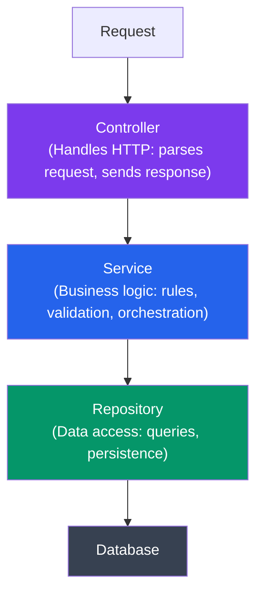

# Project Architecture Patterns

## What You'll Learn

- Structuring an Express app with layered architecture
- Implementing the repository pattern with typed interfaces
- Writing a service layer with business logic
- Using manual dependency injection without a framework
- Managing typed configuration with Zod
- Organizing a medium-sized Express project by feature modules

---

## Why Architecture Matters

> **Coming from JS:** In many Node.js projects, route handlers talk directly to the database, business logic lives in middleware, and the same file imports Mongoose, sends emails, and formats responses. It works until the app grows, then changes break everything. TypeScript makes architecture patterns practical because interfaces enforce the boundaries between layers.

---

## Layered Architecture Overview



Each layer depends only on the layer below it, through interfaces.

---

## Project Structure

```mermaid
graph TD
    src["src/"]
    
    config["config/"]
    env["env.ts<br/>(Typed environment config)"]
    dbconfig["database.ts<br/>(DB connection setup)"]
    
    modules["modules/"]
    user["user/"]
    userctrl["user.controller.ts"]
    usersvc["user.service.ts"]
    userrepo["user.repository.ts"]
    userroutes["user.routes.ts"]
    userschema["user.schema.ts<br/>(Zod schemas)"]
    usertypes["user.types.ts<br/>(Interfaces and DTOs)"]
    
    post["post/"]
    postctrl["post.controller.ts"]
    postsvc["post.service.ts"]
    postrepo["post.repository.ts"]
    postroutes["post.routes.ts"]
    postschema["post.schema.ts"]
    posttypes["post.types.ts"]
    
    middleware["middleware/"]
    authmw["auth.middleware.ts"]
    validatemw["validate.middleware.ts"]
    errorhandlermw["errorHandler.middleware.ts"]
    
    errors["errors/"]
    apperror["AppError.ts"]
    
    utils["utils/"]
    catchasync["catchAsync.ts"]
    
    routes["routes.ts<br/>(Aggregates all module routes)"]
    server["server.ts<br/>(Entry point)"]
    
    src --> config
    src --> modules
    src --> middleware
    src --> errors
    src --> utils
    src --> routes
    src --> server
    
    config --> env
    config --> dbconfig
    
    modules --> user
    modules --> post
    
    user --> userctrl
    user --> usersvc
    user --> userrepo
    user --> userroutes
    user --> userschema
    user --> usertypes
    
    post --> postctrl
    post --> postsvc
    post --> postrepo
    post --> postroutes
    post --> postschema
    post --> posttypes
    
    middleware --> authmw
    middleware --> validatemw
    middleware --> errorhandlermw
    
    errors --> apperror
    utils --> catchasync
```



Each module is a self-contained folder with every layer for that resource.

---

## The User Module: Types

```typescript
// src/modules/user/user.types.ts

export interface User {
  id: string;
  email: string;
  name: string;
  passwordHash: string;
  role: 'admin' | 'editor' | 'viewer';
  createdAt: Date;
  updatedAt: Date;
}

// What the API returns -- never includes passwordHash
export interface UserResponse {
  id: string;
  email: string;
  name: string;
  role: User['role'];
  createdAt: Date;
  updatedAt: Date;
}

export interface CreateUserInput {
  email: string;
  name: string;
  password: string;
  role?: User['role'];
}

export interface UpdateUserInput {
  email?: string;
  name?: string;
  password?: string;
  role?: User['role'];
}

export interface UserFilters {
  role?: User['role'];
  search?: string;
  page: number;
  limit: number;
}

export interface PaginatedResult<T> {
  data: T[];
  total: number;
  page: number;
  limit: number;
}
```

---

## Repository Layer

The repository handles all data access. Define an interface first, then implement it.

```typescript
// src/modules/user/user.repository.ts

import {
  User,
  CreateUserInput,
  UpdateUserInput,
  UserFilters,
  PaginatedResult,
} from './user.types';

// The interface -- defines what the repository can do
export interface IUserRepository {
  findById(id: string): Promise<User | null>;
  findByEmail(email: string): Promise<User | null>;
  findAll(filters: UserFilters): Promise<PaginatedResult<User>>;
  create(data: Omit<User, 'id' | 'createdAt' | 'updatedAt'>): Promise<User>;
  update(id: string, data: Partial<User>): Promise<User | null>;
  delete(id: string): Promise<boolean>;
}

// Concrete implementation -- could be Postgres, Mongo, etc.
export class UserRepository implements IUserRepository {
  // Using a simple in-memory store for illustration.
  // Replace with your actual database client.
  private users: User[] = [];
  private nextId = 1;

  async findById(id: string): Promise<User | null> {
    return this.users.find((u) => u.id === id) || null;
  }

  async findByEmail(email: string): Promise<User | null> {
    return this.users.find((u) => u.email === email) || null;
  }

  async findAll(filters: UserFilters): Promise<PaginatedResult<User>> {
    let result = [...this.users];

    if (filters.role) {
      result = result.filter((u) => u.role === filters.role);
    }

    if (filters.search) {
      const term = filters.search.toLowerCase();
      result = result.filter(
        (u) =>
          u.name.toLowerCase().includes(term) ||
          u.email.toLowerCase().includes(term)
      );
    }

    const total = result.length;
    const start = (filters.page - 1) * filters.limit;
    const paged = result.slice(start, start + filters.limit);

    return {
      data: paged,
      total,
      page: filters.page,
      limit: filters.limit,
    };
  }

  async create(
    data: Omit<User, 'id' | 'createdAt' | 'updatedAt'>
  ): Promise<User> {
    const now = new Date();
    const user: User = {
      ...data,
      id: String(this.nextId++),
      createdAt: now,
      updatedAt: now,
    };
    this.users.push(user);
    return user;
  }

  async update(id: string, data: Partial<User>): Promise<User | null> {
    const index = this.users.findIndex((u) => u.id === id);
    if (index === -1) return null;

    this.users[index] = {
      ...this.users[index],
      ...data,
      updatedAt: new Date(),
    };

    return this.users[index];
  }

  async delete(id: string): Promise<boolean> {
    const index = this.users.findIndex((u) => u.id === id);
    if (index === -1) return false;
    this.users.splice(index, 1);
    return true;
  }
}
```

> **Coming from JS:** You might put database queries directly in your route handlers. The repository pattern isolates them behind an interface, so you can swap from Postgres to Mongo (or to an in-memory store for tests) without changing your business logic.

---

## Service Layer

The service layer contains business logic and depends on the repository interface, not the implementation.

```typescript
// src/modules/user/user.service.ts

import { hash, compare } from 'bcrypt';
import { IUserRepository } from './user.repository';
import {
  User,
  UserResponse,
  CreateUserInput,
  UpdateUserInput,
  UserFilters,
  PaginatedResult,
} from './user.types';
import { NotFoundError, ConflictError, UnauthorizedError } from '../../errors/AppError';

// Strip sensitive fields before returning
function toUserResponse(user: User): UserResponse {
  const { passwordHash, ...rest } = user;
  return rest;
}

export class UserService {
  constructor(private readonly userRepo: IUserRepository) {}

  async getById(id: string): Promise<UserResponse> {
    const user = await this.userRepo.findById(id);
    if (!user) {
      throw new NotFoundError('User', id);
    }
    return toUserResponse(user);
  }

  async getAll(filters: UserFilters): Promise<PaginatedResult<UserResponse>> {
    const result = await this.userRepo.findAll(filters);
    return {
      ...result,
      data: result.data.map(toUserResponse),
    };
  }

  async create(input: CreateUserInput): Promise<UserResponse> {
    // Business rule: emails must be unique
    const existing = await this.userRepo.findByEmail(input.email);
    if (existing) {
      throw new ConflictError(`A user with email '${input.email}' already exists`);
    }

    const passwordHash = await hash(input.password, 12);

    const user = await this.userRepo.create({
      email: input.email,
      name: input.name,
      passwordHash,
      role: input.role || 'viewer',
    });

    return toUserResponse(user);
  }

  async update(id: string, input: UpdateUserInput): Promise<UserResponse> {
    const existing = await this.userRepo.findById(id);
    if (!existing) {
      throw new NotFoundError('User', id);
    }

    const updateData: Partial<User> = {};

    if (input.email && input.email !== existing.email) {
      const duplicate = await this.userRepo.findByEmail(input.email);
      if (duplicate) {
        throw new ConflictError(`Email '${input.email}' is already in use`);
      }
      updateData.email = input.email;
    }

    if (input.name) updateData.name = input.name;
    if (input.role) updateData.role = input.role;
    if (input.password) {
      updateData.passwordHash = await hash(input.password, 12);
    }

    const updated = await this.userRepo.update(id, updateData);
    return toUserResponse(updated!);
  }

  async delete(id: string): Promise<void> {
    const deleted = await this.userRepo.delete(id);
    if (!deleted) {
      throw new NotFoundError('User', id);
    }
  }

  async verifyCredentials(email: string, password: string): Promise<UserResponse> {
    const user = await this.userRepo.findByEmail(email);
    if (!user) {
      throw new UnauthorizedError('Invalid email or password');
    }

    const isValid = await compare(password, user.passwordHash);
    if (!isValid) {
      throw new UnauthorizedError('Invalid email or password');
    }

    return toUserResponse(user);
  }
}
```

Note that `UserService` accepts `IUserRepository` (the interface), not `UserRepository` (the class). This is the foundation of dependency injection.

---

## Controller Layer

The controller only handles HTTP concerns: reading the request, calling the service, and sending the response.

```typescript
// src/modules/user/user.controller.ts

import { Request, Response } from 'express';
import { catchAsync } from '../../utils/catchAsync';
import { UserService } from './user.service';
import { CreateUserInput, UpdateUserInput, UserFilters } from './user.types';

export class UserController {
  constructor(private readonly userService: UserService) {}

  getAll = catchAsync(async (req: Request<{}, any, any, UserFilters>, res: Response) => {
    const filters: UserFilters = {
      page: Number(req.query.page) || 1,
      limit: Number(req.query.limit) || 20,
      role: req.query.role,
      search: req.query.search,
    };

    const result = await this.userService.getAll(filters);

    res.json({
      data: result.data,
      meta: {
        page: result.page,
        limit: result.limit,
        total: result.total,
        totalPages: Math.ceil(result.total / result.limit),
      },
    });
  });

  getById = catchAsync(async (req: Request<{ id: string }>, res: Response) => {
    const user = await this.userService.getById(req.params.id);
    res.json({ data: user });
  });

  create = catchAsync(async (req: Request<{}, any, CreateUserInput>, res: Response) => {
    const user = await this.userService.create(req.body);
    res.status(201).json({ data: user });
  });

  update = catchAsync(async (
    req: Request<{ id: string }, any, UpdateUserInput>,
    res: Response
  ) => {
    const user = await this.userService.update(req.params.id, req.body);
    res.json({ data: user });
  });

  delete = catchAsync(async (req: Request<{ id: string }>, res: Response) => {
    await this.userService.delete(req.params.id);
    res.status(204).send();
  });
}
```

> **Coming from JS:** Controllers look almost identical to what you write now, but they delegate everything to the service. The controller does not know how users are stored or what business rules apply -- it just translates HTTP to function calls and back.

---

## Dependency Injection Without a Framework

Wire everything together with factory functions. No decorators, no IoC container.

```typescript
// src/modules/user/user.factory.ts

import { UserRepository } from './user.repository';
import { UserService } from './user.service';
import { UserController } from './user.controller';

export function createUserModule() {
  const repository = new UserRepository();
  const service = new UserService(repository);
  const controller = new UserController(service);

  return { repository, service, controller };
}
```

```typescript
// src/modules/user/user.routes.ts

import { Router } from 'express';
import { createUserModule } from './user.factory';
import { validate } from '../../middleware/validate.middleware';
import { createUserSchema, updateUserSchema, userQuerySchema } from './user.schema';
import { authenticate, authorize } from '../../middleware/auth.middleware';

const router = Router();
const { controller } = createUserModule();

router.get(
  '/',
  authenticate,
  validate({ query: userQuerySchema }),
  controller.getAll
);

router.get('/:id', authenticate, controller.getById);

router.post(
  '/',
  authenticate,
  authorize('admin'),
  validate({ body: createUserSchema }),
  controller.create
);

router.patch(
  '/:id',
  authenticate,
  validate({ body: updateUserSchema }),
  controller.update
);

router.delete(
  '/:id',
  authenticate,
  authorize('admin'),
  controller.delete
);

export default router;
```

> **Coming from JS:** You might be used to importing a singleton db connection directly in your files. Manual DI means you explicitly pass dependencies through constructors. It is more verbose, but it makes testing trivial -- pass a mock repository into the service and you never touch a database.

---

## Typed Configuration with Zod

Use Zod to validate environment variables at startup:

```typescript
// src/config/env.ts

import { z } from 'zod';

const envSchema = z.object({
  NODE_ENV: z.enum(['development', 'production', 'test']).default('development'),
  PORT: z.coerce.number().default(3000),
  DATABASE_URL: z.string().url(),
  JWT_SECRET: z.string().min(32, 'JWT_SECRET must be at least 32 characters'),
  JWT_EXPIRES_IN: z.string().default('7d'),
  BCRYPT_ROUNDS: z.coerce.number().int().min(10).max(14).default(12),
  CORS_ORIGIN: z.string().default('http://localhost:3000'),
  LOG_LEVEL: z.enum(['debug', 'info', 'warn', 'error']).default('info'),
  REDIS_URL: z.string().url().optional(),
  SMTP_HOST: z.string().optional(),
  SMTP_PORT: z.coerce.number().optional(),
  SMTP_USER: z.string().optional(),
  SMTP_PASS: z.string().optional(),
});

// Parse and validate -- throws at startup if env is misconfigured
function loadEnv() {
  const result = envSchema.safeParse(process.env);

  if (!result.success) {
    console.error('Invalid environment configuration:');
    for (const issue of result.error.issues) {
      console.error(`  ${issue.path.join('.')}: ${issue.message}`);
    }
    process.exit(1);
  }

  return result.data;
}

export const env = loadEnv();

// TypeScript now knows the exact shape:
// env.PORT          -> number
// env.NODE_ENV      -> 'development' | 'production' | 'test'
// env.DATABASE_URL  -> string
// env.REDIS_URL     -> string | undefined
```

Use it everywhere instead of raw `process.env`:

```typescript
// src/server.ts
import { env } from './config/env';

app.listen(env.PORT, () => {
  console.log(`Server running in ${env.NODE_ENV} mode on port ${env.PORT}`);
});
```

```typescript
// src/modules/user/user.service.ts
import { env } from '../../config/env';
import { hash } from 'bcrypt';

const passwordHash = await hash(input.password, env.BCRYPT_ROUNDS);
```

If someone deploys without `DATABASE_URL`, the app crashes immediately with a clear error instead of failing minutes later on the first database query.

---

## Aggregating Routes

```typescript
// src/routes.ts

import { Router } from 'express';
import userRoutes from './modules/user/user.routes';
import postRoutes from './modules/post/post.routes';

const router = Router();

router.use('/users', userRoutes);
router.use('/posts', postRoutes);

export default router;
```

```typescript
// src/server.ts

import express from 'express';
import cors from 'cors';
import { env } from './config/env';
import routes from './routes';
import { attachRequestId } from './middleware/requestId.middleware';
import { httpLogger } from './middleware/logger.middleware';
import { globalErrorHandler } from './middleware/errorHandler.middleware';
import { NotFoundError } from './errors/AppError';

const app = express();

app.use(cors({ origin: env.CORS_ORIGIN }));
app.use(express.json({ limit: '10mb' }));
app.use(attachRequestId);
app.use(httpLogger);

app.get('/health', (_req, res) => {
  res.json({ status: 'ok', environment: env.NODE_ENV });
});

app.use('/api/v1', routes);

app.all('*', (req) => {
  throw new NotFoundError(`Route ${req.method} ${req.path}`);
});

app.use(globalErrorHandler);

app.listen(env.PORT, () => {
  console.log(`Server running in ${env.NODE_ENV} mode on port ${env.PORT}`);
});
```

---

## Testing with the Layered Architecture

The biggest payoff of this structure is testability:

```typescript
// src/modules/user/__tests__/user.service.test.ts

import { UserService } from '../user.service';
import { IUserRepository } from '../user.repository';
import { User, PaginatedResult } from '../user.types';

// Create a mock repository that satisfies the interface
function createMockRepo(): IUserRepository {
  const store = new Map<string, User>();

  return {
    async findById(id) {
      return store.get(id) || null;
    },
    async findByEmail(email) {
      return [...store.values()].find((u) => u.email === email) || null;
    },
    async findAll(filters) {
      const all = [...store.values()];
      return { data: all, total: all.length, page: filters.page, limit: filters.limit };
    },
    async create(data) {
      const user: User = {
        ...data,
        id: String(store.size + 1),
        createdAt: new Date(),
        updatedAt: new Date(),
      };
      store.set(user.id, user);
      return user;
    },
    async update(id, data) {
      const user = store.get(id);
      if (!user) return null;
      const updated = { ...user, ...data, updatedAt: new Date() };
      store.set(id, updated);
      return updated;
    },
    async delete(id) {
      return store.delete(id);
    },
  };
}

describe('UserService', () => {
  let service: UserService;

  beforeEach(() => {
    const mockRepo = createMockRepo();
    service = new UserService(mockRepo);
  });

  it('creates a user and strips passwordHash from response', async () => {
    const result = await service.create({
      email: 'alice@example.com',
      name: 'Alice',
      password: 'SecurePass1',
    });

    expect(result.email).toBe('alice@example.com');
    expect(result).not.toHaveProperty('passwordHash');
  });

  it('throws ConflictError on duplicate email', async () => {
    await service.create({ email: 'bob@test.com', name: 'Bob', password: 'Pass1234' });

    await expect(
      service.create({ email: 'bob@test.com', name: 'Bob2', password: 'Pass5678' })
    ).rejects.toThrow('already exists');
  });
});
```

No database, no HTTP, no mocking frameworks needed. The interface is the contract.

---

## Mini-Exercise

Build a complete `Post` module following the same architecture:

1. Define `post.types.ts` with `Post`, `CreatePostInput`, `UpdatePostInput`, `PostFilters`, and `PostResponse` (which includes the author's name but not their password hash).
2. Define `IPostRepository` with `findAll`, `findById`, `findByAuthorId`, `create`, `update`, `delete`.
3. Implement `PostService` that accepts both `IPostRepository` and `IUserRepository` (it needs the user repo to look up author names for the response).
4. Implement `PostController` with fully typed handlers.
5. Write a `createPostModule` factory. Since `PostService` depends on two repositories, the factory must accept the user repository as a parameter (or create a shared registry).
6. Write one test that uses a mock `IPostRepository` to verify that `PostService.create` sets `published` to `false` by default.
