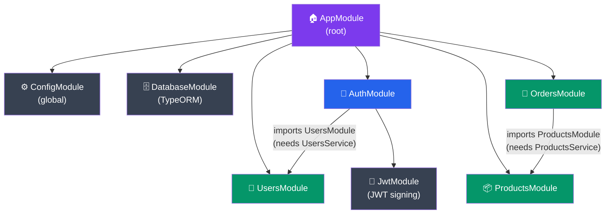
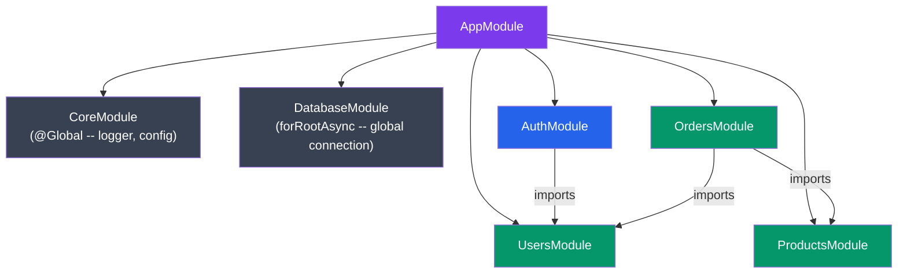

# Architecture and Modules

## What You'll Learn

- How NestJS organizes applications through the module system
- The `@Module` decorator and its metadata properties: imports, exports, providers, controllers
- Creating feature modules, shared modules, and global modules
- Dynamic modules with `forRoot`, `forRootAsync`, and `forFeature` patterns
- Resolving circular dependencies with `forwardRef`
- Module re-exporting strategies
- Structuring a real application with multiple interconnected modules

---

## The Module System

NestJS enforces an opinionated architecture inspired by Angular. Every NestJS app has at least one module -- the root module. Modules group related functionality and define clear boundaries.

> **Coming from JS:** In plain Express apps, you probably organize by dropping route files into a `/routes` folder and middleware into `/middleware`. There is no enforced structure. NestJS modules replace that ad-hoc organization with an explicit dependency graph. Think of each module as a self-contained mini-application that declares exactly what it needs and what it exposes.

### The @Module Decorator

```typescript
import { Module } from '@nestjs/common';
import { UsersController } from './users.controller';
import { UsersService } from './users.service';
import { UsersRepository } from './users.repository';

@Module({
  imports: [],          // Other modules this module depends on
  controllers: [UsersController],  // Route handlers instantiated by this module
  providers: [UsersService, UsersRepository], // Injectable services
  exports: [UsersService],  // Providers available to modules that import this one
})
export class UsersModule {}
```

Each property serves a specific role:

| Property      | Purpose                                                        |
|---------------|----------------------------------------------------------------|
| `imports`     | Modules whose exported providers are needed in this module     |
| `controllers` | Controllers to instantiate                                     |
| `providers`   | Services/repositories available within this module via DI      |
| `exports`     | Subset of providers that other importing modules can access    |

---

## Feature Modules

A feature module encapsulates everything related to a specific domain. This is how you break a monolith into manageable pieces.

```typescript
// auth/auth.module.ts
import { Module } from '@nestjs/common';
import { AuthController } from './auth.controller';
import { AuthService } from './auth.service';
import { JwtStrategy } from './strategies/jwt.strategy';
import { LocalStrategy } from './strategies/local.strategy';
import { UsersModule } from '../users/users.module';
import { JwtModule } from '@nestjs/jwt';

@Module({
  imports: [
    UsersModule,  // We need UsersService (which UsersModule exports)
    JwtModule.register({
      secret: 'hard-coded-secret-for-demo-only',
      signOptions: { expiresIn: '1h' },
    }),
  ],
  controllers: [AuthController],
  providers: [AuthService, JwtStrategy, LocalStrategy],
  exports: [AuthService],  // Other modules might need to check auth
})
export class AuthModule {}
```

```typescript
// products/products.module.ts
import { Module } from '@nestjs/common';
import { ProductsController } from './products.controller';
import { ProductsService } from './products.service';
import { TypeOrmModule } from '@nestjs/typeorm';
import { Product } from './entities/product.entity';

@Module({
  imports: [TypeOrmModule.forFeature([Product])],
  controllers: [ProductsController],
  providers: [ProductsService],
  exports: [ProductsService],
})
export class ProductsModule {}
```

---

## The Root Module

The root module wires everything together:



```typescript
// app.module.ts
import { Module } from '@nestjs/common';
import { AuthModule } from './auth/auth.module';
import { UsersModule } from './users/users.module';
import { ProductsModule } from './products/products.module';
import { OrdersModule } from './orders/orders.module';
import { DatabaseModule } from './database/database.module';
import { ConfigModule } from './config/config.module';

@Module({
  imports: [
    ConfigModule.forRoot(),
    DatabaseModule,
    AuthModule,
    UsersModule,
    ProductsModule,
    OrdersModule,
  ],
})
export class AppModule {}
```

---

## Shared Modules

When multiple modules need the same provider, create a shared module:

```typescript
// common/common.module.ts
import { Module } from '@nestjs/common';
import { LoggerService } from './logger.service';
import { EncryptionService } from './encryption.service';
import { PaginationHelper } from './pagination.helper';

@Module({
  providers: [LoggerService, EncryptionService, PaginationHelper],
  exports: [LoggerService, EncryptionService, PaginationHelper],
})
export class CommonModule {}
```

Any module that imports `CommonModule` gets access to those three services:

```typescript
@Module({
  imports: [CommonModule],
  controllers: [UsersController],
  providers: [UsersService],
})
export class UsersModule {}
```

> **Coming from JS:** This is the NestJS equivalent of creating a `utils/` folder that everyone imports from. The difference is that the dependency is explicit -- you can see at a glance which modules depend on shared utilities.

---

## Global Modules

If a module is imported by almost every other module, marking it `@Global` saves you from listing it repeatedly in `imports`:

```typescript
import { Module, Global } from '@nestjs/common';
import { LoggerService } from './logger.service';
import { CacheService } from './cache.service';

@Global()
@Module({
  providers: [LoggerService, CacheService],
  exports: [LoggerService, CacheService],
})
export class CoreModule {}
```

Now any provider in the application can inject `LoggerService` or `CacheService` without importing `CoreModule`:

```typescript
// products.service.ts -- no need for ProductsModule to import CoreModule
import { Injectable } from '@nestjs/common';
import { LoggerService } from '../core/logger.service';

@Injectable()
export class ProductsService {
  constructor(private readonly logger: LoggerService) {}

  findAll() {
    this.logger.log('Fetching all products');
    // ...
  }
}
```

Use `@Global` sparingly. Overusing it hides dependencies and makes the module graph harder to reason about.

---

## Dynamic Modules

Dynamic modules let you configure a module differently depending on context. This is the pattern used by `@nestjs/config`, `@nestjs/typeorm`, `@nestjs/jwt`, and most NestJS libraries.

### forRoot / forFeature Pattern

```typescript
// database/database.module.ts
import { Module, DynamicModule } from '@nestjs/common';
import { TypeOrmModule } from '@nestjs/typeorm';

@Module({})
export class DatabaseModule {
  // Called once in AppModule -- sets up the connection
  static forRoot(options: {
    host: string;
    port: number;
    username: string;
    password: string;
    database: string;
  }): DynamicModule {
    return {
      module: DatabaseModule,
      imports: [
        TypeOrmModule.forRoot({
          type: 'postgres',
          ...options,
          autoLoadEntities: true,
          synchronize: false,
        }),
      ],
      global: true,  // Make the DB connection available everywhere
    };
  }
}
```

Usage in the root module:

```typescript
@Module({
  imports: [
    DatabaseModule.forRoot({
      host: 'localhost',
      port: 5432,
      username: 'admin',
      password: 'secret',
      database: 'myapp',
    }),
    UsersModule,
    ProductsModule,
  ],
})
export class AppModule {}
```

### forRootAsync -- Loading Config Asynchronously

In production, you load config from environment or a remote source:

```typescript
// database/database.module.ts
import { Module, DynamicModule } from '@nestjs/common';
import { TypeOrmModule, TypeOrmModuleAsyncOptions } from '@nestjs/typeorm';
import { ConfigModule, ConfigService } from '@nestjs/config';

@Module({})
export class DatabaseModule {
  static forRootAsync(): DynamicModule {
    return {
      module: DatabaseModule,
      imports: [
        TypeOrmModule.forRootAsync({
          imports: [ConfigModule],
          inject: [ConfigService],
          useFactory: (config: ConfigService) => ({
            type: 'postgres' as const,
            host: config.get<string>('DB_HOST'),
            port: config.get<number>('DB_PORT'),
            username: config.get<string>('DB_USER'),
            password: config.get<string>('DB_PASS'),
            database: config.get<string>('DB_NAME'),
            autoLoadEntities: true,
            synchronize: config.get<string>('NODE_ENV') !== 'production',
          }),
        }),
      ],
      global: true,
    };
  }
}
```

### Building Your Own Dynamic Module

```typescript
// notifications/notifications.module.ts
import { Module, DynamicModule } from '@nestjs/common';
import { NotificationsService } from './notifications.service';

export interface NotificationsModuleOptions {
  provider: 'sendgrid' | 'ses' | 'smtp';
  apiKey?: string;
  region?: string;
}

export const NOTIFICATIONS_OPTIONS = 'NOTIFICATIONS_OPTIONS';

@Module({})
export class NotificationsModule {
  static forRoot(options: NotificationsModuleOptions): DynamicModule {
    return {
      module: NotificationsModule,
      providers: [
        {
          provide: NOTIFICATIONS_OPTIONS,
          useValue: options,
        },
        NotificationsService,
      ],
      exports: [NotificationsService],
    };
  }

  static forRootAsync(asyncOptions: {
    imports?: any[];
    inject?: any[];
    useFactory: (...args: any[]) => Promise<NotificationsModuleOptions> | NotificationsModuleOptions;
  }): DynamicModule {
    return {
      module: NotificationsModule,
      imports: asyncOptions.imports || [],
      providers: [
        {
          provide: NOTIFICATIONS_OPTIONS,
          useFactory: asyncOptions.useFactory,
          inject: asyncOptions.inject || [],
        },
        NotificationsService,
      ],
      exports: [NotificationsService],
    };
  }
}
```

```typescript
// notifications/notifications.service.ts
import { Injectable, Inject } from '@nestjs/common';
import { NOTIFICATIONS_OPTIONS, NotificationsModuleOptions } from './notifications.module';

@Injectable()
export class NotificationsService {
  constructor(
    @Inject(NOTIFICATIONS_OPTIONS)
    private readonly options: NotificationsModuleOptions,
  ) {}

  async sendEmail(to: string, subject: string, body: string): Promise<void> {
    switch (this.options.provider) {
      case 'sendgrid':
        // Use SendGrid API with this.options.apiKey
        break;
      case 'ses':
        // Use AWS SES with this.options.region
        break;
      case 'smtp':
        // Use nodemailer
        break;
    }
  }
}
```

---

## Circular Dependency Resolution

Sometimes two modules genuinely depend on each other. Use `forwardRef` to break the cycle:

```typescript
// users/users.module.ts
import { Module, forwardRef } from '@nestjs/common';
import { UsersService } from './users.service';
import { AuthModule } from '../auth/auth.module';

@Module({
  imports: [forwardRef(() => AuthModule)],
  providers: [UsersService],
  exports: [UsersService],
})
export class UsersModule {}

// auth/auth.module.ts
import { Module, forwardRef } from '@nestjs/common';
import { AuthService } from './auth.service';
import { UsersModule } from '../users/users.module';

@Module({
  imports: [forwardRef(() => UsersModule)],
  providers: [AuthService],
  exports: [AuthService],
})
export class AuthModule {}
```

The same applies at the provider level:

```typescript
// users/users.service.ts
import { Injectable, Inject, forwardRef } from '@nestjs/common';
import { AuthService } from '../auth/auth.service';

@Injectable()
export class UsersService {
  constructor(
    @Inject(forwardRef(() => AuthService))
    private readonly authService: AuthService,
  ) {}
}
```

> **Coming from JS:** Circular dependencies in Node.js often cause half-initialized modules or subtle bugs. NestJS's `forwardRef` makes the cycle explicit and handled. That said, circular dependencies are usually a code smell. Consider extracting shared logic into a third module.

---

## Module Re-exporting

A module can re-export modules it imports, acting as an aggregation point:

```typescript
// core/core.module.ts
import { Module } from '@nestjs/common';
import { ConfigModule } from '@nestjs/config';
import { CommonModule } from '../common/common.module';
import { LoggerModule } from '../logger/logger.module';

@Module({
  imports: [ConfigModule.forRoot(), CommonModule, LoggerModule],
  exports: [ConfigModule, CommonModule, LoggerModule],  // Re-export all three
})
export class CoreModule {}
```

Now any module that imports `CoreModule` gets access to `ConfigModule`, `CommonModule`, and `LoggerModule` without importing each one individually.

---

## Real Application Structure

Here is how a well-structured NestJS application looks on disk:

```mermaid
graph TD
    src["src/"]
    appmod["app.module.ts<br/>(Root module)"]
    main["main.ts<br/>(Bootstrap)"]
    
    core["core/"]
    coremod["core.module.ts<br/>(Global providers)"]
    
    common["common/"]
    commonmod["common.module.ts<br/>(Shared utilities)"]
    decorators["decorators/"]
    filters["filters/"]
    pipes["pipes/"]
    interceptors["interceptors/"]
    
    config["config/"]
    configmod["config.module.ts<br/>(Environment config)"]
    configuration["configuration.ts"]
    
    database["database/"]
    dbmod["database.module.ts<br/>(TypeORM/Prisma setup)"]
    migrations["migrations/"]
    
    auth["auth/"]
    authmod["auth.module.ts"]
    authctrl["auth.controller.ts"]
    authsvc["auth.service.ts"]
    strategies["strategies/"]
    guards["guards/"]
    authdto["dto/"]
    
    users["users/"]
    usersmod["users.module.ts"]
    usersctrl["users.controller.ts"]
    userssvc["users.service.ts"]
    usersrepo["users.repository.ts"]
    entities["entities/"]
    usersdto["dto/"]
    
    src --> appmod
    src --> main
    src --> core
    src --> common
    src --> config
    src --> database
    src --> auth
    src --> users
    
    core --> coremod
    common --> commonmod
    common --> decorators
    common --> filters
    common --> pipes
    common --> interceptors
    config --> configmod
    config --> configuration
    database --> dbmod
    database --> migrations
    auth --> authmod
    auth --> authctrl
    auth --> authsvc
    auth --> strategies
    auth --> guards
    auth --> authdto
    users --> usersmod
    users --> usersctrl
    users --> userssvc
    users --> usersrepo
    users --> entities
    users --> usersdto
```



The dependency graph flows like this:



---

## Mini-Exercise

1. Create a `NotificationsModule` that is a dynamic module accepting a `transport` option (`'email' | 'sms' | 'push'`). Implement both `forRoot` (synchronous) and `forRootAsync` (factory-based) static methods.

2. Create an `OrdersModule` that imports both `ProductsModule` and `UsersModule`. The `OrdersService` should inject `ProductsService` and `UsersService`. Make sure both are properly exported from their respective modules.

3. Create a `CoreModule` marked `@Global` that provides a `LoggerService`. Verify that you can inject `LoggerService` into any service across the application without importing `CoreModule`.

4. Introduce a circular dependency between `UsersModule` and `OrdersModule` (users need to see their orders; orders need user details). Resolve it with `forwardRef`, then refactor to eliminate the cycle by extracting shared logic into a `SharedDataModule`.
