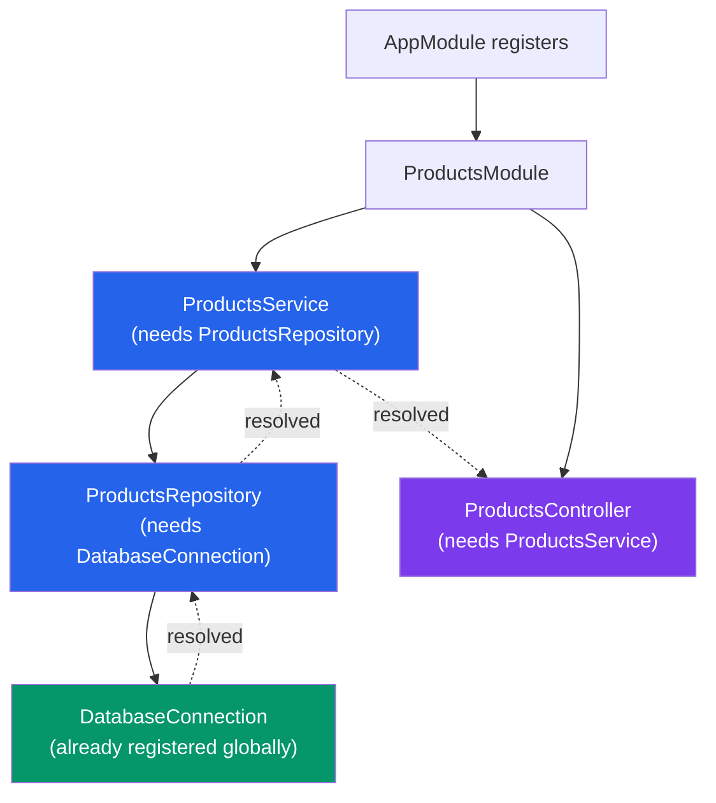
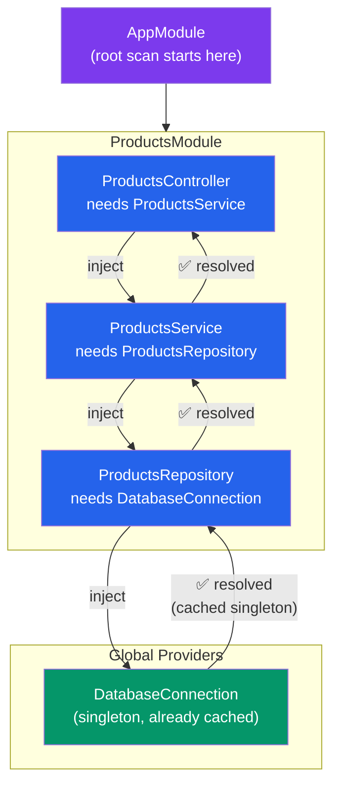
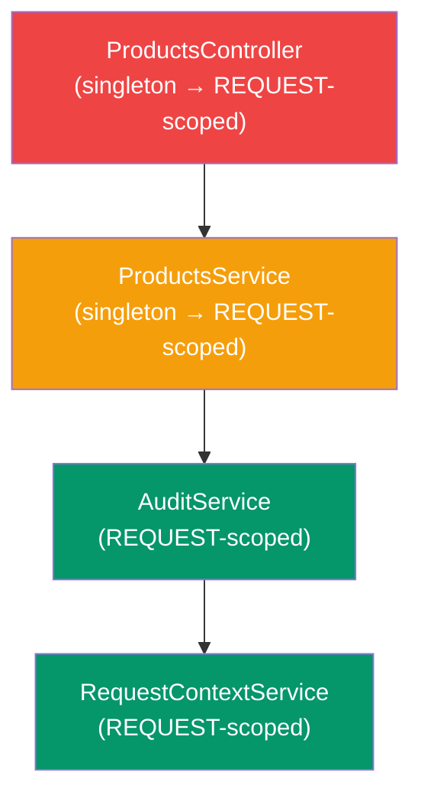

# Dependency Injection Deep Dive

## What You'll Learn

- How Inversion of Control (IoC) works and why NestJS uses it
- How the NestJS DI container resolves dependencies at startup
- Constructor-based injection and the role of TypeScript metadata
- All four custom provider types: `useClass`, `useValue`, `useFactory`, `useExisting`
- Injection tokens: class references, string tokens, Symbol tokens, and `InjectionToken`
- Provider scopes: `DEFAULT` (singleton), `REQUEST`, and `TRANSIENT`
- Scope bubbling and its performance implications
- `@Optional()` injection and circular injection with `forwardRef`
- Practical patterns: swapping implementations, injecting config, request-scoped services

---

## Inversion of Control

> **Coming from JS:** In a typical Express app, you manually create instances and pass them around. You might write `const userService = new UserService(new UserRepository(db))` in your setup file. IoC flips this: you declare what a class needs, and the framework provides it. You never call `new` on your services.

```typescript
// Without IoC (manual wiring)
const pool = new Pool(dbConfig);
const userRepo = new UserRepository(pool);
const authService = new AuthService(userRepo);
const userController = new UserController(authService);

// With NestJS IoC (declarative)
@Injectable()
export class UserController {
  // NestJS sees the constructor signature, looks up AuthService
  // in the container, and injects the singleton automatically
  constructor(private readonly authService: AuthService) {}
}
```

NestJS uses TypeScript's `emitDecoratorMetadata` compiler option. When you mark a class with `@Injectable()`, TypeScript emits metadata about its constructor parameters. NestJS reads that metadata at runtime to know which dependencies to inject.

---

## How the Container Resolves Dependencies

At application startup, NestJS:

1. Scans all modules starting from the root `AppModule`
2. Registers all providers from each module into the container
3. For each provider, inspects constructor parameters via metadata
4. Recursively resolves each dependency (depth-first)
5. Creates instances and caches singletons





If a dependency is not found in the current module or any imported module, NestJS throws:

```
Error: Nest can't resolve dependencies of the ProductsService (?).
Please make sure that the argument "ProductsRepository" at index [0]
is available in the ProductsModule context.
```

---

## Constructor Injection

The standard and most common pattern:

```typescript
import { Injectable } from '@nestjs/common';

@Injectable()
export class OrdersService {
  constructor(
    private readonly productsService: ProductsService,
    private readonly usersService: UsersService,
    private readonly logger: LoggerService,
  ) {}

  async createOrder(userId: string, productIds: string[]) {
    const user = await this.usersService.findOne(userId);
    const products = await this.productsService.findByIds(productIds);
    this.logger.log(`Creating order for user ${user.email}`);
    // ...
  }
}
```

Every parameter must be a registered provider. NestJS matches by the TypeScript type (the class reference) unless you override with `@Inject()`.

---

## Custom Providers

### useClass -- Swap Implementations

```typescript
// Provide a different class than the token implies
@Module({
  providers: [
    {
      provide: LoggerService,
      useClass:
        process.env.NODE_ENV === 'production'
          ? CloudWatchLogger
          : ConsoleLogger,
    },
  ],
})
export class CoreModule {}
```

This is extremely useful for testing:

```typescript
// In a test module, swap the real service for a mock
const module = await Test.createTestingModule({
  providers: [
    OrdersService,
    {
      provide: ProductsService,
      useClass: MockProductsService,
    },
    {
      provide: UsersService,
      useClass: MockUsersService,
    },
  ],
}).compile();
```

### useValue -- Provide a Static Value

```typescript
@Module({
  providers: [
    {
      provide: 'APP_CONFIG',
      useValue: {
        appName: 'MyStore',
        version: '2.1.0',
        features: {
          darkMode: true,
          betaAccess: false,
        },
      },
    },
    {
      provide: 'API_KEY',
      useValue: 'sk-1234567890abcdef',
    },
  ],
})
export class ConfigModule {}
```

Injecting value providers requires `@Inject()` since there is no class to match:

```typescript
@Injectable()
export class PaymentService {
  constructor(
    @Inject('API_KEY') private readonly apiKey: string,
    @Inject('APP_CONFIG') private readonly config: Record<string, any>,
  ) {}
}
```

> **Coming from JS:** This replaces the pattern of `require('./config.json')` or reading `process.env` directly in your service files. By injecting config, you make dependencies explicit and testing straightforward -- just provide a different value in your test module.

### useFactory -- Dynamic Provider Creation

Factories can be async and can inject other providers:

```typescript
@Module({
  imports: [ConfigModule],
  providers: [
    {
      provide: 'DATABASE_CONNECTION',
      useFactory: async (configService: ConfigService): Promise<Pool> => {
        const pool = new Pool({
          host: configService.get('DB_HOST'),
          port: configService.get('DB_PORT'),
          user: configService.get('DB_USER'),
          password: configService.get('DB_PASS'),
          database: configService.get('DB_NAME'),
        });
        // Wait for the connection to be ready
        await pool.connect();
        return pool;
      },
      inject: [ConfigService],  // Dependencies passed to the factory
    },
  ],
  exports: ['DATABASE_CONNECTION'],
})
export class DatabaseModule {}
```

Factories with multiple dependencies:

```typescript
{
  provide: 'MAILER_TRANSPORT',
  useFactory: (config: ConfigService, logger: LoggerService) => {
    logger.log('Initializing mailer transport');
    return createTransport({
      host: config.get('SMTP_HOST'),
      port: config.get('SMTP_PORT'),
      auth: {
        user: config.get('SMTP_USER'),
        pass: config.get('SMTP_PASS'),
      },
    });
  },
  inject: [ConfigService, LoggerService],
}
```

### useExisting -- Alias a Provider

Create an alias that points to an existing provider:

```typescript
@Module({
  providers: [
    ConsoleLoggerService,
    {
      provide: LoggerService,       // When someone asks for LoggerService...
      useExisting: ConsoleLoggerService,  // ...give them the ConsoleLoggerService instance
    },
  ],
  exports: [LoggerService],
})
export class LoggingModule {}
```

This is different from `useClass`: with `useExisting`, both tokens resolve to the same singleton instance. With `useClass`, each token gets its own instance.

---

## Injection Tokens

### Class References (Default)

```typescript
// NestJS uses the class itself as the token
@Injectable()
export class UsersService {
  constructor(private readonly repo: UsersRepository) {}
  //                                 ^ UsersRepository class = the token
}
```

### String Tokens

```typescript
// Register with a string
{ provide: 'CACHE_MANAGER', useValue: cacheManager }

// Inject with @Inject
constructor(@Inject('CACHE_MANAGER') private cache: CacheManager) {}
```

String tokens work but are prone to typos. Define them as constants:

```typescript
// constants.ts
export const CACHE_MANAGER = 'CACHE_MANAGER';
export const DATABASE_POOL = 'DATABASE_POOL';
export const STRIPE_CLIENT = 'STRIPE_CLIENT';
```

### Symbol Tokens

```typescript
export const REDIS_CLIENT = Symbol('REDIS_CLIENT');

// Register
{ provide: REDIS_CLIENT, useFactory: () => createRedisClient() }

// Inject
constructor(@Inject(REDIS_CLIENT) private redis: RedisClient) {}
```

Symbols guarantee uniqueness -- no accidental collisions between libraries.

### InjectionToken (Type-safe Tokens)

NestJS 10+ provides a typed injection token:

```typescript
import { InjectionToken } from '@nestjs/common';

interface AppConfig {
  port: number;
  apiPrefix: string;
  corsOrigins: string[];
}

// Not yet a built-in NestJS class as of v10, but a common pattern
// using a branded string constant with an interface:
export const APP_CONFIG = 'APP_CONFIG' as InjectionToken<AppConfig>;
```

---

## Provider Scopes

### DEFAULT -- Singleton

The default. One instance shared across the entire application:

```typescript
@Injectable()  // Equivalent to @Injectable({ scope: Scope.DEFAULT })
export class UsersService {
  private callCount = 0;

  findAll() {
    this.callCount++;  // This counter persists across all requests
    // ...
  }
}
```

### REQUEST -- Per-Request Instance

A new instance is created for each incoming HTTP request:

```typescript
import { Injectable, Scope, Inject } from '@nestjs/common';
import { REQUEST } from '@nestjs/core';
import { Request } from 'express';

@Injectable({ scope: Scope.REQUEST })
export class RequestContextService {
  constructor(@Inject(REQUEST) private readonly request: Request) {}

  get currentUser() {
    return this.request.user;
  }

  get correlationId(): string {
    return this.request.headers['x-correlation-id'] as string;
  }
}
```

> **Coming from JS:** In Express, you attach data to `req` and pass it through middleware. Request-scoped providers are the NestJS equivalent -- each request gets its own service instance that can hold request-specific state without polluting a shared singleton.

### TRANSIENT -- Fresh Instance Every Injection

A new instance is created every time the provider is injected:

```typescript
@Injectable({ scope: Scope.TRANSIENT })
export class TransientLoggerService {
  private context: string = 'Default';

  setContext(context: string) {
    this.context = context;  // Safe: each consumer gets their own instance
  }

  log(message: string) {
    console.log(`[${this.context}] ${message}`);
  }
}

@Injectable()
export class UsersService {
  constructor(private readonly logger: TransientLoggerService) {
    this.logger.setContext('UsersService');
    // This does NOT affect other services' logger instances
  }
}
```

---

## Scope Bubbling

When a singleton depends on a request-scoped provider, the singleton is forced to become request-scoped too. This "bubbles up" through the dependency chain:



Because `ProductsService` depends on request-scoped `AuditService`, `ProductsService` becomes request-scoped. Because `ProductsController` depends on `ProductsService`, it also becomes request-scoped. Now a new instance of each is created per request.

This has serious performance implications. Avoid request-scoped providers unless you genuinely need them. Alternatives:

```typescript
// Instead of request-scoped service, use AsyncLocalStorage (Node 16+)
import { AsyncLocalStorage } from 'async_hooks';

export const requestStorage = new AsyncLocalStorage<{
  userId: string;
  correlationId: string;
}>();

// Set it in middleware (no scope bubbling!)
@Injectable()
export class RequestContextMiddleware implements NestMiddleware {
  use(req: Request, res: Response, next: NextFunction) {
    const store = {
      userId: req.user?.id,
      correlationId: req.headers['x-correlation-id'] as string,
    };
    requestStorage.run(store, () => next());
  }
}

// Read it in any singleton service
@Injectable()
export class AuditService {
  log(action: string) {
    const ctx = requestStorage.getStore();
    console.log(`[${ctx?.correlationId}] User ${ctx?.userId}: ${action}`);
  }
}
```

---

## Optional Injection

When a dependency might not be registered:

```typescript
import { Injectable, Optional, Inject } from '@nestjs/common';

@Injectable()
export class NotificationService {
  constructor(
    @Optional() @Inject('SMS_CLIENT') private readonly smsClient?: SmsClient,
    @Optional() @Inject('PUSH_CLIENT') private readonly pushClient?: PushClient,
  ) {}

  async notify(userId: string, message: string) {
    // Gracefully degrade if SMS isn't configured
    if (this.smsClient) {
      await this.smsClient.send(userId, message);
    }
    if (this.pushClient) {
      await this.pushClient.send(userId, message);
    }
  }
}
```

Without `@Optional()`, a missing provider causes a startup error. With it, the parameter is `undefined` if the provider is not available.

---

## Circular Injection

When two services depend on each other:

```typescript
// users.service.ts
import { Injectable, Inject, forwardRef } from '@nestjs/common';
import { AuthService } from '../auth/auth.service';

@Injectable()
export class UsersService {
  constructor(
    @Inject(forwardRef(() => AuthService))
    private readonly authService: AuthService,
  ) {}

  async deleteUser(id: string) {
    await this.authService.revokeAllTokens(id);
    // ... delete user
  }
}

// auth.service.ts
import { Injectable, Inject, forwardRef } from '@nestjs/common';
import { UsersService } from '../users/users.service';

@Injectable()
export class AuthService {
  constructor(
    @Inject(forwardRef(() => UsersService))
    private readonly usersService: UsersService,
  ) {}

  async validateUser(email: string, password: string) {
    const user = await this.usersService.findByEmail(email);
    // ... validate
  }
}
```

Both providers and their modules need `forwardRef`. This is a smell -- consider refactoring.

---

## Practical Patterns

### Swapping Implementations for Testing

```typescript
describe('OrdersService', () => {
  let service: OrdersService;
  let productsService: ProductsService;

  beforeEach(async () => {
    const module = await Test.createTestingModule({
      providers: [
        OrdersService,
        {
          provide: ProductsService,
          useValue: {
            findByIds: jest.fn().mockResolvedValue([
              { id: '1', name: 'Widget', price: 9.99 },
            ]),
            checkStock: jest.fn().mockResolvedValue(true),
          },
        },
        {
          provide: UsersService,
          useValue: {
            findOne: jest.fn().mockResolvedValue({
              id: 'user-1',
              email: 'test@example.com',
            }),
          },
        },
        {
          provide: 'PAYMENT_GATEWAY',
          useValue: {
            charge: jest.fn().mockResolvedValue({ transactionId: 'tx-123' }),
          },
        },
      ],
    }).compile();

    service = module.get(OrdersService);
    productsService = module.get(ProductsService);
  });

  it('should create an order', async () => {
    const order = await service.create('user-1', ['1']);
    expect(productsService.findByIds).toHaveBeenCalledWith(['1']);
    expect(order.total).toBe(9.99);
  });
});
```

### Injecting Config with useFactory

```typescript
// A typed, validated configuration provider
interface SmtpConfig {
  host: string;
  port: number;
  user: string;
  pass: string;
  secure: boolean;
}

export const SMTP_CONFIG = Symbol('SMTP_CONFIG');

@Module({
  imports: [ConfigModule],
  providers: [
    {
      provide: SMTP_CONFIG,
      useFactory: (configService: ConfigService): SmtpConfig => {
        const config: SmtpConfig = {
          host: configService.getOrThrow('SMTP_HOST'),
          port: parseInt(configService.getOrThrow('SMTP_PORT'), 10),
          user: configService.getOrThrow('SMTP_USER'),
          pass: configService.getOrThrow('SMTP_PASS'),
          secure: configService.get('SMTP_SECURE', 'true') === 'true',
        };
        // Validate at startup -- fail fast
        if (!config.host || !config.port) {
          throw new Error('SMTP configuration is incomplete');
        }
        return config;
      },
      inject: [ConfigService],
    },
    MailerService,
  ],
  exports: [MailerService],
})
export class MailerModule {}
```

---

## Mini-Exercise

1. Create a `CacheModule` with a `useFactory` provider that accepts a `ConfigService` and returns either a Redis client or an in-memory Map based on the `CACHE_DRIVER` environment variable. Inject the cache into a `ProductsService` using a Symbol token.

2. Write a test for `UsersService` that replaces the real `UsersRepository` with a `useValue` mock. Verify that `findAll()` calls the repository's `find()` method.

3. Create a `TransientLoggerService` with `Scope.TRANSIENT`. Inject it into two different services. Verify that each service receives its own instance by setting different contexts and checking they do not interfere.

4. Implement a request-scoped `TenantService` that reads the tenant ID from the request headers. Then refactor it to use `AsyncLocalStorage` instead, eliminating scope bubbling. Measure the difference by injecting it into a singleton service.
