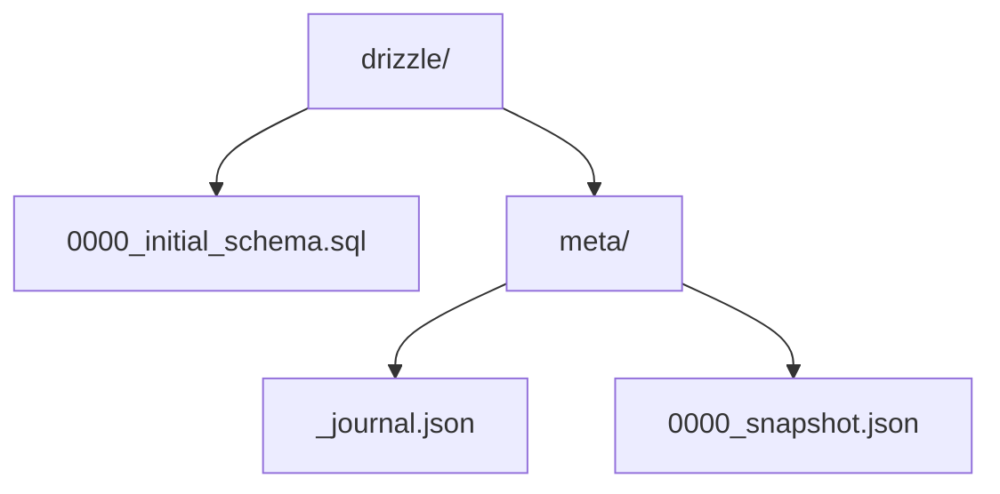

# Migrations with Drizzle Kit

## Overview

Drizzle Kit is a CLI companion tool for managing database migrations, introspecting databases, and pushing schema changes. It provides a seamless workflow for evolving your database schema.

## Installation

```bash
npm install -D drizzle-kit
```

## Configuration

### drizzle.config.ts

```typescript
import { defineConfig } from 'drizzle-kit';

export default defineConfig({
  // Required: Database dialect
  dialect: 'postgresql', // 'postgresql' | 'mysql' | 'sqlite'
  
  // Required: Path to schema files
  schema: './src/db/schema.ts',
  // Or multiple schemas
  // schema: ['./src/db/schema.ts', './src/db/auth-schema.ts'],
  
  // Required: Output directory for migrations
  out: './drizzle',
  
  // Database credentials
  dbCredentials: {
    url: process.env.DATABASE_URL!,
    // Or individual credentials
    // host: process.env.DB_HOST!,
    // port: Number(process.env.DB_PORT!),
    // user: process.env.DB_USER!,
    // password: process.env.DB_PASSWORD!,
    // database: process.env.DB_NAME!,
  },
  
  // Optional settings
  verbose: true, // Print all SQL statements
  strict: true, // Always ask for confirmation before executing
});
```

## Migration Workflow

### 1. Generate Migration

```bash
# Generate migration from schema changes
npx drizzle-kit generate

# With custom migration name
npx drizzle-kit generate --name init_schema

# Custom migration (empty migration file)
npx drizzle-kit generate --name seed_data --custom
```

**What it does:**
- Compares your schema with the database
- Generates SQL migration files
- Creates a snapshot of your schema

**Generated files:**



### 2. Run Migrations

```typescript
// src/db/migrate.ts
import { drizzle } from 'drizzle-orm/node-postgres';
import { migrate } from 'drizzle-orm/node-postgres/migrator';
import { Pool } from 'pg';

const pool = new Pool({
  connectionString: process.env.DATABASE_URL,
});

const db = drizzle(pool);

async function runMigrations() {
  console.log('Running migrations...');
  
  await migrate(db, {
    migrationsFolder: './drizzle',
  });
  
  console.log('Migrations complete!');
  await pool.end();
}

runMigrations().catch((err) => {
  console.error('Migration failed!', err);
  process.exit(1);
});
```

```bash
# Run migrations
npx tsx src/db/migrate.ts

# Or add to package.json
{
  "scripts": {
    "db:migrate": "tsx src/db/migrate.ts"
  }
}
```

### 3. Push Schema (Development Only)

```bash
# Push schema changes directly without migrations
npx drizzle-kit push

# WARNING: This bypasses migration files
# Use only in development
```

## Migration Commands

### Generate

```bash
# Basic generation
npx drizzle-kit generate

# With custom name
npx drizzle-kit generate --name add_user_roles

# Custom migration (write SQL manually)
npx drizzle-kit generate --name seed_users --custom

# Specify config file
npx drizzle-kit generate --config=./configs/drizzle.config.ts
```

### Push

```bash
# Push schema to database
npx drizzle-kit push

# With specific config
npx drizzle-kit push --config=./drizzle.config.ts
```

### Pull (Introspect)

```bash
# Pull schema from existing database
npx drizzle-kit pull

# Generates schema.ts from database
npx drizzle-kit pull --out=./src/db/schema.ts
```

### Drop

```bash
# Drop all tables (⚠️ DANGEROUS)
npx drizzle-kit drop

# Interactive confirmation required
```

### Studio

```bash
# Open Drizzle Studio (database GUI)
npx drizzle-kit studio

# Opens at http://localhost:4983
```

## Migration Patterns

### Initial Migration

```typescript
// Step 1: Define schema
// src/db/schema.ts
import { pgTable, serial, varchar, timestamp, boolean } from 'drizzle-orm/pg-core';

export const users = pgTable('users', {
  id: serial('id').primaryKey(),
  email: varchar('email', { length: 255 }).notNull().unique(),
  name: varchar('name', { length: 100 }),
  createdAt: timestamp('created_at').defaultNow().notNull(),
});
```

```bash
# Step 2: Generate migration
npx drizzle-kit generate --name init
```

```sql
-- Generated: drizzle/0000_init.sql
CREATE TABLE IF NOT EXISTS "users" (
  "id" serial PRIMARY KEY NOT NULL,
  "email" varchar(255) NOT NULL UNIQUE,
  "name" varchar(100),
  "created_at" timestamp DEFAULT now() NOT NULL
);
```

```typescript
// Step 3: Run migration
npx tsx src/db/migrate.ts
```

### Adding Columns

```typescript
// Update schema
export const users = pgTable('users', {
  id: serial('id').primaryKey(),
  email: varchar('email', { length: 255 }).notNull().unique(),
  name: varchar('name', { length: 100 }),
  // New columns
  avatarUrl: text('avatar_url'),
  isActive: boolean('is_active').default(true).notNull(),
  createdAt: timestamp('created_at').defaultNow().notNull(),
});
```

```bash
npx drizzle-kit generate --name add_user_fields
```

```sql
-- Generated migration
ALTER TABLE "users" ADD COLUMN "avatar_url" text;
ALTER TABLE "users" ADD COLUMN "is_active" boolean DEFAULT true NOT NULL;
```

### Renaming Columns

```typescript
// Drizzle doesn't auto-detect renames
// You need custom migration

// Step 1: Generate custom migration
// npx drizzle-kit generate --name rename_name_to_full_name --custom
```

```sql
-- drizzle/0002_rename_name_to_full_name.sql
ALTER TABLE "users" RENAME COLUMN "name" TO "full_name";
```

```typescript
// Step 2: Update schema
export const users = pgTable('users', {
  id: serial('id').primaryKey(),
  email: varchar('email', { length: 255 }).notNull().unique(),
  fullName: varchar('full_name', { length: 100 }), // Renamed
  createdAt: timestamp('created_at').defaultNow().notNull(),
});
```

### Adding Relations

```typescript
// Add posts table with foreign key
export const posts = pgTable('posts', {
  id: serial('id').primaryKey(),
  title: varchar('title', { length: 255 }).notNull(),
  content: text('content'),
  authorId: integer('author_id')
    .notNull()
    .references(() => users.id, { onDelete: 'cascade' }),
  createdAt: timestamp('created_at').defaultNow().notNull(),
});
```

```bash
npx drizzle-kit generate --name add_posts
```

```sql
-- Generated migration
CREATE TABLE IF NOT EXISTS "posts" (
  "id" serial PRIMARY KEY NOT NULL,
  "title" varchar(255) NOT NULL,
  "content" text,
  "author_id" integer NOT NULL,
  "created_at" timestamp DEFAULT now() NOT NULL
);

ALTER TABLE "posts" ADD CONSTRAINT "posts_author_id_users_id_fk" 
  FOREIGN KEY ("author_id") REFERENCES "users"("id") ON DELETE cascade;
```

### Adding Indexes

```typescript
export const posts = pgTable('posts', {
  id: serial('id').primaryKey(),
  title: varchar('title', { length: 255 }).notNull(),
  slug: varchar('slug', { length: 255 }).notNull(),
  authorId: integer('author_id').notNull().references(() => users.id),
  createdAt: timestamp('created_at').defaultNow().notNull(),
}, (table) => ({
  slugIdx: uniqueIndex('slug_idx').on(table.slug),
  authorIdx: index('author_idx').on(table.authorId),
  createdIdx: index('created_idx').on(table.createdAt),
}));
```

```bash
npx drizzle-kit generate --name add_post_indexes
```

```sql
-- Generated migration
CREATE UNIQUE INDEX IF NOT EXISTS "slug_idx" ON "posts" ("slug");
CREATE INDEX IF NOT EXISTS "author_idx" ON "posts" ("author_id");
CREATE INDEX IF NOT EXISTS "created_idx" ON "posts" ("created_at");
```

## Custom Migrations

### Seeding Data

```bash
# Generate custom migration
npx drizzle-kit generate --name seed_initial_data --custom
```

```sql
-- drizzle/0005_seed_initial_data.sql
INSERT INTO "users" ("email", "name", "is_active") VALUES
  ('admin@example.com', 'Admin User', true),
  ('user@example.com', 'Regular User', true);

INSERT INTO "categories" ("name", "slug") VALUES
  ('Technology', 'technology'),
  ('Business', 'business'),
  ('Lifestyle', 'lifestyle');
```

### Complex Schema Changes

```sql
-- drizzle/0006_complex_refactor.sql
-- Add temporary column
ALTER TABLE "users" ADD COLUMN "full_name_temp" varchar(200);

-- Migrate data
UPDATE "users" SET "full_name_temp" = "first_name" || ' ' || "last_name";

-- Drop old columns
ALTER TABLE "users" DROP COLUMN "first_name";
ALTER TABLE "users" DROP COLUMN "last_name";

-- Rename temp column
ALTER TABLE "users" RENAME COLUMN "full_name_temp" TO "full_name";
```

## Multi-Environment Setup

```typescript
// drizzle.config.ts
import { defineConfig } from 'drizzle-kit';

const env = process.env.NODE_ENV || 'development';

const dbCredentials = {
  development: {
    url: process.env.DEV_DATABASE_URL!,
  },
  staging: {
    url: process.env.STAGING_DATABASE_URL!,
  },
  production: {
    url: process.env.PROD_DATABASE_URL!,
  },
};

export default defineConfig({
  dialect: 'postgresql',
  schema: './src/db/schema.ts',
  out: './drizzle',
  dbCredentials: dbCredentials[env],
});
```

## Migration Best Practices

### 1. Always Review Generated Migrations

```bash
# Generate migration
npx drizzle-kit generate

# Review the SQL before running
cat drizzle/0001_migration.sql

# Run only if it looks correct
npx tsx src/db/migrate.ts
```

### 2. Backup Before Production Migrations

```bash
# PostgreSQL backup
pg_dump -U user -d dbname > backup_$(date +%Y%m%d_%H%M%S).sql

# Run migration
npx tsx src/db/migrate.ts
```

### 3. Use Transactions

```typescript
// src/db/migrate.ts
import { sql } from 'drizzle-orm';

await db.transaction(async (tx) => {
  await migrate(tx, { migrationsFolder: './drizzle' });
});
```

### 4. Test Migrations Locally First

```bash
# Test on local database
NODE_ENV=development npx tsx src/db/migrate.ts

# Then staging
NODE_ENV=staging npx tsx src/db/migrate.ts

# Finally production
NODE_ENV=production npx tsx src/db/migrate.ts
```

### 5. Keep Migrations in Version Control

```bash
# .gitignore
node_modules/
.env
*.db

# Include migrations
!drizzle/**/*.sql
!drizzle/meta/*.json
```

## Rollback Strategies

Drizzle Kit doesn't have built-in rollback, so you need manual strategies:

### Option 1: Down Migrations

```sql
-- drizzle/0007_add_user_status.sql (UP)
ALTER TABLE "users" ADD COLUMN "status" varchar(20) DEFAULT 'active';

-- drizzle/0007_add_user_status_down.sql (DOWN)
ALTER TABLE "users" DROP COLUMN "status";
```

### Option 2: Database Backup/Restore

```bash
# Before migration
pg_dump -U user -d dbname > pre_migration_backup.sql

# If migration fails
psql -U user -d dbname < pre_migration_backup.sql
```

### Option 3: Version Control

```bash
# Revert to previous schema
git checkout HEAD~1 src/db/schema.ts

# Generate rollback migration
npx drizzle-kit generate --name rollback_changes
```

## Drizzle Studio

```bash
# Start Drizzle Studio
npx drizzle-kit studio

# Opens browser GUI at http://localhost:4983
```

**Features:**
- Browse tables and data
- Run queries
- Edit data
- View relationships
- Inspect schema

## Pull Existing Database

```bash
# Introspect existing database
npx drizzle-kit pull

# Specify output
npx drizzle-kit pull --out=./src/db/schema.ts

# Review and adjust generated schema
```

## Practice Exercises

1. **Create initial migration** for a blog schema
2. **Add columns** to existing tables
3. **Create custom migration** to seed data
4. **Add indexes** for performance optimization
5. **Introspect existing database** and generate schema
6. **Set up multi-environment** migration workflow

## Common Pitfalls

❌ **Editing generated migrations**
```bash
# Don't manually edit migration SQL after generation
# Regenerate if schema changes
```

✅ **Use custom migrations for data changes**
```bash
npx drizzle-kit generate --name seed_data --custom
```

❌ **Using push in production**
```bash
# Never use push in production!
# It bypasses migration history
```

✅ **Use proper migration workflow**
```bash
npx drizzle-kit generate
npx tsx src/db/migrate.ts
```

## Next Steps

Continue to [Transactions and Advanced Queries](./06_transactions_advanced.md) to learn about complex database operations.
