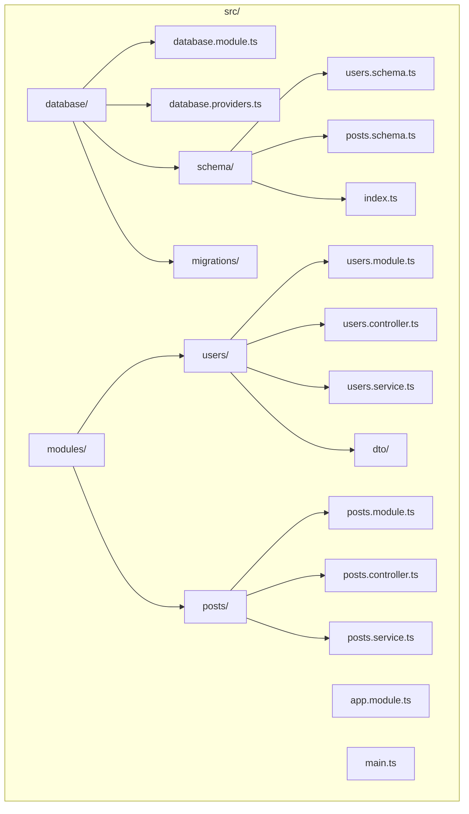

# Drizzle with NestJS

## Overview

Learn how to integrate Drizzle ORM with NestJS using proper dependency injection, module patterns, and best practices for enterprise applications.

## Installation

```bash
# Create NestJS project
npx @nestjs/cli new my-app

# Install Drizzle
npm install drizzle-orm
npm install -D drizzle-kit

# Install PostgreSQL driver
npm install pg
npm install -D @types/pg

# Or other drivers based on your needs
```

## Project Structure



## Database Module Setup

### database.providers.ts

```typescript
// src/database/database.providers.ts
import { drizzle, NodePgDatabase } from 'drizzle-orm/node-postgres';
import { Pool } from 'pg';
import * as schema from './schema';

export const DATABASE_CONNECTION = 'DATABASE_CONNECTION';

export const databaseProviders = [
  {
    provide: DATABASE_CONNECTION,
    useFactory: async (): Promise<NodePgDatabase<typeof schema>> => {
      const pool = new Pool({
        connectionString: process.env.DATABASE_URL,
        max: 20,
        idleTimeoutMillis: 30000,
        connectionTimeoutMillis: 2000,
      });
      
      return drizzle(pool, { schema, logger: true });
    },
  },
];

// Type export for injection
export type Database = NodePgDatabase<typeof schema>;
```

### database.module.ts

```typescript
// src/database/database.module.ts
import { Module, Global } from '@nestjs/common';
import { databaseProviders } from './database.providers';

@Global() // Makes module available everywhere
@Module({
  providers: [...databaseProviders],
  exports: [...databaseProviders],
})
export class DatabaseModule {}
```

### Schema Definition

```typescript
// src/database/schema/users.schema.ts
import { pgTable, serial, varchar, timestamp, boolean } from 'drizzle-orm/pg-core';
import { relations } from 'drizzle-orm';
import { posts } from './posts.schema';

export const users = pgTable('users', {
  id: serial('id').primaryKey(),
  email: varchar('email', { length: 255 }).notNull().unique(),
  name: varchar('name', { length: 100 }),
  passwordHash: varchar('password_hash', { length: 255 }).notNull(),
  isActive: boolean('is_active').default(true).notNull(),
  createdAt: timestamp('created_at').defaultNow().notNull(),
  updatedAt: timestamp('updated_at').defaultNow().notNull(),
});

export const usersRelations = relations(users, ({ many }) => ({
  posts: many(posts),
}));
```

```typescript
// src/database/schema/posts.schema.ts
import { pgTable, serial, varchar, text, integer, timestamp } from 'drizzle-orm/pg-core';
import { relations } from 'drizzle-orm';
import { users } from './users.schema';

export const posts = pgTable('posts', {
  id: serial('id').primaryKey(),
  title: varchar('title', { length: 255 }).notNull(),
  content: text('content'),
  authorId: integer('author_id').notNull().references(() => users.id),
  createdAt: timestamp('created_at').defaultNow().notNull(),
  updatedAt: timestamp('updated_at').defaultNow().notNull(),
});

export const postsRelations = relations(posts, ({ one }) => ({
  author: one(users, {
    fields: [posts.authorId],
    references: [users.id],
  }),
}));
```

```typescript
// src/database/schema/index.ts
export * from './users.schema';
export * from './posts.schema';
```

## Service Pattern

### users.service.ts

```typescript
// src/modules/users/users.service.ts
import { Injectable, Inject, NotFoundException } from '@nestjs/common';
import { eq, ilike } from 'drizzle-orm';
import { DATABASE_CONNECTION, Database } from '../../database/database.providers';
import { users } from '../../database/schema';
import { CreateUserDto, UpdateUserDto } from './dto';
import * as bcrypt from 'bcrypt';

@Injectable()
export class UsersService {
  constructor(
    @Inject(DATABASE_CONNECTION)
    private readonly db: Database,
  ) {}

  async create(createUserDto: CreateUserDto) {
    const passwordHash = await bcrypt.hash(createUserDto.password, 10);
    
    const [user] = await this.db
      .insert(users)
      .values({
        email: createUserDto.email,
        name: createUserDto.name,
        passwordHash,
      })
      .returning();
    
    // Don't return password hash
    const { passwordHash: _, ...result } = user;
    return result;
  }

  async findAll(filters?: { search?: string; isActive?: boolean }) {
    let query = this.db.select().from(users);
    
    if (filters?.search) {
      query = query.where(ilike(users.email, `%${filters.search}%`));
    }
    
    if (filters?.isActive !== undefined) {
      query = query.where(eq(users.isActive, filters.isActive));
    }
    
    return query;
  }

  async findOne(id: number) {
    const [user] = await this.db
      .select()
      .from(users)
      .where(eq(users.id, id));
    
    if (!user) {
      throw new NotFoundException(`User with ID ${id} not found`);
    }
    
    const { passwordHash: _, ...result } = user;
    return result;
  }

  async findByEmail(email: string) {
    const [user] = await this.db
      .select()
      .from(users)
      .where(eq(users.email, email));
    
    return user;
  }

  async update(id: number, updateUserDto: UpdateUserDto) {
    const [updated] = await this.db
      .update(users)
      .set({
        ...updateUserDto,
        updatedAt: new Date(),
      })
      .where(eq(users.id, id))
      .returning();
    
    if (!updated) {
      throw new NotFoundException(`User with ID ${id} not found`);
    }
    
    const { passwordHash: _, ...result } = updated;
    return result;
  }

  async remove(id: number) {
    await this.db.delete(users).where(eq(users.id, id));
  }
}
```

### DTOs

```typescript
// src/modules/users/dto/create-user.dto.ts
import { IsEmail, IsString, MinLength, IsOptional } from 'class-validator';

export class CreateUserDto {
  @IsEmail()
  email: string;

  @IsString()
  @MinLength(8)
  password: string;

  @IsString()
  @IsOptional()
  name?: string;
}
```

```typescript
// src/modules/users/dto/update-user.dto.ts
import { PartialType } from '@nestjs/mapped-types';
import { CreateUserDto } from './create-user.dto';

export class UpdateUserDto extends PartialType(CreateUserDto) {}
```

## Controller

```typescript
// src/modules/users/users.controller.ts
import { 
  Controller, 
  Get, 
  Post, 
  Body, 
  Patch, 
  Param, 
  Delete, 
  Query,
  ParseIntPipe,
} from '@nestjs/common';
import { UsersService } from './users.service';
import { CreateUserDto, UpdateUserDto } from './dto';

@Controller('users')
export class UsersController {
  constructor(private readonly usersService: UsersService) {}

  @Post()
  create(@Body() createUserDto: CreateUserDto) {
    return this.usersService.create(createUserDto);
  }

  @Get()
  findAll(@Query('search') search?: string) {
    return this.usersService.findAll({ search });
  }

  @Get(':id')
  findOne(@Param('id', ParseIntPipe) id: number) {
    return this.usersService.findOne(id);
  }

  @Patch(':id')
  update(
    @Param('id', ParseIntPipe) id: number,
    @Body() updateUserDto: UpdateUserDto,
  ) {
    return this.usersService.update(id, updateUserDto);
  }

  @Delete(':id')
  remove(@Param('id', ParseIntPipe) id: number) {
    return this.usersService.remove(id);
  }
}
```

## Repository Pattern

For more complex applications, use repository pattern:

### users.repository.ts

```typescript
// src/modules/users/users.repository.ts
import { Injectable, Inject } from '@nestjs/common';
import { eq, and, ilike, or } from 'drizzle-orm';
import { DATABASE_CONNECTION, Database } from '../../database/database.providers';
import { users } from '../../database/schema';
import { InferInsertModel, InferSelectModel } from 'drizzle-orm';

export type User = InferSelectModel<typeof users>;
export type NewUser = InferInsertModel<typeof users>;

@Injectable()
export class UsersRepository {
  constructor(
    @Inject(DATABASE_CONNECTION)
    private readonly db: Database,
  ) {}

  async create(user: NewUser): Promise<User> {
    const [created] = await this.db
      .insert(users)
      .values(user)
      .returning();
    return created;
  }

  async findById(id: number): Promise<User | undefined> {
    const [user] = await this.db
      .select()
      .from(users)
      .where(eq(users.id, id));
    return user;
  }

  async findByEmail(email: string): Promise<User | undefined> {
    const [user] = await this.db
      .select()
      .from(users)
      .where(eq(users.email, email));
    return user;
  }

  async findAll(): Promise<User[]> {
    return this.db.select().from(users);
  }

  async search(query: string): Promise<User[]> {
    return this.db
      .select()
      .from(users)
      .where(
        or(
          ilike(users.name, `%${query}%`),
          ilike(users.email, `%${query}%`)
        )
      );
  }

  async update(id: number, data: Partial<NewUser>): Promise<User | undefined> {
    const [updated] = await this.db
      .update(users)
      .set({ ...data, updatedAt: new Date() })
      .where(eq(users.id, id))
      .returning();
    return updated;
  }

  async delete(id: number): Promise<void> {
    await this.db.delete(users).where(eq(users.id, id));
  }

  async findWithPosts(userId: number) {
    return this.db.query.users.findFirst({
      where: eq(users.id, userId),
      with: {
        posts: true,
      },
    });
  }
}
```

### Updated Service

```typescript
// src/modules/users/users.service.ts
import { Injectable, NotFoundException } from '@nestjs/common';
import { UsersRepository } from './users.repository';
import { CreateUserDto, UpdateUserDto } from './dto';
import * as bcrypt from 'bcrypt';

@Injectable()
export class UsersService {
  constructor(private readonly usersRepo: UsersRepository) {}

  async create(dto: CreateUserDto) {
    const passwordHash = await bcrypt.hash(dto.password, 10);
    
    const user = await this.usersRepo.create({
      email: dto.email,
      name: dto.name,
      passwordHash,
    });
    
    const { passwordHash: _, ...result } = user;
    return result;
  }

  async findAll() {
    return this.usersRepo.findAll();
  }

  async findOne(id: number) {
    const user = await this.usersRepo.findById(id);
    
    if (!user) {
      throw new NotFoundException(`User with ID ${id} not found`);
    }
    
    const { passwordHash: _, ...result } = user;
    return result;
  }

  async update(id: number, dto: UpdateUserDto) {
    const user = await this.usersRepo.update(id, dto);
    
    if (!user) {
      throw new NotFoundException(`User with ID ${id} not found`);
    }
    
    const { passwordHash: _, ...result } = user;
    return result;
  }

  async remove(id: number) {
    await this.usersRepo.delete(id);
  }
}
```

## Testing with Drizzle

### users.service.spec.ts

```typescript
// src/modules/users/users.service.spec.ts
import { Test, TestingModule } from '@nestjs/testing';
import { UsersService } from './users.service';
import { UsersRepository } from './users.repository';

describe('UsersService', () => {
  let service: UsersService;
  let repository: UsersRepository;

  const mockRepository = {
    create: jest.fn(),
    findById: jest.fn(),
    findAll: jest.fn(),
    update: jest.fn(),
    delete: jest.fn(),
  };

  beforeEach(async () => {
    const module: TestingModule = await Test.createTestingModule({
      providers: [
        UsersService,
        {
          provide: UsersRepository,
          useValue: mockRepository,
        },
      ],
    }).compile();

    service = module.get<UsersService>(UsersService);
    repository = module.get<UsersRepository>(UsersRepository);
  });

  it('should be defined', () => {
    expect(service).toBeDefined();
  });

  describe('create', () => {
    it('should create a user', async () => {
      const dto = {
        email: 'test@example.com',
        name: 'Test User',
        password: 'password123',
      };

      const expectedUser = {
        id: 1,
        email: dto.email,
        name: dto.name,
        passwordHash: 'hashed',
        isActive: true,
        createdAt: new Date(),
        updatedAt: new Date(),
      };

      mockRepository.create.mockResolvedValue(expectedUser);

      const result = await service.create(dto);

      expect(result).toBeDefined();
      expect(result.email).toBe(dto.email);
      expect(result).not.toHaveProperty('passwordHash');
    });
  });
});
```

## Transaction Support

```typescript
// src/modules/posts/posts.service.ts
import { Injectable, Inject } from '@nestjs/common';
import { DATABASE_CONNECTION, Database } from '../../database/database.providers';
import { posts, users } from '../../database/schema';

@Injectable()
export class PostsService {
  constructor(
    @Inject(DATABASE_CONNECTION)
    private readonly db: Database,
  ) {}

  async createWithAuthor(postData: any, userData: any) {
    return this.db.transaction(async (tx) => {
      // Create user
      const [user] = await tx
        .insert(users)
        .values(userData)
        .returning();
      
      // Create post
      const [post] = await tx
        .insert(posts)
        .values({
          ...postData,
          authorId: user.id,
        })
        .returning();
      
      return { user, post };
    });
  }
}
```

## Health Check

```typescript
// src/health/health.controller.ts
import { Controller, Get, Inject } from '@nestjs/common';
import { DATABASE_CONNECTION, Database } from '../database/database.providers';
import { sql } from 'drizzle-orm';

@Controller('health')
export class HealthController {
  constructor(
    @Inject(DATABASE_CONNECTION)
    private readonly db: Database,
  ) {}

  @Get('db')
  async checkDatabase() {
    try {
      await this.db.execute(sql`SELECT 1`);
      return { status: 'healthy', database: 'connected' };
    } catch (error) {
      return { status: 'unhealthy', database: 'disconnected', error: error.message };
    }
  }
}
```

## Module Setup

```typescript
// src/modules/users/users.module.ts
import { Module } from '@nestjs/common';
import { UsersService } from './users.service';
import { UsersController } from './users.controller';
import { UsersRepository } from './users.repository';

@Module({
  controllers: [UsersController],
  providers: [UsersService, UsersRepository],
  exports: [UsersService, UsersRepository],
})
export class UsersModule {}
```

```typescript
// src/app.module.ts
import { Module } from '@nestjs/common';
import { ConfigModule } from '@nestjs/config';
import { DatabaseModule } from './database/database.module';
import { UsersModule } from './modules/users/users.module';
import { PostsModule } from './modules/posts/posts.module';

@Module({
  imports: [
    ConfigModule.forRoot({ isGlobal: true }),
    DatabaseModule,
    UsersModule,
    PostsModule,
  ],
})
export class AppModule {}
```

## Practice Exercises

1. **Create complete CRUD** for posts module with relations
2. **Implement authentication** using Drizzle and JWT
3. **Add pagination** and filtering to all endpoints
4. **Create integration tests** with test database
5. **Build complex queries** with repository pattern
6. **Implement caching** for frequently accessed data

## Next Steps

Continue to [Drizzle with Next.js](./08_nextjs_integration.md) for server actions and edge runtime integration.
