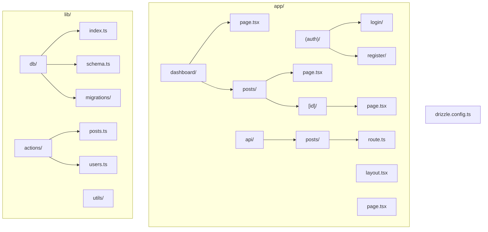

# Drizzle with Next.js

## Overview

Learn how to integrate Drizzle ORM with Next.js App Router, Server Actions, React Server Components, and Edge Runtime for modern full-stack applications.

## Installation

```bash
# Create Next.js project
npx create-next-app@latest my-app

# Install Drizzle
npm install drizzle-orm
npm install -D drizzle-kit

# Install database driver (choose based on deployment)
# Vercel Postgres (recommended for Vercel)
npm install @vercel/postgres

# or Neon (serverless PostgreSQL)
npm install @neondatabase/serverless

# or traditional pg
npm install pg
npm install -D @types/pg
```

## Project Structure



## Database Setup

### lib/db/index.ts

```typescript
// Edge-compatible setup (Vercel Postgres)
import { drizzle } from 'drizzle-orm/vercel-postgres';
import { sql } from '@vercel/postgres';
import * as schema from './schema';

export const db = drizzle(sql, { schema });

// Or Neon serverless
import { neon } from '@neondatabase/serverless';
import { drizzle } from 'drizzle-orm/neon-http';

const sql = neon(process.env.DATABASE_URL!);
export const db = drizzle(sql, { schema });

// Or traditional (Node.js runtime only)
import { drizzle } from 'drizzle-orm/node-postgres';
import { Pool } from 'pg';

const pool = new Pool({
  connectionString: process.env.DATABASE_URL,
});

export const db = drizzle(pool, { schema });
```

### lib/db/schema.ts

```typescript
import { pgTable, serial, varchar, text, integer, timestamp, boolean } from 'drizzle-orm/pg-core';
import { relations } from 'drizzle-orm';

export const users = pgTable('users', {
  id: serial('id').primaryKey(),
  email: varchar('email', { length: 255 }).notNull().unique(),
  name: varchar('name', { length: 100 }),
  image: text('image'),
  createdAt: timestamp('created_at').defaultNow().notNull(),
});

export const posts = pgTable('posts', {
  id: serial('id').primaryKey(),
  title: varchar('title', { length: 255 }).notNull(),
  content: text('content'),
  published: boolean('published').default(false).notNull(),
  authorId: integer('author_id').notNull().references(() => users.id),
  createdAt: timestamp('created_at').defaultNow().notNull(),
  updatedAt: timestamp('updated_at').defaultNow().notNull(),
});

export const usersRelations = relations(users, ({ many }) => ({
  posts: many(posts),
}));

export const postsRelations = relations(posts, ({ one }) => ({
  author: one(users, {
    fields: [posts.authorId],
    references: [users.id],
  }),
}));

// Type exports
export type User = typeof users.$inferSelect;
export type NewUser = typeof users.$inferInsert;
export type Post = typeof posts.$inferSelect;
export type NewPost = typeof posts.$inferInsert;
```

## Server Actions

### lib/actions/posts.ts

```typescript
'use server';

import { db } from '@/lib/db';
import { posts } from '@/lib/db/schema';
import { eq, desc } from 'drizzle-orm';
import { revalidatePath } from 'next/cache';
import { redirect } from 'next/navigation';

// Get all posts
export async function getPosts() {
  return await db.query.posts.findMany({
    orderBy: [desc(posts.createdAt)],
    with: {
      author: {
        columns: {
          id: true,
          name: true,
          image: true,
        },
      },
    },
  });
}

// Get single post
export async function getPost(id: number) {
  return await db.query.posts.findFirst({
    where: eq(posts.id, id),
    with: {
      author: true,
    },
  });
}

// Create post
export async function createPost(formData: FormData) {
  const title = formData.get('title') as string;
  const content = formData.get('content') as string;
  const authorId = formData.get('authorId') as string;

  const [post] = await db
    .insert(posts)
    .values({
      title,
      content,
      authorId: parseInt(authorId),
    })
    .returning();

  revalidatePath('/dashboard/posts');
  redirect(`/dashboard/posts/${post.id}`);
}

// Update post
export async function updatePost(id: number, formData: FormData) {
  const title = formData.get('title') as string;
  const content = formData.get('content') as string;

  await db
    .update(posts)
    .set({
      title,
      content,
      updatedAt: new Date(),
    })
    .where(eq(posts.id, id));

  revalidatePath('/dashboard/posts');
  revalidatePath(`/dashboard/posts/${id}`);
}

// Delete post
export async function deletePost(id: number) {
  await db.delete(posts).where(eq(posts.id, id));

  revalidatePath('/dashboard/posts');
  redirect('/dashboard/posts');
}

// Toggle publish status
export async function togglePublish(id: number, published: boolean) {
  await db
    .update(posts)
    .set({ published: !published })
    .where(eq(posts.id, id));

  revalidatePath('/dashboard/posts');
}
```

## React Server Components

### app/dashboard/posts/page.tsx

```typescript
import { getPosts } from '@/lib/actions/posts';
import { PostCard } from '@/components/post-card';
import Link from 'next/link';

export default async function PostsPage() {
  const posts = await getPosts();

  return (
    <div className="container mx-auto p-6">
      <div className="flex justify-between items-center mb-6">
        <h1 className="text-3xl font-bold">Posts</h1>
        <Link
          href="/dashboard/posts/new"
          className="px-4 py-2 bg-blue-600 text-white rounded"
        >
          Create Post
        </Link>
      </div>

      <div className="grid gap-4">
        {posts.map((post) => (
          <PostCard key={post.id} post={post} />
        ))}
      </div>
    </div>
  );
}
```

### app/dashboard/posts/[id]/page.tsx

```typescript
import { getPost } from '@/lib/actions/posts';
import { notFound } from 'next/navigation';
import { DeleteButton } from '@/components/delete-button';
import { PublishToggle } from '@/components/publish-toggle';

export default async function PostPage({
  params,
}: {
  params: { id: string };
}) {
  const post = await getPost(parseInt(params.id));

  if (!post) {
    notFound();
  }

  return (
    <div className="container mx-auto p-6">
      <article>
        <div className="flex justify-between items-start mb-4">
          <h1 className="text-4xl font-bold">{post.title}</h1>
          <div className="flex gap-2">
            <PublishToggle id={post.id} published={post.published} />
            <DeleteButton id={post.id} />
          </div>
        </div>

        <div className="text-gray-600 mb-4">
          By {post.author.name} on {post.createdAt.toLocaleDateString()}
        </div>

        <div className="prose max-w-none">{post.content}</div>
      </article>
    </div>
  );
}
```

## Client Components with Server Actions

### components/post-form.tsx

```typescript
'use client';

import { useFormStatus } from 'react-dom';
import { createPost } from '@/lib/actions/posts';

function SubmitButton() {
  const { pending } = useFormStatus();

  return (
    <button
      type="submit"
      disabled={pending}
      className="px-4 py-2 bg-blue-600 text-white rounded disabled:opacity-50"
    >
      {pending ? 'Creating...' : 'Create Post'}
    </button>
  );
}

export function PostForm({ userId }: { userId: number }) {
  return (
    <form action={createPost} className="space-y-4">
      <input type="hidden" name="authorId" value={userId} />

      <div>
        <label htmlFor="title" className="block mb-2">
          Title
        </label>
        <input
          type="text"
          id="title"
          name="title"
          required
          className="w-full px-3 py-2 border rounded"
        />
      </div>

      <div>
        <label htmlFor="content" className="block mb-2">
          Content
        </label>
        <textarea
          id="content"
          name="content"
          rows={10}
          required
          className="w-full px-3 py-2 border rounded"
        />
      </div>

      <SubmitButton />
    </form>
  );
}
```

### components/delete-button.tsx

```typescript
'use client';

import { deletePost } from '@/lib/actions/posts';
import { useTransition } from 'react';

export function DeleteButton({ id }: { id: number }) {
  const [isPending, startTransition] = useTransition();

  const handleDelete = () => {
    if (confirm('Are you sure you want to delete this post?')) {
      startTransition(() => {
        deletePost(id);
      });
    }
  };

  return (
    <button
      onClick={handleDelete}
      disabled={isPending}
      className="px-4 py-2 bg-red-600 text-white rounded disabled:opacity-50"
    >
      {isPending ? 'Deleting...' : 'Delete'}
    </button>
  );
}
```

## Optimistic Updates

```typescript
'use client';

import { useState, useOptimistic, useTransition } from 'react';
import { togglePublish } from '@/lib/actions/posts';

export function PublishToggle({
  id,
  published,
}: {
  id: number;
  published: boolean;
}) {
  const [isPending, startTransition] = useTransition();
  const [optimisticPublished, setOptimisticPublished] = useOptimistic(published);

  const handleToggle = () => {
    startTransition(async () => {
      setOptimisticPublished(!optimisticPublished);
      await togglePublish(id, optimisticPublished);
    });
  };

  return (
    <button
      onClick={handleToggle}
      disabled={isPending}
      className={`px-4 py-2 rounded ${
        optimisticPublished
          ? 'bg-green-600 text-white'
          : 'bg-gray-300 text-gray-700'
      }`}
    >
      {optimisticPublished ? 'Published' : 'Draft'}
    </button>
  );
}
```

## API Routes

### app/api/posts/route.ts

```typescript
import { NextRequest, NextResponse } from 'next/server';
import { db } from '@/lib/db';
import { posts } from '@/lib/db/schema';
import { desc } from 'drizzle-orm';

export const runtime = 'edge'; // Optional: Use edge runtime

export async function GET(request: NextRequest) {
  try {
    const allPosts = await db
      .select()
      .from(posts)
      .orderBy(desc(posts.createdAt));

    return NextResponse.json(allPosts);
  } catch (error) {
    return NextResponse.json(
      { error: 'Failed to fetch posts' },
      { status: 500 }
    );
  }
}

export async function POST(request: NextRequest) {
  try {
    const body = await request.json();

    const [newPost] = await db
      .insert(posts)
      .values(body)
      .returning();

    return NextResponse.json(newPost, { status: 201 });
  } catch (error) {
    return NextResponse.json(
      { error: 'Failed to create post' },
      { status: 500 }
    );
  }
}
```

### app/api/posts/[id]/route.ts

```typescript
import { NextRequest, NextResponse } from 'next/server';
import { db } from '@/lib/db';
import { posts } from '@/lib/db/schema';
import { eq } from 'drizzle-orm';

export async function GET(
  request: NextRequest,
  { params }: { params: { id: string } }
) {
  const [post] = await db
    .select()
    .from(posts)
    .where(eq(posts.id, parseInt(params.id)));

  if (!post) {
    return NextResponse.json({ error: 'Post not found' }, { status: 404 });
  }

  return NextResponse.json(post);
}

export async function PATCH(
  request: NextRequest,
  { params }: { params: { id: string } }
) {
  const body = await request.json();

  const [updated] = await db
    .update(posts)
    .set({ ...body, updatedAt: new Date() })
    .where(eq(posts.id, parseInt(params.id)))
    .returning();

  return NextResponse.json(updated);
}

export async function DELETE(
  request: NextRequest,
  { params }: { params: { id: string } }
) {
  await db.delete(posts).where(eq(posts.id, parseInt(params.id)));

  return NextResponse.json({ success: true });
}
```

## Row Level Security with Supabase

```typescript
// lib/db/rls.ts
import { drizzle } from 'drizzle-orm/postgres-js';
import postgres from 'postgres';
import { sql } from 'drizzle-orm';

type SupabaseToken = {
  sub?: string;
  role?: string;
  [key: string]: any;
};

export function createDrizzleSupabase(token: SupabaseToken) {
  const client = postgres(process.env.DATABASE_URL!, {
    prepare: false,
  });

  const db = drizzle(client);

  return {
    db,
    async withRLS<T>(callback: (tx: typeof db) => Promise<T>): Promise<T> {
      return await db.transaction(async (tx) => {
        try {
          // Set JWT claims for RLS
          await tx.execute(sql`
            SELECT set_config('request.jwt.claims', '${sql.raw(
              JSON.stringify(token)
            )}', TRUE);
            SELECT set_config('request.jwt.claim.sub', '${sql.raw(
              token.sub ?? ''
            )}', TRUE);
            SET LOCAL ROLE ${sql.raw(token.role ?? 'anon')};
          `);

          // Execute callback
          const result = await callback(tx);

          return result;
        } finally {
          // Reset
          await tx.execute(sql`
            SELECT set_config('request.jwt.claims', NULL, TRUE);
            SELECT set_config('request.jwt.claim.sub', NULL, TRUE);
            RESET ROLE;
          `);
        }
      });
    },
  };
}

// Usage in server action
export async function getUserPosts(userId: string) {
  const { db, withRLS } = createDrizzleSupabase({ sub: userId, role: 'authenticated' });

  return withRLS(async (tx) => {
    return tx.query.posts.findMany({
      where: eq(posts.authorId, parseInt(userId)),
    });
  });
}
```

## Middleware for Database Access

```typescript
// middleware.ts
import { NextResponse } from 'next/server';
import type { NextRequest } from 'next/server';

export function middleware(request: NextRequest) {
  // Add custom headers for database tracing
  const requestHeaders = new Headers(request.headers);
  requestHeaders.set('x-request-id', crypto.randomUUID());

  return NextResponse.next({
    request: {
      headers: requestHeaders,
    },
  });
}

export const config = {
  matcher: '/api/:path*',
};
```

## Data Fetching Patterns

### Streaming

```typescript
import { Suspense } from 'react';
import { getPosts } from '@/lib/actions/posts';

async function Posts() {
  const posts = await getPosts();
  return (
    <div>
      {posts.map((post) => (
        <div key={post.id}>{post.title}</div>
      ))}
    </div>
  );
}

export default function Page() {
  return (
    <Suspense fallback={<div>Loading posts...</div>}>
      <Posts />
    </Suspense>
  );
}
```

### Parallel Data Fetching

```typescript
export default async function Dashboard() {
  // Fetch in parallel
  const [posts, users, stats] = await Promise.all([
    getPosts(),
    getUsers(),
    getStats(),
  ]);

  return (
    <div>
      <Stats data={stats} />
      <Posts data={posts} />
      <Users data={users} />
    </div>
  );
}
```

## Practice Exercises

1. **Build a complete blog** with CRUD operations
2. **Implement authentication** with server actions
3. **Add optimistic updates** for better UX
4. **Create API routes** for external clients
5. **Implement RLS** with Supabase
6. **Build real-time features** with polling or webhooks

## Next Steps

Continue to [Performance and Best Practices](./09_performance_best_practices.md) for optimization techniques and production tips.
