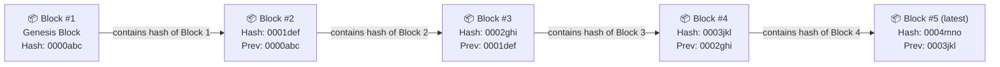
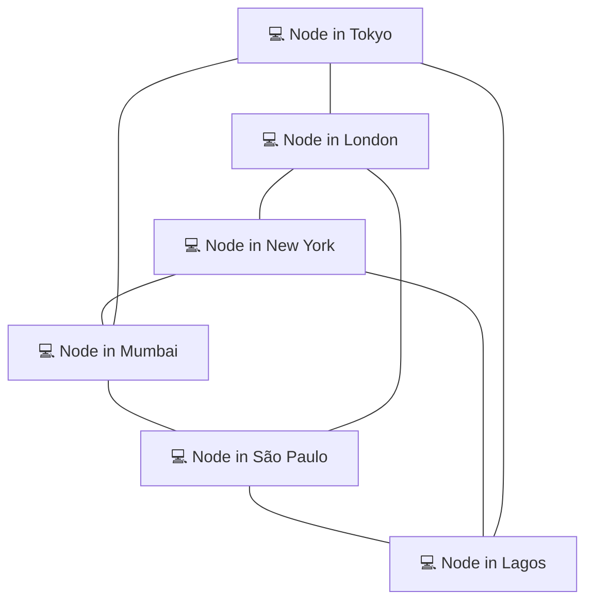
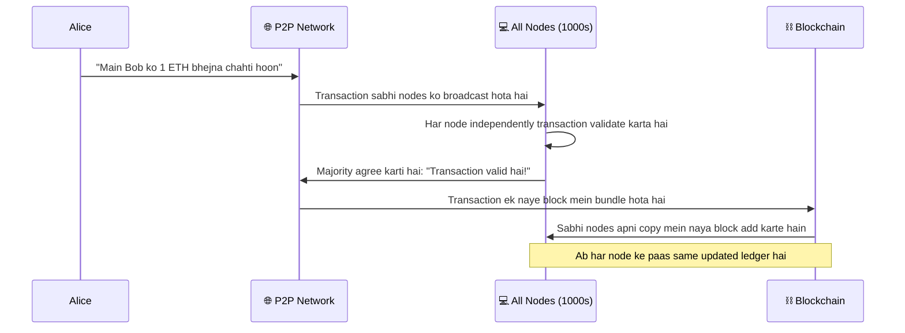
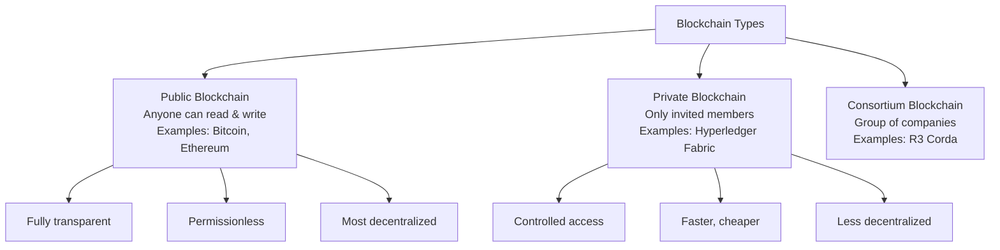

# 01 — What is a Blockchain?

> **Level:** Absolute Beginner | **Estimated Reading Time:** 15–20 minutes
>
> **Prerequisites:** Kuch nahi. Bas curiosity honi chahiye.

---

## 🗺️ Chapter Overview

Solidity ki ek line likhne se pehle, humein us duniya ko samajhna hoga jisme hamara code chalega. Yeh chapter Web3 ka sabse fundamental sawaal answer karta hai:

> *"Blockchain hai kya, aur yeh exist hi kyun karta hai?"*

Hum ye answer ekdum shuru se banayenge — everyday analogies, visual diagrams ke saath, aur yeh assume kiye bina ki tumhe pehle se kuch pata hai.

---

## 📖 Woh Problem Jo Blockchain Solve Karta Hai (Yahan Se Shuru Karo)

Socho tum aur tumhara dost ek bet lagate ho: agar kal baarish hui to woh tumhe ₹500 dega. Baarish hoti hai. Woh keh deta hai, "Maine ₹500 kaha hi nahi tha." Tum kehte ho, "Haan bola tha!" Ab yahan koi third party nahi hai, koi record nahi hai, koi proof nahi hai.

Ab isi problem ko scale up karo. Do banks ko ek doosre desh mein $10 million transfer karne hain. Woh ek doosre ke record pe *trust* kaise karenge ki kisne kya bheja aur kisne kya receive kiya — bina spreadsheets ki jung ke?

Answer hamesha se same raha hai: **ek trusted middleman rakho jo record maintain kare.**

- Bank tumhara balance rakhta hai.
- Notary ek property deal ka record rakhta hai.
- Government tumhare land documents rakhti hai.

Yeh middlemen kehlate hain **centralized authorities** — yaani ek hi entity "true" ledger (fancy word for *record book*) apne paas rakhti hai.

Yeh system kaam karta hai, lekin isme kuch painful weaknesses hain:

| Problem                     | Real-World Example                                     |
| ---------------------------- | -------------------------------------------------------- |
| Single point of failure      | Bank ke servers down ho gaye, tum rent nahi de paate     |
| Corruption / manipulation    | Bank chupke se apni books alter kar deta hai             |
| Censorship                   | Government bina warning ke tumhara account freeze kar de |
| High fees                    | Wire transfer ka charge $25–$50 tak ho sakta hai         |
| Trust zaruri hai             | Tumhe maanna padta hai ki bank honest hai                |

**Blockchain inhi sab problems ko ek saath solve karne ke liye banaya gaya tha.** Yeh ek aisa tareeka hai record rakhne ka jise koi ek insaan control nahi karta, jise koi bhi verify kar sakta hai, aur jise koi chupke se badal nahi sakta.

---

## 🔗 Blockchain Hai Kya?

Blockchain ko aise socho — jaise ek **shared Google Sheet jisme se koi row delete nahi kar sakta, aur jise sab dekh sakte hain.**

Thoda precise define karein toh:

> Ek **blockchain** ek type ka database hai (ek ledger) jo records ko **blocks** naam ke chunks mein store karta hai, har block ko usse pehle wale block se link karta hai (isse ek **chain** banti hai), aur is poori chain ko duniya bhar ke hazaaron computers pe ek saath copy kar deta hai.

Chalo is definition ko part-by-part samajhte hain.

### Part 1: Ek Ledger

Ledger bas ek record book hai. Bank ka ledger kuch aisa dikhta hai:

```
Alice ke paas $500 hain
Bob ke paas $200 hain
Alice, Bob ko $100 bhejti hai → Ab Alice ke paas $400, Bob ke paas $300
```

Blockchain ka ledger bhi waisi hi information store karta hai — kisne kya kisko bheja — lekin ekdum alag tareeke se.

### Part 2: Blocks Mein Grouped

Har transaction ko ek lambi list mein ek-ek karke likhne ke bajaye, blockchain bahut saari transactions ko ek saath group karke ek **block** banata hai. Har block ko notebook ke ek page jaisa socho:

```
+---------------------------+
|        BLOCK #5           |
|---------------------------|
| Tx 1: Alice → Bob  1 ETH  |
| Tx 2: Carol → Dave 2 ETH  |
| Tx 3: Eve → Frank  0.5ETH |
| ...                       |
| Timestamp: 2024-01-15     |
+---------------------------+
```

### Part 3: Chain Mein Jude Hue (Yeh KEY part hai)

Har naya block, us se pehle wale block ka ek special fingerprint apne andar rakhta hai. Is fingerprint ko **hash** kehte hain. Isse aise socho jaise ek lifafe pe laga wax seal — agar andar ki even ek word bhi tamper karo, poora seal badal jaata hai.

Kyunki har block apne pichle block ka fingerprint rakhta hai, ek unbreakable chain ban jaati hai:



**Yeh chain kyun matter karti hai?** Agar koi Block #2 ki koi transaction chupke se badalne ki koshish kare, toh us block ka hash change ho jaayega. Iska matlab Block #3 ka "previous hash" pointer ab galat ho gaya. Block #3 toot jaata hai. Block #4 toot jaata hai. Us point se aage poori chain toot jaati hai. Tampering *turant* pakdi jaati hai.

> **Analogy:** Ek library socho jahan har book, us se pehle wali book ke exact page count ka reference deti hai. Agar tum chupke se Book 3 mein pages add kar do, toh Book 4 se Book 1000 tak sab references galat ho jaayenge. Librarian sirf page counts check karke turant tampering pakad lega.

---

## 🌐 Centralized vs. Decentralized

Web2 se Web3 thinking mein shift karte waqt yeh shaayad sabse important conceptual change hai.

### Centralized Systems (Traditional Web)

Centralized system mein, ek server (ya ek company ka cluster of servers) hi single source of truth hota hai.

```
         Tum
          |
          ▼
    ┌───────────┐
    │  BANK     │ ← Single source of truth
    │  SERVER   │   (ek hi company control karti hai)
    └───────────┘
```

**Pros:** Simple, fast, update karna easy, mistakes fix karna easy.

**Cons:** Hack karne ke liye ek hi target, corrupt/bribe karne ke liye ek hi entity, ek hi point jo offline ho sakta hai, ek hi entity jo tumhe censor kar sakti hai.

### Decentralized Systems (Blockchain)

Decentralized system mein, hazaaron computers (jinhe **nodes** kehte hain) same ledger ki ek complete copy apne paas rakhte hain. Koi ek server incharge nahi hota.



Is network ka har node poori blockchain ki full copy rakhta hai. Jab ek naya transaction hota hai:

1. Transaction sabhi nodes ko ek saath broadcast kiya jaata hai.
2. Nodes check karte hain ki transaction valid hai ya nahi (jaise, kya Alice ke paas sach mein itne funds hain?).
3. Agar majority nodes agree karein ki transaction valid hai, toh usse next block mein add kar diya jaata hai.
4. Har node apni ledger ki copy update kar leta hai.

Koi bhi single node cheat nahi kar sakta. Ledger ko corrupt karne ke liye tumhe duniya ke 50% se zyada nodes ko control karna padega — ek saath. Isse **51% attack** kehte hain, aur Ethereum ya Bitcoin jaisi major blockchains pe yeh economically impossible hai.

> [!info]
> Isse UPI se compare karo — agar sirf ek bank ka server down ho jaaye toh sirf uske customers affect hote hain, poora UPI network nahi. Blockchain ka idea usse ek level aage le jaata hai: koi bhi single point of failure hi nahi hota, kyunki har node ke paas apni khud ki full copy hai.

---

## 🔒 Immutability — "No Erasing" Rule

**Immutability** ka matlab hai — ek baar data blockchain pe likh diya, toh usse badla ya delete nahi kiya ja sakta. Kabhi bhi.

Yeh un developers ke liye sabse mind-bending property hai jo traditional databases se aaye hain, jahan tum freely `UPDATE` ya `DELETE` SQL statements chala sakte ho.

> **Library Book Analogy:** Ek library socho jahan books permanent ink mein likhi jaati hain, aur ek baar shelf pe file ho jaayein toh glass mein seal ho jaati hain. Tum hamesha padh sakte ho, lekin ek word bhi modify nahi kar sakte. Agar book mein error hai, toh tum usse fix nahi kar sakte — tum sirf ek *nayi* book add kar sakte ho jisme likha ho "correction: pichli book mein page 5 pe error tha."

Blockchain ki language mein:

- Tum ek transaction delete nahi kar sakte.
- Tum ek transaction change nahi kar sakte.
- Tum sirf naye transactions *add* kar sakte ho.

Yeh weakness lagta hai, lekin actually yeh trust ke liye ek superpower hai. Jab tum blockchain pe koi transaction dekhte ho, tumhe absolute certainty hoti hai ki woh hua hai aur kisi ne record ke saath chhedchhad nahi ki.

```
TRADITIONAL DATABASE          BLOCKCHAIN
──────────────────            ──────────
   INSERT ✅                  WRITE ✅
   UPDATE ✅                  UPDATE ❌ (impossible)
   DELETE ✅                  DELETE ❌ (impossible)
   REWRITE ✅                 REWRITE ❌ (impossible)
```

---

## 📒 Distributed Ledger Samjho

Poora technical term jo tum sunoge woh hai **Distributed Ledger Technology (DLT)**. Chalo isse break down karte hain:

- **Ledger** = transactions ki ek record book (yeh humne upar cover kiya).
- **Distributed** = bahut saare computers pe failaya hua, ek jagah pe rakha hua nahi.

Aise socho:

> **Purana Tareeka (Centralized):** Ek teacher class ka attendance register rakhti hai. Agar teacher usse kho de, toh woh gaya. Agar teacher jhooth bole, toh koi prove nahi kar sakta.

> **Naya Tareeka (Distributed):** Har student attendance register ki ek identical copy rakhta hai. Agar ek student apni copy change kare, toh woh turant baaki 29 copies se disagree kar degi. Truth majority se decide hoti hai.

Jab blockchain mein ek naya transaction add hota hai, yeh hota hai:



---

## 🧱 Ek Block Ke Andar Actually Hota Kya Hai?

Chalo ek block khol ke uski anatomy dekhte hain:

```
╔══════════════════════════════════════════════════╗
║                    BLOCK HEADER                  ║
║  Block Number:    #18,500,001                    ║
║  Timestamp:       2024-01-15 08:32:14 UTC        ║
║  Previous Hash:   0x9a3f...b7c2 (Block #18.5M)  ║
║  Merkle Root:     0x4d2e...a1f9 (fingerprint of  ║
║                   all transactions below)         ║
║  Nonce:           2938471234 (proof of work)     ║
╠══════════════════════════════════════════════════╣
║                  TRANSACTIONS                    ║
║  Tx #1: 0xAlice → 0xBob       1.00 ETH           ║
║  Tx #2: 0xCarol → 0xDave      0.05 ETH           ║
║  Tx #3: 0xEve   → Contract    0.50 ETH           ║
║  Tx #4: 0xFrank → 0xGrace     2.30 ETH           ║
║  ... (up to thousands of transactions)           ║
╚══════════════════════════════════════════════════╝
```

Key fields plain language mein:

| Field                | Yeh Kya Hai                                     | Simple Bhasha Mein                                    |
| ---------------------- | -------------------------------------------------- | -------------------------------------------------------- |
| **Block Number**    | Sequential index                                   | "Yeh notebook ka 18,500,001va page hai"                 |
| **Timestamp**       | Block kab bana                                     | "Yeh page 15 Jan, 2024 ko likha gaya"                   |
| **Previous Hash**   | Pichle block ka fingerprint                        | "Pichle page ka seal, jo continuity prove karta hai"    |
| **Merkle Root**     | Is block ki SAARI transactions ka fingerprint      | "Is page pe jo bhi hai uska ek single checksum"         |
| **Nonce**           | Ek number jo miners ne guess karke block banaya    | "Ek bahut hard puzzle ka answer"                        |
| **Transactions**    | Actual data                                        | "Is page pe record hue events ki list"                  |

---

## ⚙️ Sab Log Agree Kaise Karte Hain? (Consensus, Simply Explained)

Agar koi incharge nahi hai, toh hazaaron nodes kaise agree karte hain ki ledger ka kaunsa version "correct" hai? Isse solve karta hai ek **consensus mechanism**.

Isse ek classroom vote jaisa socho. Naya block officially add hone se pehle:

- Sabhi nodes same rules follow karte hain.
- Woh har transaction ko independently verify karte hain.
- Woh next block pe agree karne ke liye vote karte hain ya compete karte hain.

Do sabse famous consensus mechanisms hain:

### Proof of Work (PoW) — Bitcoin Use Karta Hai

Nodes (jinhe **miners** kehte hain) ek computationally hard math puzzle solve karne ke liye compete karte hain. Jo jeetta hai woh next block add kar sakta hai aur reward (Bitcoin) kamaata hai. Yeh ek race jaisa hai jisme sabse pehle puzzle solve karne wala jeetta hai.

```
[Bahut saare miners compete kar rahe hain] → [Sabse pehle puzzle solve kiya] → [Block add karne ka right jeeta]
        ⛏️⛏️⛏️                      🏆                        ⛓️
```

**Cost:** Bahut zyada electricity consumption.
**Benefit:** 15+ saal se proven security.

### Proof of Stake (PoS) — Ethereum Use Karta Hai (2022 se)

Puzzle solve karne ke bajaye, nodes (jinhe **validators** kehte hain) apna khud ka cryptocurrency collateral ke roop mein lock (stake) kar dete hain. Unhe randomly select kiya jaata hai next block add karne ke liye, jitna zyada stake utna zyada chance. Agar woh cheat karte hain, toh unka stake chala jaata hai.

```
[Validators ETH stake karte hain] → [Random validator select hota hai] → [Block add karta hai, reward kamaata hai]
       🔒💰                        🎲                          ⛓️
```

**Cost:** Kam energy (koi puzzle-solving nahi).
**Benefit:** Eco-friendly, faster, equally secure.

> [!tip]
> Solidity developer ban ke tum Ethereum network ke liye code likhoge, jo Proof of Stake use karta hai. Tumhe khud consensus implement nahi karna — network yeh handle karta hai. Lekin isse samajhna tumhe smarter, zyada gas-efficient code likhne mein help karta hai.

---

## 🌍 Public vs. Private Blockchains

Har blockchain public ke liye open nahi hoti. Chalo quick orientation lete hain:



Is course mein hum poori tarah **public blockchains** pe focus karenge, specifically **Ethereum** pe — jo smart contracts (programs jo blockchain pe chalte hain) likhne ke liye sabse popular platform hai.

---

## 🔑 Key Takeaways

Chalo sab kuch ek saath samet lete hain. Yeh chapter padhne ke baad, tumhe ye paanch concepts ek 10-saal ke bacche ko explain karne aa jaane chahiye:

1. **Blockchain ek shared record book hai** (ledger) jo data ko linked blocks mein store karta hai. Har block, pichle block ka fingerprint apne andar rakhta hai, jisse ek unbreakable chain banti hai.
2. **Yeh decentralized hai** — duniya bhar ke hazaaron computers ek identical copy rakhte hain. Koi single entity control mein nahi hai, isliye kisi ek party pe "trust" karne ki zaroorat khatam ho jaati hai.
3. **Yeh immutable hai** — ek baar data likh diya toh usse change ya delete nahi kiya ja sakta. Kisi bhi block ke saath tampering chain tod degi aur sabhi doosre nodes turant pakad lenge.
4. **Consensus sabko honest rakhta hai** — nodes rules ke through (jaise Proof of Work ya Proof of Stake) ledger ke valid state pe agree karte hain, bina kisi central authority ke.
5. **Yeh trust problem solve karne ke liye exist karta hai** — blockchain middlemen (banks, governments, notaries) ki zaroorat khatam kar deta hai jab un logon ke beech value ya agreements record karni ho jo ek doosre ko jaante nahi hain.

---

## 🧠 Quiz Yourself

Next chapter pe jaane se pehle apna understanding test karo. Pehle memory se answer karne ki koshish karo, phir agar atak jaao toh relevant section dobara padh lo.

---

**Question 1:**

> Alice chupke se ek blockchain ke Block #47 mein ek transaction change kar deti hai. Block #48, #49, aur uske baad ke sabhi blocks ka kya hoga?

<details>
<summary>Answer dekhne ke liye click karo</summary>

Kyunki Block #48 mein Block #47 ka hash (fingerprint) hota hai, aur tampering ki wajah se woh hash ab change ho gaya hai, Block #48 ka "previous hash" field ab galat ho gaya. Isse Block #48 ki validity toot jaati hai. Aur kyunki Block #49 mein Block #48 ka hash hota hai, woh bhi toot jaata hai — aur aise hi chain ke aage tak. Block #47 ke baad ka har block ab invalid ho gaya hai. Network ke baaki sabhi nodes Alice ki tampered chain ko reject kar denge kyunki woh unki apni valid copies se match nahi karti.

</details>

---

**Question 2:**

> Ek centralized database (jaise bank) aur ek distributed ledger (jaise blockchain) mein kya farak hai?

<details>
<summary>Answer dekhne ke liye click karo</summary>

Ek centralized database ek entity ke control mein hota hai aur unke servers pe store hota hai. Tumhe us entity pe trust karna padta hai ki woh honest rahegi, online rahegi, aur tumhe censor nahi karegi. Agar unka server hack ho jaaye ya offline ho jaaye, toh data compromise ya lost ho sakta hai.

Ek distributed ledger identical copies hazaaron independent computers (nodes) pe store karta hai. Koi single entity isse control nahi karti. Ledger ko corrupt karne ke liye, ek attacker ko ek saath sabhi nodes ki majority pe control karna padega — jo large networks pe practically impossible hai.

</details>

---

**Question 3:**

> Agar blockchain data immutable hai (change nahi ho sakta), toh agar ek smart contract mein bug ke saath deploy ho jaaye toh kya hoga?

<details>
<summary>Answer dekhne ke liye click karo</summary>

Yeh immutability ke sabse important practical consequences mein se ek hai. Ek baar smart contract blockchain pe deploy ho jaaye, uska code permanent ho jaata hai aur usse patch nahi kiya ja sakta. Agar usme bug hai, toh tum us contract ko update nahi kar sakte. Iske bajaye, developers ko contract ka ek *naya* version deploy karna padta hai aur users ko usme migrate karna padta hai.

Isiliye smart contract auditing aur deployment se pehle careful testing bahut critical hai — mistakes permanent aur costly ho sakti hain. (Upgrade patterns aur safety practices hum later chapters mein cover karenge.)

</details>

---

## 📚 Aage Kya?

Ab jab tumhe pata chal gaya blockchain hai kya, next chapter mein hum specifically **Ethereum** ke baare mein deep dive karenge — yeh kyun banaya gaya, Bitcoin se yeh kaise alag hai, aur "world computer" ka concept kaise programmable money aur decentralized applications (dApps) ko possible banata hai.

> **Next Chapter:** `02-what-is-ethereum.md` — Ethereum: The World's Computer

---

*Chapter 01 of the Solidity & Web3 Developer Fundamentals series.*
