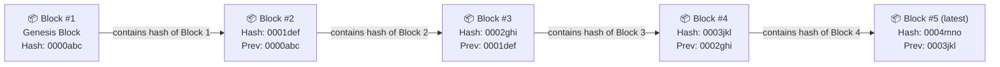
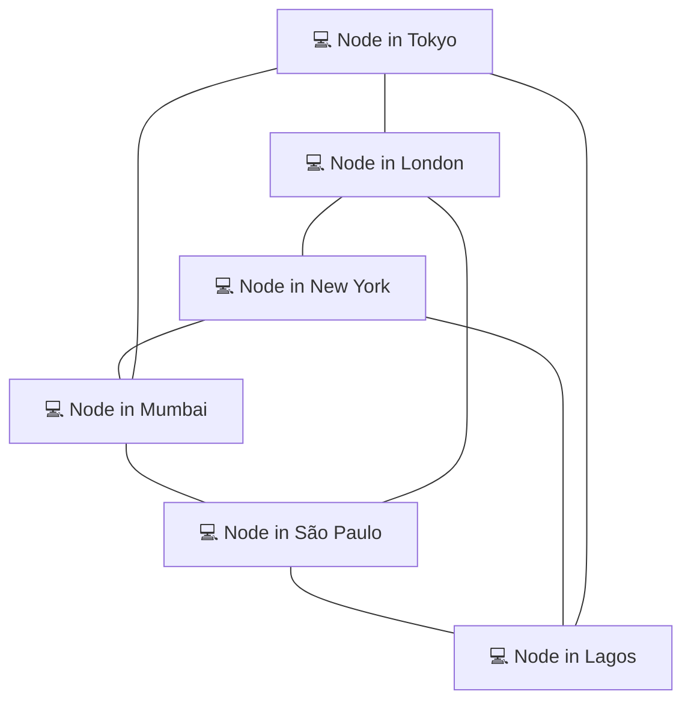
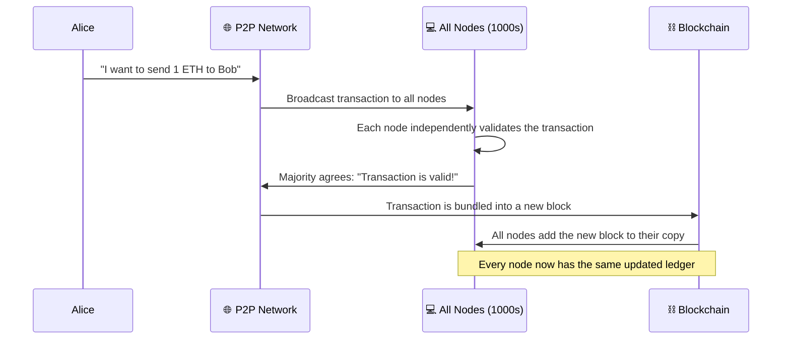
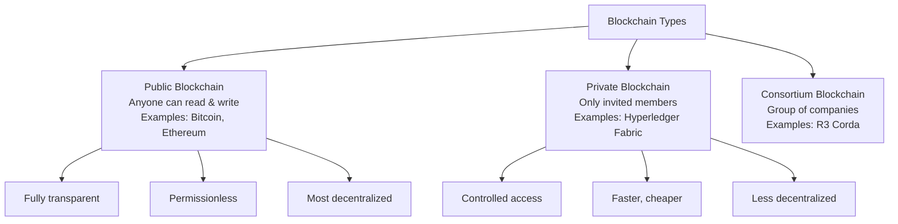

# 01 — What is a Blockchain?

> **Level:** Absolute Beginner | **Estimated Reading Time:** 15–20 minutes
>
> **Prerequisites:** None. Just curiosity.

---

## 🗺️ Chapter Overview

Before we write a single line of Solidity, we need to understand the world our code will live in. This chapter answers the most fundamental question in all of Web3:

> *"What exactly is a blockchain, and why does it even exist?"*

We will build the answer from the ground up, using everyday analogies, visual diagrams, and zero assumptions about prior knowledge.

---

## 📖 The Problem Blockchain Solves (Start Here)

Imagine you and a friend make a bet: he owes you $50 if it rains tomorrow. It rains. He says, "I never said $50." You say, "Yes you did!" There is no third party, no record, no proof.

Now scale that problem up. Two banks need to transfer $10 million between countries. How do they *trust* the record of who sent what, and who received what, without a war of spreadsheets?

The answer has always been the same: **hire a trusted middleman to keep the record.**

- A bank keeps your balance.
- Pay/

These middlemen are called **centralized authorities** — one single entity holds the "true" ledger (a fancy word for *record book*).

This system works, but it has painful weaknesses:

| Problem                   | Real-World Example                                |
| ------------------------- | ------------------------------------------------- |
| Single point of failure   | Bank servers go down, you cannot pay rent         |
| Corruption / manipulation | A bank quietly alters its books                   |
| Censorship                | A government freezes your account without warning |
| High fees                 | Wire transfers cost $25–$50 per transaction      |
| Requires trust            | You must believe the bank is honest               |

**Blockchain was invented to solve all of these problems at once.** It is a way to keep a record that no single person controls, that anyone can verify, and that nobody can secretly change.

---

## 🔗 What is a Blockchain?

Think of a blockchain as a **shared Google Sheet that nobody can delete rows from, and that everyone can see.**

More precisely:

> A **blockchain** is a type of database (a ledger) that stores records in chunks called **blocks**, links each block to the one before it (forming a **chain**), and copies that entire chain across thousands of computers around the world simultaneously.

Let us unpack each part of that definition.

### Part 1: A Ledger

A ledger is just a record book. A bank's ledger says:

```
Alice has $500
Bob has $200
Alice sends Bob $100 → Alice now has $400, Bob now has $300
```

A blockchain ledger records the same kind of information — who sent what to whom — but in a very different way.

### Part 2: Grouped into Blocks

Instead of recording one transaction at a time into a long scroll, a blockchain groups many transactions together into a **block**. Think of each block like one page in a notebook:

```
+---------------------------+
|        BLOCK #5           |
|---------------------------|
| Tx 1: Alice → Bob  1 ETH  |
| Tx 2: Carol → Dave 2 ETH  |
| Tx 3: Eve → Frank  0.5ETH |
| ...                       |
| Timestamp: 2024-01-15     |
+---------------------------+
```

### Part 3: Chained Together (This is the KEY part)

Each new block contains a special fingerprint of the *previous* block. This fingerprint is called a **hash**. Think of it as a wax seal on an envelope that changes completely if you tamper with even one word inside.

Because each block contains the previous block's fingerprint, they form an unbreakable chain:



**Why does the chain matter?** If someone tries to secretly change a transaction in Block #2, the block's hash changes. That means Block #3's "previous hash" pointer is now wrong. Block #3 breaks. Block #4 breaks. The entire chain from that point breaks. Tampering is *immediately detectable*.

> **Analogy:** Imagine a library where every book references the exact page count of the previous book. If you secretly add pages to Book 3, every reference in Books 4 through 1000 becomes wrong. The librarian can instantly detect the tampering just by checking the page counts.

---

## 🌐 Centralized vs. Decentralized

This is perhaps the most important conceptual shift when moving from Web2 to Web3 thinking.

### Centralized Systems (Traditional Web)

In a centralized system, one server (or one company's cluster of servers) is the single source of truth.

```
         You
          |
          ▼
    ┌───────────┐
    │  BANK     │ ← Single source of truth
    │  SERVER   │   (one company controls this)
    └───────────┘
```

**Pros:** Simple, fast, easy to update, easy to fix mistakes.

**Cons:** One target to hack, one entity to bribe or corrupt, one point that can go offline, one entity that can censor you.

### Decentralized Systems (Blockchain)

In a decentralized system, thousands of computers (called **nodes**) each hold a complete copy of the same ledger. There is no single server in charge.



Every node in this network holds the full copy of the blockchain. When a new transaction happens:

1. The transaction is broadcast to ALL nodes simultaneously.
2. The nodes check whether the transaction is valid (e.g., does Alice actually have enough funds?).
3. If the majority of nodes agree it is valid, the transaction is added to the next block.
4. Every node updates their copy of the ledger.

No single node can cheat. To corrupt the ledger, you would need to control more than 50% of all the nodes in the world — simultaneously. This is called a **51% attack**, and on major blockchains like Ethereum or Bitcoin, it is economically impossible.

---

## 🔒 Immutability — The "No Erasing" Rule

**Immutability** means once data is written to the blockchain, it cannot be altered or deleted. Ever.

This is one of the most mind-bending properties for developers coming from traditional databases where you can freely run `UPDATE` or `DELETE` SQL statements.

> **Library Book Analogy:** Imagine a library where books are written in permanent ink, and once a book is filed on the shelf, it is sealed in glass. You can always read it, but you can never modify a single word. If the book has an error, you cannot fix it — you can only add a *new* book that says "correction: the previous book had an error on page 5."

In blockchain terms:

- You cannot delete a transaction.
- You cannot change a transaction.
- You can only *add* new transactions.

This seems like a weakness, but it is actually a superpower for trust. When you see a transaction on the blockchain, you know with absolute certainty that it happened and that nobody has tampered with the record.

```
TRADITIONAL DATABASE          BLOCKCHAIN
──────────────────            ──────────
   INSERT ✅                  WRITE ✅
   UPDATE ✅                  UPDATE ❌ (impossible)
   DELETE ✅                  DELETE ❌ (impossible)
   REWRITE ✅                 REWRITE ❌ (impossible)
```

---

## 📒 The Distributed Ledger Explained

The full technical term you will hear is **Distributed Ledger Technology (DLT)**. Let us break that down:

- **Ledger** = a record book of transactions (we covered this above).
- **Distributed** = spread across many computers, not kept in one place.

Think of it like this:

> **Old Way (Centralized):** One teacher keeps the class attendance register. If the teacher loses it, it is gone. If the teacher lies, nobody can prove it.

> **New Way (Distributed):** Every single student keeps an identical copy of the attendance register. If one student changes their copy, it immediately disagrees with all 29 other copies. The truth is determined by the majority.

Here is what happens when a new transaction is added to the blockchain:



---

## 🧱 What Actually Lives Inside a Block?

Let us crack open a block and look at its anatomy:

```
╔══════════════════════════════════════════════════╗
║                    BLOCK HEADER                  ║
║  Block Number:    #18,500,001                    ║
║  Timestamp:       2024-01-15 08:32:14 UTC        ║
║  Previous Hash:   0x9a3f...b7c2 (Block #18.5M)  ║
║  Merkle Root:     0x4d2e...a1f9 (fingerprint of  ║
║                   all transactions below)         ║
║  Nonce:           2938471234 (proof of work)     ║
╠══════════════════════════════════════════════════╣
║                  TRANSACTIONS                    ║
║  Tx #1: 0xAlice → 0xBob       1.00 ETH           ║
║  Tx #2: 0xCarol → 0xDave      0.05 ETH           ║
║  Tx #3: 0xEve   → Contract    0.50 ETH           ║
║  Tx #4: 0xFrank → 0xGrace     2.30 ETH           ║
║  ... (up to thousands of transactions)           ║
╚══════════════════════════════════════════════════╝
```

Key fields explained in plain English:

| Field                   | What It Is                                    | Plain English                                     |
| ----------------------- | --------------------------------------------- | ------------------------------------------------- |
| **Block Number**  | Sequential index                              | "This is the 18,500,001st page in the notebook"   |
| **Timestamp**     | When the block was created                    | "This page was written on Jan 15, 2024"           |
| **Previous Hash** | Fingerprint of prior block                    | "The seal from the last page, proving continuity" |
| **Merkle Root**   | Fingerprint of ALL transactions in this block | "A single checksum of everything on this page"    |
| **Nonce**         | A number miners guessed to create the block   | "The answer to a very hard puzzle"                |
| **Transactions**  | The actual data                               | "The list of events recorded on this page"        |

---

## ⚙️ How Does Everyone Agree? (Consensus, Simply Explained)

If no one is in charge, how do thousands of nodes agree on which version of the ledger is "correct"? This is solved by a **consensus mechanism**.

Think of it like a classroom vote. Before a new block is officially added:

- All the nodes must run the same rules.
- They each independently verify all transactions.
- They vote or compete to agree on the next block.

The two most famous consensus mechanisms are:

### Proof of Work (PoW) — Used by Bitcoin

Nodes (called **miners**) compete to solve a computationally hard math puzzle. The winner gets to add the next block and earns a reward (Bitcoin). It is like a race where the first to solve the puzzle wins.

```
[Many miners competing] → [First to solve puzzle] → [Wins the right to add block]
        ⛏️⛏️⛏️                      🏆                        ⛓️
```

**Cost:** Enormous electricity consumption.
**Benefit:** Proven security over 15+ years.

### Proof of Stake (PoS) — Used by Ethereum (since 2022)

Instead of solving puzzles, nodes (called **validators**) lock up (stake) their own cryptocurrency as collateral. They are randomly selected to add the next block, proportional to how much they have staked. If they cheat, they lose their stake.

```
[Validators stake ETH] → [Random validator selected] → [Adds block, earns reward]
       🔒💰                        🎲                          ⛓️
```

**Cost:** Low energy (no puzzle-solving).
**Benefit:** Eco-friendly, faster, equally secure.

> As a Solidity developer, you will be writing code for the Ethereum network which uses Proof of Stake. You do not need to implement consensus yourself — the network handles it for you. But understanding it helps you write smarter, more gas-efficient code.

---

## 🌍 Public vs. Private Blockchains

Not all blockchains are open to the public. Here is a quick orientation:



For this course, we will be focused entirely on **public blockchains**, specifically **Ethereum** — the most popular platform for writing smart contracts (programs that run on the blockchain).

---

## 🔑 Key Takeaways

Let us pull it all together. After reading this chapter, you should be able to explain these five concepts to a 10-year-old:

1. **A blockchain is a shared record book** (ledger) that stores data in linked blocks. Each block contains a fingerprint of the previous one, forming an unbreakable chain.
2. **It is decentralized** — thousands of computers around the world each hold an identical copy. No single entity is in control, which eliminates the need to "trust" any one party.
3. **It is immutable** — once data is written, it cannot be changed or deleted. Tampering with any block would break the chain and be detected instantly by all other nodes.
4. **Consensus keeps everyone honest** — nodes agree on the valid state of the ledger through rules (like Proof of Work or Proof of Stake), without needing a central authority.
5. **It exists to solve the trust problem** — blockchain removes the need for middlemen (banks, governments, notaries) when recording value or agreements between people who do not know each other.

---

## 🧠 Quiz Yourself

Test your understanding before moving to the next chapter. Try to answer from memory first, then re-read the relevant section if you get stuck.

---

**Question 1:**

> Alice secretly changes a transaction in Block #47 of a blockchain. What happens to Blocks #48, #49, and all blocks after it?

<details>
<summary>Click to reveal answer</summary>

Because Block #48 contains the hash (fingerprint) of Block #47, and that hash has now changed due to the tampering, Block #48's "previous hash" field is now incorrect. This breaks Block #48's validity. And since Block #49 contains Block #48's hash, it is also broken — and so on down the chain. Every single block after #47 is now invalidated. All other nodes on the network would reject Alice's tampered chain because it no longer matches their own valid copies.

</details>

---

**Question 2:**

> What is the difference between a centralized database (like a bank) and a distributed ledger (like a blockchain)?

<details>
<summary>Click to reveal answer</summary>

A centralized database is controlled by one entity and stored on their servers. You have to trust that entity to be honest, to stay online, and not to censor you. If their server is hacked or goes offline, the data is compromised or lost.

A distributed ledger stores identical copies across thousands of independent computers (nodes). No single entity controls it. For the ledger to be corrupted, an attacker would need to take over the majority of all nodes simultaneously — which is practically impossible on large networks.

</details>

---

**Question 3:**

> If blockchain data is immutable (cannot be changed), what happens if a smart contract is deployed with a bug in it?

<details>
<summary>Click to reveal answer</summary>

This is one of the most important practical consequences of immutability. Once a smart contract is deployed to the blockchain, its code is permanent and cannot be patched. If there is a bug, you cannot update that contract. Instead, developers must deploy a *new* version of the contract and migrate users to it.

This is why smart contract auditing and careful testing before deployment is absolutely critical — mistakes can be permanent and costly. (We will cover upgrade patterns and safety practices in later chapters.)

</details>

---

## 📚 What's Next?

Now that you understand what a blockchain is, the next chapter dives into **Ethereum specifically** — why it was created, what makes it different from Bitcoin, and how its concept of a "world computer" enables programmable money and decentralized applications (dApps).

> **Next Chapter:** `02-what-is-ethereum.md` — Ethereum: The World's Computer

---

*Chapter 01 of the Solidity & Web3 Developer Fundamentals series.*
