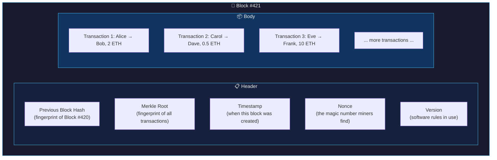
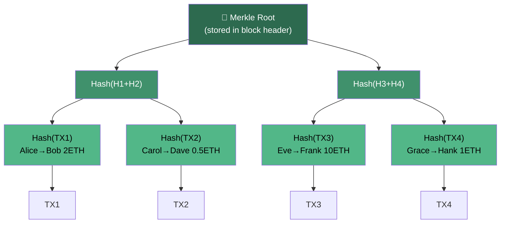
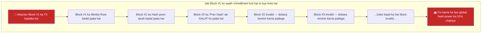
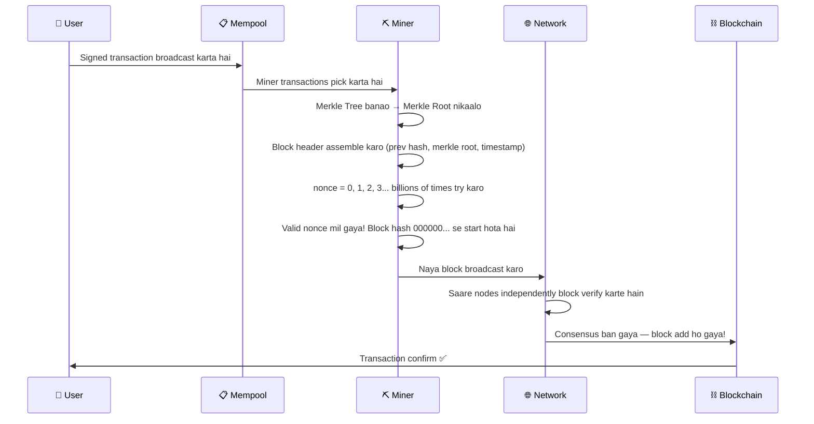

# 02 — Blocks aur Chains Kaam Kaise Karte Hain

> **Ye kiske liye hai:** Un developers ke liye jo jaante hain ki blockchain *hai kya*, lekin ye samajhna chahte hain ki woh andar se exactly *kaise* kaam karta hai — bina cryptography mein PhD kiye.

---

## 📦 Block Ko Ek Sealed Envelope Ki Tarah Socho

Code aur diagrams mein jaane se pehle, ek intuition banate hain.

Socho tum apne mohalle mein ek chhota sa lending library chalate ho. Jab bhi koi book borrow ya return karta hai, tum ek ledger mein likh dete ho. Lekin ek problem hai: log chupke se andar aakar purani entries badal dete hain ("Maine woh book kabhi li hi nahi!").

Tumhara solution: ek page bharne ke baad, tum usko **envelope mein seal** kar dete ho, envelope ke bahar us page ka ek **unique fingerprint** likh dete ho, aur phir woh envelope agle page ke saath **staple** kar dete ho. Ab agar koi page 5 ke saath chhedkhani karta hai, uska fingerprint badal jaayega — aur page 6 (jo page 5 ke fingerprint ko reference karta hai) turant expose ho jaayega ki kuch match nahi kar raha. Uske baad ke saare pages bhi toot jaayenge.

Yahi blockchain hai. Har **block** ek sealed envelope hai. **Chain** un envelopes ka staple kiya hua stack hai.

---

## 🔢 Hash Kya Hota Hai? (Fingerprint Wali Baat)

**Hash** ek one-way mathematical fingerprint hota hai. Tum kitna bhi data feed karo, output hamesha ek fixed-size ka milega. Isko ek meat grinder jaisa samjho — tum poori gaay andar daal sakte ho, lekin ground beef se wapas gaay nahi bana sakte.

**SHA-256** (jo Bitcoin use karta hai) hamesha 256 bits ka output deta hai — jo 64 hexadecimal characters mein dikhta hai.

### Real example:

```
Input:  "Hello, World!"
SHA-256: dffd6021bb2bd5b0af676290809ec3a53191dd81c7f70a4b28688a362182986d

Input:  "Hello, World?" (ek character badla!)
SHA-256: 1cebf843df80a9a0a46c3adcad1c3e1a16eb7a8cbc44b7d43a15f2f84a7f81a4
```

Dekho, ek single character badalne se output **poori tarah alag** ho gaya. Isko **avalanche effect** kehte hain — chhoti si change bhi output mein bahut bada bawaal macha deti hai.

### Ek achhe hash function ke teen jaadui properties:

| Property | Iska matlab | Kyun zaruri hai |
|---|---|---|
| **Deterministic** | Same input se hamesha same output | Data ko store kiye bina verify kar sakte ho |
| **Avalanche effect** | Chhoti input change = poori tarah alag output | Tampering turant pakdi jaati hai |
| **One-way** | Input reverse-engineer nahi kar sakte | Secrets secret rehte hain |

### Conceptual code (JavaScript-style pseudocode):

```javascript
// Conceptual demonstration — real SHA-256 nahi hai, par idea sahi hai
function sha256(data) {
  // 1. Apna data bits mein convert karo
  // 2. Usko ek standard length tak pad karo
  // 3. 64 rounds ke mathematical mixing se guzaaro
  // 4. 256 bits (64 hex characters) output karo
  return "a fixed-length fingerprint, always 64 characters long";
}

// Example usage
sha256("Transfer: Alice → Bob, 5 ETH") 
// → "3a7bd3e2360a3d29eea436fcfb7e44c735d117c42d1c1835420b6b9942dd4f1b"

sha256("Transfer: Alice → Bob, 5 ETH") // same input
// → "3a7bd3e2360a3d29eea436fcfb7e44c735d117c42d1c1835420b6b9942dd4f1b" // same output!

sha256("Transfer: Alice → Bob, 6 ETH") // amount 1 se badla
// → "9f86d081884c7d659a2feaa0c55ad015a3bf4f1b2b0b822cd15d6c15b0f00a08" // poori tarah alag!
```

### Ye kyun zaruri hai? 💡

Agar tum kisi block ke data ka hash store kar lo, to baad mein koi bhi us data ko dobara hash karke compare kar sakta hai. Agar hashes match karein, matlab data ke saath koi chhedkhani nahi hui. Agar match nahi karein, to *kuch to badla hai*. Blockchain isi tarah tampering detect karta hai — bilkul automatically, zero trust ke saath.

---

## 🧱 Block Ki Anatomy

Block sirf transactions ka ek bucket nahi hota. Iska ek bahut specific structure hota hai — do parts: **header** aur **body**.



Chalo har field ko todke samajhte hain:

### 📋 Block Header Ke Fields

**Previous Block Hash**
Security ke liye ye sabse important field hai. Ye pichle *poore block* ka SHA-256 fingerprint hai. Yahi woh "staple" hai jo blocks ko aapas mein jodta hai. Agar block #420 ka ek byte bhi badal jaaye, uska hash badal jaayega, jisse block #421 ka reference toot jaayega, jisse #422 bhi toot jaayega... aur ye chain aage tak chalti rahegi.

**Merkle Root**
Ek single hash jo block ke *saare* transactions ko represent karta hai. Isko hum niche Merkle Trees section mein detail se dekhenge. Isko body ke sab kuch ka "summary hash" samjho.

**Timestamp**
Unix timestamp (January 1, 1970 se seconds mein), jo record karta hai ki miner ne ye block kab banaya. Example: `1706745600` = February 1, 2024.

**Nonce** (Number Used Once)
Ye Proof of Work mining ka puzzle piece hai. Miners billions of different nonce values try karte hain jab tak block ka hash kaafi saare leading zeros se start na ho. Iske baare mein mining chapter mein detail se baat karenge — abhi bas itna samjho ki ye ek number hai jisse miners badal-badal ke valid hash dhoondte hain.

**Version**
Nodes ko batata hai ki is block ko validate karte waqt protocol rules ka kaunsa set use karna hai. Isse network time ke saath upgrade ho paata hai.

### 📦 Block Body

Body mein bas transactions ki ek list hoti hai — saare "Alice ne Bob ko 2 ETH bheje" jaise records jo users ne network par submit kiye. Ek block mein kitne transactions aa sakte hain ye block size limits par depend karta hai (Bitcoin: ~1MB data, Ethereum: "gas" mein measure hota hai).

---

## 🌳 Merkle Trees — Transaction Ka Fingerprint

Ek sawaal poochte hain: ek block mein 2,000 transactions ho sakte hain. Tum ek *single hash* kaise banaoge jo un sabko represent kare? Aur koi kaise prove kar sakta hai ki ek specific transaction block mein hai, bina saare 2,000 transactions download kiye?

Iska jawab hai **Merkle Tree** (Ralph Merkle ke naam par, jinhone 1979 mein isko invent kiya tha).

### Ye kaise banta hai:

1. Har individual transaction ko hash karo: `Hash(TX1)`, `Hash(TX2)`, waghera.
2. Unko pair karo aur pairs ko saath mein hash karo: `Hash(Hash(TX1) + Hash(TX2))`
3. Isi tarah pairing aur hashing karte raho jab tak tree ke top par ek single hash na bach jaaye
4. Woh top wala hash hi **Merkle Root** hai



### Conceptual code:

```javascript
function buildMerkleTree(transactions) {
  // Step 1: Har transaction ko hash karo
  let layer = transactions.map(tx => sha256(tx));

  // Step 2: Jab tak ek hi hash na bache, pairs combine karte raho
  while (layer.length > 1) {
    let nextLayer = [];
    
    for (let i = 0; i < layer.length; i += 2) {
      let left = layer[i];
      let right = layer[i + 1] || left; // odd count ho to last ko duplicate karo
      nextLayer.push(sha256(left + right));
    }
    
    layer = nextLayer;
  }

  return layer[0]; // Yahi Merkle Root hai
}

// Example
const transactions = [
  "Alice→Bob 2ETH",
  "Carol→Dave 0.5ETH", 
  "Eve→Frank 10ETH",
  "Grace→Hank 1ETH"
];

const merkleRoot = buildMerkleTree(transactions);
// → "a4e12f..." (ek hash jo SAARE transactions ko represent karta hai)
```

### Asli superpower: Merkle Proofs

Merkle Trees ka asli genius hai **Merkle Proofs**. TX2 block mein hai ye prove karne ke liye, tumhe saare 2,000 transactions ki zaroorat nahi — sirf `log2(2000) ≈ 11` hashes chahiye. Isi tarah lightweight "SPV wallets" (jaise mobile wallets) kaam karte hain: woh poora blockchain download kiye bina transactions verify kar lete hain.

### Ye kyun zaruri hai? 💡

Merkle trees ek saath do superpowers dete hain: **integrity** (koi bhi transaction badle to root toot jaata hai) aur **efficiency** (ek transaction ka exist karna prove karna seconds mein hota hai, ghanton mein nahi). Merkle trees ke bina, blockchain thousands of transactions per block tak scale hi nahi kar paate.

---

## 🔗 Blocks Chain Mein Kaise Judte Hain

Ab chain ka jaadu dekhte hain. Har block apne header mein *pichle block ka hash* store karta hai. Isse ek unbreakable linked list banti hai jahan har element apne se pehle wale ko validate karta hai.


### Isko tamper-proof kya banata hai?

Maan lo ek malicious actor Block #1 mein transaction badalna chahta hai ("Alice ne Bob ko 2 ETH bheje" → "Alice ne *Carol* ko 2 ETH bheje").

Dekho phir kya hota hai:

1. Block #1 ka transaction data badal gaya
2. Block #1 ke header ka Merkle Root badal gaya (kyunki woh transaction hashes ko reference karta hai)
3. Block #1 ka overall hash poori tarah badal gaya (avalanche effect!)
4. Block #2 ka "Previous Hash" field ab bhi Block #1 ke OLD hash ko point kar raha hai — jo ab exist hi nahi karta
5. Block #2 ab invalid ho gaya. Iska hash bhi dobara compute karna padega.
6. Block #3 bhi ab invalid ho gaya. Aur #4 bhi. Aur uske baad ka har block.

Live network par Block #1 ke saath successfully chhedkhani karne ke liye, tumhe **#1 se lekar current tip tak har block ka proof of work dobara compute** karna padega — jabki baaki network full speed se naye blocks add karta rahega. Bitcoin par, iske liye tumhe duniya ki 50% se zyada mining power control karni padegi. Yahi famous **51% attack** hai, aur isi wajah se chain ki immutability sirf marketing claim nahi, balki real hai.



### Ye kyun zaruri hai? 💡

Chain structure ka matlab hai ki history practically **append-only** hai. Kisi ek party par trust karne ki zaroorat nahi — math hi honesty enforce karta hai. Har node independently poori chain verify karta hai, bas blocks ko dobara hash karke aur linkages check karke. Trust ki jagah cryptographic proof le leta hai.

---

## 🏗️ Sab Kuch Ek Saath: Ek Block Ka Safar

Dekho ek block "transactions ka dhera" se "history ka permanent part" kaise banta hai:



---

## 💻 Hands-On: Real Code Mein Hashing

Ye raha actual working code jo tum Node.js mein run karke hashing ko action mein dekh sakte ho:

```javascript
const crypto = require('crypto');

// SHA-256 hashing — asli wala!
function sha256(data) {
  return crypto.createHash('sha256').update(data).digest('hex');
}

// Ek simple block simulate karte hain
const block = {
  index: 1,
  previousHash: "000000a1b2c3d4e5f6...",
  timestamp: Date.now(),
  transactions: [
    "Alice → Bob: 2 ETH",
    "Carol → Dave: 0.5 ETH"
  ],
  nonce: 0
};

// Merkle Root banao (simplified — real trees isse zyada deep hote hain)
function simpleMerkleRoot(transactions) {
  let hashes = transactions.map(tx => sha256(tx));
  while (hashes.length > 1) {
    const nextLevel = [];
    for (let i = 0; i < hashes.length; i += 2) {
      const left = hashes[i];
      const right = hashes[i + 1] || hashes[i]; // odd ho to duplicate karo
      nextLevel.push(sha256(left + right));
    }
    hashes = nextLevel;
  }
  return hashes[0];
}

// Block hash calculate karo (jo miners billions of times compute karte hain)
function calculateBlockHash(block) {
  const data = [
    block.index,
    block.previousHash,
    block.timestamp,
    block.merkleRoot,
    block.nonce
  ].join('');
  return sha256(data);
}

// Block ko assemble karo
block.merkleRoot = simpleMerkleRoot(block.transactions);
block.hash = calculateBlockHash(block);

console.log("Merkle Root:", block.merkleRoot);
console.log("Block Hash:", block.hash);

// Ab ek transaction badlo aur dekho sab kuch kaise toot jaata hai
block.transactions[0] = "Alice → Bob: 999 ETH"; // tamper!
block.merkleRoot = simpleMerkleRoot(block.transactions); // merkle root badal gaya
block.hash = calculateBlockHash(block);                  // hash badal gaya

console.log("\nTampering ke baad:");
console.log("New Merkle Root:", block.merkleRoot); // poori tarah alag!
console.log("New Block Hash:", block.hash);         // poori tarah alag!
// Pichle block ka "Next Block Hash" reference ab BROKEN hai
```

---

## 🗝️ Key Takeaways

| Concept | Aasan Bhasha Mein |
|---|---|
| **Hash** | Kisi bhi data ka fixed-size fingerprint. Ek bit badlo, sab kuch badal jaata hai. |
| **Block Header** | Metadata: kaun pehle aaya, saare transactions ka summary, ek timestamp, aur ek nonce. |
| **Block Body** | Transactions ki actual list. |
| **Merkle Root** | Ek hash jo block ke saare transactions ko summarize karta hai, hashes ke ek tree se banta hai. |
| **Chain Linking** | Har block pichle block ka hash store karta hai. Koi bhi block badlo, uske baad ke saare blocks toot jaate hain. |
| **Immutability** | Magic nahi hai — sirf math hai. Chain ko kisi bhi point se dobara chalane par tampering turant pakdi jaati hai. |
| **Nonce** | Woh number jo miners brute-force karte hain taaki network ka difficulty target meet karne wala hash mil jaaye. |

---

## 🧩 Quiz — Apni Samajh Test Karo

**Sawaal 1:**
> Agar tum 700-block chain ke Block #500 ke andar ek transaction badal do, to ab kaunse blocks invalid ho jaayenge?

<details>
<summary>Jawab dekho</summary>

**Block #500 se leke #700 tak** sab invalid ho jaayenge. Block #500 ka data badalne se uska hash badal jaata hai. Block #501 apne "Previous Hash" field mein #500 ka purana hash store karta hai, to ab woh ek aise hash ko reference kar raha hai jo exist hi nahi karta — isliye woh bhi invalid ho jaata hai. Ye chain tip tak cascade karta hai. Isi wajah se block jitna deep buried hota hai, uski immutability utni hi *strong* hoti jaati hai.

</details>

---

**Sawaal 2:**
> Ek block mein 1,024 transactions hain. Merkle tree use karke, ek specific transaction block mein hai ye prove karne ke liye tumhe kitne hashes chahiye, bina saare 1,024 transactions download kiye?

<details>
<summary>Jawab dekho</summary>

**10 hashes** — kyunki `log2(1024) = 10`. Merkle proof ko sirf har level par "sibling" hash chahiye hota hai taaki root tak ka path reconstruct ho sake. Yahi Merkle trees ki efficiency superpower hai: inclusion prove karna logarithmically scale karta hai, linearly nahi.

</details>

---

**Sawaal 3:**
> Block header mein nonce kya hota hai, aur miners isko billions of times kyun badalte hain?

<details>
<summary>Jawab dekho</summary>

**Nonce** (Number Used ONCE) block header ka ek integer hota hai jise miners badal-badal ke block ke hash output ko change karte hain. Network ko chahiye ki valid blocks ka hash kuch leading zeros (yaani "difficulty target") se start ho. Hash functions unpredictable hote hain, isliye miners sahi nonce calculate nahi kar sakte — unhe ek-ek karke try karna padta hai (brute force) jab tak koi aisa nonce na mile jo target ko meet karne wala hash de. Average miner shaayad trillions of nonces per second try karta hai. Yahi computational work "Proof of Work" hai jo network ko secure karta hai.

</details>

---

## 📖 Aage Kya?

Agle chapter mein hum **Consensus Mechanisms** explore karenge — kaise hazaaron ajnabi log internet par bina ek dusre par trust kiye ye decide karte hain ki kaunsi chain "asli" hai. Yahin par Proof of Work, Proof of Stake, aur unke tradeoffs jeevant ho uthte hain.

---

*Chapter 02 of the Blockchain Fundamentals series. Aage badho → `03-consensus-mechanisms.md`*
