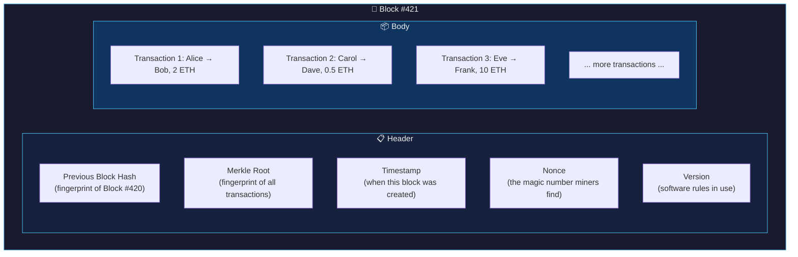
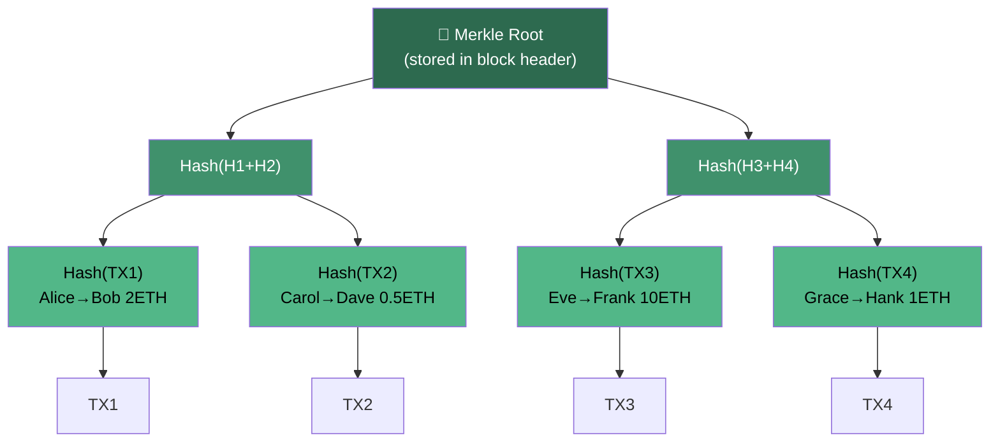
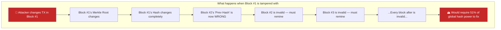
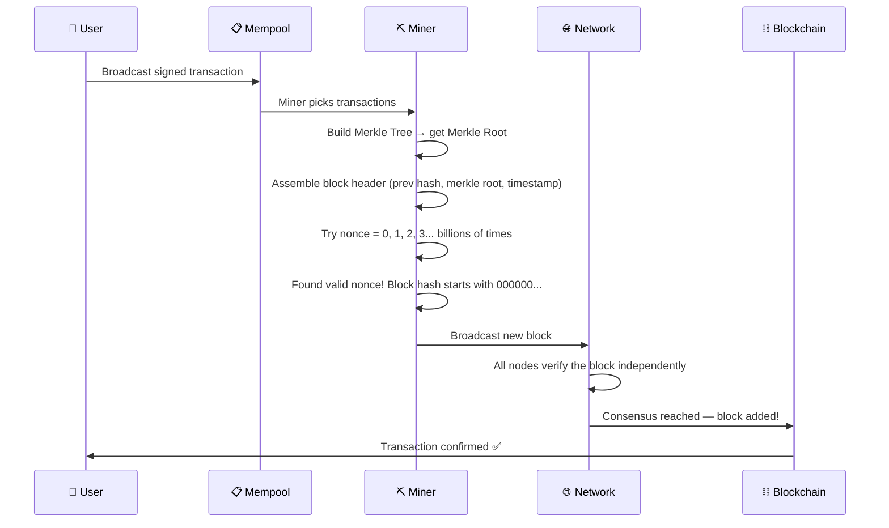

# 02 — How Blocks and Chains Work

> **Who this is for:** Developers who know what a blockchain *is* but want to understand exactly *how* it works under the hood — without a PhD in cryptography.

---

## 📦 Think of a Block Like a Sealed Envelope

Before we dive into code and diagrams, let's build an intuition.

Imagine you run a small neighborhood lending library. Every time someone borrows or returns a book, you write it in a ledger. But you have a problem: people keep sneaking in and changing old entries ("I never borrowed that book!").

Your solution: after filling a page, you **seal it in an envelope**, write a **unique fingerprint** of that page on the outside, and then staple that envelope to the *next* page. Now if anyone tampers with page 5, its fingerprint changes — and page 6 (which references page 5's fingerprint) is immediately exposed as inconsistent. Every page after that is broken too.

That's a blockchain. Each **block** is a sealed envelope. The **chain** is the stack of envelopes stapled together.

---

## 🔢 What Is a Hash? (The Fingerprint Explained)

A **hash** is a one-way mathematical fingerprint. You feed in any amount of data and always get back a fixed-size output. Think of it like a meat grinder — you can put a whole cow in, but you can never reconstruct the cow from the ground beef.

**SHA-256** (used by Bitcoin) always outputs 256 bits — shown as 64 hexadecimal characters.

### Real example:

```
Input:  "Hello, World!"
SHA-256: dffd6021bb2bd5b0af676290809ec3a53191dd81c7f70a4b28688a362182986d

Input:  "Hello, World?" (one character changed!)
SHA-256: 1cebf843df80a9a0a46c3adcad1c3e1a16eb7a8cbc44b7d43a15f2f84a7f81a4
```

Notice that changing a single character produces a **completely different** output. This property is called the **avalanche effect** — even the tiniest change causes a cascade of differences in the output.

### The three magic properties of a good hash function:

| Property | What it means | Why it matters |
|---|---|---|
| **Deterministic** | Same input always gives same output | You can verify data without storing it |
| **Avalanche effect** | Tiny input change = totally different output | Tampering is immediately obvious |
| **One-way** | You cannot reverse-engineer the input | Secrets stay secret |

### Conceptual code (JavaScript-style pseudocode):

```javascript
// Conceptual demonstration — not real SHA-256, but the idea is accurate
function sha256(data) {
  // 1. Convert your data into bits
  // 2. Pad it to a standard length
  // 3. Run it through 64 rounds of mathematical mixing
  // 4. Output 256 bits (64 hex characters)
  return "a fixed-length fingerprint, always 64 characters long";
}

// Example usage
sha256("Transfer: Alice → Bob, 5 ETH") 
// → "3a7bd3e2360a3d29eea436fcfb7e44c735d117c42d1c1835420b6b9942dd4f1b"

sha256("Transfer: Alice → Bob, 5 ETH") // same input
// → "3a7bd3e2360a3d29eea436fcfb7e44c735d117c42d1c1835420b6b9942dd4f1b" // same output!

sha256("Transfer: Alice → Bob, 6 ETH") // amount changed by 1
// → "9f86d081884c7d659a2feaa0c55ad015a3bf4f1b2b0b822cd15d6c15b0f00a08" // totally different!
```

### Why does this matter? 💡

If you store the hash of a block's data, anyone can re-hash that data later and compare. If the hashes match, the data is untouched. If they don't match, *something changed*. This is how blockchains detect tampering — completely automatically, with zero trust required.

---

## 🧱 Anatomy of a Block

A block is not just a bucket of transactions. It has a very specific structure with two parts: the **header** and the **body**.



Let's break down each field:

### 📋 Block Header Fields

**Previous Block Hash**
This is the most important field for security. It's the SHA-256 fingerprint of the *entire previous block*. This is the "staple" that links blocks together. If block #420 changes even one byte, its hash changes, which breaks block #421's reference, which then breaks #422... and so on forever.

**Merkle Root**
A single hash that represents *all* the transactions in the block. We'll explore this deeply in the Merkle Trees section below. Think of it as a "summary hash" of everything in the body.

**Timestamp**
Unix timestamp (seconds since January 1, 1970) recording when the miner created this block. Example: `1706745600` = February 1, 2024.

**Nonce** (Number Used Once)
This is the puzzle piece in Proof of Work mining. Miners try billions of different nonce values until the block's hash starts with enough leading zeros. More on this in the mining chapter — for now, just know it's a number miners change to find a valid hash.

**Version**
Tells nodes which set of protocol rules to use when validating this block. Allows the network to upgrade over time.

### 📦 Block Body

The body simply contains a list of transactions — all the "Alice sent Bob 2 ETH"-style records that users submitted to the network. The number of transactions per block depends on block size limits (Bitcoin: ~1MB of data, Ethereum: measured in "gas").

---

## 🌳 Merkle Trees — The Transaction Fingerprint

Here's a question: a block might have 2,000 transactions. How do you create *one single hash* that represents all of them? And how can someone prove a specific transaction is in the block without downloading all 2,000 transactions?

The answer is a **Merkle Tree** (named after Ralph Merkle, who invented it in 1979).

### How it's built:

1. Hash each individual transaction: `Hash(TX1)`, `Hash(TX2)`, etc.
2. Pair them up and hash the pairs together: `Hash(Hash(TX1) + Hash(TX2))`
3. Keep pairing and hashing up the tree until you have one single hash at the top
4. That top hash is the **Merkle Root**



### Conceptual code:

```javascript
function buildMerkleTree(transactions) {
  // Step 1: Hash every transaction
  let layer = transactions.map(tx => sha256(tx));

  // Step 2: Keep combining pairs until one hash remains
  while (layer.length > 1) {
    let nextLayer = [];
    
    for (let i = 0; i < layer.length; i += 2) {
      let left = layer[i];
      let right = layer[i + 1] || left; // duplicate last if odd count
      nextLayer.push(sha256(left + right));
    }
    
    layer = nextLayer;
  }

  return layer[0]; // This is the Merkle Root
}

// Example
const transactions = [
  "Alice→Bob 2ETH",
  "Carol→Dave 0.5ETH", 
  "Eve→Frank 10ETH",
  "Grace→Hank 1ETH"
];

const merkleRoot = buildMerkleTree(transactions);
// → "a4e12f..." (one hash representing ALL transactions)
```

### The superpower: Merkle Proofs

The real genius of Merkle Trees is **Merkle Proofs**. To prove TX2 is in a block, you don't need all 2,000 transactions — you only need `log2(2000) ≈ 11` hashes. This is how lightweight "SPV wallets" (like mobile wallets) work: they verify transactions without downloading the full blockchain.

### Why does this matter? 💡

Merkle trees give us two superpowers at once: **integrity** (any changed transaction breaks the root) and **efficiency** (proving one transaction exists takes seconds, not hours). Without Merkle trees, blockchains couldn't scale to thousands of transactions per block.

---

## 🔗 How Blocks Link Into a Chain

Now we see the magic of the chain. Each block stores the *hash of the previous block* in its header. This creates an unbreakable linked list where each element validates the one before it.


### What makes this tamper-proof?

Let's say a malicious actor wants to change a transaction in Block #1 ("Alice sent Bob 2 ETH" → "Alice sent *Carol* 2 ETH").

Here's what happens:

1. The transaction data in Block #1 changes
2. The Merkle Root in Block #1's header changes (it references transaction hashes)
3. Block #1's overall hash changes completely (avalanche effect!)
4. Block #2's "Previous Hash" field now points to the OLD hash of Block #1 — which no longer exists
5. Block #2 is now invalid. Its hash must be recomputed too.
6. Block #3 is now invalid. And #4. And every block after.

To successfully tamper with Block #1 on a live network, you'd need to **recompute the proof of work for every block from #1 to the current tip** — while the rest of the network keeps adding new blocks at full speed. On Bitcoin, this would require controlling more than 50% of all mining power on Earth. That's the famous **51% attack**, and it's why the chain's immutability is real, not just a marketing claim.



### Why does this matter? 💡

The chain structure means history is **append-only** in practice. You don't need to trust any single party — the math enforces honesty. Every node independently verifies the entire chain by simply re-hashing blocks and checking the linkages. Trust is replaced by cryptographic proof.

---

## 🏗️ Putting It All Together: A Block's Journey

Here's how a block goes from "bunch of transactions" to "permanent part of history":



---

## 💻 Hands-On: Hashing in Real Code

Here's actual working code you can run in Node.js to see hashing in action:

```javascript
const crypto = require('crypto');

// SHA-256 hashing — the real thing!
function sha256(data) {
  return crypto.createHash('sha256').update(data).digest('hex');
}

// Simulate a simple block
const block = {
  index: 1,
  previousHash: "000000a1b2c3d4e5f6...",
  timestamp: Date.now(),
  transactions: [
    "Alice → Bob: 2 ETH",
    "Carol → Dave: 0.5 ETH"
  ],
  nonce: 0
};

// Create the Merkle Root (simplified — real trees are deeper)
function simpleMerkleRoot(transactions) {
  let hashes = transactions.map(tx => sha256(tx));
  while (hashes.length > 1) {
    const nextLevel = [];
    for (let i = 0; i < hashes.length; i += 2) {
      const left = hashes[i];
      const right = hashes[i + 1] || hashes[i]; // duplicate if odd
      nextLevel.push(sha256(left + right));
    }
    hashes = nextLevel;
  }
  return hashes[0];
}

// Calculate block hash (what miners compute billions of times)
function calculateBlockHash(block) {
  const data = [
    block.index,
    block.previousHash,
    block.timestamp,
    block.merkleRoot,
    block.nonce
  ].join('');
  return sha256(data);
}

// Assemble the block
block.merkleRoot = simpleMerkleRoot(block.transactions);
block.hash = calculateBlockHash(block);

console.log("Merkle Root:", block.merkleRoot);
console.log("Block Hash:", block.hash);

// Now change ONE transaction and watch everything break
block.transactions[0] = "Alice → Bob: 999 ETH"; // tamper!
block.merkleRoot = simpleMerkleRoot(block.transactions); // merkle root changes
block.hash = calculateBlockHash(block);                  // hash changes

console.log("\nAfter tampering:");
console.log("New Merkle Root:", block.merkleRoot); // completely different!
console.log("New Block Hash:", block.hash);         // completely different!
// Previous block's "Next Block Hash" reference is now BROKEN
```

---

## 🗝️ Key Takeaways

| Concept | Plain English Version |
|---|---|
| **Hash** | A fixed-size fingerprint of any data. Changing one bit changes everything. |
| **Block Header** | Metadata: who came before, a summary of all transactions, a timestamp, and a nonce. |
| **Block Body** | The actual list of transactions. |
| **Merkle Root** | One hash that summarizes all transactions in a block, built from a tree of hashes. |
| **Chain Linking** | Each block stores the previous block's hash. Change any block, and all later blocks break. |
| **Immutability** | Not magic — just math. Re-running the chain from any point reveals any tampering instantly. |
| **Nonce** | The number miners brute-force to find a hash that meets the network's difficulty target. |

---

## 🧩 Quiz — Test Your Understanding

**Question 1:**
> If you change a transaction inside Block #500 of a 700-block chain, which blocks are now invalid?

<details>
<summary>Show answer</summary>

**Blocks #500 through #700** are all invalid. Changing Block #500's data changes its hash. Block #501 stores the old hash of #500 in its "Previous Hash" field, so it now references a hash that no longer exists — making it invalid. This cascades all the way to the chain tip. This is why immutability gets *stronger* the deeper a block is buried.

</details>

---

**Question 2:**
> A block has 1,024 transactions. Using a Merkle tree, how many hashes do you need to *prove* a specific transaction is in that block, instead of downloading all 1,024 transactions?

<details>
<summary>Show answer</summary>

**10 hashes** — because `log2(1024) = 10`. A Merkle proof only needs the "sibling" hash at each level of the tree to reconstruct the path to the root. This is the efficiency superpower of Merkle trees: proving inclusion scales logarithmically, not linearly.

</details>

---

**Question 3:**
> What is the nonce in a block header, and why do miners change it billions of times?

<details>
<summary>Show answer</summary>

The **nonce** (Number Used ONCE) is an integer in the block header that miners increment to change the block's hash output. The network requires valid blocks to have a hash that starts with a certain number of leading zeros (the "difficulty target"). Since hash functions are unpredictable, miners can't calculate the right nonce — they have to try them one by one (brute force) until they find one that produces a hash meeting the target. The average miner might try trillions of nonces per second. This computational work is the "Proof of Work" that secures the network.

</details>

---

## 📖 What's Next?

In the next chapter, we'll explore **Consensus Mechanisms** — how thousands of strangers across the internet agree on *which* chain is the "real" one without trusting each other. This is where Proof of Work, Proof of Stake, and their tradeoffs come alive.

---

*Chapter 02 of the Blockchain Fundamentals series. Continue to → `03-consensus-mechanisms.md`*
