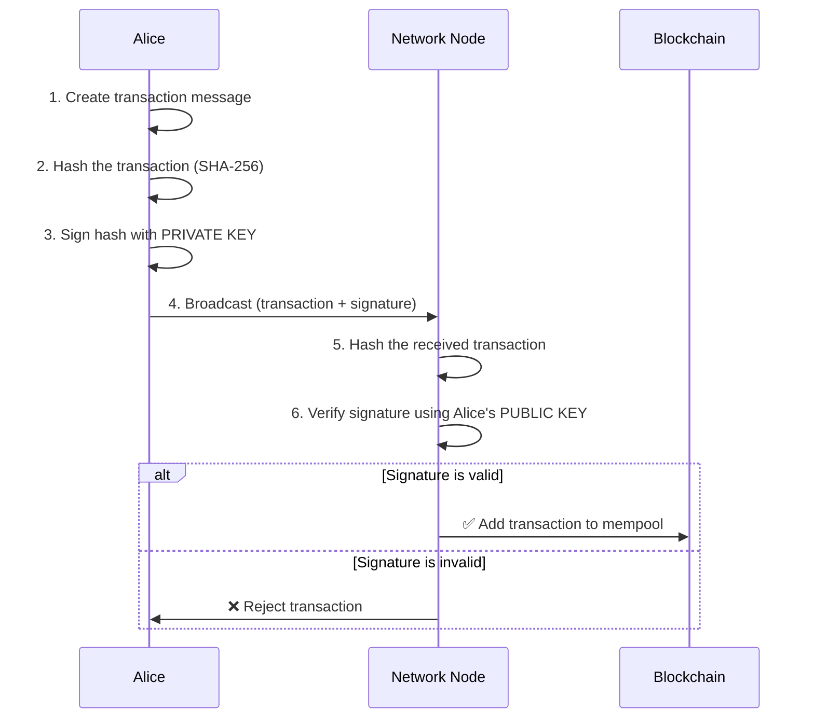
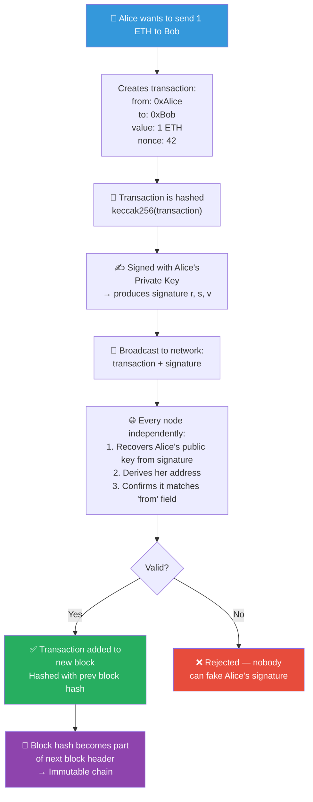

# 🔐 Cryptography Basics for Blockchain

> **Level:** Beginner | **Estimated reading time:** 20–25 minutes
>
> **Prerequisites:** Bas thoda curiosity honi chahiye ki blockchain apna data secure kaise rakhta hai — cryptography ka pehle se knowledge zaruri nahi hai.

---

## 🧠 Cryptography Hai Kya? (Aur Isse Kaam Kyun Hai?)

Socho tumhe class mein apne dost ko ek secret note pass karna hai, lekin teacher beech mein pakad sakti hai. Toh tum aur tumhara dost pehle se ek code decide kar lete ho: har letter ko three positions aage shift kar do (`A → D`, `B → E`, `Z → C`). Ab agar teacher note padh bhi le, toh usko sirf ulta-seedha gibberish dikhega.

Yahi, apne core mein, **cryptography** hai — information ko is tarah secure karne ka science ki sirf jiske liye woh meant hai, wahi use padh ya use kar sake.

Blockchain mein cryptography koi "feature" nahi hai — yeh uski **foundation** hai. Isके bina yeh sab possible hi nahi hota:

- Proof ki *tumhara* hi wallet hai
- Guarantee ki transaction ke saath koi chhedkhaani (tampering) nahi hui
- Trust — ek aise system mein jahan koi central authority hi nahi hai

Cryptography blockchain ko uski sabse important property deti hai: **trustlessness**. Tumhe kisi bank ya company pe bharosa karne ki zarurat nahi — tum sirf math pe bharosa karte ho.

---

## 🔢 Hashing: Digital Fingerprint

### Hash Hota Kya Hai?

Ek **hash function** ko ek magical meat grinder samajh lo. Usme tum *kuch bhi* daal sakte ho — ek single letter, poora novel, ek image — aur bahar aata hai fixed-length characters ka string. Is output ko **hash** ya **digest** kehte hain.

```
Input (any size)  →  [Hash Function]  →  Output (fixed size)
```

Blockchain (Bitcoin, Ethereum, aur zyada tar dusre) **SHA-256** (Secure Hash Algorithm, 256-bit output) use karte hain. Chalo action mein dekhte hain.

### SHA-256 in Practice

```bash
# Using the sha256sum command-line tool (Linux/macOS/Git Bash)

$ echo -n "hello" | sha256sum
2cf24dba5fb0a30e26e83b2ac5b9e29e1b161e5c1fa7425e73043362938b9824

$ echo -n "Hello" | sha256sum
185f8db32921bd46d35cc8b9f0b27c88f1b736b3de5b3ad1a8d4f8a3c2d0a123

$ echo -n "hello world" | sha256sum
b94d27b9934d3e08a52e52d7da7dabfac484efe04294e576b4b8e6b2c60b8a23

$ echo -n "blockchain" | sha256sum
ef7797e13d3a75526946a3bcf00daec9fc9d1a309d68c5e85a4b3c3f0a2e9b1c
```

> Note: Upar diye gaye exact hashes sirf illustrative hain. Khud commands run karke real output dekho — woh duniya ke har machine pe hamesha same hi aayenge.

### Hash Functions Ki Teen Golden Properties

#### 1. Deterministic

Same input **hamesha** same output dega. Agar tum `"hello"` ko aaj hash karo aur dus saal baad kisi doosre computer pe phir se karo, tumhe exact wahi hash milega. Yahi cheez hash ko reliable fingerprint banati hai.

```
"hello" → SHA-256 → 2cf24dba...  (always, everywhere, forever)
```

#### 2. Avalanche Effect

Sirf **ek character** — ya ek bit — change karo, aur output puri tarah aur unpredictably badal jaata hai. `"hello"` aur `"Hello"` ke hashes mein koi similarity hi nahi hai:

```
"hello"  → 2cf24dba5fb0a30e26e83b2ac5b9e29e1b161e5c...
"Hello"  → 185f8db32921bd46d35cc8b9f0b27c88f1b736b3...
           ^^^^^^^^ pehle character se hi bilkul alag
```

Blockchain ke liye yeh crucial hai: agar koi transaction mein ek digit bhi chhed de, hash dramatically change ho jaata hai, aur tampering turant pakdi jaati hai.

#### 3. One-Way (Pre-image Resistance)

Hash output diya ho, toh original input ko reverse-engineer karna **computationally infeasible** hai. Tum verify kar sakte ho ki `"hello"` ka hash `2cf24dba...` hai, lekin `2cf24dba...` se shuru karke wapas `"hello"` tak pahunchna — bina pehle se pata hue — possible nahi hai.

Isi wajah se passwords store karne ke liye hashing use hoti hai. Database plain text nahi, hash store karta hai. Jab tum login karte ho, tumhara password hash hokar stored hash se compare hota hai.

### Blockchain Mein Hashing Kaise Fit Hoti Hai

Blockchain ka har block apne **previous block** ka hash rakhta hai. Kisi bhi purani transaction ko change karo, aur poori chain of hashes toot jaati hai — jisse tampering network ke har node ko turant obvious ho jaati hai.

---

## 🔑 Symmetric vs Asymmetric Encryption

Encryption ka matlab hai data ko unreadable banana — sabke liye, sirf intended recipient ko chhodkar. Encryption ki do major families hain, aur dono kaafi alag tarike se kaam karti hain.

### Symmetric Encryption — Ek Key Sab Kuch Karti Hai

```
Alice encrypts with Key → 🔒 [Ciphertext] → Bob decrypts with same Key
```

Ek lockbox socho jisme **same physical key** se lock bhi hota hai aur unlock bhi. Alice aur Bob ko pehle se securely woh key share karni hoti hai. Yahi symmetric encryption ki fundamental weakness hai — **key distribution**. Agar attacker key exchange beech mein intercept kar le, toh poora scheme collapse ho jaata hai.

Common symmetric algorithms: **AES** (secure Wi-Fi, HTTPS tunnels mein use hota hai), **ChaCha20**.

- **Pros:** Bahut fast, bade amount ka data encrypt karne ke liye best
- **Cons:** Pehle se secure tarike se key share karni padti hai

### Asymmetric Encryption — Ek Matched Key Pair

Yahan cheezein elegant ho jaati hain. Asymmetric encryption **do mathematically linked keys** use karti hai:

- Ek **public key** — yeh tum poori duniya ke saath share kar sakte ho
- Ek **private key** — ise apni jaan se guard karo aur kabhi share mat karo

Jo ek key lock karti hai, use **sirf doosri key hi unlock kar sakti hai**. Isse key-distribution ka problem hi khatam ho jaata hai.

```
Alice's public key → 🔒 [Ciphertext] → only Alice's private key → 🔓 [Plaintext]
```

Common asymmetric algorithms: **RSA**, **Elliptic Curve Cryptography (ECC)** — jise Ethereum use karta hai.

- **Pros:** Pehle se secret key share karne ki zarurat nahi; digital signatures possible banata hai
- **Cons:** Symmetric encryption se kaafi slow hai; isliye chhote data ya key exchange ke liye use hota hai


---

## 📬 Public/Private Key Pairs: Mailbox Analogy

Public/private keys samajhne ka sabse best mental model yeh hai:

> Ek **mailbox** socho jo street pe laga hai. Uske front mein ek **slot** hai — koi bhi rasta chalte hue usme letter daal sakta hai. Lekin mailbox ka darwaza kholkar letters nikaalne ki key sirf **tumhare** paas hai.

| Mailbox Component | Cryptography Equivalent |
|---|---|
| Mailbox ka slot (sabke liye open) | Tumhari **public key** |
| Tumhari unique physical key | Tumhari **private key** |
| Slot mein daala gaya letter | Tumhe bheja gaya encrypted message |
| Mailbox khol ke padhna | Private key se decrypt karna |

Ethereum/Bitcoin mein:

- Tumhara **wallet address** public key se derive hota hai (basically usi ka ek chhota, hashed version hai)
- Tumhari **private key** ek 256-bit random number hai — ek secret jo tumhare address se juda saara asset control karta hai
- Koi bhi tumhare address pe crypto *bhej* sakta hai (slot mein letter daalna)
- Sirf tum, apni private key ke saath, use *spend* kar sakte ho (mailbox kholna)

```
Private Key  →  [ECC math]  →  Public Key  →  [Keccak-256 hash + trim]  →  Wallet Address
(256-bit secret)              (64 bytes)                                    (0x742d35Cc...)
```

> **Critical rule:** Tumhari private key hi blockchain pe tumhari identity hai. Kho di — toh access hamesha ke liye gaya. Share kar di — toh sab kuch turant gaya. Yahan "forgot my password" wala button nahi hota.

---

## ✍️ Digital Signatures: Prove Karna Ki Tumne Bheja

### Problem Kya Hai?

Blockchain pe jab Alice, Bob ko 1 ETH bhejti hai, network ke har node ko verify karna hota hai ki Alice ne — aur sirf Alice ne — is transaction ko authorize kiya hai. Lekin Alice apni private key sabko verification ke liye de nahi sakti. Toh yeh kaam kaise hota hai?

### Solution: Private Se Sign, Public Se Verify

Ek **digital signature** ek cryptographic proof hoti hai ki:

1. Ek specific private key ne is message ko authorize kiya
2. Sign hone ke baad message mein koi chhedkhaani nahi hui

Flow kuch aisa hai:

1. Alice ek transaction banati hai: `"Send 1 ETH to Bob"`
2. Alice transaction ko hash karti hai: `hash = SHA-256("Send 1 ETH to Bob")`
3. Alice us hash ko apni **private key** se sign karti hai: `signature = sign(hash, alicePrivateKey)`
4. Alice transaction + signature dono network ko broadcast karti hai
5. Koi bhi node verify kar sakta hai: `verify(hash, signature, alicePublicKey)` → `true` ya `false`

Sabse zabardast part yeh hai: signature proof deta hai ki Alice ki private key use hui, **bina private key ko kabhi reveal kiye**.



### Yeh Fake Kyun Nahi Kiya Ja Sakta

Keys ke beech ka mathematical relationship forgery ko computationally impossible bana deta hai:

- Alice ki private key ke bina, koi bhi Alice ke address ke liye valid signature produce nahi kar sakta
- Agar koi transaction data mein chhedkhaani kare (chahe `1 ETH` ko `100 ETH` mein badal de), hash change ho jaata hai, signature ab match nahi karta, aur har node use reject kar deta hai
- Alice yeh deny nahi kar sakti ki usne sign nahi kiya (non-repudiation) — signature khud irrefutable proof hai

---

## ⛓️ Yeh Sab Blockchain Mein Ek Saath Kaise Kaam Karta Hai

Chalo dekhte hain ki ek simple Ethereum transaction ko cryptography start se end tak kaise protect karti hai:



### Wallets Storage Nahi Hain — Yeh Key Managers Hain

Ek common misconception: tumhara crypto wallet tumhare coins ko "hold" nahi karta. Tumhare coins blockchain ledger pe entries ke roop mein exist karte hain. Tumhara wallet sirf tumhari **private key** hold karta hai, jo ownership prove karti hai aur transactions sign karne deti hai.

Isko aise samjho jaise Paytm ya PhonePe ka app tumhare paise "apne paas" nahi rakhta — woh bank ke ledger mein hote hain. App sirf tumhari identity/authentication ka zariya hai jisse tum apne paise access kar pao. Wallet bhi bilkul waise hi kaam karta hai.

| Concept | Cryptographic Component |
|---|---|
| Wallet address | Public key se derive hota hai |
| Ownership prove karna | Private key signature |
| Funds receive karna | Koi bhi tumhare public address pe bhej sakta hai |
| Funds spend karna | Private key se transaction sign karna |
| Transaction integrity | Hash-based tamper detection |
| Block linking | Har block, previous block ka hash rakhta hai |
| Mining/Proof of Work | Target value se neeche wala hash dhoondhna |

### Seed Phrases (Mnemonics)

Tumhara 12 ya 24-word seed phrase (jaise `witch collapse practice feed shame open despair creek road again ice least`) tumhari master private key ka ek human-readable encoding hai. Isi ek seed se, deterministic math (BIP-39/BIP-32) hazaaron key pairs derive kar sakti hai — har blockchain account ke liye ek.

---

## 🏁 Key Takeaways

- **Cryptography hi blockchain trust ki bedrock hai.** Yeh banks, governments, ya kisi bhi central authority ki zarurat ko khatam kar deti hai.

- **Hash functions** (SHA-256, Keccak-256) data ke fixed-size fingerprints banate hain. Yeh deterministic hote hain, one-way hote hain, aur avalanche effect dikhate hain — jisse blockchain ki immutability possible hoti hai.

- **Symmetric encryption** ek shared key use karti hai; fast hai lekin secure key exchange chahiye. **Asymmetric encryption** public/private key pair use karti hai; slow hai lekin key-distribution problem ko elegantly solve kar deti hai.

- **Public/private key pairs** blockchain ka identity system hain. Tumhari public key (aur usse derive hua address) tumhara mailbox slot hai — usse freely share karo. Tumhari private key hi ek cheez hai jo use unlock karti hai — use absolutely guard karo.

- **Digital signatures** tumhe mathematically prove karne dete hain ki tumne transaction authorize ki, bina private key kabhi expose kiye. Koi bhi node sirf tumhari public key se signature verify kar sakta hai.

- **Private key kho gayi = assets permanently gaye.** Koi recovery mechanism nahi hai. Hardware wallets aur secure seed phrase storage serious blockchain users ke liye optional nahi hain.

---

## 🧩 Quiz — Apni Samajh Test Karo

**Question 1:** Alice `"Send 5 ETH to Bob"` string ko hash karti hai aur hash `abc123` milta hai. Ek attacker beech mein intercept karke ise `"Send 500 ETH to Bob"` mein badal deta hai. Jab koi node modified transaction ko hash karega, tab kya hoga?

> A) Fir bhi `abc123` hi produce hoga kyunki hashes stable hote hain
> B) Ek bilkul different hash produce hoga, aur signature verification fail ho jaayegi
> C) Node ko difference pata hi nahi chalega
> D) Transaction ho jaayega lekin flag ho jaayega

<details>
<summary>Reveal Answer</summary>

**B** — Avalanche effect ka matlab hai ki input mein chhota sa change bhi puri tarah alag hash produce karta hai. Attacker ke modified transaction se ek different hash aata hai, jo ab Alice ke signature (jo original hash pe compute hua tha) se match nahi karta. Har node use reject kar deta hai.

</details>

---

**Question 2:** Apni public key — ya wallet address — kisi ke saath bhi share karna safe kyun hai?

> A) Kyunki public keys 30 din baad expire ho jaati hain
> B) Kyunki network unhe automatically encrypt kar deta hai
> C) Kyunki mathematical one-way functions se public key se private key derive karna infeasible hai
> D) Kyunki wallet addresses mein koi real information hoti hi nahi

<details>
<summary>Reveal Answer</summary>

**C** — Asymmetric cryptography (Ethereum ke case mein specifically Elliptic Curve Discrete Logarithm Problem) public key se private key tak reverse jaana computationally infeasible bana deti hai. Apni public key ya address share karne se dusre sirf tumhe funds *bhej* sakte hain — bina private key ke woh use spend nahi kar sakte.

</details>

---

**Question 3:** Jab Alice apni Ethereum transaction sign karti hai, steps ka correct order kya hai?

> A) Encrypt → Broadcast → Sign → Hash
> B) Hash → Sign with public key → Broadcast
> C) Transaction ko hash karo → Hash ko private key se sign karo → Transaction + signature broadcast karo
> D) Private key se sign karo → Signature ko hash karo → Broadcast karo

<details>
<summary>Reveal Answer</summary>

**C** — Sabse pehle transaction ko hash karke ek fixed-size digest banaya jaata hai (sign karne mein efficient), phir us hash ko Alice ki private key se sign kiya jaata hai (signature banti hai). Transaction data aur signature dono saath broadcast hote hain. Nodes independently transaction ko hash karke Alice ki public key ke against signature verify karte hain.

</details>

---

## 📚 Further Reading

- [Bitcoin Whitepaper — Satoshi Nakamoto](https://bitcoin.org/bitcoin.pdf) — Section 2 directly transactions aur signatures cover karta hai
- [Mastering Ethereum — Chapter 4: Keys, Addresses](https://github.com/ethereumbook/ethereumbook) — Ethereum ke key system ka deep dive
- [Dan Boneh's Cryptography Course (Coursera)](https://www.coursera.org/learn/cryptography) — Free, rigorous foundations
- **Next Chapter:** `04-consensus-mechanisms.md` — Hazaaron nodes bina ek dusre pe trust kiye same truth pe kaise agree karte hain

---

*Chapter 03 of Blockchain Fundamentals for Solidity Developers*
