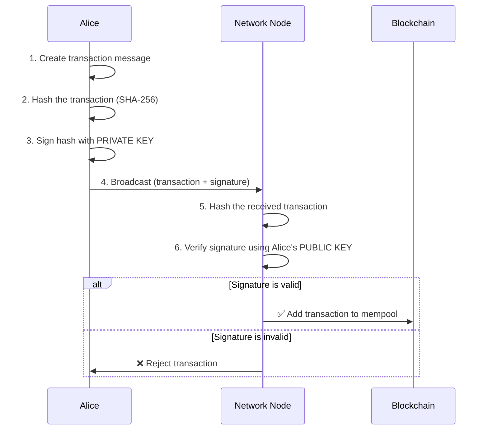
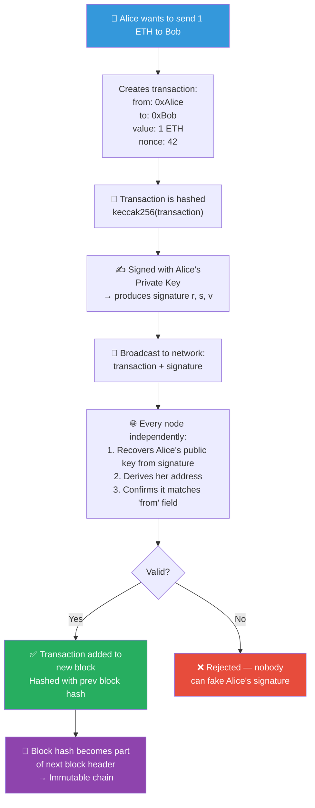

# 🔐 Cryptography Basics for Blockchain

> **Level:** Beginner | **Estimated reading time:** 20–25 minutes
>
> **Prerequisites:** A general curiosity about how blockchains keep data secure — no prior cryptography knowledge required.

---

## 🧠 What Is Cryptography? (And Why Should You Care?)

Imagine you want to pass a secret note to your friend in class, but the teacher might intercept it. You and your friend agree on a secret code beforehand: every letter is shifted three positions forward in the alphabet (`A → D`, `B → E`, `Z → C`). Now even if the teacher reads the note, it looks like gibberish.

That, at its core, is **cryptography** — the science of securing information so that only the intended recipient can read or use it.

In blockchain, cryptography is not a feature — it is the **foundation**. Without it, there would be no:

- Proof that *you* own a wallet
- Guarantee that a transaction was not tampered with
- Trust in a system with no central authority

Cryptography gives blockchain its most important property: **trustlessness**. You do not need to trust a bank or company; you trust math.

---

## 🔢 Hashing: The Digital Fingerprint

### What Is a Hash?

Think of a **hash function** as a magical meat grinder. You can put *anything* in — a single letter, an entire novel, an image — and out comes a fixed-length string of characters. The output is called a **hash** or **digest**.

```
Input (any size)  →  [Hash Function]  →  Output (fixed size)
```

Blockchain (Bitcoin, Ethereum, and most others) relies on **SHA-256** (Secure Hash Algorithm, 256-bit output). Let us see it in action.

### SHA-256 in Practice

```bash
# Using the sha256sum command-line tool (Linux/macOS/Git Bash)

$ echo -n "hello" | sha256sum
2cf24dba5fb0a30e26e83b2ac5b9e29e1b161e5c1fa7425e73043362938b9824

$ echo -n "Hello" | sha256sum
185f8db32921bd46d35cc8b9f0b27c88f1b736b3de5b3ad1a8d4f8a3c2d0a123

$ echo -n "hello world" | sha256sum
b94d27b9934d3e08a52e52d7da7dabfac484efe04294e576b4b8e6b2c60b8a23

$ echo -n "blockchain" | sha256sum
ef7797e13d3a75526946a3bcf00daec9fc9d1a309d68c5e85a4b3c3f0a2e9b1c
```

> Note: The exact hashes above are illustrative. Run these commands yourself to see the real outputs — they will always be the same on every machine in the world.

### The Three Golden Properties of Hash Functions

#### 1. Deterministic

The same input **always** produces the same output. If you hash `"hello"` today and again in ten years on a different computer, you will always get the exact same hash. This is what makes hashes reliable fingerprints.

```
"hello" → SHA-256 → 2cf24dba...  (always, everywhere, forever)
```

#### 2. The Avalanche Effect

Change even **one character** — or one bit — and the output changes completely and unpredictably. There is no similarity between the hashes of `"hello"` and `"Hello"`:

```
"hello"  → 2cf24dba5fb0a30e26e83b2ac5b9e29e1b161e5c...
"Hello"  → 185f8db32921bd46d35cc8b9f0b27c88f1b736b3...
           ^^^^^^^^ completely different from the first character
```

This is crucial for blockchain: if someone tweaks a single digit in a transaction, the hash changes dramatically, and the tampering is instantly detectable.

#### 3. One-Way (Pre-image Resistance)

Given a hash output, it is **computationally infeasible** to reverse-engineer the original input. You can verify that `"hello"` hashes to `2cf24dba...`, but you cannot start with `2cf24dba...` and work backwards to `"hello"` without already knowing it.

This is why hashing is used to store passwords. Databases store the hash, not the plain text. When you log in, your password is hashed and compared to the stored hash.

### How Hashing Fits Into Blockchain

Every block in a blockchain contains the hash of the **previous block**. Change any historical transaction and you break the chain of hashes — making tampering immediately obvious to every node in the network.

---

## 🔑 Symmetric vs Asymmetric Encryption

Encryption is about making data unreadable to anyone except the intended recipient. There are two major families of encryption, and they work very differently.

### Symmetric Encryption — One Key Does Everything

```
Alice encrypts with Key → 🔒 [Ciphertext] → Bob decrypts with same Key
```

Imagine a lockbox where the **same physical key** both locks and unlocks it. Alice and Bob must somehow share that key securely beforehand. This is the fundamental weakness of symmetric encryption — **key distribution**. If an attacker intercepts the key exchange, the whole scheme falls apart.

Common symmetric algorithms: **AES** (used in secure Wi-Fi, HTTPS tunnels), **ChaCha20**.

- **Pros:** Very fast, great for encrypting large amounts of data
- **Cons:** Requires a secure way to share the key first

### Asymmetric Encryption — A Matched Key Pair

This is where things get elegant. Asymmetric encryption uses **two mathematically linked keys**:

- A **public key** — you can share this with the entire world
- A **private key** — you guard this with your life and never share it

What one key locks, **only the other key can unlock**. This breaks the key-distribution problem wide open.

```
Alice's public key → 🔒 [Ciphertext] → only Alice's private key → 🔓 [Plaintext]
```

Common asymmetric algorithms: **RSA**, **Elliptic Curve Cryptography (ECC)** — which Ethereum uses.

- **Pros:** No need to share a secret key beforehand; enables digital signatures
- **Cons:** Much slower than symmetric encryption; used for small data or key exchange


---

## 📬 Public/Private Key Pairs: The Mailbox Analogy

Here is the best mental model for public/private keys:

> Picture a **mailbox** on the street. It has a **slot** on the front — anyone walking by can drop a letter into it. But only **you** have the key to open the mailbox door and retrieve the letters.

| Mailbox Component | Cryptography Equivalent |
|---|---|
| The mailbox slot (open to everyone) | Your **public key** |
| Your unique physical key | Your **private key** |
| A letter dropped in the slot | An encrypted message sent to you |
| Opening the mailbox to read it | Decrypting with your private key |

In Ethereum/Bitcoin:

- Your **wallet address** is derived from your public key (it is essentially a shorter, hashed version of it)
- Your **private key** is a 256-bit random number — a secret that controls all assets associated with your address
- Anyone can *send* crypto to your address (drop a letter in the slot)
- Only you, with your private key, can *spend* it (open the mailbox)

```
Private Key  →  [ECC math]  →  Public Key  →  [Keccak-256 hash + trim]  →  Wallet Address
(256-bit secret)              (64 bytes)                                    (0x742d35Cc...)
```

> **Critical rule:** Your private key is your identity on the blockchain. Lose it — and you lose access forever. Share it — and you lose everything immediately. There is no "forgot my password" button.

---

## ✍️ Digital Signatures: Proving You Sent It

### The Problem

On a blockchain, when Alice sends 1 ETH to Bob, every node in the network needs to verify that Alice — and only Alice — authorized this transaction. But Alice cannot hand her private key to everyone for verification. How does this work?

### The Solution: Sign with Private, Verify with Public

A **digital signature** is a cryptographic proof that:

1. A specific private key authorized this message
2. The message has not been altered since it was signed

Here is the flow:

1. Alice creates a transaction: `"Send 1 ETH to Bob"`
2. Alice hashes the transaction: `hash = SHA-256("Send 1 ETH to Bob")`
3. Alice signs the hash with her **private key**: `signature = sign(hash, alicePrivateKey)`
4. Alice broadcasts the transaction + signature to the network
5. Any node can verify: `verify(hash, signature, alicePublicKey)` → `true` or `false`

The brilliant part: the signature proves Alice's private key was used **without ever revealing the private key itself**.



### Why This Cannot Be Faked

The mathematical relationship between the keys makes forgery computationally impossible:

- Without Alice's private key, no one can produce a valid signature for Alice's address
- If anyone tampers with the transaction data (even changing `1 ETH` to `100 ETH`), the hash changes, the signature no longer matches, and every node rejects it
- Alice cannot deny having signed it (non-repudiation) — the signature is irrefutable proof

---

## ⛓️ How It All Comes Together in Blockchain

Let us trace exactly how cryptography protects a simple Ethereum transaction from start to finish:



### Wallets Are Not Storage — They Are Key Managers

A common misconception: your crypto wallet does not "hold" your coins. Your coins exist as entries on the blockchain ledger. Your wallet holds your **private key**, which proves ownership and lets you sign transactions.

| Concept | Cryptographic Component |
|---|---|
| Wallet address | Derived from public key |
| Proving ownership | Private key signature |
| Receiving funds | Anyone sends to your public address |
| Spending funds | Sign a transaction with your private key |
| Transaction integrity | Hash-based tamper detection |
| Block linking | Each block hashes the previous block |
| Mining/Proof of Work | Finding a hash below a target value |

### Seed Phrases (Mnemonics)

Your 12 or 24-word seed phrase (e.g., `witch collapse practice feed shame open despair creek road again ice least`) is a human-readable encoding of your master private key. From this one seed, deterministic math (BIP-39/BIP-32) can derive thousands of key pairs — one for each blockchain account.

---

## 🏁 Key Takeaways

- **Cryptography is the bedrock of blockchain trust.** It replaces the need for banks, governments, or any central authority.

- **Hash functions** (SHA-256, Keccak-256) produce fixed-size fingerprints of data. They are deterministic, one-way, and exhibit the avalanche effect — making blockchain immutability possible.

- **Symmetric encryption** uses one shared key; fast but requires secure key exchange. **Asymmetric encryption** uses a public/private key pair; slower but solves the key-distribution problem elegantly.

- **Public/private key pairs** are the identity system of blockchain. Your public key (and address derived from it) is your mailbox slot — share it freely. Your private key is the only thing that unlocks it — guard it absolutely.

- **Digital signatures** allow you to prove you authorized a transaction mathematically, without ever exposing your private key. Any node can verify the signature using only your public key.

- **Losing your private key = losing your assets permanently.** There is no recovery mechanism. Hardware wallets and secure seed phrase storage are not optional for serious blockchain users.

---

## 🧩 Quiz — Test Your Understanding

**Question 1:** Alice hashes the string `"Send 5 ETH to Bob"` and gets hash `abc123`. An attacker intercepts and changes it to `"Send 500 ETH to Bob"`. What happens when a node hashes the modified transaction?

> A) It still produces `abc123` because hashes are stable
> B) It produces a completely different hash, and the signature verification fails
> C) The node cannot tell the difference
> D) The transaction goes through but is flagged

<details>
<summary>Reveal Answer</summary>

**B** — The avalanche effect means even a tiny change to the input produces a completely different hash. The attacker's modified transaction produces a different hash, which no longer matches Alice's signature (which was computed over the original hash). Every node rejects it.

</details>

---

**Question 2:** Why is it safe to share your public key — or your wallet address — with anyone?

> A) Because public keys expire after 30 days
> B) Because the network encrypts them automatically
> C) Because mathematical one-way functions make it infeasible to derive the private key from the public key
> D) Because wallet addresses contain no real information

<details>
<summary>Reveal Answer</summary>

**C** — Asymmetric cryptography (specifically Elliptic Curve Discrete Logarithm Problem for Ethereum) makes it computationally infeasible to reverse from public key to private key. Sharing your public key or address only lets others *send* you funds — they cannot spend them without your private key.

</details>

---

**Question 3:** What is the correct order of steps when Alice signs an Ethereum transaction?

> A) Encrypt → Broadcast → Sign → Hash
> B) Hash → Sign with public key → Broadcast
> C) Hash the transaction → Sign the hash with private key → Broadcast transaction + signature
> D) Sign with private key → Hash the signature → Broadcast

<details>
<summary>Reveal Answer</summary>

**C** — The transaction is first hashed to produce a fixed-size digest (efficient to sign), then the hash is signed using Alice's private key (producing the signature). The transaction data plus the signature are broadcast together. Nodes independently hash the transaction and verify the signature against Alice's public key.

</details>

---

## 📚 Further Reading

- [Bitcoin Whitepaper — Satoshi Nakamoto](https://bitcoin.org/bitcoin.pdf) — Section 2 covers transactions and signatures directly
- [Mastering Ethereum — Chapter 4: Keys, Addresses](https://github.com/ethereumbook/ethereumbook) — Deep dive into Ethereum's key system
- [Dan Boneh's Cryptography Course (Coursera)](https://www.coursera.org/learn/cryptography) — Free, rigorous foundations
- **Next Chapter:** `04-consensus-mechanisms.md` — How thousands of nodes agree on the same truth without trusting each other

---

*Chapter 03 of Blockchain Fundamentals for Solidity Developers*
