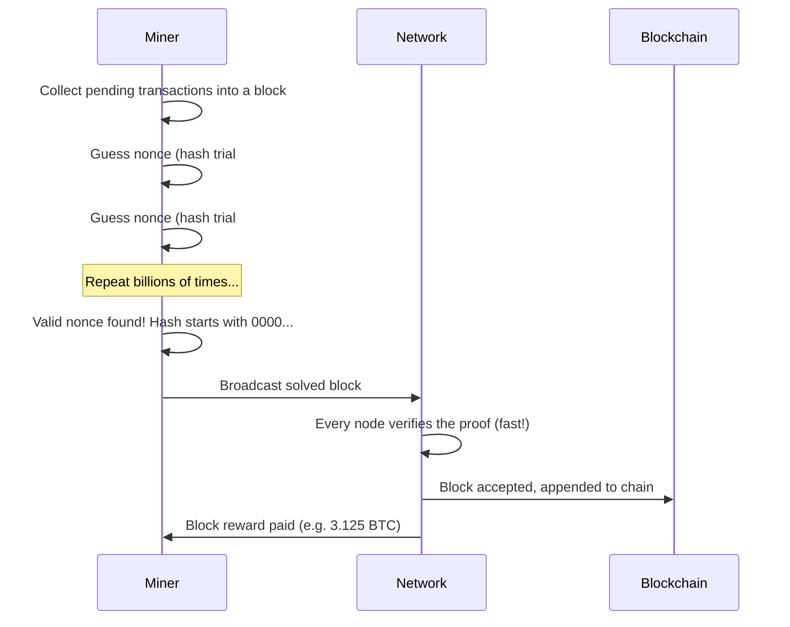
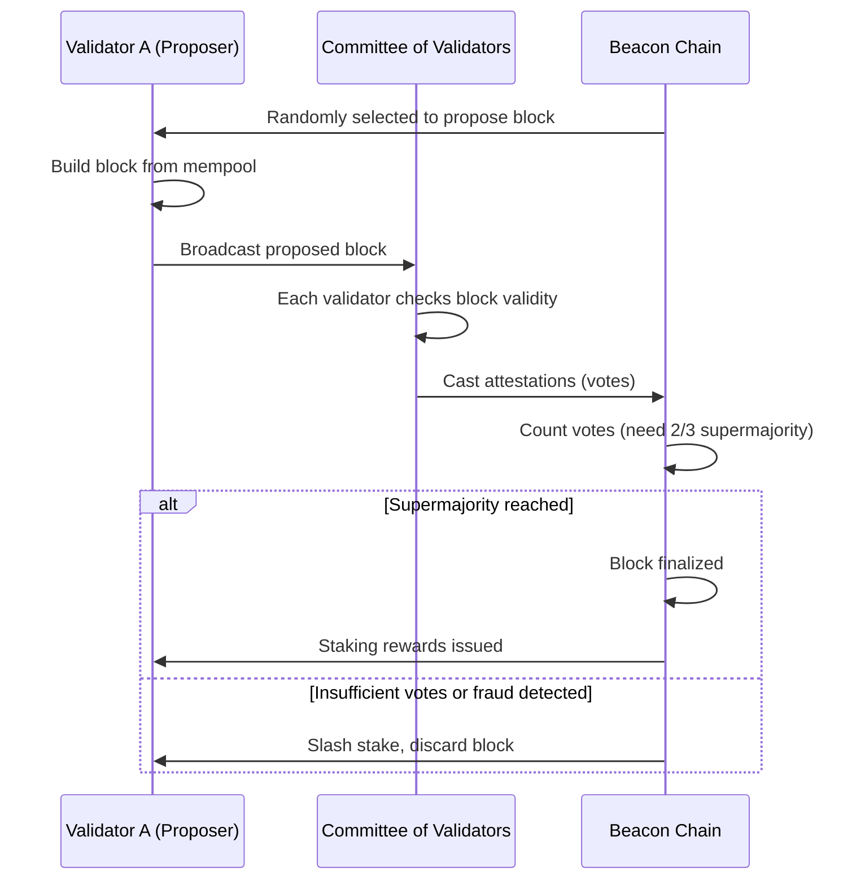

# 🤝 Chapter 4: Consensus Mechanisms

> **Who gets to decide what the truth is — when there is no single authority to ask?**

That question is the heart of every blockchain. This chapter answers it by walking you through the ingenious mechanisms that allow thousands of strangers, running nodes on every continent, to agree on a single shared history — without ever trusting each other.

---

## 🧩 What Is Consensus, and Why Do We Need It?

In a traditional database, one company owns the server. If you want to know the current balance of a bank account, you ask the bank's server, and it gives you the answer. Simple.

Blockchains do not have that luxury. They are **distributed** — hundreds or thousands of computers all hold a copy of the ledger. When someone submits a transaction ("Alice sends 1 ETH to Bob"), every node needs to:

1. Verify the transaction is valid (Alice actually has the funds).
2. Agree on the **order** of transactions (so no one double-spends).
3. Add the agreed-upon block to the chain.

This sounds straightforward until you ask: what happens if some nodes are lying, crashed, or actively trying to cheat?

### The Byzantine Generals Problem

In 1982, computer scientists Leslie Lamport, Robert Shostak, and Marshall Pease published a famous thought experiment called the **Byzantine Generals Problem**.

Imagine several Byzantine army generals surrounding an enemy city. They can only communicate by messenger. They must all agree on the same battle plan — attack or retreat — or they will lose. The catch: some generals might be **traitors** who send conflicting messages to different generals.

> How do loyal generals reach agreement when some participants might be actively lying?

This maps directly onto a blockchain network:

- **Generals** = nodes on the network
- **Messengers** = the peer-to-peer network
- **Traitors** = malicious nodes trying to double-spend or corrupt the chain
- **Battle plan** = the agreed-upon next block

A consensus mechanism is the protocol that solves this problem — it lets honest participants agree on truth even when some participants are dishonest. Any system that solves this is called **Byzantine Fault Tolerant (BFT)**.

---

## ⛏️ Proof of Work (PoW)

Proof of Work is the original consensus mechanism, invented for Bitcoin by Satoshi Nakamoto in 2008. It is elegant, battle-tested, and energy-hungry.

### The Core Idea: Solve an Expensive Puzzle

To add the next block to the chain, a node (called a **miner**) must solve a computational puzzle. The puzzle is:

> Find a number (called a **nonce**) such that when you combine it with the block's data and hash everything together, the resulting hash starts with a certain number of zeros.

**Example:**

```
SHA256(block_data + nonce) = 0000000000000abcdef123...
```

The only way to find this nonce is to **guess**. You try billions of combinations per second until one works. This is why Bitcoin mining requires enormous computing power.

### The Puzzle Analogy

Think of it like rolling a die: I tell you "roll until you get a 1." On a six-sided die that is easy — about 1-in-6 odds. Now imagine a die with one million sides, and you must roll a 1. That takes much longer and many more rolls. Bitcoin's difficulty adjusts to target one new block roughly every 10 minutes, regardless of how much computing power joins the network.

### PoW Flow



### Why Is Verification Fast but Mining Slow?

This asymmetry is the genius of PoW. Mining is expensive (billions of guesses). Verification is trivial — any node takes the proposed nonce, runs a single hash, and checks if it starts with enough zeros. One calculation confirms the work.

This means cheating is expensive. To rewrite history, an attacker would need to redo all the work for the target block **and** every block after it, faster than the rest of the honest network is adding new blocks. Unless the attacker controls more than 50% of the network's total compute power (a **51% attack**), this is economically irrational.

### Energy Concerns

PoW's security comes at a real cost. As of 2023, Bitcoin's network consumes more electricity annually than some mid-sized countries. This is by design — the energy expenditure is the "proof" that work was done. Critics argue this is environmentally irresponsible. Proponents argue it creates provable, unforgeable security with no central point of failure.

---

## 🪙 Proof of Stake (PoS)

Proof of Stake is the dominant modern approach. Rather than requiring miners to spend electricity, it requires validators to **lock up (stake) cryptocurrency** as collateral. Ethereum switched to this mechanism in September 2022.

### The Core Idea: Put Up a Security Deposit

Think of becoming a validator like renting an apartment. Your landlord takes a **security deposit** before you move in. If you trash the apartment, you lose the deposit. If you behave well, you get it back.

In PoS:

- A **validator** locks (stakes) a minimum amount of ETH (32 ETH on Ethereum mainnet).
- The protocol randomly selects a validator to **propose** the next block.
- Other validators **attest** (vote) on whether the proposed block is valid.
- Honest validators earn **rewards** (new ETH + transaction fees).
- Validators who try to cheat are **slashed** — they lose a portion of their staked ETH.

### PoS Flow



### How Are Validators Selected?

Selection is **pseudo-random**, weighted by stake size. A validator who stakes twice as much has roughly twice the probability of being chosen to propose. However, stake alone is not enough — the randomness (using a cryptographic scheme called RANDAO on Ethereum) ensures no one can predict or manipulate who gets chosen next.

### Why Is PoS More Energy-Efficient?

Validators do not compete in an energy arms race. There is no puzzle to solve. A validator simply needs to run a node (a standard server or even a good laptop) and stay online. Ethereum's energy consumption dropped by approximately **99.95%** after The Merge.

---

## 🗳️ Delegated Proof of Stake (DPoS)

DPoS is a variation used by blockchains like EOS and TRON. Token holders do not validate themselves — they **vote** to elect a small set of delegates (e.g., 21 on EOS) who do the actual block production.

**Pros:** Very high throughput, fast blocks.  
**Cons:** More centralized — only a handful of entities produce blocks, which can lead to cartel-like behavior.

---

## 🔏 Proof of Authority (PoA)

PoA is used in private or consortium blockchains (e.g., enterprise supply chains, testnets). A pre-approved list of known validators signs blocks based on their **identity and reputation**, not stake or compute.

**Pros:** Extremely fast, high throughput, no energy waste.  
**Cons:** Fully centralized — trust is placed in the known validators. Not suitable for permissionless public networks.

Ethereum's Sepolia and Goerli testnets historically used PoA variants.

---

## 📊 Comparison Table: PoW vs PoS

| Feature | Proof of Work (PoW) | Proof of Stake (PoS) |
|---|---|---|
| **Security Mechanism** | Computational work (energy) | Economic stake (collateral) |
| **Who Participates** | Miners (specialized hardware) | Validators (locked ETH) |
| **Energy Usage** | Very high | Very low (~99.95% less) |
| **Entry Barrier** | ASIC hardware, electricity costs | 32 ETH (~$80K+ at current prices) |
| **Attack Cost** | Buy 51% of hashrate | Buy 51% of staked tokens |
| **Block Time** | ~10 min (Bitcoin) | ~12 sec (Ethereum) |
| **Finality** | Probabilistic | Deterministic (after 2 epochs) |
| **Decentralization** | Hardware centralization risk | Wealth concentration risk |
| **Used By** | Bitcoin, Litecoin | Ethereum, Solana, Cardano |

---

## ⏱️ Finality: Probabilistic vs Deterministic

**Finality** is the guarantee that a transaction cannot be reversed. There are two flavors:

### Probabilistic Finality (PoW)

In Bitcoin, a transaction is never 100% final — it just becomes increasingly unlikely to be reversed. When your transaction appears in one block, there is a small chance a longer competing chain (fork) could appear and displace it. After 6 confirmations (roughly 60 minutes), the probability of reversal becomes astronomically small, so the industry treats it as final.

> The more blocks piled on top, the harder it would be for an attacker to re-mine them all.

### Deterministic Finality (PoS)

Modern PoS systems like Ethereum implement **economic finality**. Once 2/3 of validators have attested to a checkpoint, it is considered **finalized**. To reverse it, an attacker would need to burn at least 1/3 of all staked ETH — billions of dollars. The protocol considers this economically impossible and marks the block as final.

Ethereum finalizes blocks roughly every 12-15 minutes (two epochs). After finalization, reverting it would require extraordinary intervention (a hard fork).

---

## 🔀 The Merge: Ethereum's Switch from PoW to PoS

For its first seven years (2015–2022), Ethereum used Proof of Work — the same mechanism as Bitcoin. But Ethereum had always planned to move to PoS for efficiency and scalability reasons.

### The Timeline

- **2020:** Ethereum launched the **Beacon Chain** — a separate PoS chain running in parallel, with no transactions, just building the validator set and proving the system worked.
- **2022 (September 15):** **The Merge** happened at block 15,537,394. The original PoW execution layer merged with the Beacon Chain's PoS consensus layer.

### What Changed

Before The Merge, Ethereum had two separate layers:

```
[Execution Layer] <---- Proof of Work (miners)
[Consensus Layer] <---- Beacon Chain (validators, running in parallel)
```

After The Merge, miners were entirely replaced by validators:

```
[Execution Layer] + [Consensus Layer] = Unified Ethereum PoS
```

Miners received no warning period — the transition happened at a specific total difficulty threshold (called the **Terminal Total Difficulty**). At that exact block, the network stopped accepting PoW blocks and began requiring PoS attestations.

### What Did NOT Change

- **Your ETH balance was unaffected.** Not a single wei was moved or reset.
- **The transaction history was preserved.** All 7 years of Ethereum history carried over.
- **Smart contracts kept running.** Every deployed contract continued functioning identically.
- **Gas fees worked the same way.** (Fees are a separate concern from consensus.)

The Merge did not increase transaction throughput significantly — that goal is addressed by later upgrades (sharding, Layer 2s). What it did accomplish was slashing Ethereum's energy usage by ~99.95% overnight, and setting the foundation for future scalability work.

---

## 💡 Key Takeaways

- **Consensus** is how a distributed, trustless network agrees on a single truth, solving the Byzantine Generals Problem.
- **Proof of Work** uses computational puzzles and energy expenditure to make cheating expensive. It is battle-tested but power-hungry.
- **Proof of Stake** uses locked collateral and slashing to make cheating expensive. It is energy-efficient and increasingly dominant.
- **Delegated PoS** and **Proof of Authority** trade decentralization for speed, suited to different use cases.
- **Finality** in PoW is probabilistic (more blocks = more confidence). In PoS, it is deterministic once a supermajority attests.
- **The Merge** (September 2022) was one of the most complex live system migrations in software history — Ethereum switched consensus mechanisms without downtime, resetting balances, or losing history.

---

## 🧪 Quiz

Test your understanding before moving on.

**Question 1:** A friend says "Bitcoin is final after one confirmation." How would you correct them?

> Bitcoin uses **probabilistic finality**. After one confirmation, there is still a small chance a longer competing chain could emerge and displace your transaction. The industry convention is to wait for 6 confirmations (~60 minutes) before treating a transaction as effectively irreversible.

---

**Question 2:** Why does an Ethereum validator need to stake 32 ETH? What happens if they try to cheat?

> The stake acts as a **security deposit**. If a validator proposes an invalid block or signs conflicting blocks (equivocation), the protocol automatically **slashes** a portion of their staked ETH. The larger the stake, the more a validator stands to lose by misbehaving, creating a strong financial disincentive against attacks.

---

**Question 3:** What was the Beacon Chain, and why did Ethereum need it before The Merge?

> The Beacon Chain was a **separate PoS consensus chain** launched in December 2020, running in parallel with the original PoW Ethereum chain. It allowed Ethereum developers to build up a set of real validators, test the PoS mechanics, and accumulate real ETH stakes — proving the system worked reliably — before risking the actual transaction-carrying chain. The Merge then fused the Beacon Chain's consensus layer with Ethereum's execution layer, replacing PoW miners entirely.

---

*Next Chapter: Transaction Lifecycle — from mempool to finalized block →*
