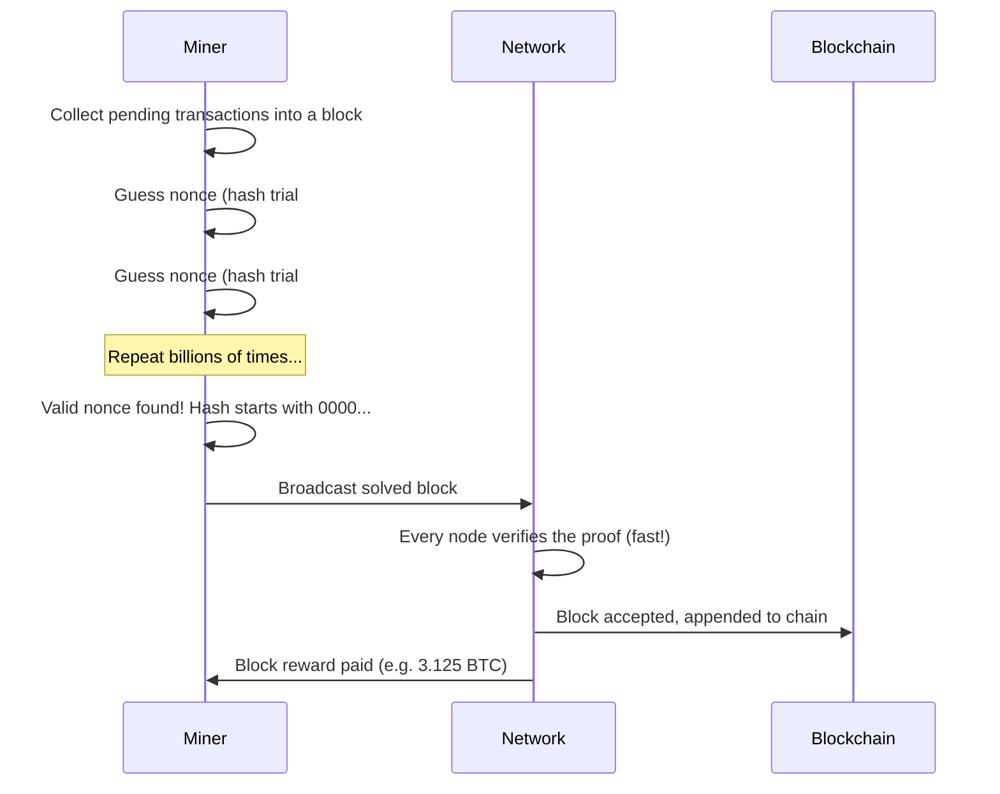
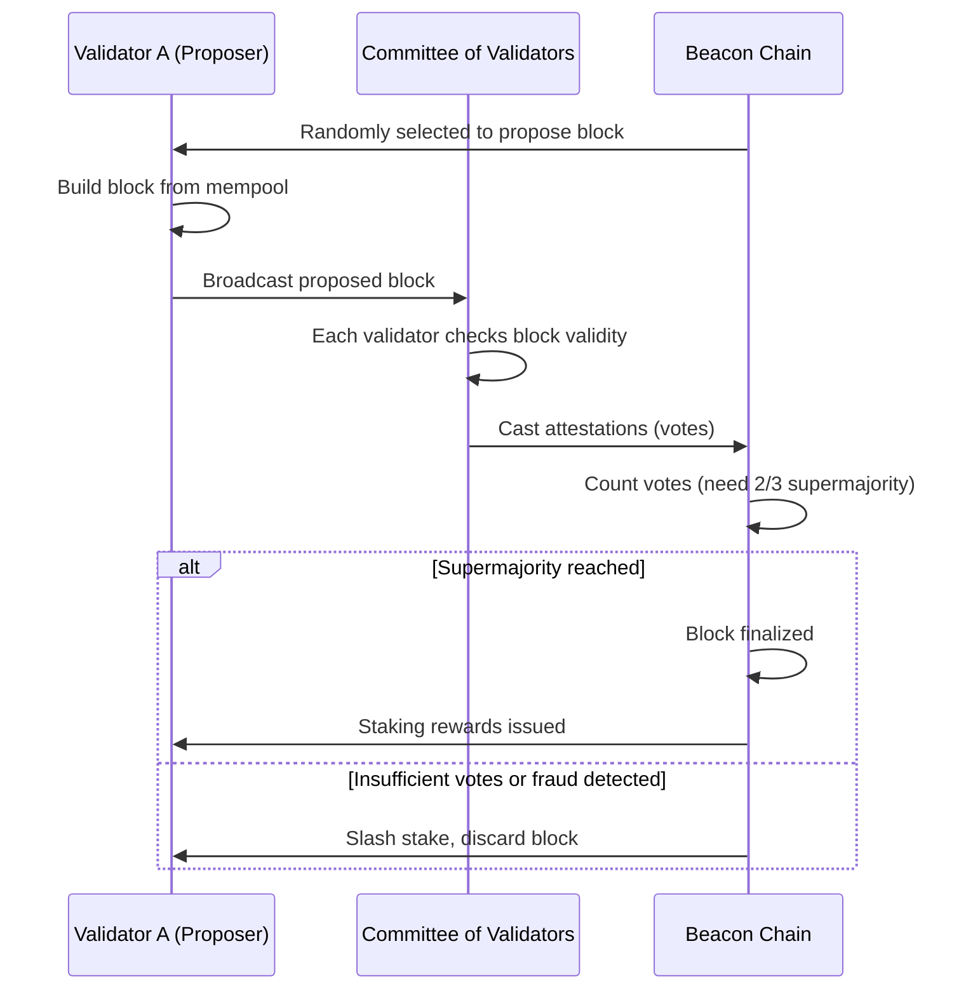

# 🤝 Chapter 4: Consensus Mechanisms

> **Sach kya hai, ye decide kaun karega — jab koi single authority hi nahi hai poochne ke liye?**

Yahi sawaal har blockchain ke dil mein baitha hai. Is chapter mein hum wahi genius mechanisms samjhenge jo hazaaron ajnabiyon ko — jo alag-alag continents pe apne nodes chala rahe hain — ek shared history pe agree karne dete hain, bina ek doosre pe trust kiye.

---

## 🧩 Consensus Hai Kya, Aur Iski Zaroorat Kyun Padi?

Traditional database mein ek hi company server ki maalik hoti hai. Tumhe bank balance check karna hai? Bank ke server se pooch lo, jawab mil jaayega. Seedha-saadha kaam.

Blockchain ke paas ye luxury nahi hai. Ye **distributed** system hain — sainkdon ya hazaaron computers ke paas ledger ki apni-apni copy hoti hai. Jab koi transaction submit karta hai ("Alice ne Bob ko 1 ETH bheja"), to har node ko ye karna padta hai:

1. Transaction valid hai ya nahi verify karna (Alice ke paas actually funds hain ya nahi).
2. Transactions ka **order** decide karna (taaki koi double-spend na kar sake).
3. Agreed-upon block ko chain mein add karna.

Ye sab tab tak simple lagta hai jab tak tum ye na pooch lo: agar kuch nodes jhooth bol rahe hain, crash ho gaye hain, ya cheat karne ki koshish kar rahe hain — tab kya hoga?

### Byzantine Generals Problem

1982 mein, computer scientists Leslie Lamport, Robert Shostak, aur Marshall Pease ne ek famous thought experiment publish kiya — **Byzantine Generals Problem**.

Socho, kuch Byzantine army generals ek enemy city ko surround kiye baithe hain. Wo sirf messenger ke through communicate kar sakte hain. Sabko ek hi battle plan pe agree karna hai — attack karna hai ya retreat — nahi to haar pakki hai. Catch ye hai: kuch generals **traitors** ho sakte hain jo alag-alag generals ko conflicting messages bhej dein.

> Jab kuch participants actively jhooth bol rahe hon, tab loyal generals agreement pe kaise pahunchein?

Ye directly blockchain network pe fit baithta hai:

- **Generals** = network ke nodes
- **Messengers** = peer-to-peer network
- **Traitors** = malicious nodes jo double-spend ya chain corrupt karna chahte hain
- **Battle plan** = agreed-upon next block

Consensus mechanism wahi protocol hai jo is problem ko solve karta hai — ye honest participants ko sach pe agree karne deta hai, chahe kuch participants dishonest hi kyun na hon. Jo bhi system isko solve karta hai, use **Byzantine Fault Tolerant (BFT)** kehte hain.

---

## ⛏️ Proof of Work (PoW)

Proof of Work sabse original consensus mechanism hai, jo Satoshi Nakamoto ne 2008 mein Bitcoin ke liye invent kiya tha. Ye elegant hai, battle-tested hai, aur bahut energy khaata hai.

### Core Idea: Ek Mehenga Puzzle Solve Karo

Chain mein next block add karne ke liye, ek node (jisko **miner** kehte hain) ko ek computational puzzle solve karna padta hai. Puzzle ye hai:

> Ek number dhoondo (jisko **nonce** kehte hain) jise block ke data ke saath combine karke hash karo, aur resulting hash ke shuru mein kuch fixed number of zeros aane chahiye.

**Example:**

```
SHA256(block_data + nonce) = 0000000000000abcdef123...
```

Iska ek hi tareeka hai ye nonce dhoondhne ka — **guess karo**. Tum billions of combinations per second try karte ho jab tak koi ek match nahi kar jaata. Isi wajah se Bitcoin mining ke liye itni zyada computing power chahiye hoti hai.

### Puzzle Wali Analogy

Isko aise socho jaise ek dice roll kar rahe ho: maine bola "roll karte raho jab tak 1 na aaye." Six-sided dice pe ye easy hai — roughly 1-in-6 chance. Ab imagine karo ek million-sided dice, aur tumhe 1 hi rolls karna hai. Isme bahut zyada time aur rolls lagenge. Bitcoin ka difficulty apne aap adjust hota rehta hai taaki har 10 minute mein roughly ek naya block bane — chahe network mein kitni bhi computing power aa jaaye.

### PoW Flow



### Verification Fast Kyun Hai Par Mining Slow?

Yahi asymmetry PoW ka asli genius hai. Mining mehengi hai (billions of guesses lagte hain). Verification bilkul trivial hai — koi bhi node proposed nonce leke ek single hash run karta hai aur check karta hai ki enough zeros se start ho raha hai ya nahi. Ek hi calculation se kaam ka proof confirm ho jaata hai.

Iska matlab cheating mehengi ho jaati hai. History rewrite karne ke liye, attacker ko target block **aur** uske baad ke har block ka kaam dobara karna padega — wo bhi honest network se tez raftaar mein. Jab tak attacker ke paas network ki total compute power ka 50% se zyada na ho (jisko **51% attack** kehte hain), ye economically bewakoofi hai.

### Energy Concerns

PoW ki security ki ek real cost hai. 2023 tak, Bitcoin network saalana itni bijli khaata hai jitni kuch mid-sized countries khaate hain. Ye by design hai — energy kharch hi wo "proof" hai ki kaam hua hai. Critics kehte hain ye environmentally galat hai. Supporters kehte hain isi se ek provable, unforgeable security milti hai — bina kisi central point of failure ke.

---

## 🪙 Proof of Stake (PoS)

Proof of Stake aaj ka dominant modern approach hai. Miners se bijli kharch karwane ke bajaye, ye validators se crypto ko **lock (stake)** karwata hai as collateral. Ethereum September 2022 mein isi mechanism pe switch hua.

### Core Idea: Security Deposit Jama Karo

Validator banna kuch aisa hai jaise flat kiraye pe lena. Landlord move-in se pehle tumse ek **security deposit** leta hai. Agar tumne flat kharab kiya, deposit gaya. Agar sab sahi rakha, deposit wapas mil jaata hai.

PoS mein:

- Ek **validator** ETH ka minimum amount lock (stake) karta hai (Ethereum mainnet pe 32 ETH).
- Protocol randomly ek validator ko next block **propose** karne ke liye choose karta hai.
- Baaki validators proposed block valid hai ya nahi, uspe **attest** (vote) karte hain.
- Honest validators ko **rewards** milte hain (new ETH + transaction fees).
- Jo validators cheat karne ki koshish karte hain, unko **slash** kiya jaata hai — unka staked ETH ka ek hissa cut ho jaata hai.

### PoS Flow



### Validators Select Kaise Hote Hain?

Selection **pseudo-random** hai, stake size ke hisaab se weighted. Jo validator double stake karta hai, uske propose karne ke liye choose hone ke chances bhi roughly double ho jaate hain. Lekin sirf stake kaafi nahi — randomness (Ethereum pe RANDAO naam ki ek cryptographic scheme use hoti hai) ye ensure karti hai ki koi predict ya manipulate nahi kar sakta ki next kaun choose hoga.

### PoS Energy-Efficient Kyun Hai?

Validators kisi energy race mein compete nahi karte. Koi puzzle solve karna hi nahi hai. Validator ko bas ek node run karna hota hai (ek standard server ya achha laptop bhi chalega) aur online rehna hota hai. The Merge ke baad Ethereum ki energy consumption approximately **99.95%** kam ho gayi.

---

## 🗳️ Delegated Proof of Stake (DPoS)

DPoS ek variation hai jo EOS aur TRON jaisi blockchains use karti hain. Token holders khud validate nahi karte — wo ek chhoti si delegates ki team **vote** karke elect karte hain (jaise EOS pe 21) jo actual block production karte hain.

**Pros:** Bahut high throughput, fast blocks — Zomato ke order dispatch jaisa quick.  
**Cons:** Zyada centralized — sirf muthi bhar entities blocks banati hain, jisse cartel jaisa behavior ban sakta hai.

---

## 🔏 Proof of Authority (PoA)

PoA private ya consortium blockchains mein use hota hai (jaise enterprise supply chains, testnets). Pehle se approved validators ki ek list apni **identity aur reputation** ke basis pe blocks sign karti hai, na ki stake ya compute ke basis pe.

**Pros:** Bahut fast, high throughput, energy waste nahi.  
**Cons:** Fully centralized — trust sirf known validators pe hai. Permissionless public networks ke liye suitable nahi.

Ethereum ke Sepolia aur Goerli testnets historically PoA variants use karte the.

---

## 📊 Comparison Table: PoW vs PoS

| Feature | Proof of Work (PoW) | Proof of Stake (PoS) |
|---|---|---|
| **Security Mechanism** | Computational work (energy) | Economic stake (collateral) |
| **Kaun Participate Karta Hai** | Miners (specialized hardware) | Validators (locked ETH) |
| **Energy Usage** | Bahut zyada | Bahut kam (~99.95% kam) |
| **Entry Barrier** | ASIC hardware, electricity costs | 32 ETH (~$80K+ current prices pe) |
| **Attack Cost** | 51% hashrate khareedo | 51% staked tokens khareedo |
| **Block Time** | ~10 min (Bitcoin) | ~12 sec (Ethereum) |
| **Finality** | Probabilistic | Deterministic (2 epochs ke baad) |
| **Decentralization** | Hardware centralization ka risk | Wealth concentration ka risk |
| **Used By** | Bitcoin, Litecoin | Ethereum, Solana, Cardano |

---

## ⏱️ Finality: Probabilistic vs Deterministic

**Finality** ka matlab hai — guarantee ki ab transaction reverse nahi ho sakta. Iske do flavors hote hain:

### Probabilistic Finality (PoW)

Bitcoin mein, koi transaction kabhi 100% final nahi hota — bas uske reverse hone ke chances progressively kam hote jaate hain. Jab tumhara transaction ek block mein aata hai, tab bhi ek chhoti si chance rehti hai ki koi longer competing chain (fork) aa jaaye aur use replace kar de. 6 confirmations ke baad (roughly 60 minutes), reversal ki probability astronomically kam ho jaati hai, isliye industry ise final maan leti hai.

> Jitne zyada blocks upar chad jaate hain, attacker ke liye unhe dobara mine karna utna hi mushkil ho jaata hai.

### Deterministic Finality (PoS)

Ethereum jaisi modern PoS systems **economic finality** implement karti hain. Ek baar jab 2/3 validators kisi checkpoint pe attest kar dete hain, wo **finalized** maana jaata hai. Isko reverse karne ke liye attacker ko kam se kam 1/3 total staked ETH jalana padega — yaani billions of dollars. Protocol isko economically impossible maanta hai aur block ko final mark kar deta hai.

Ethereum roughly har 12-15 minutes (do epochs) mein blocks finalize karta hai. Finalization ke baad, use revert karne ke liye extraordinary intervention chahiye hoga (ek hard fork).

---

## 🔀 The Merge: Ethereum Ka PoW Se PoS Mein Switch

Apne pehle saat saalon (2015–2022) mein, Ethereum Proof of Work use karta tha — bilkul Bitcoin jaisa mechanism. Lekin Ethereum ka shuru se hi plan tha ki efficiency aur scalability ke liye PoS pe move kiya jaaye.

### Timeline

- **2020:** Ethereum ne **Beacon Chain** launch ki — ek alag PoS chain jo parallel mein chal rahi thi, koi transactions nahi, bas validator set ban raha tha aur system prove ho raha tha ki kaam karta hai.
- **2022 (15 September):** **The Merge** hua block 15,537,394 pe. Original PoW execution layer, Beacon Chain ke PoS consensus layer ke saath merge ho gaya.

### Kya Change Hua

The Merge se pehle, Ethereum ke do alag layers the:

```
[Execution Layer] <---- Proof of Work (miners)
[Consensus Layer] <---- Beacon Chain (validators, running in parallel)
```

The Merge ke baad, miners bilkul replace ho gaye validators se:

```
[Execution Layer] + [Consensus Layer] = Unified Ethereum PoS
```

Miners ko koi warning period nahi mila — transition ek specific total difficulty threshold pe hua (jisko **Terminal Total Difficulty** kehte hain). Us exact block pe, network ne PoW blocks accept karna band kar diya aur PoS attestations maangna shuru kar diya.

### Kya Change NAHI Hua

- **Tumhara ETH balance affect nahi hua.** Ek bhi wei move ya reset nahi hui.
- **Transaction history preserve rahi.** Ethereum ke 7 saal ka pura history carry over ho gaya.
- **Smart contracts chalte rahe.** Har deployed contract exactly waise hi kaam karta raha.
- **Gas fees waisi hi rahi.** (Fees consensus se alag ek concern hai.)

The Merge ne transaction throughput ko significantly nahi badhaya — wo goal baad ke upgrades (sharding, Layer 2s) achieve karte hain. Isne jo kiya wo tha Ethereum ki energy usage ko raatorat ~99.95% kam karna, aur future scalability work ke liye foundation set karna.

---

## 💡 Key Takeaways

- **Consensus** wo tareeka hai jisse ek distributed, trustless network ek hi sach pe agree karta hai — Byzantine Generals Problem ko solve karke.
- **Proof of Work** computational puzzles aur energy expenditure use karta hai taaki cheating mehengi ho jaaye. Battle-tested hai lekin power-hungry hai.
- **Proof of Stake** locked collateral aur slashing use karta hai taaki cheating mehengi ho jaaye. Energy-efficient hai aur din-ba-din dominant ho raha hai.
- **Delegated PoS** aur **Proof of Authority**, decentralization ke badle speed lete hain — alag-alag use cases ke liye suited.
- **Finality** PoW mein probabilistic hai (jitne zyada blocks, utni zyada confidence). PoS mein, supermajority attest hote hi deterministic ho jaati hai.
- **The Merge** (September 2022) software history ki sabse complex live system migrations mein se ek thi — Ethereum ne bina downtime, bina balances reset kiye, aur bina history khoye, consensus mechanism switch kar diya.

---

## 🧪 Quiz

Aage badhne se pehle apni samajh test kar lo.

**Question 1:** Ek dost bolta hai "Bitcoin ek confirmation ke baad hi final ho jaata hai." Tum use kaise correct karoge?

> Bitcoin **probabilistic finality** use karta hai. Ek confirmation ke baad bhi, ek chhoti si chance rehti hai ki koi longer competing chain aa jaaye aur tumhara transaction replace kar de. Industry convention ye hai ki 6 confirmations (~60 minutes) tak wait karo, uske baad transaction ko effectively irreversible maano.

---

**Question 2:** Ethereum validator ko 32 ETH stake karne ki zaroorat kyun hai? Agar wo cheat karne ki koshish kare to kya hota hai?

> Stake ek **security deposit** ki tarah kaam karta hai. Agar koi validator invalid block propose karta hai ya conflicting blocks sign karta hai (equivocation), protocol automatically unke staked ETH ka ek hissa **slash** kar deta hai. Jitna zyada stake, utna zyada validator ko galti karne pe khona padega — isse misbehave karne ke against ek strong financial disincentive create hota hai.

---

**Question 3:** Beacon Chain kya thi, aur The Merge se pehle Ethereum ko iski zaroorat kyun padi?

> Beacon Chain ek **alag PoS consensus chain** thi jo December 2020 mein launch hui, original PoW Ethereum chain ke saath parallel mein chal rahi thi. Isse Ethereum developers ko real validators ka ek set banane, PoS mechanics test karne, aur real ETH stakes accumulate karne ka mauka mila — matlab actual transaction-carrying chain ko risk mein daalne se pehle ye prove ho gaya ki system reliably kaam karta hai. Uske baad The Merge ne Beacon Chain ke consensus layer ko Ethereum ke execution layer ke saath fuse kar diya, aur PoW miners ko poori tarah replace kar diya.

---

*Next Chapter: Transaction Lifecycle — mempool se finalized block tak →*
