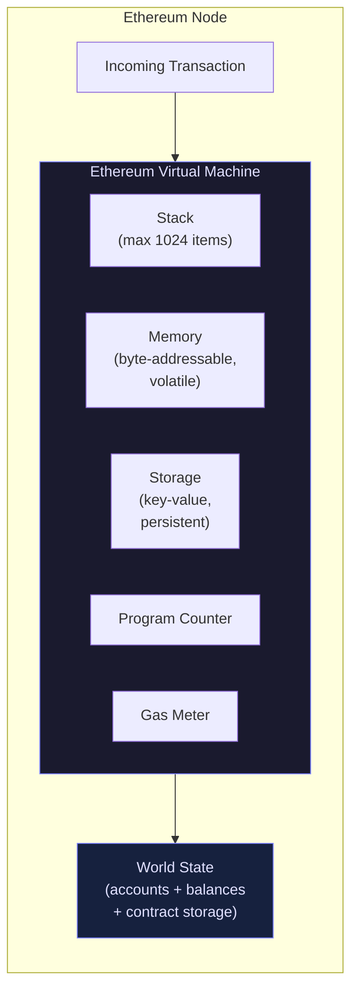
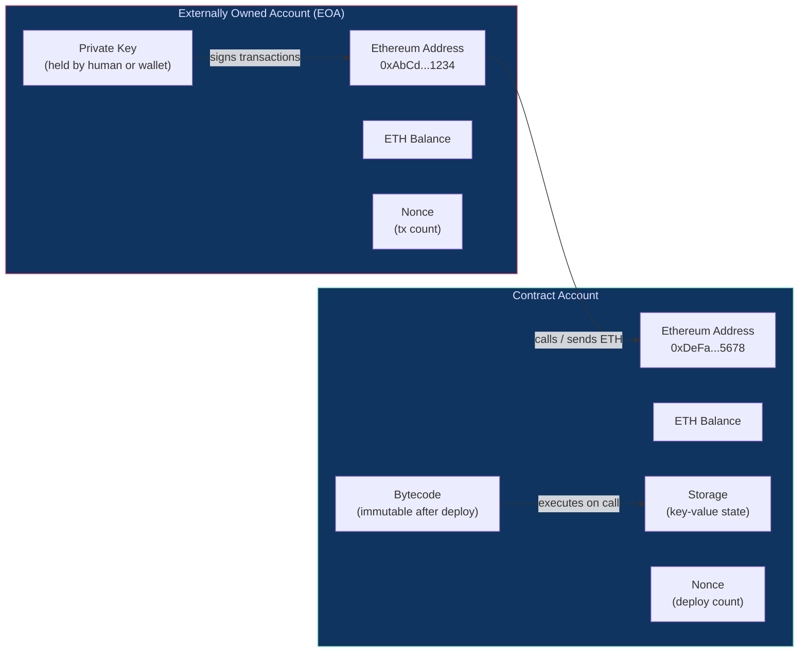

# 05 - Ethereum Explained

> **Target audience:** Developers new to Web3 who understand basic programming concepts but have never built on a blockchain before.

---

## Table of Contents

1. [Bitcoin vs Ethereum — Two Very Different Beasts](#1-bitcoin-vs-ethereum)
2. [The Ethereum Virtual Machine (EVM)](#2-the-ethereum-virtual-machine-evm)
3. [Accounts — Who Is on the Network?](#3-accounts)
4. [Ether (ETH) and Denominations](#4-ether-eth-and-denominations)
5. [The Ethereum Network — Nodes and Clients](#5-the-ethereum-network)
6. [The Ethereum Roadmap](#6-the-ethereum-roadmap)
7. [Layer 2 Solutions](#7-layer-2-solutions)
8. [Testnets — Practice Without Real Money](#8-testnets)
9. [Key Takeaways](#key-takeaways)
10. [Quiz](#quiz)

---

## 1. Bitcoin vs Ethereum

### Digital Gold vs Programmable World Computer

| | Bitcoin (BTC) | Ethereum (ETH) |
|---|---|---|
| Created | 2009 — Satoshi Nakamoto | 2015 — Vitalik Buterin et al. |
| Primary purpose | Store of value ("digital gold") | Programmable platform ("world computer") |
| Smart contracts | Very limited (Bitcoin Script) | Full Turing-complete programs |
| Block time | ~10 minutes | ~12 seconds |
| Supply cap | 21 million BTC (hard cap) | No hard cap (but issuance is managed) |
| Consensus (today) | Proof of Work | Proof of Stake (post-Merge) |

**Bitcoin** solved a single, elegant problem: how do two strangers transfer value over the internet without a bank? Every design decision in Bitcoin flows from that goal. Bitcoin Script, its scripting language, is deliberately limited — you can't write loops or complex logic. That limitation is a feature, not a bug. It keeps the network simple, auditable, and extremely hard to attack.

**Ethereum** asked a bolder question: what if the blockchain itself were a general-purpose computer? Instead of hard-coding one application (money transfers), Ethereum lets developers upload and run arbitrary programs called **smart contracts**. Once deployed, these programs run exactly as written — no company can take them down, alter them, or refuse to execute them.

Think of it this way:

- **Bitcoin** is a vending machine that only accepts and dispenses money.
- **Ethereum** is a vending machine that runs an App Store — anyone can publish an app, and the machine executes it trustlessly.

---

## 2. The Ethereum Virtual Machine (EVM)

### What Is It?

The **Ethereum Virtual Machine** is the sandboxed runtime environment that executes smart contract code on every Ethereum node. It is a stack-based virtual machine — similar in spirit to the Java Virtual Machine (JVM) or the .NET CLR, but designed specifically for a decentralised, adversarial environment.

Key properties of the EVM:

- **Deterministic** — given the same inputs, every node on the planet reaches the exact same output.
- **Isolated** — contract code cannot access the host machine's filesystem, network, or operating system.
- **Metered** — every operation costs a precise amount of **gas**, preventing infinite loops and ensuring fair resource pricing.
- **EVM-compatible** — dozens of other chains (Polygon, Binance Smart Chain, Avalanche C-Chain, Arbitrum, Optimism) implement the same specification, so Solidity code runs on all of them with minimal changes.

### The Global Computer Analogy

Imagine one single computer shared by eight billion people. No single person owns it. No single government controls it. It never goes offline. When you pay it to run a program, it runs exactly that program — forever, for anyone who asks.

That is Ethereum. Every node on the network holds a full copy of this computer's state and re-executes every transaction to verify correctness. The **EVM** is the CPU of that global computer.

### EVM Architecture Diagram



### How a Transaction Flows Through the EVM

1. A user signs a transaction and broadcasts it to the network.
2. Validators (miners, pre-Merge) pick it up and include it in a block.
3. Each node independently runs the transaction through its local EVM copy.
4. The EVM executes opcodes (ADD, MSTORE, CALL, etc.) one by one, decrementing the gas counter each time.
5. If gas runs out, execution reverts — state changes are rolled back, but the gas fee is still charged.
6. If execution succeeds, the resulting state change (new balances, updated contract storage) is written to the world state.
7. All nodes agree — consensus is reached.

---

## 3. Accounts

Ethereum has two fundamentally different types of accounts, and understanding the distinction is critical for every smart contract developer.

### Account Types Diagram



### Externally Owned Accounts (EOA)

An EOA is what most people think of as a "wallet." It is controlled by a **private key** held by a human (or a hardware device).

Characteristics:

- Has an ETH balance.
- Has a **nonce** — a counter that increments with every transaction, preventing replay attacks.
- Can initiate transactions (send ETH, deploy contracts, call contracts).
- Has **no code** attached to it.
- Address is derived from the public key via `keccak256(publicKey)[12:]`.

Examples: MetaMask, Ledger, a raw private key you generated with `ethers.js`.

### Contract Accounts

A Contract Account is created when a smart contract is deployed. Nobody holds a private key for it — it is controlled entirely by its code.

Characteristics:

- Has an ETH balance (contracts can hold and receive ETH).
- Has a **nonce** that increments when it deploys other contracts.
- Contains **bytecode** — the compiled version of your Solidity (or Vyper) program.
- Has **persistent storage** — a key-value store that survives between transactions.
- **Cannot initiate transactions on its own** — it only reacts to being called.

> **Key insight:** A contract is dormant until someone calls it. Think of it like a vending machine — it does nothing until you insert a coin (send a transaction).

### Address Format

Both account types share the same address format: a 20-byte (40 hex character) string prefixed with `0x`.

```
0x71C7656EC7ab88b098defB751B7401B5f6d8976F
```

---

## 4. Ether (ETH) and Denominations

**Ether (ETH)** is the native currency of Ethereum. It serves two roles:

1. **Payment for gas** — every computation on the network costs gas, and gas is paid in ETH.
2. **Store of value / collateral** — ETH is used as collateral in DeFi protocols, staked by validators, and traded as an asset.

### Denominations Table

Because smart contracts often deal in very small fractions of ETH, Ethereum uses smaller units. The smallest indivisible unit is **Wei**.

| Unit | Wei Value | Common Use |
|---|---|---|
| **Wei** | 1 Wei | Base unit, used in contract code |
| **Kwei** (Babbage) | 1,000 Wei | Rarely used |
| **Mwei** (Lovelace) | 1,000,000 Wei | Rarely used |
| **Gwei** (Shannon) | 1,000,000,000 Wei | **Gas prices** |
| **Szabo** (microether) | 1,000,000,000,000 Wei | Occasionally referenced |
| **Finney** (milliether) | 1,000,000,000,000,000 Wei | Occasionally referenced |
| **Ether** | 1,000,000,000,000,000,000 Wei | User-facing amounts |

> **Practical rule of thumb:**
> - You see **Wei** in Solidity contract code (`msg.value` is in Wei).
> - You see **Gwei** when reading gas prices (`baseFeePerGas`, `maxPriorityFeePerGas`).
> - You see **ETH** in wallets, exchanges, and human conversation.

### Quick Mental Math

```
1 ETH  = 10^18 Wei
1 Gwei = 10^9  Wei
1 ETH  = 10^9  Gwei
```

In Solidity:

```solidity
// Literal suffixes make unit conversions readable
uint256 gasPrice = 20 gwei;        // 20_000_000_000 Wei
uint256 oneEther = 1 ether;        // 1_000_000_000_000_000_000 Wei
require(msg.value >= 0.01 ether, "Minimum payment not met");
```

---

## 5. The Ethereum Network

### Nodes

Every participant that downloads the blockchain and independently validates transactions is a **node**. Nodes are the backbone of Ethereum's decentralisation. There are several types:

- **Full node** — downloads every block and re-executes every transaction. Stores the current state but may prune old history. Most common type for developers and validators.
- **Archive node** — stores the full historical state at every block height. Required for querying historical balances or debugging old transactions. Very large (multiple terabytes).
- **Light node** — downloads only block headers and trusts full nodes for state data. Used in resource-constrained environments (mobile).

### Clients

An Ethereum client is the software that runs a node. Because Ethereum has an open specification, multiple independent teams have built their own clients. This **client diversity** is a security feature — a bug in one client does not crash the entire network.

Ethereum now has two layers that work together — the **execution layer** (EL, formerly "Eth1") and the **consensus layer** (CL, formerly "Eth2 beacon chain"). You need one client from each:

**Execution Layer Clients**

| Client | Language | Notes |
|---|---|---|
| **Geth** (go-ethereum) | Go | Most widely used; reference implementation |
| **Besu** | Java | Enterprise-focused; EVM tracing support |
| **Nethermind** | C# / .NET | High performance, good for validators |
| **Erigon** | Go | Optimised for archive nodes; smaller footprint |
| **Reth** | Rust | Newer, very fast; growing adoption |

**Consensus Layer Clients**

| Client | Language | Notes |
|---|---|---|
| **Lighthouse** | Rust | Popular with solo stakers |
| **Prysm** | Go | Largest market share; user-friendly |
| **Teku** | Java | Enterprise grade; ConsenSys-maintained |
| **Nimbus** | Nim | Lightweight, good for low-power hardware |
| **Lodestar** | TypeScript | Unique for its JS ecosystem familiarity |

> **For most developers:** You will not run your own node day-to-day. Instead you will connect to a **node provider** (Alchemy, Infura, QuickNode) via JSON-RPC. Understanding nodes matters so you know what's happening under the hood.

---

## 6. The Ethereum Roadmap

Ethereum's development is ongoing and follows a long-term vision. Here are the key milestones that shaped the network you use today:

| Milestone | Year | What Changed |
|---|---|---|
| **Frontier** | 2015 | Ethereum mainnet launch; basic functionality |
| **Homestead** | 2016 | First production-ready release; stability improvements |
| **The DAO Fork** | 2016 | Hard fork to recover ~$60M from a hacked DAO contract; Ethereum Classic (ETC) split off |
| **Byzantium / Constantinople** | 2017–2019 | EVM improvements, cheaper operations, zkSNARK precompiles |
| **Istanbul** | 2019 | Gas cost repricing for EVM opcodes |
| **Berlin / London (EIP-1559)** | 2021 | EIP-1559 introduced base fee burning — a major change to fee mechanics |
| **The Merge** | Sep 2022 | Ethereum switched from Proof of Work to Proof of Stake; energy use dropped ~99.95% |
| **Shanghai / Capella** | Apr 2023 | Enabled staked ETH withdrawals from the beacon chain |
| **Dencun (EIP-4844)** | Mar 2024 | "Proto-danksharding" — blob transactions that dramatically reduce L2 fees |

**What is coming next (as of mid-2026):**

- **Pectra** — validator UX improvements, account abstraction groundwork (EIP-7702), higher blob counts.
- **Fusaka / Glamsterdam** — full Danksharding (verkle trees, PeerDAS), further scaling the blob lane.
- **The Purge** — simplifying the protocol by removing historical data requirements from nodes.

---

## 7. Layer 2 Solutions

### Why L2 Exists

Ethereum mainnet (L1) is intentionally designed to optimise for **security and decentralisation**, not raw throughput. This means:

- Transactions are slow (~12 second block times).
- Block space is limited.
- Gas fees rise sharply during congestion.

**Layer 2 (L2)** solutions process transactions off the main chain in batches, then post compressed proofs or data back to L1. You get Ethereum's security guarantees at a fraction of the cost and with much higher throughput.

### Main L2 Flavours

**Optimistic Rollups** — assume transactions are valid by default and only run full computation if someone submits a fraud proof within a challenge window (~7 days).

**ZK Rollups** — generate a cryptographic validity proof (ZK-SNARK or ZK-STARK) for every batch. No challenge window; near-instant finality on L1.

### Major L2 Networks

| Network | Type | Notes |
|---|---|---|
| **Arbitrum One** | Optimistic Rollup | Largest TVL among L2s; EVM-compatible |
| **Optimism (OP Mainnet)** | Optimistic Rollup | Powers the "Superchain" (Base, Mode, Zora); OP Stack |
| **Base** | Optimistic Rollup | Built by Coinbase on OP Stack; very high adoption |
| **Polygon PoS** | Sidechain + zk-bridge | Established; transitioning toward zkEVM |
| **Polygon zkEVM** | ZK Rollup | EVM-equivalent; uses STARK proofs |
| **zkSync Era** | ZK Rollup | Native account abstraction; zkEVM |
| **Starknet** | ZK Rollup | Uses Cairo language; not EVM-equivalent |
| **Linea** | ZK Rollup | ConsenSys; Ethereum-equivalent |

> **For Solidity developers:** Arbitrum, Optimism, Base, and Polygon are EVM-compatible or EVM-equivalent. Your Solidity contracts deploy to them with zero or minimal changes. Just switch your RPC URL and chain ID.

---

## 8. Testnets — Practice Without Real Money

### What Is a Testnet?

A **testnet** is a parallel Ethereum network that mimics mainnet behaviour but uses **valueless test ETH**. It is where you deploy, test, and debug your contracts before spending real money on mainnet.

Testnet ETH is obtained for free from **faucets** — websites that drip small amounts of test ETH to your address on request.

### Current Testnets

| Testnet | Status | Notes |
|---|---|---|
| **Sepolia** | Active (recommended) | PoS-based; fast; primary developer testnet since 2023 |
| **Holesky** | Active | High validator count; useful for staking/validator testing |
| **Goerli** | Deprecated | Was the dominant testnet until 2023; being wound down |

> **Use Sepolia for all new projects.** Goerli is being deprecated and may be unreliable. Holesky is specifically for staking infrastructure testing.

### Why You Must Test on Testnets First

1. **Contracts are immutable** — once deployed to mainnet you cannot change them (only upgrade via proxy patterns).
2. **Gas fees are real money** — a buggy deployment can waste hundreds of dollars.
3. **You can simulate real network conditions** — block times, reorgs, and MEV behaviour are present on testnets.

### Getting Testnet ETH

- **Sepolia faucet:** https://sepoliafaucet.com (Alchemy)
- **Chainlink faucet:** https://faucets.chain.link/sepolia
- **Google Cloud faucet:** https://cloud.google.com/application/web3/faucet/ethereum/sepolia

Most faucets require a mainnet balance or social verification to prevent abuse.

---

## Key Takeaways

- Ethereum is a **programmable blockchain** — unlike Bitcoin, it can run arbitrary code via smart contracts.
- The **EVM** is the global, deterministic, metered runtime that executes every smart contract identically across all nodes.
- There are two account types: **EOAs** (controlled by private keys) and **Contract Accounts** (controlled by code). Both can hold ETH.
- ETH's base unit is **Wei**. Gas prices are expressed in **Gwei**. User-facing amounts use **ETH**.
- Ethereum runs on a network of independent **nodes** running **execution clients** (Geth, Besu, Nethermind) paired with **consensus clients** (Lighthouse, Prysm, Teku).
- The **Merge** (2022) switched Ethereum to Proof of Stake, slashing energy usage by ~99.95%.
- **Layer 2s** (Arbitrum, Optimism, Base, Polygon) make Ethereum cheaper and faster by batching transactions off-chain and settling on L1.
- Always develop and test on **Sepolia testnet** before touching mainnet.

---

## Quiz

Test your understanding before moving on.

**Question 1**

You are reading a Solidity contract and see this line:

```solidity
require(msg.value >= 500000000000000000, "Too low");
```

What is the minimum payment required, expressed in ETH?

<details>
<summary>Answer</summary>

`500000000000000000 Wei = 0.5 ETH`

(Divide by 10^18: 5 * 10^17 / 10^18 = 0.5)

A cleaner way to write this in Solidity: `require(msg.value >= 0.5 ether, "Too low");`

</details>

---

**Question 2**

A colleague deploys a smart contract to Ethereum mainnet and then realises there is a critical bug. They ask you: "Can we just update the contract to fix it?"

What do you tell them, and what are the options?

<details>
<summary>Answer</summary>

Contract bytecode is **immutable** — you cannot change code that has already been deployed.

Options:
1. **Deploy a new contract** at a different address and migrate users/funds to it.
2. **Use a proxy upgrade pattern** (OpenZeppelin Transparent Proxy or UUPS) — if the original contract was built with upgradeability in mind, you can point the proxy to a new implementation. This only works if the proxy was set up in advance.
3. If no proxy was used and funds are at risk: the situation may be unrecoverable without a social consensus / hard fork (as seen in The DAO incident in 2016 — a rare and controversial precedent).

**Lesson:** always use testnets, audits, and upgrade patterns from day one.

</details>

---

**Question 3**

What is the difference between an Optimistic Rollup and a ZK Rollup? Name one example of each.

<details>
<summary>Answer</summary>

**Optimistic Rollup** — assumes all transactions are valid and only triggers a fraud proof challenge if a validator disputes a batch within the challenge window (~7 days). This means withdrawals from L2 to L1 can take up to 7 days without a liquidity bridge.

Examples: **Arbitrum One**, **Optimism (OP Mainnet)**, **Base**

**ZK Rollup** — generates a cryptographic validity proof (ZK-SNARK / ZK-STARK) for every batch. The proof mathematically guarantees correctness, so no challenge window is needed. Withdrawals can be near-instant on L1.

Examples: **zkSync Era**, **Polygon zkEVM**, **Starknet**, **Linea**

Trade-off: ZK Rollups are computationally heavier to generate proofs but offer faster finality. Optimistic Rollups are simpler to implement and fully EVM-compatible.

</details>

---

> **Next chapter:** 06 - Smart Contracts Deep Dive — anatomy of a Solidity contract, the compilation pipeline, and your first deployment.
