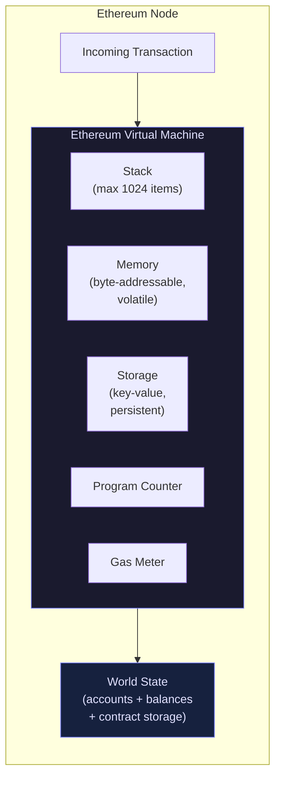
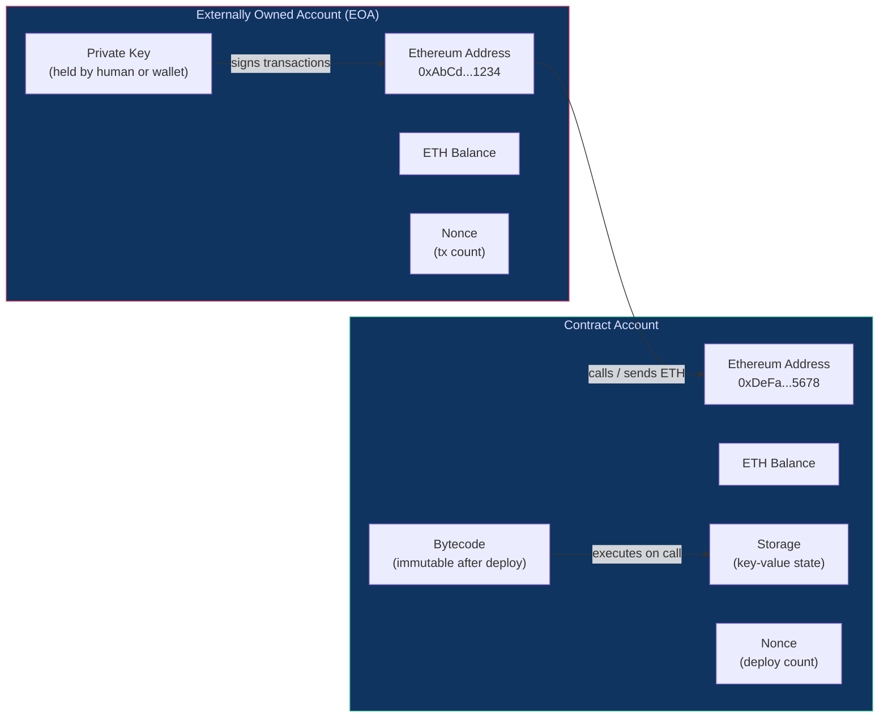

# 05 - Ethereum Explained

> **Kiske liye hai:** Woh developers jo Web3 mein naye hain, basic programming aata hai, lekin blockchain pe kabhi kuch build nahi kiya.

---

## Table of Contents

1. [Bitcoin vs Ethereum — Do Bilkul Alag Janwar](#1-bitcoin-vs-ethereum)
2. [The Ethereum Virtual Machine (EVM)](#2-the-ethereum-virtual-machine-evm)
3. [Accounts — Network Pe Kaun Kaun Hai?](#3-accounts)
4. [Ether (ETH) and Denominations](#4-ether-eth-and-denominations)
5. [The Ethereum Network — Nodes and Clients](#5-the-ethereum-network)
6. [The Ethereum Roadmap](#6-the-ethereum-roadmap)
7. [Layer 2 Solutions](#7-layer-2-solutions)
8. [Testnets — Bina Real Paisa Ganwaye Practice](#8-testnets)
9. [Key Takeaways](#key-takeaways)
10. [Quiz](#quiz)

---

## 1. Bitcoin vs Ethereum

### Digital Gold vs Programmable World Computer

| | Bitcoin (BTC) | Ethereum (ETH) |
|---|---|---|
| Bana kab | 2009 — Satoshi Nakamoto | 2015 — Vitalik Buterin aur team |
| Main kaam | Value store karna ("digital sona") | Programmable platform ("world computer") |
| Smart contracts | Bahut limited (Bitcoin Script) | Poora Turing-complete programs |
| Block time | ~10 minute | ~12 second |
| Supply cap | 21 million BTC (fixed) | Koi hard cap nahi (lekin issuance manage hota hai) |
| Consensus (aaj) | Proof of Work | Proof of Stake (Merge ke baad) |

**Bitcoin** ne ek hi problem solve ki, aur bahut elegant tareeke se: do ajnabi log bina bank ke internet pe paisa kaise bhejein? Bitcoin ka har design decision isi goal se nikalta hai. Bitcoin Script, uski scripting language, jaan-boojh kar limited rakhi gayi hai — usme loops ya complex logic nahi likh sakte. Ye limitation koi bug nahi, feature hai. Isse network simple, auditable, aur attack karna bohot mushkil ban jaata hai.

**Ethereum** ne ek zyada bada sawaal poocha: agar blockchain hi ek general-purpose computer ho jaaye toh? Sirf ek application (paisa transfer) hardcode karne ke bajaye, Ethereum developers ko apne arbitrary programs upload aur run karne deta hai — inhe **smart contracts** kehte hain. Ek baar deploy hone ke baad, ye programs bilkul waise hi chalte hain jaise likhe gaye the — koi company inhe band nahi kar sakti, badal nahi sakti, ya chalane se mana nahi kar sakti.

Isko aise socho:

- **Bitcoin** ek vending machine hai jo sirf paisa leta aur deta hai.
- **Ethereum** ek vending machine hai jispe poora App Store chal raha hai — koi bhi apna app publish kar sakta hai, aur machine usse trustlessly execute karti hai.

---

## 2. The Ethereum Virtual Machine (EVM)

### Ye Hai Kya?

**Ethereum Virtual Machine (EVM)** ek sandboxed runtime environment hai jo har Ethereum node pe smart contract code execute karta hai. Ye ek stack-based virtual machine hai — kuch-kuch Java Virtual Machine (JVM) ya .NET CLR jaisa, lekin specifically ek decentralised, adversarial environment ke liye banaya gaya hai.

EVM ki key properties:

- **Deterministic** — same input do, duniya ke har node pe exact same output milega.
- **Isolated** — contract code host machine ki filesystem, network, ya OS ko touch nahi kar sakta.
- **Metered** — har operation ki ek fix **gas** cost hoti hai, jisse infinite loops rukte hain aur resource pricing fair rehti hai.
- **EVM-compatible** — bahut saari dusri chains (Polygon, Binance Smart Chain, Avalanche C-Chain, Arbitrum, Optimism) same specification implement karti hain, isliye Solidity code in sab pe minimal changes ke saath chal jaata hai.

### Global Computer Wala Analogy

Socho ek hi computer hai jo 8 billion logon ne share kiya hua hai. Iska ek bhi owner nahi hai. Koi ek government control nahi karti. Ye kabhi offline nahi jaata. Jab tum isse paisa dekar ek program run karne ko kehte ho, ye exactly wahi program run karta hai — hamesha ke liye, jo bhi poochhe uske liye.

Yehi Ethereum hai. Network ka har node is computer ki poori state ki copy rakhta hai aur correctness verify karne ke liye har transaction dobara execute karta hai. **EVM** us global computer ka CPU hai.

### EVM Architecture Diagram



### Ek Transaction EVM Se Kaise Guzarta Hai

1. User ek transaction sign karke network pe broadcast karta hai.
2. Validators (pehle miners the, Merge se pehle) usse pick karke ek block mein daalte hain.
3. Har node independently us transaction ko apne local EVM copy mein run karta hai.
4. EVM opcodes (ADD, MSTORE, CALL, waghera) ek-ek karke execute karta hai, aur har baar gas counter kam hota jaata hai.
5. Agar gas khatam ho jaaye, execution revert ho jaata hai — state changes wapas roll back ho jaate hain, lekin gas fee phir bhi charge hoti hai.
6. Agar execution successful raha, resulting state change (naye balances, updated contract storage) world state mein likh diya jaata hai.
7. Sab nodes agree karte hain — consensus achieve ho jaata hai.

---

## 3. Accounts

Ethereum pe do fundamentally alag types ke accounts hote hain, aur inka fark samajhna har smart contract developer ke liye zaruri hai.

### Account Types Diagram



### Externally Owned Accounts (EOA)

EOA wahi hai jise zyadatar log "wallet" bolte hain. Ye ek **private key** se control hota hai jo kisi insaan (ya hardware device) ke paas hoti hai.

Iski khasiyat:

- Iska ETH balance hota hai.
- Iska ek **nonce** hota hai — ek counter jo har transaction ke saath badhta hai, isse replay attacks rukte hain.
- Ye transactions initiate kar sakta hai (ETH bhejna, contracts deploy karna, contracts call karna).
- Isme **koi code nahi** hota.
- Address public key se nikalta hai `keccak256(publicKey)[12:]` formula se.

Examples: MetaMask, Ledger, ya woh raw private key jo tumne `ethers.js` se generate ki.

### Contract Accounts

Contract Account tab banta hai jab koi smart contract deploy hota hai. Iski koi private key nahi hoti — ye poori tarah apne code se control hota hai.

Iski khasiyat:

- Iska ETH balance hota hai (contracts ETH hold aur receive kar sakte hain).
- Iska ek **nonce** hota hai jo tab badhta hai jab ye khud koi aur contract deploy karta hai.
- Isme **bytecode** hota hai — tumhare Solidity (ya Vyper) program ka compiled version.
- Isme **persistent storage** hoti hai — ek key-value store jo transactions ke beech mein bhi survive karti hai.
- **Ye khud transaction initiate nahi kar sakta** — ye sirf tab react karta hai jab isse call kiya jaaye.

> **Key insight:** Contract tab tak sota rehta hai jab tak koi usse call na kare. Isko vending machine jaisa samjho — jab tak tum coin (transaction) daalte nahi, ye kuch nahi karta.

### Address Format

Dono account types ka address format same hota hai: 20-byte (40 hex character) ka string jiske aage `0x` lagta hai.

```
0x71C7656EC7ab88b098defB751B7401B5f6d8976F
```

---

## 4. Ether (ETH) and Denominations

**Ether (ETH)** Ethereum ki native currency hai. Ye do roles play karti hai:

1. **Gas ka payment** — network pe har computation ki gas cost hoti hai, aur gas ETH mein hi pay hota hai.
2. **Value store / collateral** — ETH DeFi protocols mein collateral ke roop mein use hoti hai, validators stake karte hain, aur ye ek asset ki tarah trade bhi hoti hai.

### Denominations Table

Kyunki smart contracts aksar ETH ke bahut chote fractions mein deal karte hain, Ethereum chote units use karta hai. Sabse chota, indivisible unit hai **Wei**.

| Unit | Wei Value | Kahan Use Hota Hai |
|---|---|---|
| **Wei** | 1 Wei | Base unit, contract code mein use hota hai |
| **Kwei** (Babbage) | 1,000 Wei | Kam hi use hota hai |
| **Mwei** (Lovelace) | 1,000,000 Wei | Kam hi use hota hai |
| **Gwei** (Shannon) | 1,000,000,000 Wei | **Gas prices** ke liye |
| **Szabo** (microether) | 1,000,000,000,000 Wei | Kabhi-kabhi reference hota hai |
| **Finney** (milliether) | 1,000,000,000,000,000 Wei | Kabhi-kabhi reference hota hai |
| **Ether** | 1,000,000,000,000,000,000 Wei | User-facing amounts ke liye |

> **Practical rule of thumb:**
> - **Wei** tumhe Solidity contract code mein dikhega (`msg.value` Wei mein hota hai).
> - **Gwei** tumhe gas prices padhte waqt dikhega (`baseFeePerGas`, `maxPriorityFeePerGas`).
> - **ETH** tumhe wallets, exchanges, aur normal baatcheet mein dikhega.

### Quick Mental Math

```
1 ETH  = 10^18 Wei
1 Gwei = 10^9  Wei
1 ETH  = 10^9  Gwei
```

Solidity mein:

```solidity
// Literal suffixes se unit conversions readable ho jaate hain
uint256 gasPrice = 20 gwei;        // 20_000_000_000 Wei
uint256 oneEther = 1 ether;        // 1_000_000_000_000_000_000 Wei
require(msg.value >= 0.01 ether, "Minimum payment not met");
```

---

## 5. The Ethereum Network

### Nodes

Har wo participant jo blockchain download karke independently transactions validate karta hai, ek **node** kehlata hai. Nodes hi Ethereum ki decentralisation ka backbone hain. Inke kai types hain:

- **Full node** — har block download karta hai aur har transaction dobara execute karta hai. Current state store karta hai, lekin purani history prune kar sakta hai. Developers aur validators ke liye sabse common type.
- **Archive node** — har block height pe poori historical state store karta hai. Purane balances query karne ya purani transactions debug karne ke liye zaruri. Bahut bada hota hai (multiple terabytes).
- **Light node** — sirf block headers download karta hai aur state data ke liye full nodes pe trust karta hai. Resource-constrained environments (mobile) mein use hota hai.

### Clients

Ethereum client woh software hai jo node chalata hai. Kyunki Ethereum ka specification open hai, kai independent teams ne apne-apne clients bana liye hain. Ye **client diversity** ek security feature hai — agar ek client mein bug aa jaaye toh poora network crash nahi hota.

Ab Ethereum ke do layers milkar kaam karte hain — **execution layer** (EL, pehle "Eth1" kehlata tha) aur **consensus layer** (CL, pehle "Eth2 beacon chain"). Tumhe har layer se ek-ek client chahiye:

**Execution Layer Clients**

| Client | Language | Notes |
|---|---|---|
| **Geth** (go-ethereum) | Go | Sabse zyada use hota hai; reference implementation |
| **Besu** | Java | Enterprise-focused; EVM tracing support |
| **Nethermind** | C# / .NET | High performance, validators ke liye achha |
| **Erigon** | Go | Archive nodes ke liye optimised; chhota footprint |
| **Reth** | Rust | Naya, bahut fast; adoption badh raha hai |

**Consensus Layer Clients**

| Client | Language | Notes |
|---|---|---|
| **Lighthouse** | Rust | Solo stakers mein popular |
| **Prysm** | Go | Sabse bada market share; user-friendly |
| **Teku** | Java | Enterprise grade; ConsenSys maintain karta hai |
| **Nimbus** | Nim | Lightweight, low-power hardware ke liye achha |
| **Lodestar** | TypeScript | JS ecosystem familiarity ke liye unique |

> **Zyadatar developers ke liye:** Roz-roz apna node run nahi karoge. Uski jagah tum ek **node provider** (Alchemy, Infura, QuickNode) se JSON-RPC ke zariye connect karoge. Nodes samajhna isliye zaruri hai taaki tumhe pata rahe ki peeche kya ho raha hai — jaise Zomato app use karte waqt tumhe kitchen ka process pata na ho, phir bhi jaanna helpful hota hai.

---

## 6. The Ethereum Roadmap

Ethereum ka development chal raha hai aur ek long-term vision follow karta hai. Yahan wo key milestones hain jinhone aaj wala network banaya:

| Milestone | Year | Kya Badla |
|---|---|---|
| **Frontier** | 2015 | Ethereum mainnet launch; basic functionality |
| **Homestead** | 2016 | Pehla production-ready release; stability improvements |
| **The DAO Fork** | 2016 | Hack hue DAO contract se ~$60M recover karne ke liye hard fork; Ethereum Classic (ETC) alag ho gaya |
| **Byzantium / Constantinople** | 2017–2019 | EVM improvements, sasti operations, zkSNARK precompiles |
| **Istanbul** | 2019 | EVM opcodes ki gas cost repricing |
| **Berlin / London (EIP-1559)** | 2021 | EIP-1559 laaya base fee burning — fee mechanics mein bada change |
| **The Merge** | Sep 2022 | Ethereum Proof of Work se Proof of Stake pe switch hua; energy use ~99.95% kam ho gaya |
| **Shanghai / Capella** | Apr 2023 | Staked ETH ko beacon chain se withdraw karna possible hua |
| **Dencun (EIP-4844)** | Mar 2024 | "Proto-danksharding" — blob transactions jo L2 fees kaafi kam kar dete hain |

**Aage kya aa raha hai (mid-2026 tak):**

- **Pectra** — validator UX improvements, account abstraction ki groundwork (EIP-7702), zyada blob counts.
- **Fusaka / Glamsterdam** — full Danksharding (verkle trees, PeerDAS), blob lane ko aur scale karna.
- **The Purge** — nodes se historical data requirements hata kar protocol simplify karna.

---

## 7. Layer 2 Solutions

### L2 Kyun Zaruri Hai?

Ethereum mainnet (L1) jaan-boojh kar **security aur decentralisation** ke liye optimise kiya gaya hai, raw throughput ke liye nahi. Iska matlab:

- Transactions slow hain (~12 second block times).
- Block space limited hai.
- Congestion mein gas fees tezi se badh jaate hain.

**Layer 2 (L2)** solutions transactions ko main chain se hatkar batches mein process karte hain, phir compressed proofs ya data wapas L1 pe post kar dete hain. Isse tumhe Ethereum ki security milti hai, lekin bahut kam cost aur bahut zyada throughput ke saath — bilkul waise jaise IRCTC ka tatkal counter alag rakh dena taaki main system slow na ho, par ticket phir bhi valid rahe.

### Main L2 Flavours

**Optimistic Rollups** — by default maan lete hain ki transactions valid hain, aur sirf tab poora computation run karte hain jab koi challenge window (~7 din) ke andar fraud proof submit kare.

**ZK Rollups** — har batch ke liye ek cryptographic validity proof (ZK-SNARK ya ZK-STARK) generate karte hain. Koi challenge window nahi chahiye; L1 pe near-instant finality milti hai.

### Major L2 Networks

| Network | Type | Notes |
|---|---|---|
| **Arbitrum One** | Optimistic Rollup | L2s mein sabse bada TVL; EVM-compatible |
| **Optimism (OP Mainnet)** | Optimistic Rollup | "Superchain" (Base, Mode, Zora) chalata hai; OP Stack |
| **Base** | Optimistic Rollup | Coinbase ne OP Stack pe banaya; bahut high adoption |
| **Polygon PoS** | Sidechain + zk-bridge | Established; zkEVM ki taraf transition kar raha hai |
| **Polygon zkEVM** | ZK Rollup | EVM-equivalent; STARK proofs use karta hai |
| **zkSync Era** | ZK Rollup | Native account abstraction; zkEVM |
| **Starknet** | ZK Rollup | Cairo language use karta hai; EVM-equivalent nahi hai |
| **Linea** | ZK Rollup | ConsenSys; Ethereum-equivalent |

> **Solidity developers ke liye:** Arbitrum, Optimism, Base, aur Polygon EVM-compatible ya EVM-equivalent hain. Tumhare Solidity contracts inpe zero ya minimal changes ke saath deploy ho jaate hain. Bas apna RPC URL aur chain ID switch karo.

---

## 8. Testnets — Bina Real Paisa Ganwaye Practice

### Testnet Hota Kya Hai?

**Testnet** ek parallel Ethereum network hai jo mainnet jaisa hi behave karta hai, lekin **valueless test ETH** use karta hai. Yahin tum apne contracts deploy, test, aur debug karte ho, mainnet pe real paisa lagane se pehle.

Testnet ETH tumhe **faucets** se free mein milta hai — ye websites request karne pe tumhare address pe thoda-thoda test ETH bhej deti hain.

### Current Testnets

| Testnet | Status | Notes |
|---|---|---|
| **Sepolia** | Active (recommended) | PoS-based; fast; 2023 se primary developer testnet |
| **Holesky** | Active | High validator count; staking/validator testing ke liye useful |
| **Goerli** | Deprecated | 2023 tak dominant testnet tha; ab band ho raha hai |

> **Naye projects ke liye Sepolia use karo.** Goerli deprecate ho raha hai aur unreliable ho sakta hai. Holesky specifically staking infrastructure testing ke liye hai.

### Testnets Pe Test Karna Kyun Zaruri Hai

1. **Contracts immutable hote hain** — ek baar mainnet pe deploy karne ke baad tum unhe badal nahi sakte (sirf proxy patterns se upgrade kar sakte ho).
2. **Gas fees real paisa hai** — ek buggy deployment sau-do sau dollar barbaad kar sakti hai.
3. **Tum real network conditions simulate kar sakte ho** — block times, reorgs, aur MEV behaviour testnets pe bhi present hote hain.

### Testnet ETH Kaise Lo

- **Sepolia faucet:** https://sepoliafaucet.com (Alchemy)
- **Chainlink faucet:** https://faucets.chain.link/sepolia
- **Google Cloud faucet:** https://cloud.google.com/application/web3/faucet/ethereum/sepolia

Zyadatar faucets abuse rokne ke liye mainnet balance ya social verification maangte hain.

---

## Key Takeaways

- Ethereum ek **programmable blockchain** hai — Bitcoin ke ulat, ye smart contracts ke zariye arbitrary code run kar sakta hai.
- **EVM** woh global, deterministic, metered runtime hai jo har smart contract ko sab nodes pe bilkul same tarike se execute karta hai.
- Do account types hote hain: **EOAs** (private keys se control hote hain) aur **Contract Accounts** (code se control hote hain). Dono ETH hold kar sakte hain.
- ETH ka base unit **Wei** hai. Gas prices **Gwei** mein expressed hote hain. User-facing amounts **ETH** mein hote hain.
- Ethereum independent **nodes** ke network pe chalta hai, jo **execution clients** (Geth, Besu, Nethermind) ko **consensus clients** (Lighthouse, Prysm, Teku) ke saath pair karke run karte hain.
- **The Merge** (2022) ne Ethereum ko Proof of Stake pe switch kiya, energy usage ~99.95% kam kar diya.
- **Layer 2s** (Arbitrum, Optimism, Base, Polygon) transactions ko off-chain batch karke aur L1 pe settle karke Ethereum ko sasta aur fast banate hain.
- Mainnet touch karne se pehle hamesha **Sepolia testnet** pe develop aur test karo.

---

## Quiz

Aage badhne se pehle apni samajh test karo.

**Question 1**

Tum ek Solidity contract padh rahe ho aur ye line dikhti hai:

```solidity
require(msg.value >= 500000000000000000, "Too low");
```

Minimum payment kitna hai, ETH mein?

<details>
<summary>Answer</summary>

`500000000000000000 Wei = 0.5 ETH`

(10^18 se divide karo: 5 * 10^17 / 10^18 = 0.5)

Isse Solidity mein zyada clean tarike se likhne ka tareeka: `require(msg.value >= 0.5 ether, "Too low");`

</details>

---

**Question 2**

Tumhara ek colleague Ethereum mainnet pe ek smart contract deploy karta hai aur phir usse pata chalta hai ki usme ek critical bug hai. Woh tumse poochta hai: "Kya hum bas contract update karke fix kar sakte hain?"

Tum use kya bologe, aur options kya hain?

<details>
<summary>Answer</summary>

Contract bytecode **immutable** hota hai — jo code deploy ho chuka hai usse badal nahi sakte.

Options:
1. **Naya contract deploy karo** ek alag address pe aur users/funds ko usme migrate karo.
2. **Proxy upgrade pattern use karo** (OpenZeppelin Transparent Proxy ya UUPS) — agar original contract shuru se upgradeability ke saath banaya gaya tha, toh proxy ko naye implementation pe point kar sakte ho. Ye tabhi kaam karega jab proxy pehle se set up ho.
3. Agar proxy use nahi hua tha aur funds risk mein hain: situation bina social consensus / hard fork ke unrecoverable ho sakti hai (jaise 2016 ke The DAO incident mein dekha gaya — ek rare aur controversial precedent).

**Lesson:** din 1 se hi testnets, audits, aur upgrade patterns use karo.

</details>

---

**Question 3**

Optimistic Rollup aur ZK Rollup mein kya fark hai? Har ek ka ek example do.

<details>
<summary>Answer</summary>

**Optimistic Rollup** — maan leta hai ki sab transactions valid hain, aur sirf tab fraud proof challenge trigger hota hai jab koi validator challenge window (~7 din) ke andar ek batch dispute kare. Iska matlab L2 se L1 withdrawals bina liquidity bridge ke 7 din tak le sakte hain.

Examples: **Arbitrum One**, **Optimism (OP Mainnet)**, **Base**

**ZK Rollup** — har batch ke liye ek cryptographic validity proof (ZK-SNARK / ZK-STARK) generate karta hai. Proof mathematically correctness guarantee karta hai, isliye koi challenge window nahi chahiye. Withdrawals L1 pe near-instant ho sakte hain.

Examples: **zkSync Era**, **Polygon zkEVM**, **Starknet**, **Linea**

Trade-off: ZK Rollups mein proofs generate karna computationally heavy hota hai, lekin finality fast milti hai. Optimistic Rollups implement karna simpler hai aur fully EVM-compatible hote hain.

</details>

---

> **Next chapter:** 06 - Smart Contracts Deep Dive — Solidity contract ki anatomy, compilation pipeline, aur tumhara pehla deployment.
