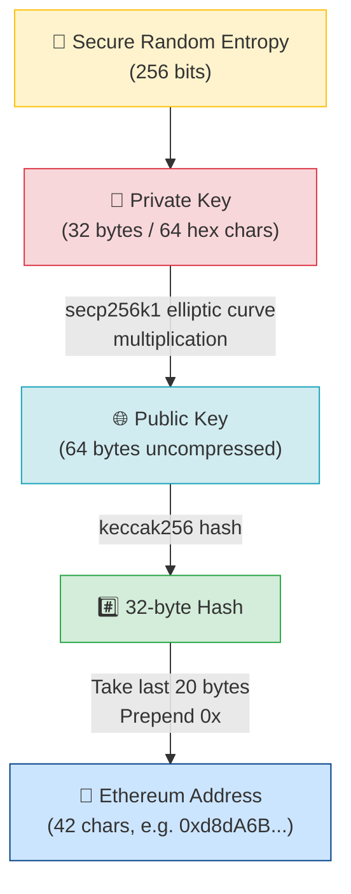
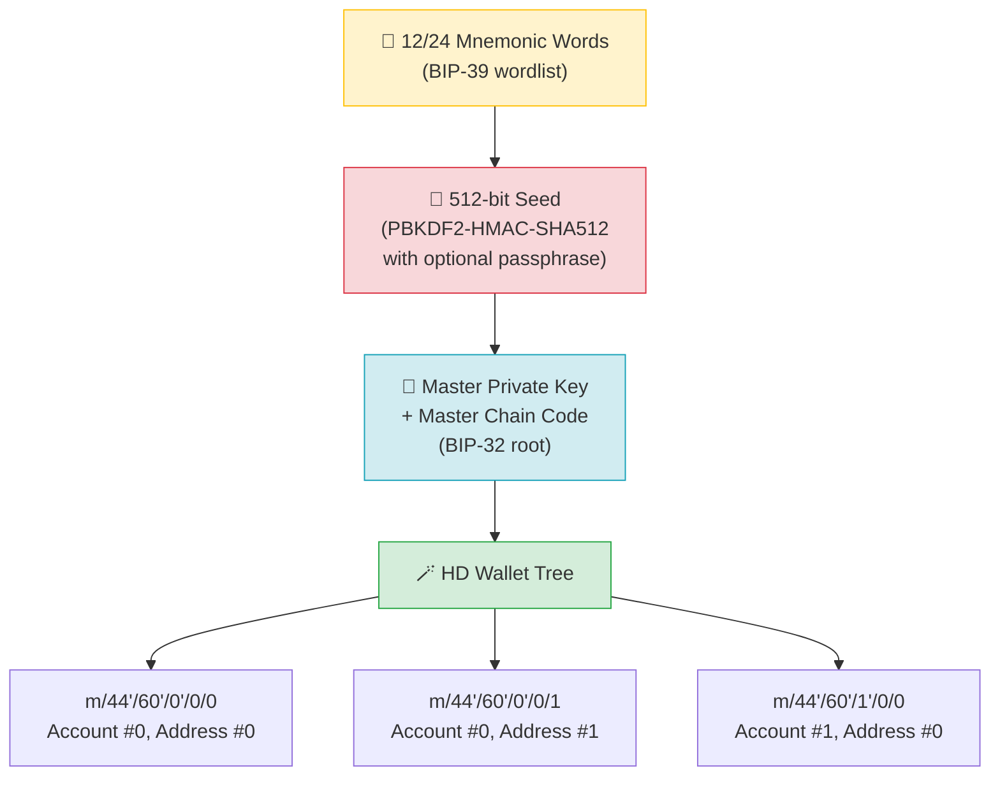

# 🔑 Chapter 06: Wallets and Keys

> **Target audience:** Developers jo Web3 mein naye hain — coding aati hai, lekin crypto pehli baar touch kar rahe ho.
> **Goal:** Samjho ki Ethereum mein cryptographic identity kaise kaam karti hai — raw randomness se lekar MetaMask ke address tak.

---

## 📖 Table of Contents

1. [The Big Misconception: Wallets Don't Store Coins](#the-big-misconception)
2. [Private Keys — The Root of Everything](#private-keys)
3. [Public Keys — Your Shareable Identity](#public-keys)
4. [Wallet Addresses — The Shortened Public Face](#wallet-addresses)
5. [BIP-39 Seed Phrases — One Backup to Rule Them All](#bip-39-seed-phrases)
6. [HD Wallets and Derivation Paths](#hd-wallets)
7. [Types of Wallets](#types-of-wallets)
8. [MetaMask Setup Walkthrough](#metamask-setup)
9. [Checksum Addresses (EIP-55)](#checksum-addresses)
10. [Key Takeaways](#key-takeaways)
11. [Quiz](#quiz)

---

## 🧩 The Big Misconception: Wallets Don't Store Coins {#the-big-misconception}

Sabse pehle ek mental model clear kar lo, kyunki yeh poori Web3 samajhne ki neev hai:

> **Crypto wallet cryptocurrency store NAHI karta. Woh sirf cryptographic keys store karta hai.**

Tumhara ETH, tokens, NFTs — sab blockchain pe rehte hain, ek global database jo duniya bhar ke hazaaron nodes pe replicate hota hai. Koi bhi tumhare coins ko "physically apne paas nahi rakhta." Jo cheez tum actually "own" karte ho, woh hai **private key** — jo prove karti hai ki un assets ko move karne ka haq tumhare paas hai.

Isko aise socho:

| Traditional Banking | Web3 Equivalent |
|---|---|
| Bank account number | Wallet address |
| PIN / password | Private key |
| Bank (third party) | Cryptographic proof (trustless) |
| Debit card | Hardware wallet / browser extension |

Jab kisi ka wallet "hack" hota hai, to attacker ne kisi file se coins nahi chura liye. Usne tumhari private key haasil kar li aur usse transactions sign kar di — jo blockchain ke nazariye se bilkul valid hain. Blockchain ko koi farak nahi padta ki key kaise mili — agar signature match karta hai, transaction ho jayegi. Bilkul waise hi jaise agar koi tumhara UPI PIN jaan le, to Paytm ya GPay ko yeh pata nahi chalega ki transaction "asli tum" ne ki ya kisi aur ne.

---

## 🔐 Private Keys — The Root of Everything {#private-keys}

### Private key dikhti kaisi hai?

Private key bas ek random 256-bit number hai. Jab display hoti hai, to typically 64-character hexadecimal string ke roop mein:

```
Private Key:
0x4c0883a69102937d6231471b5dbb6e538eba2ef8ab6d4b2c6e5e5e5e5e5e5e5
```

Bas itna hi. 32 bytes. Ek number jo 1 aur 2²⁵⁶ − 1 ke beech kahin bhi ho sakta hai.

### Yeh generate kaise hoti hai?

Private key **cryptographically secure randomness** (CSPRNG) se generate honi chahiye. Yeh kabhi bhi guess-able nahi honi chahiye. Process kuch aise hai:

```
1. 256 bits ki secure random entropy generate karo
2. Verify karo ki result secp256k1 curve ki valid range mein hai
3. Woh number hi tumhari private key hai
```

Code mein (Node.js example):

```javascript
import { randomBytes } from 'crypto';

// 32 random bytes generate karo = 256 bits
const privateKey = randomBytes(32).toString('hex');
console.log('Private Key:', privateKey);
// Output: 4c0883a69102937d6231471b5dbb6e538eba2ef8ab6d4b2c...
```

### Private key kabhi share kyun nahi karni chahiye

Jisko bhi private key pata hai, blockchain ke nazariye se woh insaan **tum hi ho**. Koi recovery mechanism nahi, koi customer support nahi, koi reversal nahi. Agar kisi ne tumhari private key haasil kar li:

- Woh tumhari taraf se transactions sign kar sakta hai
- Us key se derive hue har account ka har asset drain kar sakta hai
- Tum us key ko revoke ya change nahi kar sakte (key hi tumhari identity hai)

**Rule:** Private key kabhi source code mein nahi honi chahiye, kisi chat mein paste nahi honi chahiye, ya kahin plain text mein store nahi honi chahiye. Minimum environment variables use karo; production mein secrets manager use karo.

> [!warning]
> Yeh Ethereum ka credit card CVV nahi hai jo galti se leak hone pe bank block kar dega. Yahan koi "bank" hai hi nahi — leak ho gayi to funds gaye, permanently.

---

## 🌐 Public Keys — Your Shareable Identity {#public-keys}

Public key **private key se mathematically derive** hoti hai — elliptic curve cryptography use karke, specifically **secp256k1** curve (wahi curve jo Bitcoin bhi use karta hai).

```
Public Key = Private Key × G
```

Jahan `G` secp256k1 curve pe ek fixed "generator point" hai. Yeh operation **one-way** hai: private key se public key milliseconds mein nikaal sakte ho, lekin public key se private key nikaalna itna compute maangega jitna abhi Earth pe available hi nahi hai.

Ek uncompressed Ethereum public key 65 bytes ki hoti hai (1 prefix byte `04` + 32 bytes X + 32 bytes Y):

```
Public Key (uncompressed):
04
  b4632d08485ff1df2db55b9dafd23347d1c47a457072a1e87be26896549a8737
  8ec2b0f99ed8d3b7b4e89b7c8c5c5c5c5c5c5c5c5c5c5c5c5c5c5c5c5c5c5

```

Public key share karna safe hai — yeh tumhari cryptographic identity hai. Isse signatures verify kiye jaate hain, without private key kabhi reveal kiye.

---

## 📍 Wallet Addresses — The Shortened Public Face {#wallet-addresses}

Ethereum address, public key se ek specific hashing process ke through derive hota hai. Poore 64-byte public key ko direct use nahi karte — woh practical use ke liye bahut lamba hai.

### Derivation Steps

```
1. 64-byte uncompressed public key lo (04 prefix hata do)
2. Usko keccak256 se hash karo → 32-byte (256-bit) hash milta hai
3. Us hash ke AAKHRI 20 bytes (40 hex characters) lo
4. Aage "0x" laga do
```

Result: ek 42-character Ethereum address.

```
Public Key (64 bytes):
b4632d08485ff1df2db55b9dafd23347...8ec2b0f99ed8d3b7b4e89b7c8c5c5c5

keccak256(public key) =
9f8f72aa9304c8b593d555f12ef6589cc3a579a2...

Last 20 bytes → Address:
0xd8dA6BF26964aF9D7eEd9e03E53415D37aA96045
```

> **Note:** keccak256, SHA3-256 ke barabar NAHI hai. Ethereum, Keccak ke ek earlier draft ko use karta hai jo SHA3 ke roop mein standardize hone se pehle wala version tha. Hamesha aisi library use karo jo explicitly `keccak256` bole — `sha3` se substitute mat karo.

### Key Derivation Flow



---

## 🌱 BIP-39 Seed Phrases — One Backup to Rule Them All {#bip-39-seed-phrases}

### Seed phrase kaunsa problem solve karti hai?

Agar har account ki apni alag private key ho, aur tumhare paas dozen accounts hain, to tumhe dozen private keys backup karni padengi. Yeh impractical hai. BIP-39 (Bitcoin Improvement Proposal 39) isko ek **mnemonic seed phrase** se solve karta hai.

### Seed Phrase kya hoti hai?

Seed phrase (jisse mnemonic ya recovery phrase bhi bolte hain) **12 ya 24 common English words** ki list hoti hai, jo 2048 words ki ek standardized list se chuni jaati hai:

```
witch collapse practice feed shame open despair creek road again ice least
```

Yeh words ek bade random number ko (12 words ke liye 128 bits, 24 words ke liye 256 bits) human-readable format mein encode karte hain, jo:
- Hex se zyada accurately likhne mein aasaan hai
- Verify karna aasaan hai (built-in checksum ke saath)
- Structure mein language-agnostic hai (multiple languages ke liye wordlists available hain)

### Analogy

Seed phrase ko socho jaise ek **key cabinet ki master key**. Cabinet mein infinite numbered slots hain, har slot mein alag account ke liye alag private key hai. Seed phrase sirf ek key nahi deti — poora cabinet de deti hai, aur isliye uske andar ki har key bhi, hamesha ke liye.

### Seed Phrase Keys Kaise Generate Karti Hai



### Conversion Steps

```
1. Mnemonic words
        ↓  (BIP-39: words → entropy + checksum)
2. Raw entropy (128 ya 256 bits)
        ↓  (PBKDF2-HMAC-SHA512, 2048 rounds, salt = "mnemonic" + optional passphrase)
3. 512-bit binary seed
        ↓  (BIP-32 root key derivation via HMAC-SHA512)
4. Master Extended Private Key (xprv)
        ↓  (child key derivation — HD Wallet)
5. Har account/address ke liye individual private keys
```

> [!warning]
> **Critical:** Tumhari seed phrase hi tumhari private key(s) hai. Isko kaagaz pe likh ke physically secure jagah pe rakho. Kabhi photo mat kheencho, kisi website pe type mat karo, ya internet se connected password manager mein store mat karo.

---

## 🌲 HD Wallets and Derivation Paths {#hd-wallets}

### Hierarchical Deterministic (HD) Wallets

Ek HD wallet (BIP-32) ek hi seed se key pairs ka poora tree generate karta hai. "Deterministic" ka matlab: same seed doge to hamesha exact same tree of keys milega. "Hierarchical" ka matlab: tree purpose, coin type, account, aur address index ke hisaab se structured hai.

Isse tum:
- Ek hi seed se unlimited addresses generate kar sakte ho
- Ek hi seed phrase se apne saare accounts restore kar sakte ho
- Accounts ko logical groups mein organize kar sakte ho

### Derivation Paths Samjho

Derivation path batata hai ki HD tree mein navigate karke ek specific key tak kaise pahunchna hai:

```
m / purpose' / coin_type' / account' / change / address_index
```

| Segment | Meaning | Ethereum Value |
|---|---|---|
| `m` | Master key (root) | hamesha `m` |
| `44'` | Purpose (BIP-44 standard) | `44'` |
| `60'` | Coin type | Ethereum ke liye `60'` |
| `0'` | Account index | `0'` = pehla account |
| `0` | Change (0=external, 1=internal) | receiving ke liye `0` |
| `0` | Address index | `0` = pehla address |

Apostrophe `'` ka matlab hai **hardened derivation** — child key parent public key se akele derive nahi ki ja sakti, isse ek extra security layer milti hai.

**MetaMask ka default path:** `m/44'/60'/0'/0/0`

```
m/44'/60'/0'/0/0  →  Pehla Ethereum address
m/44'/60'/0'/0/1  →  Dusra Ethereum address
m/44'/60'/0'/0/2  →  Teesra Ethereum address
```

---

## 💼 Types of Wallets {#types-of-wallets}

### Hot Wallets

Hot wallet **internet se connected** hota hai. Private key (ya seed) us device pe exist karti hai jiske paas internet access hai.

| Pros | Cons |
|---|---|
| Convenient, instant transactions | Malware, phishing, browser exploits ka risk |
| Free | Private key remotely exfiltrate ho sakti hai |
| Chhote, frequent transactions ke liye achha | Bade holdings ke liye suitable nahi |

Examples: MetaMask (browser extension), Rainbow (mobile), Coinbase Wallet (mobile)

Isko socho jaise apne Paytm/PhonePe app ka wallet balance — daily use ke liye perfect, lekin usmein apni saari zindagi ki savings mat rakho.

### Cold Wallets

Cold wallet private key ko **hamesha offline** rakhta hai.

| Pros | Cons |
|---|---|
| Private key kabhi internet ko touch nahi karti | Kam convenient |
| Remote attacks se immune | Physical theft/loss ka risk |
| Bade holdings ke liye ideal | Hardware ke liye paise lagte hain |

Examples: Paper wallets (literally likhi/print ki hui keys), air-gapped computers

Isko socho jaise bank locker mein rakha sona — safe hai, lekin roz nikaal ke use nahi karoge.

### Hardware Wallets

Hardware wallet ek physical USB device hai jo private keys ko **secure element chip** (tamper-resistant hardware) mein store karta hai. Transactions device ke *andar* sign hoti hain — private key chip se bahar kabhi nahi jaati.

| Pros | Cons |
|---|---|
| Private key plaintext mein kabhi export nahi hoti | $50–$250 lagte hain |
| MetaMask aur baaki software ke saath kaam karta hai | Lost/damage ho sakta hai |
| Screen pe transaction details signing se pehle dikhti hain | Setup mein time lagta hai |

Examples: Ledger (Nano X, Nano S Plus), Trezor (Model T, Model One), Coldcard

### Browser Extension Wallets

MetaMask jaise browser extensions web pages mein ek `window.ethereum` JavaScript object inject karte hain. Isi se dApps (decentralized applications) wallet interactions request karte hain.

```
User dApp visit karta hai → dApp window.ethereum.request() call karta hai →
MetaMask popup aata hai → User approve karta hai → Transaction sign hoti hai →
Signed transaction network pe broadcast hoti hai
```

---

## 🦊 MetaMask Setup Walkthrough {#metamask-setup}

MetaMask sabse zyada use hone wala browser wallet hai aur Ethereum dApps se connect karne ka standard hai. Naya user jo setup flow experience karta hai woh yeh hai:

### Step 1: Extension Install Karo

[metamask.io](https://metamask.io) pe jao aur Chrome, Firefox, Brave, ya Edge ke liye extension install karo. Hamesha official browser extension store se hi install karo — phishing sites fake MetaMask extensions distribute karti hain, exactly jaise fake banking apps Play Store ki jagah kisi random link se distribute hoti hain.

### Step 2: Naya Wallet Banao

Pehli baar launch karne pe "Create a new wallet" choose karo. MetaMask tumse ek **local password** set karne ko kahega — yeh browser ke local storage mein rakha wallet data encrypt karta hai. Yeh password tumhare funds ko us insaan se protect NAHI karta jiske paas tumhari seed phrase hai; yeh sirf tumhare device pe local access rokta hai.

### Step 3: Apni Seed Phrase Secure Karo

MetaMask ek 12-word BIP-39 seed phrase generate karta hai aur ek baar dikhata hai. Tumhe:

1. Isko kaagaz pe likhna hai (screenshot nahi, notes app mein nahi)
2. Us kaagaz ko physically secure jagah rakhna hai
3. Ek doosri physical copy alag location pe rakhne ke baare mein sochna hai
4. MetaMask ka verification step complete karna hai (words order mein wapas type karke)

### Step 4: Tumhara Pehla Address

MetaMask path `m/44'/60'/0'/0/0` pe tumhara pehla Ethereum address derive karta hai aur dikhata hai. Yeh address public hai — ETH ya tokens receive karne ke liye isko share kar sakte ho, bilkul apne UPI ID jaise.

### Step 5: dApp Se Connect Karo

Jab tum kisi dApp pe jaake "Connect Wallet" click karte ho, dApp yeh call karta hai:

```javascript
const accounts = await window.ethereum.request({
  method: 'eth_requestAccounts'
});
// accounts[0] tumhara address hai
```

MetaMask ek popup dikhata hai permission maangte hue. Connect karne se sirf tumhara address share hota hai — isse dApp ko tumhare funds spend karne ki permission NAHI milti. Spending ke liye alag se transaction approval chahiye.

---

## ✅ Checksum Addresses (EIP-55) {#checksum-addresses}

### Problem

Ethereum addresses hex strings hain. Protocol level pe yeh case-insensitive hote hain:

```
0xd8da6bf26964af9d7eed9e03e53415d37aa96045  ← sab lowercase
0xD8DA6BF26964AF9D7EED9E03E53415D37AA96045  ← sab uppercase
```

Dono same address hain. Lekin address mein typo hona catastrophic hota hai — galat address pe bheja gaya fund hamesha ke liye gaya, IRCTC ki tarah "no refund" nahi, balki literally koi bhi refund possible hi nahi.

### EIP-55: Mixed-Case Checksum

EIP-55 hex characters ki capitalization mein hi ek checksum encode kar deta hai. Algorithm:

```
1. Address ka lowercase hex lo (0x prefix ke bina)
2. Us string ka keccak256 compute karo
3. Address ke har character ke liye:
   - Agar hash mein corresponding nibble >= 8 hai, letter capitalize karo
   - Warna lowercase hi rehne do (digits pe koi asar nahi)
```

Result:

```
Checksum Address: 0xd8dA6BF26964aF9D7eEd9e03E53415D37aA96045
```

Yeh mixed capitalization dekho — random lagta hai lekin isme validation information encoded hai. Jab software ko checksum address milta hai aur capitalization match nahi hoti, to woh bhejne se pehle warn kar deta hai.

```javascript
import { getAddress } from 'ethers';

// Kisi bhi valid address format ko checksum form mein convert karta hai
const checksummed = getAddress('0xd8da6bf26964af9d7eed9e03e53415d37aa96045');
// → '0xd8dA6BF26964aF9D7eEd9e03E53415D37aA96045'
```

> [!tip]
> Apne applications mein **hamesha addresses ko EIP-55 checksum format mein display aur store karo**. Zyada tar Ethereum libraries (ethers.js, viem, web3.js) yeh automatically kar deti hain.

---

## 🗂️ Key Takeaways {#key-takeaways}

- **Wallet** — Keys store karta hai, coins NAHI. Coins on-chain rehte hain.
- **Private Key** — 32 random bytes. Jiske paas hai, uske paas tumhare funds ka control hai. KABHI share mat karo.
- **Public Key** — Private key se secp256k1 ke through derive hoti hai. Share karna safe hai.
- **Address** — keccak256(public key) ke aakhri 20 bytes. Tumhari on-chain identity.
- **Seed Phrase** — 12/24 words jo tumhari saari keys deterministically generate karte hain.
- **HD Wallet** — Ek seed se keys ka tree. Derivation path ek branch select karta hai.
- **Hot Wallet** — Online. Convenient. Zyada risk.
- **Cold Wallet** — Offline. Kam convenient. Kam risk.
- **Hardware Wallet** — Private key tamper-resistant chip mein rehti hai. Dono ka best combo.
- **EIP-55** — Capitalization ek checksum encode karti hai. Typos se bachaata hai.

---

## 📝 Quiz {#quiz}

Aage badhne se pehle apni understanding test kar lo:

**Question 1**

Tum ek naye dApp pe jaate ho aur "Connect Wallet" click karte ho. MetaMask permission maangta hai aur tum approve kar dete ho. Ab dApp:

- A) Tumhari private key tak read access rakhta hai
- B) Bina further approval ke tumhari taraf se transactions bhej sakta hai
- C) Sirf tumhara public address jaanta hai
- D) Tumhari seed phrase decrypt kar chuka hai

<details>
<summary>Answer</summary>

**C — Sirf tumhara public address jaanta hai.**

Wallet connect karne se sirf tumhara Ethereum address dApp ke saath share hota hai. Private key kabhi MetaMask se bahar nahi jaati. Har transaction ke liye phir bhi MetaMask popup mein alag se signature approval chahiye hoti hai.

</details>

---

**Question 2**

Ek colleague kehta hai: "Meri Ledger hardware wallet aag mein jal gayi, lekin mere paas 12-word seed phrase kaagaz pe likhi hui hai. Mera saara ETH gaya."

Kya tumhara colleague sahi hai?

- A) Haan — private key jali hui Ledger mein hi store thi
- B) Nahi — woh naye Ledger pe ya kisi bhi BIP-39-compatible wallet pe apni seed phrase se wallet restore kar sakte hain
- C) Haan — seed phrase sirf Ledger devices ke saath hi kaam karti hai
- D) Nahi — lekin funds recover karne ke liye Ledger support se contact karna padega

<details>
<summary>Answer</summary>

**B — Woh kisi bhi BIP-39-compatible wallet pe restore kar sakte hain.**

Seed phrase hi saari keys ki root hai. Yeh device-independent aur vendor-independent hai. Naya Ledger ya Trezor kharid ke, ya MetaMask install karke seed phrase import karne se, har account aur address bilkul waisa hi restore ho jayega jaisa pehle tha. ETH poori tarah safe hai.

</details>

---

**Question 3**

Ek standard MetaMask wallet ke first account mein teesre Ethereum address (index 2) ka derivation path kya hoga?

- A) `m/44'/60'/0'/0/2`
- B) `m/44'/60'/2'/0/0`
- C) `m/44'/60'/0'/2/0`
- D) `m/44'/60'/3'/0/0`

<details>
<summary>Answer</summary>

**A — `m/44'/60'/0'/0/2`**

Address index path ka last segment hota hai. Index 0 = pehla address, index 1 = dusra address, index 2 = teesra address. Account index (third segment) aur baaki segments default account ke liye 0 pe hi rehte hain.

</details>

---

## 🔗 Further Reading

- [BIP-39 Specification](https://github.com/bitcoin/bips/blob/master/bip-0039.mediawiki) — mnemonic standard
- [BIP-32 Specification](https://github.com/bitcoin/bips/blob/master/bip-0032.mediawiki) — HD wallet derivation
- [EIP-55](https://eips.ethereum.org/EIPS/eip-55) — checksum address encoding
- [Ethereum Yellow Paper](https://ethereum.github.io/yellowpaper/paper.pdf) — keccak256 aur address derivation
- [learnmeabitcoin.com/technical/keys](https://learnmeabitcoin.com/technical/keys) — key derivation ka excellent visual explainer

---

*Next Chapter: 07 — Transactions and Gas →*
