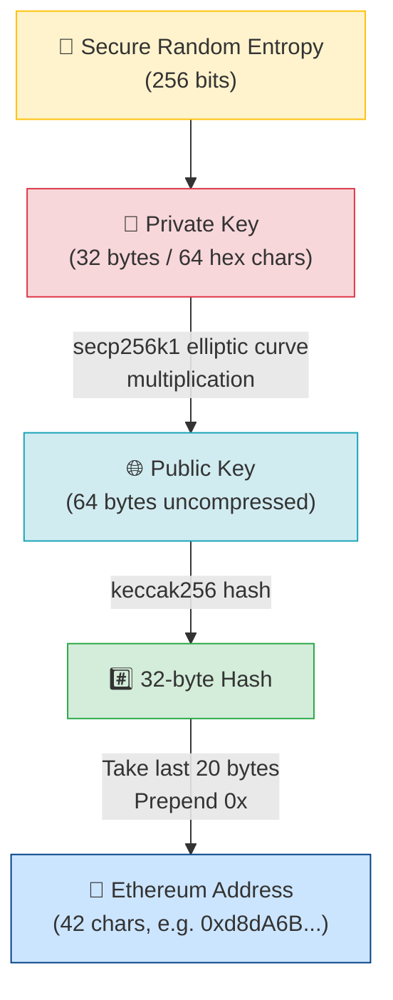
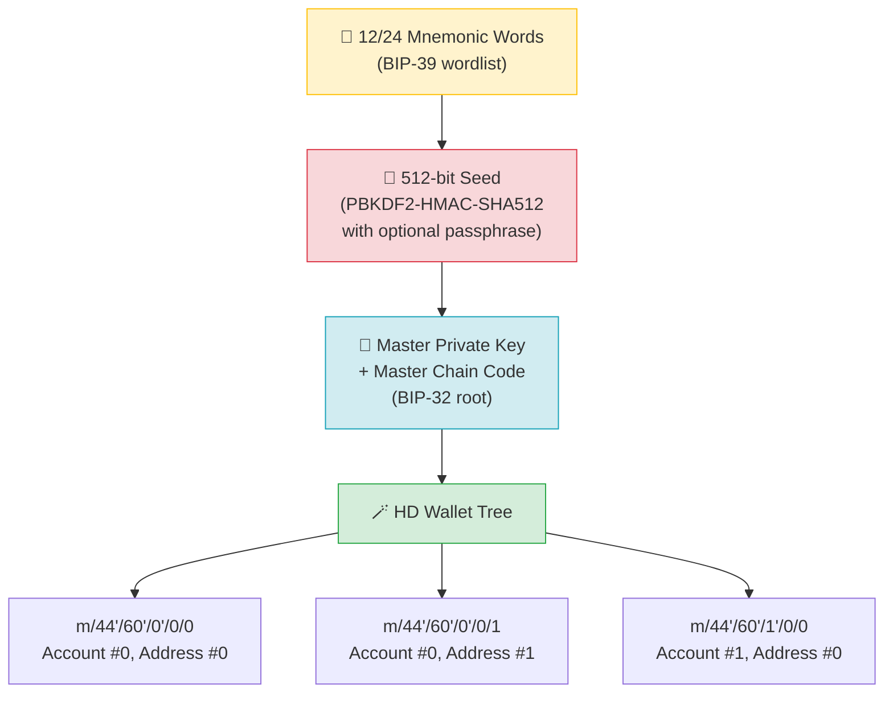

# 🔑 Chapter 06: Wallets and Keys

> **Target audience:** Developers new to Web3 who understand basic programming but have never touched crypto before.
> **Goal:** Understand how cryptographic identity works in Ethereum — from raw entropy to a MetaMask address.

---

## 📖 Table of Contents

1. [The Big Misconception: Wallets Don't Store Coins](#the-big-misconception)
2. [Private Keys — The Root of Everything](#private-keys)
3. [Public Keys — Your Shareable Identity](#public-keys)
4. [Wallet Addresses — The Shortened Public Face](#wallet-addresses)
5. [BIP-39 Seed Phrases — One Backup to Rule Them All](#bip-39-seed-phrases)
6. [HD Wallets and Derivation Paths](#hd-wallets)
7. [Types of Wallets](#types-of-wallets)
8. [MetaMask Setup Walkthrough](#metamask-setup)
9. [Checksum Addresses (EIP-55)](#checksum-addresses)
10. [Key Takeaways](#key-takeaways)
11. [Quiz](#quiz)

---

## 🧩 The Big Misconception: Wallets Don't Store Coins {#the-big-misconception}

Here is the single most important mental model shift you need to make as a Web3 developer:

> **A crypto wallet does NOT store cryptocurrency. It stores cryptographic keys.**

Your ETH, tokens, and NFTs live on the blockchain — a global database replicated across thousands of nodes worldwide. Nobody "has" your coins physically. What you actually own is the **private key** that proves you have the right to move those assets.

Think of it this way:

| Traditional Banking | Web3 Equivalent |
|---|---|
| Bank account number | Wallet address |
| PIN / password | Private key |
| Bank (third party) | Cryptographic proof (trustless) |
| Debit card | Hardware wallet / browser extension |

When your wallet is "hacked," the attacker didn't steal coins from a file. They obtained your private key and used it to sign transactions that transferred ownership — all perfectly valid from the blockchain's perspective.

---

## 🔐 Private Keys — The Root of Everything {#private-keys}

### What does a private key look like?

A private key is just a random 256-bit number. When displayed, it is typically shown as a 64-character hexadecimal string:

```
Private Key:
0x4c0883a69102937d6231471b5dbb6e538eba2ef8ab6d4b2c6e5e5e5e5e5e5e5
```

That's it. 32 bytes. A number between 1 and 2²⁵⁶ − 1.

### How is it generated?

A private key must be generated from **cryptographically secure randomness** (CSPRNG). It must never be guessable. Here's the process in pseudocode:

```
1. Generate 256 bits of secure random entropy
2. Verify the result is within the valid secp256k1 curve range
3. That number IS your private key
```

In code (Node.js example):

```javascript
import { randomBytes } from 'crypto';

// Generate 32 random bytes = 256 bits
const privateKey = randomBytes(32).toString('hex');
console.log('Private Key:', privateKey);
// Output: 4c0883a69102937d6231471b5dbb6e538eba2ef8ab6d4b2c...
```

### Why you NEVER share your private key

Whoever knows the private key **IS** you, from the blockchain's perspective. There is no recovery mechanism, no customer support, no reversal. If someone obtains your private key:

- They can sign transactions as you
- They can drain every asset from every account derived from it
- You cannot revoke or change it (the key is the identity)

**Rule:** Your private key should never appear in source code, be pasted into a chat, or be stored in plain text anywhere. Use environment variables at minimum; use a secrets manager in production.

---

## 🌐 Public Keys — Your Shareable Identity {#public-keys}

A public key is **mathematically derived from the private key** using elliptic curve cryptography — specifically the **secp256k1** curve (the same curve Bitcoin uses).

```
Public Key = Private Key × G
```

Where `G` is a fixed "generator point" on the secp256k1 curve. This is **one-way**: you can compute the public key from the private key in milliseconds, but computing the private key from the public key would require more compute than currently exists on Earth.

An uncompressed Ethereum public key is 65 bytes (1 prefix byte `04` + 32 bytes X + 32 bytes Y):

```
Public Key (uncompressed):
04
  b4632d08485ff1df2db55b9dafd23347d1c47a457072a1e87be26896549a8737
  8ec2b0f99ed8d3b7b4e89b7c8c5c5c5c5c5c5c5c5c5c5c5c5c5c5c5c5c5c5
```

The public key is safe to share — it is your cryptographic identity. It is used to verify signatures without revealing the private key.

---

## 📍 Wallet Addresses — The Shortened Public Face {#wallet-addresses}

An Ethereum address is derived from the public key through a specific hashing process. You do not use the full 64-byte public key directly — it is too long to be practical.

### Derivation Steps

```
1. Take the 64-byte uncompressed public key (strip the 04 prefix)
2. Hash it with keccak256  →  produces a 32-byte (256-bit) hash
3. Take the LAST 20 bytes (40 hex characters) of that hash
4. Prepend "0x"
```

Result: a 42-character Ethereum address.

```
Public Key (64 bytes):
b4632d08485ff1df2db55b9dafd23347...8ec2b0f99ed8d3b7b4e89b7c8c5c5c5

keccak256(public key) =
9f8f72aa9304c8b593d555f12ef6589cc3a579a2...

Last 20 bytes → Address:
0xd8dA6BF26964aF9D7eEd9e03E53415D37aA96045
```

> **Note:** keccak256 is NOT the same as SHA3-256. Ethereum uses an earlier draft of Keccak before it was standardized as SHA3. Always use a library that explicitly says `keccak256` — do not substitute `sha3`.

### Key Derivation Flow



---

## 🌱 BIP-39 Seed Phrases — One Backup to Rule Them All {#bip-39-seed-phrases}

### The Problem Seed Phrases Solve

If every account has its own private key, and you have dozens of accounts, you need to back up dozens of private keys. That's impractical. BIP-39 (Bitcoin Improvement Proposal 39) solves this with a **mnemonic seed phrase**.

### What is a Seed Phrase?

A seed phrase (also called a mnemonic or recovery phrase) is a list of **12 or 24 common English words** chosen from a standardized list of 2048 words:

```
witch collapse practice feed shame open despair creek road again ice least
```

These words encode a large random number (128 bits for 12 words, 256 bits for 24 words) in a human-readable format that is:
- Easier to write down accurately than hex
- Easier to verify (built-in checksum)
- Language-agnostic in structure (wordlists exist for multiple languages)

### Analogy

Think of the seed phrase as the **master key to a key cabinet**. The cabinet has infinite numbered slots, each slot containing a different private key for a different account. The seed phrase doesn't just give you one key — it gives you the cabinet itself, and therefore every key inside it, forever.

### How Seed Phrases Generate Keys



### The Conversion Steps

```
1. Mnemonic words
        ↓  (BIP-39: words → entropy + checksum)
2. Raw entropy (128 or 256 bits)
        ↓  (PBKDF2-HMAC-SHA512, 2048 rounds, salt = "mnemonic" + optional passphrase)
3. 512-bit binary seed
        ↓  (BIP-32 root key derivation via HMAC-SHA512)
4. Master Extended Private Key (xprv)
        ↓  (child key derivation — HD Wallet)
5. Individual private keys for each account/address
```

> **Critical:** Your seed phrase IS your private key(s). Back it up on paper in a physically secure location. Never photograph it, type it into any website, or store it in a password manager connected to the internet.

---

## 🌲 HD Wallets and Derivation Paths {#hd-wallets}

### Hierarchical Deterministic (HD) Wallets

An HD wallet (BIP-32) generates a tree of key pairs from a single seed. "Deterministic" means: given the same seed, you always get the exact same tree of keys. "Hierarchical" means: the tree is structured by purpose, coin type, account, and address index.

This lets you:
- Generate unlimited addresses from one seed
- Restore all your accounts from one seed phrase
- Organize accounts into logical groups

### Derivation Paths Explained

A derivation path describes how to navigate the HD tree to reach a specific key:

```
m / purpose' / coin_type' / account' / change / address_index
```

| Segment | Meaning | Ethereum Value |
|---|---|---|
| `m` | Master key (root) | always `m` |
| `44'` | Purpose (BIP-44 standard) | `44'` |
| `60'` | Coin type | `60'` for Ethereum |
| `0'` | Account index | `0'` = first account |
| `0` | Change (0=external, 1=internal) | `0` for receiving |
| `0` | Address index | `0` = first address |

The apostrophe `'` means **hardened derivation** — the child key cannot be derived from the parent public key alone, adding an extra security layer.

**MetaMask default path:** `m/44'/60'/0'/0/0`

```
m/44'/60'/0'/0/0  →  First Ethereum address
m/44'/60'/0'/0/1  →  Second Ethereum address
m/44'/60'/0'/0/2  →  Third Ethereum address
```

---

## 💼 Types of Wallets {#types-of-wallets}

### Hot Wallets

A hot wallet is **connected to the internet**. The private key (or seed) exists on a device that has internet access.

| Pros | Cons |
|---|---|
| Convenient, instant transactions | Exposed to malware, phishing, browser exploits |
| Free | Private key could be exfiltrated remotely |
| Good for small, frequent transactions | Not suitable for large holdings |

Examples: MetaMask (browser extension), Rainbow (mobile), Coinbase Wallet (mobile)

### Cold Wallets

A cold wallet keeps the private key **offline at all times**.

| Pros | Cons |
|---|---|
| Private key never touches the internet | Less convenient |
| Immune to remote attacks | Physical theft/loss is a risk |
| Ideal for large holdings | Costs money (hardware) |

Examples: Paper wallets (literally written/printed keys), air-gapped computers

### Hardware Wallets

A hardware wallet is a physical USB device that stores private keys in a **secure element chip** (tamper-resistant hardware). Transactions are signed *inside* the device — the private key never leaves the chip.

| Pros | Cons |
|---|---|
| Private key never exported in plaintext | Costs $50–$250 |
| Works with MetaMask and other software | Can be lost/damaged |
| Screen shows transaction details before signing | Setup takes time |

Examples: Ledger (Nano X, Nano S Plus), Trezor (Model T, Model One), Coldcard

### Browser Extension Wallets

Browser extensions like MetaMask inject a `window.ethereum` JavaScript object into web pages. This is how dApps (decentralized applications) request wallet interactions.

```
User visits dApp → dApp calls window.ethereum.request() →
MetaMask popup appears → User approves → Transaction signed →
Signed transaction broadcast to network
```

---

## 🦊 MetaMask Setup Walkthrough {#metamask-setup}

MetaMask is the most widely used browser wallet and is the standard for connecting to Ethereum dApps. Here is the setup flow a new user experiences:

### Step 1: Install the Extension

Navigate to [metamask.io](https://metamask.io) and install the extension for Chrome, Firefox, Brave, or Edge. Always install from the official browser extension store — phishing sites distribute fake MetaMask extensions.

### Step 2: Create a New Wallet

On first launch, choose "Create a new wallet." MetaMask will ask you to set a **local password** — this encrypts the wallet data stored in your browser's local storage. This password does NOT protect your funds from someone who has your seed phrase; it only prevents local access on your device.

### Step 3: Secure Your Seed Phrase

MetaMask generates a 12-word BIP-39 seed phrase and displays it once. You must:

1. Write it on paper (not a screenshot, not in a notes app)
2. Store the paper somewhere physically secure
3. Consider making a second physical copy stored in a different location
4. Complete MetaMask's verification step (re-entering words in order)

### Step 4: Your First Address

MetaMask derives your first Ethereum address at path `m/44'/60'/0'/0/0` and displays it. This address is public — you can share it to receive ETH or tokens.

### Step 5: Connect to a dApp

When you visit a dApp and click "Connect Wallet," the dApp calls:

```javascript
const accounts = await window.ethereum.request({
  method: 'eth_requestAccounts'
});
// accounts[0] is your address
```

MetaMask shows a popup asking for permission. Connecting only shares your address — it does NOT give the dApp permission to spend your funds. Spending requires a separate transaction approval.

---

## ✅ Checksum Addresses (EIP-55) {#checksum-addresses}

### The Problem

Ethereum addresses are hex strings. They are case-insensitive at the protocol level:

```
0xd8da6bf26964af9d7eed9e03e53415d37aa96045  ← all lowercase
0xD8DA6BF26964AF9D7EED9E03E53415D37AA96045  ← all uppercase
```

Both are the same address. But typos in addresses are catastrophic — funds sent to a wrong address are lost forever.

### EIP-55: Mixed-Case Checksum

EIP-55 encodes a checksum directly into the capitalization of the hex characters. The algorithm:

```
1. Take the lowercase hex address (without 0x prefix)
2. Compute keccak256 of that string
3. For each character in the address:
   - If the corresponding nibble in the hash is >= 8, capitalize the letter
   - Otherwise, leave it lowercase (digits are unaffected)
```

Result:

```
Checksum Address: 0xd8dA6BF26964aF9D7eEd9e03E53415D37aA96045
```

Notice the mixed capitalization — it looks random but encodes validation information. When software receives a checksum address and finds a capitalization mismatch, it warns you before sending.

```javascript
import { getAddress } from 'ethers';

// Converts any valid address format to checksum form
const checksummed = getAddress('0xd8da6bf26964af9d7eed9e03e53415d37aa96045');
// → '0xd8dA6BF26964aF9D7eEd9e03E53415D37aA96045'
```

> **Always display and store addresses in EIP-55 checksum format** in your applications. Most Ethereum libraries (ethers.js, viem, web3.js) do this automatically.

---

## 🗂️ Key Takeaways {#key-takeaways}

| Concept | One-Liner |
|---|---|
| Wallet | Stores keys, NOT coins. Coins live on-chain. |
| Private Key | 32 random bytes. Whoever has it controls your funds. NEVER share. |
| Public Key | Derived from private key via secp256k1. Safe to share. |
| Address | Last 20 bytes of keccak256(public key). Your on-chain identity. |
| Seed Phrase | 12/24 words that deterministically generate all your keys. |
| HD Wallet | Tree of keys from one seed. Derivation path selects a branch. |
| Hot Wallet | Online. Convenient. Higher risk. |
| Cold Wallet | Offline. Inconvenient. Lower risk. |
| Hardware Wallet | Private key lives in tamper-resistant chip. Best of both. |
| EIP-55 | Capitalization encodes a checksum. Protects against typos. |

---

## 📝 Quiz {#quiz}

Test your understanding before moving on:

**Question 1**

You visit a new dApp and click "Connect Wallet." MetaMask asks for permission and you approve. The dApp now:

- A) Has read access to your private key
- B) Can send transactions on your behalf without further approval
- C) Knows your public address only
- D) Has decrypted your seed phrase

<details>
<summary>Answer</summary>

**C — Knows your public address only.**

Connecting a wallet only shares your Ethereum address with the dApp. The private key never leaves MetaMask. Every transaction still requires a separate signature approval in the MetaMask popup.

</details>

---

**Question 2**

A colleague says: "I lost my Ledger hardware wallet in a fire, but I have my 12-word seed phrase written on paper. All my ETH is gone."

Is your colleague correct?

- A) Yes — the private key was stored in the burned Ledger
- B) No — they can restore their wallet on a new Ledger or any BIP-39-compatible wallet using the seed phrase
- C) Yes — the seed phrase only works with Ledger devices
- D) No — but they need to contact Ledger support to recover their funds

<details>
<summary>Answer</summary>

**B — They can restore on any BIP-39-compatible wallet.**

The seed phrase is the root of all keys. It is device-independent and vendor-independent. Buying a new Ledger, Trezor, or installing MetaMask and importing the seed phrase will restore every account and address exactly as before. The ETH is perfectly safe.

</details>

---

**Question 3**

What is the derivation path for the third Ethereum address (index 2) in the first account of a standard MetaMask wallet?

- A) `m/44'/60'/0'/0/2`
- B) `m/44'/60'/2'/0/0`
- C) `m/44'/60'/0'/2/0`
- D) `m/44'/60'/3'/0/0`

<details>
<summary>Answer</summary>

**A — `m/44'/60'/0'/0/2`**

The address index is the last segment of the path. Index 0 = first address, index 1 = second address, index 2 = third address. The account index (third segment) and other segments remain at 0 for the default account.

</details>

---

## 🔗 Further Reading

- [BIP-39 Specification](https://github.com/bitcoin/bips/blob/master/bip-0039.mediawiki) — the mnemonic standard
- [BIP-32 Specification](https://github.com/bitcoin/bips/blob/master/bip-0032.mediawiki) — HD wallet derivation
- [EIP-55](https://eips.ethereum.org/EIPS/eip-55) — checksum address encoding
- [Ethereum Yellow Paper](https://ethereum.github.io/yellowpaper/paper.pdf) — keccak256 and address derivation
- [learnmeabitcoin.com/technical/keys](https://learnmeabitcoin.com/technical/keys) — excellent visual explainer of key derivation

---

*Next Chapter: 07 — Transactions and Gas →*
