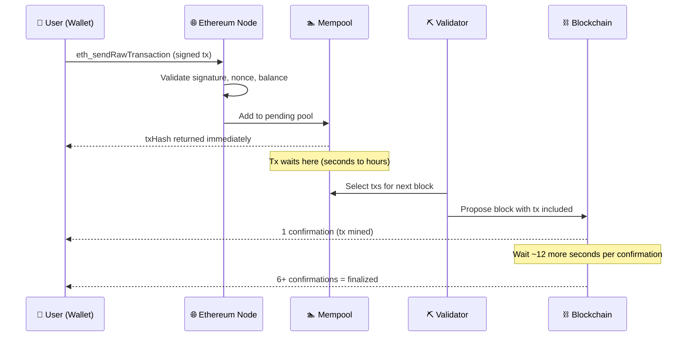

# ⛓️ Chapter 7: Transactions on Ethereum

> **Level:** Beginner | **Prerequisites:** Chapters 1–6 (Accounts, Gas, EVM basics)

---

## 🧭 Introduction

If the Ethereum blockchain is a shared database, then a **transaction** is the only way to write to it. You cannot change state — move ETH, deploy a contract, or call a function — without submitting a signed transaction to the network. Everything else (reading data via `eth_call`, listening to events) is read-only and free.

This chapter walks you through what a transaction is, what it contains, how it travels through the network, and why things like the nonce and gas model matter for everyday development.

---

## 📦 What Is a Transaction?

A transaction is a **cryptographically signed instruction** sent by an externally owned account (EOA) that tells the Ethereum network to change some state.

Examples of state changes:
- Transferring 1 ETH from Alice to Bob
- Deploying a new ERC-20 contract
- Calling `transfer()` on an existing token contract

Everything inside a single transaction is **atomic**: either all of it succeeds and the state change is committed, or it all fails and the state rolls back. There is no partial execution — except that gas is always consumed either way (more on that later).

---

## 🔬 Transaction Anatomy

Every Ethereum transaction is a structured object. Here is what a raw **EIP-1559** transaction looks like as JSON:

```json
{
  "type": "0x2",
  "chainId": "0x1",
  "nonce": "0x4f",
  "from": "0xd8dA6BF26964aF9D7eEd9e03E53415D37aA96045",
  "to": "0xA0b86991c6218b36c1d19D4a2e9Eb0cE3606eB48",
  "value": "0x0",
  "data": "0xa9059cbb000000000000000000000000bef8e1c3dfb95a07ebb8de1c0c8b2797ab8d6db1000000000000000000000000000000000000000000000000000000003b9aca00",
  "gasLimit": "0xea60",
  "maxFeePerGas": "0x77359400",
  "maxPriorityFeePerGas": "0x3B9ACA00",
  "v": "0x1",
  "r": "0xa6c39bb6ebf7a44fc3f3dbb7e06bb3d5f0d26b6b5da0cfc05c04a0cb3fd6f741",
  "s": "0x4c17f4b0fa6a9e23b2af7a14eb00f3be1de5b72c1f1e88a4dd68702de0f9e1c2"
}
```

Let's break down each field:

### `type`
The transaction format version. `0x2` means EIP-1559 (current standard). Legacy transactions use `0x0`.

### `chainId`
Identifies the network: `1` = Ethereum Mainnet, `11155111` = Sepolia testnet. This field was introduced by EIP-155 to prevent the same signed transaction from being replayed on a different chain (e.g., your Mainnet tx cannot be broadcast on Polygon).

### `nonce`
A sequential counter for every transaction sent from an address, starting at `0`. If your address has sent 79 transactions before, your next nonce is `79` (hex `0x4f`). The network rejects any transaction whose nonce is not exactly one higher than the last confirmed nonce. This is a core replay-attack prevention mechanism — explained in detail below.

### `from`
The sender's address. This is **not** explicitly in the signed bytes — it is cryptographically recovered from the signature `(v, r, s)` using `ecrecover`. The network derives `from` automatically.

### `to`
The recipient address. Three cases:
- **ETH transfer:** another EOA address
- **Contract call:** the deployed contract's address
- **Contract deployment:** this field is **omitted** (or set to `null`)

### `value`
Amount of ETH to send, in wei (1 ETH = 10¹⁸ wei). For pure token transfers via a contract call, `value` is `0x0` — the token amount lives in `data`.

### `data`
Arbitrary byte payload. For ETH transfers it is empty. For contract interactions it encodes:
- The **function selector** (first 4 bytes of the keccak256 hash of the function signature, e.g., `transfer(address,uint256)`)
- ABI-encoded **arguments**

For contract deployment, `data` contains the contract's **bytecode** plus constructor arguments.

### `gasLimit`
The maximum units of gas you authorize for this transaction. If execution uses more gas than this, the transaction reverts (but gas is still consumed up to the limit). If it uses less, unused gas is refunded. A standard ETH transfer costs exactly **21,000 gas**.

### `maxFeePerGas`
The absolute maximum you are willing to pay **per gas unit** (in wei). This caps your total exposure. Introduced by EIP-1559.

### `maxPriorityFeePerGas`
The "tip" per gas unit you offer to the block proposer (validator) as an incentive to include your transaction. Also called the **priority fee**.

### `v`, `r`, `s` — The Signature
These three values are the ECDSA signature produced by signing the transaction hash with the sender's private key.
- `r` and `s` are the two 32-byte components of the elliptic curve signature.
- `v` is a recovery ID (1 or 0) that allows the network to recover the exact public key — and therefore the `from` address — without needing the public key to be sent explicitly.

---

## 🔄 Transaction Lifecycle

Here is how a transaction travels from your wallet to the blockchain:



**Step-by-step explanation:**

1. **Sign:** Your wallet signs the transaction data with your private key, producing `(v, r, s)`.
2. **Broadcast:** The signed transaction is submitted to any Ethereum node via `eth_sendRawTransaction`. You receive a `txHash` immediately — this is just the keccak256 hash of the transaction bytes, not a confirmation.
3. **Mempool (Memory Pool):** The node validates basic things (valid signature, nonce is correct, sender has enough ETH to cover `gasLimit * maxFeePerGas + value`) and adds it to the **mempool** — a temporary waiting room of unconfirmed transactions shared across nodes.
4. **Selection:** Validators (formerly miners) scan the mempool and select transactions to include in the next block, typically prioritizing those with a higher `maxPriorityFeePerGas`.
5. **Mined (1 Confirmation):** When the block containing your transaction is proposed and accepted by the network, your transaction has **1 confirmation**. State has changed.
6. **Finalized:** After additional blocks build on top (~12 seconds each), the transaction becomes increasingly difficult to revert. For high-value operations, wait for **6–12 confirmations**. Ethereum's Proof-of-Stake achieves economic finality after ~2 epochs (~12.8 minutes).

---

## 🛡️ The Nonce and Replay Attack Prevention

The nonce solves two problems simultaneously.

**Problem 1 — Replay attacks:** Without a nonce, if Alice sends Bob 1 ETH and that signed transaction is broadcast, anyone who sees it could rebroadcast the same bytes again and again, draining Alice's wallet.

**Problem 2 — Transaction ordering:** If you submit multiple transactions, the nonce guarantees they execute in order. Nonce 5 will never execute before nonce 4.

**How it works:** The network tracks the `nonce` of the last confirmed transaction for every address. If you submit a transaction with nonce `5` but the network expects `4`, your transaction sits in the mempool until nonce `4` is confirmed — or is dropped after a timeout. If you submit nonce `3` (already used), it is rejected outright as a duplicate.

> **Developer tip:** This is why "stuck" transactions happen. If transaction N never confirms (e.g., gas too low), every subsequent transaction with a higher nonce is also stuck. The fix is to resend transaction N with the same nonce but a higher gas fee — the network accepts whichever version gets mined first.

---

## ⛽ The EIP-1559 Gas Model

Before EIP-1559 (August 2021), gas worked like a blind auction: you set a `gasPrice` and miners picked the highest bidders. This caused huge fee spikes during congestion and made it hard to predict costs.

**EIP-1559 introduced a two-part fee model:**

```
Total fee per gas = baseFee + priorityFee

Where:
  baseFee           = protocol-set fee, burned (destroyed) 🔥
  priorityFee (tip) = goes to the block validator as reward
  maxFeePerGas      = your cap: baseFee + priorityFee must not exceed this
```

### Base Fee (Burned)
The `baseFee` is determined algorithmically by the protocol based on how full the previous block was. If blocks are more than 50% full, `baseFee` rises by up to 12.5%. If less than 50% full, it falls. This makes fees somewhat predictable and self-correcting.

Crucially, the `baseFee` is **burned** — permanently removed from circulation. This makes ETH deflationary during high-activity periods, as more ETH is burned than is issued as staking rewards.

### Priority Fee (Tip)
The `maxPriorityFeePerGas` is your incentive to validators. A higher tip means faster inclusion during congestion. During quiet periods, even a 1 gwei tip is sufficient.

### What you actually pay
```
actualGasCost = gasUsed * (baseFee + min(priorityFee, maxFeePerGas - baseFee))

Refund = (gasLimit - gasUsed) * effectiveGasPrice
```

If `maxFeePerGas` is set lower than the current `baseFee`, your transaction cannot be included in any block and stays in the mempool until the `baseFee` drops to meet your cap or you cancel it.

---

## 🗂️ Transaction Types

### 1. ETH Transfer
The simplest transaction: move native ETH between accounts.
- `to`: recipient address
- `value`: amount in wei
- `data`: empty (`0x`)
- `gasLimit`: exactly **21,000**

### 2. Contract Deployment
Deploy bytecode to the network to create a new contract.
- `to`: **omitted / null**
- `value`: optional (sent to the contract's constructor)
- `data`: compiled bytecode + ABI-encoded constructor arguments
- Gas: varies based on bytecode size (roughly 200 gas per byte)
- The resulting contract address is deterministic: `keccak256(rlp([sender, nonce]))[12:]`

### 3. Contract Function Call
Interact with an already-deployed contract.
- `to`: the contract's address
- `value`: `0` for non-payable functions, or ETH amount for `payable` functions
- `data`: 4-byte function selector + ABI-encoded arguments
- Gas: varies based on what the function executes in the EVM

---

## 🔍 Reading a Real Transaction on Etherscan

When you paste a `txHash` into [etherscan.io](https://etherscan.io), here is what you see and what it means:

| Etherscan Field | Meaning |
|---|---|
| **Transaction Hash** | The unique `txHash` — keccak256 of the signed tx bytes |
| **Status** | Success / Fail — whether execution completed without reverting |
| **Block** | Block number where this tx was mined |
| **Timestamp** | When that block was produced |
| **From** | The `from` address recovered from the signature |
| **To** | The `to` field — a contract address links to its page |
| **Value** | ETH transferred (the `value` field) |
| **Transaction Fee** | `gasUsed * effectiveGasPrice` in ETH — what you actually paid |
| **Gas Price** | `baseFee + priorityFee` at the time of inclusion |
| **Gas Limit & Usage** | Your `gasLimit` vs. how much the EVM actually consumed |
| **Base Fee Per Gas** | The `baseFee` for that block (burned) |
| **Max Fee Per Gas** | Your `maxFeePerGas` cap |
| **Max Priority Fee** | Your `maxPriorityFeePerGas` tip |
| **Nonce** | The sequential nonce of this tx from the sender |
| **Input Data** | The raw `data` field — Etherscan decodes this using the ABI |

The **"Input Data"** tab is particularly useful: for a known contract, Etherscan decodes the function selector and arguments into human-readable form, e.g., `transfer(address _to, uint256 _value)` with the actual values shown.

---

## 💀 Failed Transactions — Why You Still Pay Gas

This surprises almost every new developer: **a failed transaction still costs gas.**

Here is why. The EVM executes your transaction instruction by instruction, consuming gas at each step. At some point, execution hits a `REVERT` opcode — triggered by a failed `require()`, `assert()`, or an explicit `revert()` — and execution stops. The state changes up to that point are rolled back. But the computation that happened up to the revert point was still performed by every validator on the network. That work is real and must be compensated.

What you lose on a failed transaction:
- **Gas used up to the revert point** — paid to validators
- **The base fee portion** — burned

What you get back:
- **Unused gas** (`gasLimit - gasUsed`) — refunded
- **Your `value` (ETH)** — returned if the revert happens before it is accepted

**Common causes of failed transactions:**
- `require()` condition not met (e.g., insufficient token balance, wrong caller)
- Running out of gas mid-execution (`gasLimit` set too low)
- Arithmetic overflow/underflow (Solidity 0.8+ reverts automatically)
- Calling a function on a contract that doesn't exist at `to`
- Reentrancy guard blocking a call

> **Developer tip:** Use `eth_estimateGas` before sending to get a gas estimate, and add a 20–30% buffer as `gasLimit` to avoid running out of gas on complex operations.

---

## 🔑 Key Takeaways

- A transaction is the **only way to change state** on Ethereum — signed by an EOA's private key.
- Every transaction contains: `nonce`, `to`, `value`, `data`, `gasLimit`, `maxFeePerGas`, `maxPriorityFeePerGas`, and a signature `(v, r, s)`.
- The **nonce** is a sequential counter that prevents replay attacks and enforces transaction ordering.
- EIP-1559 split gas into a **base fee** (burned by the protocol) and a **priority fee** (tip to the validator).
- Transactions go: signed → broadcast → mempool → mined (1 confirmation) → finalized.
- The three transaction types are: **ETH transfer**, **contract deployment**, and **contract function call**.
- Failed transactions **still consume gas** because the EVM did real computation before reverting.
- On Etherscan, you can inspect every field of a transaction including decoded calldata.

---

## 📝 Quiz

Test your understanding before moving to Chapter 8.

**Question 1:** Alice has sent 12 transactions from her wallet (nonces 0–11). She submits a new transaction. What nonce should it have, and what happens if she accidentally submits it with nonce 10 instead?

<details>
<summary>Answer</summary>

Her next transaction should use **nonce 12**. If she submits nonce 10, the network will reject it immediately as a duplicate — nonce 10 was already used and confirmed. The transaction will never enter the mempool.

</details>

---

**Question 2:** You call `swapExactTokensForTokens()` on a DEX contract. The transaction fails because slippage exceeded your tolerance and the contract reverts. You set `gasLimit` to 200,000 and the EVM used 85,000 gas before reverting. How much gas do you pay, and what happens to the rest?

<details>
<summary>Answer</summary>

You pay for **85,000 gas** (the amount consumed before the revert). The remaining **115,000 gas** is refunded to your wallet. The `baseFee` portion of those 85,000 gas units is burned; the `priorityFee` portion goes to the validator. Your token balances are unchanged because the state rolled back.

</details>

---

**Question 3:** You set `maxFeePerGas` to 15 gwei. The network's current `baseFee` is 18 gwei. What happens to your transaction?

<details>
<summary>Answer</summary>

Your transaction **cannot be included** in any block while the `baseFee` exceeds your `maxFeePerGas` cap. It will sit in the mempool waiting for the `baseFee` to drop below 15 gwei, or it will eventually be dropped. To fix it, you need to resubmit the transaction (same nonce) with a higher `maxFeePerGas` that covers at least the current `baseFee` plus your desired tip.

</details>

---

*Next up: Chapter 8 — Smart Contract Deployment and the EVM Bytecode Lifecycle*
