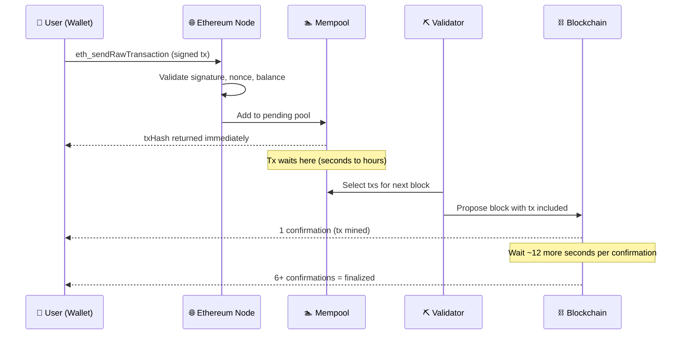

# ⛓️ Chapter 7: Transactions on Ethereum

> **Level:** Beginner | **Prerequisites:** Chapters 1–6 (Accounts, Gas, EVM basics)

---

## 🧭 Introduction

Socho Ethereum ek shared database hai jo pura duniya dekh sakta hai. Ab is database mein likhne (write) ka sirf ek hi tareeka hai — **transaction**. Chahe tumhe ETH bhejna ho, ek naya contract deploy karna ho, ya kisi function ko call karna ho — state change karne ke liye tumhe ek signed transaction network mein bhejna hi padega. Baaki sab kuch (jaise `eth_call` se data padhna, ya events sunna) sirf **read-only** hai aur free hai — bilkul Zomato app mein menu dekhna free hai, lekin order place karna ek "transaction" hai jisme paisa aur commitment dono involve hain.

Is chapter mein hum dekhenge — transaction hota kya hai, usme kya-kya hota hai, woh network mein kaise safar karta hai, aur nonce + gas model jaise concepts developer ke liye kyun important hain.

---

## 📦 Transaction Hai Kya?

Ek transaction ek **cryptographically signed instruction** hota hai jo ek externally owned account (EOA) bhejta hai, aur Ethereum network ko bolta hai — "bhai, state change karo."

State change ke kuch examples:
- Alice se Bob ko 1 ETH transfer karna
- Ek naya ERC-20 contract deploy karna
- Kisi existing token contract pe `transfer()` call karna

Ek transaction ke andar jo bhi ho raha hai, woh **atomic** hota hai — matlab ya to sab kuch successfully ho jayega aur state permanently change ho jayegi, ya sab fail ho jayega aur state wapas rollback ho jayegi. Beech mein "half-done" jaisa kuch nahi hota — bas gas hamesha consume hota hai, chahe transaction pass ho ya fail (isके baare mein aage detail mein baat karenge).

---

## 🔬 Transaction Ke Andar Kya Hota Hai (Anatomy)

Har Ethereum transaction ek structured object hota hai. Neeche ek raw **EIP-1559** transaction JSON format mein dikhaya gaya hai:

```json
{
  "type": "0x2",
  "chainId": "0x1",
  "nonce": "0x4f",
  "from": "0xd8dA6BF26964aF9D7eEd9e03E53415D37aA96045",
  "to": "0xA0b86991c6218b36c1d19D4a2e9Eb0cE3606eB48",
  "value": "0x0",
  "data": "0xa9059cbb000000000000000000000000bef8e1c3dfb95a07ebb8de1c0c8b2797ab8d6db1000000000000000000000000000000000000000000000000000000003b9aca00",
  "gasLimit": "0xea60",
  "maxFeePerGas": "0x77359400",
  "maxPriorityFeePerGas": "0x3B9ACA00",
  "v": "0x1",
  "r": "0xa6c39bb6ebf7a44fc3f3dbb7e06bb3d5f0d26b6b5da0cfc05c04a0cb3fd6f741",
  "s": "0x4c17f4b0fa6a9e23b2af7a14eb00f3be1de5b72c1f1e88a4dd68702de0f9e1c2"
}
```

Chalo ek-ek field samajhte hain:

### `type`
Transaction format ka version. `0x2` matlab EIP-1559 (aajkal ka standard). Legacy transactions `0x0` use karte hain.

### `chainId`
Yeh batata hai ki network kaunsa hai: `1` = Ethereum Mainnet, `11155111` = Sepolia testnet. Yeh field EIP-155 ne introduce kiya tha taaki ek signed transaction ko dusre chain pe replay na kiya ja sake (jaise, tumhara Mainnet wala tx Polygon pe broadcast nahi ho sakta — Ola ki ride receipt Uber mein use nahi kar sakte, waisa hi samjho).

### `nonce`
Har address se bheje gaye transaction ka ek sequential counter, jo `0` se start hota hai. Agar tumhare address se pehle 79 transactions ja chuke hain, to agla nonce `79` hoga (hex mein `0x4f`). Network kisi bhi transaction ko reject kar deta hai jiska nonce last confirmed nonce se exactly ek zyada nahi hai. Yeh replay-attack rokne ka core mechanism hai — niche detail mein samjhayenge.

### `from`
Sender ka address. Yeh interesting baat hai — yeh field signed bytes mein explicitly nahi hoti, balki signature `(v, r, s)` se `ecrecover` function ke through **cryptographically recover** ki jaati hai. Network khud hi `from` nikaal leta hai.

### `to`
Recipient ka address. Teen cases ho sakte hain:
- **ETH transfer:** koi doosra EOA address
- **Contract call:** deployed contract ka address
- **Contract deployment:** yeh field **omit** kar diya jaata hai (ya `null` set hota hai)

### `value`
Kitna ETH bhejna hai, wei mein (1 ETH = 10¹⁸ wei). Pure token transfer (jaise ek contract call ke through) mein `value` `0x0` hota hai — token ka amount `data` field ke andar hota hai.

### `data`
Ek arbitrary byte payload. ETH transfer ke liye yeh empty hota hai. Contract interaction ke liye isme yeh sab encode hota hai:
- **Function selector** (function signature jaise `transfer(address,uint256)` ke keccak256 hash ke pehle 4 bytes)
- ABI-encoded **arguments**

Contract deployment ke liye, `data` mein contract ka **bytecode** aur constructor arguments hote hain.

### `gasLimit`
Yeh maximum gas units hain jo tum is transaction ke liye authorize kar rahe ho. Agar execution isse zyada gas use kar le, to transaction revert ho jaata hai (lekin gas limit tak jo bhi consume hua, woh phir bhi charge hoga). Agar kam use hua, to bacha hua gas refund ho jaata hai. Ek simple ETH transfer ka cost exactly **21,000 gas** hota hai.

### `maxFeePerGas`
Per gas unit tum maximum kitna dene ko ready ho (wei mein) — yeh tumhare total exposure ka cap hai. EIP-1559 ne introduce kiya tha.

### `maxPriorityFeePerGas`
Yeh "tip" hai jo tum per gas unit block proposer (validator) ko dete ho, taaki woh tumhara transaction jaldi include kare. Isse **priority fee** bhi kehte hain.

### `v`, `r`, `s` — Signature
Yeh teen values ECDSA signature hain, jo sender ki private key se transaction hash sign karke banti hain.
- `r` aur `s` elliptic curve signature ke do 32-byte components hain.
- `v` ek recovery ID hai (1 ya 0), jisse network exact public key — aur isliye `from` address bhi — recover kar leta hai, bina public key explicitly bheje.

---

## 🔄 Transaction Ki Journey (Lifecycle)

Chalo dekhte hain ek transaction tumhare wallet se blockchain tak kaise pahunchta hai:



**Step-by-step samjho:**

1. **Sign:** Tumhara wallet transaction data ko tumhari private key se sign karta hai, aur `(v, r, s)` produce hota hai.
2. **Broadcast:** Signed transaction kisi bhi Ethereum node ko `eth_sendRawTransaction` ke through submit kiya jaata hai. Tumhe turant ek `txHash` milta hai — yeh bas transaction bytes ka keccak256 hash hai, confirmation nahi.
3. **Mempool (Memory Pool):** Node kuch basic cheezein check karta hai (signature valid hai, nonce sahi hai, sender ke paas `gasLimit * maxFeePerGas + value` cover karne jitna ETH hai) aur usko **mempool** mein daal deta hai — yeh ek temporary waiting room hai unconfirmed transactions ka, jo saare nodes ke beech shared hoti hai. Bilkul Swiggy order jab restaurant accept karne se pehle "confirming" state mein hota hai.
4. **Selection:** Validators (pehle miners kehlate the) mempool scan karke agle block ke liye transactions choose karte hain, generally higher `maxPriorityFeePerGas` wale transactions ko priority dete hain — jaise surge pricing mein zyada paise doge to driver jaldi milega.
5. **Mined (1 Confirmation):** Jab tumhara transaction wale block ko propose karke network accept kar leta hai, tab tumhare transaction ko **1 confirmation** milta hai. State change ho chuki hai.
6. **Finalized:** Jaise-jaise upar aur blocks add hote jaate hain (~har 12 second mein ek), transaction ko revert karna mushkil se mushkil hota jaata hai. High-value operations ke liye **6–12 confirmations** ka wait karo. Ethereum ka Proof-of-Stake ~2 epochs (~12.8 minutes) ke baad economic finality achieve kar leta hai.

---

## 🛡️ Nonce Aur Replay Attack Se Bachaav

Nonce ek saath do problems solve karta hai.

**Problem 1 — Replay attacks:** Agar nonce na ho, aur Alice Bob ko 1 ETH bheje, to woh signed transaction jo bhi dekh le, woh usi bytes ko baar-baar rebroadcast karke Alice ka wallet khali kar sakta hai.

**Problem 2 — Transaction ordering:** Agar tum multiple transactions submit karte ho, to nonce guarantee karta hai ki woh order mein hi execute hongi. Nonce 5 kabhi bhi nonce 4 se pehle execute nahi hoga.

**Kaam kaise karta hai:** Network har address ke last confirmed transaction ka `nonce` track karta hai. Agar tum nonce `5` wala transaction submit karo lekin network `4` expect kar raha ho, to tumhara transaction mempool mein tab tak baitha rahega jab tak nonce `4` confirm nahi ho jaata — ya timeout ke baad drop ho jaata hai. Agar tum nonce `3` submit karo (jo already use ho chuka hai), to woh directly reject ho jaata hai as duplicate.

> **Developer tip:** Isi wajah se "stuck" transactions hote hain. Agar transaction N kabhi confirm nahi hota (jaise gas bahut kam diya ho), to usse upar wale saare nonce wale transactions bhi stuck ho jaate hain. Fix yeh hai ki transaction N ko same nonce ke saath, lekin higher gas fee ke saath resend karo — network jo bhi version pehle mine ho jaaye, usko accept kar leta hai.

---

## ⛽ EIP-1559 Gas Model

EIP-1559 (August 2021) se pehle, gas ek blind auction jaisa kaam karta tha — tum ek `gasPrice` set karte the aur miners sabse zyada bid karne walon ko pick karte the. Isse congestion ke time fees mein bade spikes aate the aur cost predict karna mushkil ho jaata tha.

**EIP-1559 ne ek two-part fee model introduce kiya:**

```
Total fee per gas = baseFee + priorityFee

Where:
  baseFee           = protocol-set fee, burned (destroyed) 🔥
  priorityFee (tip) = goes to the block validator as reward
  maxFeePerGas      = your cap: baseFee + priorityFee must not exceed this
```

### Base Fee (Burn Ho Jaati Hai)
`baseFee` protocol algorithmically decide karta hai, based on pichla block kitna bhara tha. Agar blocks 50% se zyada bhare the, to `baseFee` 12.5% tak badh jaata hai. Agar 50% se kam bhare the, to woh gir jaata hai. Isse fees kaafi predictable aur self-correcting ho jaate hain.

Sabse important baat — `baseFee` **burn** ho jaata hai, matlab permanently circulation se hata diya jaata hai. Isse high-activity periods mein ETH deflationary ho jaata hai, kyunki jitna burn hota hai utna staking rewards mein issue nahi hota.

### Priority Fee (Tip)
`maxPriorityFeePerGas` tumhara validators ke liye incentive hai. Zyada tip dene se congestion ke time tumhara transaction jaldi include hota hai. Quiet periods mein, 1 gwei ka tip bhi kaafi hota hai.

### Tum Actually Kitna Pay Karte Ho
```
actualGasCost = gasUsed * (baseFee + min(priorityFee, maxFeePerGas - baseFee))

Refund = (gasLimit - gasUsed) * effectiveGasPrice
```

Agar `maxFeePerGas` current `baseFee` se kam set kiya ho, to tumhara transaction kisi bhi block mein include nahi ho payega, aur mempool mein tab tak pada rahega jab tak `baseFee` tumhare cap tak nahi gir jaata, ya tum usko cancel na kar do.

---

## 🗂️ Transaction Ke Types

### 1. ETH Transfer
Sabse simple transaction: native ETH ko ek account se doosre mein move karna.
- `to`: recipient ka address
- `value`: wei mein amount
- `data`: empty (`0x`)
- `gasLimit`: exactly **21,000**

### 2. Contract Deployment
Network pe bytecode deploy karke ek naya contract banana.
- `to`: **omitted / null**
- `value`: optional (contract ke constructor ko bheja jaata hai)
- `data`: compiled bytecode + ABI-encoded constructor arguments
- Gas: bytecode size ke hisaab se vary karta hai (roughly 200 gas per byte)
- Resulting contract address deterministic hota hai: `keccak256(rlp([sender, nonce]))[12:]`

### 3. Contract Function Call
Kisi already-deployed contract ke saath interact karna.
- `to`: contract ka address
- `value`: non-payable functions ke liye `0`, ya `payable` functions ke liye ETH amount
- `data`: 4-byte function selector + ABI-encoded arguments
- Gas: function EVM mein kya execute karta hai uske hisaab se vary karta hai

---

## 🔍 Etherscan Pe Real Transaction Padhna

Jab tum [etherscan.io](https://etherscan.io) pe koi `txHash` paste karte ho, yahan dekho kya milta hai aur uska matlab kya hai:

| Etherscan Field | Matlab |
|---|---|
| **Transaction Hash** | Unique `txHash` — signed tx bytes ka keccak256 |
| **Status** | Success / Fail — execution bina revert hue complete hua ya nahi |
| **Block** | Block number jisme yeh tx mine hua |
| **Timestamp** | Woh block kab produce hua |
| **From** | Signature se recover kiya gaya `from` address |
| **To** | `to` field — contract address ho to uske page pe link karta hai |
| **Value** | Transfer hua ETH (`value` field) |
| **Transaction Fee** | `gasUsed * effectiveGasPrice` ETH mein — tumne actually kitna pay kiya |
| **Gas Price** | Inclusion ke time `baseFee + priorityFee` |
| **Gas Limit & Usage** | Tumhara `gasLimit` vs EVM ne actually kitna consume kiya |
| **Base Fee Per Gas** | Us block ka `baseFee` (burned) |
| **Max Fee Per Gas** | Tumhara `maxFeePerGas` cap |
| **Max Priority Fee** | Tumhara `maxPriorityFeePerGas` tip |
| **Nonce** | Sender ke us tx ka sequential nonce |
| **Input Data** | Raw `data` field — Etherscan isko ABI use karke decode karta hai |

**"Input Data"** tab bohot useful hai: kisi known contract ke liye, Etherscan function selector aur arguments ko human-readable form mein decode kar deta hai, jaise `transfer(address _to, uint256 _value)` actual values ke saath.

---

## 💀 Failed Transactions — Gas Fir Bhi Kyun Lagta Hai

Yeh baat almost har naye developer ko surprise karti hai: **fail hua transaction bhi gas leta hai.**

Kyun? EVM tumhare transaction ko instruction-by-instruction execute karta hai, aur har step pe gas consume karta hai. Kisi point pe execution ek `REVERT` opcode se takra jaata hai — jo ek failed `require()`, `assert()`, ya explicit `revert()` se trigger hota hai — aur execution ruk jaata hai. Us point tak jo bhi state change hua tha, woh rollback ho jaata hai. Lekin revert point tak jo computation hua, woh network ke har validator ne actually kiya tha. Woh kaam real tha aur uska payment banta hai — bilkul Zomato delivery boy ne aadha raasta cover kar liya, to usko wo distance ka bhi paisa milega, chahe order cancel ho jaaye.

Failed transaction mein tum kya lose karte ho:
- **Revert point tak use hua gas** — validators ko jaata hai
- **Base fee ka hissa** — burn ho jaata hai

Kya wapas milta hai:
- **Bacha hua gas** (`gasLimit - gasUsed`) — refund hota hai
- **Tumhara `value` (ETH)** — agar revert accept hone se pehle hota hai, to woh return ho jaata hai

**Failed transactions ke common causes:**
- `require()` condition poori nahi hui (jaise, insufficient token balance, galat caller)
- Mid-execution mein gas khatam ho gaya (`gasLimit` bahut kam set kiya)
- Arithmetic overflow/underflow (Solidity 0.8+ automatically revert karta hai)
- Kisi aise contract pe function call kiya jo `to` address pe exist hi nahi karta
- Reentrancy guard ne call block kar diya

> **Developer tip:** Bhejne se pehle `eth_estimateGas` use karo gas estimate lene ke liye, aur `gasLimit` mein 20–30% ka buffer add karo taaki complex operations mein gas khatam na ho.

---

## 🔑 Key Takeaways

- Transaction hi Ethereum pe **state change karne ka ekmatra tareeka** hai — EOA ki private key se signed.
- Har transaction mein hota hai: `nonce`, `to`, `value`, `data`, `gasLimit`, `maxFeePerGas`, `maxPriorityFeePerGas`, aur ek signature `(v, r, s)`.
- **Nonce** ek sequential counter hai jo replay attacks rokta hai aur transaction ordering enforce karta hai.
- EIP-1559 ne gas ko do parts mein baant diya — **base fee** (protocol burn karta hai) aur **priority fee** (validator ko tip).
- Transaction ka safar: signed → broadcast → mempool → mined (1 confirmation) → finalized.
- Teen transaction types hain: **ETH transfer**, **contract deployment**, aur **contract function call**.
- Failed transactions **fir bhi gas consume karte hain**, kyunki revert se pehle EVM ne real computation kiya hota hai.
- Etherscan pe tum transaction ki har field inspect kar sakte ho, decoded calldata samet.

---

## 📝 Quiz

Chapter 8 pe jaane se pehle apni samajh test karo.

**Question 1:** Alice ne apne wallet se 12 transactions bheje hain (nonces 0–11). Woh ek naya transaction submit karti hai. Usko kaunsa nonce use karna chahiye, aur agar galti se woh nonce 10 use kar de to kya hoga?

<details>
<summary>Answer</summary>

Uske agle transaction ka nonce **12** hona chahiye. Agar woh nonce 10 submit kare, to network usko turant duplicate maan kar reject kar dega — nonce 10 already use aur confirm ho chuka tha. Yeh transaction mempool mein kabhi enter hi nahi karega.

</details>

---

**Question 2:** Tum ek DEX contract pe `swapExactTokensForTokens()` call karte ho. Transaction fail ho jaata hai kyunki slippage tumhari tolerance se zyada ho gaya aur contract revert kar deta hai. Tumne `gasLimit` 200,000 set kiya tha, aur EVM ne revert se pehle 85,000 gas use kiya. Tum kitna gas pay karoge, aur baaki ka kya hoga?

<details>
<summary>Answer</summary>

Tum **85,000 gas** ka payment karoge (revert se pehle jitna consume hua). Bacha hua **115,000 gas** tumhare wallet mein refund ho jaayega. Un 85,000 gas units ka `baseFee` wala hissa burn ho jaayega; `priorityFee` wala hissa validator ko jaayega. Tumhare token balances unchanged rahenge kyunki state rollback ho gayi.

</details>

---

**Question 3:** Tumne `maxFeePerGas` 15 gwei set kiya. Network ka current `baseFee` 18 gwei hai. Tumhare transaction ka kya hoga?

<details>
<summary>Answer</summary>

Tumhara transaction **kisi bhi block mein include nahi ho payega** jab tak `baseFee` tumhare `maxFeePerGas` cap se zyada hai. Yeh mempool mein tab tak baitha rahega jab tak `baseFee` 15 gwei se neeche na gir jaaye, ya phir eventually drop ho jaayega. Fix karne ke liye, tumhe same nonce ke saath ek higher `maxFeePerGas` set karke transaction resubmit karna hoga, jo current `baseFee` plus tumhari desired tip ko cover kare.

</details>

---

*Next up: Chapter 8 — Smart Contract Deployment and the EVM Bytecode Lifecycle*
