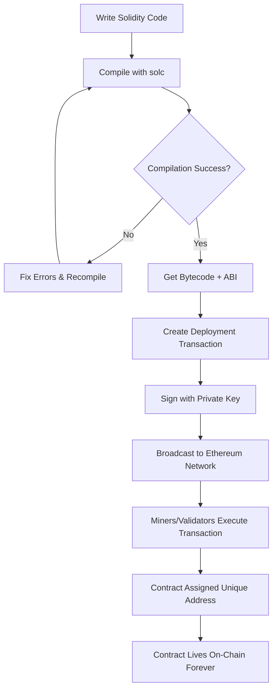
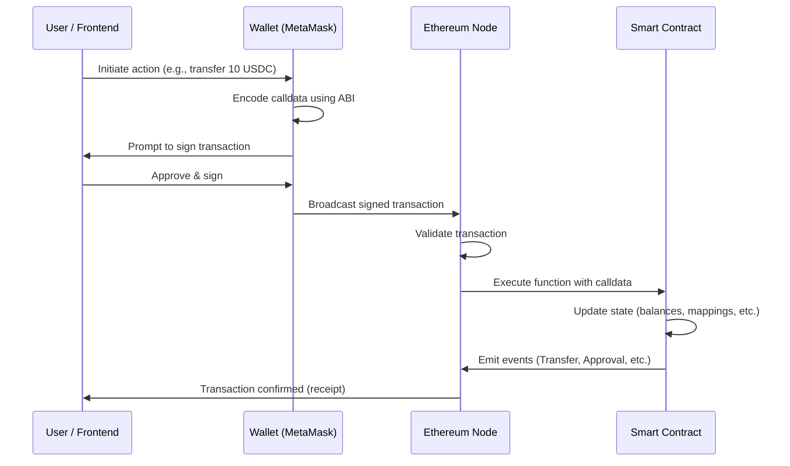

# 08 - Smart Contracts Introduction

> "Code is law." — Web3 duniya ka ek foundational principle.

---

## Smart Contract Hota Kya Hai?

Ek **smart contract** basically ek self-executing program hai jo blockchain pe stored rehta hai, aur jab bhi predefined conditions match hoti hain, woh automatically agreement ke terms enforce kar deta hai — koi human beech mein nahi aata.

Socho isko ek aisa code jo:

1. Blockchain pe permanently rehta hai
2. Har baar exactly wahi karega jo likha hai, koi variation nahi
3. Deploy hone ke baad change nahi ho sakta (jab tak specifically upgradeable design na kiya ho)
4. Jab bhi koi transaction trigger kare, automatically execute ho jata hai

Smart contracts ko sabse pehle **Ethereum** ne popular kiya, jise Vitalik Buterin ne 2013 mein introduce kiya tha. Bitcoin mein basic scripting hoti hai, lekin Ethereum ne blockchain pe ek fully **Turing-complete** programming environment laa diya — matlab tum jitna chahe complex logic likh sakte ho.

---

## Vending Machine Wali Analogy

Smart contracts samajhne ka sabse aasan tareeka hai **vending machine analogy**.

Socho ek vending machine hai:

- Tum paisa daalte ho aur button dabate ho (selection)
- Machine check karti hai: "Isne is item ke liye sahi amount diya hai kya?"
- Agar haan → item automatically nikal aata hai
- Agar nahi → paisa wapas aa jata hai

Na koi cashier hai, na koi negotiation, na hi tumhe machine ke owner pe trust karne ki zaroorat hai. Rules seedhe machine ke mechanism mein hi baked-in hain.

Smart contract bhi **bilkul isi tarah** kaam karta hai:

| Vending Machine | Smart Contract |
|---|---|
| Coins daalna | Cryptocurrency bhejna (ETH, tokens) |
| Item select karna | Contract ka function call karna |
| Mechanical rules | Contract code (Solidity) |
| Item dispense karna | Tokens transfer karna / state update karna |
| Cashier ki zaroorat nahi | Bank / lawyer / middleman ki zaroorat nahi |

Jaise hi tum sahi input bhejte ho, contract execute ho jata hai — guaranteed. Koi bhi beech mein aake isko rok nahi sakta, arbitrarily reverse nahi kar sakta, ya "aaj mood nahi hai" bolke kuch aur nahi kar sakta.

---

## Smart Contracts Ke Core Properties

Ye paanch properties samajhna zaroori hai — isse pata chalega smart contracts *kyun* powerful hain, aur unki limitations kya hain.

### 1. Deterministic

Same input do, toh smart contract hamesha **same output** dega. Koi randomness nahi, koi ambiguity nahi, "judge ka mood kaisa hai" wala scene bilkul nahi. Ethereum network ka har node same code run karta hai aur same result pe pahunchta hai — isi se consensus maintain hota hai.

> Yahi wajah hai ki smart contracts **natively external APIs call nahi kar sakte** — kyunki internet non-deterministic hai. (Oracles ke baare mein neeche detail mein baat karenge.)

### 2. Transparent

Smart contract ka code blockchain pe **publicly readable** hota hai. Koi bhi on-chain bytecode dekh sakta hai, aur agar source code verified hai (jaise Etherscan pe), toh koi bhi exact logic padh sakta hai jo contract ko control karta hai. Koi hidden clause nahi hoti.

### 3. Immutable

Ek baar deploy hone ke baad, smart contract ka code **change nahi ho sakta**. Ye ek strength bhi hai aur limitation bhi. Iska matlab hai ki koi bhi — developer bhi nahi — baad mein chupke se rules badal nahi sakta. Lekin iska ye bhi matlab hai ki bugs permanent ho jate hain, jab tak upgrade patterns (jaise proxies) use na kiye jaayein.

### 4. Trustless

Tumhe doosri party pe, kisi company pe, ya government pe trust karne ki zaroorat nahi. Tumhe sirf **code pe trust** karna hai. Chunki code transparent aur immutable hai, tum interact karne se pehle hi exactly verify kar sakte ho ki kya hone wala hai.

### 5. Permissionless

Jiske paas bhi Ethereum address hai, woh koi bhi smart contract deploy kar sakta hai ya usse interact kar sakta hai. Koi application process nahi, koi KYC requirement nahi (protocol level pe), aur koi gatekeeping authority nahi.

---

## Smart Contracts Deploy Kaise Hote Hain

Smart contract deploy karna basically tumhare contract ko permanently blockchain pe likhne ka process hai. Under the hood ye hota hai:

```
Source Code (.sol) → Compiler (solc) → Bytecode + ABI
                                              |
                                    Deployment Transaction
                                              |
                                    Ethereum Network
                                              |
                                    Contract Address (permanent)
```

### Bytecode

Jab tum Solidity smart contract likhte ho aur usko compile karte ho, compiler (`solc`) tumhare human-readable code ko **EVM bytecode** mein convert kar deta hai — instructions ka ek low-level set jo Ethereum Virtual Machine (EVM) execute kar sakti hai. Ye bytecode hi actually chain pe store hota hai.

Bytecode ko blockchain duniya ka compiled machine code samajh lo.

### ABI (Application Binary Interface)

**ABI** basically tumhare smart contract ke public interface ka ek JSON description hai. Ye bahar ki duniya ko batata hai:

- Contract pe kaunse functions exist karte hain
- Har function kaunse parameters leta hai
- Un parameters ke data types kya hain
- Functions kya values return karte hain

**Restaurant menu wali analogy:** Socho ek restaurant kitchen hai (smart contract). Tum seedhe kitchen mein jaake chefs se directly interact nahi kar sakte. Uski jagah, menu (ABI) tumhe batata hai ki tum kya order kar sakte ho (functions), kya options available hain (parameters), aur tumhe kya milega (return values). Tum menu ke through interact karte ho, aur kitchen baaki sab handle karti hai.

Ek simplified ABI entry kuch aisi dikhti hai:

```json
[
  {
    "name": "transfer",
    "type": "function",
    "inputs": [
      { "name": "recipient", "type": "address" },
      { "name": "amount",    "type": "uint256" }
    ],
    "outputs": [
      { "name": "", "type": "bool" }
    ],
    "stateMutability": "nonpayable"
  }
]
```

ABI ke bina, tumhara frontend ya script ko pata hi nahi chalega ki data ko sahi tarike se encode karke contract ko kaise call karna hai. ABI human-readable code aur EVM ke samajhne wale raw bytes ke beech ka pul hai.

---

## Contract Deployment Flow



---

## Smart Contract Function Kaise Call Karein

Ek baar contract kisi address pe deploy ho jaaye, toh koi bhi Ethereum account usse interact kar sakta hai — ya toh **transaction** bhejke (state-changing functions ke liye) ya **call** karke (read-only functions ke liye).

Do tarah ke interactions hote hain:

| Type | State Change? | Gas Lagta Hai? | Example |
|---|---|---|---|
| **Transaction** | Haan | Haan | Tokens transfer karna, vote karna, NFT mint karna |
| **Call (view/pure)** | Nahi | Nahi | Balance check karna, owner dekhna |

### Interaction Flow



### Calldata Kya Hai?

Jab tum smart contract ka function call karte ho, inputs **calldata** ke roop mein encode hote hain — ye ek binary encoding hai jisme function selector (function signature ke keccak256 hash ke pehle 4 bytes) aur ABI-encoded arguments hote hain. Tumhara wallet ye sab automatically handle kar leta hai, bas usko ABI chahiye hota hai.

---

## Real-World Use Cases

Smart contracts ek bahut bada ecosystem power karte hain. Sabse important categories dekhte hain:

### Token Transfers (ERC-20)

**ERC-20** standard fungible tokens ke liye ek smart contract interface define karta hai — matlab aise tokens jahan har unit identical hai (jaise rupaye). USDC, LINK, UNI, aur hazaaron doosre tokens ERC-20 contracts hain. Jab tum "kisi ko USDC bhejte ho," toh tum actually USDC smart contract ka `transfer()` function call kar rahe hote ho — bilkul UPI transaction jaisa, bas ledger blockchain pe hoti hai.

### NFT Ownership (ERC-721)

**ERC-721** standard non-fungible tokens define karta hai — jahan har token unique hota hai. CryptoPunks, Bored Apes, aur zyada tar digital art collections ERC-721 use karte hain. Contract mein ek mapping hoti hai token ID se owner address tak. NFT "own karna" ka matlab hai ki tumhara address us contract mein owner ke roop mein record hai.

### DeFi Lending

**Aave** aur **Compound** jaise protocols smart contracts use karke bina bank ke lending aur borrowing enable karte hain. Tum ETH collateral ke roop mein deposit karte ho; contract automatically calculate karta hai tum kitna borrow kar sakte ho, interest rates track karta hai, aur agar tumhare collateral ki value threshold se neeche gir jaaye toh position liquidate kar deta hai — sab kuch code se enforce hota hai.

### Decentralized Autonomous Organizations (DAOs)

**DAO** ek aisi organization hai jo smart contracts se govern hoti hai. Token holders proposals pe vote karte hain (jaise "100,000 USDC ek project fund karne ke liye allocate karo"). Contract votes tally karta hai aur agar quorum aur approval thresholds meet ho jaayein, toh proposal automatically execute kar deta hai — koi board of directors ki zaroorat nahi.

### On-Chain Voting

Governments aur companies **voting smart contracts** ke saath experiment kar rahi hain, jahan har eligible address ko ek vote milta hai, results transparently on-chain tally hote hain, aur outcome koi bhi verify kar sakta hai. Isse ek central vote-counting authority pe trust karne ki zaroorat khatam ho jaati hai.

---

## Smart Contracts Ki Limitations

Smart contracts powerful hain, lekin unki kuch real limitations hain jo har Web3 developer ko samajhni chahiye.

### External Data Ko Natively Access Nahi Kar Sakte

Chunki smart contracts ko **deterministic** hona zaroori hai, ye HTTP requests nahi bana sakte ya external APIs call nahi kar sakte. EVM run karne wale har node ko same result pe pahunchna hi hoga — agar ek node `$ETH = $3,200` fetch kare aur doosra node ek second baad `$ETH = $3,201` fetch kare, toh consensus toot jayega.

Isko **oracle problem** kehte hain.

### Immutability Bhi Ek Risk Hai

Wahi immutability jo smart contracts ko trustworthy banati hai, wahi bugs ko catastrophic bana deti hai. Agar deployed contract mein koi vulnerability hai, toh usse seedhe patch nahi kiya ja sakta. 2016 ke DAO hack mein ek immutable contract ke reentrancy bug ke through ~$60M ka ETH drain ho gaya tha. Developers ko deliberately aur carefully upgrade patterns (proxy contracts) use karne padte hain agar unhe baad mein bugs fix karne ki flexibility chahiye.

### Gas Costs Aur Complexity Limits

Ethereum pe har computation ka **gas** lagta hai (ETH mein pay karna padta hai). Complex logic expensive hota hai. Smart contracts efficiently likhne padte hain, aur kuch computationally heavy operations (jaise bade arrays pe iterate karna) bahut costly ho sakte hain ya gas limits hit kar sakte hain.

### Native Randomness Nahi Hai

Ek deterministic machine pe randomness bina external input ke impossible hai. On-chain hacks ne pseudo-random number generation exploit kiya hai (jaise `block.timestamp` ko seed ke roop mein use karna). Secure randomness ke liye bhi oracles chahiye hote hain.

---

## Oracles: Bahar Ki Duniya Ko Andar Laana

Ek **oracle** ek aisi service hai jo external, real-world data ko trustworthy tarike se smart contract mein feed karti hai.

**Chainlink** sabse leading decentralized oracle network hai. Ye independent node operators ke ek network ka use karke off-chain data fetch aur aggregate karta hai, phir usse tamper-resistant tarike se on-chain deliver karta hai.

Common oracle use cases:

| Data Type | Example Use |
|---|---|
| Asset prices (ETH/USD) | DeFi liquidation thresholds |
| Randomness (VRF) | Fair NFT minting, lotteries |
| Weather data | Parametric insurance contracts |
| Sports scores | Prediction market resolution |
| Cross-chain data | Bridging protocols |

Jaise ek DeFi lending protocol, current ETH/USD price jaanne ke liye Chainlink **Price Feed** oracle use karta hai. Jab ETH collateral threshold se neeche girta hai, contract position liquidate kar deta hai — lekin isse ETH ka price pata hi tabhi chalta hai jab Chainlink usse batata hai.

---

## Key Takeaways

- **Smart contract** blockchain pe self-executing code hai jo conditions match hone pe automatically run hota hai — koi intermediary nahi chahiye.
- **Vending machine analogy**: sahi input do, toh output hamesha guaranteed hai — trust nahi, code enforce karta hai.
- Core properties: **deterministic, transparent, immutable, trustless, permissionless**.
- Deployment se do artifacts milte hain: **bytecode** (jo chain pe run hota hai) aur **ABI** (interface description jo contract se interact karne mein help karta hai).
- **ABI** ek restaurant menu jaisa hai — ye batata hai kaunse functions hain, kya input lete hain, aur kya return karte hain.
- Smart contracts power karte hain **tokens (ERC-20), NFTs (ERC-721), DeFi, DAOs, aur voting systems**.
- Key limitations: **native API access nahi hai** (oracles chahiye), **immutability** ka matlab bugs permanent, aur computation pe **gas costs** lagte hain.
- **Chainlink** real-world data ko blockchain pe laane ke liye leading oracle solution hai.

---

## Quiz

Aage badhne se pehle apni understanding test karo.

**Question 1**

Tumhe ek ERC-20 contract pe kisi address ka token balance check karna hai. Ye operation blockchain pe koi state change nahi karta. Kaunsa type ka interaction use karoge, aur kya isme gas lagega?

<details>
<summary>Show Answer</summary>

Tumhe ek **call** (`view` function call) use karna chahiye. Chunki isse state change nahi hoti, isliye ye transaction nahi maangta aur gas **nahi** lagta. Nodes result locally serve kar sakte hain, network pe kuch broadcast karne ki zaroorat nahi.

</details>

---

**Question 2**

Ek developer ne smart contract deploy kiya jisme ek critical bug hai. Unhe realize hota hai ki isse fix karna hai. Ab kya hoga, aur kaunsa pattern help kar sakta tha?

<details>
<summary>Show Answer</summary>

Chunki smart contracts **immutable** hote hain, deployed bytecode change nahi ho sakta. Bug us contract mein permanent hai. Isko address karne ke liye, developers **proxy upgrade patterns** use karte hain (jaise OpenZeppelin ka Transparent Proxy ya UUPS pattern), jo logic contract ko storage contract se alag kar dete hain — isse logic ko swap kiya ja sakta hai, jabki state aur same address preserve rehte hain.

</details>

---

**Question 3**

Ek DeFi protocol chahta hai ki ETH/USD price $2,000 se neeche jaane pe loan automatically liquidate ho jaaye. Smart contract ko current ETH price jaanna hai. Ye seedhe kisi API se fetch kyun nahi kar sakta, aur developers kaunsa solution use karte hain?

<details>
<summary>Show Answer</summary>

Smart contracts **deterministic** hone chahiye — Ethereum network ka har node contract run karta hai aur same result pe pahunchna zaroori hai. Agar har node independently ek live price API se fetch kare, toh alag-alag time pe thodi different values milengi, aur consensus toot jayega. Solution hai ek **oracle** (jaise Chainlink Price Feeds), jo ek single agreed-upon price ko decentralized aur tamper-resistant tarike se blockchain pe deliver karta hai, taaki har node same on-chain value padhe.

</details>

---

*Next Chapter: Writing Your First Smart Contract in Solidity*
