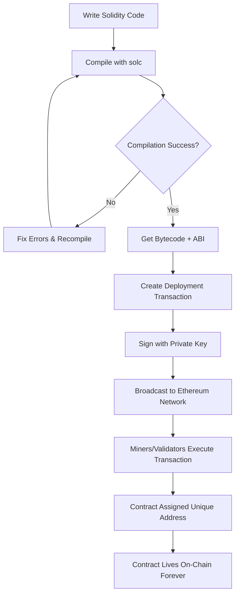
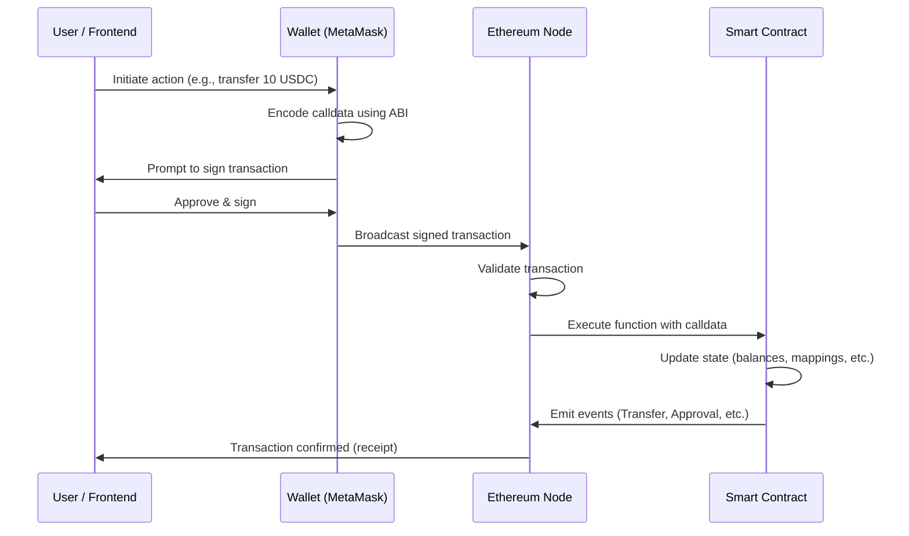

# 08 - Smart Contracts Introduction

> "Code is law." — A foundational principle in the Web3 world.

---

## What Is a Smart Contract?

A **smart contract** is a self-executing program stored on a blockchain that automatically enforces the terms of an agreement when predefined conditions are met — with no human intermediary required.

Think of it as a piece of code that:

1. Lives permanently on the blockchain
2. Runs exactly as written, every single time
3. Cannot be altered once deployed (unless specifically designed to be upgradeable)
4. Executes automatically when triggered by a transaction

Smart contracts were first popularized by **Ethereum**, introduced by Vitalik Buterin in 2013. While Bitcoin supports basic scripting, Ethereum brought a fully **Turing-complete** programming environment to the blockchain, enabling arbitrarily complex logic.

---

## The Vending Machine Analogy

The easiest way to understand smart contracts is through the **vending machine analogy**.

Imagine a vending machine:

- You insert money and press a button (selection)
- The machine checks: "Did I receive the correct amount for this item?"
- If yes → it dispenses the item automatically
- If no → it returns your money

No cashier. No negotiation. No trust required between you and the machine owner. The rules are baked into the machine's mechanism itself.

A smart contract works **exactly the same way**:

| Vending Machine | Smart Contract |
|---|---|
| Insert coins | Send cryptocurrency (ETH, tokens) |
| Select item | Call a contract function |
| Mechanical rules | Contract code (Solidity) |
| Dispenses item | Transfers tokens / updates state |
| No cashier needed | No bank / lawyer / middleman needed |

The moment you send the correct input, the contract executes — guaranteed. Nobody can interfere, reverse it arbitrarily, or decide to do something different that day.

---

## Core Properties of Smart Contracts

Understanding these five properties is essential to understanding *why* smart contracts are powerful — and where they have limitations.

### 1. Deterministic

Given the same inputs, a smart contract always produces the **same output**. There is no randomness, no ambiguity, no "it depends on the judge's mood." Every node on the Ethereum network runs the same code and reaches the same result, which is how consensus is maintained.

> This is also why smart contracts **cannot natively call external APIs** — the internet is non-deterministic. (More on oracles below.)

### 2. Transparent

Smart contract code is **publicly readable** on the blockchain. Anyone can view the bytecode on-chain, and if the source code is verified (e.g., on Etherscan), anyone can read the exact logic governing the contract. There are no hidden clauses.

### 3. Immutable

Once deployed, a smart contract's code **cannot be changed**. This is both a strength and a limitation. It means no one — not even the developer — can silently alter the rules after the fact. However, it also means bugs are permanent unless upgrade patterns (like proxies) are used.

### 4. Trustless

You don't need to trust the other party, a company, or a government. You only need to **trust the code**. Since the code is transparent and immutable, you can verify exactly what will happen before you interact with the contract.

### 5. Permissionless

Anyone with an Ethereum address can deploy or interact with a smart contract. There is no application process, no KYC requirement (at the protocol level), and no gatekeeping authority.

---

## How Smart Contracts Are Deployed

Deploying a smart contract is the process of writing your contract permanently onto the blockchain. Here is what happens under the hood:

```
Source Code (.sol) → Compiler (solc) → Bytecode + ABI
                                              |
                                    Deployment Transaction
                                              |
                                    Ethereum Network
                                              |
                                    Contract Address (permanent)
```

### Bytecode

When you write a Solidity smart contract and compile it, the compiler (`solc`) converts your human-readable code into **EVM bytecode** — a low-level set of instructions that the Ethereum Virtual Machine (EVM) can execute. This bytecode is what actually gets stored on-chain.

Think of bytecode as the compiled machine code equivalent for the blockchain world.

### ABI (Application Binary Interface)

The **ABI** is a JSON description of your smart contract's public interface. It tells the outside world:

- What functions exist on the contract
- What parameters each function takes
- What data types those parameters are
- What values the functions return

**The restaurant menu analogy:** Imagine a restaurant kitchen (the smart contract). You can't walk into the kitchen and directly interact with the chefs. Instead, the menu (ABI) tells you what you can order (functions), what options are available (parameters), and what you'll receive (return values). You interact through the menu, and the kitchen handles the rest.

Here is what a simplified ABI entry looks like:

```json
[
  {
    "name": "transfer",
    "type": "function",
    "inputs": [
      { "name": "recipient", "type": "address" },
      { "name": "amount",    "type": "uint256" }
    ],
    "outputs": [
      { "name": "", "type": "bool" }
    ],
    "stateMutability": "nonpayable"
  }
]
```

Without the ABI, your frontend or script would have no idea how to encode the data correctly to call the contract. The ABI bridges the gap between human-readable code and the raw bytes the EVM understands.

---

## Contract Deployment Flow



---

## How to Call a Smart Contract Function

Once a contract is deployed at an address, any Ethereum account can interact with it by sending a **transaction** (for state-changing functions) or making a **call** (for read-only functions).

There are two types of interactions:

| Type | Changes State? | Costs Gas? | Example |
|---|---|---|---|
| **Transaction** | Yes | Yes | Transfer tokens, vote, mint NFT |
| **Call (view/pure)** | No | No | Read a balance, check an owner |

### The Interaction Flow



### What is Calldata?

When you call a smart contract function, the inputs are encoded as **calldata** — a binary encoding of the function selector (first 4 bytes of the keccak256 hash of the function signature) plus the ABI-encoded arguments. Your wallet handles this automatically when given an ABI.

---

## Real-World Use Cases

Smart contracts power an enormous ecosystem. Here are the most important categories:

### Token Transfers (ERC-20)

The **ERC-20** standard defines a smart contract interface for fungible tokens — tokens where every unit is identical (like dollars). USDC, LINK, UNI, and thousands of other tokens are ERC-20 contracts. When you "send USDC to someone," you are calling the `transfer()` function on the USDC smart contract.

### NFT Ownership (ERC-721)

The **ERC-721** standard defines non-fungible tokens — each token is unique. CryptoPunks, Bored Apes, and most digital art collections use ERC-721. The contract maintains a mapping of token ID to owner address. "Owning" an NFT means your address is recorded as the owner in that contract.

### DeFi Lending

Protocols like **Aave** and **Compound** use smart contracts to enable lending and borrowing without a bank. You deposit ETH as collateral; the contract automatically calculates how much you can borrow, tracks interest rates, and liquidates your position if your collateral value drops below a threshold — all enforced by code.

### Decentralized Autonomous Organizations (DAOs)

A **DAO** is an organization governed by smart contracts. Token holders vote on proposals (e.g., "allocate 100,000 USDC to fund a project"). The contract tallies votes and, if quorum and approval thresholds are met, automatically executes the proposal — no board of directors required.

### On-Chain Voting

Governments and companies are experimenting with **voting smart contracts** where each eligible address gets one vote, results are tallied transparently on-chain, and the outcome is verifiable by anyone. It removes the need to trust a central vote-counting authority.

---

## Limitations of Smart Contracts

Smart contracts are powerful, but they have real limitations that every Web3 developer must understand.

### Cannot Access External Data Natively

Because smart contracts must be **deterministic**, they cannot make HTTP requests or call external APIs. Every node running the EVM must reach the same result — if one node fetches `$ETH = $3,200` and another fetches `$ETH = $3,201` a second later, consensus breaks.

This is the **oracle problem**.

### Immutability as a Risk

The same immutability that makes smart contracts trustworthy makes bugs catastrophic. If a vulnerability exists in a deployed contract, it cannot simply be patched. The DAO hack of 2016 drained ~$60M in ETH through a reentrancy bug in an immutable contract. Developers must use upgrade patterns (proxy contracts) deliberately and carefully if they want the ability to fix bugs later.

### Gas Costs and Complexity Limits

Every computation on Ethereum costs **gas** (paid in ETH). Complex logic is expensive. Smart contracts must be written efficiently, and some computationally intensive operations (e.g., iterating over large arrays) can be prohibitively costly or hit gas limits entirely.

### No Native Randomness

Randomness on a deterministic machine is impossible without external input. On-chain hacks have exploited pseudo-random number generation (e.g., using `block.timestamp` as a seed). Secure randomness requires oracles too.

---

## Oracles: Bringing the Outside World In

An **oracle** is a service that feeds external, real-world data into a smart contract in a trustworthy way.

**Chainlink** is the leading decentralized oracle network. It uses a network of independent node operators to fetch and aggregate off-chain data, then deliver it on-chain in a way that is tamper-resistant.

Common oracle use cases:

| Data Type | Example Use |
|---|---|
| Asset prices (ETH/USD) | DeFi liquidation thresholds |
| Randomness (VRF) | Fair NFT minting, lotteries |
| Weather data | Parametric insurance contracts |
| Sports scores | Prediction market resolution |
| Cross-chain data | Bridging protocols |

A DeFi lending protocol, for example, uses a Chainlink **Price Feed** oracle to know the current ETH/USD price. When ETH drops below the collateral threshold, the contract liquidates the position — but it only knows ETH's price because Chainlink told it.

---

## Key Takeaways

- A **smart contract** is self-executing code on a blockchain that runs automatically when conditions are met — no intermediary required.
- The **vending machine analogy**: correct input always guarantees the same output, enforced by code rather than trust.
- Core properties: **deterministic, transparent, immutable, trustless, permissionless**.
- Deployment produces two artifacts: **bytecode** (what runs on-chain) and the **ABI** (the interface description that lets you interact with the contract).
- The **ABI** is like a restaurant menu — it tells you what functions exist, what inputs they take, and what they return.
- Smart contracts power **tokens (ERC-20), NFTs (ERC-721), DeFi, DAOs, and voting systems**.
- Key limitations: **no native API access** (requires oracles), **immutability** means bugs are permanent, and computation has **gas costs**.
- **Chainlink** is the leading oracle solution for bringing real-world data onto the blockchain.

---

## Quiz

Test your understanding before moving on.

**Question 1**

You want to check the token balance of an address on an ERC-20 contract. This operation does NOT change any state on the blockchain. What type of interaction should you use, and does it cost gas?

<details>
<summary>Show Answer</summary>

You should use a **call** (a `view` function call). Because it does not change state, it does not require a transaction and does **not** cost gas. Nodes can serve the result locally without broadcasting anything to the network.

</details>

---

**Question 2**

A developer deploys a smart contract with a critical bug. They realize they need to fix it. What happens, and what pattern could have helped?

<details>
<summary>Show Answer</summary>

Because smart contracts are **immutable**, the deployed bytecode cannot be changed. The bug is permanent in that contract. To address this, developers use **proxy upgrade patterns** (e.g., OpenZeppelin's Transparent Proxy or UUPS pattern), which separate the logic contract from the storage contract, allowing the logic to be swapped out while preserving state and the same address.

</details>

---

**Question 3**

A DeFi protocol wants to automatically liquidate a loan when the ETH/USD price drops below $2,000. The smart contract needs to know the current ETH price. Why can't it simply fetch this from an API, and what solution do developers use?

<details>
<summary>Show Answer</summary>

Smart contracts must be **deterministic** — every node on the Ethereum network runs the contract and must reach the same result. If each node fetched a live price from an API independently, they would get slightly different values at different times, breaking consensus. The solution is an **oracle** (such as Chainlink Price Feeds), which delivers a single agreed-upon price onto the blockchain in a decentralized and tamper-resistant way, so every node reads the same on-chain value.

</details>

---

*Next Chapter: Writing Your First Smart Contract in Solidity*
