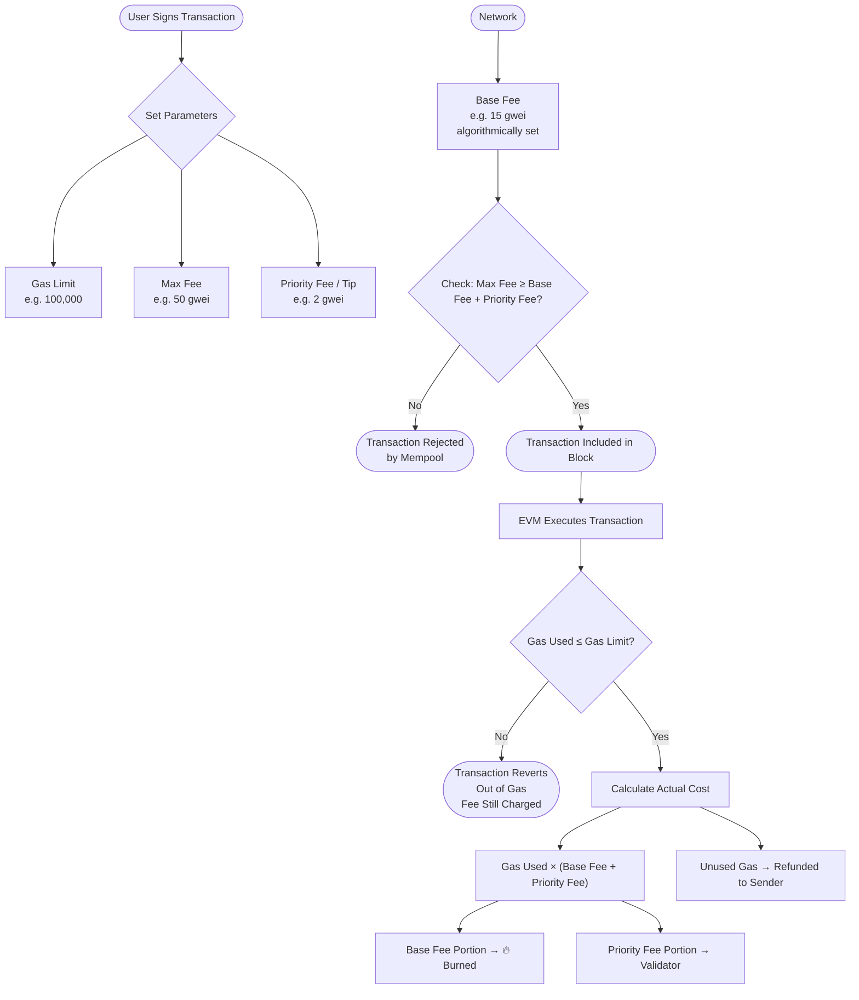

# ⛽ Gas and Fees on Ethereum

> **Level:** Beginner | **Chapter:** 09 | **Topic:** Blockchain Fundamentals

---

## 🎯 What You Will Learn

By the end of this chapter, you will understand how Ethereum's fee market works, why gas exists, how EIP-1559 changed everything, and why gas optimization matters when you write smart contracts.

---

## ⚙️ What Is Gas?

Think of Ethereum as a massive, distributed computer. Every time you ask that computer to do something — send tokens, deploy a contract, call a function — it has to perform actual computational work. **Gas is the unit that measures that work.**

A helpful analogy: imagine Ethereum is a car and every operation is a road you need to drive down. Gas is the fuel. A short drive (simple ETH transfer) costs a small amount of fuel. A long highway trip through a complex contract with loops and storage writes burns much more.

Every single operation the Ethereum Virtual Machine (EVM) executes has a fixed gas cost defined in the Ethereum Yellow Paper. Adding two numbers costs 3 gas. Reading from storage costs 2100 gas. Writing to storage costs 20,000 gas.

### Why Is Everything So Precise?

Because every full node on the Ethereum network re-executes every transaction to verify it. The gas cost must be deterministic — the same operation must always cost the same gas — so all nodes agree on the outcome without trusting each other.

---

## 🛡️ Why Does Gas Exist?

Gas solves two critical problems:

### 1. Preventing Infinite Loops (the Halting Problem)

Without a cost mechanism, a malicious actor could deploy a contract with an infinite loop:

```solidity
// This would hang every node forever without gas limits
while (true) {
    // do nothing, forever
}
```

Because every operation costs gas, and every transaction has a **gas limit**, infinite loops simply run out of gas and revert. The attacker loses their fee. The network is protected.

### 2. Compensating Validators

Validators (formerly miners under Proof of Work) spend real-world resources — hardware, electricity, capital — to process transactions and secure the network. Gas fees are the economic incentive that makes it worthwhile for them to do this work honestly.

---

## 📐 Gas Price vs Gas Limit vs Gas Used

These three terms confuse nearly every beginner. Here is a clear breakdown:

| Term | What It Is | Who Sets It |
|---|---|---|
| **Gas Limit** | The maximum amount of gas you authorize the transaction to consume | You (the sender) |
| **Gas Price** | How much ETH you pay per unit of gas (pre-EIP-1559 concept) | You (the sender) |
| **Gas Used** | The actual gas consumed when the transaction executes | The EVM |

### The Key Rule

If `gas used` exceeds `gas limit`, the transaction **reverts** — all state changes are rolled back — but you still pay for the gas used up to that point. You cannot get a refund for failed computation.

If `gas used` is less than `gas limit`, you are only charged for what was actually used. The unused gas is refunded to you.

---

## 🔄 EIP-1559: The Fee Market Revolution

Before August 2021, Ethereum used a simple first-price auction. You broadcast a gas price, miners picked the highest bids, and fees were wildly unpredictable. During network congestion, fees could spike 10x in minutes.

**EIP-1559** (activated in the London hard fork) introduced a fundamentally different model with three components.

### 1. Base Fee

The base fee is an algorithmically determined minimum price to get your transaction included in a block.

- **Set by the protocol**, not by users
- **Burned (destroyed)** — it does not go to validators
- **Adjusts automatically** based on network demand:
  - If the previous block was more than 50% full, the base fee increases by up to 12.5%
  - If the previous block was less than 50% full, the base fee decreases by up to 12.5%

This makes the base fee predictable over short time horizons. Wallets can accurately estimate it, and users are not forced into guessing games.

> **Why burn it?** Burning the base fee reduces ETH supply over time, making ETH deflationary during high-activity periods. It also prevents validators from gaming the fee by including their own zero-fee transactions to artificially inflate block fullness.

### 2. Priority Fee (Tip)

The priority fee is an optional tip paid directly to the validator who includes your transaction.

- **Set by you**, the sender
- **Goes to the validator** in full
- Incentivizes validators to prioritize your transaction over others during congestion

During low congestion, a 1 gwei tip is often sufficient. During a hot NFT mint, you might tip 100+ gwei to jump the queue.

### 3. Max Fee

Because the base fee can change between the time you sign a transaction and when it gets included, you set a **max fee** — the absolute ceiling of what you are willing to pay per unit of gas.

The actual amount paid per unit of gas is always:

```
actual fee per gas = base fee + priority fee
```

But it will never exceed your max fee. Any difference between `max fee` and `base fee + priority fee` is refunded to you.

---

## 🧮 Calculating Transaction Cost

Here is the complete formula:

```
Total Cost (ETH) = Gas Used × (Base Fee + Priority Fee)
```

### Worked Example

Suppose you send an ETH transfer:

- Gas used: 21,000 (standard cost for a simple ETH transfer)
- Base fee: 15 gwei
- Priority fee: 2 gwei

```
Total = 21,000 × (15 + 2) gwei
      = 21,000 × 17 gwei
      = 357,000 gwei
      = 0.000357 ETH
```

At an ETH price of $3,000, this costs about $1.07.

### Gas Fee Calculation Flow



---

## 💥 Why Transactions Fail: "Out of Gas"

When a transaction runs out of gas before completing, the EVM throws an out-of-gas exception. Everything reverts — storage changes, token transfers, event emissions — as if the call never happened. But the gas consumed up to that point is not refunded.

Common causes:

1. **Gas limit set too low** — the estimate was wrong or the contract logic is more expensive than anticipated
2. **Unexpected code paths** — the transaction hit a branch that costs significantly more gas than the estimated path
3. **Dynamic loops** — a loop that iterates over an array that grew since the gas estimate was made
4. **Reentrancy guards and checks** — additional logic added after the estimate

The fix is straightforward: use `eth_estimateGas` to get an accurate estimate, then add a small buffer (10–20%).

---

## 📊 Gas Costs for Common EVM Operations

| Opcode | Operation | Gas Cost |
|---|---|---|
| `ADD` | Integer addition | 3 |
| `MUL` | Integer multiplication | 5 |
| `DIV` | Integer division | 5 |
| `SHA3` | Keccak-256 hash | 30 + 6/word |
| `SLOAD` | Read from contract storage (cold) | 2,100 |
| `SLOAD` | Read from contract storage (warm) | 100 |
| `SSTORE` | Write to storage (new value) | 20,000 |
| `SSTORE` | Update existing storage slot | 2,900 |
| `SSTORE` | Clear a storage slot (refund eligible) | 2,900 |
| `CALL` | External contract call (cold address) | 2,600 |
| `LOG0` | Emit event (no topics) | 375 + 8/byte |
| `LOG3` | Emit event (3 topics) | 1,500 + 8/byte |
| `CREATE` | Deploy a new contract | 32,000 |
| `CODECOPY` | Copy code to memory | 3 + 3/word |
| ETH Transfer | Simple ETH send (no data) | 21,000 (fixed) |

> **Cold vs Warm:** Since EIP-2929, accessing a storage slot or address for the first time in a transaction costs more (cold access). Subsequent accesses in the same transaction are cheaper (warm access) because the data is already in a local cache.

The most expensive operations are almost always **storage writes (`SSTORE`)**. This is the single most important fact for smart contract gas optimization.

---

## 🔍 How to Estimate Gas

### eth_estimateGas

The standard JSON-RPC method for gas estimation simulates a transaction against the current chain state and returns the gas that would be consumed.

```javascript
const { ethers } = require("ethers");

const provider = new ethers.JsonRpcProvider("https://mainnet.infura.io/v3/YOUR_KEY");

// Estimate gas for a simple ETH transfer
const estimate = await provider.estimateGas({
  from: "0xYourAddress",
  to: "0xRecipientAddress",
  value: ethers.parseEther("0.1"),
});

console.log(`Estimated gas: ${estimate.toString()}`);
// Output: Estimated gas: 21000

// Estimate gas for a contract call
const contract = new ethers.Contract(contractAddress, abi, provider);
const gasEstimate = await contract.someFunction.estimateGas(arg1, arg2);
console.log(`Contract call gas: ${gasEstimate.toString()}`);
```

### Practical Tips for Gas Estimation

- Always add a **10–20% buffer** above the estimate for production transactions
- For contracts with dynamic loops over user-supplied data, the estimate can be wildly off if the on-chain state changes between estimate time and inclusion time
- Use tools like **Hardhat's gas reporter** (`hardhat-gas-reporter`) to see gas costs for every function during testing

---

## 🛠️ Gas Optimization for Smart Contract Developers

Gas optimization is not premature optimization in Solidity — it is a core responsibility. High gas costs make your contract unusable. Here are the most impactful techniques:

### Use `calldata` Instead of `memory` for External Function Parameters

```solidity
// Expensive: copies data to memory
function process(string memory data) external { ... }

// Cheaper: reads directly from calldata
function process(string calldata data) external { ... }
```

### Pack Storage Variables

The EVM reads and writes 32-byte storage slots. If you store a `uint128` and a `uint128` in separate slots, you pay 40,000 gas. Pack them together, and you pay 20,000 gas for one slot write.

```solidity
// Bad: two storage slots
uint256 public a;
uint256 public b;

// Good: one storage slot (both fit in 32 bytes)
uint128 public a;
uint128 public b;
```

### Cache Storage Reads in Memory

Every `SLOAD` costs 100–2,100 gas. If you read the same variable multiple times in a function, cache it.

```solidity
// Bad: three SLOADs
function bad() external {
    require(count > 0);
    emit Log(count);
    count -= 1;
}

// Good: one SLOAD
function good() external {
    uint256 _count = count; // single SLOAD
    require(_count > 0);
    emit Log(_count);
    count = _count - 1;
}
```

### Use `uint256` Over Smaller Integers (Mostly)

The EVM operates natively on 256-bit words. Using `uint8` inside a function (not a struct) often costs *more* gas because the EVM must mask bits to simulate smaller types.

### Short-Circuit Expensive Operations

Revert early with cheap checks before running expensive operations.

```solidity
function withdraw(uint256 amount) external {
    require(amount > 0, "Zero amount");        // cheap
    require(balances[msg.sender] >= amount);    // one SLOAD, cheaper
    _complexCalculation();                      // expensive — only runs if above pass
}
```

---

## 🚀 Layer 2 Solutions and Cheaper Gas

Ethereum mainnet processes roughly 15–30 transactions per second, creating consistent demand for block space and keeping gas prices elevated. **Layer 2 (L2) networks** solve this by processing transactions off mainnet and periodically posting compressed proofs or data back to mainnet.

### Why L2 Gas Is Cheaper

| Factor | Mainnet (L1) | Layer 2 |
|---|---|---|
| Transactions per second | ~15–30 | 1,000–10,000+ |
| Block space competition | High | Low |
| Data posted to L1 | Full transactions | Compressed batches |
| Typical gas cost | $1–$50+ | $0.001–$0.10 |

### Major L2 Categories

**Optimistic Rollups** (Optimism, Arbitrum): Execute transactions off-chain, post compressed transaction data to L1, assume transactions are valid unless challenged in a 7-day dispute window.

**ZK Rollups** (zkSync Era, Starknet, Polygon zkEVM): Execute transactions off-chain, generate a cryptographic validity proof (ZK-SNARK or ZK-STARK), post the proof to L1. No challenge period needed — math proves correctness instantly.

**Why They Still Use Some Gas**

Even on L2, you pay gas — but it is denominated in the L2 network's own fee mechanism and is a fraction of mainnet costs because competition for block space is much lower and data compression is aggressive.

---

## 🔑 Key Takeaways

- **Gas** is the unit of computational work on the EVM. Every opcode has a fixed gas cost.
- Gas exists to **prevent infinite loops** and to **compensate validators** for their work.
- Under **EIP-1559**: the base fee is burned and adjusts algorithmically; the priority fee (tip) goes to the validator; the max fee is your ceiling.
- **Transaction cost = Gas Used x (Base Fee + Priority Fee).**
- Transactions that exceed the gas limit **revert and still charge gas** — set limits carefully.
- **Storage writes (`SSTORE`) are the most expensive common operation** — this is the most important gas fact for Solidity developers.
- Use `eth_estimateGas` to estimate gas and add a 10–20% buffer.
- **Layer 2 networks** reduce gas costs by batching transactions and reducing block space competition.

---

## 📝 Quiz

Test your understanding:

**Question 1.** You set a gas limit of 50,000 for a transaction. The EVM uses 60,000 gas before finishing. What happens?

- A) The transaction completes and you are refunded 10,000 gas worth of ETH
- B) The transaction reverts; all state changes are undone; you are charged for 60,000 gas
- C) The transaction reverts; all state changes are undone; you are charged for 50,000 gas
- D) The transaction pauses and waits for you to increase the gas limit

**Question 2.** Under EIP-1559, where does the base fee go?

- A) To the validator who includes the transaction
- B) To the Ethereum Foundation treasury
- C) It is burned (destroyed, reducing ETH supply)
- D) It is split equally between the validator and the next block's proposer

**Question 3.** Which of the following is the most expensive common EVM operation?

- A) `ADD` — integer addition
- B) `SHA3` — keccak-256 hash
- C) `SSTORE` — writing a new value to contract storage
- D) `CALL` — making an external contract call

<details>
<summary>Answers</summary>

1. **C** — The transaction reverts at the gas limit (50,000), undoing all state changes. You are charged for the gas consumed up to the point of failure (50,000), not 60,000, because execution stopped at the limit.
2. **C** — The base fee is burned. This is a core design choice of EIP-1559 to make ETH deflationary during high-activity periods and to prevent validator manipulation of the fee.
3. **C** — `SSTORE` for a new storage value costs 20,000 gas. This dwarfs arithmetic (3–5 gas) and hashing (30+ gas). Minimizing storage writes is the single highest-impact gas optimization in Solidity.

</details>

---

## 📚 Further Reading

- [Ethereum Yellow Paper](https://ethereum.github.io/yellowpaper/paper.pdf) — Appendix G: Fee Schedule (official opcode costs)
- [EIP-1559 Specification](https://eips.ethereum.org/EIPS/eip-1559)
- [EIP-2929: Gas cost increases for state access opcodes](https://eips.ethereum.org/EIPS/eip-2929)
- [Hardhat Gas Reporter](https://github.com/cgewecke/hardhat-gas-reporter)
- [ethgas.watch](https://ethgas.watch/) — Real-time gas price tracker

---

*Next Chapter: 10 - Smart Contract Accounts and EOAs*
