# 🌐 Chapter 10: The Web3 Ecosystem

> **Audience:** Woh developers jo blockchain ke basics samajh chuke hain aur ab poora landscape dekhna chahte hain jismein woh step kar rahe hain.

---

## 🕰️ Web ka Evolution: Library → Social Media → Ownership Economy

Web3 ko samajhne se pehle, thoda peeche chalte hain — dekhte hain isse pehle kya tha.

### Web1 — Read-Only Library (1990s–early 2000s)

Web1 static pages ka internet tha. Users sirf **padh** sakte the, contribute nahi kar sakte the. Socho ek bahut bada digital library — hazaaron encyclopaedia-style pages, jo mostly companies ya universities ke paas the. Tum sirf visitor the, participant kabhi nahi.

- Pages static HTML files hoti thi
- Koi user accounts nahi, koi personalisation nahi
- Information ek hi direction mein flow karti thi: server → user

### Web2 — Social Media Era (mid-2000s–2020s)

Web2 ne users ko power di **padhne aur likhne** ki. Facebook, YouTube, Twitter, Google jaise platforms aaye. Achanak, users hi woh content bana rahe the jo in platforms ko valuable banata tha.

Problem kya hai? **Tumhara us content pe koi ownership nahi hai.** Tumhara data, tumhare followers, tumhara content — sab kisi aur ke server pe reh raha hai. Platform tumhara account delete kar sakta hai, algorithm change kar sakta hai, tumhara data bech sakta hai, ya poora shut down ho sakta hai. Jo value tum create karte ho, woh shareholders ko jaati hai, tumhe nahi.

Zomato pe socho — jitne bhi reviews, ratings, order history tumne banaye, woh sab Zomato ke server pe hai. Kal agar Zomato tumhara account band kar de, sab gayab.

- Dynamic, user-generated content
- Centralised platforms tumhara data control karte hain
- Monetisation intermediaries ke haath mein hoti hai

### Web3 — Ownership Economy (ab aur aage)

Web3 poora model palat deta hai. Users ab **padh, likh, aur own** kar sakte hain. Assets, identity, aur governance rights ki ownership directly blockchain pe encode hoti hai — kisi company ke paas nahi.

Isse aise socho: Web2 mein, tum khud product ho. Web3 mein, tum stakeholder ho.

- Assets (tokens, NFTs) tumhare wallet mein rehte hain, kisi platform pe nahi
- Rules smart contracts enforce karte hain, corporate terms of service nahi
- Communities protocols ko voting se govern karti hain (DAOs)
- Value participants ko flow karti hai, sirf platform owners ko nahi

---

## 🧱 Web3 ke Key Primitives

Yeh Web3 duniya ke building blocks hain. Jo bhi project tumhe milega, woh in mein se kisi na kisi combination ko use karega.

| Primitive | Yeh hai kya | Real-world analogy |
|-----------|-----------|-------------------|
| **Token** | Value ya access ki digital unit | Casino chip ya loyalty point |
| **NFT** | Ek unique, provably scarce digital asset | Physical collectible ya deed |
| **DAO** | Code se governed, member-owned organisation | Ek co-operative ya club jiske bylaws transparent hain |
| **DeFi** | Bina banks/brokers ke financial services | Internet-scale peer-to-peer lending |

---

## 📜 ERC Standards: Ethereum Tokens ki Grammar

Ek **ERC** (Ethereum Request for Comments) ek community-agreed standard hai — smart contracts kaise behave karne chahiye. Standards ka fayda yeh hai ki wallets, exchanges, aur apps kisi bhi compliant token ke saath bina custom code likhe interact kar sakte hain.

### ERC-20 — Fungible Tokens

Kya hota hai? Fungible token woh hota hai jo **interchangeable** hai. Ek unit doosri unit ke barabar hai, bilkul ek dollar note ki tarah. Agar tum mujhe 1 ETH bhejo, main tumhe wapas 1 ETH bhej sakta hoon — dono identical hain.

```solidity
// Har ERC-20 token yeh interface expose karta hai
interface IERC20 {
    function totalSupply() external view returns (uint256);
    function balanceOf(address account) external view returns (uint256);
    function transfer(address to, uint256 amount) external returns (bool);
    function approve(address spender, uint256 amount) external returns (bool);
    function transferFrom(address from, address to, uint256 amount) external returns (bool);
}
```

**Examples:** USDC, DAI, UNI, LINK, AAVE — koi bhi token jo tum exchange pe trade kar sakte ho, woh ERC-20 hai.

### ERC-721 — Non-Fungible Tokens (NFTs)

Har token ka apna unique `tokenId` hota hai. Ek hi contract ke do ERC-721 tokens **interchangeable nahi** hote — token #42, token #43 se bilkul alag hai.

```solidity
interface IERC721 {
    function ownerOf(uint256 tokenId) external view returns (address owner);
    function transferFrom(address from, address to, uint256 tokenId) external;
    function tokenURI(uint256 tokenId) external view returns (string memory);
}
```

**Examples:** CryptoPunks, Bored Ape Yacht Club, ENS domain names, concert tickets.

### ERC-1155 — Multi-Token Standard

Kyun zaruri hai? Ek hi contract **fungible aur non-fungible dono** tokens hold kar sakta hai. Yeh games ke liye perfect hai jahan ek player ke paas 500 gold coins (fungible) ho sakte hain aur 1 legendary sword (non-fungible) — sab ek hi contract mein.

```solidity
interface IERC1155 {
    function balanceOf(address account, uint256 id) external view returns (uint256);
    function safeTransferFrom(address from, address to, uint256 id, uint256 amount, bytes calldata data) external;
    function balanceOfBatch(address[] calldata accounts, uint256[] calldata ids) external view returns (uint256[] memory);
}
```

**Examples:** Opensea Shared Storefront, zyada tar blockchain game items.

---

## 💰 DeFi: Bina Intermediaries ke Finance

DeFi (Decentralised Finance) traditional financial services ko smart contracts ke through recreate karta hai. Koi bank account nahi chahiye — bas ek wallet chahiye.

### Decentralised Exchanges (DEXes) — Uniswap

Kaise kaam karta hai? Ek traditional exchange buyers aur sellers ko order book mein match karta hai. Uniswap iske jagah **liquidity pool** use karta hai. Koi bhi do tokens (jaise ETH + USDC) pool mein deposit kar sakta hai aur trading fees kama sakta hai. Exchange rate ek formula se decide hota hai:

```
x * y = k   (constant product formula)
```

Jahan `x` aur `y` pool reserves hain. Jab tum trade karte ho, ratio shift hoti hai, aur price automatically adjust ho jaata hai. Koi order book nahi. Koi market makers nahi. Bas math.

**Key concept:** Liquidity providers (LPs) fees kamaate hain, lekin **impermanent loss** ka risk bhi jhelte hain — yaani risk ki unke deposit kiye hue tokens ka price ratio unfavourably shift ho jaaye.

### Lending Protocols — Aave aur Compound

Yeh protocols tumhe deti hain:
- **Deposit** karne ka option — interest kamao (jo borrowers supply karte hain)
- **Borrow** karne ka option — collateral post karke (hamesha over-collateralised)

Kyunki koi credit check nahi hoti, borrowers ko jitna borrow karna hai usse zyada value lock karni padti hai. Agar collateral ki value ek threshold se neeche jaati hai, protocol usse automatically **liquidate** kar deta hai lenders ko protect karne ke liye.

**Example flow:** 1 ETH collateral deposit karo → 500 USDC borrow karo → USDC kahin aur use karo → loan + interest repay karo → apna ETH wapas lo.

### Stablecoins

Stablecoins woh tokens hain jo ek stable asset (usually USD) se peg kiye hote hain. Yeh volatility ka problem solve karte hain — tum DeFi mein participate kar sakte ho bina baar baar fiat mein convert kiye.

| Type | Mechanism | Example |
|------|-----------|---------|
| Fiat-backed | 1 token = 1 USD bank mein hold | USDC, USDT |
| Crypto-backed | Crypto se over-collateralised | DAI |
| Algorithmic | Supply/demand algorithms | (historically fragile — LUNA/UST dekho) |

### Yield Farming

Yield farming matlab assets ko ek protocol se doosre protocol mein move karke returns maximise karna. Ek farmer kya kar sakta hai:
1. USDC ko Aave mein deposit karo → `aUSDC` (ek receipt token) milta hai
2. `aUSDC` ko Yearn jaise yield aggregator mein deposit karo → extra governance tokens kamao
3. Woh tokens bech do ya restake karo compounding returns ke liye

Sunne mein lucrative lagta hai, lekin isme **smart contract risk**, **liquidation risk**, aur **impermanent loss** shaamil hai. Zyada yield ka matlab almost hamesha zyada risk hota hai.

> [!warning]
> Jitna zyada return dikh raha ho, utna hi zyada dhyan se check karo — DeFi mein "too good to be true" wahi hota hai jo lagta hai.

---

## 🖼️ NFTs: On-Chain Yeh Actually Kya Hote Hain

Ek common misconception: "NFT hi woh image hai." Aisa nahi hai.

NFT ek `tokenId` ke liye **on-chain ownership record** hai. Contract yeh store karta hai:
- `tokenId → ownerAddress` mapping
- Ek `tokenURI` — ek URL ya IPFS hash jo metadata ki taraf point karta hai

### Metadata

Metadata ek JSON file hai jo asset describe karti hai:

```json
{
  "name": "Bored Ape #8817",
  "description": "The Bored Ape Yacht Club...",
  "image": "ipfs://QmeSjSinHpPnmXmspMjwiXyN6zS4E9zccariGR3jxcaWtq/8817",
  "attributes": [
    { "trait_type": "Background", "value": "New Punk Blue" },
    { "trait_type": "Eyes", "value": "Bored" }
  ]
}
```

Image off-chain rehti hai (usually IPFS pe). Contract sirf pointer store karta hai.

### Art se Aage Use Cases

NFTs ek general-purpose tool hain on-chain unique ownership prove karne ke liye:
- **Gaming:** Items, characters, virtual worlds mein land parcels
- **Ticketing:** Concert ya event tickets, verifiable authenticity ke saath
- **Identity:** ENS domains (`yourname.eth`), Soulbound Tokens (non-transferable credentials)
- **Real-world assets:** Tokenised real estate, bonds, ya invoices
- **Memberships:** Communities ya content ke liye token-gated access

---

## 🏛️ DAOs: Organisations Jo Apne Members Ke Owned Hain

Kya hota hai? Ek **DAO (Decentralised Autonomous Organisation)** traditional corporate hierarchy ko smart contracts aur token-based voting se replace karta hai.

### DAO Kaise Kaam Karta Hai

1. **Governance token** members ko distribute hota hai (purchase, contribution, ya airdrop ke through)
2. Koi bhi member ek **proposal** submit kar sakta hai (jaise, "Naya feature fund karne ke liye 50,000 USDC allocate karo")
3. Token holders apne holdings ke proportional **vote** karte hain
4. Agar proposal pass ho jaata hai, smart contract usse **automatically execute** kar deta hai — koi CEO approval nahi chahiye

### Examples

| DAO | Purpose |
|-----|---------|
| Uniswap DAO | Uniswap protocol ko govern karta hai; UNI holders fees aur upgrades pe vote karte hain |
| MakerDAO | DAI stablecoin system ko govern karta hai; MKR holders risk parameters manage karte hain |
| ENS DAO | Ethereum Name Service ko govern karta hai |
| Nouns DAO | Ek daily NFT auction jiske saare proceeds community treasury mein jaate hain |

### Challenges Kya Hain

- **Voter apathy:** Zyada tar token holders vote nahi karte
- **Plutocracy risk:** Bade holders decisions pe hawi ho sakte hain ("whale votes")
- **Governance attacks:** Koi bad actor tokens accumulate karke malicious proposals pass kara sakta hai
- **Execution speed:** On-chain governance ek startup ke decision cycle ke comparison mein slow hota hai

---

## 🛠️ Developer Tools ka Overview

Ek Solidity developer ke roop mein tumhe yeh toolset milega.

### Smart Contract Development

| Tool | Role | Best For |
|------|------|----------|
| **Hardhat** | JS/TS-based development framework | Node.js mein comfortable teams |
| **Foundry** | Rust-based, Solidity mein hi contracts test karo | Speed demons; fuzzing; gas profiling |
| **Remix IDE** | Browser-based IDE | Quick experiments; absolute beginners |

**Hardhat** tumhe deta hai local blockchain, deployment scripts, aur ek plugin ecosystem (hardhat-ethers, hardhat-verify, etc.).

**Foundry** (forge + cast + anvil) professional standard ban chuka hai. Tests Solidity mein likhe jaate hain — koi context switching nahi. `forge test --gas-report` turant ek gas usage table de deta hai.

**Remix** poora browser mein chalta hai [remix.ethereum.org](https://remix.ethereum.org) pe. Yeh best jagah hai apna pehla contract likhne ke liye, bina kisi local setup ke.

### Frontend / dApp Interaction

| Library | Description |
|---------|-------------|
| **ethers.js** | JS/TS se Ethereum ke saath interact karne ke liye sabse popular library |
| **web3.js** | Original Ethereum JS library; purana API hai, phir bhi widely use hoti hai |
| **viem** | Modern, TypeScript-first, low-level Ethereum client |
| **wagmi** | viem ke upar bane React hooks; React dApps ke liye standard |

**Decision guide:**
- React app bana rahe ho → **wagmi** use karo (yeh under the hood viem ko wrap karta hai)
- Low-level control chahiye ya vanilla JS use kar rahe ho → **viem** ya **ethers.js** use karo
- Legacy codebase maintain kar rahe ho → tumhe likely **web3.js** milega

---

## 📦 IPFS: Decentralised Storage

### Blockchains Files Kyun Store Nahi Karte

Ethereum pe data store karna gas cost karta hai. Sirf 1 KB data on-chain store karne mein average gas prices pe dollars lag jaate hain. Ek 5 MB image? Hazaaron dollars, aur har node ka storage requirement bhi bloat ho jaayega. Yeh economically aur technically dono impractical hai.

### IPFS Kya Karta Hai

**IPFS (InterPlanetary File System)** ek peer-to-peer storage network hai. Files unke **content hash** (CID — Content Identifier) se address hoti hain, location se nahi.

```
# Ek traditional URL (location-based)
https://myserver.com/image.png   # server band ho gaya toh break ho jaata hai

# Ek IPFS CID (content-based)
ipfs://QmXoypizjW3WknFiJnKLwHCnL72vedxjQkDDP1mXWo6uco  # hamesha same content resolve karta hai
```

Agar content change hota hai, CID bhi change ho jaata hai. Isi se IPFS **content-addressable** aur **tamper-evident** banta hai.

### NFT Metadata aur IPFS

Zyada tar NFT projects images IPFS pe store karte hain. Smart contract ka `tokenURI` ek IPFS CID pe point karta hai. Jab tak koi file ko **pin** kar raha hai (copy rakh raha hai), woh accessible rehti hai. Pinata, NFT.Storage, aur Filebase jaisi services pinning-as-a-service provide karti hain.

> [!warning]
> **Risk yeh hai:** Agar koi file ko pin nahi kar raha, woh gayab ho sakti hai — chahe NFT on-chain abhi bhi exist kare. Isse "link rot" kehte hain, aur ecosystem mein isko improve karne pe kaam chal raha hai.

---

## 🗺️ Web3 Ecosystem Map

```mermaid
graph TD
    A[Web3 Ecosystem] --> B[Layer 1 Blockchains]
    A --> C[Layer 2 Scaling]
    A --> D[DeFi]
    A --> E[NFTs]
    A --> F[DAOs]
    A --> G[Infrastructure]

    B --> B1[Ethereum]
    B --> B2[Solana]
    B --> B3[BNB Chain]
    B --> B4[Avalanche]

    C --> C1[Optimism / OP Stack]
    C --> C2[Arbitrum]
    C --> C3[Polygon zkEVM]
    C --> C4[zkSync Era]

    D --> D1[DEXes - Uniswap / Curve]
    D --> D2[Lending - Aave / Compound]
    D --> D3[Stablecoins - DAI / USDC]
    D --> D4[Yield - Yearn / Convex]

    E --> E1[Art / Collectibles]
    E --> E2[Gaming Items]
    E --> E3[Identity - ENS / SBTs]
    E --> E4[Real-World Assets]

    F --> F1[Protocol DAOs]
    F --> F2[Investment DAOs]
    F --> F3[Social DAOs]

    G --> G1[IPFS / Filecoin]
    G --> G2[The Graph - indexing]
    G --> G3[Chainlink - oracles]
    G --> G4[Wallets - MetaMask / Rabby]

    style A fill:#6366f1,color:#fff
    style B fill:#3b82f6,color:#fff
    style C fill:#8b5cf6,color:#fff
    style D fill:#10b981,color:#fff
    style E fill:#f59e0b,color:#fff
    style F fill:#ef4444,color:#fff
    style G fill:#6b7280,color:#fff
```



---

## 🛣️ Solidity Path: Aage Kya Seekhoge

Ab jab ecosystem samajh gaye, dekhte hain Solidity kahan fit hoti hai aur aage kya hai:

1. **Solidity Syntax** — Variables, types, functions, modifiers, events
2. **Smart Contract Patterns** — Ownable, Pausable, Upgradeable proxies
3. **ERC-20 Implementation** — Apna khud ka token scratch se banao
4. **ERC-721 Implementation** — Apna khud ka NFT collection mint karo
5. **DeFi Mechanics** — Ek simple AMM ya lending pool banao
6. **Security** — Reentrancy, integer overflow, access control, audit techniques
7. **Testing** — Foundry/Hardhat ke saath unit tests, fuzzing, coverage
8. **Deployment** — Testnets, mainnet, Etherscan pe verify karna
9. **Advanced Patterns** — Governance contracts, multi-sig, account abstraction (ERC-4337)

Is chapter mein tumne jo bhi concept padha, uska ek corresponding Solidity implementation hai. Tum sirf ek language nahi seekh rahe — tum next internet ka financial aur social infrastructure banana seekh rahe ho.

---

## ✅ Key Takeaways

- **Web3 = padho + likho + owns karo.** Web2 se yeh core shift hai — users apne assets self-custodied wallets mein rakhte hain, corporate servers pe nahi.
- **ERC standards** (ERC-20, ERC-721, ERC-1155) woh shared language hain jo tokens ko poore ecosystem mein composable banati hai.
- **DeFi** intermediaries ko smart contracts se replace karta hai. DEXes liquidity pools use karte hain, lending protocols over-collateralisation use karte hain, aur yield farming in sabko legos ki tarah chain karta hai.
- **NFTs ownership records hain**, images nahi. Image IPFS pe rehti hai; blockchain store karta hai ki kaunsa `tokenId` kiske paas hai.
- **DAOs** protocols ko governance tokens aur on-chain voting se govern karte hain — transparent aur permissionless, lekin participation aur capture ke real challenges ke saath.
- **Blockchains files store nahi karte.** IPFS content-addressed, decentralised storage deta hai jo on-chain data ko complement karta hai.
- **Tumhara toolkit:** Contracts ke liye Foundry ya Hardhat, frontends ke liye wagmi/viem, quick experiments ke liye Remix.

---

## 🧠 Quiz

**Question 1:** Tumhe ek in-game currency banani hai jahan har coin identical aur interchangeable ho (jaise, 1 GOLD = 1 GOLD). Kaunsa ERC standard use karoge?

<details>
<summary>Show Answer</summary>

**ERC-20.** Fungible tokens identical aur interchangeable hote hain. ERC-721 tokens ka apna unique ID hota hai, aur ERC-1155 dono support karta hai, lekin pure fungible token ke liye, ERC-20 hi standard choice hai.

</details>

---

**Question 2:** Ek user ek NFT mint karta hai lekin project ki website down ho jaati hai aur image ab load nahi hoti. NFT abhi bhi on-chain exist karta hai. Sabse zyada likely kya hua hoga, aur ise kaise prevent kiya ja sakta tha?

<details>
<summary>Show Answer</summary>

`tokenURI` ek centralised server (jaise, `https://myproject.com/metadata/1.json`) pe point kar raha tha jo ab offline hai. **Prevention:** Metadata aur images ko IPFS pe reliable pinning ke saath store karo (Pinata ya NFT.Storage jaisi service ke through). IPFS ke saath, content apne hash se address hota hai — jab tak koi bhi ise pin karke rakhta hai, woh accessible rehta hai, chahe original server chal raha ho ya nahi.

</details>

---

**Question 3:** Ek Uniswap liquidity pool mein constant product formula `x * y = k` ke saath, agar pool 100 ETH aur 200,000 USDC se start hota hai, toh jab ek trader pool se ETH ki bahut badi amount kharidta hai, ETH ke price (USDC mein) ko kya hota hai?

<details>
<summary>Show Answer</summary>

ETH ka price **badh jaata hai**. Jab trader pool se ETH nikalta hai, `x` (ETH reserves) kam ho jaata hai. `k` ko constant rakhne ke liye, `y` (USDC reserves) badhna zaruri hai. Ratio `y/x` (ETH ka price USDC mein) upar jaata hai. Yeh badi trade ka **price impact** hai — jitni badi trade pool size ke relative mein hogi, utna zyada slippage trader ko experience hoga.

</details>

---

*Next Chapter: Solidity Fundamentals — Variables, Types, and Your First Smart Contract*
