# 🌐 Chapter 10: The Web3 Ecosystem

> **Audience:** Developers who understand blockchain basics and are now ready to see the full landscape they are stepping into.

---

## 🕰️ The Evolution of the Web: Library → Social Media → Ownership Economy

To understand Web3, you need to understand what came before it.

### Web1 — The Read-Only Library (1990s–early 2000s)

Web1 was the internet of static pages. Users could **read** content, but rarely contribute it. Think of it as a giant digital library: thousands of encyclopaedia-style pages, mostly owned by companies or universities. You were a visitor, never a participant.

- Pages were static HTML files
- No user accounts, no personalisation
- Information flowed one way: server → user

### Web2 — The Social Media Era (mid-2000s–2020s)

Web2 gave users the power to **read and write**. Platforms like Facebook, YouTube, Twitter, and Google emerged. Suddenly, users were generating the content that made these platforms valuable.

The problem? **You don't own any of it.** Your data, your followers, your content — it all lives on someone else's server. Platforms can delete your account, change their algorithm, sell your data, or shut down entirely. The value you create flows to shareholders, not to you.

- Dynamic, user-generated content
- Centralised platforms own your data
- Monetisation controlled by intermediaries

### Web3 — The Ownership Economy (now and beyond)

Web3 flips the model. Users can **read, write, and own**. Ownership of assets, identity, and even governance rights is encoded directly on a blockchain — not held by a company.

Think of it this way: in Web2, you are the product. In Web3, you are a stakeholder.

- Assets (tokens, NFTs) owned in your wallet, not on a platform
- Rules enforced by smart contracts, not corporate terms of service
- Communities govern protocols via voting (DAOs)
- Value flows to participants, not just platform owners

---

## 🧱 Key Web3 Primitives

These are the building blocks of the Web3 world. Every project you encounter will combine some subset of these.

| Primitive | What it is | Real-world analogy |
|-----------|-----------|-------------------|
| **Token** | A digital unit of value or access | A casino chip or a loyalty point |
| **NFT** | A unique, provably scarce digital asset | A physical collectible or deed |
| **DAO** | A member-owned organisation governed by code | A co-operative or club with transparent bylaws |
| **DeFi** | Financial services without banks or brokers | Peer-to-peer lending at internet scale |

---

## 📜 ERC Standards: The Grammar of Ethereum Tokens

An **ERC** (Ethereum Request for Comments) is a community-agreed standard for how smart contracts should behave. Standards mean wallets, exchanges, and apps can interact with any compliant token without custom code.

### ERC-20 — Fungible Tokens

A fungible token is **interchangeable**. One unit is equal to any other unit, just like a dollar bill. If you send me 1 ETH, I can send you 1 ETH back — they are identical.

```solidity
// Every ERC-20 token exposes this interface
interface IERC20 {
    function totalSupply() external view returns (uint256);
    function balanceOf(address account) external view returns (uint256);
    function transfer(address to, uint256 amount) external returns (bool);
    function approve(address spender, uint256 amount) external returns (bool);
    function transferFrom(address from, address to, uint256 amount) external returns (bool);
}
```

**Examples:** USDC, DAI, UNI, LINK, AAVE — any token you can trade on an exchange is ERC-20.

### ERC-721 — Non-Fungible Tokens (NFTs)

Each token has a unique `tokenId`. Two ERC-721 tokens from the same contract are **not** interchangeable — token #42 is distinct from token #43.

```solidity
interface IERC721 {
    function ownerOf(uint256 tokenId) external view returns (address owner);
    function transferFrom(address from, address to, uint256 tokenId) external;
    function tokenURI(uint256 tokenId) external view returns (string memory);
}
```

**Examples:** CryptoPunks, Bored Ape Yacht Club, ENS domain names, concert tickets.

### ERC-1155 — Multi-Token Standard

A single contract can hold **both** fungible and non-fungible tokens. This is ideal for games where a player might hold 500 gold coins (fungible) and 1 legendary sword (non-fungible) — all in one contract.

```solidity
interface IERC1155 {
    function balanceOf(address account, uint256 id) external view returns (uint256);
    function safeTransferFrom(address from, address to, uint256 id, uint256 amount, bytes calldata data) external;
    function balanceOfBatch(address[] calldata accounts, uint256[] calldata ids) external view returns (uint256[] memory);
}
```

**Examples:** Opensea Shared Storefront, most blockchain game items.

---

## 💰 DeFi: Finance Without Intermediaries

DeFi (Decentralised Finance) recreates traditional financial services using smart contracts. No bank accounts required — just a wallet.

### Decentralised Exchanges (DEXes) — Uniswap

A traditional exchange matches buyers and sellers in an order book. Uniswap uses a **liquidity pool** instead. Anyone can deposit two tokens (e.g., ETH + USDC) into a pool and earn trading fees. The exchange rate is set by a formula:

```
x * y = k   (the constant product formula)
```

Where `x` and `y` are the pool reserves. When you trade, you shift the ratio, and the price adjusts automatically. No order book. No market makers. Just math.

**Key concept:** Liquidity providers (LPs) earn fees but face **impermanent loss** — the risk that the price ratio of their deposited tokens shifts unfavourably.

### Lending Protocols — Aave and Compound

These protocols let you:
- **Deposit** tokens to earn interest (supplied by borrowers)
- **Borrow** tokens by posting collateral (always over-collateralised)

Because there is no credit check, borrowers must lock up more value than they borrow. If collateral value drops below a threshold, the protocol **liquidates** it automatically to protect lenders.

**Example flow:** Deposit 1 ETH as collateral → borrow 500 USDC → use USDC elsewhere → repay loan + interest → retrieve ETH.

### Stablecoins

Stablecoins are tokens pegged to a stable asset (usually USD). They solve the volatility problem — you can participate in DeFi without constantly converting to fiat.

| Type | Mechanism | Example |
|------|-----------|---------|
| Fiat-backed | 1 token = 1 USD held in bank | USDC, USDT |
| Crypto-backed | Over-collateralised with crypto | DAI |
| Algorithmic | Supply/demand algorithms | (historically fragile — see LUNA/UST) |

### Yield Farming

Yield farming is the practice of moving assets between protocols to maximise returns. A farmer might:
1. Deposit USDC into Aave → receive `aUSDC` (a receipt token)
2. Deposit `aUSDC` into a yield aggregator like Yearn → earn extra governance tokens
3. Sell or restake those tokens for compounding returns

It sounds lucrative, but involves **smart contract risk**, **liquidation risk**, and **impermanent loss**. Higher yields almost always mean higher risk.

---

## 🖼️ NFTs: What They Actually Are On-Chain

A common misconception: "The NFT is the image." It is not.

An NFT is an **on-chain record of ownership** for a `tokenId`. The contract stores:
- `tokenId → ownerAddress` mapping
- A `tokenURI` — a URL or IPFS hash pointing to the metadata

### Metadata

The metadata is a JSON file that describes the asset:

```json
{
  "name": "Bored Ape #8817",
  "description": "The Bored Ape Yacht Club...",
  "image": "ipfs://QmeSjSinHpPnmXmspMjwiXyN6zS4E9zccariGR3jxcaWtq/8817",
  "attributes": [
    { "trait_type": "Background", "value": "New Punk Blue" },
    { "trait_type": "Eyes", "value": "Bored" }
  ]
}
```

The image lives off-chain (usually on IPFS). The contract only stores the pointer.

### Use Cases Beyond Art

NFTs are a general-purpose tool for proving unique ownership on-chain:
- **Gaming:** Items, characters, land parcels in virtual worlds
- **Ticketing:** Concert or event tickets with verifiable authenticity
- **Identity:** ENS domains (`yourname.eth`), Soulbound Tokens (non-transferable credentials)
- **Real-world assets:** Tokenised real estate, bonds, or invoices
- **Memberships:** Token-gated access to communities or content

---

## 🏛️ DAOs: Organisations Owned by Their Members

A **DAO (Decentralised Autonomous Organisation)** replaces the traditional corporate hierarchy with smart contracts and token-based voting.

### How a DAO Works

1. **Governance token** is distributed to members (via purchase, contribution, or airdrop)
2. Any member can submit a **proposal** (e.g., "Allocate 50,000 USDC to fund a new feature")
3. Token holders **vote** proportional to their holdings
4. If the proposal passes, the smart contract **executes automatically** — no CEO approval needed

### Examples

| DAO | Purpose |
|-----|---------|
| Uniswap DAO | Governs the Uniswap protocol; UNI holders vote on fees and upgrades |
| MakerDAO | Governs the DAI stablecoin system; MKR holders manage risk parameters |
| ENS DAO | Governs the Ethereum Name Service |
| Nouns DAO | A daily NFT auction where all proceeds go to a community treasury |

### The Challenges

- **Voter apathy:** Most token holders do not vote
- **Plutocracy risk:** Large holders can dominate decisions ("whale votes")
- **Governance attacks:** A bad actor accumulates tokens to pass malicious proposals
- **Execution speed:** On-chain governance is slow relative to a startup decision cycle

---

## 🛠️ Developer Tools Overview

Here is the toolset you will encounter as a Solidity developer.

### Smart Contract Development

| Tool | Role | Best For |
|------|------|----------|
| **Hardhat** | JS/TS-based development framework | Teams comfortable with Node.js |
| **Foundry** | Rust-based, test contracts in Solidity | Speed demons; fuzzing; gas profiling |
| **Remix IDE** | Browser-based IDE | Quick experiments; absolute beginners |

**Hardhat** gives you a local blockchain, deployment scripts, and a plugin ecosystem (hardhat-ethers, hardhat-verify, etc.).

**Foundry** (forge + cast + anvil) has become the professional standard. Tests are written in Solidity — no context switching. `forge test --gas-report` gives you a gas usage table instantly.

**Remix** runs entirely in your browser at [remix.ethereum.org](https://remix.ethereum.org). It is the best place to write your first contract without any local setup.

### Frontend / dApp Interaction

| Library | Description |
|---------|-------------|
| **ethers.js** | The most popular library for interacting with Ethereum from JS/TS |
| **web3.js** | The original Ethereum JS library; older API, still widely used |
| **viem** | Modern, TypeScript-first, low-level Ethereum client |
| **wagmi** | React hooks built on top of viem; the standard for React dApps |

**Decision guide:**
- Building a React app → use **wagmi** (it wraps viem under the hood)
- Need low-level control or using vanilla JS → use **viem** or **ethers.js**
- Maintaining a legacy codebase → you will likely encounter **web3.js**

---

## 📦 IPFS: Decentralised Storage

### Why Blockchains Don't Store Files

Storing data on Ethereum costs gas. Storing even 1 KB of data on-chain costs dollars at average gas prices. A 5 MB image? Thousands of dollars, and it would bloat every node's storage requirements. It is economically and technically impractical.

### What IPFS Does

**IPFS (InterPlanetary File System)** is a peer-to-peer storage network. Files are addressed by their **content hash** (CID — Content Identifier), not by location.

```
# A traditional URL (location-based)
https://myserver.com/image.png   # breaks if server goes down

# An IPFS CID (content-based)
ipfs://QmXoypizjW3WknFiJnKLwHCnL72vedxjQkDDP1mXWo6uco  # always resolves to the same content
```

If the content changes, the CID changes. This makes IPFS **content-addressable** and **tamper-evident**.

### NFT Metadata and IPFS

Most NFT projects store images on IPFS. The `tokenURI` in the smart contract points to an IPFS CID. As long as anyone is **pinning** the file (keeping a copy), it remains accessible. Services like **Pinata**, **NFT.Storage**, and **Filebase** provide pinning-as-a-service.

**The risk:** If no one pins the file, it can disappear — even if the NFT still exists on-chain. This is called "link rot" and is an active area of improvement in the ecosystem.

---

## 🗺️ Web3 Ecosystem Map

```mermaid
graph TD
    A[Web3 Ecosystem] --> B[Layer 1 Blockchains]
    A --> C[Layer 2 Scaling]
    A --> D[DeFi]
    A --> E[NFTs]
    A --> F[DAOs]
    A --> G[Infrastructure]

    B --> B1[Ethereum]
    B --> B2[Solana]
    B --> B3[BNB Chain]
    B --> B4[Avalanche]

    C --> C1[Optimism / OP Stack]
    C --> C2[Arbitrum]
    C --> C3[Polygon zkEVM]
    C --> C4[zkSync Era]

    D --> D1[DEXes - Uniswap / Curve]
    D --> D2[Lending - Aave / Compound]
    D --> D3[Stablecoins - DAI / USDC]
    D --> D4[Yield - Yearn / Convex]

    E --> E1[Art / Collectibles]
    E --> E2[Gaming Items]
    E --> E3[Identity - ENS / SBTs]
    E --> E4[Real-World Assets]

    F --> F1[Protocol DAOs]
    F --> F2[Investment DAOs]
    F --> F3[Social DAOs]

    G --> G1[IPFS / Filecoin]
    G --> G2[The Graph - indexing]
    G --> G3[Chainlink - oracles]
    G --> G4[Wallets - MetaMask / Rabby]

    style A fill:#6366f1,color:#fff
    style B fill:#3b82f6,color:#fff
    style C fill:#8b5cf6,color:#fff
    style D fill:#10b981,color:#fff
    style E fill:#f59e0b,color:#fff
    style F fill:#ef4444,color:#fff
    style G fill:#6b7280,color:#fff
```



---

## 🛣️ The Solidity Path: What You'll Learn Next

Now that you understand the ecosystem, here is where Solidity fits in and what is ahead:

1. **Solidity Syntax** — Variables, types, functions, modifiers, events
2. **Smart Contract Patterns** — Ownable, Pausable, Upgradeable proxies
3. **ERC-20 Implementation** — Build your own token from scratch
4. **ERC-721 Implementation** — Mint your own NFT collection
5. **DeFi Mechanics** — Build a simple AMM or lending pool
6. **Security** — Reentrancy, integer overflow, access control, audit techniques
7. **Testing** — Unit tests with Foundry/Hardhat, fuzzing, coverage
8. **Deployment** — Testnets, mainnet, verifying on Etherscan
9. **Advanced Patterns** — Governance contracts, multi-sig, account abstraction (ERC-4337)

Each concept you have read in this chapter has a corresponding Solidity implementation. You are not just learning a language — you are learning to build the financial and social infrastructure of the next internet.

---

## ✅ Key Takeaways

- **Web3 = read + write + own.** The core shift from Web2 is that users hold assets in self-custodied wallets, not on corporate servers.
- **ERC standards** (ERC-20, ERC-721, ERC-1155) are the shared language that makes tokens composable across the entire ecosystem.
- **DeFi** replaces intermediaries with smart contracts. DEXes use liquidity pools, lending protocols use over-collateralisation, and yield farming chains these legos together.
- **NFTs are ownership records**, not images. The image lives on IPFS; the blockchain stores who owns which `tokenId`.
- **DAOs** govern protocols with governance tokens and on-chain voting — transparent and permissionless, but with real challenges around participation and capture.
- **Blockchains don't store files.** IPFS provides content-addressed, decentralised storage that complements on-chain data.
- **Your toolkit:** Foundry or Hardhat for contracts, wagmi/viem for frontends, Remix for quick experiments.

---

## 🧠 Quiz

**Question 1:** You want to create an in-game currency where every coin is identical and interchangeable (e.g., 1 GOLD = 1 GOLD). Which ERC standard should you use?

<details>
<summary>Show Answer</summary>

**ERC-20.** Fungible tokens are identical and interchangeable. ERC-721 tokens each have a unique ID, and ERC-1155 supports both, but for a pure fungible token, ERC-20 is the standard choice.

</details>

---

**Question 2:** A user mints an NFT but the project's website goes down and the image no longer loads. The NFT still exists on-chain. What most likely happened, and what would have prevented it?

<details>
<summary>Show Answer</summary>

The `tokenURI` pointed to a centralised server (e.g., `https://myproject.com/metadata/1.json`) that is now offline. **Prevention:** Store metadata and images on IPFS with reliable pinning (via a service like Pinata or NFT.Storage). With IPFS, the content is addressed by its hash — as long as anyone pins it, it remains accessible regardless of whether the original server is running.

</details>

---

**Question 3:** In a Uniswap liquidity pool with the constant product formula `x * y = k`, if the pool starts with 100 ETH and 200,000 USDC, what happens to the price of ETH (in USDC) when a trader buys a large amount of ETH from the pool?

<details>
<summary>Show Answer</summary>

The price of ETH **increases**. When the trader removes ETH from the pool, `x` (ETH reserves) decreases. To keep `k` constant, `y` (USDC reserves) must increase. The ratio `y/x` (price of ETH in USDC) rises. This is the **price impact** of a large trade — the bigger the trade relative to the pool size, the more slippage the trader experiences.

</details>

---

*Next Chapter: Solidity Fundamentals — Variables, Types, and Your First Smart Contract*
