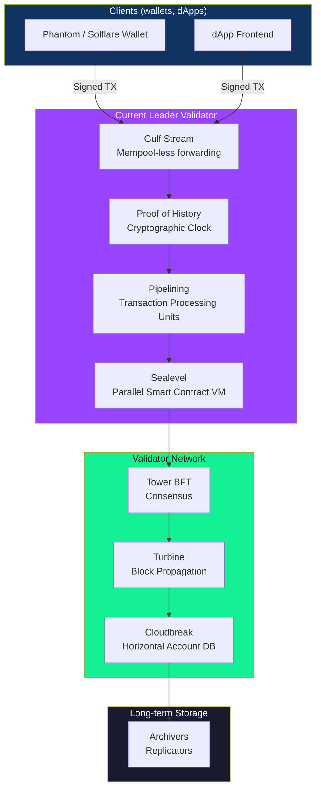
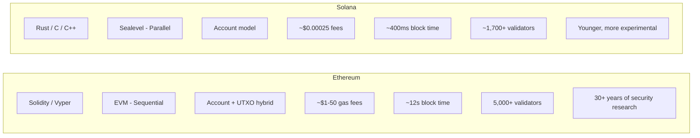
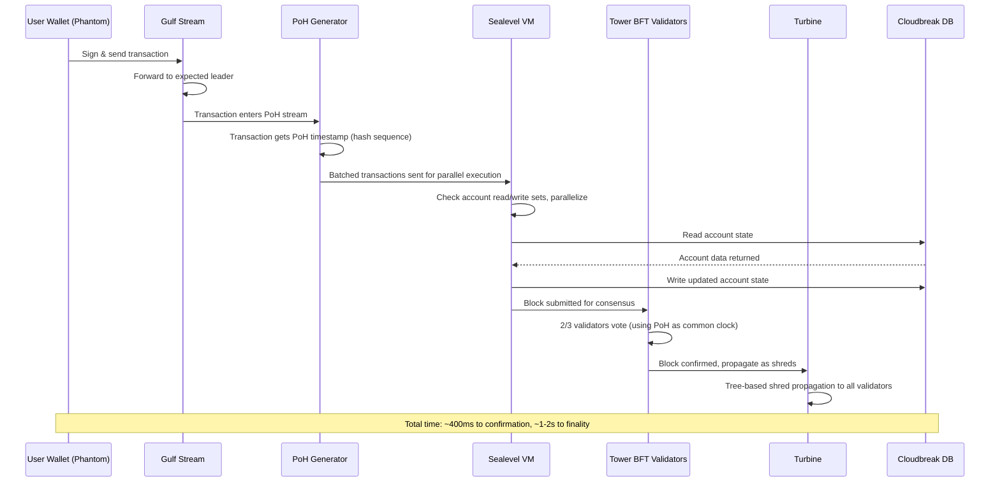

# What is Solana and How is it Different from Ethereum?

> **Chapter 1 — Solana Developer Series**
> Audience: Developers familiar with web2 or Ethereum basics, learning Solana for the first time.

---

## 🌍 The Problem: Why Does Another Blockchain Exist?

Imagine a highway. Ethereum is like a two-lane highway built in the 1990s. Back then, very few cars used it. But today, millions of cars (transactions) need to pass through — and the highway can only handle 15-30 cars per second. The result? Traffic jams. And when there is a jam, you pay a "fast lane" fee (gas fee) that can be $50–$200 just to cut ahead.

Solana is a new highway — an 8-lane superhighway with smart traffic lights, autonomous toll booths, and AI-driven lane management. It was engineered from scratch to handle the internet's speed of traffic.

That is not just marketing. The engineering decisions behind Solana are fundamentally different — and as a developer, understanding *why* those decisions were made will help you build better applications on top of it.

---

## 🧑‍💻 Origin: Anatoly Yakovenko and the 2017 Whitepaper

In 2017, **Anatoly Yakovenko**, a former Qualcomm engineer, was working on distributed systems. He had spent years optimizing communication between chips that needed to agree on what happened — and in what *order* — incredibly fast.

He noticed that every blockchain at the time had the same bottleneck: nodes couldn't agree on *time*. Without a shared clock, every validator had to wait for messages from other validators to determine what happened first. That waiting is what makes blockchains slow.

Anatoly's insight was simple but powerful:

> "What if the blockchain itself could keep time — provably, cryptographically?"

He wrote the Solana whitepaper in late 2017 and, with co-founders **Greg Fitzgerald**, **Stephen Akridge**, and others, launched the Solana mainnet beta in **March 2020**.

The company behind the protocol is **Solana Labs** (San Francisco), and the non-profit ecosystem organization is the **Solana Foundation**.

---

## 📊 The Numbers That Matter

Before diving into how Solana works, here are the key numbers every developer should know:

| Metric | Solana | Ethereum | Bitcoin |
|---|---|---|---|
| Theoretical TPS | ~65,000 | ~100,000 (with rollups) | ~7 |
| Real-world TPS | ~3,000–4,000 | ~15–30 (L1 alone) | ~3–5 |
| Block time | ~400ms | ~12 seconds | ~10 minutes |
| Transaction fee | ~$0.00025 | $1–$50 (varies wildly) | $1–$5 |
| Finality time | ~1–2 seconds | ~12–15 minutes (probabilistic) | ~60 minutes |
| Consensus | PoH + Tower BFT | Proof of Stake | Proof of Work |
| Smart contract language | Rust, C, C++ | Solidity, Vyper | Script (limited) |
| Year launched | 2020 | 2015 | 2009 |

These numbers explain why Solana is attractive for high-frequency applications: DEXes, gaming, payments, NFT minting events, and any application that needs near-instant, near-free transactions.

---

## 🏗️ Solana Architecture Overview



This diagram shows how a transaction flows from your wallet all the way into permanent storage. Each box is one of Solana's 8 core innovations. Let's walk through all of them.

---

## ⚙️ The 8 Key Innovations of Solana

### 1. ⏰ Proof of History (PoH) — The Cryptographic Clock

**Analogy:** Imagine you are writing a diary. Each entry says "I wrote this AFTER the previous entry" — because you reference what was written before. Anyone reading your diary can tell the *order* of events just by reading, without needing to call you and ask "when did you write this?"

PoH does the same thing for blockchain transactions.

**How it works technically:**

PoH is a **Verifiable Delay Function (VDF)**. The leader node runs a SHA-256 hash continuously:

```
hash_0 = SHA256(some_seed)
hash_1 = SHA256(hash_0)
hash_2 = SHA256(hash_1)
...
hash_N = SHA256(hash_N-1)
```

Each hash takes a fixed, predictable amount of time to compute (because SHA-256 is sequential — you cannot parallelize it). So if you see hash number 500,000, you know approximately how much time has passed since hash 0.

Transactions are "stamped" into this hash chain:

```
hash_1000 = SHA256(hash_999 || transaction_data)
```

Now every validator can independently *verify* the sequence of events by replaying the hashes — much faster than it took to create them. This means validators don't need to talk to each other to agree on ordering. The clock is embedded in the chain itself.

**What this solves:** Eliminates the need for validators to send "timestamps" to each other. Reduces message passing dramatically, enabling 400ms block times.

---

### 2. 🗳️ Tower BFT — The Consensus Engine

**Analogy:** Imagine a committee voting on a decision. Instead of revoting from scratch each time, each member's current vote *builds on* their previous votes — with increasing personal stakes (the longer you've held a position, the more you'd lose by switching). This makes the committee reach agreement faster and more securely.

Tower BFT is Solana's version of Practical Byzantine Fault Tolerance (PBFT), but optimized to use the PoH clock as a common reference.

- Validators vote on blocks, and their votes are recorded *inside* the PoH stream
- Each subsequent vote doubles the "lockout" period — meaning the more votes you've cast, the longer you're locked in before you can change your vote
- This exponential lockout means **finality is reached in ~1–2 seconds**
- 2/3 of validators (by stake weight) must agree for a block to be finalized

**Result:** Fast, secure consensus that inherits the ordering guarantees from PoH.

---

### 3. 📡 Turbine — Block Propagation

**Analogy:** Imagine trying to send a large movie file to 1,000 friends. You don't send it to all 1,000 at once (that would overwhelm your internet connection). Instead, you send it to 10 friends, each of them sends to 10 more, and so on. This is a BitTorrent-like approach.

Turbine does exactly this for Solana blocks.

- The leader breaks the block into small **shreds** (erasure-coded chunks)
- These shreds are broadcast in a tree structure through the validator network
- Each validator only needs to receive a *subset* of shreds to reconstruct the full block (using erasure coding — the same technology used in CDs and QR codes)
- This allows **large blocks to propagate quickly** without every validator needing a gigabit connection to the leader

**Result:** Block propagation scales logarithmically with the number of validators, not linearly.

---

### 4. 🌊 Gulf Stream — Mempool-less Transaction Forwarding

**Analogy:** In most cities, you drive to the highway entrance and wait in a "staging area" (the mempool) until you can merge onto the highway. Gulf Stream eliminates the staging area — your car is placed directly on the highway by a smart traffic controller who already knows where you're going.

In Bitcoin and Ethereum, unconfirmed transactions sit in a **mempool** — a waiting room. This causes memory pressure and unpredictable wait times.

Gulf Stream works by:
1. **Clients know who the next leader will be** (Solana's leader schedule is published in advance)
2. Clients forward transactions **directly to the expected future leader**, skipping the mempool entirely
3. Validators cache and forward transactions based on the leader schedule

**Result:** Leaders already have transactions queued up before their slot begins, enabling faster block production and reducing memory overhead across the network.

---

### 5. 🔀 Sealevel — Parallel Smart Contract Execution

**Analogy:** Imagine a bank with 1,000 teller windows. In Ethereum, even with 1,000 windows open, only one teller can serve customers at a time because there's a shared ledger in the back room and everyone has to take turns updating it. In Solana, if two customers are working with completely different accounts, their tellers can serve them *simultaneously* — only transactions that touch the same account need to wait for each other.

This is **Sealevel** — Solana's parallel smart contract runtime.

Here is the key insight: **Solana transactions declare upfront which accounts they will read and write.** This declaration is part of every transaction's structure.

```
Transaction {
  instructions: [...],
  accounts: [
    { pubkey: user_account, is_writable: true },
    { pubkey: token_mint,   is_writable: false },
    { pubkey: pool_account, is_writable: true },
  ]
}
```

Because the runtime knows in advance which accounts each transaction touches, it can:
- Run non-overlapping transactions **in parallel** across multiple CPU cores and even GPUs
- Queue only the transactions that share a writable account

**Result:** Solana can process thousands of transactions simultaneously on modern multi-core hardware — a fundamental architectural advantage over the EVM's sequential execution model.

---

### 6. 🏭 Pipelining — Transaction Processing Units (TPUs)

**Analogy:** Think of an assembly line in a car factory. While one team installs the engine, another team is painting the body of the *next* car, and another is mounting the doors of the car after that. All cars move forward in parallel stages.

Solana uses the same idea for transaction processing. A transaction passes through 4 stages simultaneously:

```
Stage 1: Data Fetch       — pull raw transaction from network
Stage 2: Signature Verify — verify cryptographic signatures (GPU accelerated)
Stage 3: Banking Stage    — execute instructions, update accounts
Stage 4: Write            — write results to disk
```

While one batch is at Stage 3 (banking), the *next* batch is at Stage 2 (signature verification), and the batch after that is at Stage 1 (data fetch). This pipelining means **hardware is never idle**.

**Result:** Solana saturates CPU, GPU, and network hardware fully — dramatically increasing throughput without needing faster individual components.

---

### 7. 💾 Cloudbreak — Horizontally Scaled Account Database

**Analogy:** Instead of storing all your company's files in one giant filing cabinet (which gets slower as it fills up), Cloudbreak is like having many filing cabinets arranged so that commonly accessed files are always near the person who needs them. The filing cabinets can also all be searched at the same time.

Cloudbreak is Solana's custom account database designed for concurrent reads and writes.

- Uses **memory-mapped files** — account data is mapped directly into virtual memory, so the OS handles caching automatically
- Reads and writes are **spread across SSDs** horizontally, allowing parallel I/O
- Designed specifically for the access patterns of Sealevel's parallel execution

**Why this matters:** Traditional databases like LevelDB (used by Ethereum's geth) become a bottleneck at high TPS because they aren't designed for massive parallelism. Cloudbreak is purpose-built for Solana's workload.

---

### 8. 📦 Archivers — Distributed Ledger Storage

**Analogy:** Instead of every library in a city keeping every book ever written, each library specializes in certain topics — but together, every book is always accessible. Archivers work the same way.

Full Solana history would require petabytes of storage if every node kept everything. Archivers (also called **replicators**) are light nodes that:
- Store a portion of the ledger history using **proof of replication**
- Are rewarded in SOL for storing data reliably
- Allow the network to maintain full history without requiring every validator to store all of it

**Result:** Solana's history is preserved in a decentralized way without placing crushing storage requirements on validators.

---

## 🌐 The Solana Ecosystem

Solana has a rich and fast-growing ecosystem. Here are the major categories:

### DeFi (Decentralized Finance)

| Protocol | What it does |
|---|---|
| **Orca** | User-friendly DEX (decentralized exchange), concentrated liquidity |
| **Raydium** | AMM (Automated Market Maker) with order book integration |
| **Jupiter** | DEX aggregator — finds best swap routes across all Solana DEXes |
| **Marinade Finance** | Liquid staking — stake SOL and get mSOL to use in DeFi |
| **Drift Protocol** | Perpetual futures and margin trading |

> **Note:** Serum (the original Solana DEX built by FTX) collapsed after the FTX bankruptcy in November 2022 and was forked into **OpenBook** by the community.

### NFTs

| Platform | What it does |
|---|---|
| **Magic Eden** | The largest Solana NFT marketplace (also expanded to Ethereum/Bitcoin) |
| **Tensor** | Advanced NFT trading with pro-trader features |
| **Metaplex** | The standard NFT protocol and tooling on Solana |

### Wallets

| Wallet | Notes |
|---|---|
| **Phantom** | The most popular Solana wallet, browser extension + mobile |
| **Solflare** | Feature-rich wallet with staking UI built-in |
| **Backpack** | Next-gen wallet with xNFT (executable NFT) support |
| **Ledger** | Hardware wallet with Solana support |

### Infrastructure

| Tool | What it does |
|---|---|
| **Helius** | RPC provider + enhanced APIs for Solana developers |
| **QuickNode** | Multi-chain RPC provider with Solana support |
| **Anchor** | The leading Solana smart contract framework (like Hardhat/Foundry for Ethereum) |
| **Metaplex** | NFT metadata standard and tooling |

---

## ⚖️ Solana vs Ethereum: A Deep Comparison



| Dimension | Solana | Ethereum |
|---|---|---|
| **Smart contract language** | Rust (steep learning curve, very safe) | Solidity (easier to learn, many pitfalls) |
| **Execution model** | Parallel (Sealevel) | Sequential (EVM) |
| **State model** | Programs are stateless; state lives in accounts | Contracts hold their own state |
| **Fees** | Fixed, ultra-low (~$0.00025) | Highly variable ($1–$200+) |
| **Block time** | ~400ms | ~12 seconds |
| **Finality** | ~1–2 seconds | ~12–15 minutes (probabilistic safe head) |
| **Decentralization** | ~1,700 validators (hardware requirements are high) | ~900,000+ validators (commodity hardware) |
| **Network outages** | Multiple in 2021–2022 | Extremely rare |
| **Ecosystem maturity** | Growing rapidly, but younger | Largest DeFi/NFT ecosystem, mature tooling |
| **Developer experience** | Steeper curve (Rust, unique account model) | More resources, tutorials, audited libraries |
| **Layer 2 ecosystem** | Minimal (Solana is L1-first) | Rich L2 ecosystem (Arbitrum, Optimism, Base) |
| **EVM compatibility** | No (Neon EVM exists but limited) | Native |

---

## 💰 The SOL Token

SOL is the native token of the Solana network. It serves three purposes:

### 1. Transaction Fees

Every transaction on Solana costs a small amount of SOL. Fees are split:
- **50%** is burned (permanently removed from supply — deflationary)
- **50%** goes to the validator who processed the transaction

With fees as low as **$0.00025**, even a high-volume application sending 1,000 transactions per day would spend about **$0.25/day** in fees. Compare this to Ethereum where a single complex DeFi transaction can cost $20–$100.

### 2. Staking

SOL holders can **stake** their tokens by delegating to validators. In return:
- Stakers earn **inflation rewards** (currently ~5–7% APY)
- Staking secures the network (validators with more delegated stake have more voting power)
- Liquid staking protocols like Marinade give you **mSOL** — a token representing your staked SOL that you can use in DeFi while still earning staking rewards

### 3. Rent

This is unique to Solana. **Every account on Solana must hold a minimum balance of SOL** proportional to the data stored in that account. This is called **rent**.

```
Rent = (account_data_size_in_bytes) × (lamports_per_byte_per_year) × (2 years)
```

The "2 years" makes the account **rent-exempt** — meaning it will never be deleted as long as it maintains this balance. Once you close an account, you get this SOL back.

Think of rent as a **security deposit** that prevents blockchain state bloat. If rent were free, developers could create millions of accounts and never delete them, causing the network's state to grow without bound.

---

## 🚦 Solana's Trade-offs and Honest Limitations

No technology is perfect. Solana makes deliberate trade-offs, and understanding them will help you decide when to use it — and when not to.

### Hardware Requirements for Validators

Running a Solana validator is **not cheap**:

| Component | Recommended Spec |
|---|---|
| CPU | 12+ cores, high clock speed |
| RAM | 256 GB+ |
| Storage | 2TB+ NVMe SSD |
| Network | 1 Gbps+ connection |
| Cost | ~$5,000–$15,000/month depending on provider |

Compare this to Ethereum, where a validator can run on a **Raspberry Pi 4** with 16GB RAM. Solana's high hardware requirements mean fewer people can run validators, which reduces **decentralization**.

### Network Outages

Solana experienced multiple significant outages between 2021 and 2022:
- **September 2021**: 17-hour outage caused by a flood of transactions from a bot during an IDO (Initial DEX Offering)
- **January 2022**: Degraded performance due to duplicate transactions flooding the network
- **May 2022**: 7-hour outage
- **October 2022**: 4.5-hour outage

The root causes varied — from memory exhaustion to consensus bugs to nondeterministic behavior in the validator client. Solana Labs and the community have since invested heavily in fixes:
- **QUIC** protocol replaced UDP for transaction forwarding
- **Stake-weighted Quality of Service (QoS)** prevents spam from overwhelming the network
- **Fee markets** were introduced for local congestion on hot accounts

As of 2024–2025, major outages have become rare. But Ethereum, being older and more battle-tested, has an extremely strong track record by comparison.

### Less Decentralization Than Ethereum

With ~1,700 validators vs Ethereum's 900,000+, Solana is more centralized. In practice:
- A smaller set of nodes makes coordination easier (part of why it's fast)
- But it also means a smaller attack surface needed for a 33% or 51% attack
- Solana Labs historically had significant influence over the validator client; this has improved with the introduction of **Firedancer** (a second validator client by Jump Crypto)

### The Solana Programming Model is Harder

Unlike Ethereum where your contract owns its own state, **Solana programs are stateless**. All state lives in separate **accounts** that the program operates on. This is powerful (it enables Sealevel's parallelism) but requires a different mental model.

```
// Ethereum: contract owns its state
contract MyContract {
    uint256 public value;  // state lives here
    function setValue(uint256 _v) public { value = _v; }
}
```

```rust
// Solana: program is stateless, state lives in an account passed in
pub fn set_value(ctx: Context<SetValue>, new_value: u64) -> Result<()> {
    let account = &mut ctx.accounts.my_account;
    account.value = new_value;  // state lives in the account, not the program
    Ok(())
}
```

This stateless model is the reason Sealevel can parallelize execution — but it means you need to understand accounts deeply before writing your first Solana program.

---

## ✅ When to Use Solana / ❌ When NOT to Use Solana

### Use Solana when:

- You need **high throughput** — gaming, real-time auctions, high-frequency trading
- You need **near-instant finality** — payment apps, point-of-sale
- **Transaction costs must be predictable and tiny** — micro-transactions, tipping, in-game economies
- You are building a **DEX or DeFi protocol** where latency matters
- You want to experiment with **on-chain order books** (only feasible on Solana at L1 speed)
- Your application involves **mass NFT minting** events with thousands of concurrent users

### Do NOT use Solana when:

- You need maximum **decentralization and censorship resistance** — use Ethereum L1
- Your team only knows **Solidity** and you need to ship fast — use Ethereum or an EVM chain
- You need access to **deep Ethereum DeFi liquidity** — Aave, Compound, Uniswap V3 are Ethereum-native
- Your application requires **long-term immutability guarantees** — Ethereum's longer track record matters for critical financial infrastructure
- You need **EVM compatibility** for easy wallet/tooling integration — use any EVM-compatible chain
- Your team is building a **simple token or DAO** — Ethereum tooling (Hardhat, OpenZeppelin) is more mature

---

## 🗺️ Transaction Lifecycle: End to End



---

## 🔑 Key Takeaways

| # | Takeaway |
|---|---|
| 1 | Solana was built to solve the **scalability trilemma** by making opinionated hardware trade-offs |
| 2 | **Proof of History** is the core innovation — a cryptographic clock that eliminates the need for validators to communicate timestamps |
| 3 | **Sealevel's parallel execution** is why Solana can theoretically hit 65,000 TPS — it's architecturally impossible on the sequential EVM |
| 4 | Solana transactions cost ~**$0.00025**, making micro-transaction use cases economically viable for the first time |
| 5 | **Block time is ~400ms** and finality is ~1–2 seconds — fast enough for real-time UX without optimistic UIs |
| 6 | The trade-off is **less decentralization** — high validator hardware requirements and a history of network outages |
| 7 | **SOL** has three roles: pay fees, secure the network via staking, and fund rent (storage deposit) for on-chain accounts |
| 8 | The **Solana programming model is stateless** — programs don't hold state, accounts do. This is the single biggest mental model shift from Ethereum |
| 9 | For **DeFi, gaming, payments, and NFTs at scale**, Solana is a genuinely compelling platform — not just marketing hype |
| 10 | For **maximum decentralization, censorship resistance, or EVM compatibility**, Ethereum remains the gold standard |

---

## 📚 What's Next?

In the next chapter, we will set up your **Solana development environment** — installing the Solana CLI, Anchor framework, and deploying your first program to devnet. By the end of that chapter, you will have a working "Hello World" on-chain.

> **Chapter 2 Preview:** Setting Up Your Solana Development Environment (Rust, Solana CLI, Anchor, Phantom wallet, devnet SOL)

---

*Written for the Solana Developer Series — June 2026*
