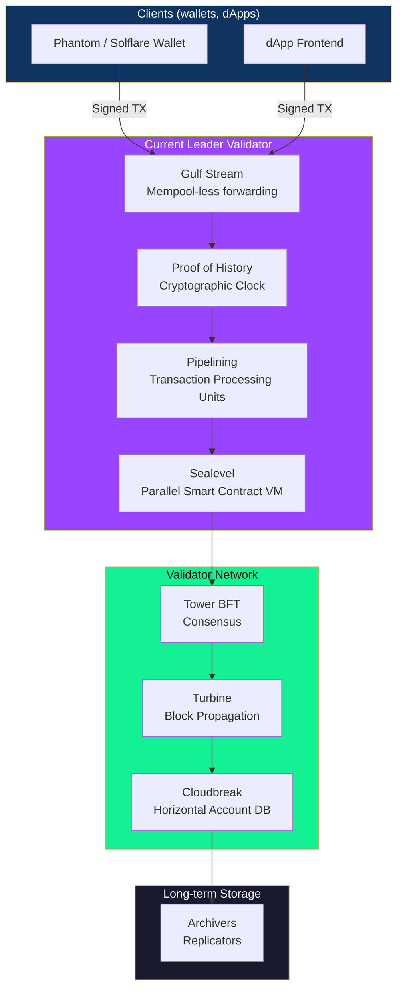
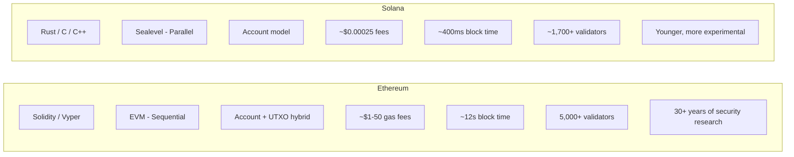
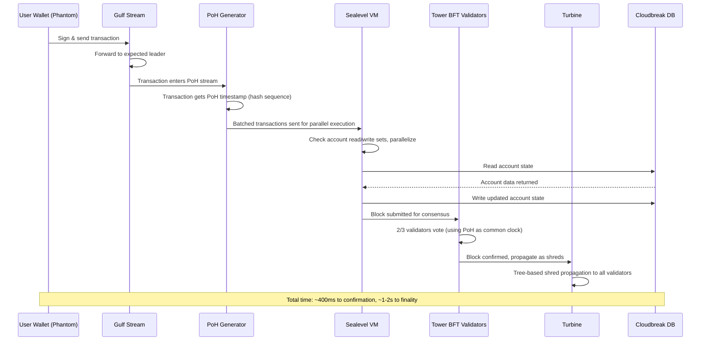

# What is Solana and How is it Different from Ethereum?

> **Chapter 1 — Solana Developer Series**
> Audience: Developers familiar with web2 or Ethereum basics, learning Solana for the first time.

---

## 🌍 The Problem: Ek aur blockchain kyun banaya?

Socho ek highway hai. Ethereum matlab ek do-lane wala highway jo 1990s mein bana tha. Us waqt bahut kam gaadiyan chalti thi usme. Lekin aaj millions of cars (transactions) us highway pe aana chahti hain — aur woh highway sirf 15-30 gaadiyan per second hi handle kar sakta hai. Result kya hota hai? Traffic jam. Aur jab jam lagta hai, tumhe "fast lane" fee (gas fee) deni padti hai jo $50–$200 tak ja sakti hai sirf aage nikalne ke liye.

Solana ek naya highway hai — 8-lane ka superhighway, jisme smart traffic lights hain, automatic toll booths hain, aur AI-driven lane management hai. Yeh scratch se is tarah engineer kiya gaya hai ki internet ki speed ka traffic bhi handle kar sake.

Yeh sirf marketing nahi hai. Solana ke peeche jo engineering decisions hain woh fundamentally alag hain — aur ek developer hone ke naate, yeh samajhna ki *kyun* yeh decisions liye gaye, tumhe better applications banane mein madad karega.

---

## 🧑‍💻 Origin: Anatoly Yakovenko aur 2017 ka Whitepaper

2017 mein, **Anatoly Yakovenko**, jo pehle Qualcomm mein engineer the, distributed systems pe kaam kar rahe the. Unhone kaafi saal chips ke beech communication optimize karne mein bitaye the — jahan chips ko yeh agree karna hota hai ki kya hua, aur kis *order* mein hua, woh bhi incredibly fast.

Unhone notice kiya ki us waqt ki har blockchain mein ek hi bottleneck tha: nodes *time* pe agree nahi kar pate the. Bina ek shared clock ke, har validator ko doosre validators se messages ka wait karna padta tha yeh pata karne ke liye ki pehle kya hua. Yehi waiting blockchains ko slow banati hai.

Anatoly ka insight simple tha but powerful:

> "Agar blockchain khud hi time rakh sake — provably, cryptographically — to?"

Unhone late 2017 mein Solana whitepaper likha aur co-founders **Greg Fitzgerald**, **Stephen Akridge**, aur doosron ke saath **March 2020** mein Solana mainnet beta launch kiya.

Protocol ke peeche ki company hai **Solana Labs** (San Francisco), aur non-profit ecosystem organization hai **Solana Foundation**.

---

## 📊 Woh Numbers Jo Matter Karte Hain

Solana kaise kaam karta hai yeh dekhne se pehle, yeh key numbers har developer ko pata hone chahiye:

| Metric | Solana | Ethereum | Bitcoin |
|---|---|---|---|
| Theoretical TPS | ~65,000 | ~100,000 (rollups ke saath) | ~7 |
| Real-world TPS | ~3,000–4,000 | ~15–30 (sirf L1) | ~3–5 |
| Block time | ~400ms | ~12 seconds | ~10 minutes |
| Transaction fee | ~$0.00025 | $1–$50 (bahut variable) | $1–$5 |
| Finality time | ~1–2 seconds | ~12–15 minutes (probabilistic) | ~60 minutes |
| Consensus | PoH + Tower BFT | Proof of Stake | Proof of Work |
| Smart contract language | Rust, C, C++ | Solidity, Vyper | Script (limited) |
| Year launched | 2020 | 2015 | 2009 |

Yeh numbers batate hain ki Solana high-frequency applications ke liye kyun attractive hai: DEXes, gaming, payments, NFT minting events, aur koi bhi application jisko near-instant, near-free transactions chahiye.

---

## 🏗️ Solana Architecture Overview



Yeh diagram dikhata hai ki ek transaction tumhare wallet se nikal ke kaise permanent storage tak pahunchti hai. Har box Solana ke 8 core innovations mein se ek hai. Chalo sabko ek-ek karke samajhte hain.

---

## ⚙️ Solana ke 8 Key Innovations

### 1. ⏰ Proof of History (PoH) — Cryptographic Clock

**Analogy:** Socho tum ek diary likh rahe ho. Har entry kehti hai "Maine yeh PEHLE wali entry ke BAAD likha hai" — kyunki tum pehle jo likha tha usko reference karte ho. Koi bhi tumhari diary padh ke events ka *order* bata sakta hai, tumhe call karke "kab likha tha yeh" pooche bina.

PoH blockchain transactions ke liye bilkul yehi karta hai.

**Technically kaise kaam karta hai:**

PoH ek **Verifiable Delay Function (VDF)** hai. Leader node continuously ek SHA-256 hash chalata rehta hai:

```
hash_0 = SHA256(some_seed)
hash_1 = SHA256(hash_0)
hash_2 = SHA256(hash_1)
...
hash_N = SHA256(hash_N-1)
```

Har hash ko compute karne mein ek fixed, predictable time lagta hai (kyunki SHA-256 sequential hai — tum ise parallelize nahi kar sakte). Toh agar tumne hash number 500,000 dekha, tumhe pata chal jayega ki hash 0 ke baad approximately kitna time beeta hai.

Transactions is hash chain mein "stamp" ho jate hain:

```
hash_1000 = SHA256(hash_999 || transaction_data)
```

Ab har validator independently events ki sequence *verify* kar sakta hai hashes ko replay karke — jo unhe banane mein jitna time laga tha usse kaafi tez. Iska matlab validators ko order pe agree karne ke liye ek dusre se baat karne ki zarurat nahi. Clock khud hi chain ke andar embed hai.

**Yeh kya solve karta hai:** Validators ko ek dusre ko "timestamps" bhejne ki zarurat khatam ho jati hai. Message passing dramatically kam ho jata hai, jisse 400ms block times possible ho pate hain.

---

### 2. 🗳️ Tower BFT — Consensus Engine

**Analogy:** Socho ek committee hai jo kisi decision pe vote kar rahi hai. Har baar scratch se revote karne ki jagah, har member ka current vote unke *pichle* votes pe build hota hai — aur stakes increase hote jate hain (jitne der se tumne apna position hold kiya hai, utna hi zyada nuksaan hoga agar tum switch karte ho). Isse committee jaldi aur zyada securely agreement pe pahunchti hai.

Tower BFT, Solana ka version hai Practical Byzantine Fault Tolerance (PBFT) ka, lekin PoH clock ko common reference ki tarah use karne ke liye optimize kiya gaya hai.

- Validators blocks pe vote karte hain, aur unke votes PoH stream ke *andar* record hote hain
- Har agla vote "lockout" period ko double kar deta hai — matlab jitne zyada votes tumne diye hain, utni der tak tum apna vote change nahi kar sakte
- Is exponential lockout ki wajah se **finality sirf ~1–2 seconds mein aa jati hai**
- Block finalize hone ke liye 2/3 validators (stake weight ke hisaab se) ko agree hona padta hai

**Result:** Fast, secure consensus jo PoH se ordering guarantees inherit karta hai.

---

### 3. 📡 Turbine — Block Propagation

**Analogy:** Socho tumhe ek badi movie file 1,000 friends ko bhejni hai. Tum sabko ek saath nahi bhejoge (isse tumhara internet connection overwhelm ho jayega). Instead, tum 10 friends ko bhejoge, unme se har ek 10 aur ko bhej dega, aur aise chalta rahega. Yeh BitTorrent jaisa approach hai.

Turbine Solana ke blocks ke liye exactly yehi karta hai.

- Leader block ko chhote **shreds** (erasure-coded chunks) mein tod deta hai
- Yeh shreds ek tree structure mein validator network ke through broadcast hote hain
- Har validator ko sirf shreds ka ek *subset* chahiye poora block reconstruct karne ke liye (erasure coding use karke — same technology jo CDs aur QR codes mein use hoti hai)
- Isse **badi blocks bhi jaldi propagate** ho sakti hain, bina har validator ko leader se gigabit connection ki zarurat pade

**Result:** Block propagation validators ki number ke saath logarithmically scale karta hai, linearly nahi.

---

### 4. 🌊 Gulf Stream — Mempool-less Transaction Forwarding

**Analogy:** Zyada tar cities mein, tum highway entrance tak drive karte ho aur ek "staging area" (mempool) mein wait karte ho jab tak highway pe merge nahi ho sakte. Gulf Stream is staging area ko hi khatam kar deta hai — tumhari car directly highway pe rakh di jati hai ek smart traffic controller ke through, jise pehle se pata hai tum kahan ja rahe ho.

Bitcoin aur Ethereum mein, unconfirmed transactions ek **mempool** mein baithi rehti hain — ek waiting room. Isse memory pressure aur unpredictable wait times hote hain.

Gulf Stream aise kaam karta hai:
1. **Clients ko pata hota hai ki next leader kaun hoga** (Solana ka leader schedule pehle se publish hota hai)
2. Clients apne transactions **directly expected future leader ko forward karte hain**, mempool ko poora skip karke
3. Validators leader schedule ke hisaab se transactions cache aur forward karte hain

**Result:** Leaders ke paas unka slot start hone se pehle hi transactions queued hote hain, jisse block production fast hota hai aur network mein memory overhead kam hota hai.

---

### 5. 🔀 Sealevel — Parallel Smart Contract Execution

**Analogy:** Socho ek bank hai jisme 1,000 teller windows hain. Ethereum mein, 1,000 windows open hone ke bawajood, ek time pe sirf ek hi teller customer ko serve kar sakta hai kyunki back room mein ek shared ledger hai aur sabko baari-baari se usse update karna padta hai. Solana mein, agar do customers bilkul different accounts pe kaam kar rahe hain, to unke tellers unhe *simultaneously* serve kar sakte hain — sirf woh transactions wait karengi jo same account ko touch karti hain.

Yehi hai **Sealevel** — Solana ka parallel smart contract runtime.

Yahan key insight yeh hai: **Solana transactions pehle se declare karte hain ki woh kaunse accounts read/write karenge.** Yeh declaration har transaction ki structure ka part hota hai.

```
Transaction {
  instructions: [...],
  accounts: [
    { pubkey: user_account, is_writable: true },
    { pubkey: token_mint,   is_writable: false },
    { pubkey: pool_account, is_writable: true },
  ]
}
```

Kyunki runtime ko pehle se pata hota hai ki har transaction kaunse accounts touch karega, woh yeh kar sakta hai:
- Non-overlapping transactions ko **parallel mein run** karna, multiple CPU cores aur GPUs ke across
- Sirf un transactions ko queue karna jo ek writable account share karte hain

**Result:** Solana modern multi-core hardware pe hazaron transactions ek saath process kar sakta hai — yeh EVM ke sequential execution model ke muqable ek fundamental architectural advantage hai.

---

### 6. 🏭 Pipelining — Transaction Processing Units (TPUs)

**Analogy:** Ek car factory ki assembly line socho. Jab ek team engine install kar rahi hoti hai, doosri team *agli* car ki body paint kar rahi hoti hai, aur ek aur team uske baad wali car ke doors mount kar rahi hoti hai. Sab cars parallel stages mein aage badhti hain.

Solana bhi transaction processing ke liye yehi idea use karta hai. Ek transaction 4 stages se simultaneously guzarta hai:

```
Stage 1: Data Fetch       — network se raw transaction pull karo
Stage 2: Signature Verify — cryptographic signatures verify karo (GPU accelerated)
Stage 3: Banking Stage    — instructions execute karo, accounts update karo
Stage 4: Write            — results ko disk pe likho
```

Jab ek batch Stage 3 (banking) pe hota hai, tab *agla* batch Stage 2 (signature verification) pe hota hai, aur uske baad wala batch Stage 1 (data fetch) pe hota hai. Is pipelining ki wajah se **hardware kabhi idle nahi rehta**.

**Result:** Solana CPU, GPU, aur network hardware ko poora saturate kar deta hai — throughput dramatically badh jata hai bina individual components ko faster banaye.

---

### 7. 💾 Cloudbreak — Horizontally Scaled Account Database

**Analogy:** Apni company ki saari files ek hi bade filing cabinet mein rakhne ki jagah (jo bharne ke saath slow hota jata hai), Cloudbreak aisa hai jaise tumhare paas kai filing cabinets hon aur woh is tarah arrange kiye gaye hon ki commonly accessed files hamesha unke paas hon jinhe unki zarurat hai. Aur yeh saare cabinets ek saath search bhi kiye ja sakte hain.

Cloudbreak Solana ka custom account database hai jo concurrent reads aur writes ke liye design kiya gaya hai.

- **Memory-mapped files** use karta hai — account data directly virtual memory mein map hota hai, taaki OS caching automatically handle kare
- Reads aur writes **SSDs ke across horizontally spread** hote hain, jisse parallel I/O possible hoti hai
- Specifically Sealevel ke parallel execution ke access patterns ke liye design kiya gaya hai

**Yeh kyun matter karta hai:** LevelDB jaise traditional databases (jo Ethereum ke geth mein use hote hain) high TPS pe bottleneck ban jate hain kyunki woh massive parallelism ke liye design nahi hain. Cloudbreak specifically Solana ke workload ke liye banaya gaya hai.

---

### 8. 📦 Archivers — Distributed Ledger Storage

**Analogy:** Ek city ki har library har ek book rakhne ki jagah, har library kisi specific topic mein specialize karti hai — lekin sab milke, har book hamesha accessible rehti hai. Archivers bhi isi tarah kaam karte hain.

Agar har node poori Solana history store kare to petabytes ki storage chahiye hogi. Archivers (jinhe **replicators** bhi kehte hain) light nodes hote hain jo:
- **Proof of replication** use karke ledger history ka ek portion store karte hain
- Reliably data store karne ke liye SOL mein reward paate hain
- Network ko poori history maintain karne dete hain bina har validator pe crushing storage requirement daale

**Result:** Solana ki history decentralized tareeke se preserve hoti hai bina validators pe zyada storage load daale.

---

## 🌐 Solana Ecosystem

Solana ka ecosystem rich aur fast-growing hai. Yeh hain major categories:

### DeFi (Decentralized Finance)

| Protocol | Kya karta hai |
|---|---|
| **Orca** | User-friendly DEX (decentralized exchange), concentrated liquidity |
| **Raydium** | AMM (Automated Market Maker) jisme order book integration bhi hai |
| **Jupiter** | DEX aggregator — Solana ke saare DEXes mein se best swap route dhoondta hai |
| **Marinade Finance** | Liquid staking — SOL stake karo aur mSOL milega jo DeFi mein use kar sakte ho |
| **Drift Protocol** | Perpetual futures aur margin trading |

> **Note:** Serum (original Solana DEX jo FTX ne banaya tha) November 2022 mein FTX bankruptcy ke baad collapse ho gaya aur community ne ise fork karke **OpenBook** banaya.

### NFTs

| Platform | Kya karta hai |
|---|---|
| **Magic Eden** | Sabse bada Solana NFT marketplace (Ethereum/Bitcoin pe bhi expand ho chuka hai) |
| **Tensor** | Pro-trader features ke saath advanced NFT trading |
| **Metaplex** | Solana pe standard NFT protocol aur tooling |

### Wallets

| Wallet | Notes |
|---|---|
| **Phantom** | Sabse popular Solana wallet, browser extension + mobile |
| **Solflare** | Built-in staking UI ke saath feature-rich wallet |
| **Backpack** | Next-gen wallet, xNFT (executable NFT) support ke saath |
| **Ledger** | Hardware wallet jisme Solana support hai |

### Infrastructure

| Tool | Kya karta hai |
|---|---|
| **Helius** | RPC provider + enhanced APIs Solana developers ke liye |
| **QuickNode** | Multi-chain RPC provider, Solana support ke saath |
| **Anchor** | Solana ka leading smart contract framework (Ethereum ke Hardhat/Foundry jaisa) |
| **Metaplex** | NFT metadata standard aur tooling |

---

## ⚖️ Solana vs Ethereum: Ek Deep Comparison



| Dimension | Solana | Ethereum |
|---|---|---|
| **Smart contract language** | Rust (steep learning curve, bahut safe) | Solidity (seekhna aasan hai, but kai pitfalls hain) |
| **Execution model** | Parallel (Sealevel) | Sequential (EVM) |
| **State model** | Programs stateless hote hain; state accounts mein rehti hai | Contracts apni khud ki state hold karte hain |
| **Fees** | Fixed, ultra-low (~$0.00025) | Highly variable ($1–$200+) |
| **Block time** | ~400ms | ~12 seconds |
| **Finality** | ~1–2 seconds | ~12–15 minutes (probabilistic safe head) |
| **Decentralization** | ~1,700 validators (hardware requirements high hain) | ~900,000+ validators (commodity hardware) |
| **Network outages** | 2021–2022 mein multiple hue | Extremely rare |
| **Ecosystem maturity** | Rapidly grow ho raha hai, but younger hai | Sabse bada DeFi/NFT ecosystem, mature tooling |
| **Developer experience** | Steeper curve (Rust, unique account model) | Zyada resources, tutorials, audited libraries |
| **Layer 2 ecosystem** | Minimal (Solana L1-first hai) | Rich L2 ecosystem (Arbitrum, Optimism, Base) |
| **EVM compatibility** | Nahi (Neon EVM hai but limited) | Native |

---

## 💰 SOL Token

SOL Solana network ka native token hai. Isके teen purposes hain:

### 1. Transaction Fees

Solana pe har transaction ka thoda sa SOL cost hota hai. Fees split hoti hain:
- **50%** burn ho jati hai (supply se permanently remove — deflationary)
- **50%** us validator ko jaati hai jisne transaction process kiya

Fees itni kam ($0.00025) hone ki wajah se, ek high-volume application jo 1,000 transactions per day bhejta hai, usko fees mein sirf **$0.25/day** kharch honge. Compare karo Ethereum se, jahan ek single complex DeFi transaction $20–$100 tak cost kar sakta hai.

### 2. Staking

SOL holders apne tokens **stake** kar sakte hain validators ko delegate karke. Badle mein:
- Stakers ko **inflation rewards** milte hain (currently ~5–7% APY)
- Staking network ko secure karta hai (jitna zyada stake delegate kiya hoga validator ko, utni zyada voting power hogi)
- Marinade jaise liquid staking protocols tumhe **mSOL** dete hain — ek token jo tumhare staked SOL ko represent karta hai jo tum DeFi mein use kar sakte ho, staking rewards earn karte hue bhi

### 3. Rent

Yeh Solana ke liye unique hai. **Solana pe har account ko ek minimum SOL balance rakhna padta hai** jo us account mein store hue data ke proportional hota hai. Ise **rent** kehte hain.

```
Rent = (account_data_size_in_bytes) × (lamports_per_byte_per_year) × (2 years)
```

Yeh "2 years" wala calculation account ko **rent-exempt** bana deta hai — matlab jab tak yeh balance maintain hai, account kabhi delete nahi hoga. Account close karne pe yeh SOL wapas mil jata hai.

Rent ko ek **security deposit** ki tarah socho jo blockchain state ko bloat hone se rokta hai. Agar rent free hota, to developers millions accounts bana sakte the aur kabhi delete nahi karte, jisse network ki state bina limit ke badhti chali jaati.

---

## 🚦 Solana ke Trade-offs aur Honest Limitations

Koi bhi technology perfect nahi hoti. Solana deliberate trade-offs karta hai, aur inhe samajhna tumhe decide karne mein madad karega ki isko kab use karna hai — aur kab nahi.

### Validators ke liye Hardware Requirements

Solana validator chalana **sasta nahi hai**:

| Component | Recommended Spec |
|---|---|
| CPU | 12+ cores, high clock speed |
| RAM | 256 GB+ |
| Storage | 2TB+ NVMe SSD |
| Network | 1 Gbps+ connection |
| Cost | ~$5,000–$15,000/month, provider ke hisaab se |

Compare karo Ethereum se, jahan validator ek **Raspberry Pi 4** pe 16GB RAM ke saath chal sakta hai. Solana ki high hardware requirements ka matlab hai kam log validator chala sakte hain, jo **decentralization** kam kar deta hai.

### Network Outages

Solana ne 2021 aur 2022 ke beech kai significant outages face kiye:
- **September 2021**: 17-hour outage, ek IDO (Initial DEX Offering) ke dauran ek bot se transactions ke flood ki wajah se
- **January 2022**: Duplicate transactions ne network ko flood kar diya jisse performance degrade hui
- **May 2022**: 7-hour outage
- **October 2022**: 4.5-hour outage

Root causes alag-alag the — memory exhaustion se lekar consensus bugs aur validator client mein nondeterministic behavior tak. Solana Labs aur community ne fixes mein bahut invest kiya:
- **QUIC** protocol ne UDP ki jagah li transaction forwarding ke liye
- **Stake-weighted Quality of Service (QoS)** spam ko network overwhelm karne se rokta hai
- Hot accounts pe local congestion ke liye **Fee markets** introduce kiye gaye

2024–2025 tak, major outages rare ho gaye hain. But Ethereum, jo older aur zyada battle-tested hai, comparison mein extremely strong track record rakhta hai.

### Ethereum ke Muqable Kam Decentralization

~1,700 validators vs Ethereum ke 900,000+ ke saath, Solana zyada centralized hai. Practically:
- Chhota set of nodes coordination ko aasan banata hai (yehi partly wajah hai ki Solana fast hai)
- But iska matlab yeh bhi hai ki 33% ya 51% attack ke liye chhota attack surface chahiye
- Solana Labs ka historically validator client pe kaafi influence tha; **Firedancer** (Jump Crypto ka second validator client) aane ke baad yeh improve hua hai

### Solana ka Programming Model Harder Hai

Ethereum mein jahan tumhara contract apni khud ki state own karta hai, **Solana programs stateless** hote hain. Saari state alag **accounts** mein rehti hai jinpe program operate karta hai. Yeh powerful hai (isi se Sealevel ka parallelism possible hota hai) but ek alag mental model chahiye.

```
// Ethereum: contract apni state khud own karta hai
contract MyContract {
    uint256 public value;  // state yahan rehti hai
    function setValue(uint256 _v) public { value = _v; }
}
```

```rust
// Solana: program stateless hai, state ek account mein aati hai jo pass kiya jata hai
pub fn set_value(ctx: Context<SetValue>, new_value: u64) -> Result<()> {
    let account = &mut ctx.accounts.my_account;
    account.value = new_value;  // state account mein rehti hai, program mein nahi
    Ok(())
}
```

Yeh stateless model hi wajah hai ki Sealevel execution ko parallelize kar pata hai — but iska matlab hai ki apna pehla Solana program likhne se pehle tumhe accounts ko deeply samajhna padega.

---

## ✅ Kab Solana Use Karo / ❌ Kab NAHI Karo

### Solana use karo jab:

- Tumhe **high throughput** chahiye — gaming, real-time auctions, high-frequency trading
- Tumhe **near-instant finality** chahiye — payment apps, point-of-sale
- **Transaction costs predictable aur tiny hone chahiye** — micro-transactions, tipping, in-game economies
- Tum ek **DEX ya DeFi protocol** bana rahe ho jahan latency matter karti hai
- Tum **on-chain order books** ke saath experiment karna chahte ho (yeh sirf Solana pe L1 speed pe hi feasible hai)
- Tumhara application **mass NFT minting** events involve karta hai jahan thousands of concurrent users hote hain

### Solana use MAT karo jab:

- Tumhe maximum **decentralization aur censorship resistance** chahiye — Ethereum L1 use karo
- Tumhari team sirf **Solidity** jaanti hai aur tumhe jaldi ship karna hai — Ethereum ya koi EVM chain use karo
- Tumhe **deep Ethereum DeFi liquidity** chahiye — Aave, Compound, Uniswap V3 Ethereum-native hain
- Tumhare application ko **long-term immutability guarantees** chahiye — critical financial infrastructure ke liye Ethereum ka longer track record matter karta hai
- Tumhe easy wallet/tooling integration ke liye **EVM compatibility** chahiye — koi bhi EVM-compatible chain use karo
- Tumhari team ek **simple token ya DAO** bana rahi hai — Ethereum tooling (Hardhat, OpenZeppelin) zyada mature hai

---

## 🗺️ Transaction Lifecycle: End to End



---

## 🔑 Key Takeaways

- Solana **scalability trilemma** solve karne ke liye banaya gaya tha, jisme opinionated hardware trade-offs kiye gaye hain
- **Proof of History** core innovation hai — ek cryptographic clock jo validators ko timestamps communicate karne ki zarurat khatam kar deta hai
- **Sealevel ka parallel execution** hi wajah hai ki Solana theoretically 65,000 TPS tak hit kar sakta hai — sequential EVM pe yeh architecturally impossible hai
- Solana transactions ki cost ~**$0.00025** hai, jo pehli baar micro-transaction use cases ko economically viable banata hai
- **Block time ~400ms** hai aur finality ~1–2 seconds — real-time UX ke liye kaafi fast, optimistic UIs ki zarurat bina
- Trade-off yeh hai ki **decentralization kam hai** — high validator hardware requirements aur network outages ki history
- **SOL** ke teen roles hain: fees pay karna, staking ke through network secure karna, aur on-chain accounts ke liye rent (storage deposit) fund karna
- Solana ka **programming model stateless hai** — programs state nahi rakhte, accounts rakhte hain. Yeh Ethereum se sabse bada mental model shift hai
- **DeFi, gaming, payments, aur scale pe NFTs** ke liye, Solana genuinely compelling platform hai — sirf marketing hype nahi
- **Maximum decentralization, censorship resistance, ya EVM compatibility** ke liye, Ethereum abhi bhi gold standard hai

---

## 📚 Aage Kya?

Agle chapter mein, hum tumhara **Solana development environment** setup karenge — Solana CLI install karna, Anchor framework, aur devnet pe apna pehla program deploy karna. Us chapter ke end tak, tumhare paas ek working "Hello World" on-chain hoga.

> **Chapter 2 Preview:** Setting Up Your Solana Development Environment (Rust, Solana CLI, Anchor, Phantom wallet, devnet SOL)

---

*Written for the Solana Developer Series — June 2026*
