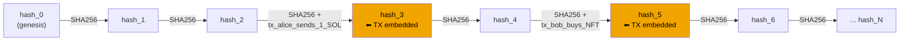
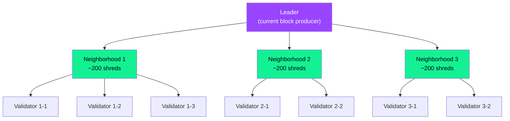
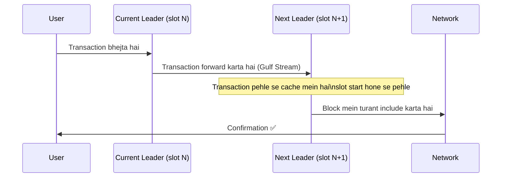
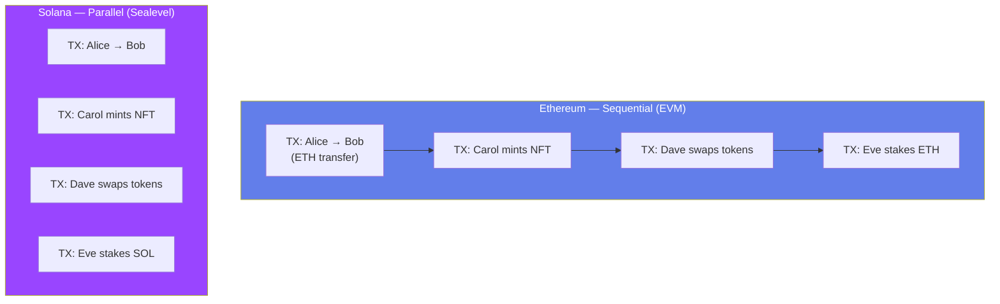
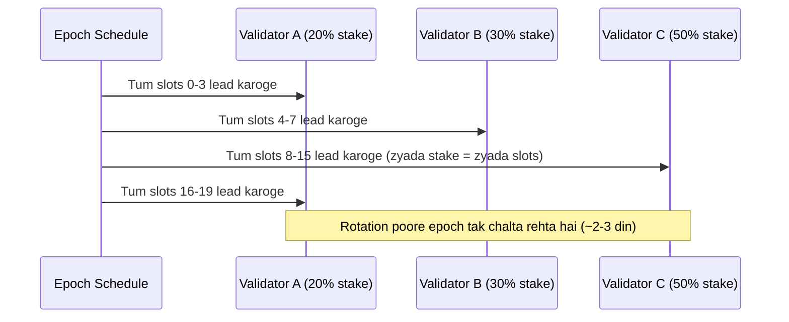
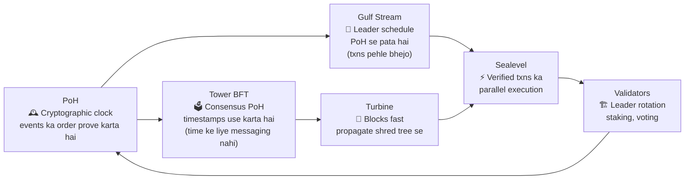

# Chapter 2: Proof of History and Solana Architecture

> "Speed is not a feature. It is the architecture." — Solana blockchain design ko aise dekhta hai.

---

## 🧭 Ye Chapter Kiske Liye Hai

Tumhe pata hai blockchain kya hota hai. Wallets, transactions, smart contracts — sab jaanta hai tu. Lekin Solana kuch *alag* feel hota hai — ye 65,000+ transactions per second process karta hai jabki Ethereum sirf 15-30 handle kar pata hai. Kyun? Answer koi ek trick nahi hai. Ye six interlocking innovations hain jo ek machine ke gears ki tarah saath mein kaam karte hain.

Is chapter ke end tak tumhe har gear samajh aa jayega: woh kya karta hai, kyun exist karta hai, aur baaki gears se kaise connect hota hai.

---

## 🕰️ Proof of History — Blockchain Ka Ghadi (Clock)

### Problem: Sabko Time Pe Disagreement Hai

Socho 1,000 log duniya bhar mein bikhre hue hain aur bina shared clock ke events ka order decide karna chahte hain. Alice bolti hai "Maine contract 3:00 PM pe sign kiya." Bob bolta hai "Nahi, woh 3:02 PM tha." Sahi kaun hai? Bina ek trusted, shared clock ke, tum bina bohot saari back-and-forth communication ke order pe agree nahi kar sakte.

Traditional blockchains isko solve karte hain blocks mein timestamps daal ke aur validators ko consensus se agree karwa ke. Lekin consensus mein time lagta hai — nodes ko ek dusre se baat karni padti hai, vote karna padta hai, wait karna padta hai. Jitni zyada baat, utna slow.

**Solana ka insight:** Kya ho agar tum *prove* kar sako ki time guzar gaya hai, bina kisi se puche?

---

### Notary Stamp Wali Analogy

Ek notary public ko socho. Jab tum ek document lekar notary ke paas jaate ho, woh usko date ke saath stamp karta hai aur sign karta hai. Woh stamp cryptographic proof hai ki document us moment pe exist karta tha. Tumhe notary se "kya ye hua tha?" puchhne ki zarurat nahi — stamp khud *prove* kar deta hai.

Proof of History (PoH) ek cryptographic notary hai jo continuously chalta rehta hai. Ye ek unforgeable record banata hai jo prove karta hai ki ek event doosre event *se pehle* hua.

> **Key insight:** PoH consensus mechanism NAHI hai. Ye ek cryptographic clock hai. Consensus (Tower BFT) PoH ke *upar* chalta hai.

---

### PoH Kaise Kaam Karta Hai — SHA-256 Hash Chain

PoH SHA-256 hash operations ko ek continuous loop mein chalata hai — har output ko wapas next input ke tor pe feed karta hai. Isko **Verifiable Delay Function (VDF)** bolte hain.

```
hash_0 = SHA256("genesis")
hash_1 = SHA256(hash_0)
hash_2 = SHA256(hash_1)
hash_3 = SHA256(hash_2)
...
hash_N = SHA256(hash_N-1)
```

Har computation thoda sa time leta hai, chahe kitna hi chhota kyu na ho. Tum steps skip nahi kar sakte — hash_1 compute karna hi padega hash_2 nikalne se pehle. Iska matlab hai — agar tum hash_100 dekhte ho, toh tumhe pata hai machine ne *kam se kam 100 hash operations* run kiye hain use produce karne ke liye.

**Events include karna:** Jab ek transaction aata hai, PoH recorder usko chain mein include kar deta hai:

```
hash_3 = SHA256(hash_2)
hash_4 = SHA256(hash_3 + transaction_data)   ← transaction bake ho gaya
hash_5 = SHA256(hash_4)
```

Ab hash_4 mein proof hai ki transaction hash_3 *ke baad* aur hash_5 *se pehle* exist karta tha. Ye ek unforgeable timestamp hai — na koi clock chahiye, na koi committee.

---

### PoH Chain Diagram



**Isse kya milta hai:**
- Proof ki `tx_alice_sends_1_SOL` `tx_bob_buys_NFT` *se pehle* hua
- Proof ki exactly N hash operations dono ke beech mein the (measurable elapsed time)
- Koi external clock nahi. Koi committee vote nahi. Sirf math.

---

### PoH High Throughput Kyun Enable Karta Hai

Normal blockchain mein, validators ko ek dusre ko messages bhejne padte hain transactions ka order agree karne ke liye. Ye time aur bandwidth mein mehnga hota hai.

PoH ke saath, **events ka order pehle se hi proven hai**. Validators ko debate nahi karna padta "ye pehle hua ya woh?" — PoH sequence hi *answer* hai. Unhe sirf transactions ki validity pe agree karna hai, order pe nahi.

Yahi throughput ka main unlock hai. Kam communication = kam waiting = zyada transactions per second.

---

## 🗳️ Tower BFT — Clock Ke Upar Bana Consensus

### Committee Wali Analogy

Ek board of directors ko socho jo budget approve karne pe vote kar rahe hain. Normally woh ghanton bahas karte hain kyunki har member alag meeting time pe aaya hai aur uske paas alag information hai. Ab socho har director exact same atomic clock se synchronized hai aur usne wahi pre-circulated document padha hai. Voting ghanton ki jagah minutes mein ho jaati hai.

Tower BFT Solana ka consensus mechanism hai. Ye PBFT (Practical Byzantine Fault Tolerance) pe based hai, lekin PoH ka fayda uthane ke liye redesign kiya gaya hai.

---

### Tower BFT Kaise Kaam Karta Hai

1. **PoH ek common timeline deta hai** — saare validators PoH sequence dekh sakte hain aur agree kar sakte hain ki woh time mein kahan hain.

2. **Validators PoH hashes pe vote karte hain** — "mujhe lagta hai block X valid hai" pe vote karne ki jagah, validators vote karte hain "main apna vote lock kar raha hun PoH hash #12345 pe."

3. **Lockout escalation** — har vote ka ek *lockout period* hota hai. Agar tumne slot 100 pe vote kiya, toh tum agle 2 slots tak slot 100 ke against vote nahi kar sakte. Agar tum dobara vote karte ho, lockout double ho jata hai (4 slots, phir 8, phir 16...). Ye vote switch karne ka cost exponentially badha deta hai, jisse double-voting bohot mehenga ho jaata hai.

4. **Finality** — jab ek vote ne kaafi stake accumulate kar liya (2/3+ staked SOL ka), transaction finalize ho jaata hai.

```
Validator A votes: slot 100 → lockout: 2 slots
Validator A votes: slot 101 → slot 100 lockout: 4 slots, slot 101 lockout: 2
Validator A votes: slot 102 → slot 100 lockout: 8 slots, ...
```

**Result:** Solana ~400ms mein finality achieve karta hai, jabki Ethereum ko probabilistic finality ke liye ~12 minutes lagte hain.

| Property | Tower BFT (Solana) | PBFT (classic) |
|---|---|---|
| Messaging rounds | 1 (PoH need hata deta hai) | 3+ |
| Finality time | ~400ms | Seconds se minutes |
| Depend karta hai | PoH timestamps pe | Synchronized clocks pe |
| Fault tolerance | 1/3 validators | 1/3 validators |

---

## 📡 Turbine — Blocks Ko Sabtak Fast Pahunchana

### Newspaper Distribution Wali Analogy

Socho tum 10,000 newspapers print karte ho aur unhe 10,000 ghar tak deliver karna hai. Agar tum khud har ghar drive karke jao, poora din lag jayega. Iski jagah, tum 100 papers 100 distributors ko de do, har distributor 10 papers 10 aur logo ko de deta hai, aur suddenly sabke paas newspaper minutes mein pahunch jaata hai.

Yahi hai Turbine.

---

### Bandwidth Ka Bottleneck

Jaise-jaise validators badhte hain, ek full block ko saare validators ko ek saath bhejna impossible ho jaata hai. Ek 128MB block ko 1,000 validators tak 1Gbps pe bhejne mein ~1,024 seconds lagenge. Solana har 400ms mein ek block process karta hai — ye math kaam nahi karega.

---

### Turbine Isko Kaise Solve Karta Hai

Turbine har block ko chhote pieces mein tod deta hai jinhe **shreds** kehte hain (BitTorrent chunks jaisa). Leader (current block producer) validators ke ek tree ko shreds bhejta hai:

1. **Layer 0:** Leader ~200 validators ko shreds bhejta hai (neighborhood leaders).
2. **Layer 1:** Har neighborhood leader ~200 aur validators ko shreds forward karta hai.
3. **Layer 2:** Repeat tab tak jab tak saare ~1,000+ validators ko saare shreds mil na jaayein.

Har validator sirf data ka ek chhota fraction handle karta hai, aur kaam tree mein parallel fan-out hota hai.



**Har shred mein erasure codes bhi hote hain** (hard drive ke RAID jaisa). Agar kuch validators shreds drop bhi kar dein, toh bhi full block kisi bhi sufficient subset se reconstruct ho sakta hai. Isse packet loss bina retransmission ke tolerate ho jaata hai.

| Approach | Leader Pe Bandwidth | Validators Ke Saath Scale Karta Hai? |
|---|---|---|
| Direct broadcast | O(N) — sabko full block bhejta hai | Nahi |
| Turbine tree | O(log N) — sirf first layer ko bhejta hai | Haan |
| Turbine + erasure codes | O(log N) + fault tolerant | Haan |

---

## 🌊 Gulf Stream — Block Ready Hone Se Pehle Transactions Forward Karna

### Restaurant Pre-Order Wali Analogy

Ek restaurant socho jaha tumhe wait karna padta hai table free hone tak, uske baad hi chef tumhara khana banana start karta hai. Inefficient. Ab socho tum pehle hi call karke pre-order kar dete ho, aur jab tum pahunchte ho tumhara khana already ban raha hota hai. Yahi hai Gulf Stream — jaise Swiggy pe pehle se order daal do, restaurant pahunchne se pehle hi cooking start ho jaati hai.

---

### Traditional Mempool Ka Problem

Zyada tar blockchains ek **mempool** maintain karte hain — ek waiting room jaha unconfirmed transactions baithe rehte hain jab tak koi validator unhe pick nahi karta. Jab network busy hota hai, transactions mempool mein minutes ya hours tak baithe rehte hain. Validators bhi apna time waste karte hain mempool download aur process karne mein.

---

### Gulf Stream Kaise Kaam Karta Hai

Solana ke paas **koi global mempool nahi hai**. Iski jagah:

1. Solana ka validator schedule pehle se pata hota hai (PoH ke through — tum calculate kar sakte ho agla leader kaun hoga).
2. Tumhara wallet/client **tumhara transaction directly expected next leader ko forward kar deta hai** (aur kuch leaders aage bhi).
3. Jab leader ka slot start hota hai, unke paas tumhara transaction already hota hai — unhe mempool download ka wait nahi karna padta.



**Benefits:**
- Transactions leader ke cache mein pehle se load ho jaate hain.
- Global mempool nahi hai = mempool congestion ya gas auctions nahi hote (mostly).
- Confirmation time kam ho jaata hai kyunki mempool wait hi nahi hai.

**Trade-off:** Agar jis leader ko tumne bheja woh skip ho jaaye (offline ho jaaye), toh tumhara transaction naye leader ke saath retry karna padega. Solana transactions mein recent blockhash expiry (~90 seconds) hoti hai isko handle karne ke liye.

---

## ⚡ Sealevel — Ek Saath Hazaron Contracts Chalana

### Highway vs. Single Lane Wali Analogy

Ethereum ka EVM ek single-lane road jaisa hai. Har transaction ek-ek karke drive karta hai. Chahe 1,000 transactions bilkul unrelated hi kyu na ho — Alice Bob ko paisa de rahi hai, Carol NFT mint kar rahi hai, Dave tokens swap kar raha hai — sab ek hi single queue mein wait karte hain.

Sealevel ek 50-lane highway jaisa hai. Unrelated transactions parallel mein drive karte hain.

---

### Sealevel Parallelism Kaise Enable Karta Hai

Har Solana transaction ko pehle se declare karna padta hai ki woh kaunse **accounts read aur write karega**. Ye optional nahi hai — runtime isko enforce karta hai.

```rust
// Ek transaction hamesha specify karta hai ki woh kaunse accounts touch karega
AccountMeta::new(alice_pubkey, false),        // writable: false (read only)
AccountMeta::new(bob_pubkey, true),           // writable: true
AccountMeta::new(token_program_id, false),    // program (executable)
```

Kyunki accounts pehle se declare kiye jaate hain, Sealevel runtime transactions ka ek batch dekh sakta hai aur puch sakta hai: "Kya inme se koi same writable account ko touch karta hai?" Agar nahi — toh unhe parallel mein run kar do.

---

### Parallel vs Sequential Execution



**Sealevel scheduler kya karta hai:**
1. Ek batch ke saare transactions leta hai.
2. Shared writable accounts ke basis pe ek dependency graph banata hai.
3. Independent transactions ko parallel execution threads mein group karta hai.
4. Jo transactions shared writable accounts touch karte hain, unhe apne group ke andar serialize (ek ke baad ek) kar diya jaata hai.

---

### Iska Tumhare Programs Ke Liye Kya Matlab Hai

```rust
// Program A: Token transfer — sirf Alice aur Bob ke accounts touch karta hai
// Program B: NFT mint — sirf Carol ke mint account ko touch karta hai
// → Ye SIMULTANEOUSLY alag CPU cores pe chalenge

// Program C: DEX swap — liquidity pool account touch karta hai
// Program D: Doosra DEX swap — wahi pool account bhi touch karta hai
// → Inhe SERIALIZE karna padega (same writable account conflict)
```

**Design implication:** Jo programs kam shared accounts touch karte hain, woh zyada parallelizable hote hain. Agar tum aisa program design karte ho jisme har transaction ek hi shared account se guzarna padta hai, toh tumne apni 50-lane highway pe ek single-lane checkpoint bana diya hai — bottleneck.

| Execution Model | Solana (Sealevel) | Ethereum (EVM) |
|---|---|---|
| Transaction ordering | Jaha possible ho, parallel | Hamesha sequential |
| Account pre-declaration | Required | Required nahi |
| Throughput ceiling | Multi-core hardware limit | Single-core limit |
| Developer responsibility | Saare accounts declare karna | Kuch extra nahi |
| Contention risk | Shared writable accounts | N/A (hamesha serialized) |

---

## 🏗️ Validator Architecture — Network Kaun Chalata Hai

### Leader Selection — Rotating Chairperson

Ek round-robin meeting socho jaha har person ko exactly 4 minutes milte hain bolne ke liye (unka slot). Order pehle se decide hota hai ki har validator ke paas kitna stake hai. Zyada stake = bolne (block produce karne) ke zyada frequent turns.

**Har slot 400ms ka hota hai.** Ek leader ko 4 consecutive slots milte hain (ek epoch-level assignment), total 1.6 seconds blocks produce karne ke liye.

Schedule previous epoch ke stake weights se compute hota hai aur on-chain publish ho jaata hai. Har validator (aur har client) ko pata hota hai agle 432,000 leaders kaun honge, ek bhi block produce hone se pehle.



---

### Staking — Validators Trust Kaise Kamate Hain

Solana mein staking ka matlab hai network validators ko economic weight assign karta hai:

1. **Delegators** (token holders) apna SOL kisi validator ko stake karte hain jispe unhe trust hai.
2. Validator ka **vote power** Tower BFT mein delegated stake ke proportional hota hai.
3. Validators **inflation rewards** kamate hain sahi vote karne aur valid blocks produce karne ke liye.
4. Validators **slash** (penalize) ho sakte hain double-voting (equivocation) ke liye.

```typescript
// Example: @solana/web3.js se stake delegate karna
import {
  Connection,
  Keypair,
  PublicKey,
  StakeProgram,
  Authorized,
  Lockup,
  sendAndConfirmTransaction,
} from "@solana/web3.js";

const connection = new Connection("https://api.mainnet-beta.solana.com");
const staker = Keypair.generate(); // tumhara wallet

// Ek stake account banao
const stakeAccount = Keypair.generate();
const createStakeAccountTx = StakeProgram.createAccount({
  fromPubkey: staker.publicKey,
  stakePubkey: stakeAccount.publicKey,
  authorized: new Authorized(
    staker.publicKey, // staker authority
    staker.publicKey  // withdrawer authority
  ),
  lockup: new Lockup(0, 0, staker.publicKey),
  lamports: 1_000_000_000, // 1 SOL = 1,000,000,000 lamports
});

// Ek validator ko delegate karo
const validatorVoteAccount = new PublicKey("VALIDATOR_VOTE_ACCOUNT_PUBKEY");
const delegateTx = StakeProgram.delegate({
  stakePubkey: stakeAccount.publicKey,
  authorizedPubkey: staker.publicKey,
  votePubkey: validatorVoteAccount,
});

await sendAndConfirmTransaction(connection, createStakeAccountTx, [staker, stakeAccount]);
await sendAndConfirmTransaction(connection, delegateTx, [staker]);
```

---

### Vote Transactions — Consensus Ka Heartbeat

Har validator har slot pe **vote transactions** bhejta hai — roughly har 400ms mein. Ye votes:
- Confirm karte hain ki validator ne kaunsa PoH hash (slot) verify kiya hai.
- Tower BFT finality mein count hote hain.
- Har ek ki cost ~0.000005 SOL hoti hai jo validator khud pay karta hai.

Isiliye validators ko constant uptime chahiye. Jo validator voting rok deta hai, woh rewards khota hai aur network finality ke liye unka vote weight kho deta hai.

```
Validator → Network: "Maine slot #123456789 verify kar liya hai, hash 0xABCD..."
           → Ye vote ek real Solana transaction hai on-chain
           → Tower BFT saare votes aggregate karke finality decide karta hai
```

**Key numbers:**
- ~1 vote transaction per slot (400ms)
- ~2,500 vote transactions per validator per din
- ~1,500+ active validators mainnet pe

---

## 🔀 Sab Kuch Kaise Fit Hota Hai

Ye six innovations independent nahi hain. Ye ek pipeline banate hain:



1. **PoH** ek verifiable sequence deta hai (clock).
2. **Tower BFT** us clock ko fast consensus ke liye use karta hai.
3. **Gulf Stream** known leader schedule use karke transactions pre-route karta hai.
4. **Turbine** blocks ko validators ke beech efficiently distribute karta hai.
5. **Sealevel** declared account access use karke transactions parallel mein process karta hai.
6. **Validators** vote karte hain, rotate hote hain, aur cycle restart karte hain.

Koi bhi ek component hata do, poora system significantly degrade ho jaata hai.

---

## Kab Use Karo / Kab Nahi — In Concepts Ko

### Solana Ka Architecture Kaha Shine Karta Hai

- **High-frequency trading ya DeFi** — sub-second finality, parallel execution, mempool congestion nahi.
- **Gaming aur NFTs jisme bohot saare simultaneous users hon** — Sealevel independent transactions parallel mein handle karta hai.
- **Predictable low fees chahiye jaha** — gas auctions nahi hote (fees almost fixed hain ~0.000005 SOL per signature).
- **Real-time applications** — 400ms block times, ~400ms finality zyada tar transactions ke liye.

### Kaha Soch-Samajh Ke Decide Karo (Trade-offs)

- **Shared global state wale programs** — agar har user ko same account pe likhna hai (jaise ek single counter), Sealevel parallelize nahi kar payega. Apna data layout carefully design karo.
- **Bohot complex transactions** — Solana mein per-transaction compute unit limit hoti hai. Ethereum ek transaction mein zyada kaam kar sakta hai kyunki EVM ka per-tx compute limit zyada hai (gas ke saath).
- **Decentralization ki concern** — Solana validator chalane ke liye high-end hardware chahiye (256GB+ RAM, fast NVMe, 1Gbps+ connection). Ye hardware ka bar Ethereum ke muqable zyada high kar deta hai.
- **Restart recovery** — Solana mein historically heavy spam attacks ke time network outages hue hain. Architecture improve ho raha hai, lekin abhi Ethereum jitna battle-hardened nahi hai extreme edge cases ke liye.

---

## 🔑 Key Takeaways

| Concept | Kya Hai | Kaunsa Problem Solve Karta Hai |
|---|---|---|
| **Proof of History** | SHA-256 hash chain = cryptographic clock | Bina committee vote ke events ka order prove karta hai |
| **Tower BFT** | PBFT-based consensus, PoH ke upar | Fast finality (~400ms), kam messages ke saath |
| **Turbine** | Block shredding + tree propagation | Validators scale karne pe bandwidth bottleneck solve karta hai |
| **Gulf Stream** | Mempool-less tx forwarding next leader ko | Confirmation time kam karta hai, mempool khatam karta hai |
| **Sealevel** | Parallel smart contract execution | Multi-core CPUs use karta hai, throughput massively badhata hai |
| **Validator / Leader** | Stake-weighted rotating block producers | Economic incentives ke saath decentralized block production |

**Teen sentences jo hamesha yaad rakhna:**

1. PoH ek clock hai, consensus mechanism nahi — ye hash chain use karke prove karta hai ki time guzra hai, isliye nodes ko event order pe kabhi bahas nahi karni padti.
2. Sealevel unrelated transactions parallel mein chalata hai kyunki har Solana transaction ko apne accounts pehle se declare karna padta hai, jisse conflicts execution se pehle hi detectable ho jaate hain.
3. In sabhi six innovations (PoH, Tower BFT, Gulf Stream, Turbine, Sealevel, validators) ek hi integrated pipeline hai — ek piece hataoge toh throughput ka fayda collapse ho jaayega.

---

## 📚 Aage Kya Padhna Hai

- **Chapter 3: Accounts and Programs** — Solana ka data model (sab kuch ek account hai) aur programs (smart contracts) kaise kaam karte hain.
- **Chapter 4: Writing Your First Program in Rust** — Anchor framework, instruction handlers, account validation.
- **Chapter 5: Tokens on Solana** — SPL Token program, minting, burning, aur associated token accounts.

---

*Last updated: 2026-06-26 | Solana version references: mainnet-beta, Agave validator client*
