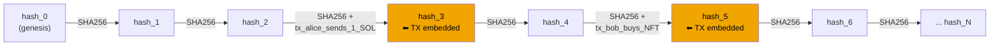
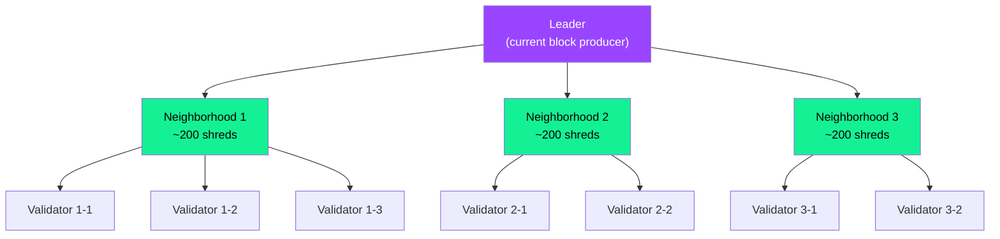
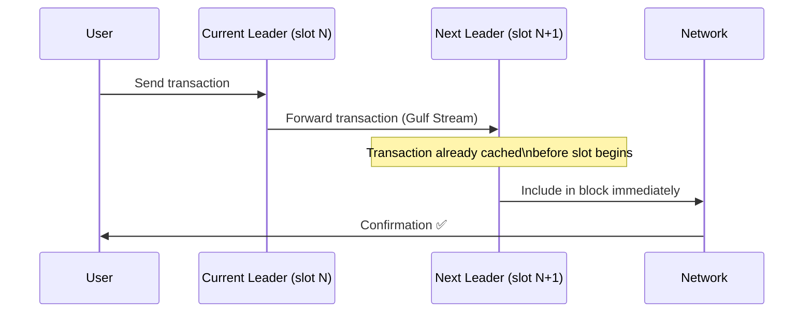
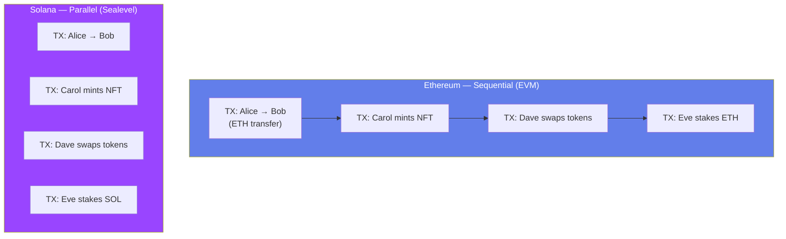
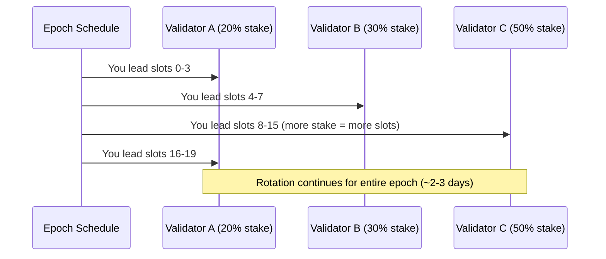
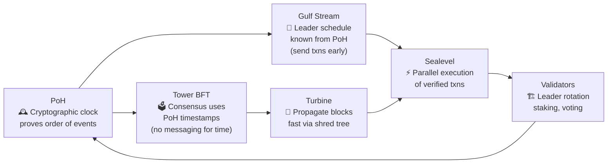

# Chapter 2: Proof of History and Solana Architecture

> "Speed is not a feature. It is the architecture." — how Solana thinks about blockchain design.

---

## 🧭 Who This Chapter Is For

You understand what a blockchain is. You know about wallets, transactions, and maybe even smart contracts. But Solana feels *different* — it processes 65,000+ transactions per second while Ethereum manages around 15-30. Why? The answer is not one single trick. It is six interlocking innovations that work together like gears in a machine.

By the end of this chapter you will understand each gear: what it does, why it exists, and how it connects to the others.

---

## 🕰️ Proof of History — The Blockchain's Clock

### The Problem: Everyone Disagrees on Time

Imagine 1,000 people scattered across the world trying to agree on the order of events without a shared clock. Alice says "I signed the contract at 3:00 PM." Bob says "No, that was 3:02 PM." Who is right? Without a trusted, shared clock, you cannot agree on order without a lot of back-and-forth communication.

Traditional blockchains solve this by including timestamps in blocks and letting validators agree on them through consensus. But consensus takes time — nodes must talk to each other, vote, and wait. The more you talk, the slower you go.

**Solana's insight:** What if you could *prove* that time has passed without asking anyone else?

---

### The Notary Stamp Analogy

Think of a notary public. When you bring a document to a notary, they stamp it with a date and sign it. The stamp is cryptographic proof that the document existed at that moment. You do not need to ask the notary "did this happen?" — the stamp *proves* it.

Proof of History (PoH) is a cryptographic notary that runs continuously. It creates an unforgeable record that proves an event happened *before* another event.

> **Key insight:** PoH is NOT a consensus mechanism. It is a cryptographic clock. Consensus (Tower BFT) runs *on top of* PoH.

---

### How PoH Works — The SHA-256 Hash Chain

PoH works by running SHA-256 hash operations in a continuous loop — feeding each output back as the next input. This is called a **Verifiable Delay Function (VDF)**.

```
hash_0 = SHA256("genesis")
hash_1 = SHA256(hash_0)
hash_2 = SHA256(hash_1)
hash_3 = SHA256(hash_2)
...
hash_N = SHA256(hash_N-1)
```

Each computation takes a tiny but non-zero amount of time. You cannot skip steps — you *must* compute hash_1 before you can compute hash_2. This means that if you see hash_100, you know that the machine ran *at least 100 hash operations* to produce it.

**Including events:** When a transaction arrives, the PoH recorder includes it in the chain:

```
hash_3 = SHA256(hash_2)
hash_4 = SHA256(hash_3 + transaction_data)   ← transaction baked in
hash_5 = SHA256(hash_4)
```

Now hash_4 contains proof that the transaction existed *after* hash_3 and *before* hash_5. This is an unforgeable timestamp — no clock needed, no committee needed.

---

### PoH Chain Diagram



**What this gives us:**
- Proof that `tx_alice_sends_1_SOL` happened *before* `tx_bob_buys_NFT`
- Proof that exactly N hash operations separated them (measurable elapsed time)
- No external clock. No committee vote. Just math.

---

### Why PoH Enables High Throughput

In a normal blockchain, validators must send messages to each other to agree on the order of transactions. This is expensive in time and bandwidth.

With PoH, the **order of events is already proven**. Validators do not need to debate "did this happen before that?" — the PoH sequence *is* the answer. They only need to agree on the validity of transactions, not their order.

This is the key throughput unlock. Less communication = less waiting = more transactions per second.

---

## 🗳️ Tower BFT — Consensus Built on the Clock

### The Committee Analogy

Imagine a board of directors voting on whether to approve a budget. Normally, they argue for hours because each member arrived at a different meeting time and has different information. Now imagine every director is synchronized to the exact same atomic clock and has read the same pre-circulated document. Voting takes minutes instead of hours.

Tower BFT is Solana's consensus mechanism. It is based on PBFT (Practical Byzantine Fault Tolerance) but redesigned to take advantage of PoH.

---

### How Tower BFT Works

1. **PoH gives a common timeline** — all validators can see the PoH sequence and agree on where they are in time.

2. **Validators vote on PoH hashes** — instead of voting on "I think block X is valid," validators vote on "I lock my vote at PoH hash #12345."

3. **Lockout escalation** — each vote has a *lockout period*. If you vote on slot 100, you cannot vote against slot 100 for 2 more slots. If you vote again, lockout doubles (4 slots, then 8, then 16...). This exponentially increases the cost of switching your vote, making double-voting extremely expensive.

4. **Finality** — once a vote has accumulated enough stake behind it (2/3+ of staked SOL), the transaction is finalized.

```
Validator A votes: slot 100 → lockout: 2 slots
Validator A votes: slot 101 → slot 100 lockout: 4 slots, slot 101 lockout: 2
Validator A votes: slot 102 → slot 100 lockout: 8 slots, ...
```

**The result:** Solana achieves finality in ~400ms, compared to Ethereum's ~12 minutes for probabilistic finality.

| Property | Tower BFT (Solana) | PBFT (classic) |
|---|---|---|
| Messaging rounds | 1 (PoH removes need) | 3+ |
| Finality time | ~400ms | Seconds to minutes |
| Relies on | PoH timestamps | Synchronized clocks |
| Fault tolerance | 1/3 of validators | 1/3 of validators |

---

## 📡 Turbine — Getting Blocks to Everyone Fast

### The Newspaper Distribution Analogy

Imagine you print 10,000 newspapers and need to deliver them to 10,000 houses. If you drive to each house yourself, it takes all day. Instead, you give 100 papers to 100 distributors, each distributor gives 10 papers to 10 more people, and suddenly everyone has a paper in minutes.

That is Turbine.

---

### The Bandwidth Bottleneck

As validators increase, sending a full block to all validators at once becomes impossible. A 128MB block sent to 1,000 validators at 1Gbps would take ~1,024 seconds. Solana processes blocks every 400ms — that math does not work.

---

### How Turbine Solves It

Turbine breaks each block into small pieces called **shreds** (like BitTorrent chunks). The leader (current block producer) sends shreds to a tree of validators:

1. **Layer 0:** The leader sends shreds to ~200 validators (neighborhood leaders).
2. **Layer 1:** Each neighborhood leader forwards shreds to ~200 more validators.
3. **Layer 2:** Repeat until all ~1,000+ validators have all shreds.

Each validator only handles a fraction of the data, and the work fans out in parallel across the tree.



**Each shred also contains erasure codes** (like RAID on a hard drive). Even if some validators drop shreds, the full block can be reconstructed from any sufficient subset. This tolerates packet loss without retransmission.

| Approach | Bandwidth at Leader | Scales with validators? |
|---|---|---|
| Direct broadcast | O(N) — sends full block to everyone | No |
| Turbine tree | O(log N) — sends only to first layer | Yes |
| Turbine + erasure codes | O(log N) + fault tolerant | Yes |

---

## 🌊 Gulf Stream — Forwarding Transactions Before the Block is Ready

### The Restaurant Pre-Order Analogy

Imagine a restaurant where you have to wait until a table is free before the chef starts cooking your food. Inefficient. Now imagine you call ahead, pre-order, and when you arrive your meal is already cooking. That is Gulf Stream.

---

### The Traditional Mempool Problem

Most blockchains maintain a **mempool** — a waiting room where unconfirmed transactions sit until a validator picks them up. When the network is busy, transactions can sit in the mempool for minutes or hours. Validators also waste time downloading and processing the mempool.

---

### How Gulf Stream Works

Solana has **no global mempool**. Instead:

1. Solana's validator schedule is known in advance (via PoH — you can calculate who the next leader will be).
2. Your wallet/client **forwards your transaction directly to the expected next leader** (and a few leaders ahead).
3. The leader already has your transaction when their slot begins — they do not wait for a mempool download.



**Benefits:**
- Transactions are pre-loaded into the leader's cache.
- No global mempool = no mempool congestion or gas auctions (mostly).
- Confirmation time drops because there is no mempool wait.

**Trade-off:** If the leader you sent to gets skipped (they go offline), your transaction must be retried with a new leader. Solana transactions have a recent blockhash expiry (~90 seconds) to handle this.

---

## ⚡ Sealevel — Running Thousands of Contracts at Once

### The Highway vs. Single Lane Analogy

Ethereum's EVM is like a single-lane road. Every transaction drives through one at a time. Even if 1,000 transactions are completely unrelated — Alice paying Bob, Carol minting an NFT, Dave swapping tokens — they all wait in a single queue.

Sealevel is like a 50-lane highway. Unrelated transactions drive in parallel.

---

### How Sealevel Enables Parallelism

Every Solana transaction must declare upfront which **accounts it will read and write**. This is not optional — the runtime enforces it.

```rust
// A transaction always specifies accounts it touches
AccountMeta::new(alice_pubkey, false),        // writable: false (read only)
AccountMeta::new(bob_pubkey, true),           // writable: true
AccountMeta::new(token_program_id, false),    // program (executable)
```

Because accounts are declared in advance, the Sealevel runtime can look at a batch of transactions and ask: "Do any of these touch the same writable account?" If not — run them in parallel.

---

### Parallel vs Sequential Execution



**The Sealevel scheduler:**
1. Takes all transactions in a batch.
2. Builds a dependency graph based on shared writable accounts.
3. Groups independent transactions into parallel execution threads.
4. Transactions that *do* share writable accounts are serialized (one after another) within their group.

---

### What This Means for Your Programs

```rust
// Program A: Token transfer — touches only Alice and Bob's accounts
// Program B: NFT mint — touches only Carol's mint account
// → These run SIMULTANEOUSLY on different CPU cores

// Program C: DEX swap — touches liquidity pool account
// Program D: Another DEX swap — also touches the same pool account
// → These must be SERIALIZED (same writable account conflict)
```

**Design implication:** Programs that touch fewer shared accounts are more parallelizable. If you design a program that forces every transaction through a single shared account, you have created a bottleneck (like a single-lane checkpoint on your 50-lane highway).

| Execution Model | Solana (Sealevel) | Ethereum (EVM) |
|---|---|---|
| Transaction ordering | Parallel where possible | Always sequential |
| Account pre-declaration | Required | Not required |
| Throughput ceiling | Multi-core hardware limit | Single-core limit |
| Developer responsibility | Declare all accounts | Nothing extra |
| Contention risk | Shared writable accounts | N/A (always serialized) |

---

## 🏗️ Validator Architecture — Who Runs the Network

### Leader Selection — The Rotating Chairperson

Think of a round-robin meeting where each person gets exactly 4 minutes to speak (their slot). The order is determined in advance by how much stake each validator has. More stake = more frequent turns to speak (produce blocks).

**Each slot lasts 400ms.** A leader gets 4 consecutive slots (one epoch-level assignment), totaling 1.6 seconds to produce blocks.

The schedule is computed from the previous epoch's stake weights and published on-chain. Every validator (and every client) knows who the next 432,000 leaders will be before they produce a single block.



---

### Staking — How Validators Earn Trust

Staking in Solana is how the network assigns economic weight to validators:

1. **Delegators** (token holders) stake SOL to a validator they trust.
2. The validator's **vote power** in Tower BFT is proportional to delegated stake.
3. Validators earn **inflation rewards** for voting correctly and producing valid blocks.
4. Validators can be **slashed** (penalized) for double-voting (equivocation).

```typescript
// Example: Delegating stake via @solana/web3.js
import {
  Connection,
  Keypair,
  PublicKey,
  StakeProgram,
  Authorized,
  Lockup,
  sendAndConfirmTransaction,
} from "@solana/web3.js";

const connection = new Connection("https://api.mainnet-beta.solana.com");
const staker = Keypair.generate(); // your wallet

// Create a stake account
const stakeAccount = Keypair.generate();
const createStakeAccountTx = StakeProgram.createAccount({
  fromPubkey: staker.publicKey,
  stakePubkey: stakeAccount.publicKey,
  authorized: new Authorized(
    staker.publicKey, // staker authority
    staker.publicKey  // withdrawer authority
  ),
  lockup: new Lockup(0, 0, staker.publicKey),
  lamports: 1_000_000_000, // 1 SOL = 1,000,000,000 lamports
});

// Delegate to a validator
const validatorVoteAccount = new PublicKey("VALIDATOR_VOTE_ACCOUNT_PUBKEY");
const delegateTx = StakeProgram.delegate({
  stakePubkey: stakeAccount.publicKey,
  authorizedPubkey: staker.publicKey,
  votePubkey: validatorVoteAccount,
});

await sendAndConfirmTransaction(connection, createStakeAccountTx, [staker, stakeAccount]);
await sendAndConfirmTransaction(connection, delegateTx, [staker]);
```

---

### Vote Transactions — The Heartbeat of Consensus

Every validator sends **vote transactions** on every slot — roughly every 400ms. These votes:
- Confirm which PoH hash (slot) the validator has verified.
- Count toward Tower BFT finality.
- Cost ~0.000005 SOL each and are paid by the validator.

This is why validators need constant uptime. A validator that stops voting loses rewards and the network loses their vote weight for finality.

```
Validator → Network: "I have verified slot #123456789, hash 0xABCD..."
           → This vote is a real Solana transaction on-chain
           → Tower BFT aggregates votes to determine finality
```

**Key numbers:**
- ~1 vote transaction per slot (400ms)
- ~2,500 vote transactions per validator per day
- ~1,500+ active validators on mainnet

---

## 🔀 How It All Fits Together

The six innovations are not independent. They form a pipeline:



1. **PoH** provides a verifiable sequence (the clock).
2. **Tower BFT** uses that clock for fast consensus.
3. **Gulf Stream** uses the known leader schedule to pre-route transactions.
4. **Turbine** distributes blocks efficiently across validators.
5. **Sealevel** processes transactions in parallel using declared account access.
6. **Validators** vote, rotate, and restart the cycle.

Remove any one component and the system degrades significantly.

---

## When to Use / When NOT to Use These Concepts

### When Solana's Architecture Shines

- **High-frequency trading or DeFi** — sub-second finality, parallel execution, no mempool congestion.
- **Gaming and NFTs with many simultaneous users** — Sealevel handles independent transactions in parallel.
- **Applications needing predictable low fees** — no gas auctions (fees are nearly fixed at ~0.000005 SOL per signature).
- **Real-time applications** — 400ms block times, ~400ms finality for most transactions.

### When to Think Carefully (Trade-offs)

- **Programs with shared global state** — if every user must write to the same account (e.g., a single counter), Sealevel cannot parallelize. Design your data layout carefully.
- **Very complex transactions** — Solana has a compute unit limit per transaction. Ethereum can do more per transaction because EVM has higher per-tx compute limits (with gas).
- **Decentralization concerns** — running a Solana validator requires high-end hardware (256GB+ RAM, fast NVMe, 1Gbps+ connection). This raises the hardware bar compared to Ethereum.
- **Restart recovery** — Solana has historically had network outages during heavy spam attacks. The architecture is improving but is not yet as battle-hardened as Ethereum for extreme edge cases.

---

## 🔑 Key Takeaways

| Concept | What It Is | Problem It Solves |
|---|---|---|
| **Proof of History** | SHA-256 hash chain = cryptographic clock | Proves order of events without committee vote |
| **Tower BFT** | PBFT-based consensus on top of PoH | Fast finality (~400ms) with fewer messages |
| **Turbine** | Block shredding + tree propagation | Bandwidth bottleneck as validators scale |
| **Gulf Stream** | Mempool-less tx forwarding to next leader | Reduces confirmation time, eliminates mempool |
| **Sealevel** | Parallel smart contract execution | Utilizes multi-core CPUs, massively increases throughput |
| **Validator / Leader** | Stake-weighted rotating block producers | Decentralized block production with economic incentives |

**Three sentences to remember forever:**

1. PoH is a clock, not a consensus mechanism — it proves that time passed using a hash chain, so nodes never have to argue about event order.
2. Sealevel runs unrelated transactions in parallel because every Solana transaction must declare its accounts upfront, making conflicts detectable before execution.
3. All six innovations (PoH, Tower BFT, Gulf Stream, Turbine, Sealevel, validators) are a single integrated pipeline — removing one piece collapses the throughput advantages.

---

## 📚 What to Read Next

- **Chapter 3: Accounts and Programs** — Solana's data model (everything is an account) and how programs (smart contracts) work.
- **Chapter 4: Writing Your First Program in Rust** — Anchor framework, instruction handlers, account validation.
- **Chapter 5: Tokens on Solana** — The SPL Token program, minting, burning, and associated token accounts.

---

*Last updated: 2026-06-26 | Solana version references: mainnet-beta, Agave validator client*
