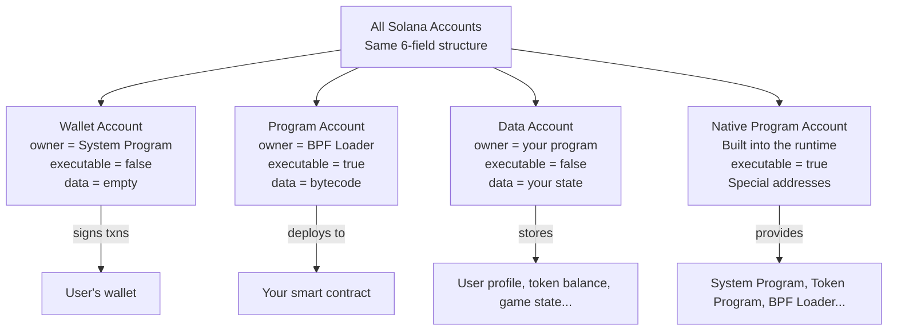
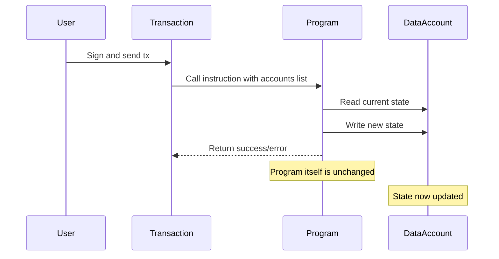
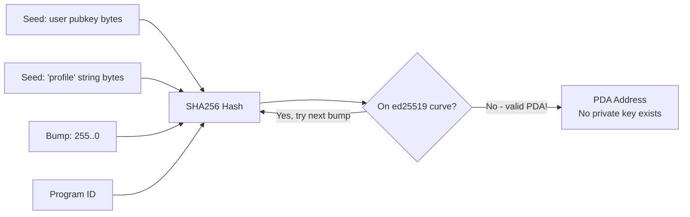
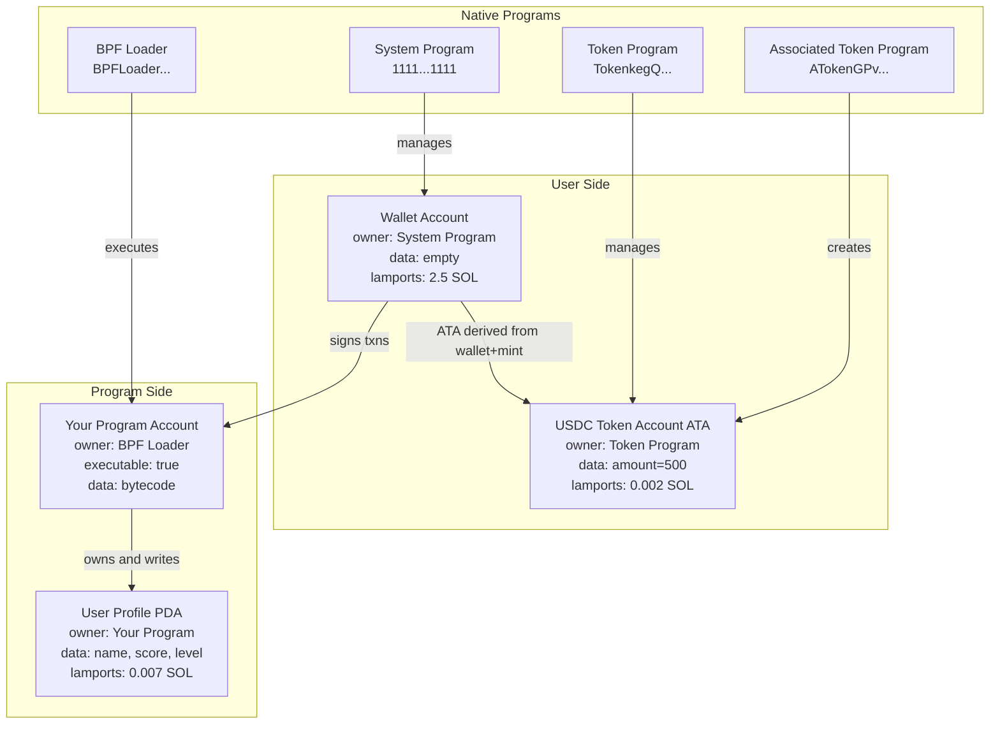

# Chapter 3: Solana Account Model

> "In Solana, everything is an account. Code is an account. Data is an account. Your wallet is an account. Once you truly understand this, Solana clicks."

---

## 🗺️ The Big Picture: Why Accounts Matter

Before you write a single line of Solana code, you need to understand one foundational truth:

**Solana stores everything — wallets, programs, token balances, configuration — inside accounts.**

This is different from how most blockchains work, and it is the key to understanding why Solana is fast, cheap, and sometimes confusing at first.

Let us start with a real-world analogy.

---

## 🏦 Real-World Analogy: The Bank Vault

Imagine Solana as a massive bank with millions of safety deposit boxes. Each box has:

- A unique **box number** (the address / public key)
- A **lock** that only the owner can open
- Some **cash inside** (SOL lamports)
- Some **documents** (data — arbitrary bytes)
- A **label** that says who manages the box (owner program)
- A tag saying whether this box is **executable** (is it a machine, or just storage?)

Anyone can look inside any box (all state is public). But only the designated owner program can change what is inside.

---

## ⚔️ Solana vs Ethereum: A Fundamental Difference

If you come from Ethereum, you are used to two types of things: **Externally Owned Accounts (EOA)** and **Smart Contracts**. They are separate, different beasts.

Solana collapses this distinction. Everything is just an **account**. The difference is in the fields.

| Feature | Ethereum | Solana |
|---|---|---|
| Wallet | EOA (has private key, no code) | Account owned by System Program |
| Smart Contract | Contract account (has code + state bundled) | Program account (code only, no state!) |
| Contract State | Stored inside the contract | Stored in separate data accounts |
| Address type | Hash of public key or contract deployment | Public key (32 bytes) |
| Code + State | Bundled together | Strictly separated |
| Upgradeable by default | No (unless proxy pattern) | Yes (programs are upgradeable) |

The biggest difference: **Solana programs are stateless**. They hold zero data about what has happened. All state lives in separate data accounts. This separation is what allows Solana to parallelize transactions at massive scale.

---

## 🧱 Account Structure: Every Field Explained

Every single account on Solana has exactly these six fields:

```
Account {
  key:        Pubkey,     // 32-byte address — the "box number"
  lamports:   u64,        // balance in lamports (1 SOL = 1,000,000,000 lamports)
  owner:      Pubkey,     // which program is allowed to modify this account
  data:       Vec<u8>,    // arbitrary bytes — the "documents" inside the box
  executable: bool,       // if true, this account contains a deployed program
  rent_epoch: u64,        // legacy field, mostly 0 after rent reform
}
```

Let us go through each field one by one.

### `key` — The Address

This is the public key. It uniquely identifies the account. When you send SOL to someone, you are sending it to their `key`. When you deploy a program, it gets a `key`. 32 bytes, encoded as a Base58 string like `7xKXtg2CW87d97TXJSDpbD5jBkheTqA83TZRuJosgAsU`.

### `lamports` — The Balance

SOL is stored in lamports. 1 SOL = 1,000,000,000 lamports (one billion). Even program accounts and data accounts can hold lamports — and they must hold a minimum amount to stay alive (more on this in the Rent section).

### `owner` — Who Can Write Here

This is one of the most important fields. Only the program listed as `owner` can modify an account's `data` and `lamports`. The System Program can transfer lamports on behalf of wallets. A custom program can only modify accounts it owns. If a program tries to modify an account it does not own, the transaction fails.

### `data` — The Bytes

This is raw byte storage. For a wallet account it is empty (zero bytes). For a program account it holds compiled BPF bytecode. For a data account it holds whatever your program decided to serialize there — a struct, a JSON blob, a game state, a token balance.

### `executable` — Is This Code?

If `true`, the `data` field contains deployed program bytecode. If `false`, it is a data or wallet account. You cannot call a non-executable account as a program. This field is set by the BPF Loader when you deploy.

### `rent_epoch` — Legacy Field

After Solana's rent reform, this field is mostly deprecated and set to `u64::MAX` for rent-exempt accounts. You will see it in account structs but can mostly ignore it.

---

## 🗂️ The Four Account Types

All accounts share the same structure. What makes them different is their `owner`, `executable` flag, and what is in their `data`.



### Type 1: Wallet Accounts (owned by System Program)

When you create a Solana wallet, you get a key pair. The public key becomes your account address. The account is owned by the **System Program** (`11111111111111111111111111111111`).

- `owner` = System Program
- `executable` = false
- `data` = empty (0 bytes)
- `lamports` = your SOL balance

The System Program is the only program allowed to create new accounts and transfer lamports from wallet accounts (when the wallet signs the transaction).

### Type 2: Program Accounts (owned by BPF Loader)

When you deploy a Solana program, the compiled bytecode is stored in an account. This account is owned by the BPF Loader (the runtime component that executes programs).

- `owner` = BPF Loader (`BPFLoaderUpgradeab1e11111111111111111111111`)
- `executable` = true
- `data` = compiled BPF bytecode
- `lamports` = enough SOL to be rent-exempt

Programs are read-only at runtime — they execute but never modify themselves during a transaction.

### Type 3: Data Accounts (owned by your program)

This is where your program's state lives. A data account is a regular account whose `owner` is set to your program's address. Only your program can modify it.

Examples:
- A user's profile: `{ name: "Alice", score: 9001 }`
- A token balance: `{ amount: 500 }`
- A game board state: `{ board: [0,1,0,2,...] }`

Your program must define the data layout and handle serialization (usually with the `borsh` crate in Rust).

### Type 4: Native Programs

These are programs that come built into the Solana runtime. They live at well-known addresses and provide core infrastructure.

| Program | Address (shortened) | What it does |
|---|---|---|
| System Program | `1111...1111` | Create accounts, transfer SOL, allocate space |
| Token Program | `TokenkegQ...` | Create tokens, mint, burn, transfer SPL tokens |
| Associated Token Program | `ATokenGPv...` | Create deterministic token accounts for wallets |
| BPF Loader | `BPFLoader...` | Deploy and execute programs |
| Sysvar Clock | `SysvarC1ock...` | Current cluster time and slot |
| Sysvar Rent | `SysvarRent...` | Current rent parameters |

---

## 💸 Rent: Why Accounts Must Hold SOL

Imagine renting storage space. If you stop paying, your stuff gets thrown out. Solana has the same concept for accounts.

Every byte stored on-chain costs resources (validators must keep it in memory). To compensate validators, accounts must maintain a minimum SOL balance called the **rent-exempt threshold**.

The formula is roughly:

```
minimum_lamports = (128 + data_size_bytes) * lamports_per_byte_year * 2
```

The `* 2` means you pre-pay for 2 years of rent upfront — this makes you **rent-exempt**, meaning the account lives forever and never gets garbage-collected.

### Real Numbers

| Data Size | Approximate Minimum SOL |
|---|---|
| 0 bytes (wallet) | ~0.00089 SOL |
| 165 bytes (token account) | ~0.002 SOL |
| 1000 bytes (small data account) | ~0.007 SOL |
| 10,000 bytes (larger state) | ~0.07 SOL |

### When to Use / When NOT to Use Large Accounts

**Use small accounts when:**
- You only need a handful of fields (e.g., a user score, a flag)
- You want to minimize rent cost for your users

**Do NOT use one giant account when:**
- You need to store a dynamic list (Solana accounts have a fixed max size at creation)
- You need to store per-user data for thousands of users (create one account per user instead)

### Closing an Account (Reclaiming Rent)

When you no longer need a data account, your program can close it — setting its lamports to zero and transferring the SOL back to the user. This is a common pattern to give users a refund.

---

## 🤖 Programs Are Stateless: The Core Mental Model

This is the hardest concept for developers coming from Ethereum.

In Ethereum, your contract is a single object: it has code AND it stores its own variables.

In Solana, your program is pure logic — like a function. It receives accounts as arguments, reads from them, writes to them, and exits. The program itself stores nothing between calls.



Think of a Solana program like a calculator. The calculator does not remember your last calculation. You give it numbers (accounts), it does math, it gives you a result. The memory lives on a notepad (data account) beside the calculator — not inside the calculator itself.

---

## 🔑 Program Derived Addresses (PDA)

### The Problem PDAs Solve

Your program needs to own data accounts. But if you create a regular keypair and set that as the owner, who controls that keypair? If you lose the private key, you lose control of the account. And programs cannot sign transactions with a regular private key anyway.

PDAs solve this by creating addresses that:
1. Are deterministically derived from seeds + your program ID
2. Do NOT have a corresponding private key (no one can sign from them normally)
3. Can be "signed for" by your program itself inside the runtime

### How PDAs Are Derived

The derivation takes your seeds (arbitrary bytes) and your program ID, hashes them, and checks if the result is off the ed25519 elliptic curve. If it is on the curve, a `bump` byte is subtracted until it falls off the curve (off-curve = no private key exists).



### Finding a PDA in Code

```typescript
import { PublicKey } from "@solana/web3.js";

const programId = new PublicKey("YourProgramId11111111111111111111111111111111");
const userPubkey = new PublicKey("UserWallet111111111111111111111111111111111");

// findProgramAddressSync returns [pda, bump]
// The bump is the value that pushed the hash off the curve
const [profilePda, bump] = PublicKey.findProgramAddressSync(
  [
    Buffer.from("profile"),   // string seed
    userPubkey.toBuffer(),    // user's pubkey as seed
  ],
  programId
);

console.log("Profile PDA:", profilePda.toBase58());
console.log("Bump seed:", bump); // usually 254 or 255
```

### Why the Bump Must Be Stored

Because finding the PDA is deterministic (same seeds = same PDA), you can always re-derive it. But the bump is needed for your program to "sign" for the PDA inside the runtime. It is standard practice to store the bump inside the data account itself.

### How Programs Sign With a PDA (CPI + PDA Signer)

When your program calls another program (Cross-Program Invocation / CPI) and needs to authorize a PDA it controls, it passes the seeds + bump as `signer_seeds`. The runtime re-derives the PDA and confirms your program owns it.

```rust
// Inside your Solana program (Anchor framework)
use anchor_lang::prelude::*;

// When your program needs to transfer SOL from a PDA vault to a user:
let transfer_ix = anchor_lang::solana_program::system_instruction::transfer(
    &vault_pda.key(),
    &recipient.key(),
    amount,
);

anchor_lang::solana_program::program::invoke_signed(
    &transfer_ix,
    &[vault_pda.to_account_info(), recipient.to_account_info()],
    &[&[
        b"vault",                    // seed 1
        authority.key().as_ref(),    // seed 2
        &[vault_bump],               // the bump
    ]],
)?;
```

### When to Use PDAs / When NOT to Use

| Use PDAs when... | Do NOT use PDAs when... |
|---|---|
| You need a deterministic address for per-user state | You just need a regular wallet to hold SOL for a user |
| Your program needs to sign for an account (e.g., escrow, vault) | The account should be controlled by a human (use a regular keypair) |
| You want users to always be able to re-derive the address without storing it | You need true randomness in the address |
| Creating program-controlled token vaults | Creating token accounts the user will control directly |

---

## 🎟️ Associated Token Account (ATA): Deterministic Token Storage

### The Problem

Every token on Solana is an SPL token. To hold an SPL token, you need a **token account** — a data account that stores your balance for that specific token mint. You might hold 50 different tokens, which means 50 different token accounts.

Without a standard, how would Alice know where to send USDC to Bob? She would need to ask Bob for his USDC token account address specifically.

### The Solution: ATA

The **Associated Token Program** defines a deterministic PDA for every (wallet, mint) pair. Given Alice's wallet and the USDC mint, anyone can compute exactly where Alice's USDC token account should live.

```
ATA address = PDA derived from:
  - wallet address
  - Token Program ID
  - mint address
  Program: Associated Token Program
```

```typescript
import { getAssociatedTokenAddress } from "@solana/spl-token";
import { PublicKey } from "@solana/web3.js";

const walletAddress = new PublicKey("Alice111111111111111111111111111111111111111");
const usdcMintAddress = new PublicKey("EPjFWdd5AufqSSqeM2qN1xzybapC8G4wEGGkZwyTDt1v"); // USDC on mainnet

const aliceUsdcAta = await getAssociatedTokenAddress(
  usdcMintAddress,  // mint
  walletAddress     // owner wallet
);

console.log("Alice's USDC token account:", aliceUsdcAta.toBase58());
// This is deterministic — always the same address for this wallet+mint pair
```

### Creating an ATA

ATAs do not exist until someone creates them (pays the rent). Usually the sender creates the ATA before sending tokens.

```typescript
import {
  createAssociatedTokenAccountInstruction,
  getAssociatedTokenAddress,
  TOKEN_PROGRAM_ID,
  ASSOCIATED_TOKEN_PROGRAM_ID,
} from "@solana/spl-token";
import { Connection, Transaction, sendAndConfirmTransaction } from "@solana/web3.js";

async function createAtaIfNeeded(
  connection: Connection,
  payer: Keypair,
  mint: PublicKey,
  owner: PublicKey
): Promise<PublicKey> {
  const ata = await getAssociatedTokenAddress(mint, owner);

  // Check if the ATA already exists
  const accountInfo = await connection.getAccountInfo(ata);
  if (accountInfo !== null) {
    console.log("ATA already exists:", ata.toBase58());
    return ata;
  }

  // Create the ATA
  const tx = new Transaction().add(
    createAssociatedTokenAccountInstruction(
      payer.publicKey,   // payer of rent
      ata,               // the ATA address to create
      owner,             // wallet that will own the ATA
      mint,              // which token mint
      TOKEN_PROGRAM_ID,
      ASSOCIATED_TOKEN_PROGRAM_ID
    )
  );

  await sendAndConfirmTransaction(connection, tx, [payer]);
  console.log("Created ATA:", ata.toBase58());
  return ata;
}
```

---

## 🧩 Full Account Model Diagram

Here is how all the pieces fit together in a real dApp:



---

## 🛠️ Putting It All Together: A Mini dApp Walkthrough

Let us trace what happens when a user calls an instruction to update their profile in a simple dApp.

**Scenario:** User "Alice" calls `update_profile` with `new_score = 42`.

**Accounts passed to the instruction:**
1. `alice_wallet` — the signer (wallet account)
2. `alice_profile_pda` — Alice's profile data account (owned by your program)
3. `system_program` — needed for potential account creation

**Inside the program:**

```rust
// Anchor framework example
use anchor_lang::prelude::*;

#[program]
pub mod my_dapp {
    use super::*;

    pub fn update_profile(ctx: Context<UpdateProfile>, new_score: u64) -> Result<()> {
        let profile = &mut ctx.accounts.profile;

        // Validate: only the owner can update their own profile
        require!(
            profile.owner == ctx.accounts.user.key(),
            MyError::Unauthorized
        );

        // Update the state in the data account
        profile.score = new_score;
        profile.updated_at = Clock::get()?.unix_timestamp;

        msg!("Profile updated! New score: {}", new_score);
        Ok(())
    }
}

#[derive(Accounts)]
pub struct UpdateProfile<'info> {
    #[account(mut)]
    pub user: Signer<'info>,  // wallet account — must sign

    #[account(
        mut,
        seeds = [b"profile", user.key().as_ref()],  // PDA derivation
        bump = profile.bump,
        has_one = owner,  // checks profile.owner == user.key()
    )]
    pub profile: Account<'info, UserProfile>,  // data account

    pub system_program: Program<'info, System>,
}

#[account]
pub struct UserProfile {
    pub owner: Pubkey,       // 32 bytes
    pub score: u64,          // 8 bytes
    pub level: u32,          // 4 bytes
    pub updated_at: i64,     // 8 bytes
    pub bump: u8,            // 1 byte — store the PDA bump
}
// Total: 53 bytes of data
```

**What happened on-chain:**
1. Runtime received the transaction with Alice's signature
2. Program was loaded from the program account (BPF bytecode)
3. `profile` data account was passed in; runtime checked `owner == your_program_id`
4. Program read the current state from `profile.data`
5. Program wrote the new score to `profile.data`
6. Transaction finalized — validators replicated the new state

---

## 📊 Quick Reference: Account Ownership Rules

| Who owns the account | Who can change `data` and `lamports` | Example |
|---|---|---|
| System Program | System Program (when user signs) | Wallet account |
| BPF Loader | BPF Loader (only during deploy/upgrade) | Program account |
| Your Program | Your program (when called via instruction) | Profile PDA, vault account |
| Token Program | Token Program (when valid authority signs) | ATA, token mint |

The golden rule: **only the account's owner program can modify its data.**

---

## 🚦 When to Use Each Pattern

### Regular Keypair Account
- **Use when:** Storing SOL for a user, creating a hot wallet, testing
- **Do not use when:** You need the account to be controlled by your program

### PDA (no private key, program-controlled)
- **Use when:** Per-user state (profile, inventory), escrow vaults, program-owned liquidity pools
- **Do not use when:** The user needs to independently control the account without going through your program

### ATA (Associated Token Account)
- **Use when:** Storing SPL tokens for a user (always use ATA as the default)
- **Do not use when:** You need multiple token accounts for the same wallet/mint pair (edge case: order books)

### Separate Data Account per User (not one giant account)
- **Use when:** You have many users with individual state
- **Do not use when:** The state is global and small (use a single config PDA owned by the program)

---

## ✅ Key Takeaways

1. **Everything is an account.** Wallets, programs, data — all the same six-field structure. The `owner` and `executable` fields determine what kind it is.

2. **Programs are stateless.** A Solana program is pure logic. State always lives in separate data accounts that the program owns. This is the opposite of Ethereum contracts.

3. **Only the owner program can write.** You cannot accidentally modify someone else's account from your program. The runtime enforces this at every instruction.

4. **Rent keeps accounts alive.** Every account must hold a minimum SOL balance (rent-exempt threshold) or it gets deleted. Always fund new accounts with enough SOL.

5. **PDAs are the key to program-controlled state.** Derived deterministically from seeds + program ID. No private key. Your program signs for them during CPI using signer seeds.

6. **ATAs give every wallet a canonical token address.** Anyone can compute where your USDC lives without asking you. The Associated Token Program standardizes this.

7. **Separate accounts = parallelism.** Because each transaction declares its accounts upfront, Solana can run non-overlapping transactions in parallel. Keeping state in separate small accounts is a feature, not a limitation.

---

## 🔗 What Comes Next

Now that you understand accounts, you are ready to learn:
- **Chapter 4: Writing Your First Solana Program** — using Anchor to write Rust programs that create and modify accounts
- **Chapter 5: Transactions and Instructions** — how instructions reference accounts, how the runtime validates ownership, and how to batch multiple instructions
- **Chapter 6: Cross-Program Invocations (CPI)** — how your program calls the Token Program or other programs, using PDA signing

---

*Last updated: 2026-06-26 | Solana version reference: 1.18.x / Anchor 0.30.x*
