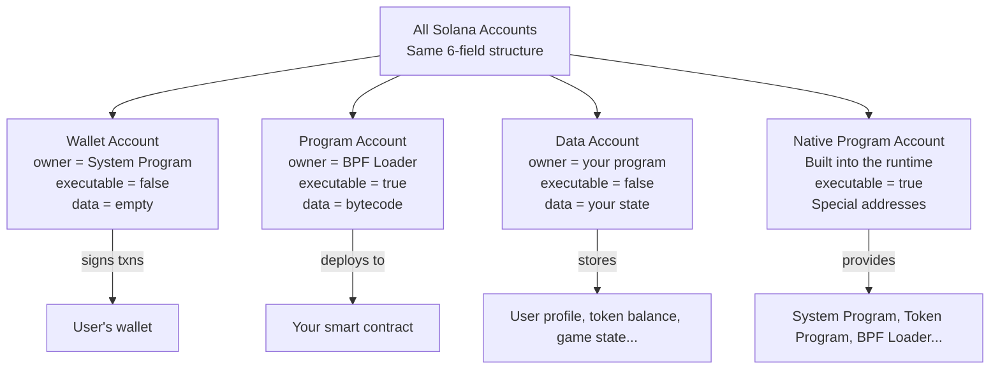
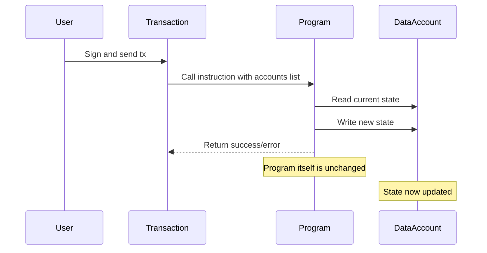
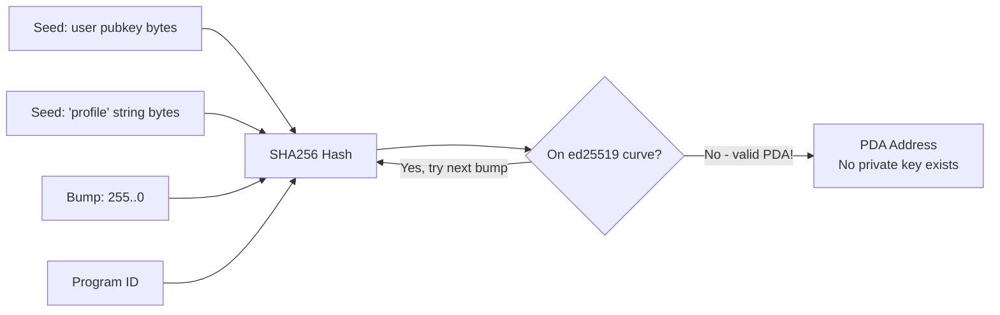
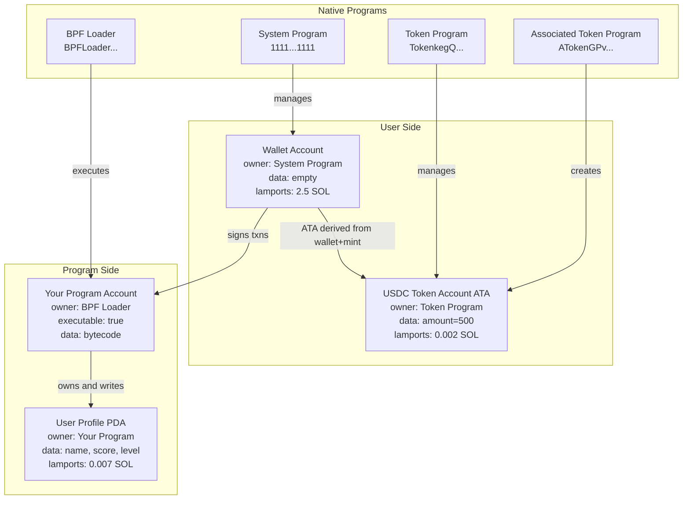

# Chapter 3: Solana Account Model

> "Solana mein sab kuch ek account hai. Code bhi account hai. Data bhi account hai. Tumhara wallet bhi account hai. Ek baar yeh baat samajh mein aa gayi, toh Solana click ho jaata hai."

---

## 🗺️ Big Picture: Accounts Itne Important Kyun Hain?

Solana ka ek line of code likhne se pehle, ek foundational cheez samajh lo:

**Solana har cheez — wallets, programs, token balances, configuration — sab kuch accounts ke andar store karta hai.**

Yeh baaki blockchains se bilkul alag tareeka hai, aur yahi wajah hai ki Solana fast, cheap hai — aur shuru mein thoda confusing bhi lagta hai.

Chalo ek real-world analogy se shuru karte hain.

---

## 🏦 Real-World Analogy: Bank Locker

Socho Solana ek bahut bada bank hai jismein lakhon safety deposit boxes (lockers) hain. Har box mein hota hai:

- Ek unique **box number** (address / public key)
- Ek **lock** jo sirf owner khol sakta hai
- Kuch **cash andar** (SOL lamports)
- Kuch **documents** (data — arbitrary bytes)
- Ek **label** jo batata hai ki is box ko kaun manage karta hai (owner program)
- Ek tag jo batata hai ki yeh box **executable** hai ya nahi (yeh ek machine hai ya sirf storage?)

Koi bhi kisi bhi box ke andar jhaank sakta hai (saara state public hai). Lekin sirf designated owner program hi andar ka saamaan badal sakta hai.

---

## ⚔️ Solana vs Ethereum: Fundamental Farak

Agar tum Ethereum se aaye ho, toh tumhe do cheezon ki aadat hai: **Externally Owned Accounts (EOA)** aur **Smart Contracts**. Yeh dono alag-alag jaanwar hain.

Solana yeh distinction hi khatam kar deta hai. Yahan sab kuch ek **account** hai. Farak sirf fields mein hai.

| Feature | Ethereum | Solana |
|---|---|---|
| Wallet | EOA (private key hai, code nahi) | System Program ka owned account |
| Smart Contract | Contract account (code + state ek saath bundled) | Program account (sirf code, koi state nahi!) |
| Contract State | Contract ke andar hi store hota hai | Alag data accounts mein store hota hai |
| Address type | Public key ya contract deployment ka hash | Public key (32 bytes) |
| Code + State | Ek saath bundled | Strictly separate |
| By default upgradeable? | Nahi (jab tak proxy pattern na ho) | Haan (programs upgrade ho sakte hain) |

Sabse bada farak: **Solana programs stateless hote hain**. Unhe kuch bhi yaad nahi rehta ki ab tak kya hua. Saara state alag data accounts mein rehta hai. Yahi separation Solana ko massive scale par transactions parallelize karne deta hai.

---

## 🧱 Account Structure: Har Field Explain Ki Gayi

Solana ke har single account mein exactly yeh chhe fields hote hain:

```
Account {
  key:        Pubkey,     // 32-byte address — "box number"
  lamports:   u64,        // balance lamports mein (1 SOL = 1,000,000,000 lamports)
  owner:      Pubkey,     // kaunsa program is account ko modify kar sakta hai
  data:       Vec<u8>,    // arbitrary bytes — box ke andar ke "documents"
  executable: bool,       // true ho toh iska matlab yeh account ek deployed program hai
  rent_epoch: u64,        // legacy field, rent reform ke baad mostly 0
}
```

Chalo ek-ek field ko dekhte hain.

### `key` — Address

Yeh public key hai. Account ko uniquely identify karta hai. Jab tum kisi ko SOL bhejte ho, toh unke `key` par bhej rahe ho. Jab tum program deploy karte ho, usko bhi ek `key` milta hai. 32 bytes, Base58 string ki tarah encode hota hai — jaise `7xKXtg2CW87d97TXJSDpbD5jBkheTqA83TZRuJosgAsU`.

### `lamports` — Balance

SOL lamports mein store hota hai. 1 SOL = 1,000,000,000 lamports (ek billion). Program accounts aur data accounts bhi lamports hold kar sakte hain — aur unhe zinda rehne ke liye ek minimum amount hold karna padta hai (Rent section mein detail mein baat karenge).

### `owner` — Kaun Yahan Likh Sakta Hai

Yeh sabse important fields mein se ek hai. Sirf woh program jo `owner` mein listed hai, account ka `data` aur `lamports` modify kar sakta hai. System Program wallets ki taraf se lamports transfer kar sakta hai. Koi custom program sirf usi account ko modify kar sakta hai jise woh owns karta hai. Agar koi program aisa account modify karne ki koshish kare jo uska nahi hai, toh transaction fail ho jaata hai.

### `data` — Bytes

Yeh raw byte storage hai. Wallet account ke liye yeh empty hota hai (zero bytes). Program account ke liye yahan compiled BPF bytecode hota hai. Data account ke liye yahan wahi hota hai jo tumhare program ne serialize karke rakha hai — ek struct, JSON blob, game state, token balance, kuch bhi.

### `executable` — Yeh Code Hai Kya?

Agar `true` hai, toh `data` field mein deployed program bytecode hai. Agar `false` hai, toh yeh data ya wallet account hai. Tum non-executable account ko program ki tarah call nahi kar sakte. Yeh field BPF Loader set karta hai jab tum deploy karte ho.

### `rent_epoch` — Legacy Field

Solana ke rent reform ke baad, yeh field mostly deprecated ho chuki hai aur rent-exempt accounts ke liye `u64::MAX` set rehti hai. Account structs mein dikh jaayega lekin mostly ignore kar sakte ho.

---

## 🗂️ Char Types Ke Accounts

Saare accounts ka structure same hota hai. Farak unke `owner`, `executable` flag, aur `data` mein kya hai — usse aata hai.



### Type 1: Wallet Accounts (owned by System Program)

Jab tum ek Solana wallet banate ho, tumhe ek key pair milta hai. Public key hi tumhara account address ban jaata hai. Yeh account **System Program** (`11111111111111111111111111111111`) ke owner mein hota hai.

- `owner` = System Program
- `executable` = false
- `data` = empty (0 bytes)
- `lamports` = tumhara SOL balance

System Program ek hi program hai jo naye accounts create kar sakta hai aur wallet accounts se lamports transfer kar sakta hai (jab wallet transaction sign kare).

### Type 2: Program Accounts (owned by BPF Loader)

Jab tum ek Solana program deploy karte ho, compiled bytecode ek account mein store hota hai. Is account ka owner BPF Loader (jo runtime component programs execute karta hai) hota hai.

- `owner` = BPF Loader (`BPFLoaderUpgradeab1e11111111111111111111111`)
- `executable` = true
- `data` = compiled BPF bytecode
- `lamports` = itna SOL ki rent-exempt ho jaaye

Programs runtime par read-only hote hain — woh execute hote hain lekin transaction ke dauraan khud ko kabhi modify nahi karte.

### Type 3: Data Accounts (owned by your program)

Yahin tumhare program ka state rehta hai. Data account ek regular account hi hota hai jiska `owner` tumhare program ke address par set hota hai. Sirf tumhara program hi ise modify kar sakta hai.

Examples:
- Kisi user ki profile: `{ name: "Alice", score: 9001 }`
- Token balance: `{ amount: 500 }`
- Game board state: `{ board: [0,1,0,2,...] }`

Tumhara program hi data layout define karta hai aur serialization handle karta hai (Rust mein usually `borsh` crate use hota hai).

### Type 4: Native Programs

Yeh woh programs hain jo Solana runtime mein built-in aate hain. Yeh well-known addresses par rehte hain aur core infrastructure provide karte hain.

| Program | Address (shortened) | Kya karta hai |
|---|---|---|
| System Program | `1111...1111` | Accounts create karna, SOL transfer karna, space allocate karna |
| Token Program | `TokenkegQ...` | Tokens create, mint, burn, transfer SPL tokens |
| Associated Token Program | `ATokenGPv...` | Wallets ke liye deterministic token accounts banana |
| BPF Loader | `BPFLoader...` | Programs deploy aur execute karna |
| Sysvar Clock | `SysvarC1ock...` | Current cluster time aur slot |
| Sysvar Rent | `SysvarRent...` | Current rent parameters |

---

## 💸 Rent: Accounts Ko SOL Kyun Hold Karna Padta Hai

Socho tumne storage space rent par li hai. Agar rent nahi bhari, toh saamaan bahar phenk diya jaata hai. Solana mein accounts ke saath bhi yahi concept hai.

Chain par store hone wala har byte resources consume karta hai (validators ko usse memory mein rakhna padta hai). Validators ko compensate karne ke liye, accounts ko ek minimum SOL balance maintain karna padta hai jise **rent-exempt threshold** kehte hain.

Formula roughly kuch aisa hai:

```
minimum_lamports = (128 + data_size_bytes) * lamports_per_byte_year * 2
```

`* 2` ka matlab hai tum 2 saal ka rent pehle hi pay kar dete ho — isse tum **rent-exempt** ho jaate ho, matlab account hamesha ke liye zinda rehta hai aur kabhi garbage-collect nahi hota.

### Real Numbers

| Data Size | Approximate Minimum SOL |
|---|---|
| 0 bytes (wallet) | ~0.00089 SOL |
| 165 bytes (token account) | ~0.002 SOL |
| 1000 bytes (chota data account) | ~0.007 SOL |
| 10,000 bytes (bada state) | ~0.07 SOL |

### Kab Bade Accounts Use Karein / Kab Na Karein

**Chhote accounts use karo jab:**
- Sirf kuch fields chahiye (jaise ek user score, ek flag)
- Users ke liye rent cost minimize karni hai

**Ek hi giant account mat banao jab:**
- Dynamic list store karni ho (Solana accounts ka creation ke time hi fixed max size hoti hai)
- Hazaaron users ka per-user data store karna ho (uske jagah har user ke liye ek separate account banao)

### Account Close Karna (Rent Wapas Lena)

Jab tumhe koi data account ki zaroorat nahi rehti, tumhara program usse close kar sakta hai — lamports ko zero karke SOL user ko wapas transfer kar sakta hai. Yeh ek common pattern hai users ko refund dene ke liye.

---

## 🤖 Programs Stateless Hote Hain: Core Mental Model

Yeh Ethereum se aane wale developers ke liye sabse tough concept hai.

Ethereum mein tumhara contract ek single object hai: usme code bhi hai AUR woh apne khud ke variables bhi store karta hai.

Solana mein tumhara program pure logic hai — ek function jaisa. Yeh accounts ko arguments ki tarah leta hai, unse read karta hai, unme likhta hai, aur exit ho jaata hai. Program khud calls ke beech kuch bhi store nahi karta.



Solana program ko ek calculator ki tarah socho. Calculator ko tumhari pichhli calculation yaad nahi rehti. Tum usko numbers (accounts) dete ho, woh math karta hai, tumhe result de deta hai. Memory calculator ke andar nahi, balki uske bagal wale notepad (data account) mein rehti hai.

---

## 🔑 Program Derived Addresses (PDA)

### Problem Jo PDA Solve Karta Hai

Tumhare program ko data accounts ko own karna hota hai. Lekin agar tum ek regular keypair banao aur usko owner set kar do, toh us keypair ko control kaun karega? Agar private key kho gayi, toh account par control bhi gaya. Aur programs waise bhi regular private key se transaction sign nahi kar sakte.

PDA yeh solve karta hai — aise addresses banaakar jo:
1. Seeds + tumhare program ID se deterministically derive hote hain
2. Inki koi corresponding private key nahi hoti (normally koi bhi in par se sign nahi kar sakta)
3. Runtime ke andar tumhara program khud inke liye "sign" kar sakta hai

### PDA Kaise Derive Hota Hai

Derivation tumhare seeds (arbitrary bytes) aur program ID ko leta hai, hash karta hai, aur check karta hai ki result ed25519 elliptic curve se bahar hai ya nahi. Agar curve par hai, toh ek `bump` byte subtract kiya jaata hai jab tak woh curve se bahar na ho jaaye (off-curve = koi private key exist nahi karti).



### Code Mein PDA Dhoondna

```typescript
import { PublicKey } from "@solana/web3.js";

const programId = new PublicKey("YourProgramId11111111111111111111111111111111");
const userPubkey = new PublicKey("UserWallet111111111111111111111111111111111");

// findProgramAddressSync returns [pda, bump]
// The bump is the value that pushed the hash off the curve
const [profilePda, bump] = PublicKey.findProgramAddressSync(
  [
    Buffer.from("profile"),   // string seed
    userPubkey.toBuffer(),    // user's pubkey as seed
  ],
  programId
);

console.log("Profile PDA:", profilePda.toBase58());
console.log("Bump seed:", bump); // usually 254 or 255
```

### Bump Store Kyun Karna Padta Hai

Kyunki PDA dhoondna deterministic hai (same seeds = same PDA), tum ise kabhi bhi re-derive kar sakte ho. Lekin bump ki zaroorat runtime ke andar tumhare program ko PDA ke liye "sign" karne ke liye padti hai. Yeh standard practice hai ki bump ko data account ke andar hi store kar diya jaaye.

### Programs PDA Se Kaise Sign Karte Hain (CPI + PDA Signer)

Jab tumhara program kisi doosre program ko call karta hai (Cross-Program Invocation / CPI) aur usko apne control mein wali PDA ko authorize karna hota hai, toh woh seeds + bump ko `signer_seeds` ki tarah pass karta hai. Runtime PDA ko re-derive karke confirm karta hai ki tumhara program hi isko owns karta hai.

```rust
// Inside your Solana program (Anchor framework)
use anchor_lang::prelude::*;

// When your program needs to transfer SOL from a PDA vault to a user:
let transfer_ix = anchor_lang::solana_program::system_instruction::transfer(
    &vault_pda.key(),
    &recipient.key(),
    amount,
);

anchor_lang::solana_program::program::invoke_signed(
    &transfer_ix,
    &[vault_pda.to_account_info(), recipient.to_account_info()],
    &[&[
        b"vault",                    // seed 1
        authority.key().as_ref(),    // seed 2
        &[vault_bump],               // the bump
    ]],
)?;
```

### PDA Kab Use Karein / Kab Na Karein

| PDA use karo jab... | PDA use mat karo jab... |
|---|---|
| Per-user state ke liye deterministic address chahiye | Sirf ek regular wallet chahiye jisme user ka SOL rahe |
| Program ko account ke liye sign karna hai (jaise escrow, vault) | Account ko ek insaan control kare (regular keypair use karo) |
| Users chahte hain ki woh address ko bina store kiye kabhi bhi re-derive kar sakein | Address mein true randomness chahiye |
| Program-controlled token vaults banane hain | Aise token accounts banane hain jo user khud control karega |

---

## 🎟️ Associated Token Account (ATA): Deterministic Token Storage

### Problem

Solana par har token ek SPL token hota hai. SPL token hold karne ke liye tumhe ek **token account** chahiye — ek data account jo us specific token mint ke liye tumhara balance store karta hai. Ho sakta hai tum 50 alag tokens hold karo — matlab 50 alag token accounts.

Agar koi standard na ho, toh Alice ko kaise pata chalega ki Bob ko USDC kahan bhejni hai? Usko Bob se uska USDC token account address specifically maangna padega.

### Solution: ATA

**Associated Token Program** har (wallet, mint) pair ke liye ek deterministic PDA define karta hai. Alice ka wallet aur USDC mint diya jaaye, toh koi bhi exactly compute kar sakta hai ki Alice ka USDC token account kahan hoga.

```
ATA address = PDA derived from:
  - wallet address
  - Token Program ID
  - mint address
  Program: Associated Token Program
```

```typescript
import { getAssociatedTokenAddress } from "@solana/spl-token";
import { PublicKey } from "@solana/web3.js";

const walletAddress = new PublicKey("Alice111111111111111111111111111111111111111");
const usdcMintAddress = new PublicKey("EPjFWdd5AufqSSqeM2qN1xzybapC8G4wEGGkZwyTDt1v"); // USDC on mainnet

const aliceUsdcAta = await getAssociatedTokenAddress(
  usdcMintAddress,  // mint
  walletAddress     // owner wallet
);

console.log("Alice's USDC token account:", aliceUsdcAta.toBase58());
// This is deterministic — always the same address for this wallet+mint pair
```

### ATA Banana

ATAs khud se exist nahi karte jab tak koi unhe create na kare (rent pay karke). Usually sender hi tokens bhejne se pehle ATA create karta hai.

```typescript
import {
  createAssociatedTokenAccountInstruction,
  getAssociatedTokenAddress,
  TOKEN_PROGRAM_ID,
  ASSOCIATED_TOKEN_PROGRAM_ID,
} from "@solana/spl-token";
import { Connection, Transaction, sendAndConfirmTransaction } from "@solana/web3.js";

async function createAtaIfNeeded(
  connection: Connection,
  payer: Keypair,
  mint: PublicKey,
  owner: PublicKey
): Promise<PublicKey> {
  const ata = await getAssociatedTokenAddress(mint, owner);

  // Check if the ATA already exists
  const accountInfo = await connection.getAccountInfo(ata);
  if (accountInfo !== null) {
    console.log("ATA already exists:", ata.toBase58());
    return ata;
  }

  // Create the ATA
  const tx = new Transaction().add(
    createAssociatedTokenAccountInstruction(
      payer.publicKey,   // payer of rent
      ata,               // the ATA address to create
      owner,             // wallet that will own the ATA
      mint,              // which token mint
      TOKEN_PROGRAM_ID,
      ASSOCIATED_TOKEN_PROGRAM_ID
    )
  );

  await sendAndConfirmTransaction(connection, tx, [payer]);
  console.log("Created ATA:", ata.toBase58());
  return ata;
}
```

---

## 🧩 Full Account Model Diagram

Ek real dApp mein yeh saare pieces kaise fit hote hain, dekho:



---

## 🛠️ Sab Kuch Ek Saath: Mini dApp Walkthrough

Chalo dekhte hain ki jab ek user apni profile update karne ke liye ek instruction call karta hai, tab kya hota hai.

**Scenario:** User "Alice" `update_profile` call karti hai `new_score = 42` ke saath.

**Instruction ko pass ki gayi accounts:**
1. `alice_wallet` — signer (wallet account)
2. `alice_profile_pda` — Alice ka profile data account (tumhare program ke owner mein)
3. `system_program` — kisi account creation ki zaroorat ho toh

**Program ke andar:**

```rust
// Anchor framework example
use anchor_lang::prelude::*;

#[program]
pub mod my_dapp {
    use super::*;

    pub fn update_profile(ctx: Context<UpdateProfile>, new_score: u64) -> Result<()> {
        let profile = &mut ctx.accounts.profile;

        // Validate: only the owner can update their own profile
        require!(
            profile.owner == ctx.accounts.user.key(),
            MyError::Unauthorized
        );

        // Update the state in the data account
        profile.score = new_score;
        profile.updated_at = Clock::get()?.unix_timestamp;

        msg!("Profile updated! New score: {}", new_score);
        Ok(())
    }
}

#[derive(Accounts)]
pub struct UpdateProfile<'info> {
    #[account(mut)]
    pub user: Signer<'info>,  // wallet account — must sign

    #[account(
        mut,
        seeds = [b"profile", user.key().as_ref()],  // PDA derivation
        bump = profile.bump,
        has_one = owner,  // checks profile.owner == user.key()
    )]
    pub profile: Account<'info, UserProfile>,  // data account

    pub system_program: Program<'info, System>,
}

#[account]
pub struct UserProfile {
    pub owner: Pubkey,       // 32 bytes
    pub score: u64,          // 8 bytes
    pub level: u32,          // 4 bytes
    pub updated_at: i64,     // 8 bytes
    pub bump: u8,            // 1 byte — store the PDA bump
}
// Total: 53 bytes of data
```

**On-chain kya hua:**
1. Runtime ko Alice ke signature ke saath transaction mila
2. Program account se program load hua (BPF bytecode)
3. `profile` data account pass kiya gaya; runtime ne check kiya `owner == your_program_id`
4. Program ne `profile.data` se current state read kiya
5. Program ne `profile.data` mein naya score likha
6. Transaction finalize hua — validators ne naya state replicate kiya

---

## 📊 Quick Reference: Account Ownership Rules

| Account ka owner kaun hai | `data` aur `lamports` kaun badal sakta hai | Example |
|---|---|---|
| System Program | System Program (jab user sign kare) | Wallet account |
| BPF Loader | BPF Loader (sirf deploy/upgrade ke time) | Program account |
| Tumhara Program | Tumhara program (jab instruction ke through call ho) | Profile PDA, vault account |
| Token Program | Token Program (jab valid authority sign kare) | ATA, token mint |

Golden rule: **sirf account ka owner program hi uska data modify kar sakta hai.**

---

## 🚦 Kaunsa Pattern Kab Use Karein

### Regular Keypair Account
- **Use karo jab:** User ke liye SOL store karna hai, hot wallet banana hai, testing karni hai
- **Mat use karo jab:** Account ko tumhara program control kare, aisi zaroorat ho

### PDA (no private key, program-controlled)
- **Use karo jab:** Per-user state (profile, inventory), escrow vaults, program-owned liquidity pools
- **Mat use karo jab:** User ko independently, bina tumhare program se guzre, account control karna ho

### ATA (Associated Token Account)
- **Use karo jab:** User ke liye SPL tokens store karne hain (default hamesha ATA use karo)
- **Mat use karo jab:** Same wallet/mint pair ke liye multiple token accounts chahiye (edge case: order books)

### Har User Ke Liye Separate Data Account (ek giant account nahi)
- **Use karo jab:** Bahut saare users hain, sabka apna individual state hai
- **Mat use karo jab:** State global aur chhota hai (single config PDA use karo jo program owns kare)

---

## ✅ Key Takeaways

1. **Sab kuch ek account hai.** Wallets, programs, data — sab same six-field structure follow karte hain. `owner` aur `executable` fields decide karte hain ki yeh kis type ka hai.

2. **Programs stateless hote hain.** Solana program pure logic hai. State hamesha alag data accounts mein rehta hai jinhe program owns karta hai. Yeh Ethereum contracts ke bilkul ulta hai.

3. **Sirf owner program hi likh sakta hai.** Tum galti se bhi kisi doosre ke account ko apne program se modify nahi kar sakte. Runtime har instruction par yeh enforce karta hai.

4. **Rent accounts ko zinda rakhta hai.** Har account ko minimum SOL balance (rent-exempt threshold) hold karna hota hai warna woh delete ho jaata hai. Naye accounts ko hamesha enough SOL se fund karo.

5. **PDAs hi program-controlled state ki chaabi hain.** Seeds + program ID se deterministically derive hote hain. Koi private key nahi hoti. Tumhara program CPI ke dauraan signer seeds use karke inke liye sign karta hai.

6. **ATAs har wallet ko ek canonical token address dete hain.** Koi bhi bina tumse poochhe compute kar sakta hai ki tumhara USDC kahan hai. Associated Token Program isko standardize karta hai.

7. **Separate accounts = parallelism.** Kyunki har transaction pehle hi apne accounts declare karta hai, Solana non-overlapping transactions ko parallel mein chala sakta hai. State ko chhote-chhote alag accounts mein rakhna ek feature hai, limitation nahi.

---

## 🔗 Aage Kya Aata Hai

Ab jab accounts samajh mein aa gaye, aage yeh seekhne ke liye ready ho:
- **Chapter 4: Apna Pehla Solana Program Likhna** — Anchor use karke Rust programs likhna jo accounts create aur modify karein
- **Chapter 5: Transactions aur Instructions** — instructions accounts ko kaise reference karte hain, runtime ownership kaise validate karta hai, aur multiple instructions ko kaise batch karein
- **Chapter 6: Cross-Program Invocations (CPI)** — tumhara program Token Program ya doosre programs ko kaise call karta hai, PDA signing use karke

---

*Last updated: 2026-07-02 | Solana version reference: 1.18.x / Anchor 0.30.x*
