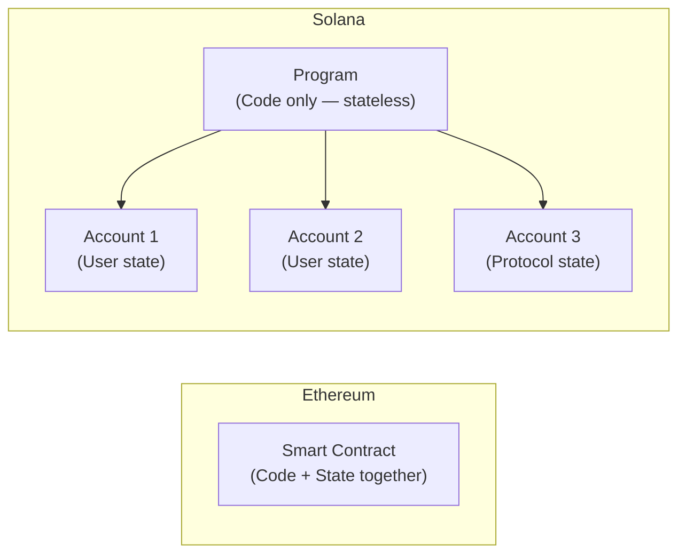
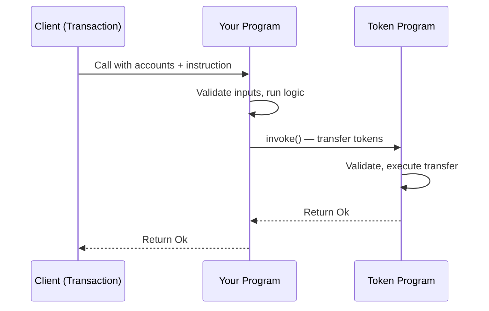
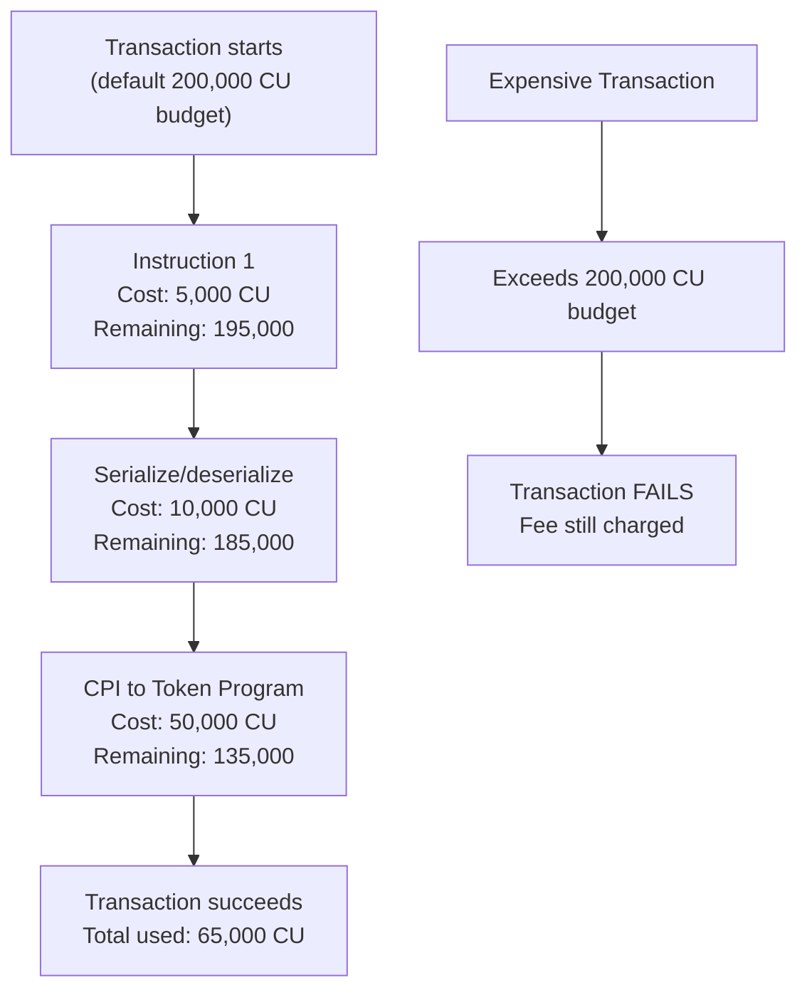
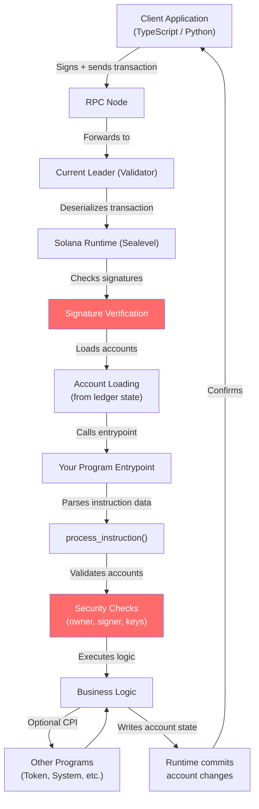

# Solana Programs (Smart Contracts)

> "Solana program ek vending machine jaisa hota hai: usse yaad nahi rehta tum kaun ho, woh bas abhi diye gaye instruction pe react karta hai, aur saare snacks alag compartments mein rakhe hote hain jo tumhare khud ke hain — machine ke andar nahi."

---

## 🆚 Solana Programs vs Ethereum Smart Contracts

Code likhna shuru karne se pehle ek cheez samajh lo — Solana programs, Ethereum contracts se *kaise* alag hain. Yeh samajh loge to aage ghanton ki confusion bach jayegi.

### Library vs Bookshelf wali Analogy

Socho ek **Ethereum smart contract** ek **private filing cabinet** hai. Code AUR data dono ek hi cabinet mein rehte hain. Agar tumne ek counter contract likha, to counter ki value us contract ke *andar hi* store hoti hai.

Ek **Solana program** zyada **public library ki rule book** jaisa hai. Rule book (program) sirf rules describe karti hai. Actual books (data/state) alag shelves (external accounts) pe rakhi hoti hain jinhe *users* apne paas rakhte hain. Rule book khud kuch store nahi karti.



| Property | Ethereum Contract | Solana Program |
|---|---|---|
| State storage | Contract ke andar | External accounts mein |
| Upgradeable by default | Nahi (immutable, jab tak proxy pattern na ho) | Haan (upgrade authority ke through) |
| Language | Solidity / Vyper | Rust (primary), C, C++ |
| "Gas" ka equivalent | Gas (ETH) | Compute Units (SOL) |
| Parallelism | Sequential | Parallel (Sealevel runtime) |
| Account model | Account mein code + storage dono | Program accounts aur data accounts alag-alag |

### Programs Stateless Hote Hain — State External Accounts Mein Rehti Hai

Yeh sabse important mental model shift hai. Jab tum ek Solana program ko call karte ho:

1. Tum ek list bhejte ho **accounts** ki (jo shelves woh read/write kar sakta hai)
2. Tum bhejte ho **instruction data** (tumhe kya karwana hai)
3. Program apni logic run karta hai, accounts modify karta hai, aur exit ho jata hai
4. Program ko do calls ke beech **kuch bhi yaad nahi rehta**

Har piece of state — tumhara token balance, tumhari NFT metadata, tumhara game score — sab ek alag **data account** mein rehta hai jise tum user ke roop mein own karte ho (ya program tumhari taraf se ek Program Derived Address ke through own karta hai).

### Programs Upgradeable Hote Hain, By Default

Ethereum mein contracts deployment ke baad permanently fixed ho jate hain (jab tak complex proxy patterns use na karo). Solana mein jiske paas **upgrade authority** hoti hai, woh program ko upgrade kar sakta hai. Yeh powerful hai, lekin ek trust consideration bhi — users ko trust karna padta hai ki upgrade authority rules nahi badlega.

Tum program ko immutable bhi bana sakte ho, upgrade authority ko `None` set karke:

```bash
solana program set-upgrade-authority <PROGRAM_ID> --final
```

---

## 🦀 Rust Kyun? Memory Safety Aur Raw Performance Dono

### Surgeon wali Analogy

Programming languages ko ek spectrum pe socho. Python ek robotic surgical assistant jaisa hai — bahut kuch khud handle kar leta hai (garbage collection, memory management) lekin overhead add karta hai aur time zyada leta hai. C bare hands se surgery karne jaisa hai — maximum control, lekin ek galat move aur patient gaya (memory bugs, undefined behavior).

Rust ek aisa surgical assistant hai jo tumhe dangerous mistakes karne se *rokta* hai, lekin phir bhi bare hands ki speed pe kaam karne deta hai. Compiler memory errors ko code run hone se pehle hi pakad leta hai.

**Solana ke liye Rust kyun?**

- **Memory safety, bina garbage collector ke** — koi GC pauses nahi jo transaction times ko unpredictable bana de
- **Zero-cost abstractions** — tum high-level code likhte ho jo hand-optimized C jaisi hi assembly mein compile hota hai
- **Deterministic execution** — koi runtime surprises nahi, blockchain ke liye yeh critical hai
- **Rich type system** — compile time pe hi bugs ki poori classes pakad leta hai
- **WebAssembly target** — Solana ka BPF (Berkeley Packet Filter) runtime WASM jaisa hi hai; Rust cleanly usmein compile hota hai

---

## 🏗️ Program Structure — Solana Program Ki Anatomy

Har native Solana program (bina kisi framework ke) ka skeleton same hota hai:

```
my-program/
├── Cargo.toml          # Rust package manifest
└── src/
    ├── lib.rs          # Entry point — front door
    ├── instruction.rs  # Kaunse instructions exist karte hain, define karta hai
    ├── processor.rs    # Actual logic
    ├── state.rs        # Accounts mein store hone wale data structures
    └── error.rs        # Custom error types
```

### Cargo.toml

```toml
[package]
name = "my-program"
version = "0.1.0"
edition = "2021"

[lib]
crate-type = ["cdylib", "lib"]

[dependencies]
solana-program = "1.18"
borsh = "0.10"
borsh-derive = "0.10"
```

`cdylib` crate type mandatory hai — yeh Rust ko batata hai ki isse ek dynamic library ki tarah compile karo, jise Solana ka runtime load kar sake.

---

## 🚪 Entrypoint Function — Front Door

Har program mein exactly ek entrypoint hota hai. Isse socho kisi restaurant ka front door — har customer ko usi se andar aana padta hai, phir usse sahi table pe route kiya jata hai.

```rust
// src/lib.rs
use solana_program::{
    account_info::AccountInfo,
    entrypoint,
    entrypoint::ProgramResult,
    pubkey::Pubkey,
};

// Yeh macro humara entrypoint function declare karta hai
entrypoint!(process_instruction);

pub fn process_instruction(
    program_id: &Pubkey,        // Is program ka address
    accounts: &[AccountInfo],   // Saare accounts jo pass kiye gaye
    instruction_data: &[u8],    // Raw bytes — kya karna hai
) -> ProgramResult {
    // Sahi handler pe route karo
    crate::processor::process(program_id, accounts, instruction_data)
}
```

`entrypoint!` macro Solana ke runtime aur tumhare code ke beech ka low-level ABI handle karta hai. Tumhe bas function likhna hai.

---

## 📦 Instruction Data — Program Ko Batana Kya Karna Hai

Instruction data ek raw byte array hota hai. Yeh tumhare program ka API hai. Tum khud define karte ho ki woh bytes ka matlab kya hai.

Isse ek TV remote jaisa socho. Remote ek signal (bytes) bhejta hai. TV (program) signal `0x01` ko "volume up" aur signal `0x02` ko "volume down" ke roop mein interpret karta hai. Bytes khud kuch nahi matter karte, jab tak program unko interpret na kare.

```rust
// src/instruction.rs
use borsh::{BorshDeserialize, BorshSerialize};

// Yeh program samajhta hai in saare instructions ko
#[derive(BorshSerialize, BorshDeserialize, Debug)]
pub enum MyInstruction {
    Initialize { initial_value: u64 },
    Increment { amount: u64 },
    Reset,
}
```

```rust
// src/processor.rs
use borsh::BorshDeserialize;
use solana_program::{account_info::AccountInfo, entrypoint::ProgramResult, pubkey::Pubkey};
use crate::instruction::MyInstruction;

pub fn process(
    program_id: &Pubkey,
    accounts: &[AccountInfo],
    instruction_data: &[u8],
) -> ProgramResult {
    // Raw bytes ko humare enum mein deserialize karo
    let instruction = MyInstruction::try_from_slice(instruction_data)?;

    match instruction {
        MyInstruction::Initialize { initial_value } => {
            process_initialize(program_id, accounts, initial_value)
        }
        MyInstruction::Increment { amount } => {
            process_increment(program_id, accounts, amount)
        }
        MyInstruction::Reset => process_reset(program_id, accounts),
    }
}
```

---

## 🗂️ AccountInfo — Solana Ka Sabse Important Struct

Tumhare program ko jo bhi account pass hota hai, woh `AccountInfo` ke roop mein aata hai. Har field samajhna non-negotiable hai.

```rust
pub struct AccountInfo<'a> {
    pub key: &'a Pubkey,          // Account ka address (uski identity)
    pub lamports: Rc<RefCell<&'a mut u64>>,  // SOL balance lamports mein
    pub data: Rc<RefCell<&'a mut [u8]>>,     // Is account mein stored raw data bytes
    pub owner: &'a Pubkey,        // Kaunsa program is account ka owner hai
    pub rent_epoch: u64,          // Legacy field — abhi ke liye ignore karo
    pub is_signer: bool,          // Kya is account ne transaction sign kiya?
    pub is_writable: bool,        // Kya is account ko modify karne ki permission hai?
    pub executable: bool,         // Kya yeh account ek program (code) hai?
}
```

### Har Field Ko Todke Samjho

| Field | Kya Hai | Real-World Analogy |
|---|---|---|
| `key` | Account ka public address | Tumhara ghar ka address |
| `lamports` | SOL balance (1 SOL = 1 billion lamports) | Wallet mein cash |
| `data` | Account mein store raw state bytes | Ghar ke andar likha kya hai |
| `owner` | Data/lamports pe kis program ko write authority hai | Landlord |
| `is_signer` | Kya private key ne yeh transaction sign kiya | Kya tumne apna ID dikhaya |
| `is_writable` | Kya transaction ne is account ko mutable declare kiya | Kya tumhare paas write access hai |
| `executable` | Kya is account mein program bytecode hai | Yeh factory hai ya warehouse |

---

## 🔐 Security Checks — Teen Commandments

Yahin pe zyada tar beginner programs hack hote hain. Yeh checks tumhe HAR BAAR karne hain, koi exception nahi.

### Commandment 1: Hamesha Account Ownership Check Karo

Kisi account ka data touch karne se pehle, verify karo ki tumhara program hi uska owner hai. Warna attacker same shape ka fake account bhej sakta hai jismein data different ho.

```rust
// GALAT — kabhi aisa mat karo
let my_data = MyState::try_from_slice(&accounts[0].data.borrow())?;

// SAHI — pehle hamesha ownership verify karo
if accounts[0].owner != program_id {
    return Err(ProgramError::IncorrectProgramId);
}
let my_data = MyState::try_from_slice(&accounts[0].data.borrow())?;
```

### Commandment 2: Hamesha is_signer Check Karo

Agar koi instruction user ka account modify karta hai, to us user ne transaction sign kiya hona chahiye. Yeh check nahi hoga to koi bhi kisi ka bhi account drain kar sakta hai.

```rust
let user_account = &accounts[0];

// GALAT — koi signer check nahi
// (attacker victim ka address pass karke unke funds drain kar deta hai)

// SAHI — verify karo ki user ne yeh action authorize kiya
if !user_account.is_signer {
    return Err(ProgramError::MissingRequiredSignature);
}
```

### Commandment 3: Hamesha Account Keys Verify Karo

Jab tumhe koi specific account expect ho (jaise mint address ya system program), check karo ki jo account pass hua hai woh actually wahi hai.

```rust
use solana_program::system_program;

let system_program_account = &accounts[2];

// SAHI — check karo ki system program actually system program hi hai
if system_program_account.key != &system_program::id() {
    return Err(ProgramError::IncorrectProgramId);
}
```

---

## 🪲 Common Vulnerabilities

### Missing Signer Check

Attacker victim ka account `is_signer: false` ke saath include kar deta hai. Tumhara program signer check skip kar deta hai aur khushi-khushi victim ka data modify kar deta hai.

```rust
// VULNERABLE
pub fn transfer_funds(accounts: &[AccountInfo], amount: u64) -> ProgramResult {
    let from = &accounts[0];
    let to = &accounts[1];
    // Koi signer check nahi! Koi bhi kisi bhi "from" account ki taraf se call kar sakta hai.
    **from.lamports.borrow_mut() -= amount;
    **to.lamports.borrow_mut() += amount;
    Ok(())
}

// SAFE
pub fn transfer_funds(accounts: &[AccountInfo], amount: u64) -> ProgramResult {
    let from = &accounts[0];
    let to = &accounts[1];
    if !from.is_signer {
        return Err(ProgramError::MissingRequiredSignature);
    }
    **from.lamports.borrow_mut() -= amount;
    **to.lamports.borrow_mut() += amount;
    Ok(())
}
```

### Missing Owner Check

Attacker ek fake account banata hai jo tumhare state account jaisa hi dikhta hai (same data layout), lekin uska owner koi doosra program hai jo attacker control karta hai.

```rust
// VULNERABLE — right data shape wale kisi bhi account pe bharosa karta hai
let state = MyState::try_from_slice(&accounts[0].data.borrow())?;

// SAFE — sirf un accounts pe bharosa karo jo tumhara program hi own karta hai
if accounts[0].owner != program_id {
    return Err(ProgramError::IllegalOwner);
}
let state = MyState::try_from_slice(&accounts[0].data.borrow())?;
```

### Arbitrary CPI (Cross-Program Invocation)

Tumhara program doosre program ko call karta hai, lekin accounts array se jo program address aata hai usse check nahi karte. Attacker apna malicious program pass kar deta hai.

```rust
// VULNERABLE — attacker jo bhi program pass kare, usko call kar deta hai
let target_program = &accounts[3];
invoke(&instruction, &[accounts[0].clone(), accounts[1].clone()])?;

// SAFE — expected program address ko hardcode ya verify karo
if accounts[3].key != &spl_token::id() {
    return Err(ProgramError::IncorrectProgramId);
}
```

---

## 🔗 Cross-Program Invocation (CPI) — Programs Ek Doosre Ko Call Karna

### Contractor wali Analogy

Tum apne ghar ke renovation ke liye ek general contractor (tumhara program) hire karte ho. Contractor khud electrical work nahi karta — woh ek licensed electrician (doosra program, jaise Token Program) ko call karta hai us kaam ke liye. Contractor kaam ki guarantee leta hai aur electrician contractor ke authorization pe bharosa karta hai.



### invoke — Regular CPI

`invoke` tab use karo jab koi user account sign kar raha ho — tum signer authority ko aage pass karte ho.

```rust
use solana_program::{
    instruction::{AccountMeta, Instruction},
    program::invoke,
    system_instruction,
};

pub fn create_account_via_cpi(
    accounts: &[AccountInfo],
    lamports: u64,
    space: u64,
    owner: &Pubkey,
) -> ProgramResult {
    let payer = &accounts[0];        // is_signer = true hona chahiye
    let new_account = &accounts[1];
    let system_program = &accounts[2];

    // System program ki instruction banao
    let create_ix = system_instruction::create_account(
        payer.key,
        new_account.key,
        lamports,
        space,
        owner,
    );

    // System program ko call karo — payer ka signature automatically carry hota hai
    invoke(
        &create_ix,
        &[payer.clone(), new_account.clone(), system_program.clone()],
    )?;

    Ok(())
}
```

### invoke_signed — CPI With a PDA as Signer

`invoke_signed` tab use karo jab kisi **Program Derived Address (PDA)** ko sign karna ho. PDAs ke paas koi private key nahi hoti — tumhara program unki taraf se seeds provide karke sign karta hai.

```rust
use solana_program::program::invoke_signed;

pub fn transfer_from_pda(
    accounts: &[AccountInfo],
    amount: u64,
    bump: u8,
) -> ProgramResult {
    let pda_account = &accounts[0];  // PDA — koi real private key nahi
    let destination = &accounts[1];
    let token_program = &accounts[2];

    let seeds = &[b"vault", accounts[3].key.as_ref(), &[bump]];

    // invoke_signed PDA ko seeds ke through "sign" karne deta hai
    invoke_signed(
        &spl_token::instruction::transfer(
            token_program.key,
            pda_account.key,
            destination.key,
            pda_account.key,  // PDA hi authority hai
            &[],
            amount,
        )?,
        &[pda_account.clone(), destination.clone(), token_program.clone()],
        &[seeds],  // Yeh seeds proof hain ki yeh program is PDA ko control karta hai
    )?;

    Ok(())
}
```

| Method | Kab Use Karo |
|---|---|
| `invoke` | Jab ek real user account (private key wala) sign kare |
| `invoke_signed` | Jab ek PDA (program-owned address) action authorize kare |

---

## 🚀 Program Deployment

### Program Compile Karna

```bash
# Program build karo (ek .so shared object file output hoti hai)
cargo build-bpf

# Compiled binary yahan milegi:
# target/deploy/my_program.so
```

### Devnet Pe Deploy Karna

```bash
# Apna cluster set karo
solana config set --url devnet

# Deploy karo — bytecode upload hota hai aur ek Program ID return hoti hai
solana program deploy target/deploy/my_program.so

# Output:
# Program Id: 7xKXtg2CW87d97TXJSDpbD5jBkheTqA83TZRuJosgAsU
```

### Ek Specific Keypair Ke Saath Deploy Karna (Upgrades Ke Liye)

```bash
# Apne program address ke liye keypair generate karo
solana-keygen new -o my-program-keypair.json

# Us keypair ke saath deploy karo — baad mein upgrade kar sakte ho
solana program deploy target/deploy/my_program.so \
  --program-id my-program-keypair.json \
  --upgrade-authority ~/.config/solana/id.json
```

---

## ♻️ Program Upgrades

Kyunki Solana programs by default upgradeable hote hain, tum bugs fix aur naye features ship kar sakte ho bina naye address pe deploy kiye.

### Upgrade Authority

Upgrade authority ko socho kisi building ki master key ki tarah. Jiske paas yeh hai, woh rules badal sakta hai (program upgrade kar sakta hai). Jab tum program deploy karte ho, tumhara wallet hi upgrade authority hota hai.

```bash
# Existing program ko naye code ke saath upgrade karo
solana program upgrade target/deploy/my_program.so <PROGRAM_ID>

# Check karo kiske paas upgrade authority hai
solana program show <PROGRAM_ID>

# Upgrade authority ko ek multisig ko transfer karo (production ke liye recommended)
solana program set-upgrade-authority <PROGRAM_ID> \
  --new-upgrade-authority <MULTISIG_ADDRESS>

# Program ko permanently immutable bana do (ab kabhi upgrade nahi hoga)
solana program set-upgrade-authority <PROGRAM_ID> --final
```

### Program Ko Immutable Kab Banao

**Upgradeable rehne do jab:**
- Tum development ya testing mein ho
- Protocol naya hai aur bugs expected hain
- Tumhare paas governance mechanisms hain upgrades control karne ke liye

**Immutable bana do jab:**
- Protocol battle-tested aur audited ho chuka hai
- Users ko mathematical guarantee chahiye ki rules kabhi nahi badlenge (jaise core DeFi primitives)
- Tum community se maximum trust chahte ho

---

## 📐 Program Size Limits

Solana programs ka deployed binary max **10 MB** ka ho sakta hai. Practically, zyada tar programs 1 MB se kaafi kam hote hain. Agar limit hit ho jaye:

- Multiple programs mein split karo aur CPI use karo
- Cargo.toml mein unused dependencies remove karo
- Build ke time `--release` optimizations use karo
- Cargo.toml mein link-time optimization (LTO) enable karo

```toml
[profile.release]
opt-level = 3
lto = true
codegen-units = 1
```

---

## ⛽ Compute Units — Solana Ka Gas Version

### Factory Machine Wali Analogy

Ethereum mein "gas" hota hai — har operation ka paisa dena padta hai. Solana mein **Compute Units (CUs)** hote hain. Runtime jo bhi instruction execute karta hai, uska CU cost lagta hai. Har transaction ka default budget **200,000 CUs** hota hai (special instruction se 1,400,000 tak badha sakte ho).

CUs ko factory ke machine-hours jaisa socho. Tumhara program jo bhi operation karta hai, uska fixed machine-hours cost hota hai. Budget exceed ho gaya to transaction fail ho jata hai.



### Common CU Costs (Approximate)

| Operation | Approximate CU Cost |
|---|---|
| Base transaction fee | 5,000 |
| Ed25519 signature verification | 100–200 per signature |
| Borsh deserialization (1KB data) | 5,000–15,000 |
| SHA256 hash | 85 per 32 bytes |
| Cross-Program Invocation | 1,000 base + callee costs |
| secp256k1 signature | ~1,800 |

### Zyada CUs Request Karna

```rust
use solana_program::compute_budget::ComputeBudgetInstruction;

// Client code mein — apni instruction se pehle zyada CUs request karo
let modify_cu_ix = ComputeBudgetInstruction::set_compute_unit_limit(400_000);
let priority_fee_ix = ComputeBudgetInstruction::set_compute_unit_price(1_000); // microlamports per CU

let transaction = Transaction::new_signed_with_payer(
    &[modify_cu_ix, priority_fee_ix, your_instruction],
    Some(&payer.pubkey()),
    &[&payer],
    recent_blockhash,
);
```

### Compute Units Kaise Optimize Karo

1. **Zero-copy deserialization use karo** — bade structs copy karne se bacho, fixed-size data ke liye `borsh` ki jagah `bytemuck` use karo
2. **CPI calls minimize karo** — har CPI ka overhead hota hai; jahan possible ho operations batch karo
3. **Bade loops avoid karo** — on-chain O(n) loops dangerous hote hain; jahan possible ho off-chain computation use karo
4. **Efficient data structures use karo** — data compactly store karo, jahan fixed array kaam kar jaye wahan dynamic arrays avoid karo
5. **Lazy loading** — account ke sirf woh parts deserialize karo jinki zarurat hai

---

## ⚓ Native Programs vs Anchor Framework

### Native Rust Programs — Manual Transmission

Native Solana program likhna manual transmission wali car chalane jaisa hai. Tumhare paas total control hai, maximum performance hai, aur samajh hai ki kya ho raha hai — lekin sab kuch khud karna padta hai: gear shift karna (account validation), mirror check karna (ownership checks), tachometer dekhna (compute units).

```rust
// Native Rust — har check explicit aur manual hai
pub fn process_initialize(
    program_id: &Pubkey,
    accounts: &[AccountInfo],
    initial_value: u64,
) -> ProgramResult {
    let accounts_iter = &mut accounts.iter();
    let user_account = next_account_info(accounts_iter)?;
    let state_account = next_account_info(accounts_iter)?;
    let system_program = next_account_info(accounts_iter)?;

    // Har check tumhari responsibility hai
    if !user_account.is_signer {
        return Err(ProgramError::MissingRequiredSignature);
    }
    if state_account.owner != program_id {
        return Err(ProgramError::IllegalOwner);
    }
    if system_program.key != &system_program::id() {
        return Err(ProgramError::IncorrectProgramId);
    }

    // ... actual logic ...
    Ok(())
}
```

### Anchor Framework — Automatic Transmission

Anchor ek framework hai jo tumhare liye zyada tar boilerplate generate kar deta hai. Yeh automatic transmission jaisa hai — tum still control karte ho kahan jaana hai, lekin gear shift framework handle karta hai.

Anchor Rust macros (`#[derive(Accounts)]`, `#[program]`) use karke automatically generate karta hai:
- Account validation code
- Ownership checks
- Discriminator checks (account confusion attacks se bachata hai)
- IDL (Interface Definition Language) client SDKs ke liye
- TypeScript client code

```rust
// Anchor — wahi logic, lekin security checks framework handle karta hai
use anchor_lang::prelude::*;

declare_id!("YourProgramIdHere111111111111111111111111111");

#[program]
pub mod my_program {
    use super::*;

    pub fn initialize(ctx: Context<Initialize>, initial_value: u64) -> Result<()> {
        ctx.accounts.state.value = initial_value;
        ctx.accounts.state.authority = ctx.accounts.user.key();
        Ok(())
    }

    pub fn increment(ctx: Context<Increment>, amount: u64) -> Result<()> {
        ctx.accounts.state.value += amount;
        Ok(())
    }
}

// Anchor in type annotations se saari validation generate karta hai
#[derive(Accounts)]
pub struct Initialize<'info> {
    #[account(mut)]
    pub user: Signer<'info>,                         // is_signer automatically enforce hota hai
    #[account(
        init,                                        // account create karta hai
        payer = user,
        space = 8 + 8 + 32,
        seeds = [b"state", user.key().as_ref()],    // PDA derivation
        bump
    )]
    pub state: Account<'info, MyState>,              // owner check automatic
    pub system_program: Program<'info, System>,      // key check automatic
}

#[derive(Accounts)]
pub struct Increment<'info> {
    pub user: Signer<'info>,
    #[account(
        mut,
        has_one = authority @ MyError::Unauthorized  // check karta hai state.authority == user.key
    )]
    pub state: Account<'info, MyState>,
    pub authority: Signer<'info>,
}

#[account]
pub struct MyState {
    pub value: u64,
    pub authority: Pubkey,
}

#[error_code]
pub enum MyError {
    #[msg("You are not authorized to perform this action")]
    Unauthorized,
}
```

### Native vs Anchor — Trade-Off Table

| Aspect | Native Rust | Anchor |
|---|---|---|
| Learning curve | Steep — har detail samajhna padta hai | Aasaan — framework boilerplate handle karta hai |
| Code verbosity | High — saare checks explicit | Low — macros zyada tar code generate karte hain |
| Control | Complete | High, lekin framework kuch decisions khud leta hai |
| Performance (CU) | Thoda better (koi framework overhead nahi) | Minimal overhead, usually negligible |
| Security | Har check tumhe khud likhna hai | Anchor kai standard checks generate karta hai |
| IDL / Client SDK | Manual | Auto-generated |
| Best for | Protocol primitives, maximum control | Zyadatar DeFi apps, NFT programs, games |
| Community resources | Kam examples | Bada ecosystem, zyada tutorials |

### Native Rust Kab Use Karo

- Tum ek primitive bana rahe ho jise doosre programs CPI ke through call karenge aur har CU matter karta hai
- Tumhe woh behavior chahiye jo Anchor ke abstractions support nahi karte
- Tum Solana deeply seekh rahe ho aur har layer samajhna chahte ho
- Tum ek system program ya low-level infrastructure bana rahe ho

### Anchor Kab Use Karo

- Tum ek DeFi protocol, NFT marketplace, ya game bana rahe ho
- Tumhe fast iteration aur readable code chahiye
- Tumhe auto-generated TypeScript clients chahiye
- Tum ek team mein kaam kar rahe ho jahan readability matter karti hai
- Tum kuch bhi bana rahe ho jo protocol primitive nahi hai

---

## 🏃 Program Execution Flow

Yeh raha poora picture ki ek transaction Solana runtime se hote hue tumhare program tak kaise pahunchta hai:



---

## 🔑 Key Takeaways

1. **Solana programs stateless hote hain** — saara state external accounts mein rehta hai, program ke andar nahi. Isi se parallelism possible hoti hai, aur Ethereum se yehi sabse bada mental model shift hai.

2. **Programs by default upgradeable hote hain** — upgrade authority hi program control karta hai. Production protocols ke liye ise ek multisig ko de do ya burn kar do (`--final`).

3. **Rust hi sahi tool hai** — memory safety, zero-cost abstractions, aur deterministic execution ise on-chain code ke liye ideal banate hain.

4. **AccountInfo hi sab kuch hai** — `key`, `lamports`, `data`, `owner`, `is_signer`, aur `is_writable` samajhna zaruri hai. Yehi runtime aur tumhare program ke beech ka API hai.

5. **Teen security commandments:**
   - Account data read karne se pehle hamesha `owner` check karo
   - User state mutate karne se pehle hamesha `is_signer` check karo
   - Hardcoded program addresses (Token Program, System Program, etc.) hamesha verify karo

6. **CPI se programs compose hote hain** — user-signed actions ke liye `invoke` use karo, PDA-signed actions ke liye `invoke_signed`. Isi se DeFi ka sara ecosystem bana hai.

7. **Compute Units finite hote hain** — default budget 200,000 CU hai. Serialization minimize karke, CPI calls kam karke, aur bade loops avoid karke optimize karo.

8. **Anchor vs Native** — 90% applications ke liye Anchor use karo (faster, safer by default, better tooling). Native Rust sirf tab use karo jab maximum control chahiye ho ya protocol primitives bana rahe ho.

9. **Pehle devnet pe test karo** — program deployment reversible nahi hota (sirf upgradeable hota hai). Mainnet se pehle hamesha devnet pe thoroughly test karo.

10. **Native Rust mein security opt-in hai** — Anchor ke ulat, native runtime tumhare liye koi check enforce nahi karta. Har missing check ek potential exploit hai.

---

*Next Chapter: Program Derived Addresses (PDAs) — programs deterministic addresses kaise derive karte hain aur unhe signer ki tarah use karke complex state machines kaise banate hain.*
