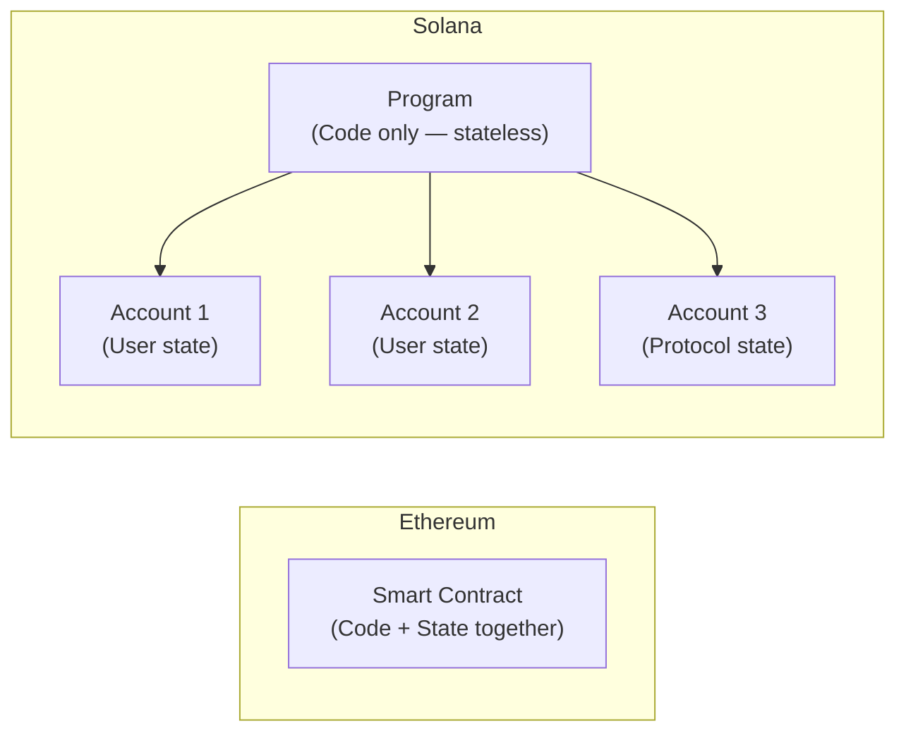
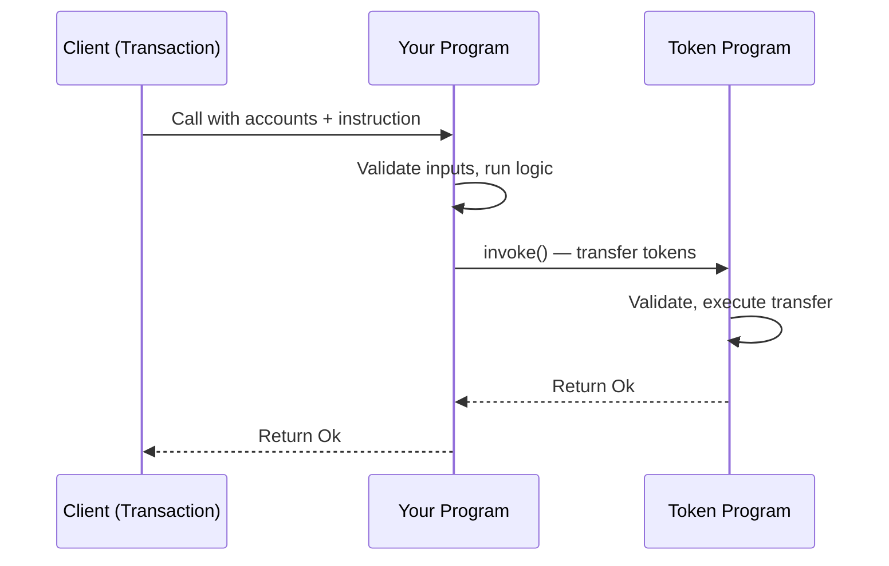
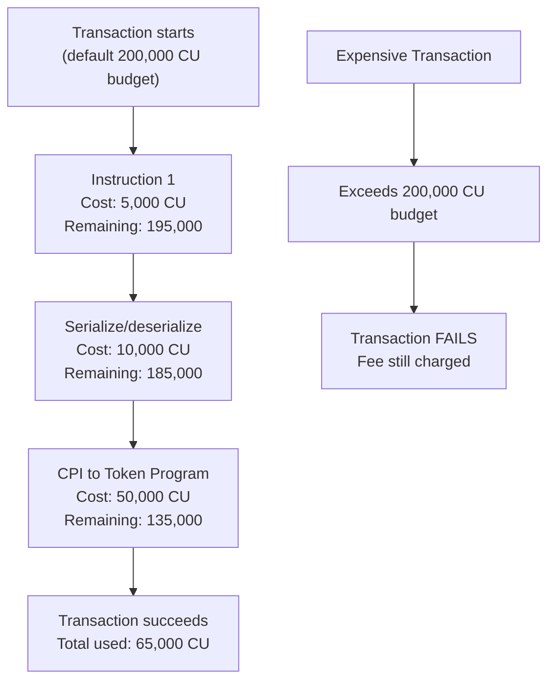
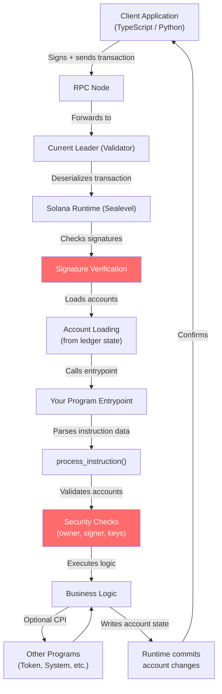

# Solana Programs (Smart Contracts)

> "A Solana program is like a vending machine: it has no memory of who you are, it only reacts to the instructions you give it right now, and all the snacks live in separate compartments you own — not inside the machine itself."

---

## 🆚 Solana Programs vs Ethereum Smart Contracts

Before writing a single line of code, understanding *how* Solana programs differ from Ethereum contracts will save you hours of confusion.

### The Library vs The Bookshelf Analogy

Imagine an **Ethereum smart contract** as a **private filing cabinet**. The code AND the data live together in the same cabinet. If you write a counter contract, the counter value is stored *inside* the contract itself.

A **Solana program** is more like a **public library rule book**. The rule book (program) just describes the rules. The actual books (data/state) sit on separate shelves (external accounts) that *users own*. The rule book does not store anything itself.



| Property | Ethereum Contract | Solana Program |
|---|---|---|
| State storage | Inside the contract | External accounts |
| Upgradeable by default | No (immutable unless proxy pattern) | Yes (upgrade authority) |
| Language | Solidity / Vyper | Rust (primary), C, C++ |
| "Gas" equivalent | Gas (ETH) | Compute Units (SOL) |
| Parallelism | Sequential | Parallel (Sealevel runtime) |
| Account model | Account has code + storage | Separate program accounts and data accounts |

### Programs Are Stateless — State Lives in External Accounts

This is the single most important mental model shift. When you call a Solana program:

1. You pass in a list of **accounts** (the shelves it can read/write)
2. You pass in **instruction data** (what you want it to do)
3. The program runs its logic, modifies the accounts, and exits
4. The program remembers **nothing** between calls

Every piece of state — your token balance, your NFT metadata, your game score — lives in a separate **data account** that you as the user own (or that the program owns on your behalf via a Program Derived Address).

### Programs Are Upgradeable by Default

Unlike Ethereum where contracts are permanently fixed at deployment (unless you use complex proxy patterns), Solana programs can be upgraded by whoever holds the **upgrade authority**. This is powerful but also a trust consideration — users must trust that the upgrade authority won't change the rules.

You can make a program immutable by setting the upgrade authority to `None`:

```bash
solana program set-upgrade-authority <PROGRAM_ID> --final
```

---

## 🦀 Why Rust? Memory Safety Meets Raw Performance

### The Surgeon Analogy

Think of programming languages on a spectrum. Python is like using a robotic surgical assistant — it handles a lot for you (garbage collection, memory management) but it adds overhead and takes more time. C is like doing surgery with your bare hands — maximum control, but one wrong move and the patient dies (memory bugs, undefined behavior).

Rust is like a surgical assistant that *prevents* you from making dangerous mistakes but still lets you work at the speed of bare hands. The compiler catches memory errors before the code ever runs.

**Why Rust for Solana?**

- **Memory safety without a garbage collector** — no GC pauses that would make transaction times unpredictable
- **Zero-cost abstractions** — you write high-level code that compiles to the same assembly as hand-optimized C
- **Deterministic execution** — no runtime surprises, critical for a blockchain
- **Rich type system** — catches entire classes of bugs at compile time
- **WebAssembly target** — Solana's BPF (Berkeley Packet Filter) runtime is similar to WASM; Rust compiles to it cleanly

---

## 🏗️ Program Structure — The Anatomy of a Solana Program

Every native Solana program (without a framework) has the same skeleton:

```
my-program/
├── Cargo.toml          # Rust package manifest
└── src/
    ├── lib.rs          # Entry point — the front door
    ├── instruction.rs  # Defines what instructions exist
    ├── processor.rs    # The actual logic
    ├── state.rs        # Data structures stored in accounts
    └── error.rs        # Custom error types
```

### The Cargo.toml

```toml
[package]
name = "my-program"
version = "0.1.0"
edition = "2021"

[lib]
crate-type = ["cdylib", "lib"]

[dependencies]
solana-program = "1.18"
borsh = "0.10"
borsh-derive = "0.10"
```

The `cdylib` crate type is mandatory — it tells Rust to compile this as a dynamic library that Solana's runtime can load.

---

## 🚪 The Entrypoint Function — The Front Door

Every program has exactly one entrypoint. Think of it as the front door of a restaurant — every customer must walk through it, then gets routed to the right table.

```rust
// src/lib.rs
use solana_program::{
    account_info::AccountInfo,
    entrypoint,
    entrypoint::ProgramResult,
    pubkey::Pubkey,
};

// This macro declares our entrypoint function
entrypoint!(process_instruction);

pub fn process_instruction(
    program_id: &Pubkey,        // This program's address
    accounts: &[AccountInfo],   // All accounts passed in
    instruction_data: &[u8],    // Raw bytes — what to do
) -> ProgramResult {
    // Route to the right handler
    crate::processor::process(program_id, accounts, instruction_data)
}
```

The `entrypoint!` macro handles the low-level ABI between Solana's runtime and your code. You just write the function.

---

## 📦 Instruction Data — Telling the Program What to Do

Instruction data is a raw byte array. It is your program's API. You define what those bytes mean.

Think of it like a TV remote. The remote sends a signal (bytes). The TV (program) interprets signal `0x01` as "volume up" and signal `0x02` as "volume down". The bytes themselves are meaningless without the program's interpretation.

```rust
// src/instruction.rs
use borsh::{BorshDeserialize, BorshSerialize};

// All possible instructions this program understands
#[derive(BorshSerialize, BorshDeserialize, Debug)]
pub enum MyInstruction {
    Initialize { initial_value: u64 },
    Increment { amount: u64 },
    Reset,
}
```

```rust
// src/processor.rs
use borsh::BorshDeserialize;
use solana_program::{account_info::AccountInfo, entrypoint::ProgramResult, pubkey::Pubkey};
use crate::instruction::MyInstruction;

pub fn process(
    program_id: &Pubkey,
    accounts: &[AccountInfo],
    instruction_data: &[u8],
) -> ProgramResult {
    // Deserialize the raw bytes into our enum
    let instruction = MyInstruction::try_from_slice(instruction_data)?;

    match instruction {
        MyInstruction::Initialize { initial_value } => {
            process_initialize(program_id, accounts, initial_value)
        }
        MyInstruction::Increment { amount } => {
            process_increment(program_id, accounts, amount)
        }
        MyInstruction::Reset => process_reset(program_id, accounts),
    }
}
```

---

## 🗂️ AccountInfo — The Most Important Struct in Solana

Every account passed to your program arrives as an `AccountInfo`. Understanding each field is non-negotiable.

```rust
pub struct AccountInfo<'a> {
    pub key: &'a Pubkey,          // The account's address (its identity)
    pub lamports: Rc<RefCell<&'a mut u64>>,  // SOL balance in lamports
    pub data: Rc<RefCell<&'a mut [u8]>>,     // Raw data bytes stored in this account
    pub owner: &'a Pubkey,        // Which program owns this account
    pub rent_epoch: u64,          // Legacy field — ignore for now
    pub is_signer: bool,          // Did this account sign the transaction?
    pub is_writable: bool,        // Is this account allowed to be modified?
    pub executable: bool,         // Is this account a program (code)?
}
```

### Breaking Down Each Field

| Field | What It Is | Real-World Analogy |
|---|---|---|
| `key` | The account's public address | Your home address |
| `lamports` | SOL balance (1 SOL = 1 billion lamports) | Cash in your wallet |
| `data` | Raw bytes of state stored in the account | What's written inside the house |
| `owner` | Which program has write authority over data/lamports | The landlord |
| `is_signer` | Whether the private key signed this transaction | Whether you showed your ID |
| `is_writable` | Whether the transaction declared this account mutable | Whether you have write access |
| `executable` | Whether this account contains program bytecode | Whether this is a factory vs a warehouse |

---

## 🔐 Security Checks — The Three Commandments

This is where most beginner programs get hacked. You MUST do these checks, every time, no exceptions.

### Commandment 1: Always Check Account Ownership

Before touching an account's data, verify your program owns it. Otherwise an attacker can pass in a fake account with the same shape but different data.

```rust
// WRONG — never do this
let my_data = MyState::try_from_slice(&accounts[0].data.borrow())?;

// RIGHT — always verify ownership first
if accounts[0].owner != program_id {
    return Err(ProgramError::IncorrectProgramId);
}
let my_data = MyState::try_from_slice(&accounts[0].data.borrow())?;
```

### Commandment 2: Always Check is_signer

If an instruction modifies a user's account, that user must have signed the transaction. Without this check, anyone can drain anyone's account.

```rust
let user_account = &accounts[0];

// WRONG — no signer check
// (attacker passes victim's address and drains their funds)

// RIGHT — verify the user authorized this action
if !user_account.is_signer {
    return Err(ProgramError::MissingRequiredSignature);
}
```

### Commandment 3: Always Verify Account Keys

When you expect a specific account (like a mint address or a system program), check that the account passed in actually is that account.

```rust
use solana_program::system_program;

let system_program_account = &accounts[2];

// RIGHT — check that the system program is actually the system program
if system_program_account.key != &system_program::id() {
    return Err(ProgramError::IncorrectProgramId);
}
```

---

## 🪲 Common Vulnerabilities

### Missing Signer Check

The attacker includes a victim's account as `is_signer: false`. Your program skips the signer check and happily modifies the victim's data.

```rust
// VULNERABLE
pub fn transfer_funds(accounts: &[AccountInfo], amount: u64) -> ProgramResult {
    let from = &accounts[0];
    let to = &accounts[1];
    // No signer check! Anyone can call this on behalf of any "from" account.
    **from.lamports.borrow_mut() -= amount;
    **to.lamports.borrow_mut() += amount;
    Ok(())
}

// SAFE
pub fn transfer_funds(accounts: &[AccountInfo], amount: u64) -> ProgramResult {
    let from = &accounts[0];
    let to = &accounts[1];
    if !from.is_signer {
        return Err(ProgramError::MissingRequiredSignature);
    }
    **from.lamports.borrow_mut() -= amount;
    **to.lamports.borrow_mut() += amount;
    Ok(())
}
```

### Missing Owner Check

The attacker crafts a fake account that looks identical to your state account (same data layout) but is owned by a different program they control.

```rust
// VULNERABLE — trusts any account with the right data shape
let state = MyState::try_from_slice(&accounts[0].data.borrow())?;

// SAFE — only trust accounts your program owns
if accounts[0].owner != program_id {
    return Err(ProgramError::IllegalOwner);
}
let state = MyState::try_from_slice(&accounts[0].data.borrow())?;
```

### Arbitrary CPI (Cross-Program Invocation)

Your program calls another program, but you use the program address from the accounts array without checking it. An attacker passes in their malicious program.

```rust
// VULNERABLE — calls whatever program the attacker passes in
let target_program = &accounts[3];
invoke(&instruction, &[accounts[0].clone(), accounts[1].clone()])?;

// SAFE — hardcode or verify the expected program address
if accounts[3].key != &spl_token::id() {
    return Err(ProgramError::IncorrectProgramId);
}
```

---

## 🔗 Cross-Program Invocation (CPI) — Programs Calling Programs

### The Contractor Analogy

You hire a general contractor (your program) to renovate your house. The contractor does not do electrical work — they call a licensed electrician (another program, like the Token Program) to handle that part. The contractor vouches for the job and the electrician trusts the contractor's authorization.



### invoke — Regular CPI

Use `invoke` when a user account is signing — you pass the signer authority through.

```rust
use solana_program::{
    instruction::{AccountMeta, Instruction},
    program::invoke,
    system_instruction,
};

pub fn create_account_via_cpi(
    accounts: &[AccountInfo],
    lamports: u64,
    space: u64,
    owner: &Pubkey,
) -> ProgramResult {
    let payer = &accounts[0];        // Must be is_signer = true
    let new_account = &accounts[1];
    let system_program = &accounts[2];

    // Build the system program instruction
    let create_ix = system_instruction::create_account(
        payer.key,
        new_account.key,
        lamports,
        space,
        owner,
    );

    // Call the system program — payer's signature carries through automatically
    invoke(
        &create_ix,
        &[payer.clone(), new_account.clone(), system_program.clone()],
    )?;

    Ok(())
}
```

### invoke_signed — CPI with a PDA as Signer

Use `invoke_signed` when a **Program Derived Address (PDA)** needs to sign. PDAs have no private key — your program signs on their behalf by providing the seeds.

```rust
use solana_program::program::invoke_signed;

pub fn transfer_from_pda(
    accounts: &[AccountInfo],
    amount: u64,
    bump: u8,
) -> ProgramResult {
    let pda_account = &accounts[0];  // The PDA — no real private key
    let destination = &accounts[1];
    let token_program = &accounts[2];

    let seeds = &[b"vault", accounts[3].key.as_ref(), &[bump]];

    // invoke_signed lets the PDA "sign" using seeds
    invoke_signed(
        &spl_token::instruction::transfer(
            token_program.key,
            pda_account.key,
            destination.key,
            pda_account.key,  // PDA is the authority
            &[],
            amount,
        )?,
        &[pda_account.clone(), destination.clone(), token_program.clone()],
        &[seeds],  // The seeds prove this program controls the PDA
    )?;

    Ok(())
}
```

| Method | When to Use |
|---|---|
| `invoke` | A real user account (with a private key) needs to sign |
| `invoke_signed` | A PDA (program-owned address) needs to authorize an action |

---

## 🚀 Program Deployment

### Compiling the Program

```bash
# Build the program (outputs a .so shared object file)
cargo build-bpf

# The compiled binary will be at:
# target/deploy/my_program.so
```

### Deploying to Devnet

```bash
# Set your cluster
solana config set --url devnet

# Deploy — uploads the bytecode and returns a Program ID
solana program deploy target/deploy/my_program.so

# Output:
# Program Id: 7xKXtg2CW87d97TXJSDpbD5jBkheTqA83TZRuJosgAsU
```

### Deploying with a Specific Keypair (for upgrades)

```bash
# Generate a keypair for your program address
solana-keygen new -o my-program-keypair.json

# Deploy with that keypair — you can upgrade later
solana program deploy target/deploy/my_program.so \
  --program-id my-program-keypair.json \
  --upgrade-authority ~/.config/solana/id.json
```

---

## ♻️ Program Upgrades

Because Solana programs are upgradeable by default, you can fix bugs and ship features without deploying to a new address.

### The Upgrade Authority

Think of the upgrade authority as the master key to a building. Whoever holds it can change the rules (upgrade the program). When you deploy a program, your wallet is the upgrade authority.

```bash
# Upgrade an existing program with new code
solana program upgrade target/deploy/my_program.so <PROGRAM_ID>

# Check who has upgrade authority
solana program show <PROGRAM_ID>

# Transfer upgrade authority to a multisig (recommended for production)
solana program set-upgrade-authority <PROGRAM_ID> \
  --new-upgrade-authority <MULTISIG_ADDRESS>

# Make the program permanently immutable (no more upgrades — ever)
solana program set-upgrade-authority <PROGRAM_ID> --final
```

### When to Make a Program Immutable

**Make it upgradeable when:**
- You are in development or testing
- The protocol is new and bugs are expected
- You have governance mechanisms to control upgrades

**Make it immutable when:**
- The protocol is battle-tested and audited
- Users need mathematical guarantees the rules will never change (e.g., core DeFi primitives)
- You want maximum trust from the community

---

## 📐 Program Size Limits

Solana programs have a maximum size of **10 MB** for the deployed binary. In practice, most programs are well under 1 MB. If you hit the limit:

- Split into multiple programs and use CPI
- Remove unused dependencies in Cargo.toml
- Use `--release` optimizations during build
- Enable link-time optimization (LTO) in Cargo.toml

```toml
[profile.release]
opt-level = 3
lto = true
codegen-units = 1
```

---

## ⛽ Compute Units — Solana's Version of Gas

### The Factory Machine Analogy

Ethereum has "gas" — you pay for every operation. Solana has **Compute Units (CUs)**. Every instruction the runtime executes costs CUs. Each transaction has a budget of **200,000 CUs by default** (extendable to 1,400,000 with a special instruction).

Think of CUs like machine-hours in a factory. Every operation your program performs costs a fixed number of machine-hours. If you exceed your budget, the transaction fails.



### Common CU Costs (Approximate)

| Operation | Approximate CU Cost |
|---|---|
| Base transaction fee | 5,000 |
| Ed25519 signature verification | 100–200 per signature |
| Borsh deserialization (1KB data) | 5,000–15,000 |
| SHA256 hash | 85 per 32 bytes |
| Cross-Program Invocation | 1,000 base + callee costs |
| secp256k1 signature | ~1,800 |

### Requesting More CUs

```rust
use solana_program::compute_budget::ComputeBudgetInstruction;

// In client code — request more CUs before your instruction
let modify_cu_ix = ComputeBudgetInstruction::set_compute_unit_limit(400_000);
let priority_fee_ix = ComputeBudgetInstruction::set_compute_unit_price(1_000); // microlamports per CU

let transaction = Transaction::new_signed_with_payer(
    &[modify_cu_ix, priority_fee_ix, your_instruction],
    Some(&payer.pubkey()),
    &[&payer],
    recent_blockhash,
);
```

### How to Optimize Compute Units

1. **Use zero-copy deserialization** — avoid copying large structs, use `bytemuck` instead of `borsh` for fixed-size data
2. **Minimize CPI calls** — each CPI has overhead; batch operations where possible
3. **Avoid large loops** — O(n) loops on-chain are dangerous; use off-chain computation when possible
4. **Use efficient data structures** — store data compactly, avoid dynamic arrays when a fixed array works
5. **Lazy loading** — only deserialize the parts of an account you need

---

## ⚓ Native Programs vs Anchor Framework

### Native Rust Programs — The Manual Transmission

Writing a native Solana program is like driving a car with a manual transmission. You have total control, maximum performance, and deep understanding of what is happening — but you have to do everything yourself: shift gears (account validation), check mirrors (ownership checks), and watch the tachometer (compute units).

```rust
// Native Rust — every check is explicit and manual
pub fn process_initialize(
    program_id: &Pubkey,
    accounts: &[AccountInfo],
    initial_value: u64,
) -> ProgramResult {
    let accounts_iter = &mut accounts.iter();
    let user_account = next_account_info(accounts_iter)?;
    let state_account = next_account_info(accounts_iter)?;
    let system_program = next_account_info(accounts_iter)?;

    // Every check is your responsibility
    if !user_account.is_signer {
        return Err(ProgramError::MissingRequiredSignature);
    }
    if state_account.owner != program_id {
        return Err(ProgramError::IllegalOwner);
    }
    if system_program.key != &system_program::id() {
        return Err(ProgramError::IncorrectProgramId);
    }

    // ... actual logic ...
    Ok(())
}
```

### Anchor Framework — The Automatic Transmission

Anchor is a framework that generates most of the boilerplate for you. It is like an automatic transmission — you still control where you are going, but the framework handles the gear shifts.

Anchor uses Rust macros (`#[derive(Accounts)]`, `#[program]`) to automatically generate:
- Account validation code
- Ownership checks
- Discriminator checks (prevents account confusion attacks)
- IDL (Interface Definition Language) for client SDKs
- TypeScript client code

```rust
// Anchor — the same logic, but the framework handles the security checks
use anchor_lang::prelude::*;

declare_id!("YourProgramIdHere111111111111111111111111111");

#[program]
pub mod my_program {
    use super::*;

    pub fn initialize(ctx: Context<Initialize>, initial_value: u64) -> Result<()> {
        ctx.accounts.state.value = initial_value;
        ctx.accounts.state.authority = ctx.accounts.user.key();
        Ok(())
    }

    pub fn increment(ctx: Context<Increment>, amount: u64) -> Result<()> {
        ctx.accounts.state.value += amount;
        Ok(())
    }
}

// Anchor generates all the validation from these type annotations
#[derive(Accounts)]
pub struct Initialize<'info> {
    #[account(mut)]
    pub user: Signer<'info>,                         // is_signer enforced automatically
    #[account(
        init,                                        // creates the account
        payer = user,
        space = 8 + 8 + 32,
        seeds = [b"state", user.key().as_ref()],    // PDA derivation
        bump
    )]
    pub state: Account<'info, MyState>,              // owner check automatic
    pub system_program: Program<'info, System>,      // key check automatic
}

#[derive(Accounts)]
pub struct Increment<'info> {
    pub user: Signer<'info>,
    #[account(
        mut,
        has_one = authority @ MyError::Unauthorized  // checks state.authority == user.key
    )]
    pub state: Account<'info, MyState>,
    pub authority: Signer<'info>,
}

#[account]
pub struct MyState {
    pub value: u64,
    pub authority: Pubkey,
}

#[error_code]
pub enum MyError {
    #[msg("You are not authorized to perform this action")]
    Unauthorized,
}
```

### Native vs Anchor — The Trade-Off Table

| Aspect | Native Rust | Anchor |
|---|---|---|
| Learning curve | Steep — understand every detail | Gentler — framework handles boilerplate |
| Code verbosity | High — all checks are explicit | Low — macros generate most code |
| Control | Complete | High, but framework makes some decisions |
| Performance (CU) | Slightly better (no framework overhead) | Minimal overhead, usually negligible |
| Security | You must write every check | Anchor generates many standard checks |
| IDL / Client SDK | Manual | Auto-generated |
| Best for | Protocol primitives, maximum control | Most DeFi apps, NFT programs, games |
| Community resources | Fewer examples | Vast ecosystem, more tutorials |

### When to Use Native Rust

- You are building a primitive that other programs will call via CPI and every CU matters
- You need behavior that Anchor's abstractions do not support
- You are learning Solana deeply and want to understand every layer
- You are building a system program or low-level infrastructure

### When to Use Anchor

- You are building a DeFi protocol, NFT marketplace, or game
- You want fast iteration and readable code
- You want auto-generated TypeScript clients
- You are working in a team where readability matters
- You are building anything that is not a protocol primitive

---

## 🏃 Program Execution Flow

Here is the complete picture of how a transaction flows through the Solana runtime into your program:



---

## 🔑 Key Takeaways

1. **Solana programs are stateless** — all state lives in external accounts, not in the program itself. This enables parallelism and is the biggest mental model shift from Ethereum.

2. **Programs are upgradeable by default** — the upgrade authority controls the program. Set it to a multisig or burn it (`--final`) for production protocols.

3. **Rust is the right tool** — memory safety, zero-cost abstractions, and deterministic execution make it ideal for on-chain code.

4. **AccountInfo is everything** — understand `key`, `lamports`, `data`, `owner`, `is_signer`, and `is_writable`. They are the API between the runtime and your program.

5. **The three security commandments:**
   - Always check `owner` before reading account data
   - Always check `is_signer` before mutating user state
   - Always verify hardcoded program addresses (Token Program, System Program, etc.)

6. **CPI is how programs compose** — use `invoke` for user-signed actions, `invoke_signed` for PDA-signed actions. This is how all of DeFi is built.

7. **Compute Units are finite** — default budget is 200,000 CU. Optimize by minimizing serialization, reducing CPI calls, and avoiding large loops.

8. **Anchor vs Native** — use Anchor for 90% of applications (faster, safer by default, better tooling). Use native Rust only when you need maximum control or are building protocol primitives.

9. **Test on devnet first** — program deployment is not reversible (only upgradeable). Always test thoroughly on devnet before mainnet.

10. **Security is opt-in in native Rust** — unlike Anchor, the native runtime does not enforce any checks for you. Every missing check is a potential exploit.

---

*Next Chapter: Program Derived Addresses (PDAs) — how programs derive deterministic addresses and use them as signers to build complex state machines.*
