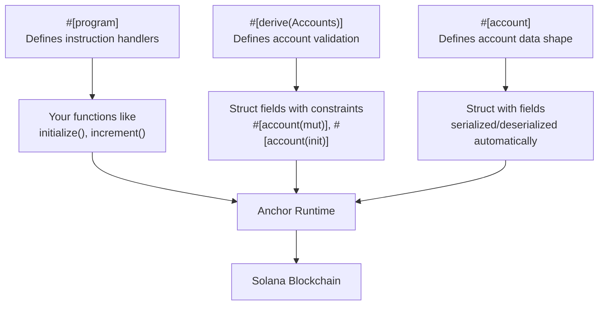
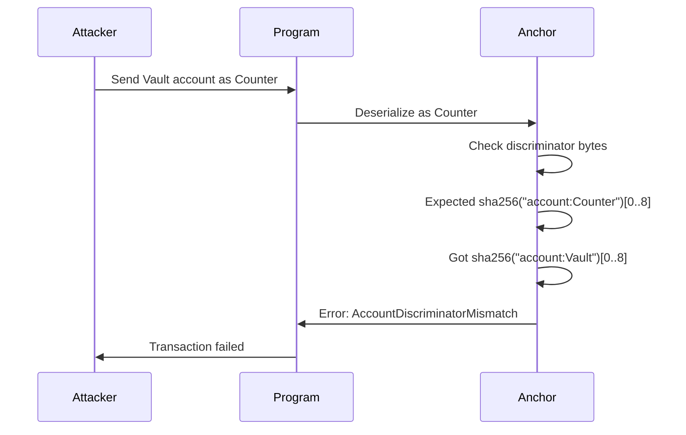
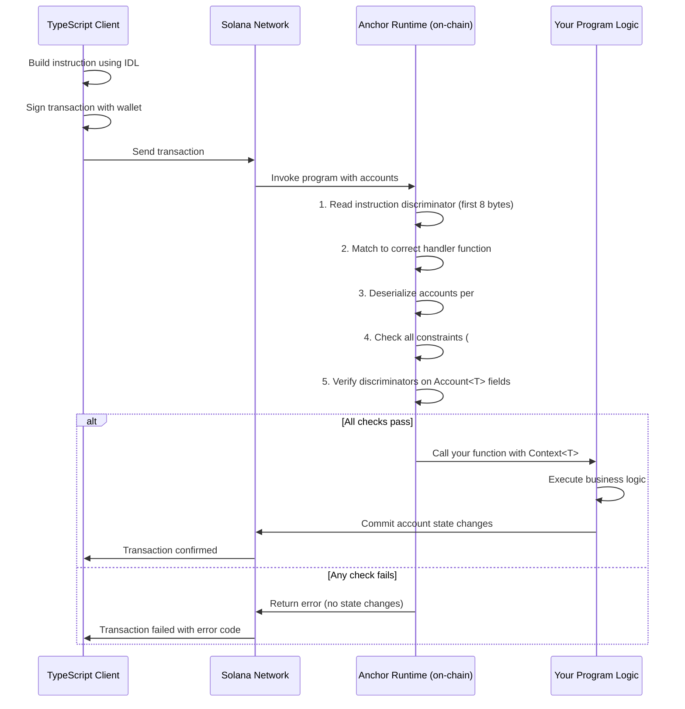

# Anchor Framework — Solana Pe Build Karne Ka Best Tareeka

> "Anchor ke bina Solana programs banana aisa hai jaise bina power tools ke ghar banana. Ho sakta hai, but kyun karoge?"

---

## 🧭 Is Chapter Mein Kya Seekhoge

Is chapter ke end tak tumhe samajh aa jayega:

- Anchor kya hai aur kyun exist karta hai
- Anchor project kaise install aur setup karte hain
- Wo core macros jo Anchor ko powerful banate hain
- Account validation kaise karte hain bina manual security checks likhe
- Anchor ke andar PDAs kaise kaam karte hain
- Errors ko cleanly kaise handle karte hain
- IDL kya hota hai aur kyun important hai
- Ek full working Counter program, TypeScript tests ke saath

---

## 🤔 Anchor Hai Kya, Aur Iski Parwah Kyun Karein?

**Real-world analogy:** Socho tum ek web server bana rahe ho. Tum chahte to raw TCP socket code C mein likh sakte the. Kaam ho jata. Lekin zyadatar developers Express ya Django jaise frameworks use karte hain jo boring cheezein khud handle kar lete hain — routing, parsing, error handling — taaki tum apni actual logic pe focus kar sako.

Anchor bilkul wahi framework hai Solana programs ke liye.

Raw Solana program Rust mein likhoge to 60-70% code sirf ye karega:

- Account data ko manually deserialize karna
- Check karna ki accounts writable hain ya signer hain
- Account confusion rokna (ye sach mein Counter account hai ya kuch aur?)
- Wahi boilerplate baar-baar likhna jo har program mein same hota hai

Anchor macros aur conventions se ye sab khatam kar deta hai. Solana ke liye ye waisa hi hai jaisa Ethereum ke liye Hardhat + OpenZeppelin hota hai.

### Anchor vs Raw Solana Programs

| Feature | Raw Solana (Native) | Anchor |
|---|---|---|
| Account deserialization | Manual, error-prone | Macros se automatic |
| Account validation | Khud checks likho | Declarative constraints |
| Error handling | Raw error codes | Named enums with messages |
| ABI / IDL generation | Kuch nahi | Auto-generated |
| Client-side integration | Manual | TypeScript client included |
| Security (discriminators) | Khud banao | Built-in 8-byte prefix |
| Learning curve | Bahut steep | Kaafi gentle |
| Production use | Haan (jaise Serum) | Haan (jaise Marinade, Jito) |

**Anchor kab use karo:**
- Almost hamesha, jab bhi naya program bana rahe ho
- Jab fast iteration aur safety chahiye
- Jab tumhe apne program ke saath match karta TypeScript client chahiye

**Anchor kab NA use karo:**
- Jab program size extremely critical ho (Anchor thoda overhead add karta hai)
- Jab tum bahut low-level infrastructure ya custom runtime bana rahe ho
- Jab tumhe account layout pe byte-level control chahiye

---

## 🏗️ Anchor Install Karna

Anchor install karne se pehle tumhare paas Rust, Solana CLI, aur Node.js hone chahiye. Agar tumne pichle chapters complete kiye hain, to ye sab already hoga.

### Anchor Version Manager (AVM) Install Karo

AVM tumhe Anchor versions ke beech switch karne deta hai — bilkul waise jaise NVM Node versions ke beech switch karne deta hai.

```bash
cargo install --git https://github.com/coral-xyz/anchor avm --locked --force
```

### Latest Anchor Version Install Karo

```bash
avm install latest
avm use latest
```

### Installation Verify Karo

```bash
anchor --version
# anchor-cli 0.30.x
```

---

## 📁 Apna Pehla Anchor Project Banana

```bash
anchor init my-counter
cd my-counter
```

Isse ye structure ban jayega:

```
my-counter/
├── Anchor.toml          # Project config (cluster, wallet, program IDs)
├── Cargo.toml           # Rust workspace config
├── package.json         # Node.js deps for tests
├── programs/
│   └── my-counter/
│       ├── Cargo.toml
│       └── src/
│           └── lib.rs   # Yahin tumhara Solana program rehta hai
├── tests/
│   └── my-counter.ts    # @coral-xyz/anchor use karke TypeScript tests
└── target/              # Build output, IDL files
```

### Anchor.toml Kya Hai?

```toml
[features]
seeds = false
skip-lint = false

[programs.localnet]
my_counter = "Fg6PaFpoGXkYsidMpWTK6W2BeZ7FEfcYkg476zPFsLnS"

[registry]
url = "https://api.apr.dev"

[provider]
cluster = "Localnet"
wallet = "~/.config/solana/id.json"

[scripts]
test = "yarn run ts-mocha -p ./tsconfig.json -t 1000000 tests/**/*.ts"
```

`[programs.localnet]` section tumhare program ke naam ko uske on-chain address se map karta hai. Jab tum `anchor build` chalate ho, Anchor ye address tumhari keypair se derive karta hai.

---

## ⚙️ Anchor Ke Core Macros

Anchor, Rust macros use karta hai (inhe code generators samjho) boilerplate khatam karne ke liye. Teen macros hain jo tum baar-baar use karoge.



### Macro 1: `#[program]`

**Analogy:** Ye waisa hi hai jaise tum apne REST API routes define karte ho. Andar ka har function ek "endpoint" hai — ek instruction jo tumhara program handle kar sakta hai.

```rust
#[program]
pub mod my_counter {
    use super::*;

    pub fn initialize(ctx: Context<Initialize>) -> Result<()> {
        // logic here
        Ok(())
    }

    pub fn increment(ctx: Context<Increment>) -> Result<()> {
        // logic here
        Ok(())
    }
}
```

`#[program]` ke andar har function:
- Pehle argument ke roop mein `Context<T>` leta hai (isko neeche detail mein samjhenge)
- Extra arguments bhi le sakta hai (numbers, strings, waghera)
- `Result<()>` return karta hai — ya to success ya ek typed error

### Macro 2: `#[derive(Accounts)]`

**Analogy:** Isko ek form validator samjho. Tumhara function chalne se pehle hi, Anchor check kar leta hai ki jitne accounts pass kiye gaye hain wo bilkul waise hi hain jaise tumne declare kiye the. Agar koi check fail ho, transaction automatically reject ho jata hai.

```rust
#[derive(Accounts)]
pub struct Initialize<'info> {
    #[account(
        init,
        payer = user,
        space = 8 + 8  // 8 for discriminator + 8 for u64 counter field
    )]
    pub counter: Account<'info, Counter>,

    #[account(mut)]
    pub user: Signer<'info>,

    pub system_program: Program<'info, System>,
}
```

Is struct mein har field ek account hai jo transaction ko supply karna padega. Har field pe `#[account(...)]` attribute wahi jagah hai jahan tum apni validation rules likhte ho — aur Anchor inhe enforce karta hai tumhare function body chalne se pehle.

### Macro 3: `#[account]`

**Analogy:** Ye waisa hi hai jaise tum database table ka schema define karte ho. Ye Anchor ko batata hai ki account ke andar kaunsa data rehta hai.

```rust
#[account]
pub struct Counter {
    pub count: u64,
}
```

Jab tum kisi struct ko `#[account]` se mark karte ho, Anchor automatically:
- Use Borsh (ek binary encoding format) se serialize/deserialize karta hai
- Front mein ek 8-byte **discriminator** add karta hai (neeche explain kiya hai)

---

## 🔐 Account Constraints — Anchor Security Ka Dil

Yahin Anchor sach mein chamakta hai. Har jagah `if !ctx.accounts.user.is_signer { return Err(...) }` likhne ki jagah, tum rules inline declare karte ho.

### Common Constraints

```rust
// Mark account as writable (needed when you modify data)
#[account(mut)]

// Create a new account, paid for by `payer`, with N bytes of space
#[account(init, payer = user, space = 8 + 8)]

// Verify a Program Derived Address (PDA)
#[account(seeds = [b"counter", user.key().as_ref()], bump)]

// Combine init with PDA
#[account(
    init,
    payer = user,
    space = 8 + 8,
    seeds = [b"counter", user.key().as_ref()],
    bump
)]

// Account must be owned by a specific program
#[account(owner = token_program.key())]

// Account data must equal a specific value
#[account(constraint = counter.count < 100 @ ErrorCode::CounterFull)]

// Close an account and send its lamports to `receiver`
#[account(mut, close = receiver)]
```

### Constraint Reference Table

| Constraint | Kya Karta Hai | Kab Use Karo |
|---|---|---|
| `mut` | Account writable hona chahiye | Account data ya balance modify karte time |
| `init` | On-chain account create karta hai | Pehli baar account banate time |
| `payer = <field>` | Rent kaun pay karega | `init` ke saath |
| `space = N` | Kitne bytes allocate karne hain | `init` ke saath |
| `seeds = [...]` | PDA seeds validate karta hai | PDA accounts |
| `bump` | Canonical bump validate karta hai | PDA accounts |
| `has_one = field` | `account.field == passed_account.key()` | Ownership checks |
| `constraint = expr` | Custom boolean expression | Baaki sab kuch |
| `close = target` | Account close karta hai, lamports return karta hai | Cleanup instructions |
| `address = pubkey` | Account ka exact yahi address hona chahiye | Hardcoded accounts |

---

## 🎯 Context Pattern

**Analogy:** Jab ek web framework tumhare route handler ko call karta hai, wo ek `request` object pass karta hai jisme sab kuch hota hai — URL, headers, body, cookies. Anchor ka `Context<T>` tumhari instruction ke liye wahi request object hai.

```rust
pub fn increment(ctx: Context<Increment>) -> Result<()> {
    let counter = &mut ctx.accounts.counter;
    counter.count += 1;
    Ok(())
}
```

`ctx.accounts` tumhe tumhare `Increment` struct mein define kiye gaye saare validated accounts ka access deta hai. Kyunki Anchor pehle hi inhe validate kar chuka hai, tum bas inhe use kar sakte ho.

`ctx` tumhe ye bhi deta hai:
- `ctx.program_id` — tumhare program ka address
- `ctx.remaining_accounts` — koi extra accounts jo struct mein declare nahi kiye gaye
- `ctx.bumps` — kisi bhi PDA account ke bump seeds (jab instruction ke andar PDA banate ho tab use hota hai)

---

## 🧱 Account Discriminators — Account Confusion Rokna

**Analogy:** Socho tumhare paas filing cabinet mein do tarah ke forms hain: Employee forms aur Customer forms. Dono dikhte similar hain. Labels ke bina, tum galti se Customer form ko Employee form samajh ke process kar sakte ho. Discriminator Anchor ka label hai har account pe.

Jab Anchor `#[account]` se ek account banata hai, wo pehle 8 bytes mein account type ke naam ka hash likhta hai:

```
[discriminator: 8 bytes][your actual data: remaining bytes]
```

Discriminator hota hai `sha256("account:Counter")[0..8]`.

Jab tumhara program ek account read karta hai, Anchor check karta hai ki pehle 8 bytes expected discriminator se match karte hain ya nahi. Agar nahi match karte, transaction fail ho jata hai. Isse ek attacker `Vault` account nahi pass kar sakta jahan tumhara program `Counter` account expect kar raha ho.



Ye code tumhe khud nahi likhna. Jab bhi tum `Account<'info, T>` use karte ho, Anchor ise automatically handle kar leta hai.

---

## 💥 `#[error_code]` Se Error Handling

**Analogy:** HTTP status codes client ko batate hain ki kya galat hua (404 Not Found, 403 Forbidden). Anchor ka `#[error_code]` bhi bilkul wahi cheez hai tumhare program ke liye — named errors, human-readable messages ke saath.

```rust
#[error_code]
pub enum CounterError {
    #[msg("The counter has reached its maximum value")]
    CounterOverflow,

    #[msg("You are not authorized to modify this counter")]
    Unauthorized,

    #[msg("Counter count must be greater than zero to decrement")]
    CannotDecrement,
}
```

Instructions ke andar errors aise return karo:

```rust
pub fn increment(ctx: Context<Increment>) -> Result<()> {
    let counter = &mut ctx.accounts.counter;

    // Return named error if overflow would happen
    if counter.count == u64::MAX {
        return Err(CounterError::CounterOverflow.into());
    }

    counter.count += 1;
    Ok(())
}
```

Ya cleaner code ke liye `require!` macro use karo:

```rust
pub fn increment(ctx: Context<Increment>) -> Result<()> {
    let counter = &mut ctx.accounts.counter;
    require!(counter.count < u64::MAX, CounterError::CounterOverflow);
    counter.count += 1;
    Ok(())
}
```

---

## 📜 IDL Kya Hota Hai?

**Analogy:** Jab tum Solana program deploy karte ho, clients ko automatically pata nahi hota ki tumse baat kaise karni hai — kaunse instructions exist karte hain, unhe kaunse accounts chahiye, kaunse types use hote hain. IDL (Interface Description Language) ek restaurant ke published menu jaisa hai. Ye clients ko exactly batata hai ki kya available hai aur kaise order karna hai.

Anchor har baar build karne pe `target/idl/my_counter.json` mein ek IDL file auto-generate karta hai. Ye kuch aisa dikhta hai:

```json
{
  "version": "0.1.0",
  "name": "my_counter",
  "instructions": [
    {
      "name": "initialize",
      "accounts": [
        { "name": "counter", "isMut": true, "isSigner": false },
        { "name": "user", "isMut": true, "isSigner": true },
        { "name": "systemProgram", "isMut": false, "isSigner": false }
      ],
      "args": []
    },
    {
      "name": "increment",
      "accounts": [
        { "name": "counter", "isMut": true, "isSigner": false },
        { "name": "user", "isMut": false, "isSigner": true }
      ],
      "args": []
    }
  ],
  "accounts": [
    {
      "name": "Counter",
      "type": {
        "kind": "struct",
        "fields": [{ "name": "count", "type": "u64" }]
      }
    }
  ]
}
```

`@coral-xyz/anchor` TypeScript library ye IDL padh ke ek fully typed client auto-generate karti hai. Tumhe kabhi manually transaction bytes craft nahi karne padte.

---

## 🚀 Full Working Example: Counter Program

Chalo ek counter banate hain jise koi bhi user initialize kar sake (unke wallet se tied ek PDA ke saath) aur increment kar sake. Ye upar cover kiye gaye har concept ko demonstrate karta hai.

### Program (`programs/my-counter/src/lib.rs`)

```rust
use anchor_lang::prelude::*;

declare_id!("Fg6PaFpoGXkYsidMpWTK6W2BeZ7FEfcYkg476zPFsLnS");

#[program]
pub mod my_counter {
    use super::*;

    /// Creates a new counter account for the user.
    /// The counter is a PDA derived from ["counter", user_pubkey].
    /// This means each user gets their own unique counter.
    pub fn initialize(ctx: Context<Initialize>) -> Result<()> {
        let counter = &mut ctx.accounts.counter;
        counter.count = 0;
        counter.authority = ctx.accounts.user.key();
        msg!("Counter initialized. Count: {}", counter.count);
        Ok(())
    }

    /// Increments the counter by 1.
    /// Only the original user (authority) can increment.
    pub fn increment(ctx: Context<Increment>) -> Result<()> {
        let counter = &mut ctx.accounts.counter;

        // Guard against overflow
        require!(counter.count < u64::MAX, CounterError::CounterOverflow);

        counter.count += 1;
        msg!("Counter incremented. New count: {}", counter.count);
        Ok(())
    }

    /// Resets the counter back to zero.
    /// Only the authority can reset.
    pub fn reset(ctx: Context<Reset>) -> Result<()> {
        let counter = &mut ctx.accounts.counter;
        counter.count = 0;
        msg!("Counter reset to zero.");
        Ok(())
    }
}

// ─────────────────────────────────────────────
// Account Validation Structs
// ─────────────────────────────────────────────

#[derive(Accounts)]
pub struct Initialize<'info> {
    /// The counter account to create.
    /// It is a PDA seeded by "counter" + user pubkey.
    /// init: creates the account
    /// payer: user pays the rent
    /// space: 8 (discriminator) + 32 (Pubkey) + 8 (u64) = 48 bytes
    #[account(
        init,
        payer = user,
        space = 8 + 32 + 8,
        seeds = [b"counter", user.key().as_ref()],
        bump
    )]
    pub counter: Account<'info, Counter>,

    /// The user creating the counter. Must sign and pay for rent.
    #[account(mut)]
    pub user: Signer<'info>,

    /// Required by Solana to create new accounts.
    pub system_program: Program<'info, System>,
}

#[derive(Accounts)]
pub struct Increment<'info> {
    /// The counter to increment. Must be mutable since we write to it.
    /// seeds + bump: verifies this is the correct PDA for this user
    /// has_one = authority: counter.authority must equal the authority account passed in
    #[account(
        mut,
        seeds = [b"counter", authority.key().as_ref()],
        bump,
        has_one = authority @ CounterError::Unauthorized
    )]
    pub counter: Account<'info, Counter>,

    /// Must be the original creator (stored in counter.authority).
    pub authority: Signer<'info>,
}

#[derive(Accounts)]
pub struct Reset<'info> {
    #[account(
        mut,
        seeds = [b"counter", authority.key().as_ref()],
        bump,
        has_one = authority @ CounterError::Unauthorized
    )]
    pub counter: Account<'info, Counter>,

    pub authority: Signer<'info>,
}

// ─────────────────────────────────────────────
// Account Data Struct
// ─────────────────────────────────────────────

#[account]
pub struct Counter {
    /// The wallet that owns this counter.
    pub authority: Pubkey,
    /// The current count value.
    pub count: u64,
}

// ─────────────────────────────────────────────
// Custom Errors
// ─────────────────────────────────────────────

#[error_code]
pub enum CounterError {
    #[msg("Counter has reached the maximum value and cannot be incremented further")]
    CounterOverflow,

    #[msg("You are not the authority of this counter")]
    Unauthorized,
}
```

### Program Build Karo

```bash
anchor build
```

Ye Rust program compile karega aur ye generate karega:
- `target/deploy/my_counter.so` — compiled BPF bytecode
- `target/idl/my_counter.json` — IDL file
- `target/types/my_counter.ts` — TypeScript types

---

## 🧪 TypeScript Tests (`tests/my-counter.ts`)

Anchor tumhare IDL se ek fully typed TypeScript client generate karta hai. Tum tests likhte ho jo tumhare program ko exactly waise call karte hain jaise ek real client karega.

```typescript
import * as anchor from "@coral-xyz/anchor";
import { Program } from "@coral-xyz/anchor";
import { MyCounter } from "../target/types/my_counter";
import { PublicKey } from "@solana/web3.js";
import { assert } from "chai";

describe("my-counter", () => {
  // Configure the client to use the local cluster.
  const provider = anchor.AnchorProvider.env();
  anchor.setProvider(provider);

  const program = anchor.workspace.MyCounter as Program<MyCounter>;
  const user = provider.wallet as anchor.Wallet;

  // Derive the counter PDA address deterministically.
  // This is the same address the program will use on-chain.
  let counterPDA: PublicKey;
  let counterBump: number;

  before(async () => {
    [counterPDA, counterBump] = PublicKey.findProgramAddressSync(
      [Buffer.from("counter"), user.publicKey.toBuffer()],
      program.programId
    );
    console.log("Counter PDA:", counterPDA.toBase58());
    console.log("Counter Bump:", counterBump);
  });

  it("Initializes the counter at zero", async () => {
    // Call the initialize instruction.
    // Anchor automatically resolves PDAs and known programs.
    const tx = await program.methods
      .initialize()
      .accounts({
        counter: counterPDA,
        user: user.publicKey,
        systemProgram: anchor.web3.SystemProgram.programId,
      })
      .rpc();

    console.log("Initialize transaction:", tx);

    // Fetch the counter account and verify its state.
    const counterAccount = await program.account.counter.fetch(counterPDA);
    assert.equal(counterAccount.count.toNumber(), 0);
    assert.equal(
      counterAccount.authority.toBase58(),
      user.publicKey.toBase58()
    );
  });

  it("Increments the counter to 1", async () => {
    await program.methods
      .increment()
      .accounts({
        counter: counterPDA,
        authority: user.publicKey,
      })
      .rpc();

    const counterAccount = await program.account.counter.fetch(counterPDA);
    assert.equal(counterAccount.count.toNumber(), 1);
  });

  it("Increments the counter a second time to 2", async () => {
    await program.methods
      .increment()
      .accounts({
        counter: counterPDA,
        authority: user.publicKey,
      })
      .rpc();

    const counterAccount = await program.account.counter.fetch(counterPDA);
    assert.equal(counterAccount.count.toNumber(), 2);
  });

  it("Resets the counter back to zero", async () => {
    await program.methods
      .reset()
      .accounts({
        counter: counterPDA,
        authority: user.publicKey,
      })
      .rpc();

    const counterAccount = await program.account.counter.fetch(counterPDA);
    assert.equal(counterAccount.count.toNumber(), 0);
  });

  it("Rejects increment from a different user (unauthorized)", async () => {
    // Create a new random keypair — this is NOT the authority.
    const attacker = anchor.web3.Keypair.generate();

    // Airdrop some SOL to the attacker so they can pay fees.
    const airdropSig = await provider.connection.requestAirdrop(
      attacker.publicKey,
      anchor.web3.LAMPORTS_PER_SOL
    );
    await provider.connection.confirmTransaction(airdropSig);

    try {
      // The attacker tries to pass their own key as authority.
      // But counter.authority is still the original user's key.
      // has_one = authority will reject this.
      await program.methods
        .increment()
        .accounts({
          counter: counterPDA,
          authority: attacker.publicKey,
        })
        .signers([attacker])
        .rpc();

      assert.fail("Expected transaction to fail with Unauthorized error");
    } catch (err: any) {
      // Anchor wraps the custom error in an AnchorError object.
      assert.include(err.message, "Unauthorized");
      console.log("Correctly rejected unauthorized increment.");
    }
  });
});
```

### Tests Run Karna

```bash
# Start a local validator in one terminal
solana-test-validator

# In another terminal, run the tests
anchor test
```

Ya sab kuch ek hi command mein run karo (Anchor khud local validator manage karega):

```bash
anchor test --skip-local-validator
# or just:
anchor test
```

---

## 🔄 Ek Transaction Anchor Ke Through Kaise Flow Hota Hai

Ye flow samajhna tumhe issues debug karne mein aur ye reason karne mein help karega ki Anchor peeche kya kar raha hai.



---

## 📐 Space Calculation Reference

Jab tum `init` use karte ho, tumhe `space` accurately specify karna hi padega. Kam allocate karoge to panics aayenge; zyada allocate karoge to rent waste hoga.

| Type | Size (bytes) |
|---|---|
| Anchor discriminator | 8 (hamesha ye pehle add karo) |
| `bool` | 1 |
| `u8` / `i8` | 1 |
| `u16` / `i16` | 2 |
| `u32` / `i32` | 4 |
| `u64` / `i64` | 8 |
| `u128` / `i128` | 16 |
| `Pubkey` | 32 |
| `String` | 4 + length (max chars) |
| `Vec<T>` | 4 + (size of T * capacity) |
| `Option<T>` | 1 + size of T |

**Counter ke liye example calculation:**

```rust
// Counter has: authority (Pubkey = 32) + count (u64 = 8)
// Total: 8 (discriminator) + 32 + 8 = 48
space = 8 + 32 + 8
```

---

## 🗺️ Anchor Mein PDAs — Deeper Look

PDAs (Program Derived Addresses) aise accounts hote hain jinhe tumhara program control karta hai. Inke liye koi private key exist nahi karti. Anchor native programs ke muqable PDAs ke saath kaam karna kaafi simple bana deta hai.

**Analogy:** PDA ek bank ke safety deposit box jaisa hai. Bank (tumhara program) hi hai jo ise khol sakta hai, lekin box ek unique combination se identify hota hai — tumhara naam (user pubkey) plus box number (seed).

### TypeScript Mein PDA Derive Karna (Client Side)

```typescript
const [pda, bump] = PublicKey.findProgramAddressSync(
  [
    Buffer.from("counter"),      // seed 1: static string
    user.publicKey.toBuffer(),   // seed 2: user's public key
  ],
  program.programId
);
```

### Rust Mein PDA Declare Karna (Program Side)

```rust
#[account(
    seeds = [b"counter", authority.key().as_ref()],
    bump
)]
pub counter: Account<'info, Counter>,
```

Anchor automatically:
1. Seeds aur tumhare program ID se PDA derive karta hai
2. Verify karta hai ki jo account pass kiya gaya hai wo derived address se match karta hai
3. Canonical bump dhoondta hai aur store karta hai (pehla valid bump seed)

Agar tumhe kisi instruction ke andar bump use karna hai (jaise, CPI signing ke time):

```rust
pub fn do_something(ctx: Context<DoSomething>) -> Result<()> {
    let bump = ctx.bumps.counter; // Anchor provides bumps for all PDA accounts
    // use bump in CPI signing...
    Ok(())
}
```

---

## 🔑 Key Takeaways

1. **Anchor Solana development ka standard framework hai.** Deserialization, validation, discriminators, aur IDL generation ye sab automatically handle karta hai — jo cheezein tum din bhar laga ke manually likhte.

2. **`#[program]` tumhare instruction handlers define karta hai.** Andar ka har public function ek instruction hai jo tumhara program receive kar sakta hai.

3. **`#[derive(Accounts)]` mein hi security rehti hai.** Jo constraints tum wahan declare karte ho (`mut`, `init`, `has_one`, `seeds`, `bump`, `constraint`) wo tumhari function body chalne se pehle hi enforce ho jate hain. Anchor invalid transactions khud reject kar deta hai.

4. **`#[account]` tumhare on-chain data ka shape define karta hai.** Anchor ise Borsh use karke automatically serialize aur deserialize karta hai.

5. **8-byte discriminator account confusion attacks rokta hai.** Jab bhi tum `Account<'info, T>` use karte ho, Anchor ise automatically likhta aur check karta hai. Ye security tumhe free mein milti hai.

6. **`#[error_code]` tumhare errors ko naam aur messages deta hai.** Clean, readable error returns ke liye `require!()` use karo.

7. **IDL tumhare program ka public API contract hai.** TypeScript client ise padh ke exactly jaanta hai ki tumhara program kya expect karta hai — koi manual byte crafting nahi chahiye.

8. **Space calculation exact hona chahiye.** Hamesha discriminator ke liye `8` se start karo aur har field ka size add karo. Isme galti karna runtime panics ka karan banta hai.

9. **Anchor mein PDAs `seeds` aur `bump` se declare hote hain.** Anchor derivation automatically verify karta hai. Zarurat padne pe tumhe bump `ctx.bumps` se milta hai.

10. **`@coral-xyz/anchor` TypeScript library se test karo.** Ye ek fully typed, IDL-powered client deti hai jo tumhare on-chain program ko exactly mirror karta hai.

---

## 🔗 Aage Kya

Ab jab tumhe Anchor ki foundations samajh aa gayi hain, agle natural steps ye hain:

- **Cross-Program Invocations (CPIs):** Doosre programs (jaise Token Program) ko apne Anchor program ke andar se call karna
- **Token integration:** `anchor-spl` use karke apne program ke andar SPL tokens ke saath kaam karna
- **Program upgrades:** Existing accounts ko break kiye bina Anchor program ko safely upgrade kaise karein
- **Advanced PDA patterns:** CPIs ke liye signing authorities ke roop mein PDAs use karna

---

*Chapter 5 of the Solana Developer Notes Series*
