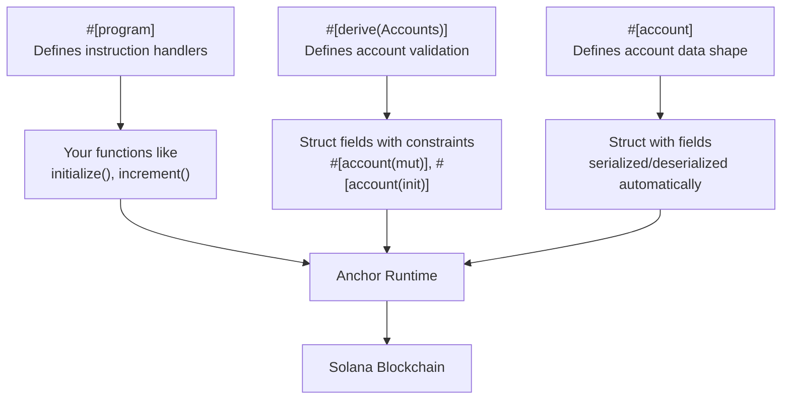
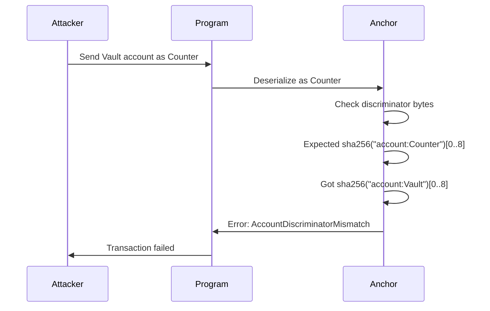
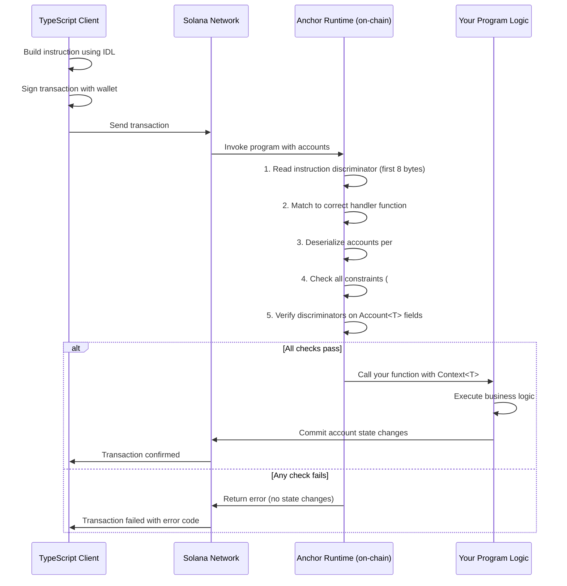

# Anchor Framework — The Best Way to Build on Solana

> "Building Solana programs without Anchor is like building a house without power tools. You *can* do it, but why would you?"

---

## 🧭 What You Will Learn

By the end of this chapter, you will understand:

- What Anchor is and why it exists
- How to install and set up an Anchor project
- The core macros that make Anchor powerful
- How to validate accounts without writing security checks by hand
- How PDAs work inside Anchor
- How to handle errors cleanly
- What an IDL is and why it matters
- A full, working Counter program with TypeScript tests

---

## 🤔 What Is Anchor, and Why Should You Care?

**Real-world analogy:** Think about building a web server. You *could* write raw TCP socket code in C. It would work. But most developers use frameworks like Express or Django that handle the boring parts — routing, parsing, error handling — so you can focus on your actual logic.

Anchor is that framework for Solana programs.

Writing a raw Solana program in Rust means you spend 60–70% of your code doing:

- Manually deserializing account data
- Checking that accounts are writable or signers
- Preventing account confusion (is this really a Counter account or something else?)
- Writing boilerplate that is the same in every program

Anchor eliminates all of that with macros and conventions. It is the closest thing Solana has to what Hardhat + OpenZeppelin is for Ethereum.

### Anchor vs Raw Solana Programs

| Feature | Raw Solana (Native) | Anchor |
|---|---|---|
| Account deserialization | Manual, error-prone | Automatic via macros |
| Account validation | Write checks yourself | Declarative constraints |
| Error handling | Raw error codes | Named enums with messages |
| ABI / IDL generation | None | Auto-generated |
| Client-side integration | Manual | TypeScript client included |
| Security (discriminators) | You build it | Built-in 8-byte prefix |
| Learning curve | Very steep | Much gentler |
| Production use | Yes (e.g. Serum) | Yes (e.g. Marinade, Jito) |

**When to use Anchor:**
- Almost always when building new programs
- When you want fast iteration and safety
- When you need a TypeScript client that matches your program

**When NOT to use Anchor:**
- When program size is extremely critical (Anchor adds some overhead)
- When you are building very low-level infrastructure or custom runtimes
- When you need byte-level control over account layout

---

## 🏗️ Installing Anchor

Before installing Anchor, you need Rust, Solana CLI, and Node.js. If you completed the previous chapters, you already have those.

### Install Anchor Version Manager (AVM)

AVM lets you switch between Anchor versions the same way NVM lets you switch Node versions.

```bash
cargo install --git https://github.com/coral-xyz/anchor avm --locked --force
```

### Install the Latest Anchor Version

```bash
avm install latest
avm use latest
```

### Verify the Installation

```bash
anchor --version
# anchor-cli 0.30.x
```

---

## 📁 Creating Your First Anchor Project

```bash
anchor init my-counter
cd my-counter
```

This creates the following structure:

```
my-counter/
├── Anchor.toml          # Project config (cluster, wallet, program IDs)
├── Cargo.toml           # Rust workspace config
├── package.json         # Node.js deps for tests
├── programs/
│   └── my-counter/
│       ├── Cargo.toml
│       └── src/
│           └── lib.rs   # Your Solana program lives here
├── tests/
│   └── my-counter.ts    # TypeScript tests using @coral-xyz/anchor
└── target/              # Build output, IDL files
```

### What Is Anchor.toml?

```toml
[features]
seeds = false
skip-lint = false

[programs.localnet]
my_counter = "Fg6PaFpoGXkYsidMpWTK6W2BeZ7FEfcYkg476zPFsLnS"

[registry]
url = "https://api.apr.dev"

[provider]
cluster = "Localnet"
wallet = "~/.config/solana/id.json"

[scripts]
test = "yarn run ts-mocha -p ./tsconfig.json -t 1000000 tests/**/*.ts"
```

The `[programs.localnet]` section maps your program name to its on-chain address. When you run `anchor build`, Anchor derives this address from your keypair.

---

## ⚙️ The Core Anchor Macros

Anchor uses Rust macros (think of them as code generators) to eliminate boilerplate. There are three macros you will use constantly.



### Macro 1: `#[program]`

**Analogy:** This is like defining your REST API routes. Each function inside is one "endpoint" — one instruction your program can handle.

```rust
#[program]
pub mod my_counter {
    use super::*;

    pub fn initialize(ctx: Context<Initialize>) -> Result<()> {
        // logic here
        Ok(())
    }

    pub fn increment(ctx: Context<Increment>) -> Result<()> {
        // logic here
        Ok(())
    }
}
```

Every function inside `#[program]`:
- Takes a `Context<T>` as its first argument (more on this below)
- Can take additional arguments (numbers, strings, etc.)
- Returns `Result<()>` — either success or a typed error

### Macro 2: `#[derive(Accounts)]`

**Analogy:** Think of this as a form validator. Before your function even runs, Anchor checks that all the accounts passed in are exactly what you declared. If any check fails, the transaction is rejected automatically.

```rust
#[derive(Accounts)]
pub struct Initialize<'info> {
    #[account(
        init,
        payer = user,
        space = 8 + 8  // 8 for discriminator + 8 for u64 counter field
    )]
    pub counter: Account<'info, Counter>,

    #[account(mut)]
    pub user: Signer<'info>,

    pub system_program: Program<'info, System>,
}
```

Each field in this struct is an account that the transaction must supply. The `#[account(...)]` attribute on each field is where you write your validation rules — and Anchor enforces them before your function body runs.

### Macro 3: `#[account]`

**Analogy:** This is like defining a database table schema. It tells Anchor what data lives inside an account.

```rust
#[account]
pub struct Counter {
    pub count: u64,
}
```

When you mark a struct with `#[account]`, Anchor automatically:
- Serializes/deserializes it using Borsh (a binary encoding format)
- Adds an 8-byte **discriminator** to the front (explained below)

---

## 🔐 Account Constraints — The Heart of Anchor Security

This is where Anchor really shines. Instead of writing `if !ctx.accounts.user.is_signer { return Err(...) }` everywhere, you declare rules inline.

### Common Constraints

```rust
// Mark account as writable (needed when you modify data)
#[account(mut)]

// Create a new account, paid for by `payer`, with N bytes of space
#[account(init, payer = user, space = 8 + 8)]

// Verify a Program Derived Address (PDA)
#[account(seeds = [b"counter", user.key().as_ref()], bump)]

// Combine init with PDA
#[account(
    init,
    payer = user,
    space = 8 + 8,
    seeds = [b"counter", user.key().as_ref()],
    bump
)]

// Account must be owned by a specific program
#[account(owner = token_program.key())]

// Account data must equal a specific value
#[account(constraint = counter.count < 100 @ ErrorCode::CounterFull)]

// Close an account and send its lamports to `receiver`
#[account(mut, close = receiver)]
```

### Constraint Reference Table

| Constraint | What It Does | When to Use |
|---|---|---|
| `mut` | Account must be writable | Modifying account data or balance |
| `init` | Creates account on-chain | First time creating an account |
| `payer = <field>` | Who pays the rent | With `init` |
| `space = N` | How many bytes to allocate | With `init` |
| `seeds = [...]` | Validates PDA seeds | PDA accounts |
| `bump` | Validates canonical bump | PDA accounts |
| `has_one = field` | `account.field == passed_account.key()` | Ownership checks |
| `constraint = expr` | Custom boolean expression | Anything else |
| `close = target` | Closes account, returns lamports | Cleanup instructions |
| `address = pubkey` | Account must have this exact address | Hardcoded accounts |

---

## 🎯 The Context Pattern

**Analogy:** When a web framework calls your route handler, it passes a `request` object that contains everything — the URL, headers, body, cookies. Anchor's `Context<T>` is that request object for your instruction.

```rust
pub fn increment(ctx: Context<Increment>) -> Result<()> {
    let counter = &mut ctx.accounts.counter;
    counter.count += 1;
    Ok(())
}
```

`ctx.accounts` gives you access to all the validated accounts defined in your `Increment` struct. Because Anchor already validated them, you can just use them.

`ctx` also gives you:
- `ctx.program_id` — your program's address
- `ctx.remaining_accounts` — any extra accounts not declared in the struct
- `ctx.bumps` — the bump seeds for any PDA accounts (used when creating PDAs inside instructions)

---

## 🧱 Account Discriminators — Preventing Account Confusion

**Analogy:** Imagine you have two types of forms in a filing cabinet: Employee forms and Customer forms. They look similar. Without labels, you might accidentally process a Customer form as an Employee form. The discriminator is Anchor's label on every account.

When Anchor creates an account with `#[account]`, it writes the first 8 bytes as a hash of the account type name:

```
[discriminator: 8 bytes][your actual data: remaining bytes]
```

The discriminator is `sha256("account:Counter")[0..8]`.

When your program reads an account, Anchor checks that the first 8 bytes match the expected discriminator. If they do not match, the transaction fails. This prevents an attacker from passing in a `Vault` account where your program expects a `Counter` account.



You do not write this code. Anchor handles it automatically whenever you use `Account<'info, T>`.

---

## 💥 Error Handling with `#[error_code]`

**Analogy:** HTTP status codes tell the client what went wrong (404 Not Found, 403 Forbidden). Anchor's `#[error_code]` is your program's equivalent — named errors with human-readable messages.

```rust
#[error_code]
pub enum CounterError {
    #[msg("The counter has reached its maximum value")]
    CounterOverflow,

    #[msg("You are not authorized to modify this counter")]
    Unauthorized,

    #[msg("Counter count must be greater than zero to decrement")]
    CannotDecrement,
}
```

Return errors inside instructions like this:

```rust
pub fn increment(ctx: Context<Increment>) -> Result<()> {
    let counter = &mut ctx.accounts.counter;

    // Return named error if overflow would happen
    if counter.count == u64::MAX {
        return Err(CounterError::CounterOverflow.into());
    }

    counter.count += 1;
    Ok(())
}
```

Or use the `require!` macro for cleaner code:

```rust
pub fn increment(ctx: Context<Increment>) -> Result<()> {
    let counter = &mut ctx.accounts.counter;
    require!(counter.count < u64::MAX, CounterError::CounterOverflow);
    counter.count += 1;
    Ok(())
}
```

---

## 📜 What Is an IDL?

**Analogy:** When you deploy a Solana program, clients do not automatically know how to talk to it — what instructions exist, what accounts they need, what types they use. An IDL (Interface Description Language) is like a published menu at a restaurant. It tells clients exactly what is available and how to order it.

Anchor auto-generates an IDL file at `target/idl/my_counter.json` every time you build. It looks like:

```json
{
  "version": "0.1.0",
  "name": "my_counter",
  "instructions": [
    {
      "name": "initialize",
      "accounts": [
        { "name": "counter", "isMut": true, "isSigner": false },
        { "name": "user", "isMut": true, "isSigner": true },
        { "name": "systemProgram", "isMut": false, "isSigner": false }
      ],
      "args": []
    },
    {
      "name": "increment",
      "accounts": [
        { "name": "counter", "isMut": true, "isSigner": false },
        { "name": "user", "isMut": false, "isSigner": true }
      ],
      "args": []
    }
  ],
  "accounts": [
    {
      "name": "Counter",
      "type": {
        "kind": "struct",
        "fields": [{ "name": "count", "type": "u64" }]
      }
    }
  ]
}
```

The `@coral-xyz/anchor` TypeScript library reads this IDL and auto-generates a fully typed client. You never manually craft transaction bytes.

---

## 🚀 Full Working Example: Counter Program

Let us build a counter that any user can initialize (with a PDA tied to their wallet) and increment. This demonstrates every concept covered above.

### The Program (`programs/my-counter/src/lib.rs`)

```rust
use anchor_lang::prelude::*;

declare_id!("Fg6PaFpoGXkYsidMpWTK6W2BeZ7FEfcYkg476zPFsLnS");

#[program]
pub mod my_counter {
    use super::*;

    /// Creates a new counter account for the user.
    /// The counter is a PDA derived from ["counter", user_pubkey].
    /// This means each user gets their own unique counter.
    pub fn initialize(ctx: Context<Initialize>) -> Result<()> {
        let counter = &mut ctx.accounts.counter;
        counter.count = 0;
        counter.authority = ctx.accounts.user.key();
        msg!("Counter initialized. Count: {}", counter.count);
        Ok(())
    }

    /// Increments the counter by 1.
    /// Only the original user (authority) can increment.
    pub fn increment(ctx: Context<Increment>) -> Result<()> {
        let counter = &mut ctx.accounts.counter;

        // Guard against overflow
        require!(counter.count < u64::MAX, CounterError::CounterOverflow);

        counter.count += 1;
        msg!("Counter incremented. New count: {}", counter.count);
        Ok(())
    }

    /// Resets the counter back to zero.
    /// Only the authority can reset.
    pub fn reset(ctx: Context<Reset>) -> Result<()> {
        let counter = &mut ctx.accounts.counter;
        counter.count = 0;
        msg!("Counter reset to zero.");
        Ok(())
    }
}

// ─────────────────────────────────────────────
// Account Validation Structs
// ─────────────────────────────────────────────

#[derive(Accounts)]
pub struct Initialize<'info> {
    /// The counter account to create.
    /// It is a PDA seeded by "counter" + user pubkey.
    /// init: creates the account
    /// payer: user pays the rent
    /// space: 8 (discriminator) + 32 (Pubkey) + 8 (u64) = 48 bytes
    #[account(
        init,
        payer = user,
        space = 8 + 32 + 8,
        seeds = [b"counter", user.key().as_ref()],
        bump
    )]
    pub counter: Account<'info, Counter>,

    /// The user creating the counter. Must sign and pay for rent.
    #[account(mut)]
    pub user: Signer<'info>,

    /// Required by Solana to create new accounts.
    pub system_program: Program<'info, System>,
}

#[derive(Accounts)]
pub struct Increment<'info> {
    /// The counter to increment. Must be mutable since we write to it.
    /// seeds + bump: verifies this is the correct PDA for this user
    /// has_one = authority: counter.authority must equal the authority account passed in
    #[account(
        mut,
        seeds = [b"counter", authority.key().as_ref()],
        bump,
        has_one = authority @ CounterError::Unauthorized
    )]
    pub counter: Account<'info, Counter>,

    /// Must be the original creator (stored in counter.authority).
    pub authority: Signer<'info>,
}

#[derive(Accounts)]
pub struct Reset<'info> {
    #[account(
        mut,
        seeds = [b"counter", authority.key().as_ref()],
        bump,
        has_one = authority @ CounterError::Unauthorized
    )]
    pub counter: Account<'info, Counter>,

    pub authority: Signer<'info>,
}

// ─────────────────────────────────────────────
// Account Data Struct
// ─────────────────────────────────────────────

#[account]
pub struct Counter {
    /// The wallet that owns this counter.
    pub authority: Pubkey,
    /// The current count value.
    pub count: u64,
}

// ─────────────────────────────────────────────
// Custom Errors
// ─────────────────────────────────────────────

#[error_code]
pub enum CounterError {
    #[msg("Counter has reached the maximum value and cannot be incremented further")]
    CounterOverflow,

    #[msg("You are not the authority of this counter")]
    Unauthorized,
}
```

### Build the Program

```bash
anchor build
```

This compiles the Rust program and generates:
- `target/deploy/my_counter.so` — the compiled BPF bytecode
- `target/idl/my_counter.json` — the IDL file
- `target/types/my_counter.ts` — TypeScript types

---

## 🧪 TypeScript Tests (`tests/my-counter.ts`)

Anchor generates a fully typed TypeScript client from your IDL. You write tests that call your program exactly as a real client would.

```typescript
import * as anchor from "@coral-xyz/anchor";
import { Program } from "@coral-xyz/anchor";
import { MyCounter } from "../target/types/my_counter";
import { PublicKey } from "@solana/web3.js";
import { assert } from "chai";

describe("my-counter", () => {
  // Configure the client to use the local cluster.
  const provider = anchor.AnchorProvider.env();
  anchor.setProvider(provider);

  const program = anchor.workspace.MyCounter as Program<MyCounter>;
  const user = provider.wallet as anchor.Wallet;

  // Derive the counter PDA address deterministically.
  // This is the same address the program will use on-chain.
  let counterPDA: PublicKey;
  let counterBump: number;

  before(async () => {
    [counterPDA, counterBump] = PublicKey.findProgramAddressSync(
      [Buffer.from("counter"), user.publicKey.toBuffer()],
      program.programId
    );
    console.log("Counter PDA:", counterPDA.toBase58());
    console.log("Counter Bump:", counterBump);
  });

  it("Initializes the counter at zero", async () => {
    // Call the initialize instruction.
    // Anchor automatically resolves PDAs and known programs.
    const tx = await program.methods
      .initialize()
      .accounts({
        counter: counterPDA,
        user: user.publicKey,
        systemProgram: anchor.web3.SystemProgram.programId,
      })
      .rpc();

    console.log("Initialize transaction:", tx);

    // Fetch the counter account and verify its state.
    const counterAccount = await program.account.counter.fetch(counterPDA);
    assert.equal(counterAccount.count.toNumber(), 0);
    assert.equal(
      counterAccount.authority.toBase58(),
      user.publicKey.toBase58()
    );
  });

  it("Increments the counter to 1", async () => {
    await program.methods
      .increment()
      .accounts({
        counter: counterPDA,
        authority: user.publicKey,
      })
      .rpc();

    const counterAccount = await program.account.counter.fetch(counterPDA);
    assert.equal(counterAccount.count.toNumber(), 1);
  });

  it("Increments the counter a second time to 2", async () => {
    await program.methods
      .increment()
      .accounts({
        counter: counterPDA,
        authority: user.publicKey,
      })
      .rpc();

    const counterAccount = await program.account.counter.fetch(counterPDA);
    assert.equal(counterAccount.count.toNumber(), 2);
  });

  it("Resets the counter back to zero", async () => {
    await program.methods
      .reset()
      .accounts({
        counter: counterPDA,
        authority: user.publicKey,
      })
      .rpc();

    const counterAccount = await program.account.counter.fetch(counterPDA);
    assert.equal(counterAccount.count.toNumber(), 0);
  });

  it("Rejects increment from a different user (unauthorized)", async () => {
    // Create a new random keypair — this is NOT the authority.
    const attacker = anchor.web3.Keypair.generate();

    // Airdrop some SOL to the attacker so they can pay fees.
    const airdropSig = await provider.connection.requestAirdrop(
      attacker.publicKey,
      anchor.web3.LAMPORTS_PER_SOL
    );
    await provider.connection.confirmTransaction(airdropSig);

    try {
      // The attacker tries to pass their own key as authority.
      // But counter.authority is still the original user's key.
      // has_one = authority will reject this.
      await program.methods
        .increment()
        .accounts({
          counter: counterPDA,
          authority: attacker.publicKey,
        })
        .signers([attacker])
        .rpc();

      assert.fail("Expected transaction to fail with Unauthorized error");
    } catch (err: any) {
      // Anchor wraps the custom error in an AnchorError object.
      assert.include(err.message, "Unauthorized");
      console.log("Correctly rejected unauthorized increment.");
    }
  });
});
```

### Running the Tests

```bash
# Start a local validator in one terminal
solana-test-validator

# In another terminal, run the tests
anchor test
```

Or run everything in one command (Anchor manages the local validator):

```bash
anchor test --skip-local-validator
# or just:
anchor test
```

---

## 🔄 How a Transaction Flows Through Anchor

Understanding this flow helps you debug issues and reason about what Anchor is doing behind the scenes.



---

## 📐 Space Calculation Reference

When you use `init`, you must specify `space` accurately. Under-allocating causes panics; over-allocating wastes rent.

| Type | Size (bytes) |
|---|---|
| Anchor discriminator | 8 (always add this first) |
| `bool` | 1 |
| `u8` / `i8` | 1 |
| `u16` / `i16` | 2 |
| `u32` / `i32` | 4 |
| `u64` / `i64` | 8 |
| `u128` / `i128` | 16 |
| `Pubkey` | 32 |
| `String` | 4 + length (max chars) |
| `Vec<T>` | 4 + (size of T * capacity) |
| `Option<T>` | 1 + size of T |

**Example calculation for Counter:**

```rust
// Counter has: authority (Pubkey = 32) + count (u64 = 8)
// Total: 8 (discriminator) + 32 + 8 = 48
space = 8 + 32 + 8
```

---

## 🗺️ PDAs in Anchor — Deeper Look

PDAs (Program Derived Addresses) are accounts that your program controls. No private key exists for them. Anchor makes working with PDAs much simpler than native programs.

**Analogy:** A PDA is like a safety deposit box at a bank. The bank (your program) is the only one who can open it, but the box is identified by a unique combination — your name (user pubkey) plus a box number (seed).

### Deriving a PDA in TypeScript (Client Side)

```typescript
const [pda, bump] = PublicKey.findProgramAddressSync(
  [
    Buffer.from("counter"),      // seed 1: static string
    user.publicKey.toBuffer(),   // seed 2: user's public key
  ],
  program.programId
);
```

### Declaring a PDA in Rust (Program Side)

```rust
#[account(
    seeds = [b"counter", authority.key().as_ref()],
    bump
)]
pub counter: Account<'info, Counter>,
```

Anchor automatically:
1. Derives the PDA from the seeds and your program ID
2. Verifies that the account passed in matches the derived address
3. Finds and stores the canonical bump (the first valid bump seed)

If you need to use the bump inside an instruction (for example, when signing a CPI):

```rust
pub fn do_something(ctx: Context<DoSomething>) -> Result<()> {
    let bump = ctx.bumps.counter; // Anchor provides bumps for all PDA accounts
    // use bump in CPI signing...
    Ok(())
}
```

---

## 🔑 Key Takeaways

1. **Anchor is the standard framework for Solana development.** It handles deserialization, validation, discriminators, and IDL generation automatically — things you would spend days writing by hand.

2. **`#[program]` defines your instruction handlers.** Each public function inside is one instruction your program can receive.

3. **`#[derive(Accounts)]` is where security lives.** The constraints you declare there (`mut`, `init`, `has_one`, `seeds`, `bump`, `constraint`) are enforced before your function body ever runs. Anchor rejects invalid transactions for you.

4. **`#[account]` defines your on-chain data shape.** Anchor serializes and deserializes it automatically using Borsh.

5. **The 8-byte discriminator prevents account confusion attacks.** Anchor writes and checks it automatically whenever you use `Account<'info, T>`. You get this security for free.

6. **`#[error_code]` gives your errors names and messages.** Use `require!()` for clean, readable error returns.

7. **The IDL is your program's public API contract.** The TypeScript client reads it to know exactly what your program expects — no manual byte crafting needed.

8. **Space calculation must be exact.** Always start with `8` for the discriminator and add the size of each field. Getting this wrong causes runtime panics.

9. **PDAs in Anchor are declared with `seeds` and `bump`.** Anchor verifies the derivation automatically. You get the bump from `ctx.bumps` when needed.

10. **Test with `@coral-xyz/anchor` TypeScript library.** It provides a fully typed, IDL-powered client that mirrors your on-chain program exactly.

---

## 🔗 What Comes Next

Now that you understand Anchor's foundations, the next natural steps are:

- **Cross-Program Invocations (CPIs):** Calling other programs (like the Token Program) from inside your Anchor program
- **Token integration:** Using `anchor-spl` to work with SPL tokens inside your program
- **Program upgrades:** How to safely upgrade an Anchor program without breaking existing accounts
- **Advanced PDA patterns:** Using PDAs as signing authorities for CPIs

---

*Chapter 5 of the Solana Developer Notes Series*
