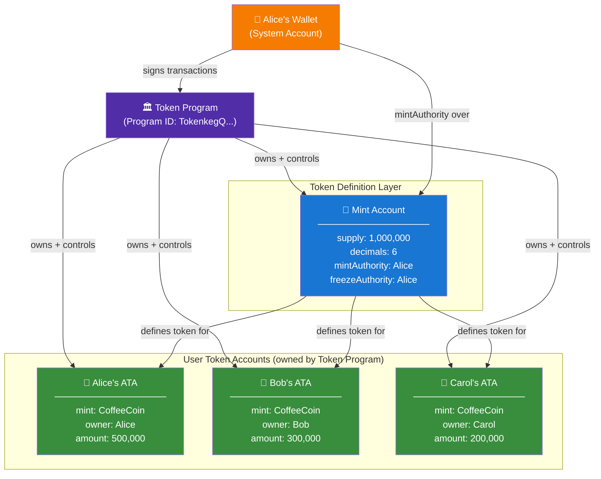
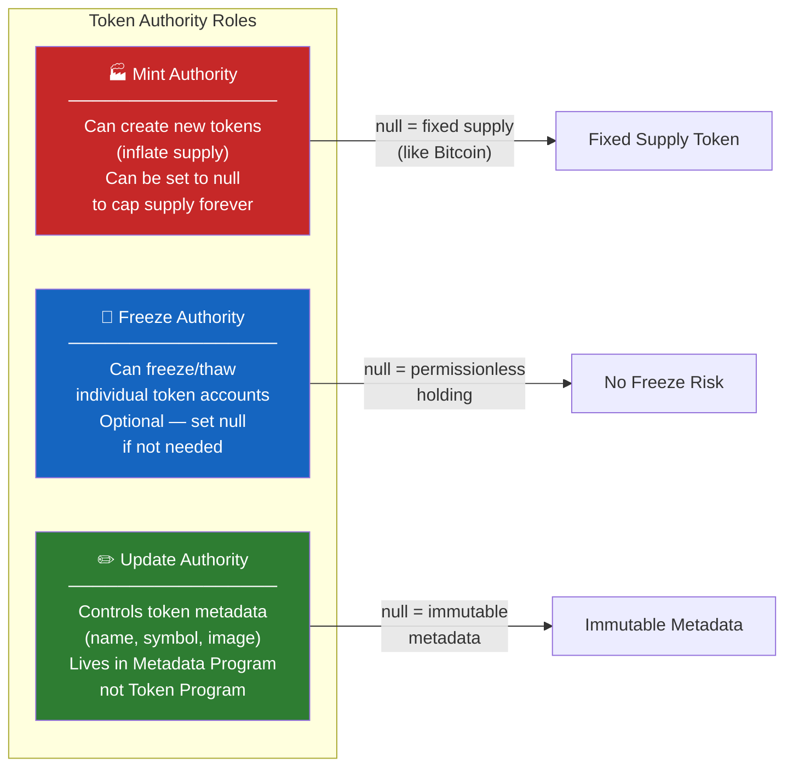
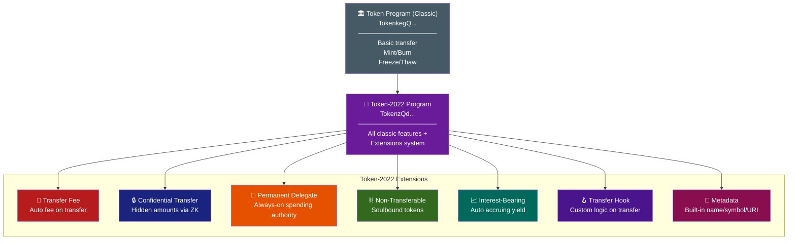
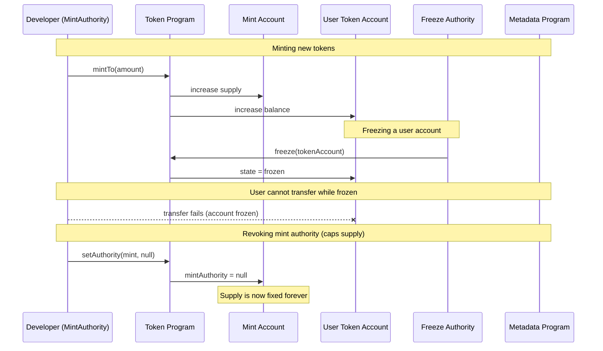

# SPL Tokens on Solana

> **Chapter 6** — The complete developer guide to creating, managing, and extending tokens on Solana

---

## 🪙 What Even Is an SPL Token?

Imagine you want to create a reward point system for your coffee shop. Every customer who buys a coffee gets 10 "CoffeeCoin" points. Those points can be transferred, redeemed, and burned. You need a standard way to do this so every register, every app, and every third-party integration knows how to handle "CoffeeCoin."

On Ethereum, that standard is **ERC-20**. On Solana, it is the **SPL Token standard**.

**SPL** stands for **Solana Program Library** — a collection of on-chain programs (smart contracts) that Solana ships as core infrastructure. The Token Program is the most important of these.

### Key difference from ERC-20

On Ethereum, each token is its own smart contract. You deploy a `CoffeeCoin.sol` contract, and that contract holds all the logic and all the balances.

On Solana, there is **one** Token Program that manages **all** tokens. Instead of each token having its own contract, each token has a set of **data accounts** that the Token Program owns and controls.

| Feature | Ethereum ERC-20 | Solana SPL Token |
|---|---|---|
| Token logic lives in | Your deployed contract | The shared Token Program |
| Each token has | Its own contract address | A Mint Account |
| User balances stored in | The token contract mapping | Separate Token Accounts |
| Deployment cost | High (deploy new contract) | Low (just create accounts) |
| Interoperability | Varies per contract | Identical for all tokens |
| Program reuse | None — each contract is isolated | All tokens share one program |

---

## 🗂️ The Three Accounts You Must Know

Think of SPL tokens like a banking system with three distinct things:

1. **The Mint Account** — the "charter" for the currency (like the Federal Reserve defining the Dollar)
2. **The Token Account** — a specific bank account holding that currency for one person
3. **The Associated Token Account (ATA)** — a standardized, predictable bank account derived from your wallet address

Let's go deep on each one.

---

## 🏦 Mint Account — The Token Definition

The **Mint Account** is not where tokens are stored. It is the **definition** of the token itself. Think of it as the blueprint or the charter.

It stores:

| Field | Description | Example |
|---|---|---|
| `supply` | Total tokens currently in circulation | `1,000,000` |
| `decimals` | Number of decimal places | `6` (like USDC) |
| `mintAuthority` | Who can create (mint) new tokens | Your wallet pubkey |
| `freezeAuthority` | Who can freeze token accounts | Your wallet pubkey or `null` |
| `isInitialized` | Whether the mint is set up | `true` |

The `decimals` field is critical. If `decimals = 6`, then `1,000,000` raw units = `1.000000` tokens. USDC uses 6 decimals. SOL itself uses 9 (called "lamports"). If you set `decimals = 0`, your token is naturally non-fractional — good for NFTs or items.

---

## 👛 Token Account — Where Tokens Actually Live

Now think of each person's wallet. They cannot directly "hold" tokens in their main wallet account. Instead, for **every token they want to hold**, they need a separate **Token Account**.

A Token Account stores:

| Field | Description |
|---|---|
| `mint` | Which token this account holds (Mint Account pubkey) |
| `owner` | Who controls this Token Account (usually your wallet) |
| `amount` | How many raw token units are held |
| `delegate` | Someone else given spending authority (optional) |
| `state` | `initialized`, `frozen`, etc. |
| `closeAuthority` | Who can close this account and reclaim rent |

One wallet can have **many** Token Accounts — one per token type. If you hold USDC, BONK, and RAY, you have three separate Token Accounts.

---

## 🔗 Associated Token Account (ATA) — The Standard Address

Here is a problem: if someone wants to send you USDC, they need to know the address of your USDC Token Account. But Token Accounts can be created at any address. How do they find yours?

The **Associated Token Account (ATA)** solves this with a deterministic formula.

The ATA address is derived from:

```
ATA address = PDA(wallet_address + TOKEN_PROGRAM_ID + mint_address)
```

Given your wallet and the USDC mint address, anyone can compute the exact address of your USDC token account without asking you first. It is always the same. This is the **standard** way to hold tokens.

When a dApp sends you tokens, it uses `getOrCreateAssociatedTokenAccount` — which checks if your ATA exists, and creates it if not (paying the rent cost in SOL).

---

## 🔄 SPL Token Account Relationship Diagram



---

## ⚙️ The Token Program

The **Token Program** is a Solana on-chain program that:

- Creates and manages Mint Accounts
- Creates and manages Token Accounts
- Authorizes minting, burning, transferring, and freezing

Its program ID is: `TokenkegQfeZyiNwAJbNbGKPFXCWuBvf9Ss623VQ5DA`

The newer **Token-2022 program** (also called Token Extensions) has ID: `TokenzQdBNbEquW5zBPuFZVKqUFAZGFv5n2yqQQXHG`

All token accounts are owned by one of these two programs — not by your wallet directly. Your wallet signs instructions that the Token Program executes on the accounts.

---

## 🛠️ Working with SPL Tokens: CLI Walkthrough

Install the Solana CLI tools first, then use `spl-token` for quick operations.

### Step 1 — Create a Mint (Define your token)

```bash
# Create a new token with 6 decimal places
spl-token create-token --decimals 6

# Output:
# Creating token 7xKXtg2CW87d97TXJSDpbD5jBkheTqA83TZRuJosgAsU
# Signature: 2Zyf3...
```

The returned address (`7xKXtg2C...`) is your **Mint Account** address. This is your token's identity on-chain.

### Step 2 — Create a Token Account

```bash
# Create a token account for your wallet to hold this token
spl-token create-account 7xKXtg2CW87d97TXJSDpbD5jBkheTqA83TZRuJosgAsU

# Output:
# Creating account 6cBm...
# Signature: 4Kap1...
```

### Step 3 — Mint Tokens

```bash
# Mint 1000 tokens (1000 * 10^6 raw units because decimals=6)
spl-token mint 7xKXtg2CW87d97TXJSDpbD5jBkheTqA83TZRuJosgAsU 1000

# Check supply
spl-token supply 7xKXtg2CW87d97TXJSDpbD5jBkheTqA83TZRuJosgAsU
# Output: 1000
```

### Step 4 — Transfer Tokens

```bash
# Transfer 100 tokens to another wallet
spl-token transfer 7xKXtg2CW87d97TXJSDpbD5jBkheTqA83TZRuJosgAsU \
  100 \
  <RECIPIENT_WALLET_ADDRESS> \
  --fund-recipient   # creates recipient ATA if needed, you pay for it
```

### Step 5 — Burn Tokens

```bash
# Burn 50 tokens (removes them from supply permanently)
spl-token burn <YOUR_TOKEN_ACCOUNT_ADDRESS> 50
```

### Step 6 — Freeze and Thaw a Token Account

```bash
# Freeze an account (requires freezeAuthority)
spl-token freeze <TOKEN_ACCOUNT_ADDRESS>

# Thaw (unfreeze) it
spl-token thaw <TOKEN_ACCOUNT_ADDRESS>
```

---

## 🔑 Authority Roles Explained

Three authority types control a token. Think of them like roles in a company.



| Authority | What it controls | Safe to revoke? |
|---|---|---|
| Mint Authority | Creating new tokens | Yes — makes supply fixed |
| Freeze Authority | Freezing user accounts | Yes — removes custodial risk |
| Update Authority | Updating metadata (name/symbol) | Yes — makes token info immutable |

Many DeFi protocols revoke mint authority after their initial token distribution to prove they cannot inflate supply. Investors look for this as a trust signal.

---

## 💻 Full TypeScript Example — Create and Mint a Token

This is a complete, working example using `@solana/spl-token`.

```bash
npm install @solana/web3.js @solana/spl-token
```

```typescript
import {
  Connection,
  Keypair,
  PublicKey,
  clusterApiUrl,
  LAMPORTS_PER_SOL,
} from "@solana/web3.js";
import {
  createMint,
  getOrCreateAssociatedTokenAccount,
  mintTo,
  transfer,
  burn,
  freezeAccount,
  thawAccount,
  getMint,
  getAccount,
} from "@solana/spl-token";

async function main() {
  // --- SETUP ---
  const connection = new Connection(clusterApiUrl("devnet"), "confirmed");

  // Generate wallets (in production, load from a file or env variable)
  const payer = Keypair.generate();      // Pays for all transactions
  const mintAuthority = Keypair.generate();
  const freezeAuthority = Keypair.generate();
  const recipient = Keypair.generate();

  // Airdrop SOL so we can pay for transactions
  console.log("Airdropping SOL to payer...");
  const airdropSig = await connection.requestAirdrop(
    payer.publicKey,
    2 * LAMPORTS_PER_SOL
  );
  await connection.confirmTransaction(airdropSig);
  console.log("Payer balance:", await connection.getBalance(payer.publicKey));

  // --- STEP 1: CREATE MINT ACCOUNT ---
  console.log("\n1. Creating mint...");
  const mint = await createMint(
    connection,
    payer,                          // payer of transaction fees
    mintAuthority.publicKey,        // who can mint new tokens
    freezeAuthority.publicKey,      // who can freeze accounts (null to disable)
    6                               // decimals (6 = like USDC)
  );
  console.log("Mint address:", mint.toBase58());

  // Inspect the mint account
  const mintInfo = await getMint(connection, mint);
  console.log("Supply:", mintInfo.supply.toString());
  console.log("Decimals:", mintInfo.decimals);
  console.log("Mint Authority:", mintInfo.mintAuthority?.toBase58());

  // --- STEP 2: CREATE ASSOCIATED TOKEN ACCOUNTS ---
  console.log("\n2. Creating token accounts...");

  // ATA for the payer (our own account to hold tokens)
  const payerTokenAccount = await getOrCreateAssociatedTokenAccount(
    connection,
    payer,                 // fee payer (also creates the account)
    mint,                  // which token mint
    payer.publicKey        // owner of this token account
  );
  console.log("Payer's ATA:", payerTokenAccount.address.toBase58());

  // ATA for the recipient
  const recipientTokenAccount = await getOrCreateAssociatedTokenAccount(
    connection,
    payer,                    // payer creates + funds the recipient's ATA
    mint,
    recipient.publicKey
  );
  console.log("Recipient's ATA:", recipientTokenAccount.address.toBase58());

  // --- STEP 3: MINT TOKENS ---
  console.log("\n3. Minting 1000 tokens...");
  // Raw amount = 1000 * 10^6 (because decimals=6)
  const MINT_AMOUNT = 1_000 * Math.pow(10, 6);

  await mintTo(
    connection,
    payer,                          // fee payer
    mint,                           // the mint
    payerTokenAccount.address,      // destination token account
    mintAuthority,                  // must sign — has mint authority
    MINT_AMOUNT
  );

  let payerAccount = await getAccount(connection, payerTokenAccount.address);
  console.log("Payer token balance:", payerAccount.amount.toString());
  // Should print: 1000000000 (raw) = 1000 tokens

  // --- STEP 4: TRANSFER TOKENS ---
  console.log("\n4. Transferring 250 tokens to recipient...");
  const TRANSFER_AMOUNT = 250 * Math.pow(10, 6);

  await transfer(
    connection,
    payer,                            // fee payer
    payerTokenAccount.address,        // source token account
    recipientTokenAccount.address,    // destination token account
    payer.publicKey,                  // owner of source account (must sign)
    TRANSFER_AMOUNT
  );

  let recipientAccount = await getAccount(connection, recipientTokenAccount.address);
  console.log("Recipient token balance:", recipientAccount.amount.toString());

  // --- STEP 5: BURN TOKENS ---
  console.log("\n5. Burning 100 tokens...");
  const BURN_AMOUNT = 100 * Math.pow(10, 6);

  await burn(
    connection,
    payer,                          // fee payer
    payerTokenAccount.address,      // account to burn from
    mint,                           // the mint
    payer.publicKey,                // owner of the account (must sign)
    BURN_AMOUNT
  );

  payerAccount = await getAccount(connection, payerTokenAccount.address);
  console.log("Payer balance after burn:", payerAccount.amount.toString());

  // Updated supply
  const updatedMintInfo = await getMint(connection, mint);
  console.log("New total supply:", updatedMintInfo.supply.toString());

  // --- STEP 6: FREEZE AN ACCOUNT ---
  console.log("\n6. Freezing recipient's account...");
  await freezeAccount(
    connection,
    payer,                             // fee payer
    recipientTokenAccount.address,     // account to freeze
    mint,                              // the mint
    freezeAuthority                    // must sign — has freeze authority
  );

  const frozenAccount = await getAccount(connection, recipientTokenAccount.address);
  console.log("Account frozen:", frozenAccount.isFrozen); // true

  // A frozen account cannot send or receive tokens
  // Trying to transfer to it will throw an error

  // --- STEP 7: THAW THE ACCOUNT ---
  console.log("\n7. Thawing recipient's account...");
  await thawAccount(
    connection,
    payer,
    recipientTokenAccount.address,
    mint,
    freezeAuthority
  );

  const thawedAccount = await getAccount(connection, recipientTokenAccount.address);
  console.log("Account frozen:", thawedAccount.isFrozen); // false

  console.log("\nAll operations complete!");
}

main().catch(console.error);
```

Run it on devnet:

```bash
npx ts-node token-demo.ts
```

---

## 🚀 Token-2022 — Token Extensions (The New Standard)

The original Token Program has been in production since 2021. It is battle-tested but limited. **Token-2022** (launched 2023) adds powerful extensions to tokens without breaking backward compatibility.

Think of Token-2022 like upgrading from a basic bank account to a programmable smart account — same core functions, but with extra rules you can bake in at creation time.

### Available Extensions

| Extension | What it does | Real-world use case |
|---|---|---|
| **Transfer Fee** | Automatically takes a % fee on every transfer | Protocol revenue, tax tokens |
| **Confidential Transfers** | Hides transfer amounts using ZK proofs | Privacy-preserving payments |
| **Permanent Delegate** | One address can always move/burn tokens | Compliance, recallable tokens |
| **Non-Transferable** | Tokens cannot be transferred after minting | Soulbound tokens, credentials |
| **Interest-Bearing** | Tokens accrue interest over time | Liquid staking, yield tokens |
| **Metadata** | Attach name/symbol/URI directly to mint | Removes need for Metaplex |
| **Transfer Hook** | Call custom program on every transfer | KYC enforcement, royalties |
| **Mint Close Authority** | Allow closing the mint account | Cleanup for one-time use tokens |
| **Default Account State** | New accounts start frozen by default | Permissioned tokens |



### Token-2022 Example: Transfer Fee

```typescript
import {
  createInitializeTransferFeeConfigInstruction,
  createInitializeMintInstruction,
  ExtensionType,
  getMintLen,
  TOKEN_2022_PROGRAM_ID,
} from "@solana/spl-token";
import {
  Connection,
  Keypair,
  SystemProgram,
  Transaction,
  clusterApiUrl,
  sendAndConfirmTransaction,
} from "@solana/web3.js";

async function createTokenWithTransferFee() {
  const connection = new Connection(clusterApiUrl("devnet"), "confirmed");
  const payer = Keypair.generate();

  // Airdrop first
  await connection.confirmTransaction(
    await connection.requestAirdrop(payer.publicKey, 2_000_000_000)
  );

  const mintKeypair = Keypair.generate();
  const mintAuthority = payer.publicKey;
  const transferFeeConfigAuthority = payer.publicKey;
  const withdrawWithheldAuthority = payer.publicKey;

  // Extension: 1% transfer fee (100 basis points), max fee 1000 tokens
  const feeBasisPoints = 100;       // 1%
  const maxFee = BigInt(1_000 * Math.pow(10, 6));  // max 1000 tokens

  // Calculate space needed for mint + extension
  const extensions = [ExtensionType.TransferFeeConfig];
  const mintLen = getMintLen(extensions);
  const lamports = await connection.getMinimumBalanceForRentExemption(mintLen);

  const transaction = new Transaction().add(
    // Create the mint account with enough space for the extension
    SystemProgram.createAccount({
      fromPubkey: payer.publicKey,
      newAccountPubkey: mintKeypair.publicKey,
      space: mintLen,
      lamports,
      programId: TOKEN_2022_PROGRAM_ID,
    }),
    // Initialize transfer fee extension BEFORE initializing mint
    createInitializeTransferFeeConfigInstruction(
      mintKeypair.publicKey,
      transferFeeConfigAuthority,
      withdrawWithheldAuthority,
      feeBasisPoints,
      maxFee,
      TOKEN_2022_PROGRAM_ID
    ),
    // Initialize the mint itself
    createInitializeMintInstruction(
      mintKeypair.publicKey,
      6,                   // decimals
      mintAuthority,
      null,                // freeze authority
      TOKEN_2022_PROGRAM_ID
    )
  );

  await sendAndConfirmTransaction(connection, transaction, [payer, mintKeypair]);

  console.log("Token-2022 mint with transfer fee:", mintKeypair.publicKey.toBase58());
  // Now every transfer automatically collects 1% fee
}

createTokenWithTransferFee().catch(console.error);
```

---

## ⚖️ Token Program vs Token-2022: When to Use Which

| Scenario | Use Token Program | Use Token-2022 |
|---|---|---|
| Simple fungible token (governance, utility) | Yes | Either works |
| Need transfer fees (protocol revenue) | No | Yes |
| Privacy-sensitive amounts | No | Yes (Confidential Transfers) |
| Regulated token (needs freeze on receive) | Partial | Yes (Default Account State) |
| Soulbound / credential token | No | Yes (Non-Transferable) |
| Yield-bearing token | Manually via program | Yes (Interest-Bearing) |
| Wallet support / broad ecosystem compat | Highest compat | Growing fast |
| Legacy protocol integration | Required | May break |

### When to use Token Program (classic)
- You are building a standard governance or utility token
- You need maximum wallet and DEX compatibility right now
- Your use case fits the basic mint/transfer/burn model
- You are learning — start here

### When NOT to use Token Program (classic)
- You need built-in fees — you would have to build a wrapper program
- You need privacy on transaction amounts
- You want soulbound or credential tokens
- You are building new infrastructure — consider Token-2022

### When to use Token-2022
- You are building a new protocol from scratch
- You need any of the extension features natively
- Your ecosystem (wallets, DEXes) already supports it
- You want metadata directly on-chain without Metaplex

### When NOT to use Token-2022
- Your users rely on older wallets that do not yet support it
- The protocol you are integrating with (old AMM, bridge) only handles classic tokens
- You just need a simple token fast

---

## 🔍 Mint Authority vs Freeze Authority vs Update Authority

These three authorities are a common point of confusion. Here is a clear breakdown:



---

## 🧮 Understanding Decimals and Raw Amounts

This trips up almost every new developer. The token program stores raw integer amounts. The `decimals` field tells wallets and UIs how to display it.

```
display_amount = raw_amount / (10 ^ decimals)
```

| Decimals | Raw stored | Displayed |
|---|---|---|
| 0 | 1 | 1 (whole units only, like NFTs) |
| 2 | 100 | 1.00 |
| 6 | 1,000,000 | 1.000000 (like USDC) |
| 9 | 1,000,000,000 | 1.000000000 (like SOL/wSOL) |

In code, always work in raw units:

```typescript
const DECIMALS = 6;
const ONE_TOKEN = 1 * Math.pow(10, DECIMALS);  // = 1_000_000 raw units
const HALF_TOKEN = 0.5 * Math.pow(10, DECIMALS); // = 500_000 raw units

// For BigInt (recommended for precision):
const ONE_TOKEN_BIG = BigInt(1_000_000);
```

Never use floating point for token amounts — rounding errors will bite you. Use `BigInt` or integer math.

---

## 💡 Rent and Account Costs

Every account on Solana must hold a minimum SOL balance to stay alive — called **rent-exempt** balance. For token accounts:

| Account Type | Approximate rent cost |
|---|---|
| Mint Account | ~0.0015 SOL |
| Token Account / ATA | ~0.002 SOL |
| Token-2022 Mint (with extensions) | Varies by extensions |

When you call `getOrCreateAssociatedTokenAccount`, if the ATA does not exist, the fee payer sends ~0.002 SOL to create it. This is why dApps sometimes ask you to "approve account creation" — they are paying rent on your behalf.

You can close a token account (when empty) to reclaim that rent:

```typescript
import { closeAccount } from "@solana/spl-token";

await closeAccount(
  connection,
  payer,                         // fee payer
  tokenAccountToClose,           // account to close
  destinationForRent,            // where recovered SOL goes
  accountOwner                   // must sign
);
```

---

## 🎓 Key Takeaways

1. **One Token Program rules all tokens.** Unlike ERC-20, there is no per-token contract on Solana. The shared Token Program handles everything.

2. **Three accounts model.** Mint Account (definition) + Token Account (holdings) + ATA (standard deterministic address). Know all three cold.

3. **ATAs are your default.** Always use Associated Token Accounts unless you have a specific reason not to. They are predictable, standard, and expected by every wallet and protocol.

4. **Authorities are roles, not keys.** `mintAuthority`, `freezeAuthority`, and `updateAuthority` can be set to any keypair, a multisig, or `null`. Setting to `null` is irreversible and proves decentralization.

5. **Decimals are for display only.** The blockchain stores raw integers. Always convert correctly. Use `BigInt` for safety.

6. **Rent is real.** Creating token accounts costs SOL. This is why creating many ATAs can get expensive for protocol developers. Budget for it.

7. **Token-2022 is the future.** For new projects, evaluate whether Token-2022 extensions meet your needs. Transfer fees, transfer hooks, and non-transferable tokens unlock capabilities that would otherwise require custom programs.

8. **Freeze authority is a trust signal.** If a token has a live freeze authority, the issuer can freeze your ability to transfer. For DeFi tokens, consider whether you are comfortable with that. Many projects revoke it.

9. **The ATA formula is public.** Given any wallet and any mint, anyone can compute the ATA address. This makes composability easy but also means anyone can know your token holdings on-chain.

10. **Test on devnet first.** Devnet airdrop gives you SOL for free. Iterate there before going to mainnet. Token addresses on devnet are worthless — you can experiment freely.

---

> **Next chapter:** Metaplex and NFT Metadata — how to attach names, images, and attributes to your tokens
