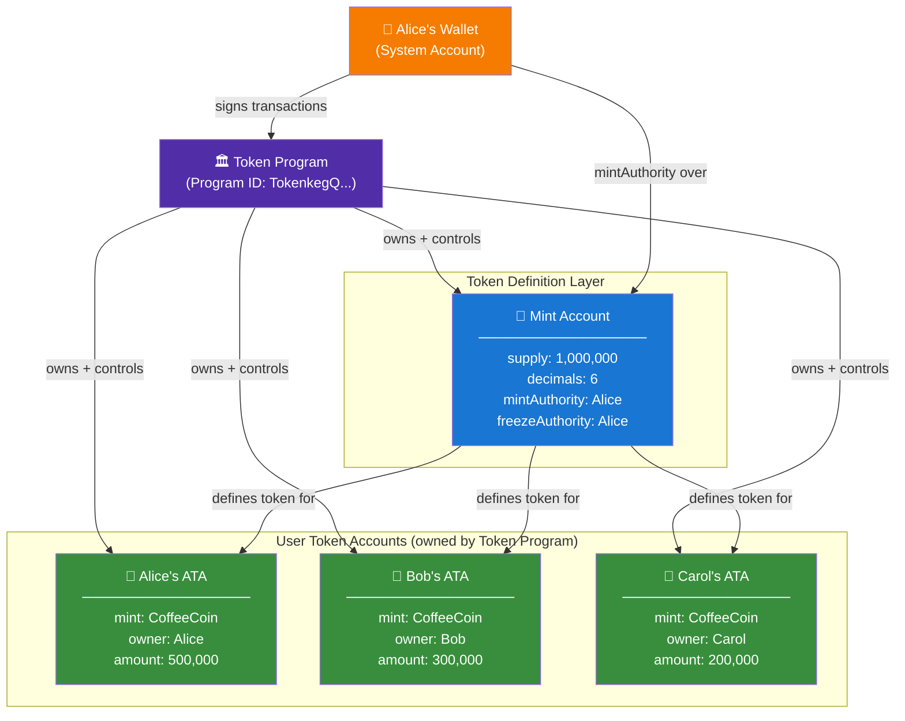
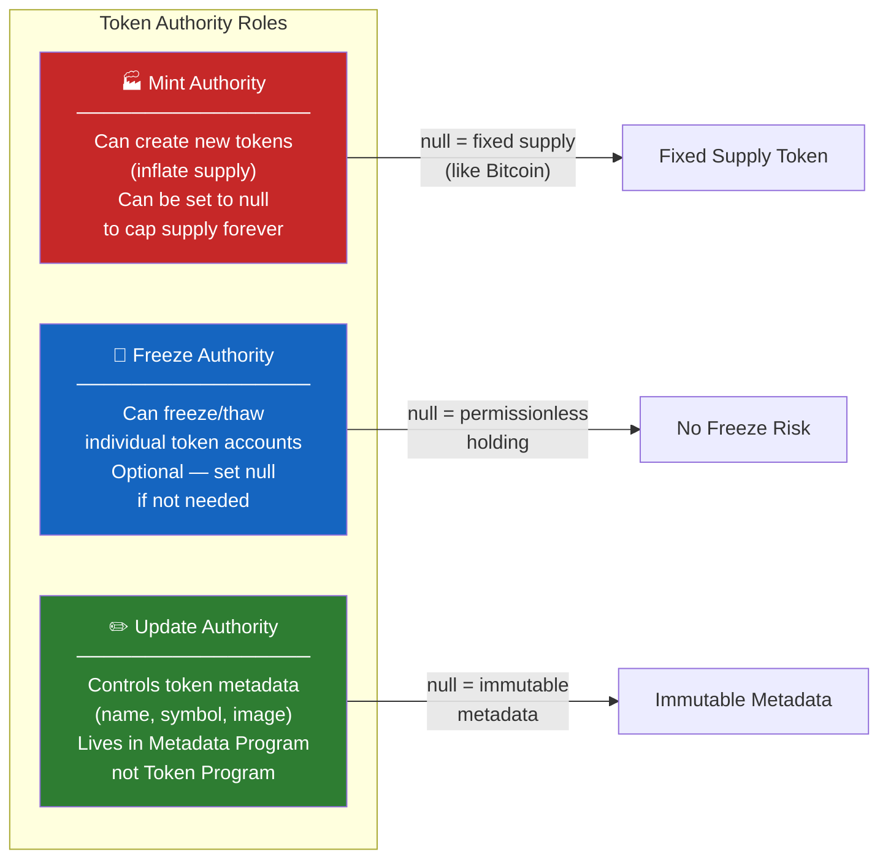
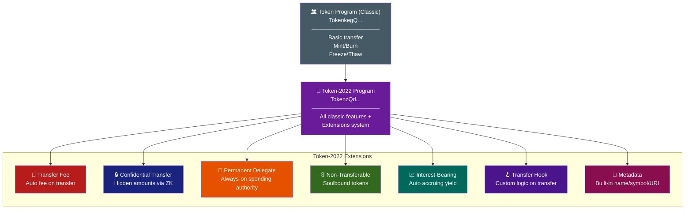
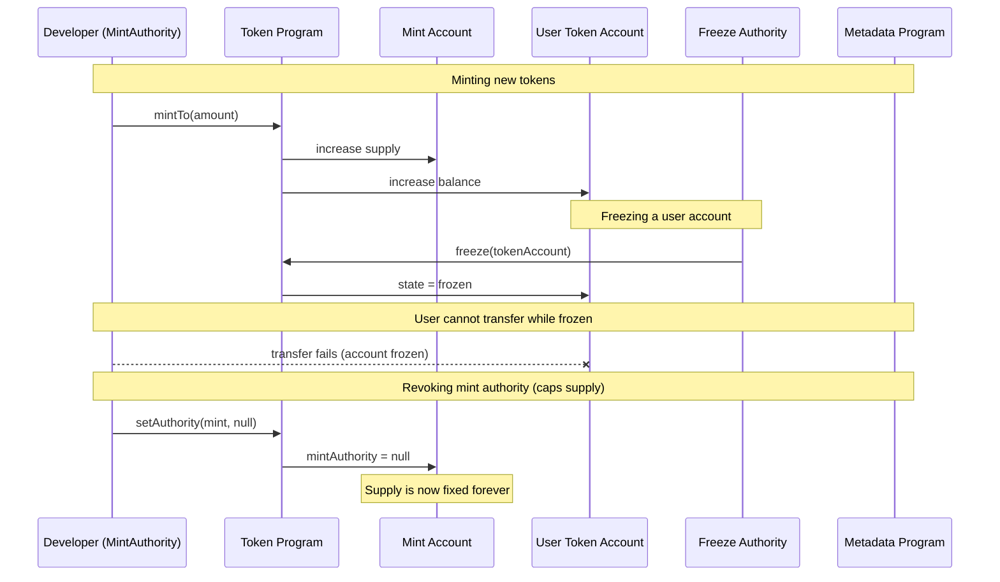

# SPL Tokens on Solana

> **Chapter 6** — Solana pe tokens create, manage aur extend karne ka complete developer guide

---

## 🪙 Yeh SPL Token Hai Kya Cheez?

Zara socho — tumne apni coffee shop ke liye ek reward point system banana hai. Har customer jo coffee kharidta hai, use 10 "CoffeeCoin" points milte hain. Yeh points transfer ho sakte hain, redeem ho sakte hain, burn bhi ho sakte hain. Ab isके liye tumhe ek standard tarika chahiye — taaki har register, har app, aur har third-party integration ko pata ho ki "CoffeeCoin" ko handle kaise karna hai.

Ethereum pe iska standard hai **ERC-20**. Solana pe iska standard hai **SPL Token standard**.

**SPL** ka matlab hai **Solana Program Library** — on-chain programs (smart contracts) ka ek collection jo Solana core infrastructure ke roop mein deta hai. Inme sabse important hai Token Program.

### ERC-20 se key difference

Ethereum pe har token ka apna alag smart contract hota hai. Tum `CoffeeCoin.sol` naam ka contract deploy karte ho, aur woh contract hi saari logic aur saare balances hold karta hai.

Solana pe sirf **ek** Token Program hai jo **saare** tokens manage karta hai. Har token ka apna contract nahi hota — balki har token ke paas apne **data accounts** hote hain jinko Token Program owns aur control karta hai.

Zomato ki analogy se socho — Ethereum ka approach jaise har restaurant apna khud ka delivery app bana le. Solana ka approach jaise Zomato ek hi platform hai jispe sab restaurants list hote hain, aur Zomato hi backend logic handle karta hai.

| Feature | Ethereum ERC-20 | Solana SPL Token |
|---|---|---|
| Token logic kahan hoti hai | Tumhare deployed contract mein | Shared Token Program mein |
| Har token ke paas kya hota hai | Apna khud ka contract address | Ek Mint Account |
| User balances kahan store hote hain | Token contract ke mapping mein | Alag Token Accounts mein |
| Deployment cost | Zyada (naya contract deploy karna) | Kam (bas accounts create karne hain) |
| Interoperability | Har contract ke hisab se alag | Sab tokens ke liye same |
| Program reuse | Nahi hota — har contract isolated hai | Sab tokens ek hi program share karte hain |

---

## 🗂️ Teen Accounts Jo Tumhe Pata Hone Chahiye

SPL tokens ko banking system ki tarah socho — teen alag-alag cheezein:

1. **Mint Account** — currency ka "charter" (jaise Reserve Bank ka Dollar/Rupee define karna)
2. **Token Account** — ek specific bank account jo ek insaan ke liye woh currency hold karta hai
3. **Associated Token Account (ATA)** — ek standardized, predictable bank account jo tumhare wallet address se derive hota hai

Chalo ek-ek karke deep dive karte hain.

---

## 🏦 Mint Account — Token Ki Definition

**Mint Account** woh jagah nahi hai jahan tokens store hote hain. Yeh token ki **definition** hai. Isse blueprint ya charter samjho.

Ismein yeh sab store hota hai:

| Field | Description | Example |
|---|---|---|
| `supply` | Abhi circulation mein kitne tokens hain | `1,000,000` |
| `decimals` | Decimal places kitne hain | `6` (USDC ki tarah) |
| `mintAuthority` | Naye tokens (mint) create karne ka adhikaar kiske paas hai | Tumhara wallet pubkey |
| `freezeAuthority` | Token accounts freeze karne ka adhikaar kiske paas hai | Tumhara wallet pubkey ya `null` |
| `isInitialized` | Mint set up hai ya nahi | `true` |

`decimals` field bohot critical hai. Agar `decimals = 6` hai, toh `1,000,000` raw units = `1.000000` tokens. USDC 6 decimals use karta hai. SOL khud 9 decimals use karta hai (jinhe "lamports" bolte hain). Agar `decimals = 0` set karoge, toh tumhara token naturally non-fractional ho jaayega — NFTs ya items ke liye perfect.

---

## 👛 Token Account — Jahan Tokens Actually Rehte Hain

Ab har insaan ke wallet ke baare mein socho. Woh apne main wallet account mein directly tokens "hold" nahi kar sakte. Balki, **jis bhi token ko hold karna hai**, uske liye unhe ek alag **Token Account** chahiye hota hai.

Ek Token Account mein yeh store hota hai:

| Field | Description |
|---|---|
| `mint` | Yeh account kaunsa token hold karta hai (Mint Account ka pubkey) |
| `owner` | Is Token Account ko kaun control karta hai (usually tumhara wallet) |
| `amount` | Kitne raw token units hold hain |
| `delegate` | Koi aur jise spending authority di gayi hai (optional) |
| `state` | `initialized`, `frozen`, waghera |
| `closeAuthority` | Is account ko close karke rent wapas kaun le sakta hai |

Ek wallet ke paas **kayi** Token Accounts ho sakte hain — har token type ke liye ek. Agar tumhare paas USDC, BONK, aur RAY hai, toh teen alag Token Accounts honge — bilkul aise jaise tumhare Paytm wallet mein alag-alag sections hon cashback points, gift cards, aur main balance ke liye.

---

## 🔗 Associated Token Account (ATA) — Standard Address

Ab ek problem samjho — agar koi tumhe USDC bhejna chahta hai, toh use tumhare USDC Token Account ka address pata hona chahiye. Lekin Token Accounts kisi bhi address pe create ho sakte hain. Toh unhe tumhara address kaise pata chalega?

**Associated Token Account (ATA)** iska solution hai — ek deterministic formula se.

ATA address is formula se derive hota hai:

```
ATA address = PDA(wallet_address + TOKEN_PROGRAM_ID + mint_address)
```

Bas tumhara wallet aur USDC mint address pata ho, toh koi bhi tumhare USDC token account ka exact address calculate kar sakta hai — tumse pooche bina. Yeh hamesha same hi rahega. Yahi **standard** tarika hai tokens hold karne ka.

Jab koi dApp tumhe tokens bhejta hai, woh `getOrCreateAssociatedTokenAccount` use karta hai — jo check karta hai ki tumhara ATA exist karta hai ya nahi, aur agar nahi karta toh use create kar deta hai (SOL mein rent cost pay karke).

> [!info]
> ATA basically UPI ID jaisa hai — ek predictable, standard address jo koi bhi calculate kar sakta hai bina tumse pehle poochhe.

---

## 🔄 SPL Token Account Relationship Diagram



---

## ⚙️ Token Program

**Token Program** ek Solana on-chain program hai jo yeh kaam karta hai:

- Mint Accounts create aur manage karta hai
- Token Accounts create aur manage karta hai
- Minting, burning, transferring, aur freezing ko authorize karta hai

Iska program ID hai: `TokenkegQfeZyiNwAJbNbGKPFXCWuBvf9Ss623VQ5DA`

Newer **Token-2022 program** (jise Token Extensions bhi bolte hain) ka ID hai: `TokenzQdBNbEquW5zBPuFZVKqUFAZGFv5n2yqQQXHG`

Saare token accounts in dono programs mein se kisi ek ke owned hote hain — tumhare wallet ke directly nahi. Tumhara wallet instructions sign karta hai, aur Token Program un accounts pe woh instructions execute karta hai.

---

## 🛠️ SPL Tokens Ke Saath Kaam Karna: CLI Walkthrough

Pehle Solana CLI tools install karo, phir quick operations ke liye `spl-token` use karo.

### Step 1 — Mint Banao (Apna Token Define Karo)

```bash
# Create a new token with 6 decimal places
spl-token create-token --decimals 6

# Output:
# Creating token 7xKXtg2CW87d97TXJSDpbD5jBkheTqA83TZRuJosgAsU
# Signature: 2Zyf3...
```

Jo address return hua (`7xKXtg2C...`), woh tumhara **Mint Account** address hai. Yahi tumhare token ki on-chain identity hai.

### Step 2 — Token Account Banao

```bash
# Create a token account for your wallet to hold this token
spl-token create-account 7xKXtg2CW87d97TXJSDpbD5jBkheTqA83TZRuJosgAsU

# Output:
# Creating account 6cBm...
# Signature: 4Kap1...
```

### Step 3 — Tokens Mint Karo

```bash
# Mint 1000 tokens (1000 * 10^6 raw units because decimals=6)
spl-token mint 7xKXtg2CW87d97TXJSDpbD5jBkheTqA83TZRuJosgAsU 1000

# Check supply
spl-token supply 7xKXtg2CW87d97TXJSDpbD5jBkheTqA83TZRuJosgAsU
# Output: 1000
```

### Step 4 — Tokens Transfer Karo

```bash
# Transfer 100 tokens to another wallet
spl-token transfer 7xKXtg2CW87d97TXJSDpbD5jBkheTqA83TZRuJosgAsU \
  100 \
  <RECIPIENT_WALLET_ADDRESS> \
  --fund-recipient   # creates recipient ATA if needed, you pay for it
```

### Step 5 — Tokens Burn Karo

```bash
# Burn 50 tokens (removes them from supply permanently)
spl-token burn <YOUR_TOKEN_ACCOUNT_ADDRESS> 50
```

### Step 6 — Token Account Freeze Aur Thaw Karo

```bash
# Freeze an account (requires freezeAuthority)
spl-token freeze <TOKEN_ACCOUNT_ADDRESS>

# Thaw (unfreeze) it
spl-token thaw <TOKEN_ACCOUNT_ADDRESS>
```

---

## 🔑 Authority Roles Samjho

Teen authority types ek token ko control karte hain. Inhe company ke roles ki tarah socho.



| Authority | Kya control karta hai | Revoke karna safe hai? |
|---|---|---|
| Mint Authority | Naye tokens create karna | Haan — supply fixed ho jaati hai |
| Freeze Authority | User accounts freeze karna | Haan — custodial risk hat jaata hai |
| Update Authority | Metadata (name/symbol) update karna | Haan — token info immutable ho jaati hai |

Kayi DeFi protocols apni initial token distribution ke baad mint authority revoke kar dete hain, taaki prove ho sake ki woh supply inflate nahi kar sakte. Investors ise trust signal ki tarah dekhte hain — jaise kisi company ka audit report clean hona.

---

## 💻 Full TypeScript Example — Token Create Aur Mint Karo

Yeh ek complete, working example hai jo `@solana/spl-token` use karta hai.

```bash
npm install @solana/web3.js @solana/spl-token
```

```typescript
import {
  Connection,
  Keypair,
  PublicKey,
  clusterApiUrl,
  LAMPORTS_PER_SOL,
} from "@solana/web3.js";
import {
  createMint,
  getOrCreateAssociatedTokenAccount,
  mintTo,
  transfer,
  burn,
  freezeAccount,
  thawAccount,
  getMint,
  getAccount,
} from "@solana/spl-token";

async function main() {
  // --- SETUP ---
  const connection = new Connection(clusterApiUrl("devnet"), "confirmed");

  // Generate wallets (in production, load from a file or env variable)
  const payer = Keypair.generate();      // Pays for all transactions
  const mintAuthority = Keypair.generate();
  const freezeAuthority = Keypair.generate();
  const recipient = Keypair.generate();

  // Airdrop SOL so we can pay for transactions
  console.log("Airdropping SOL to payer...");
  const airdropSig = await connection.requestAirdrop(
    payer.publicKey,
    2 * LAMPORTS_PER_SOL
  );
  await connection.confirmTransaction(airdropSig);
  console.log("Payer balance:", await connection.getBalance(payer.publicKey));

  // --- STEP 1: CREATE MINT ACCOUNT ---
  console.log("\n1. Creating mint...");
  const mint = await createMint(
    connection,
    payer,                          // payer of transaction fees
    mintAuthority.publicKey,        // who can mint new tokens
    freezeAuthority.publicKey,      // who can freeze accounts (null to disable)
    6                               // decimals (6 = like USDC)
  );
  console.log("Mint address:", mint.toBase58());

  // Inspect the mint account
  const mintInfo = await getMint(connection, mint);
  console.log("Supply:", mintInfo.supply.toString());
  console.log("Decimals:", mintInfo.decimals);
  console.log("Mint Authority:", mintInfo.mintAuthority?.toBase58());

  // --- STEP 2: CREATE ASSOCIATED TOKEN ACCOUNTS ---
  console.log("\n2. Creating token accounts...");

  // ATA for the payer (our own account to hold tokens)
  const payerTokenAccount = await getOrCreateAssociatedTokenAccount(
    connection,
    payer,                 // fee payer (also creates the account)
    mint,                  // which token mint
    payer.publicKey        // owner of this token account
  );
  console.log("Payer's ATA:", payerTokenAccount.address.toBase58());

  // ATA for the recipient
  const recipientTokenAccount = await getOrCreateAssociatedTokenAccount(
    connection,
    payer,                    // payer creates + funds the recipient's ATA
    mint,
    recipient.publicKey
  );
  console.log("Recipient's ATA:", recipientTokenAccount.address.toBase58());

  // --- STEP 3: MINT TOKENS ---
  console.log("\n3. Minting 1000 tokens...");
  // Raw amount = 1000 * 10^6 (because decimals=6)
  const MINT_AMOUNT = 1_000 * Math.pow(10, 6);

  await mintTo(
    connection,
    payer,                          // fee payer
    mint,                           // the mint
    payerTokenAccount.address,      // destination token account
    mintAuthority,                  // must sign — has mint authority
    MINT_AMOUNT
  );

  let payerAccount = await getAccount(connection, payerTokenAccount.address);
  console.log("Payer token balance:", payerAccount.amount.toString());
  // Should print: 1000000000 (raw) = 1000 tokens

  // --- STEP 4: TRANSFER TOKENS ---
  console.log("\n4. Transferring 250 tokens to recipient...");
  const TRANSFER_AMOUNT = 250 * Math.pow(10, 6);

  await transfer(
    connection,
    payer,                            // fee payer
    payerTokenAccount.address,        // source token account
    recipientTokenAccount.address,    // destination token account
    payer.publicKey,                  // owner of source account (must sign)
    TRANSFER_AMOUNT
  );

  let recipientAccount = await getAccount(connection, recipientTokenAccount.address);
  console.log("Recipient token balance:", recipientAccount.amount.toString());

  // --- STEP 5: BURN TOKENS ---
  console.log("\n5. Burning 100 tokens...");
  const BURN_AMOUNT = 100 * Math.pow(10, 6);

  await burn(
    connection,
    payer,                          // fee payer
    payerTokenAccount.address,      // account to burn from
    mint,                           // the mint
    payer.publicKey,                // owner of the account (must sign)
    BURN_AMOUNT
  );

  payerAccount = await getAccount(connection, payerTokenAccount.address);
  console.log("Payer balance after burn:", payerAccount.amount.toString());

  // Updated supply
  const updatedMintInfo = await getMint(connection, mint);
  console.log("New total supply:", updatedMintInfo.supply.toString());

  // --- STEP 6: FREEZE AN ACCOUNT ---
  console.log("\n6. Freezing recipient's account...");
  await freezeAccount(
    connection,
    payer,                             // fee payer
    recipientTokenAccount.address,     // account to freeze
    mint,                              // the mint
    freezeAuthority                    // must sign — has freeze authority
  );

  const frozenAccount = await getAccount(connection, recipientTokenAccount.address);
  console.log("Account frozen:", frozenAccount.isFrozen); // true

  // A frozen account cannot send or receive tokens
  // Trying to transfer to it will throw an error

  // --- STEP 7: THAW THE ACCOUNT ---
  console.log("\n7. Thawing recipient's account...");
  await thawAccount(
    connection,
    payer,
    recipientTokenAccount.address,
    mint,
    freezeAuthority
  );

  const thawedAccount = await getAccount(connection, recipientTokenAccount.address);
  console.log("Account frozen:", thawedAccount.isFrozen); // false

  console.log("\nAll operations complete!");
}

main().catch(console.error);
```

Isse devnet pe run karo:

```bash
npx ts-node token-demo.ts
```

---

## 🚀 Token-2022 — Token Extensions (Naya Standard)

Original Token Program 2021 se production mein hai. Yeh battle-tested hai, lekin limited bhi hai. **Token-2022** (2023 mein launch hua) tokens mein powerful extensions add karta hai — bina backward compatibility todhe.

Token-2022 ko aise socho jaise basic bank account se upgrade karke ek programmable smart account milna — core functions same hain, bas creation time pe hi tum extra rules bake kar sakte ho.

### Available Extensions

| Extension | Kya karta hai | Real-world use case |
|---|---|---|
| **Transfer Fee** | Har transfer pe automatically % fee kaat leta hai | Protocol revenue, tax tokens |
| **Confidential Transfers** | ZK proofs use karke transfer amounts hide karta hai | Privacy-preserving payments |
| **Permanent Delegate** | Ek address hamesha tokens move/burn kar sakta hai | Compliance, recallable tokens |
| **Non-Transferable** | Mint hone ke baad tokens transfer nahi ho sakte | Soulbound tokens, credentials |
| **Interest-Bearing** | Tokens time ke saath interest accrue karte hain | Liquid staking, yield tokens |
| **Metadata** | Name/symbol/URI directly mint pe attach hota hai | Metaplex ki zaroorat khatam |
| **Transfer Hook** | Har transfer pe custom program call hota hai | KYC enforcement, royalties |
| **Mint Close Authority** | Mint account close karne ki permission | One-time use tokens ka cleanup |
| **Default Account State** | Naye accounts default frozen state mein start hote hain | Permissioned tokens |



### Token-2022 Example: Transfer Fee

```typescript
import {
  createInitializeTransferFeeConfigInstruction,
  createInitializeMintInstruction,
  ExtensionType,
  getMintLen,
  TOKEN_2022_PROGRAM_ID,
} from "@solana/spl-token";
import {
  Connection,
  Keypair,
  SystemProgram,
  Transaction,
  clusterApiUrl,
  sendAndConfirmTransaction,
} from "@solana/web3.js";

async function createTokenWithTransferFee() {
  const connection = new Connection(clusterApiUrl("devnet"), "confirmed");
  const payer = Keypair.generate();

  // Airdrop first
  await connection.confirmTransaction(
    await connection.requestAirdrop(payer.publicKey, 2_000_000_000)
  );

  const mintKeypair = Keypair.generate();
  const mintAuthority = payer.publicKey;
  const transferFeeConfigAuthority = payer.publicKey;
  const withdrawWithheldAuthority = payer.publicKey;

  // Extension: 1% transfer fee (100 basis points), max fee 1000 tokens
  const feeBasisPoints = 100;       // 1%
  const maxFee = BigInt(1_000 * Math.pow(10, 6));  // max 1000 tokens

  // Calculate space needed for mint + extension
  const extensions = [ExtensionType.TransferFeeConfig];
  const mintLen = getMintLen(extensions);
  const lamports = await connection.getMinimumBalanceForRentExemption(mintLen);

  const transaction = new Transaction().add(
    // Create the mint account with enough space for the extension
    SystemProgram.createAccount({
      fromPubkey: payer.publicKey,
      newAccountPubkey: mintKeypair.publicKey,
      space: mintLen,
      lamports,
      programId: TOKEN_2022_PROGRAM_ID,
    }),
    // Initialize transfer fee extension BEFORE initializing mint
    createInitializeTransferFeeConfigInstruction(
      mintKeypair.publicKey,
      transferFeeConfigAuthority,
      withdrawWithheldAuthority,
      feeBasisPoints,
      maxFee,
      TOKEN_2022_PROGRAM_ID
    ),
    // Initialize the mint itself
    createInitializeMintInstruction(
      mintKeypair.publicKey,
      6,                   // decimals
      mintAuthority,
      null,                // freeze authority
      TOKEN_2022_PROGRAM_ID
    )
  );

  await sendAndConfirmTransaction(connection, transaction, [payer, mintKeypair]);

  console.log("Token-2022 mint with transfer fee:", mintKeypair.publicKey.toBase58());
  // Now every transfer automatically collects 1% fee
}

createTokenWithTransferFee().catch(console.error);
```

---

## ⚖️ Token Program vs Token-2022: Kaunsa Use Karein

| Scenario | Token Program Use Karo | Token-2022 Use Karo |
|---|---|---|
| Simple fungible token (governance, utility) | Haan | Dono chalega |
| Transfer fees chahiye (protocol revenue) | Nahi | Haan |
| Privacy-sensitive amounts | Nahi | Haan (Confidential Transfers) |
| Regulated token (receive pe freeze chahiye) | Partial | Haan (Default Account State) |
| Soulbound / credential token | Nahi | Haan (Non-Transferable) |
| Yield-bearing token | Manually via program | Haan (Interest-Bearing) |
| Wallet support / broad ecosystem compat | Sabse zyada compat | Fast badh raha hai |
| Legacy protocol integration | Required | Toot sakta hai |

### Kab Token Program (classic) use karein
- Tum ek standard governance ya utility token bana rahe ho
- Abhi ke liye maximum wallet aur DEX compatibility chahiye
- Tumhara use case basic mint/transfer/burn model mein fit ho jaata hai
- Tum seekh rahe ho — yahin se start karo

### Kab Token Program (classic) NAHI use karna chahiye
- Tumhe built-in fees chahiye — tumhe alag se wrapper program banana padega
- Transaction amounts pe privacy chahiye
- Soulbound ya credential tokens banane hain
- Tum naya infrastructure bana rahe ho — Token-2022 consider karo

### Kab Token-2022 use karein
- Tum shuruat se naya protocol bana rahe ho
- Extension features mein se koi natively chahiye
- Tumhara ecosystem (wallets, DEXes) already support karta hai
- Metaplex ke bina directly on-chain metadata chahiye

### Kab Token-2022 NAHI use karna chahiye
- Tumhare users purane wallets use karte hain jo abhi tak support nahi karte
- Jis protocol se integrate kar rahe ho (old AMM, bridge) sirf classic tokens handle karta hai
- Tumhe bas jaldi se ek simple token chahiye

---

## 🔍 Mint Authority vs Freeze Authority vs Update Authority

Yeh teen authorities aksar confusion create karti hain. Yahan clear breakdown hai:



---

## 🧮 Decimals Aur Raw Amounts Samjho

Yeh cheez almost har naye developer ko confuse karti hai. Token program raw integer amounts store karta hai. `decimals` field wallets aur UIs ko batata hai ki ise display kaise karna hai.

```
display_amount = raw_amount / (10 ^ decimals)
```

| Decimals | Raw stored | Displayed |
|---|---|---|
| 0 | 1 | 1 (sirf whole units, NFTs ki tarah) |
| 2 | 100 | 1.00 |
| 6 | 1,000,000 | 1.000000 (USDC ki tarah) |
| 9 | 1,000,000,000 | 1.000000000 (SOL/wSOL ki tarah) |

Code mein hamesha raw units mein kaam karo:

```typescript
const DECIMALS = 6;
const ONE_TOKEN = 1 * Math.pow(10, DECIMALS);  // = 1_000_000 raw units
const HALF_TOKEN = 0.5 * Math.pow(10, DECIMALS); // = 500_000 raw units

// For BigInt (recommended for precision):
const ONE_TOKEN_BIG = BigInt(1_000_000);
```

Token amounts ke liye kabhi floating point use mat karo — rounding errors baad mein bohot pareshaan karenge. `BigInt` ya integer math use karo.

> [!warning]
> Floating point se token amounts calculate karna waise hi risky hai jaise UPI transaction mein paisa float variable mein store karna — chhoti si rounding error real paisa gawa sakti hai.

---

## 💡 Rent Aur Account Costs

Solana pe har account ko zinda rehne ke liye minimum SOL balance rakhna padta hai — jise **rent-exempt** balance bolte hain. Token accounts ke liye:

| Account Type | Approximate rent cost |
|---|---|
| Mint Account | ~0.0015 SOL |
| Token Account / ATA | ~0.002 SOL |
| Token-2022 Mint (extensions ke saath) | Extensions ke hisab se vary karta hai |

Jab tum `getOrCreateAssociatedTokenAccount` call karte ho, agar ATA exist nahi karta, toh fee payer ~0.002 SOL bhejta hai use create karne ke liye. Isi liye dApps kabhi-kabhi tumse "approve account creation" karwate hain — woh tumhare liye rent pay kar rahe hote hain.

Tum ek token account (jab woh empty ho) close karke woh rent wapas le sakte ho:

```typescript
import { closeAccount } from "@solana/spl-token";

await closeAccount(
  connection,
  payer,                         // fee payer
  tokenAccountToClose,           // account to close
  destinationForRent,            // where recovered SOL goes
  accountOwner                   // must sign
);
```

---

## 🎓 Key Takeaways

1. **Ek Token Program hi sab tokens control karta hai.** ERC-20 ke ulat, Solana pe per-token contract nahi hota. Shared Token Program hi sab kuch handle karta hai.

2. **Teen accounts ka model.** Mint Account (definition) + Token Account (holdings) + ATA (standard deterministic address). Teenon ko achhi tarah samjho.

3. **ATAs hi tumhara default hona chahiye.** Hamesha Associated Token Accounts use karo, jab tak koi specific reason na ho. Yeh predictable, standard hain aur har wallet/protocol inhe expect karta hai.

4. **Authorities roles hain, keys nahi.** `mintAuthority`, `freezeAuthority`, aur `updateAuthority` kisi bhi keypair, multisig, ya `null` pe set ho sakti hain. `null` set karna irreversible hai aur decentralization prove karta hai.

5. **Decimals sirf display ke liye hain.** Blockchain raw integers store karta hai. Hamesha sahi tarike se convert karo. Safety ke liye `BigInt` use karo.

6. **Rent real hai.** Token accounts banane mein SOL lagta hai. Isi liye protocol developers ke liye bohot saari ATAs banana mehenga pad sakta hai. Budget karke rakho.

7. **Token-2022 hi future hai.** Naye projects ke liye, check karo ki Token-2022 extensions tumhari zaroorat poori karte hain ya nahi. Transfer fees, transfer hooks, aur non-transferable tokens aise capabilities dete hain jo warna custom program se hi milte.

8. **Freeze authority ek trust signal hai.** Agar kisi token ka freeze authority live hai, toh issuer tumhara transfer ability freeze kar sakta hai. DeFi tokens ke liye, socho ki tum isse comfortable ho ya nahi. Kayi projects ise revoke kar dete hain.

9. **ATA formula public hai.** Kisi bhi wallet aur kisi bhi mint ke liye, koi bhi ATA address calculate kar sakta hai. Isse composability easy ho jaati hai, lekin iska matlab yeh bhi hai ki koi bhi on-chain tumhare token holdings jaan sakta hai.

10. **Pehle devnet pe test karo.** Devnet airdrop tumhe free mein SOL deta hai. Mainnet pe jaane se pehle wahan iterate karo. Devnet ke token addresses worthless hote hain — free mein experiment karo.

---

> **Next chapter:** Metaplex aur NFT Metadata — apne tokens pe names, images, aur attributes kaise attach karein
