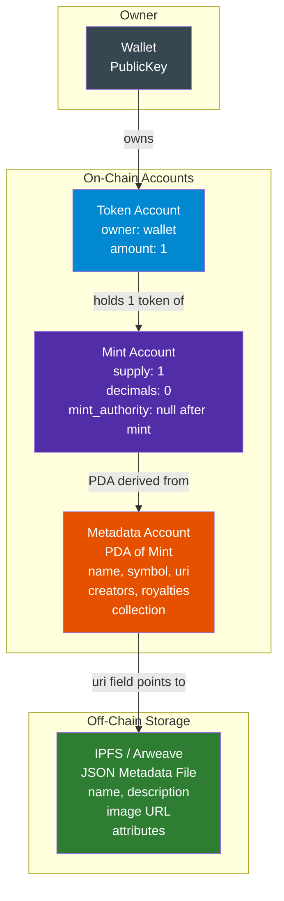
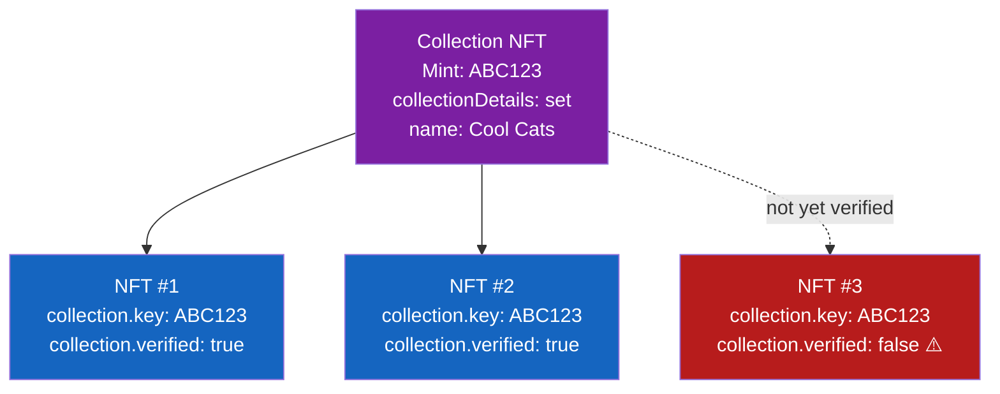
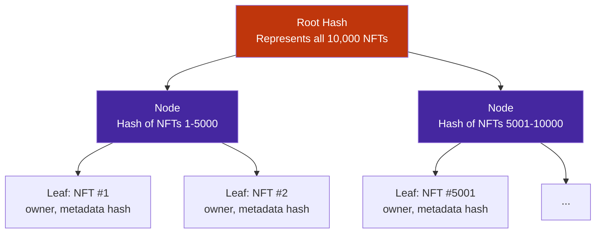
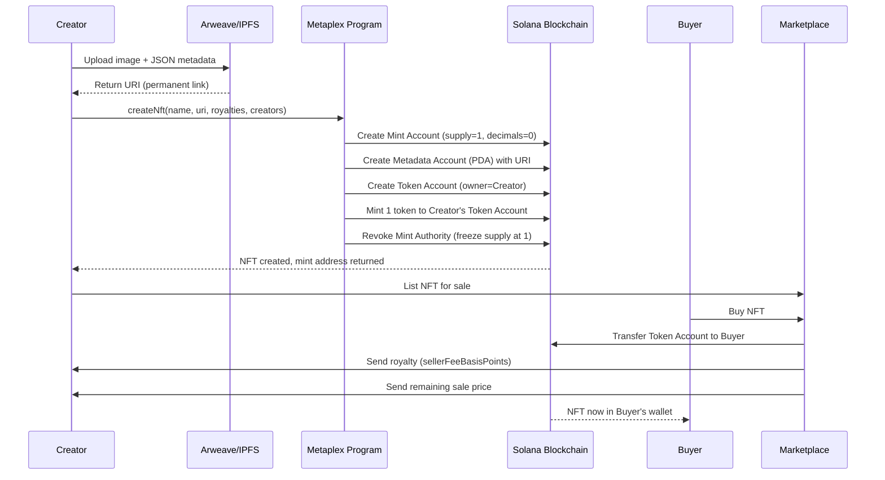

# NFTs on Solana — Metaplex Standard

> **Ye kiske liye hai:** Wo developers jo Solana accounts aur tokens samajh chuke hain, aur ab NFTs build, mint, ya trade karna chahte hain Solana pe. Pehle se NFT experience zaruri nahi hai.

---

## 🎨 NFT Hota Kya Hai?

Ek vinyl record socho. Album ki har copy same sound karti hai — fungible, ek doosre se replace ho sakti hai. Lekin agar duniya mein sirf ek hi signed copy ho, authenticity certificate ke saath attached? Wahi hai NFT. Non-Fungible Token. One-of-a-kind, provably rare, aur ownership on-chain record hoti hai.

Ethereum pe tumne ERC-721 ka naam suna hoga. Solana pe, NFTs **Metaplex standard** follow karte hain — ek set of programs aur conventions jise poori ecosystem ne agree kiya hai use karne ke liye. Agar tumhe Solana pe NFT collection launch karna hai, toh Metaplex hi use karoge. Full stop. Magic Eden, Tensor, har major Solana marketplace Metaplex accounts hi read karta hai.

---

## 🏗️ Solana NFTs Andar Se Kaise Kaam Karte Hain

### Analogy: Ek locker jispe label laga ho

Ek bank vault socho. Andar exactly ek coin hai (supply = 1). Coin mein cents nahi hote (decimals = 0). Vault ke darwaze pe ek laminated card chipka hai jispe NFT ka naam, image URL, aur ownership details likhi hain. Wahi laminated card hai **metadata account**.

Solana NFTs **SPL Token program** (wahi program jo fungible tokens handle karta hai) ke upar banaye jaate hain, ek special twist ke saath: mint aisi configure hoti hai ki sirf ek hi token kabhi exist kar sake.

### Teen accounts jo har Solana NFT banate hain

| Account | Kya hai | Kya store karta hai |
|---|---|---|
| **Mint Account** | Token ki definition | supply=1, decimals=0, mint authority |
| **Token Account** | Owner ka "wallet slot" is NFT ke liye | Balance (hamesha 1 agar owned hai) |
| **Metadata Account** | Mint se attached Metaplex PDA | Name, symbol, URI, creators, royalties, collection |



NFT mint hone ke baad, **mint authority ko null set kar diya jaata hai**. Iska matlab — koi bhi, creator bhi nahi, us mint se doosra token mint nahi kar sakta. Supply permanently 1 pe freeze ho jaati hai. Yahi cheez use non-fungible banati hai.

---

## 📋 Metaplex Protocol — Wo Standard Jo Sab Use Karte Hain

Metaplex traditional sense mein koi company nahi hai. Ye ek open-source protocol hai — Solana programs ka ek set — jo define karta hai ki Solana pe NFT dikhta kaisa hai. Do sabse important pieces hain:

1. **Token Metadata Program** — NFT metadata ko on-chain PDAs ke roop mein store karta hai
2. **Candy Machine** — NFT collections launch karne ke liye "vending machine"

### Metaplex kyun, khud ka standard kyun nahi?

Kyunki Solana pe har wallet, har marketplace, har indexer Metaplex accounts hi read karta hai. Agar tum apna custom NFT standard banaoge, koi tumhari art display nahi karega. Tumhe Magic Eden, Phantom, aur dusri dus teams ko convince karna padega apna custom format support karne ke liye. Metaplex ne wo kaam pehle hi kar diya hai.

---

## 📦 NFT Metadata Account Ka Structure

### Analogy: Ek passport

Passport wo insaan nahi hota, lekin usko describe karta hai. Usme naam, photo (image ka URI), nationality (collection), aur ek official stamp (verified creators) hota hai. Metadata account NFT ka passport hai.

Ye raha on-chain metadata account mein kya hota hai:

```
Metadata Account (PDA)
├── key                    // Account type discriminator
├── update_authority       // Kaun is metadata ko update kar sakta hai
├── mint                   // Associated mint account
├── name                   // "Cool Cat #4269" (max 32 chars)
├── symbol                 // "COOL" (max 10 chars)
├── uri                    // "https://arweave.net/..." (max 200 chars)
├── seller_fee_basis_points // 500 = 5% royalty
├── creators[]             // Creators ka array with share %
│   ├── address
│   ├── verified           // Sign karna zaruri hai verify karne ke liye
│   └── share              // Royalties ka %, sum 100 hona chahiye
├── collection             // Optional: parent collection NFT
│   ├── key                // Collection NFT ka mint address
│   └── verified           // true agar officially verified hai
├── uses                   // Optional: consumable NFTs
└── token_standard         // NonFungible, FungibleAsset, etc.
```

### sellerFeeBasisPoints — Royalties

Basis points ek percent ke hundredths hote hain. 100 basis points = 1%. Toh:
- 250 = 2.5%
- 500 = 5%
- 1000 = 10%

Jab NFT marketplace pe bikta hai, marketplace ko `sellerFeeBasisPoints / 10000 * sale_price` creators array ko bhejna "supposed to" hota hai. Ye "supposed to" wala word bahut heavy lifting kar raha hai — royalties wale section mein isko dobara dekhenge.

---

## 🌐 Off-Chain Metadata — Ye URI Field

### Analogy: Product pe laga QR code

Metadata account on-chain ek URI (URL) store karta hai. Wo URL ek JSON file ki taraf point karta hai jo off-chain IPFS ya Arweave pe stored hoti hai. Is JSON mein actual image URL, description, aur traits hote hain. Ye bilkul QR code jaisa hai — on-chain chhota, off-chain rich content.

**Image on-chain kyun nahi store karte?** Kyunki Solana pe 1MB image data store karna hazaaron SOL ka rent le lega. Hum minimal pointer on-chain rakhte hain aur rich content off-chain sasti jagah pe.

### Standard off-chain JSON (Metaplex standard):

```json
{
  "name": "Cool Cat #4269",
  "symbol": "COOL",
  "description": "A cool cat on the Solana blockchain",
  "seller_fee_basis_points": 500,
  "image": "https://arweave.net/abc123/image.png",
  "animation_url": "https://arweave.net/abc123/animation.mp4",
  "external_url": "https://coolcats.io",
  "attributes": [
    { "trait_type": "Background", "value": "Blue" },
    { "trait_type": "Eyes",       "value": "Laser" },
    { "trait_type": "Hat",        "value": "Crown" }
  ],
  "properties": {
    "files": [
      { "uri": "https://arweave.net/abc123/image.png", "type": "image/png" }
    ],
    "category": "image",
    "creators": [
      { "address": "AuthorWalletPubkey...", "share": 100 }
    ]
  }
}
```

### IPFS vs Arweave

| Feature | IPFS | Arweave |
|---|---|---|
| **Cost** | Free (par pinning service chahiye) | Ek baar pay karo, forever store hota hai |
| **Permanence** | Files disappear ho sakti hain agar unpin ho jaayein | Guaranteed permanent storage |
| **Speed** | Variable (peers pe depend karta hai) | Consistent, Arweave gateway ke through |
| **NFTs ke liye preferred** | Ab kam common | NFTs ke liye industry standard |
| **Service** | Pinata, NFT.Storage | Bundlr (ab Irys), Shadow Drive |

**Recommendation:** Production NFTs ke liye Arweave use karo. Files permanent rehti hain. Upfront ek baar pay karte ho. Testing ke liye IPFS bhi theek hai.

---

## 🗂️ NFT Collections — Parent aur Child NFTs

### Analogy: Ek book series

Harry Potter books socho. Har book unique hai (alag story, alag number). Lekin sab "Harry Potter" series ka part hain. Series khud ek publisher ke record se represent hota hai. Metaplex mein, **Collection NFT** wahi publisher ka record hai.

### Collections kaise kaam karte hain

1. Tum ek special NFT mint karte ho jise **Collection NFT** kehte hain (isme `collectionDetails` set hota hai, ye mark karte hue ki ye parent hai)
2. Tumhare collection ka har NFT ek `collection` field rakhta hai jo Collection NFT ke mint address ki taraf point karta hai
3. Kisi NFT ko collection ka part verify karne ke liye, **collection update authority** ko transaction sign karna padta hai — isse `collection.verified = true` ho jaata hai



**Verified kyun matter karta hai?** Magic Eden jaisi marketplaces NFTs ko verified collection membership se filter karti hain. Ek unverified NFT tumhare collection ki floor price mein nahi dikhega. Scammers tumhare collection ka mint address apne NFT ke `collection.key` mein daal sakte hain — lekin `verified = false` unko turant expose kar deta hai.

---

## 🍬 Candy Machine v3 — Apna Collection Launch Karo

### Analogy: Ek gumball machine

Tum ek gumball machine mein 10,000 gumballs bhar dete ho. Customers 25 cents dete hain aur ek random gumball paate hain. Unko pata nahi hota kaunsa color milega jab tak knob ghumaate nahi. Candy Machine bilkul yahi hai — tum 10,000 NFTs load karte ho, price set karte ho, aur users random (ya order mein) mint karte hain.

Candy Machine v3 (CM3) Metaplex ka solution hai bade NFT collections launch karne ke liye, in cheezon ke saath:
- **Guards** — minting ke liye configurable rules (price, dates, allowlists)
- **Groups** — alag mint phases (whitelist phase, public phase)
- **Bot protection** — built-in defenses

### Guards — Minting Ke Rules

Guards ek club ke bouncers jaise hain. Har guard mint allow karne se pehle ek condition check karta hai:

| Guard | Kya karta hai |
|---|---|
| `solPayment` | Mint karne ke liye SOL charge karta hai |
| `tokenPayment` | Mint karne ke liye SPL token charge karta hai |
| `startDate` | Is timestamp se pehle minting nahi |
| `endDate` | Is timestamp ke baad minting nahi |
| `allowList` | Sirf Merkle tree allowlist pe present wallets hi mint kar sakti hain |
| `mintLimit` | Har wallet sirf N baar mint kar sakti hai |
| `nftGate` | Mint karne ke liye ek specific NFT hold karna zaruri hai |
| `addressGate` | Sirf ek specific wallet mint kar sakti hai |
| `freezeSolPayment` | SOL escrow mein hold hota hai, freeze period ke baad release hota hai |
| `botTax` | Failed mints ka bhi thoda fee lagta hai (bots ko punish karne ke liye) |

### Groups — Phased Launches

Groups tumhe sequential ya parallel mint phases run karne dete hain. Ek common pattern:

```
Phase 1 (Whitelist): 
  - startDate: Day 1 9am
  - endDate:   Day 1 12pm
  - guards: [allowList, solPayment(2 SOL), mintLimit(2)]

Phase 2 (Public):
  - startDate: Day 1 12pm
  - guards: [solPayment(3 SOL), mintLimit(5)]
```

---

## 💻 Metaplex Umi Se NFT Banana (JavaScript)

### Umi Hai Kya?

Umi Metaplex ka modern JavaScript framework hai Solana ke saath interact karne ke liye. Isko ek adapter layer samjho — tum ek wallet plug in karte ho, ek connection, aur phir clean functions call karte ho jaise `createNft()`, raw transactions manually banane ki bajaye.

### Setup

```bash
npm install @metaplex-foundation/umi \
            @metaplex-foundation/umi-bundle-defaults \
            @metaplex-foundation/mpl-token-metadata \
            @metaplex-foundation/umi-uploader-irys
```

### Ek Single NFT Banana

```typescript
import { createUmi } from "@metaplex-foundation/umi-bundle-defaults";
import {
  mplTokenMetadata,
  createNft,
  fetchDigitalAsset,
} from "@metaplex-foundation/mpl-token-metadata";
import {
  keypairIdentity,
  generateSigner,
  percentAmount,
} from "@metaplex-foundation/umi";
import { irysUploader } from "@metaplex-foundation/umi-uploader-irys";

// 1. Devnet pe point karta hua ek Umi instance banao
const umi = createUmi("https://api.devnet.solana.com")
  .use(mplTokenMetadata())
  .use(irysUploader());

// 2. Apna wallet load karo (creator / payer)
const creatorKeypair = umi.eddsa.createKeypairFromSecretKey(
  new Uint8Array(JSON.parse(process.env.WALLET_SECRET_KEY!))
);
umi.use(keypairIdentity(creatorKeypair));

// 3. Off-chain metadata Arweave pe upload karo Irys ke through
const imageUri = await umi.uploader.uploadFile(
  // apni image ka File ya Buffer pass karo
  await fetch("./my-nft-image.png").then((r) => r.blob())
);

const metadataUri = await umi.uploader.uploadJson({
  name: "My First NFT",
  description: "Built with Metaplex Umi on Solana devnet",
  image: imageUri,
  attributes: [
    { trait_type: "Rarity", value: "Legendary" },
    { trait_type: "Color",  value: "Purple" },
  ],
  properties: {
    files: [{ uri: imageUri, type: "image/png" }],
    category: "image",
  },
});

// 4. Mint account banne ke liye naya keypair generate karo
const mint = generateSigner(umi);

// 5. On-chain NFT create karo
await createNft(umi, {
  mint,                              // naya mint keypair
  name: "My First NFT",
  uri: metadataUri,                  // Arweave JSON ki taraf point karta hai
  sellerFeeBasisPoints: percentAmount(5), // 5% royalty
  creators: [
    {
      address: umi.identity.publicKey,
      verified: true,
      share: 100,
    },
  ],
  isMutable: true,                   // future mein metadata update karne dega
}).sendAndConfirm(umi);

console.log("NFT Mint Address:", mint.publicKey);

// 6. Create hua NFT fetch aur verify karo
const asset = await fetchDigitalAsset(umi, mint.publicKey);
console.log("Name:", asset.metadata.name);
console.log("URI:", asset.metadata.uri);
```

### Ek NFT Collection Banana

```typescript
import {
  createNft,
  createCollectionNft,
  verifyCollectionV1,
  findMetadataPda,
} from "@metaplex-foundation/mpl-token-metadata";
import { generateSigner, percentAmount } from "@metaplex-foundation/umi";

// Step 1: Collection NFT (parent) banao
const collectionMint = generateSigner(umi);

await createCollectionNft(umi, {
  mint: collectionMint,
  name: "Cool Cats Collection",
  symbol: "COOL",
  uri: collectionMetadataUri,   // upar wale jaisa alag se upload karo
  sellerFeeBasisPoints: percentAmount(5),
  isCollection: true,           // ise collection parent mark karta hai
}).sendAndConfirm(umi);

// Step 2: Ek NFT banao jo collection ka part ho
const nftMint = generateSigner(umi);

await createNft(umi, {
  mint: nftMint,
  name: "Cool Cat #1",
  uri: nftMetadataUri,
  sellerFeeBasisPoints: percentAmount(5),
  collection: {
    key: collectionMint.publicKey,
    verified: false,             // abhi verify nahi hua
  },
}).sendAndConfirm(umi);

// Step 3: NFT ko collection ke part ke roop mein verify karo
//         (collection update authority ko sign karna padega)
await verifyCollectionV1(umi, {
  metadata: findMetadataPda(umi, { mint: nftMint.publicKey }),
  collectionMint: collectionMint.publicKey,
  authority: umi.identity,      // collection update authority hona chahiye
}).sendAndConfirm(umi);

console.log("NFT verified as part of collection!");
```

---

## 💰 NFT Royalties — Ye Chalti Rehne Wali Bahas

### Analogy: Musician ki streaming royalty

Jab ek musician gaana bechta hai, usko ek baar payment milti hai. Lekin streaming platforms har baar play hone pe usko pay karte hain. NFT royalties bhi kuch aisa hi kaam karti hain — creators ko har baar jab NFT resell hoti hai marketplace pe, ek percentage milta hai.

`sellerFeeBasisPoints` field intended royalty set karta hai. Lekin catch ye hai: **Solana pe royalties protocol level pe enforce nahi hoti**. Ye marketplace convention se enforce hoti hain. Agar koi marketplace royalty pay karne ka skip kar de, creator use rok nahi sakta.

### Royalty wars

2022-2023 mein, Solana pe zero-royalty marketplaces launch hui. Bahut se creators ne apni royalty income dramatically girte dekhi. Metaplex ne isका jawab diya **Programmable NFTs (pNFTs)** se — ek naya token standard jo transfer hooks mein rules enforce kar sakta hai. Lekin adoption uneven raha hai.

| Standard | Royalty Enforcement | Flexibility | Adoption |
|---|---|---|---|
| Original NFT | None (marketplace ki marzi) | High | Widespread |
| pNFT | Programmable, enforce kar sakta hai | Kam (transfers zyada complex) | Partial |
| cNFT | None | Sabse sasta option | Growing |

---

## 🌿 Compressed NFTs (cNFTs) — Masses Ke Liye NFTs

### Analogy: Library catalog vs filing cabinet

Traditional NFTs filing cabinets jaise hain — har NFT ka apna full folder aur apni space hoti hai. Compressed NFTs library catalog jaise hain — actual content ek compact ledger mein store hota hai, aur tum ek receipt (proof) use karte ho ye prove karne ke liye ki tumhari entry catalog mein hai.

cNFTs **state compression** use karte hain — specifically ek **Concurrent Merkle Tree** — lakhon NFT records ko ek single on-chain account mein store karne ke liye, jisse cost 1000x ya usse zyada kam ho jaati hai.

### Math khud bol raha hai

| NFT Type | 10,000 NFTs Mint Karne Ki Cost |
|---|---|
| Traditional NFT | ~200 SOL |
| Compressed NFT (cNFT) | ~0.2 SOL |

Ye 1000x cost reduction hai.

### Concurrent Merkle Trees Kaise Kaam Karte Hain (Simply)



Har NFT ka apna alag on-chain account hone ki bajaye, sirf Merkle tree ka **root hash** on-chain rehta hai. Har NFT tree mein ek **leaf** hota hai. Tumhare paas NFT hai ye prove karne ke liye, tum ek **proof path** deni padti hai — apne leaf se root tak sibling hashes ki ek list.

### Umi Se cNFTs Banana

```typescript
import {
  createTree,
  mintV1,
  mplBubblegum,
} from "@metaplex-foundation/mpl-bubblegum";
import {
  generateSigner,
  none,
  publicKey,
} from "@metaplex-foundation/umi";
import { createUmi } from "@metaplex-foundation/umi-bundle-defaults";

const umi = createUmi("https://api.devnet.solana.com")
  .use(mplBubblegum()); // Bubblegum hi cNFTs ke liye Metaplex program hai

// Step 1: Merkle tree banao (storage capacity ke liye ek baar pay karo)
const merkleTree = generateSigner(umi);

await createTree(umi, {
  merkleTree,
  maxDepth: 14,         // 2^14 = 16,384 leaves (NFTs)
  maxBufferSize: 64,    // concurrent changes support hoti hain
  canopyDepth: 10,      // cached proof nodes (tx size kam karta hai)
}).sendAndConfirm(umi);

// Step 2: Tree mein ek compressed NFT mint karo
await mintV1(umi, {
  leafOwner: umi.identity.publicKey,
  merkleTree: merkleTree.publicKey,
  metadata: {
    name: "Compressed Cat #1",
    uri: "https://arweave.net/your-metadata-uri",
    sellerFeeBasisPoints: 500,
    collection: none(),
    creators: [
      {
        address: umi.identity.publicKey,
        verified: true,
        share: 100,
      },
    ],
  },
}).sendAndConfirm(umi);

console.log("cNFT minted into tree:", merkleTree.publicKey);
```

### Merkle Tree Sizing Guide

| maxDepth | Max NFTs | Canopy Depth | Approx. Tree Cost |
|---|---|---|---|
| 14 | 16,384 | 10 | ~0.5 SOL |
| 20 | 1,048,576 | 14 | ~1.5 SOL |
| 24 | 16,777,216 | 17 | ~6 SOL |

**canopyDepth** proof ka kuch part on-chain cache kar leta hai, jisse transfer transactions chhoti aur sasti ho jaati hain. Zyada canopy = chhoti proofs = sasti transfers, lekin tree khud upfront zyada mehnga padta hai.

### cNFTs Kab Use Karein vs Regular NFTs

| Use Case | Regular NFT | cNFT |
|---|---|---|
| 1-of-1 art | Best | Overkill |
| 10,000 PFP collection | Viable | Strongly preferred |
| 1M+ game items | Impractical | Sirf yahi viable option hai |
| Complex royalty rules chahiye | pNFT | Abhi support nahi |
| DeFi composability (lending) | Kaam karta hai | Limited support |
| Millions users ko airdrop | Impossible cost | Isi ke liye purpose-built hai |

---

## 🏪 Marketplaces — Magic Eden Aur Ecosystem

### Magic Eden

Magic Eden Solana ki dominant NFT marketplace hai. Jab tum collection launch karte ho, zyada volume Magic Eden se hi aata hai. Ye important cheezein jaan lo:

- Magic Eden Metaplex metadata accounts ko automatically index karta hai
- Collections ko listing ke liye submit karna padta hai, verified collection NFT ke saath
- Magic Eden ka apna royalty enforcement mechanism hai (opted-in collections ke liye royalties honor karte hain)
- Ethereum, Polygon, aur Bitcoin tak expand ho gaye hain — lekin Solana core hi rehta hai

### Doosri marketplaces

| Marketplace | Specialty |
|---|---|
| **Magic Eden** | Sabse zyada volume, PFP collections |
| **Tensor** | Power users, advanced trading, cNFT support |
| **Exchange.Art** | 1-of-1 fine art |
| **Formfunction** | Open editions, generative art |

---

## 🔄 Full NFT Lifecycle Diagram



---

## ✅ Kab Use Karein / Kab Na Karein

### Traditional NFTs (mpl-token-metadata) Kab Use Karein
- 1-of-1 art ya chhote limited editions banate waqt
- DeFi integrations banate waqt (NFT lending, staking)
- Maximum wallet/marketplace compatibility chahiye
- Kisi bhi collection ka "parent" collection NFT banate waqt

### Candy Machine Kab Use Karein
- 1,000+ NFTs ka collection launch karte waqt, public mint ke saath
- Whitelist phases, time-gated minting chahiye
- Bot protection built-in chahiye
- Generative art drops randomized reveals ke saath

### Compressed NFTs (Bubblegum) Kab Use Karein
- Collection size > 10,000
- Bahut users ko airdrops
- Gaming items, loyalty points at scale
- Budget hard constraint hai

### Solana NFTs Bilkul Use Na Karein Jab
- Tumhe natively cross-chain NFTs chahiye (kuch use cases ke liye Ethereum ka tooling wider hai)
- Tumhare use case ko decentralized ownership proofs se koi fayda nahi hota
- Tumhe aisi features chahiye jo abhi support nahi hain (jaise pNFTs ke bina complex on-chain royalty logic)

---

## 🧩 Key Takeaways

1. **Solana pe NFT bas ek mint account hai jiska supply=1 aur decimals=0 hai** — magic constraints mein aur attached Metaplex metadata account mein hai.

2. **Metadata account ek PDA hai** jo mint address se derive hota hai, Metaplex Token Metadata program se create hota hai. Ye name, symbol, URI, creators, royalties, aur collection info store karta hai.

3. **URI off-chain JSON ki taraf point karta hai** (Arweave ya IPFS pe stored) jisme image URL aur traits hote hain. Production ke liye Arweave preferred hai kyunki files permanent rehti hain.

4. **Collections ek parent Collection NFT use karte hain** aur child NFTs `collection.verified = true` field ke saath. Verification ke liye collection update authority ko sign karna padta hai — isse scammers collection membership fake nahi kar paate.

5. **Candy Machine collection launches ke liye go-to tool hai** — phased minting, allowlists, pricing, aur bot protection ek modular guard system se handle karta hai.

6. **Royalties by default protocol-enforced nahi hoti** — ye marketplace cooperation pe depend karti hain. pNFTs programmable enforcement add karte hain, compressed NFTs mein royalty support limited hai.

7. **Compressed NFTs minting costs ko 1000x kam karte hain** Concurrent Merkle Trees use karke. 100,000 se zyada items wale collections ke liye ye hi practical option hain. Transfers ke liye proof paths chahiye, jo Helius jaise indexers tumhare liye manage karte hain.

8. **Modern JavaScript development ke liye Metaplex Umi use karo**. Ye low-level account building ko clean, composable function calls mein abstract kar deta hai.

9. **Magic Eden primary marketplace hai** — tumhare collection ki visibility depend karti hai ek verified collection NFT hone pe jise marketplaces index kar sakein.

10. **Ecosystem standardized hai** — Metaplex ki dominance ka matlab hai tumhe wallet support, marketplace support, aur tooling free mein milti hai bas standard follow karke. Isse fight mat karo.

---

## 📚 Further Reading

- [Metaplex Docs](https://developers.metaplex.com)
- [Umi Framework Guide](https://github.com/metaplex-foundation/umi)
- [Bubblegum (cNFT) Docs](https://developers.metaplex.com/bubblegum)
- [Candy Machine v3 Docs](https://developers.metaplex.com/candy-machine)
- [Helius cNFT Indexer](https://docs.helius.dev/compression-and-das-api/digital-asset-standard-api)
- [Magic Eden Developer Docs](https://docs.magiceden.io)

---

*Chapter 7 of Solana Developer Notes | Next: Chapter 8 — DeFi on Solana (AMMs, Lending, Perpetuals)*
