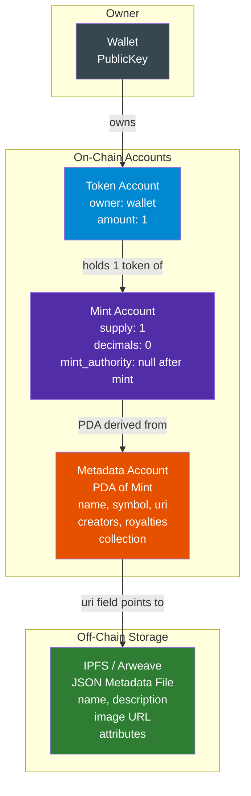
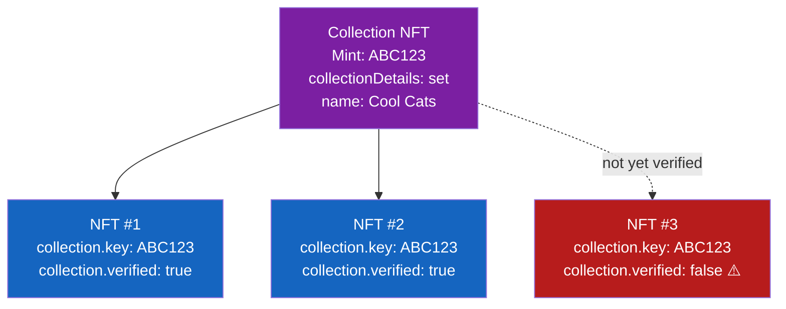
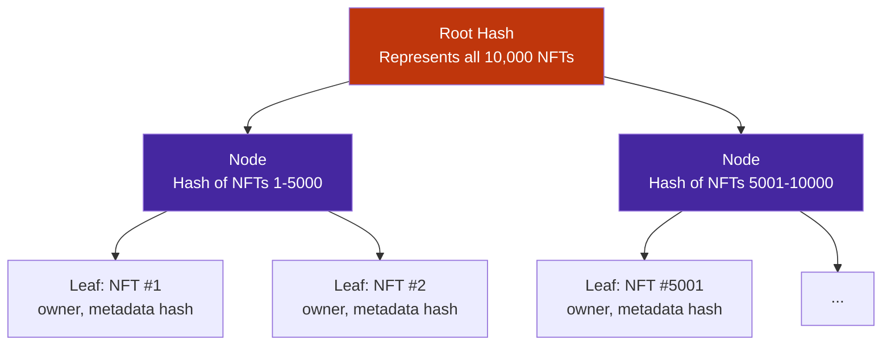
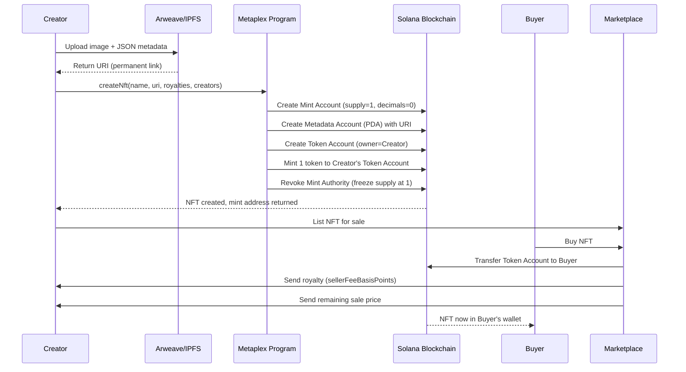

# NFTs on Solana — Metaplex Standard

> **Who this is for:** Developers who understand Solana accounts and tokens and now want to build, mint, or trade NFTs on Solana. No NFT experience needed.

---

## 🎨 What Even Is an NFT?

Think of a vinyl record. Every copy of an album sounds the same — fungible, interchangeable. But what if there was only one signed copy in the world, with a certificate of authenticity attached? That is an NFT. Non-Fungible Token. One-of-a-kind, provably scarce, and ownership recorded on-chain.

On Ethereum you hear about ERC-721. On Solana, NFTs follow the **Metaplex standard** — a set of programs and conventions the entire ecosystem agreed to use. If you want to launch an NFT collection on Solana, you will use Metaplex. Full stop. Magic Eden, Tensor, every major Solana marketplace reads Metaplex accounts.

---

## 🏗️ How Solana NFTs Work Under the Hood

### Analogy: A safety deposit box with a label

Imagine a bank vault. Inside is exactly one coin (supply = 1). The coin has no cents (decimals = 0). Glued to the vault door is a laminated card with the NFT's name, image URL, and ownership details. That laminated card is the **metadata account**.

Solana NFTs are built on top of the **SPL Token program** (the same program that handles fungible tokens), with one special twist: the mint is configured so only one token can ever exist.

### The three accounts that make every Solana NFT

| Account | What it is | Stores |
|---|---|---|
| **Mint Account** | The token's definition | supply=1, decimals=0, mint authority |
| **Token Account** | The owner's "wallet slot" for this NFT | Balance (always 1 if owned) |
| **Metadata Account** | Metaplex PDA attached to the mint | Name, symbol, URI, creators, royalties, collection |



After the NFT is minted, the **mint authority is set to null**. This means nobody — not even the creator — can mint a second token from that mint. Supply is permanently frozen at 1. That is what makes it non-fungible.

---

## 📋 Metaplex Protocol — The Standard Everyone Uses

Metaplex is not a company in the traditional sense. It is an open-source protocol — a set of Solana programs — that define what an NFT looks like on Solana. The two most important pieces are:

1. **Token Metadata Program** — stores NFT metadata on-chain as PDAs
2. **Candy Machine** — the "vending machine" for launching NFT collections

### Why Metaplex and not roll-your-own?

Because every wallet, every marketplace, every indexer on Solana reads Metaplex accounts. If you build a custom NFT standard, no one will display your art. You would have to convince Magic Eden, Phantom, and dozens of other teams to support your custom format. Metaplex already did that work.

---

## 📦 NFT Metadata Account Structure

### Analogy: A passport

A passport is not the person, but it describes them. It has their name, photo (URI to image), nationality (collection), and an official stamp (verified creators). The Metadata account is the NFT's passport.

Here is what the on-chain metadata account holds:

```
Metadata Account (PDA)
├── key                    // Account type discriminator
├── update_authority       // Who can update this metadata
├── mint                   // The associated mint account
├── name                   // "Cool Cat #4269" (max 32 chars)
├── symbol                 // "COOL" (max 10 chars)
├── uri                    // "https://arweave.net/..." (max 200 chars)
├── seller_fee_basis_points // 500 = 5% royalty
├── creators[]             // Array of creators with share %
│   ├── address
│   ├── verified           // Must sign to verify
│   └── share              // % of royalties, sum must = 100
├── collection             // Optional: parent collection NFT
│   ├── key                // Mint address of collection NFT
│   └── verified           // true if officially verified
├── uses                   // Optional: consumable NFTs
└── token_standard         // NonFungible, FungibleAsset, etc.
```

### sellerFeeBasisPoints — Royalties

Basis points are hundredths of a percent. 100 basis points = 1%. So:
- 250 = 2.5%
- 500 = 5%
- 1000 = 10%

When an NFT sells on a marketplace, the marketplace is supposed to send `sellerFeeBasisPoints / 10000 * sale_price` to the creators array. The word "supposed to" is doing heavy lifting here — we will revisit this in the royalties section.

---

## 🌐 Off-Chain Metadata — The URI Field

### Analogy: A QR code on a product

The metadata account on-chain stores a URI (a URL). That URL points to a JSON file stored off-chain on IPFS or Arweave. This JSON contains the actual image URL, description, and traits. It is like a QR code — small on-chain, rich content off-chain.

**Why not store image on-chain?** Because storing 1MB of image data on Solana would cost thousands of SOL in rent. We store the minimal pointer on-chain and the rich content cheaply off-chain.

### Standard off-chain JSON (Metaplex standard):

```json
{
  "name": "Cool Cat #4269",
  "symbol": "COOL",
  "description": "A cool cat on the Solana blockchain",
  "seller_fee_basis_points": 500,
  "image": "https://arweave.net/abc123/image.png",
  "animation_url": "https://arweave.net/abc123/animation.mp4",
  "external_url": "https://coolcats.io",
  "attributes": [
    { "trait_type": "Background", "value": "Blue" },
    { "trait_type": "Eyes",       "value": "Laser" },
    { "trait_type": "Hat",        "value": "Crown" }
  ],
  "properties": {
    "files": [
      { "uri": "https://arweave.net/abc123/image.png", "type": "image/png" }
    ],
    "category": "image",
    "creators": [
      { "address": "AuthorWalletPubkey...", "share": 100 }
    ]
  }
}
```

### IPFS vs Arweave

| Feature | IPFS | Arweave |
|---|---|---|
| **Cost** | Free (but needs pinning service) | Pay once, stored forever |
| **Permanence** | Files can disappear if unpinned | Guaranteed permanent storage |
| **Speed** | Variable (depends on peers) | Consistent via Arweave gateway |
| **Preferred for NFTs** | Less common now | Industry standard for NFTs |
| **Service** | Pinata, NFT.Storage | Bundlr (now Irys), Shadow Drive |

**Recommendation:** Use Arweave for production NFTs. Files are permanent. You pay once upfront. IPFS is fine for testing.

---

## 🗂️ NFT Collections — Parent and Child NFTs

### Analogy: A book series

Imagine Harry Potter books. Each book is unique (different story, different number). But they all belong to the "Harry Potter" series. The series itself is represented by a publisher's record. In Metaplex, a **Collection NFT** is that publisher's record.

### How collections work

1. You mint a special NFT called the **Collection NFT** (it has `collectionDetails` set, marking it as a parent)
2. Each NFT in your collection has a `collection` field pointing to the Collection NFT's mint address
3. To verify an NFT as part of a collection, the **collection update authority** must sign a transaction — this sets `collection.verified = true`



**Why does verified matter?** Marketplaces like Magic Eden filter NFTs by verified collection membership. An unverified NFT will not appear in your collection's floor price. Scammers could add your collection's mint address to their NFT's `collection.key` — but `verified = false` exposes them immediately.

---

## 🍬 Candy Machine v3 — Launch Your Collection

### Analogy: A gumball machine

You load a gumball machine with 10,000 gumballs. Customers pay 25 cents and get a random gumball. They do not know which color they will get until they turn the knob. Candy Machine is exactly this — you load 10,000 NFTs, set a price, and users mint randomly (or in order).

Candy Machine v3 (CM3) is Metaplex's solution for launching large NFT collections with:
- **Guards** — configurable rules for minting (price, dates, allowlists)
- **Groups** — different mint phases (whitelist phase, public phase)
- **Bot protection** — built-in defenses

### Guards — Rules for Minting

Guards are like bouncers at a club. Each guard checks one condition before allowing a mint:

| Guard | What it does |
|---|---|
| `solPayment` | Charge SOL to mint |
| `tokenPayment` | Charge SPL token to mint |
| `startDate` | No minting before this timestamp |
| `endDate` | No minting after this timestamp |
| `allowList` | Only wallets on a Merkle tree allowlist can mint |
| `mintLimit` | Each wallet can only mint N times |
| `nftGate` | Must hold a specific NFT to mint |
| `addressGate` | Only one specific wallet can mint |
| `freezeSolPayment` | SOL held in escrow, released after freeze period |
| `botTax` | Failed mints still cost a small fee (punishes bots) |

### Groups — Phased Launches

Groups let you run sequential or parallel mint phases. A common pattern:

```
Phase 1 (Whitelist): 
  - startDate: Day 1 9am
  - endDate:   Day 1 12pm
  - guards: [allowList, solPayment(2 SOL), mintLimit(2)]

Phase 2 (Public):
  - startDate: Day 1 12pm
  - guards: [solPayment(3 SOL), mintLimit(5)]
```

---

## 💻 Creating an NFT with Metaplex Umi (JavaScript)

### What is Umi?

Umi is Metaplex's modern JavaScript framework for interacting with Solana. Think of it as an adapter layer — you plug in a wallet, a connection, and then call clean functions like `createNft()` instead of manually building raw transactions.

### Setup

```bash
npm install @metaplex-foundation/umi \
            @metaplex-foundation/umi-bundle-defaults \
            @metaplex-foundation/mpl-token-metadata \
            @metaplex-foundation/umi-uploader-irys
```

### Creating a Single NFT

```typescript
import { createUmi } from "@metaplex-foundation/umi-bundle-defaults";
import {
  mplTokenMetadata,
  createNft,
  fetchDigitalAsset,
} from "@metaplex-foundation/mpl-token-metadata";
import {
  keypairIdentity,
  generateSigner,
  percentAmount,
} from "@metaplex-foundation/umi";
import { irysUploader } from "@metaplex-foundation/umi-uploader-irys";

// 1. Create a Umi instance pointed at devnet
const umi = createUmi("https://api.devnet.solana.com")
  .use(mplTokenMetadata())
  .use(irysUploader());

// 2. Load your wallet (the creator / payer)
const creatorKeypair = umi.eddsa.createKeypairFromSecretKey(
  new Uint8Array(JSON.parse(process.env.WALLET_SECRET_KEY!))
);
umi.use(keypairIdentity(creatorKeypair));

// 3. Upload off-chain metadata to Arweave via Irys
const imageUri = await umi.uploader.uploadFile(
  // pass a File or Buffer of your image
  await fetch("./my-nft-image.png").then((r) => r.blob())
);

const metadataUri = await umi.uploader.uploadJson({
  name: "My First NFT",
  description: "Built with Metaplex Umi on Solana devnet",
  image: imageUri,
  attributes: [
    { trait_type: "Rarity", value: "Legendary" },
    { trait_type: "Color",  value: "Purple" },
  ],
  properties: {
    files: [{ uri: imageUri, type: "image/png" }],
    category: "image",
  },
});

// 4. Generate a new keypair to be the mint account
const mint = generateSigner(umi);

// 5. Create the NFT on-chain
await createNft(umi, {
  mint,                              // new mint keypair
  name: "My First NFT",
  uri: metadataUri,                  // points to Arweave JSON
  sellerFeeBasisPoints: percentAmount(5), // 5% royalty
  creators: [
    {
      address: umi.identity.publicKey,
      verified: true,
      share: 100,
    },
  ],
  isMutable: true,                   // allow future metadata updates
}).sendAndConfirm(umi);

console.log("NFT Mint Address:", mint.publicKey);

// 6. Fetch and verify the created NFT
const asset = await fetchDigitalAsset(umi, mint.publicKey);
console.log("Name:", asset.metadata.name);
console.log("URI:", asset.metadata.uri);
```

### Creating an NFT Collection

```typescript
import {
  createNft,
  createCollectionNft,
  verifyCollectionV1,
  findMetadataPda,
} from "@metaplex-foundation/mpl-token-metadata";
import { generateSigner, percentAmount } from "@metaplex-foundation/umi";

// Step 1: Create the Collection NFT (the parent)
const collectionMint = generateSigner(umi);

await createCollectionNft(umi, {
  mint: collectionMint,
  name: "Cool Cats Collection",
  symbol: "COOL",
  uri: collectionMetadataUri,   // upload separately like above
  sellerFeeBasisPoints: percentAmount(5),
  isCollection: true,           // marks this as a collection parent
}).sendAndConfirm(umi);

// Step 2: Create an NFT that belongs to the collection
const nftMint = generateSigner(umi);

await createNft(umi, {
  mint: nftMint,
  name: "Cool Cat #1",
  uri: nftMetadataUri,
  sellerFeeBasisPoints: percentAmount(5),
  collection: {
    key: collectionMint.publicKey,
    verified: false,             // not verified yet
  },
}).sendAndConfirm(umi);

// Step 3: Verify the NFT as part of the collection
//         (collection update authority must sign)
await verifyCollectionV1(umi, {
  metadata: findMetadataPda(umi, { mint: nftMint.publicKey }),
  collectionMint: collectionMint.publicKey,
  authority: umi.identity,      // must be collection update authority
}).sendAndConfirm(umi);

console.log("NFT verified as part of collection!");
```

---

## 💰 NFT Royalties — The Ongoing Debate

### Analogy: A musician's streaming royalty

When a musician sells a song, they get paid once. But streaming platforms pay them every time someone plays it. NFT royalties work similarly — creators receive a percentage every time the NFT resells on a marketplace.

The `sellerFeeBasisPoints` field sets the intended royalty. But here is the catch: **royalties on Solana are not enforced at the protocol level**. They are enforced by marketplace convention. If a marketplace chooses to skip paying royalties, the creator cannot stop them.

### The royalty wars

In 2022-2023, zero-royalty marketplaces launched on Solana. Many creators saw royalty income drop dramatically. Metaplex responded with **Programmable NFTs (pNFTs)** — a new token standard that can enforce rules in transfer hooks. But adoption has been uneven.

| Standard | Royalty Enforcement | Flexibility | Adoption |
|---|---|---|---|
| Original NFT | None (marketplace voluntary) | High | Widespread |
| pNFT | Programmable, can enforce | Lower (more complex transfers) | Partial |
| cNFT | None | Cheapest option | Growing |

---

## 🌿 Compressed NFTs (cNFTs) — NFTs for the Masses

### Analogy: A library catalog vs. a filing cabinet

Traditional NFTs are like filing cabinets — each NFT is a full folder with its own space. Compressed NFTs are like a library catalog — the actual content is stored in a compact ledger, and you use a receipt (proof) to prove your entry is in the catalog.

cNFTs use **state compression** — specifically a **Concurrent Merkle Tree** — to store millions of NFT records in a single on-chain account, reducing costs by 1000x or more.

### The math speaks for itself

| NFT Type | Cost to mint 10,000 NFTs |
|---|---|
| Traditional NFT | ~200 SOL |
| Compressed NFT (cNFT) | ~0.2 SOL |

That is a 1000x cost reduction.

### How Concurrent Merkle Trees work (simply)



Instead of each NFT being its own on-chain account, only the **root hash** of the Merkle tree lives on-chain. Each NFT is a **leaf** in the tree. To prove you own an NFT, you provide a **proof path** — a list of sibling hashes from your leaf up to the root.

### Creating cNFTs with Umi

```typescript
import {
  createTree,
  mintV1,
  mplBubblegum,
} from "@metaplex-foundation/mpl-bubblegum";
import {
  generateSigner,
  none,
  publicKey,
} from "@metaplex-foundation/umi";
import { createUmi } from "@metaplex-foundation/umi-bundle-defaults";

const umi = createUmi("https://api.devnet.solana.com")
  .use(mplBubblegum()); // Bubblegum is the Metaplex program for cNFTs

// Step 1: Create the Merkle tree (pay once for storage capacity)
const merkleTree = generateSigner(umi);

await createTree(umi, {
  merkleTree,
  maxDepth: 14,         // 2^14 = 16,384 leaves (NFTs)
  maxBufferSize: 64,    // concurrent changes supported
  canopyDepth: 10,      // cached proof nodes (reduces tx size)
}).sendAndConfirm(umi);

// Step 2: Mint a compressed NFT into the tree
await mintV1(umi, {
  leafOwner: umi.identity.publicKey,
  merkleTree: merkleTree.publicKey,
  metadata: {
    name: "Compressed Cat #1",
    uri: "https://arweave.net/your-metadata-uri",
    sellerFeeBasisPoints: 500,
    collection: none(),
    creators: [
      {
        address: umi.identity.publicKey,
        verified: true,
        share: 100,
      },
    ],
  },
}).sendAndConfirm(umi);

console.log("cNFT minted into tree:", merkleTree.publicKey);
```

### Merkle Tree sizing guide

| maxDepth | Max NFTs | Canopy Depth | Approx. Tree Cost |
|---|---|---|---|
| 14 | 16,384 | 10 | ~0.5 SOL |
| 20 | 1,048,576 | 14 | ~1.5 SOL |
| 24 | 16,777,216 | 17 | ~6 SOL |

**canopyDepth** caches part of the proof on-chain, making transfer transactions smaller and cheaper. Higher canopy = smaller proofs = cheaper transfers, but the tree itself costs more upfront.

### When to use cNFTs vs regular NFTs

| Use Case | Regular NFT | cNFT |
|---|---|---|
| 1-of-1 art | Best | Overkill |
| 10,000 PFP collection | Viable | Strongly preferred |
| 1M+ game items | Impractical | Only viable option |
| Need complex royalty rules | pNFT | Not supported yet |
| DeFi composability (lending) | Works | Limited support |
| Airdrop to millions of users | Impossible cost | Purpose-built for this |

---

## 🏪 Marketplaces — Magic Eden and the Ecosystem

### Magic Eden

Magic Eden is the dominant NFT marketplace on Solana. When you launch a collection, Magic Eden is where most volume flows. Key things to know:

- Magic Eden indexes Metaplex metadata accounts automatically
- Collections need to be submitted for listing with a verified collection NFT
- Magic Eden has its own royalty enforcement mechanism (they honor royalties for opted-in collections)
- They expanded to Ethereum, Polygon, and Bitcoin — but Solana remains the core

### Other marketplaces

| Marketplace | Specialty |
|---|---|
| **Magic Eden** | Largest volume, PFP collections |
| **Tensor** | Power users, advanced trading, cNFT support |
| **Exchange.Art** | 1-of-1 fine art |
| **Formfunction** | Open editions, generative art |

---

## 🔄 Full NFT Lifecycle Diagram



---

## ✅ When to Use / When NOT to Use

### When to use traditional NFTs (mpl-token-metadata)
- Creating 1-of-1 art or small limited editions
- Building DeFi integrations (NFT lending, staking)
- Need maximum wallet/marketplace compatibility
- Creating the "parent" collection NFT for any collection

### When to use Candy Machine
- Launching a collection of 1,000+ NFTs with public mint
- Need whitelist phases, time-gated minting
- Want bot protection built-in
- Generative art drops with randomized reveals

### When to use compressed NFTs (Bubblegum)
- Collection size > 10,000
- Airdrops to many users
- Gaming items, loyalty points at scale
- Budget is a hard constraint

### When NOT to use Solana NFTs at all
- You need cross-chain NFTs natively (Ethereum has wider tooling for some use cases)
- Your use case does not benefit from decentralized ownership proofs
- You need features not yet supported (e.g., complex on-chain royalty logic without pNFTs)

---

## 🧩 Key Takeaways

1. **An NFT on Solana is just a mint account with supply=1 and decimals=0** — the magic is in the constraints and the attached Metaplex metadata account.

2. **The metadata account is a PDA** derived from the mint address, created by the Metaplex Token Metadata program. It stores name, symbol, URI, creators, royalties, and collection info.

3. **The URI points to off-chain JSON** (stored on Arweave or IPFS) containing the image URL and traits. Arweave is preferred for production because files are permanent.

4. **Collections use a parent Collection NFT** and child NFTs with a `collection.verified = true` field. Verification requires the collection update authority to sign — this prevents scammers from faking collection membership.

5. **Candy Machine is the go-to tool for collection launches** — it handles phased minting, allowlists, pricing, and bot protection through a modular guard system.

6. **Royalties are not protocol-enforced by default** — they rely on marketplace cooperation. pNFTs add programmable enforcement, compressed NFTs have limited royalty support.

7. **Compressed NFTs cut minting costs by 1000x** using Concurrent Merkle Trees. They are the only practical option for collections above 100,000 items. Transfers require proof paths, which indexers like Helius manage for you.

8. **Use Metaplex Umi** for modern JavaScript development. It abstracts the low-level account building into clean, composable function calls.

9. **Magic Eden is the primary marketplace** — your collection's visibility depends on having a verified collection NFT that marketplaces can index.

10. **The ecosystem is standardized** — Metaplex's dominance means you get wallet support, marketplace support, and tooling for free by following the standard. Do not fight it.

---

## 📚 Further Reading

- [Metaplex Docs](https://developers.metaplex.com)
- [Umi Framework Guide](https://github.com/metaplex-foundation/umi)
- [Bubblegum (cNFT) Docs](https://developers.metaplex.com/bubblegum)
- [Candy Machine v3 Docs](https://developers.metaplex.com/candy-machine)
- [Helius cNFT Indexer](https://docs.helius.dev/compression-and-das-api/digital-asset-standard-api)
- [Magic Eden Developer Docs](https://docs.magiceden.io)

---

*Chapter 7 of Solana Developer Notes | Next: Chapter 8 — DeFi on Solana (AMMs, Lending, Perpetuals)*
