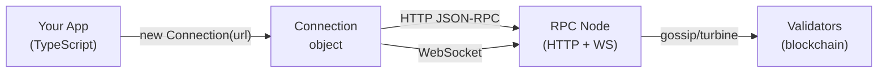
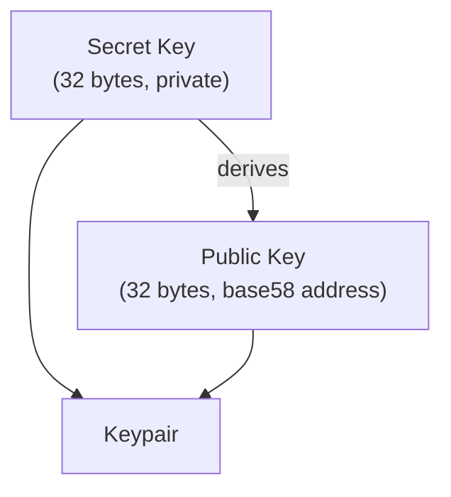
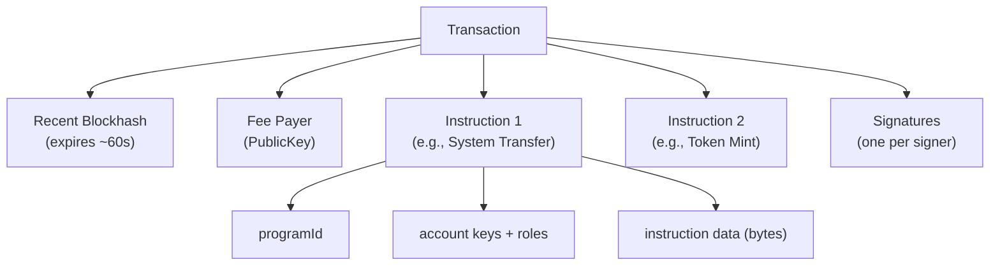
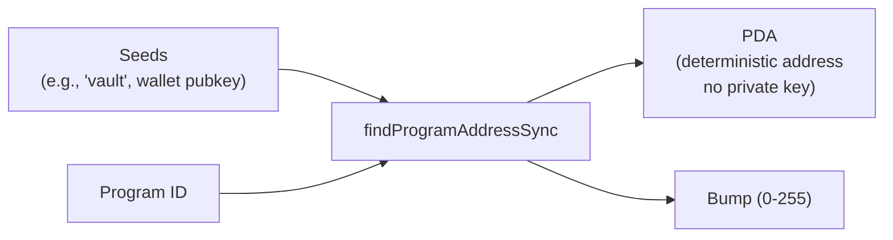
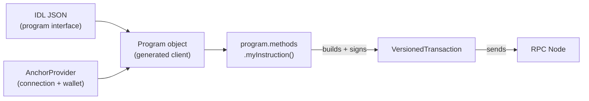

# Chapter 8: Solana Client Development — @solana/web3.js

> "Blockchain ek bank ka vault hai. `@solana/web3.js` uski chaabi, teller, aur security camera — teeno ek saath hai."

---

## 🗺️ Is Chapter Mein Kya Milega

Is chapter ke end tak tum ye sab kar paoge:

- Apne JavaScript/TypeScript app ko kisi bhi Solana cluster se connect karna
- Keypairs aur public keys generate + manage karna
- Transactions build, sign, aur send karna
- On-chain data (accounts, tokens, programs) read karna
- WebSocket ke through live account changes subscribe karna
- Program Derived Addresses (PDAs) derive karna
- Anchor programs ko frontend se IDL ke through call karna
- Phantom wallet ko `@solana/wallet-adapter-react` se integrate karna

Sab kuch TypeScript mein hai. Har snippet copy-paste ready hai.

---

## 🔌 Connection — Network Se Baat Karna

**Real-world analogy:** Tumhara app ek customer hai. Solana network ek bank hai. `Connection` us phone line jaisa hai jo tumhe bank ke call centre se jodta hai. Kuch bhi poochne se pehle, pehle dial karna padega.



### Cluster Endpoints

**Kya hota hai?** Solana ke alag-alag "environments" hote hain — bilkul waise jaise tumhare paas dev, staging, aur production servers hote hain.

| Cluster | Purpose | Free Endpoint |
|---------|---------|---------------|
| `mainnet-beta` | Real paisa, real users | `https://api.mainnet-beta.solana.com` |
| `devnet` | Testing, fake SOL ke saath | `https://api.devnet.solana.com` |
| `testnet` | Validator stress testing | `https://api.testnet.solana.com` |
| `localnet` | Sirf tumhare machine pe | `http://localhost:8899` |

### Kaunsa cluster kab use karein

**Devnet use karo jab:** tum build ya test kar rahe ho — free airdrops milte hain, koi real paisa involve nahi.

**Mainnet-beta use karo jab:** tum real users ko real assets ke saath ship kar rahe ho.

**Development ke liye kabhi mainnet use mat karo.** Galti hui toh real SOL ka nuksaan hoga.

### Basic Connection

```typescript
import { Connection, clusterApiUrl } from "@solana/web3.js";

// Built-in helper tumhare liye sahi URL resolve karta hai
const devnet = new Connection(clusterApiUrl("devnet"), "confirmed");

// Ya phir ek premium RPC provider use karo (Helius, QuickNode, etc.)
const helius = new Connection(
  "https://mainnet.helius-rpc.com/?api-key=YOUR_KEY",
  {
    commitment: "confirmed",
    wsEndpoint: "wss://mainnet.helius-rpc.com/?api-key=YOUR_KEY",
  }
);
```

### Commitment Levels — Kitna Sure Hona Hai?

**Analogy:** Jab tum courier bhejte ho (Zomato order ki tarah), tum keh sakte ho:
- "Bas dabbe mein daal do" (processed — fast, par uncertain)
- "Confirm karo delivery ho gayi" (confirmed — zyaadatar apps ke liye safe)
- "Signed receipt do" (finalized — 100% pakka, but slow)

```typescript
// "processed"  — block mein include ho gaya, par rollback ho sakta hai (~400 ms)
// "confirmed"  — 66% stake ne vote kar diya (~800 ms)
// "finalized"  — poori tarah irreversible (~10-15 s)

const conn = new Connection(clusterApiUrl("devnet"), "confirmed");
```

Zyaadatar user-facing apps ke liye `"confirmed"` hi sweet spot hai.

---

## 🔑 Keypair — Solana Pe Tumhari Pehchaan

**Analogy:** Keypair ek mailbox jaisa hai. Public key woh address hai jo mailbox pe likha hota hai — koi bhi wahan chitthi bhej sakta hai. Secret key tumhari jeb ki chaabi hai — sirf tum hi usse khol ke cheezein nikaal sakte ho.



### Naya Keypair Generate Karna

```typescript
import { Keypair } from "@solana/web3.js";

// Bilkul naya random keypair (kabhi dekha nahi gaya)
const keypair = Keypair.generate();

console.log("Public Key :", keypair.publicKey.toBase58());
// "7xKXtg2CW..."
console.log("Secret Key :", keypair.secretKey);
// Uint8Array(64) — pehle 32 bytes private key seed hai
```

### Raw Secret Key Se Restore Karna

```typescript
import { Keypair } from "@solana/web3.js";
import bs58 from "bs58";

// Agar base58 string hai (Phantom export format)
const secretKeyBase58 = "YOUR_BASE58_SECRET_KEY";
const keypair = Keypair.fromSecretKey(bs58.decode(secretKeyBase58));

// Agar raw byte array hai (jaise JSON file se)
const rawBytes = new Uint8Array([12, 34, 56, /* ... 64 bytes total */]);
const keypairFromBytes = Keypair.fromSecretKey(rawBytes);
```

### Mnemonic (BIP39 Seed Phrase) Se Restore Karna

Phantom, Backpack aur zyaadatar wallets isi tarah keys derive karte hain.

```typescript
import { Keypair } from "@solana/web3.js";
import * as bip39 from "bip39";
import { derivePath } from "ed25519-hd-key";

// npm install bip39 ed25519-hd-key

const mnemonic = "your twelve or twenty four word seed phrase goes here";
const seed = await bip39.mnemonicToSeed(mnemonic);

// Solana derivation path: m/44'/501'/0'/0'
const derivedSeed = derivePath("m/44'/501'/0'/0'", seed.toString("hex")).key;
const keypair = Keypair.fromSeed(derivedSeed);

console.log(keypair.publicKey.toBase58());
```

### PublicKey — Address Ka Type

```typescript
import { PublicKey } from "@solana/web3.js";

const pk = new PublicKey("7xKXtg2CW87d97TXJSDpbD5jBkheTqA83TZRuJosgAsU");

// Comparison
pk.equals(new PublicKey("7xKXtg2CW87d97TXJSDpbD5jBkheTqA83TZRuJosgAsU")); // true

// Commonly use hone wale system addresses
const SYSTEM_PROGRAM = PublicKey.default; // 11111111111111111111111111111111
```

---

## 🏗️ Transaction Anatomy

**Analogy:** Solana transaction ek signed legal document jaisa hai. Ismein likha hota hai kaun notary fee de raha hai (fee payer), kya actions karne hain (instructions), aur ek freshness date stamp lagi hoti hai (recent blockhash) taaki koi usko din baad replay na kar sake.



### TransactionInstruction — Sabse Chhoti Unit

Har instruction basically ye kehta hai: "Aye *ye program*, *ye kaam* kar, *in accounts* pe, *is data* ke saath."

```typescript
import {
  TransactionInstruction,
  PublicKey,
} from "@solana/web3.js";

const instruction = new TransactionInstruction({
  programId: new PublicKey("YourProgramId..."),

  // Instruction jitne bhi accounts touch karta hai
  keys: [
    {
      pubkey: new PublicKey("AccountA..."),
      isSigner: true,   // transaction ko sign karna zaruri hai
      isWritable: true, // modify hoga
    },
    {
      pubkey: new PublicKey("AccountB..."),
      isSigner: false,
      isWritable: false, // sirf read-only
    },
  ],

  // Raw bytes — program isko jaise chaahe interpret karega
  data: Buffer.from([0, 1, 2, 3]),
});
```

### Legacy Transaction vs VersionedTransaction

**Kya farak hai?** Socho Legacy `Transaction` ek chhoti UPI app jaisa hai — simple, limited accounts. `VersionedTransaction` ek advanced payment gateway jaisa hai jo Address Lookup Tables (ALTs) ke through bahut zyada accounts handle kar sakta hai.

| Feature | Legacy `Transaction` | `VersionedTransaction` |
|---|---|---|
| Introduced | Genesis se | Solana 1.14+ |
| Address Lookup Tables (ALTs) | Nahi | Haan |
| Max unique accounts | ~35 | ~256 (ALTs ke saath) |
| Serialization format | v0 legacy | v0 message format |
| Aaj use hota hai? | Simple scripts | Production DeFi/NFT apps |

**Legacy kab use karein:** quick scripts, seekhne ke liye, simple SOL transfers.

**VersionedTransaction kab use karein:** complex DeFi instructions jo bahut saare accounts touch karte hain, ya jab Address Lookup Tables use ho rahi hain.

```typescript
import {
  Transaction,
  VersionedTransaction,
  TransactionMessage,
  SystemProgram,
  PublicKey,
  Connection,
  clusterApiUrl,
  Keypair,
} from "@solana/web3.js";

const conn = new Connection(clusterApiUrl("devnet"), "confirmed");
const payer = Keypair.generate();

// --- Legacy Transaction ---
const legacyTx = new Transaction().add(
  SystemProgram.transfer({
    fromPubkey: payer.publicKey,
    toPubkey: new PublicKey("RecipientAddress..."),
    lamports: 1_000_000, // 0.001 SOL
  })
);
legacyTx.recentBlockhash = (await conn.getLatestBlockhash()).blockhash;
legacyTx.feePayer = payer.publicKey;

// --- Versioned Transaction (v0) ---
const { blockhash } = await conn.getLatestBlockhash();
const message = new TransactionMessage({
  payerKey: payer.publicKey,
  recentBlockhash: blockhash,
  instructions: [
    SystemProgram.transfer({
      fromPubkey: payer.publicKey,
      toPubkey: new PublicKey("RecipientAddress..."),
      lamports: 1_000_000,
    }),
  ],
}).compileToV0Message(); // yahan Address Lookup Tables pass karo agar chahiye

const versionedTx = new VersionedTransaction(message);
versionedTx.sign([payer]);
```

---

## 🚀 Transactions Send Karna

**Analogy:** Transaction banana ek cheque likhne jaisa hai. Usko bhejna bank mein deposit karna hai. Dono steps chahiye — aur teller ke confirm karne tak dekhna bhi padta hai.

### sendAndConfirmTransaction (sabse aasan tareeka)

```typescript
import {
  Connection,
  Keypair,
  SystemProgram,
  Transaction,
  sendAndConfirmTransaction,
  clusterApiUrl,
  PublicKey,
  LAMPORTS_PER_SOL,
} from "@solana/web3.js";

async function transferSOL(
  from: Keypair,
  to: PublicKey,
  amountSOL: number
): Promise<string> {
  const conn = new Connection(clusterApiUrl("devnet"), "confirmed");

  const transaction = new Transaction().add(
    SystemProgram.transfer({
      fromPubkey: from.publicKey,
      toPubkey: to,
      lamports: amountSOL * LAMPORTS_PER_SOL,
    })
  );

  // Ye ek call: blockhash fetch karta hai, sign karta hai, bhejta hai, aur confirmation ke liye poll karta hai
  const signature = await sendAndConfirmTransaction(conn, transaction, [from]);

  console.log(`Transaction confirmed: https://solscan.io/tx/${signature}?cluster=devnet`);
  return signature;
}
```

### sendRawTransaction (zyaada control)

Ye tab use karo jab wallet pehle se sign kar chuka ho (jaise Phantom), ya jab tumhe fine-grained error handling chahiye.

```typescript
async function sendSigned(
  conn: Connection,
  signedTx: Transaction | VersionedTransaction
): Promise<string> {
  const rawTx = signedTx.serialize();

  const signature = await conn.sendRawTransaction(rawTx, {
    skipPreflight: false,    // bhejne se pehle simulate karo (errors jaldi pakdo)
    preflightCommitment: "confirmed",
    maxRetries: 5,
  });

  // Ab manually confirm karo
  const { blockhash, lastValidBlockHeight } = await conn.getLatestBlockhash();
  await conn.confirmTransaction(
    { signature, blockhash, lastValidBlockHeight },
    "confirmed"
  );

  return signature;
}
```

### confirmTransaction Strategies

| Strategy | Kab Use Karein |
|---|---|
| `sendAndConfirmTransaction` | Scripts, server-side code |
| `getSignatureStatuses` poll karna | Custom UI with progress bar |
| Blockhash ke saath `confirmTransaction` | Sabse reliable (false timeouts avoid karta hai) |
| WebSocket `onSignature` | UI ko real-time notification |

Hamesha **blockhash-based** `confirmTransaction` use karna prefer karo — ye galat timeout errors se bachata hai kyunki node ko exactly pata hota hai transaction "expire" hua ya sirf "abhi confirm nahi hua."

---

## 🪂 Devnet Pe SOL Airdrop Karna

**Analogy:** Devnet mein ek faucet hota hai — free paani ke fountain jaisa. Tum usse test SOL maang sakte ho fees pay karne ke liye.

```typescript
import {
  Connection,
  Keypair,
  LAMPORTS_PER_SOL,
  clusterApiUrl,
} from "@solana/web3.js";

async function airdropDevnet(keypair: Keypair, solAmount: number) {
  const conn = new Connection(clusterApiUrl("devnet"), "confirmed");

  console.log(`Requesting ${solAmount} SOL airdrop...`);
  const sig = await conn.requestAirdrop(
    keypair.publicKey,
    solAmount * LAMPORTS_PER_SOL
  );

  // Confirmation ka wait karo
  const { blockhash, lastValidBlockHeight } = await conn.getLatestBlockhash();
  await conn.confirmTransaction({ signature: sig, blockhash, lastValidBlockHeight });

  const balance = await conn.getBalance(keypair.publicKey);
  console.log(`New balance: ${balance / LAMPORTS_PER_SOL} SOL`);
}

// Usage
const wallet = Keypair.generate();
await airdropDevnet(wallet, 2);
```

> Devnet airdrop rate-limited hai. Agar fail ho jaaye, toh https://faucet.solana.com ya `solana airdrop` CLI use karo.

---

## 📖 Account Data Padhna

**Analogy:** Solana pe har account bank ka safe deposit box jaisa hai. Tum dekh sakte ho kiska hai aur usmein kitna balance hai bina key ke. Par andar kya hai (raw bytes) ye samajhne ke liye tumhe us box ka "format" (account schema) pata hona chahiye.

### getAccountInfo

```typescript
import { Connection, PublicKey, clusterApiUrl } from "@solana/web3.js";

async function readAccount(address: string) {
  const conn = new Connection(clusterApiUrl("devnet"), "confirmed");
  const pubkey = new PublicKey(address);

  const accountInfo = await conn.getAccountInfo(pubkey);

  if (!accountInfo) {
    console.log("Account exist nahi karta (ya usme lamports nahi hai)");
    return;
  }

  console.log("Owner program :", accountInfo.owner.toBase58());
  console.log("Lamports      :", accountInfo.lamports);         // lamports mein
  console.log("Executable?   :", accountInfo.executable);       // true = program
  console.log("Data length   :", accountInfo.data.length, "bytes");
  console.log("Raw data      :", accountInfo.data);             // Buffer
}
```

### getProgramAccounts — Ek Program Ke Saare Accounts Dhoondo

**Analogy:** Ek box number se ek box dhoondne ke bajaye, tum poochte ho: "Is branch mein Company X ke saare boxes dikhao."

```typescript
import {
  Connection,
  PublicKey,
  clusterApiUrl,
  GetProgramAccountsFilter,
} from "@solana/web3.js";

async function getProgramAccounts(programId: string) {
  const conn = new Connection(clusterApiUrl("devnet"), "confirmed");

  const filters: GetProgramAccountsFilter[] = [
    {
      dataSize: 165, // sirf 165 bytes wale accounts (jaise SPL token accounts)
    },
    {
      memcmp: {
        offset: 32,          // account data ke andar byte offset
        bytes: "YourWalletBase58Address", // usi offset pe match hona chahiye
      },
    },
  ];

  const accounts = await conn.getProgramAccounts(
    new PublicKey(programId),
    { filters }
  );

  accounts.forEach(({ pubkey, account }) => {
    console.log(pubkey.toBase58(), "—", account.lamports, "lamports");
  });
}
```

> `getProgramAccounts` mainnet pe popular programs ke liye slow ho sakta hai. Jab possible ho, Helius DAS API ya indexed RPCs use karo.

---

## 📡 WebSocket Subscriptions — Live Updates

**Analogy:** Har 5 second mein bank ko call karke balance check karne ke bajaye, tum unse kehte ho ki jab bhi kuch change ho, text kar dena. WebSocket subscriptions bilkul yahi karte hain.

### onAccountChange

```typescript
import { Connection, PublicKey, clusterApiUrl, AccountInfo } from "@solana/web3.js";

function watchAccount(address: string) {
  // WebSocket-capable RPC (wss://) use karna zaruri hai
  const conn = new Connection(clusterApiUrl("devnet"), "confirmed");

  const pubkey = new PublicKey(address);

  const subscriptionId = conn.onAccountChange(
    pubkey,
    (accountInfo: AccountInfo<Buffer>, context) => {
      console.log("Account changed at slot:", context.slot);
      console.log("New lamports:", accountInfo.lamports);
      console.log("New data:", accountInfo.data);
    },
    "confirmed"
  );

  console.log("Subscribed, id:", subscriptionId);

  // Baad mein sunna band karne ke liye:
  // await conn.removeAccountChangeListener(subscriptionId);
}
```

### onProgramAccountChange — Ek Program Ke Saare Accounts Watch Karna

```typescript
function watchProgramAccounts(programId: string) {
  const conn = new Connection(clusterApiUrl("devnet"), "confirmed");

  const id = conn.onProgramAccountChange(
    new PublicKey(programId),
    ({ accountId, accountInfo }) => {
      console.log("Account changed:", accountId.toBase58());
      console.log("New data:", accountInfo.data);
    },
    "confirmed",
    [{ dataSize: 165 }] // optional filters
  );

  return id; // baad mein unsubscribe karne ke liye store karo
}
```

> WebSocket connections drop ho jaate hain. Production mein disconnect pe reconnect karo aur re-subscribe karo. `@solana/spl-token` jaisi libraries kuch cheezein tumhare liye handle kar deti hain.

---

## 💰 Token Balances Padhna

```typescript
import { Connection, PublicKey, clusterApiUrl } from "@solana/web3.js";
import { getAccount, getAssociatedTokenAddress } from "@solana/spl-token";

// npm install @solana/spl-token

async function getTokenBalance(walletAddress: string, mintAddress: string) {
  const conn = new Connection(clusterApiUrl("mainnet-beta"), "confirmed");

  const wallet = new PublicKey(walletAddress);
  const mint   = new PublicKey(mintAddress);

  // Associated Token Account (ATA) ka address derive karo
  const ataAddress = await getAssociatedTokenAddress(mint, wallet);

  try {
    const tokenAccount = await getAccount(conn, ataAddress);
    const decimals = 6; // ye mint account se lo ya known tokens ke liye hardcode karo

    const uiAmount = Number(tokenAccount.amount) / Math.pow(10, decimals);
    console.log(`Token balance: ${uiAmount}`);
    return uiAmount;
  } catch (e) {
    console.log("Token account exist nahi karta — wallet ke paas is token ka 0 balance hai");
    return 0;
  }
}

// Example: USDC balance padho
await getTokenBalance(
  "YourWalletAddress...",
  "EPjFWdd5AufqSSqeM2qN1xzybapC8G4wEGGkZwyTDt1v" // Mainnet pe USDC mint
);
```

---

## 🧮 Program Derived Addresses (PDAs)

**Analogy:** PDA ek P.O. Box jaisa hai jo ek specific company aur customer combination ko assign kiya gaya hai. Uss box ki private key kisi ke paas nahi hoti — sirf woh program (company) us box ko "khol" sakta hai, program ke andar se sign karke.



### findProgramAddressSync

```typescript
import { PublicKey } from "@solana/web3.js";

const PROGRAM_ID = new PublicKey("YourProgramId...");
const userWallet = new PublicKey("UserWalletAddress...");

// Seeds arbitrary bytes hote hain — on-chain program jo use kar raha hai wahi match karna chahiye
const [pdaAddress, bumpSeed] = PublicKey.findProgramAddressSync(
  [
    Buffer.from("vault"),         // string seed
    userWallet.toBuffer(),        // pubkey seed
  ],
  PROGRAM_ID
);

console.log("PDA address:", pdaAddress.toBase58());
console.log("Bump seed  :", bumpSeed);
// bump instructions mein include hota hai taaki program re-derive karke verify kar sake
```

Bump guarantee karta hai ki derived address ed25519 curve pe NAHI hai, jiska matlab hai ki uske liye kisi ke paas private key ho hi nahi sakti. Sirf program hi uske liye "sign" kar sakta hai Rust mein `invoke_signed` ke through.

---

## ⚓ Frontend Se Anchor Programs Call Karna

**Analogy:** Anchor IDL ek restaurant ke menu jaisa hai. Raw bytes likhne ke bajaye, tum bolte ho "mujhe item #3 chahiye in parameters ke saath," aur serialization Anchor client khud handle kar leta hai.



### Setup

```bash
npm install @coral-xyz/anchor
```

### Full Example — Anchor Program Initialize Aur Call Karna

```typescript
import { Connection, PublicKey, clusterApiUrl } from "@solana/web3.js";
import { AnchorProvider, Program, web3, BN, Idl } from "@coral-xyz/anchor";
import { useAnchorWallet } from "@solana/wallet-adapter-react";
import myIdl from "./idl/my_program.json"; // `anchor build` se generate hota hai

const PROGRAM_ID = new PublicKey("YourProgramId...");

async function callAnchorInstruction(wallet: ReturnType<typeof useAnchorWallet>) {
  if (!wallet) throw new Error("Wallet not connected");

  const conn = new Connection(clusterApiUrl("devnet"), "confirmed");

  // AnchorProvider connection + wallet ko ek object mein wrap karta hai
  const provider = new AnchorProvider(conn, wallet, {
    commitment: "confirmed",
  });

  // IDL se generate hua typed program client
  const program = new Program(myIdl as Idl, PROGRAM_ID, provider);

  // Instruction ko jo bhi PDAs chahiye woh derive karo
  const [vault, bump] = PublicKey.findProgramAddressSync(
    [Buffer.from("vault"), wallet.publicKey.toBuffer()],
    PROGRAM_ID
  );

  // Instruction call karo — Anchor serialization, accounts, sab handle karta hai
  const tx = await program.methods
    .initializeVault(new BN(1_000_000)) // instruction arguments
    .accounts({
      vault,
      user: wallet.publicKey,
      systemProgram: web3.SystemProgram.programId,
    })
    .rpc();

  console.log("Transaction:", tx);
}
```

`.rpc()` call transaction build karta hai, wallet se sign karwane ki request karta hai, bhejta hai, aur confirmation ka wait karta hai. Tum `.transaction()` bhi use kar sakte ho agar raw `Transaction` object chahiye aur khud sign karna ho.

---

## 👻 Phantom Wallet Adapter Integration

**Analogy:** Tumhara app kisi ki bhi private key hold nahi karta — woh wallet ka kaam hai. Wallet adapter tumhare app aur Phantom, Backpack, ya Solflare jaise wallets ke beech official handshake protocol hai.

### Installation

```bash
npm install @solana/wallet-adapter-react \
            @solana/wallet-adapter-react-ui \
            @solana/wallet-adapter-wallets \
            @solana/wallet-adapter-base \
            @solana/web3.js
```

### Provider Setup (App Root)

```tsx
// App.tsx
import React, { FC, useMemo } from "react";
import {
  ConnectionProvider,
  WalletProvider,
} from "@solana/wallet-adapter-react";
import { WalletAdapterNetwork } from "@solana/wallet-adapter-base";
import { PhantomWalletAdapter } from "@solana/wallet-adapter-wallets";
import {
  WalletModalProvider,
  WalletMultiButton,
} from "@solana/wallet-adapter-react-ui";
import { clusterApiUrl } from "@solana/web3.js";

// Default styles import karo
import "@solana/wallet-adapter-react-ui/styles.css";

const App: FC = () => {
  const network = WalletAdapterNetwork.Devnet;
  const endpoint = useMemo(() => clusterApiUrl(network), [network]);

  const wallets = useMemo(
    () => [
      new PhantomWalletAdapter(),
      // Aur add karo: new SolflareWalletAdapter(), new BackpackWalletAdapter(), etc.
    ],
    []
  );

  return (
    <ConnectionProvider endpoint={endpoint}>
      <WalletProvider wallets={wallets} autoConnect>
        <WalletModalProvider>
          <WalletMultiButton /> {/* Pre-built connect button */}
          <YourAppContent />
        </WalletModalProvider>
      </WalletProvider>
    </ConnectionProvider>
  );
};
```

### Components Mein Wallet Use Karna

```tsx
// SendSOL.tsx
import React, { useState } from "react";
import { useWallet, useConnection } from "@solana/wallet-adapter-react";
import {
  Transaction,
  SystemProgram,
  PublicKey,
  LAMPORTS_PER_SOL,
} from "@solana/web3.js";

export const SendSOL: React.FC = () => {
  const { publicKey, sendTransaction } = useWallet();
  const { connection } = useConnection();
  const [status, setStatus] = useState("");

  const handleSend = async () => {
    if (!publicKey) {
      setStatus("Pehle apna wallet connect karo");
      return;
    }

    setStatus("Building transaction...");

    const recipient = new PublicKey("RecipientAddress...");
    const lamports = 0.01 * LAMPORTS_PER_SOL;

    const transaction = new Transaction().add(
      SystemProgram.transfer({
        fromPubkey: publicKey,
        toPubkey: recipient,
        lamports,
      })
    );

    try {
      // sendTransaction handle karta hai: blockhash, Phantom se signing, sending
      const { blockhash, lastValidBlockHeight } =
        await connection.getLatestBlockhash();

      transaction.recentBlockhash = blockhash;
      transaction.feePayer = publicKey;

      setStatus("Waiting for wallet approval...");
      const signature = await sendTransaction(transaction, connection);

      setStatus("Confirming...");
      await connection.confirmTransaction(
        { signature, blockhash, lastValidBlockHeight },
        "confirmed"
      );

      setStatus(`Done! Sig: ${signature.slice(0, 16)}...`);
    } catch (e: any) {
      setStatus(`Error: ${e.message}`);
    }
  };

  return (
    <div>
      <button onClick={handleSend} disabled={!publicKey}>
        Send 0.01 SOL
      </button>
      <p>{status}</p>
    </div>
  );
};
```

### Key Hooks Reference

| Hook | Return Karta Hai | Kab Use Karein |
|---|---|---|
| `useWallet()` | `{ publicKey, connected, signTransaction, sendTransaction, ... }` | Signing aur sending |
| `useConnection()` | `{ connection }` | On-chain data padhna |
| `useAnchorWallet()` | `wallet` (AnchorProvider ke compatible) | Anchor programs call karna |

---

## 🧩 Sab Kuch Ek Saath — Full TypeScript Examples

### Example 1: SOL Transfer (Node.js script, wallet adapter ke bina)

```typescript
import {
  Connection, Keypair, PublicKey, SystemProgram,
  Transaction, sendAndConfirmTransaction,
  clusterApiUrl, LAMPORTS_PER_SOL,
} from "@solana/web3.js";
import bs58 from "bs58";

async function main() {
  const conn = new Connection(clusterApiUrl("devnet"), "confirmed");

  // Sender ko environment se load karo (production mein kabhi hardcode mat karo)
  const sender = Keypair.fromSecretKey(
    bs58.decode(process.env.SENDER_SECRET_KEY!)
  );

  const recipient = new PublicKey(process.env.RECIPIENT_ADDRESS!);

  const balance = await conn.getBalance(sender.publicKey);
  console.log(`Sender balance: ${balance / LAMPORTS_PER_SOL} SOL`);

  const tx = new Transaction().add(
    SystemProgram.transfer({
      fromPubkey: sender.publicKey,
      toPubkey: recipient,
      lamports: 0.001 * LAMPORTS_PER_SOL,
    })
  );

  const sig = await sendAndConfirmTransaction(conn, tx, [sender]);
  console.log(`Sent! https://solscan.io/tx/${sig}?cluster=devnet`);
}

main().catch(console.error);
```

### Example 2: Token Balance Padhna (koi bhi mint)

```typescript
import { Connection, PublicKey, clusterApiUrl } from "@solana/web3.js";
import {
  getAssociatedTokenAddressSync,
  getAccount,
  getMint,
} from "@solana/spl-token";

async function readTokenBalance(walletStr: string, mintStr: string) {
  const conn = new Connection(clusterApiUrl("mainnet-beta"), "confirmed");
  const wallet = new PublicKey(walletStr);
  const mint   = new PublicKey(mintStr);

  // Decimals ke liye mint info fetch karo
  const mintInfo = await getMint(conn, mint);

  const ata = getAssociatedTokenAddressSync(mint, wallet);

  try {
    const tokenAcc = await getAccount(conn, ata);
    const amount = Number(tokenAcc.amount) / 10 ** mintInfo.decimals;
    console.log(`Balance: ${amount} tokens`);
    return amount;
  } catch {
    console.log("Token account nahi hai (balance = 0)");
    return 0;
  }
}

await readTokenBalance(
  "YourWallet...",
  "So11111111111111111111111111111111111111112" // Wrapped SOL
);
```

### Example 3: Program Instruction Call Karna (raw, bina Anchor ke)

```typescript
import {
  Connection, Keypair, PublicKey, Transaction,
  TransactionInstruction, sendAndConfirmTransaction,
  clusterApiUrl,
} from "@solana/web3.js";
import * as borsh from "borsh";

// Instruction data schema define karo (on-chain program se match hona chahiye)
class IncrementInstruction {
  instruction: number;
  amount: number;
  constructor(fields: { instruction: number; amount: number }) {
    this.instruction = fields.instruction;
    this.amount = fields.amount;
  }
}
const schema = new Map([
  [IncrementInstruction, { kind: "struct", fields: [["instruction", "u8"], ["amount", "u32"]] }],
]);

async function callProgram(signer: Keypair, counterAccount: PublicKey) {
  const conn = new Connection(clusterApiUrl("devnet"), "confirmed");
  const PROGRAM_ID = new PublicKey("YourProgramId...");

  const payload = new IncrementInstruction({ instruction: 0, amount: 5 });
  const data = Buffer.from(borsh.serialize(schema, payload));

  const ix = new TransactionInstruction({
    programId: PROGRAM_ID,
    keys: [
      { pubkey: counterAccount, isSigner: false, isWritable: true },
      { pubkey: signer.publicKey, isSigner: true, isWritable: false },
    ],
    data,
  });

  const tx = new Transaction().add(ix);
  const sig = await sendAndConfirmTransaction(conn, tx, [signer]);
  console.log("Instruction sent:", sig);
}
```

---

## 📊 RPC Provider Comparison

**Kyun zaruri hai?** Public RPC endpoint free hai, par production app ke liye woh IRCTC ki tatkal booking jaisa hai — bharosa nahi kar sakte peak load pe. Isliye dedicated provider chunna zaruri hota hai.

| Provider | Free Tier | Standout Feature | Best For |
|---|---|---|---|
| Public Solana RPC | Unlimited (rate-limited) | Zero setup | Sirf development/testing |
| Helius | 100k credits/day | DAS API (NFT/token indexing), webhooks | Production DeFi/NFT apps |
| QuickNode | 10M credits/month | Multi-chain, low-latency | High-throughput trading bots |
| Triton | Custom pricing | Archive nodes, gRPC (Geyser) | Analytics, indexers |
| Alchemy | 100M compute units/month | Best web2 DevEx | Web2 teams jo Solana mein aa rahe hain |

**Production mein public endpoint kab use NA karein:** Public Solana RPC heavily rate-limited hai aur koi SLA nahi hota. Ek bada NFT drop ya DEX trade isko unavailable kar sakta hai. User-facing apps ke liye hamesha dedicated provider use karo.

---

## ⚡ Performance Tips

1. **`Connection` object reuse karo** — har request pe naya banana wasteful hai. Ek baar banao, export karo, reuse karo.
2. **`getMultipleAccountsInfo` use karo** bahut saare `getAccountInfo` calls ke bajaye — ek hi request mein 100 tak accounts batch karta hai.
3. **High-frequency bots ke liye `skipPreflight: true` set karo** — preflight simulation ~100 ms latency add karta hai.
4. **`dataSlice` use karo** `getAccountInfo` mein — bade accounts se sirf jo bytes chahiye woh padhne ke liye.
5. **`getParsedAccountInfo` prefer karo** token accounts ke liye — raw bytes ke bajaye human-readable JSON return karta hai.

```typescript
// Multiple account reads batch karna
const accounts = await conn.getMultipleAccountsInfo([
  pubkey1, pubkey2, pubkey3
]);
// Har pubkey ke liye AccountInfo | null ka array return karta hai
```

---

## 🎯 Key Takeaways

| Topic | Yaad Rakho |
|---|---|
| **Connection** | Zyaadatar apps ke liye `"confirmed"` commitment use karo. Production mein premium RPC use karo. |
| **Keypair** | Secret keys kabhi code mein store mat karo. Env vars, KMS, ya hardware wallets use karo. |
| **Transaction** | Hamesha `recentBlockhash` aur `feePayer` include karo. Blockhash ~60 second mein expire ho jaata hai. |
| **VersionedTransaction** | Complex DeFi ke liye v0 use karo. Simple transfers ke liye Legacy theek hai. |
| **confirmTransaction** | Blockhash-based overload use karo — polling se zyaada reliable hai. |
| **getAccountInfo** | Raw bytes return karta hai. Decode karne ke liye schema pata hona chahiye. |
| **WebSocket subs** | Live UIs ke liye badhiya. Production mein reconnects hamesha handle karo. |
| **PDA** | Deterministic hai, private key nahi hoti. Seeds + program ID se derive hota hai. On-chain se match hona chahiye. |
| **Anchor IDL** | Typed client generate karta hai. `.rpc()` sab kuch kar deta hai. Manual control ke liye `.transaction()` use karo. |
| **Wallet Adapter** | Frontend mein kabhi private keys touch mat karo. Wallet sign karta hai, tum bhejte ho. |

---

## 📚 Aage Kya Aayega

- **Chapter 9:** SPL Token Program — minting, transferring, burning, associated token accounts
- **Chapter 10:** Anchor Programs — Anchor framework ke saath on-chain Rust programs likhna
- **Chapter 11:** Metaplex — NFTs, compressed NFTs, aur Digital Asset Standard

---

*Isko seekhne ka sabse achha tareeka hai run karna. Devnet keypair se shuru karo, thoda SOL airdrop karo, aur apna pehla transaction bhejo. Blockchain jhooth nahi bolta — agar transaction land ho gaya, matlab tumhara code kaam kar raha hai.*
