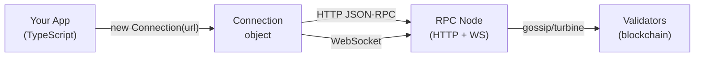
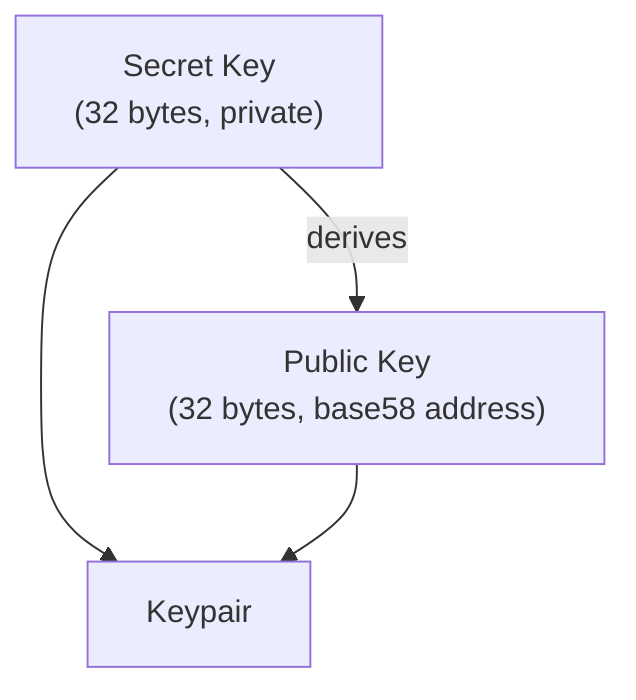
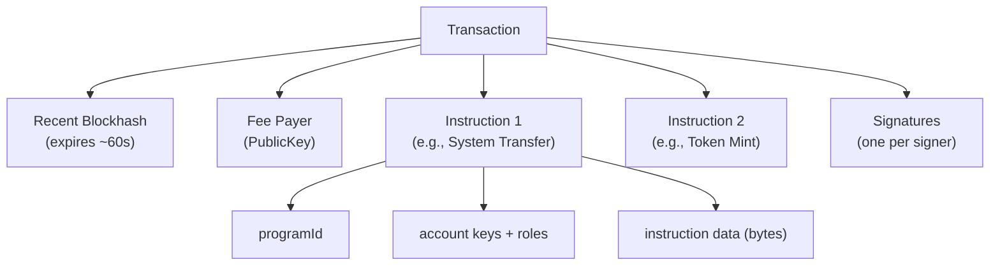
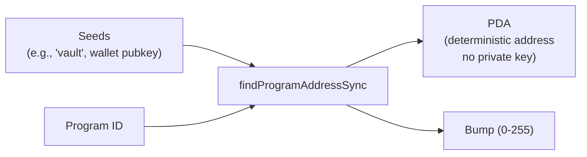
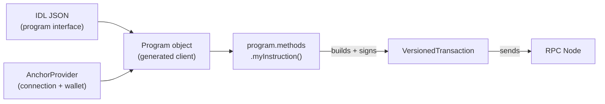

# Chapter 8: Solana Client Development — @solana/web3.js

> "The blockchain is the bank vault. @solana/web3.js is the key, the teller, and the security camera — all in one."

---

## 🗺️ What This Chapter Covers

By the end of this chapter you will be able to:

- Connect your JavaScript/TypeScript app to any Solana cluster
- Generate and manage keypairs and public keys
- Build, sign, and send transactions
- Read on-chain data (accounts, tokens, programs)
- Subscribe to live account changes over WebSocket
- Derive Program Derived Addresses (PDAs)
- Call Anchor programs from the frontend using an IDL
- Integrate the Phantom wallet via `@solana/wallet-adapter-react`

Everything is TypeScript. Every snippet is copy-paste ready.

---

## 🔌 Connection — Talking to the Network

**Real-world analogy:** Your app is a customer. The Solana network is a bank. `Connection` is the phone line between you and the bank's call centre. Before you can ask anything, you need to dial in.



### Cluster Endpoints

| Cluster | Purpose | Free Endpoint |
|---------|---------|---------------|
| `mainnet-beta` | Real money, real users | `https://api.mainnet-beta.solana.com` |
| `devnet` | Testing with fake SOL | `https://api.devnet.solana.com` |
| `testnet` | Validator stress testing | `https://api.testnet.solana.com` |
| `localnet` | Your machine only | `http://localhost:8899` |

### When to use which cluster

**Use devnet when:** you are building or testing — free airdrops, no real money.

**Use mainnet-beta when:** you are shipping to users with real assets.

**Never use mainnet for development.** Mistakes cost real SOL.

### Basic Connection

```typescript
import { Connection, clusterApiUrl } from "@solana/web3.js";

// Built-in helper resolves the right URL for you
const devnet = new Connection(clusterApiUrl("devnet"), "confirmed");

// Or use a premium RPC provider (Helius, QuickNode, etc.)
const helius = new Connection(
  "https://mainnet.helius-rpc.com/?api-key=YOUR_KEY",
  {
    commitment: "confirmed",
    wsEndpoint: "wss://mainnet.helius-rpc.com/?api-key=YOUR_KEY",
  }
);
```

### Commitment Levels — How Sure Do You Want To Be?

**Analogy:** When you send a letter, you can ask for:
- "Just drop it in the mailbox" (processed — fast, uncertain)
- "Confirm it was delivered" (confirmed — safe for most apps)
- "Get a signed receipt" (finalized — absolute certainty, slower)

```typescript
// "processed"  — included in a block, may still be rolled back (~400 ms)
// "confirmed"  — 66% of stake voted on it (~800 ms)
// "finalized"  — fully irreversible (~10-15 s)

const conn = new Connection(clusterApiUrl("devnet"), "confirmed");
```

For most user-facing apps, `"confirmed"` is the sweet spot.

---

## 🔑 Keypair — Your Identity on Solana

**Analogy:** A keypair is like a mailbox. The public key is the address printed on it — anyone can send mail there. The secret key is the key in your pocket — only you can open it and take things out.



### Generate a New Keypair

```typescript
import { Keypair } from "@solana/web3.js";

// Brand new random keypair (never seen before)
const keypair = Keypair.generate();

console.log("Public Key :", keypair.publicKey.toBase58());
// "7xKXtg2CW..."
console.log("Secret Key :", keypair.secretKey);
// Uint8Array(64) — first 32 bytes are the private key seed
```

### Restore from a Raw Secret Key

```typescript
import { Keypair } from "@solana/web3.js";
import bs58 from "bs58";

// If you have it as a base58 string (Phantom export format)
const secretKeyBase58 = "YOUR_BASE58_SECRET_KEY";
const keypair = Keypair.fromSecretKey(bs58.decode(secretKeyBase58));

// If you have it as a raw byte array (e.g., from a JSON file)
const rawBytes = new Uint8Array([12, 34, 56, /* ... 64 bytes total */]);
const keypairFromBytes = Keypair.fromSecretKey(rawBytes);
```

### Restore from a Mnemonic (BIP39 Seed Phrase)

This is how Phantom, Backpack, and most wallets derive keys.

```typescript
import { Keypair } from "@solana/web3.js";
import * as bip39 from "bip39";
import { derivePath } from "ed25519-hd-key";

// npm install bip39 ed25519-hd-key

const mnemonic = "your twelve or twenty four word seed phrase goes here";
const seed = await bip39.mnemonicToSeed(mnemonic);

// Solana derivation path: m/44'/501'/0'/0'
const derivedSeed = derivePath("m/44'/501'/0'/0'", seed.toString("hex")).key;
const keypair = Keypair.fromSeed(derivedSeed);

console.log(keypair.publicKey.toBase58());
```

### PublicKey — The Address Type

```typescript
import { PublicKey } from "@solana/web3.js";

const pk = new PublicKey("7xKXtg2CW87d97TXJSDpbD5jBkheTqA83TZRuJosgAsU");

// Comparison
pk.equals(new PublicKey("7xKXtg2CW87d97TXJSDpbD5jBkheTqA83TZRuJosgAsU")); // true

// Commonly used system addresses
const SYSTEM_PROGRAM = PublicKey.default; // 11111111111111111111111111111111
```

---

## 🏗️ Transaction Anatomy

**Analogy:** A Solana transaction is like a signed legal document. It names who is paying the notary fee (fee payer), what actions to take (instructions), and has a freshness date stamped on it (recent blockhash) so it cannot be replayed days later.



### TransactionInstruction — The Atomic Unit

Every instruction says: "Hey *this program*, do *this thing*, to *these accounts*, with *this data*."

```typescript
import {
  TransactionInstruction,
  PublicKey,
} from "@solana/web3.js";

const instruction = new TransactionInstruction({
  programId: new PublicKey("YourProgramId..."),

  // Every account the instruction touches
  keys: [
    {
      pubkey: new PublicKey("AccountA..."),
      isSigner: true,   // must sign the transaction
      isWritable: true, // will be modified
    },
    {
      pubkey: new PublicKey("AccountB..."),
      isSigner: false,
      isWritable: false, // read-only
    },
  ],

  // Raw bytes — program interprets this however it wants
  data: Buffer.from([0, 1, 2, 3]),
});
```

### Legacy Transaction vs VersionedTransaction

| Feature | Legacy `Transaction` | `VersionedTransaction` |
|---|---|---|
| Introduced | Genesis | Solana 1.14+ |
| Address Lookup Tables (ALTs) | No | Yes |
| Max unique accounts | ~35 | ~256 (with ALTs) |
| Serialization format | v0 legacy | v0 message format |
| Use today? | Simple scripts | Production DeFi/NFT apps |

**When to use Legacy:** quick scripts, learning, simple SOL transfers.

**When to use VersionedTransaction:** complex DeFi instructions touching many accounts, any app using Address Lookup Tables.

```typescript
import {
  Transaction,
  VersionedTransaction,
  TransactionMessage,
  SystemProgram,
  PublicKey,
  Connection,
  clusterApiUrl,
  Keypair,
} from "@solana/web3.js";

const conn = new Connection(clusterApiUrl("devnet"), "confirmed");
const payer = Keypair.generate();

// --- Legacy Transaction ---
const legacyTx = new Transaction().add(
  SystemProgram.transfer({
    fromPubkey: payer.publicKey,
    toPubkey: new PublicKey("RecipientAddress..."),
    lamports: 1_000_000, // 0.001 SOL
  })
);
legacyTx.recentBlockhash = (await conn.getLatestBlockhash()).blockhash;
legacyTx.feePayer = payer.publicKey;

// --- Versioned Transaction (v0) ---
const { blockhash } = await conn.getLatestBlockhash();
const message = new TransactionMessage({
  payerKey: payer.publicKey,
  recentBlockhash: blockhash,
  instructions: [
    SystemProgram.transfer({
      fromPubkey: payer.publicKey,
      toPubkey: new PublicKey("RecipientAddress..."),
      lamports: 1_000_000,
    }),
  ],
}).compileToV0Message(); // pass Address Lookup Tables here if needed

const versionedTx = new VersionedTransaction(message);
versionedTx.sign([payer]);
```

---

## 🚀 Sending Transactions

**Analogy:** Building a transaction is writing a cheque. Sending it is depositing it at the bank. You need both steps — and you need to watch the teller confirm it went through.

### sendAndConfirmTransaction (easiest way)

```typescript
import {
  Connection,
  Keypair,
  SystemProgram,
  Transaction,
  sendAndConfirmTransaction,
  clusterApiUrl,
  PublicKey,
  LAMPORTS_PER_SOL,
} from "@solana/web3.js";

async function transferSOL(
  from: Keypair,
  to: PublicKey,
  amountSOL: number
): Promise<string> {
  const conn = new Connection(clusterApiUrl("devnet"), "confirmed");

  const transaction = new Transaction().add(
    SystemProgram.transfer({
      fromPubkey: from.publicKey,
      toPubkey: to,
      lamports: amountSOL * LAMPORTS_PER_SOL,
    })
  );

  // This call: fetches blockhash, signs, sends, and polls for confirmation
  const signature = await sendAndConfirmTransaction(conn, transaction, [from]);

  console.log(`Transaction confirmed: https://solscan.io/tx/${signature}?cluster=devnet`);
  return signature;
}
```

### sendRawTransaction (more control)

Use this when the wallet has already signed (e.g., Phantom), or you need fine-grained error handling.

```typescript
async function sendSigned(
  conn: Connection,
  signedTx: Transaction | VersionedTransaction
): Promise<string> {
  const rawTx = signedTx.serialize();

  const signature = await conn.sendRawTransaction(rawTx, {
    skipPreflight: false,    // simulate before sending (catch errors early)
    preflightCommitment: "confirmed",
    maxRetries: 5,
  });

  // Now manually confirm
  const { blockhash, lastValidBlockHeight } = await conn.getLatestBlockhash();
  await conn.confirmTransaction(
    { signature, blockhash, lastValidBlockHeight },
    "confirmed"
  );

  return signature;
}
```

### confirmTransaction Strategies

| Strategy | When To Use |
|---|---|
| `sendAndConfirmTransaction` | Scripts, server-side code |
| Poll `getSignatureStatuses` | Custom UI with progress bar |
| `confirmTransaction` with blockhash | Most reliable (avoids false timeouts) |
| WebSocket `onSignature` | Real-time notification to UI |

Always prefer the **blockhash-based** `confirmTransaction` — it avoids spurious timeout errors because the node knows exactly when the transaction has "expired" vs "not yet confirmed."

---

## 🪂 Airdrop SOL on Devnet

**Analogy:** Devnet has a faucet — like a free water fountain. You can ask it for test SOL to pay for fees.

```typescript
import {
  Connection,
  Keypair,
  LAMPORTS_PER_SOL,
  clusterApiUrl,
} from "@solana/web3.js";

async function airdropDevnet(keypair: Keypair, solAmount: number) {
  const conn = new Connection(clusterApiUrl("devnet"), "confirmed");

  console.log(`Requesting ${solAmount} SOL airdrop...`);
  const sig = await conn.requestAirdrop(
    keypair.publicKey,
    solAmount * LAMPORTS_PER_SOL
  );

  // Wait for confirmation
  const { blockhash, lastValidBlockHeight } = await conn.getLatestBlockhash();
  await conn.confirmTransaction({ signature: sig, blockhash, lastValidBlockHeight });

  const balance = await conn.getBalance(keypair.publicKey);
  console.log(`New balance: ${balance / LAMPORTS_PER_SOL} SOL`);
}

// Usage
const wallet = Keypair.generate();
await airdropDevnet(wallet, 2);
```

> Devnet airdrop is rate-limited. If it fails, use https://faucet.solana.com or `solana airdrop` CLI.

---

## 📖 Reading Account Data

**Analogy:** Every account on Solana is like a safe deposit box at the bank. You can see who owns it and how much is in it without needing a key. But to understand what's *inside* (the raw bytes), you need to know the box's "format" (the account schema).

### getAccountInfo

```typescript
import { Connection, PublicKey, clusterApiUrl } from "@solana/web3.js";

async function readAccount(address: string) {
  const conn = new Connection(clusterApiUrl("devnet"), "confirmed");
  const pubkey = new PublicKey(address);

  const accountInfo = await conn.getAccountInfo(pubkey);

  if (!accountInfo) {
    console.log("Account does not exist (or has no SOL lamports)");
    return;
  }

  console.log("Owner program :", accountInfo.owner.toBase58());
  console.log("Lamports      :", accountInfo.lamports);         // in lamports
  console.log("Executable?   :", accountInfo.executable);       // true = program
  console.log("Data length   :", accountInfo.data.length, "bytes");
  console.log("Raw data      :", accountInfo.data);             // Buffer
}
```

### getProgramAccounts — Find All Accounts Owned By a Program

**Analogy:** Instead of looking up one safe deposit box by number, you ask: "Show me every box in this branch owned by Company X."

```typescript
import {
  Connection,
  PublicKey,
  clusterApiUrl,
  GetProgramAccountsFilter,
} from "@solana/web3.js";

async function getProgramAccounts(programId: string) {
  const conn = new Connection(clusterApiUrl("devnet"), "confirmed");

  const filters: GetProgramAccountsFilter[] = [
    {
      dataSize: 165, // only accounts with exactly 165 bytes (e.g., SPL token accounts)
    },
    {
      memcmp: {
        offset: 32,          // byte offset inside account data
        bytes: "YourWalletBase58Address", // must match at that offset
      },
    },
  ];

  const accounts = await conn.getProgramAccounts(
    new PublicKey(programId),
    { filters }
  );

  accounts.forEach(({ pubkey, account }) => {
    console.log(pubkey.toBase58(), "—", account.lamports, "lamports");
  });
}
```

> `getProgramAccounts` can be slow on mainnet for popular programs. Use Helius DAS API or indexed RPCs when possible.

---

## 📡 WebSocket Subscriptions — Live Updates

**Analogy:** Instead of calling the bank every 5 seconds to check your balance, you ask them to text you whenever something changes. That is what WebSocket subscriptions do.

### onAccountChange

```typescript
import { Connection, PublicKey, clusterApiUrl, AccountInfo } from "@solana/web3.js";

function watchAccount(address: string) {
  // Must use a WebSocket-capable RPC (wss://)
  const conn = new Connection(clusterApiUrl("devnet"), "confirmed");

  const pubkey = new PublicKey(address);

  const subscriptionId = conn.onAccountChange(
    pubkey,
    (accountInfo: AccountInfo<Buffer>, context) => {
      console.log("Account changed at slot:", context.slot);
      console.log("New lamports:", accountInfo.lamports);
      console.log("New data:", accountInfo.data);
    },
    "confirmed"
  );

  console.log("Subscribed, id:", subscriptionId);

  // To stop listening later:
  // await conn.removeAccountChangeListener(subscriptionId);
}
```

### onProgramAccountChange — Watch All Accounts of a Program

```typescript
function watchProgramAccounts(programId: string) {
  const conn = new Connection(clusterApiUrl("devnet"), "confirmed");

  const id = conn.onProgramAccountChange(
    new PublicKey(programId),
    ({ accountId, accountInfo }) => {
      console.log("Account changed:", accountId.toBase58());
      console.log("New data:", accountInfo.data);
    },
    "confirmed",
    [{ dataSize: 165 }] // optional filters
  );

  return id; // store to unsubscribe later
}
```

> WebSocket connections drop. In production, reconnect on disconnect and re-subscribe. Libraries like `@solana/spl-token` handle some of this for you.

---

## 💰 Reading Token Balances

```typescript
import { Connection, PublicKey, clusterApiUrl } from "@solana/web3.js";
import { getAccount, getAssociatedTokenAddress } from "@solana/spl-token";

// npm install @solana/spl-token

async function getTokenBalance(walletAddress: string, mintAddress: string) {
  const conn = new Connection(clusterApiUrl("mainnet-beta"), "confirmed");

  const wallet = new PublicKey(walletAddress);
  const mint   = new PublicKey(mintAddress);

  // Derive the Associated Token Account (ATA) address
  const ataAddress = await getAssociatedTokenAddress(mint, wallet);

  try {
    const tokenAccount = await getAccount(conn, ataAddress);
    const decimals = 6; // get this from the mint account or hardcode for known tokens

    const uiAmount = Number(tokenAccount.amount) / Math.pow(10, decimals);
    console.log(`Token balance: ${uiAmount}`);
    return uiAmount;
  } catch (e) {
    console.log("Token account does not exist — wallet holds 0 of this token");
    return 0;
  }
}

// Example: read USDC balance
await getTokenBalance(
  "YourWalletAddress...",
  "EPjFWdd5AufqSSqeM2qN1xzybapC8G4wEGGkZwyTDt1v" // USDC mint on mainnet
);
```

---

## 🧮 Program Derived Addresses (PDAs)

**Analogy:** A PDA is like a P.O. Box assigned to a specific company and customer combination. No one has the private key for that box — only the program (company) can "open" it by signing from inside the program itself.



### findProgramAddressSync

```typescript
import { PublicKey } from "@solana/web3.js";

const PROGRAM_ID = new PublicKey("YourProgramId...");
const userWallet = new PublicKey("UserWalletAddress...");

// Seeds are arbitrary bytes — must match what your program uses on-chain
const [pdaAddress, bumpSeed] = PublicKey.findProgramAddressSync(
  [
    Buffer.from("vault"),         // string seed
    userWallet.toBuffer(),        // pubkey seed
  ],
  PROGRAM_ID
);

console.log("PDA address:", pdaAddress.toBase58());
console.log("Bump seed  :", bumpSeed);
// bump is included in instructions so the program can re-derive and verify
```

The bump guarantees the derived address is NOT on the ed25519 curve, which means no one can have a private key for it. Only the program can "sign" for it via `invoke_signed` in Rust.

---

## ⚓ Calling Anchor Programs from the Frontend

**Analogy:** An Anchor IDL is like a restaurant menu. Instead of writing raw bytes, you say "I want item #3 with these parameters," and the Anchor client handles the serialization for you.



### Setup

```bash
npm install @coral-xyz/anchor
```

### Full Example — Initialize and Call an Anchor Program

```typescript
import { Connection, PublicKey, clusterApiUrl } from "@solana/web3.js";
import { AnchorProvider, Program, web3, BN, Idl } from "@coral-xyz/anchor";
import { useAnchorWallet } from "@solana/wallet-adapter-react";
import myIdl from "./idl/my_program.json"; // generated by `anchor build`

const PROGRAM_ID = new PublicKey("YourProgramId...");

async function callAnchorInstruction(wallet: ReturnType<typeof useAnchorWallet>) {
  if (!wallet) throw new Error("Wallet not connected");

  const conn = new Connection(clusterApiUrl("devnet"), "confirmed");

  // AnchorProvider wraps connection + wallet into one object
  const provider = new AnchorProvider(conn, wallet, {
    commitment: "confirmed",
  });

  // Typed program client generated from IDL
  const program = new Program(myIdl as Idl, PROGRAM_ID, provider);

  // Derive any PDAs your instruction needs
  const [vault, bump] = PublicKey.findProgramAddressSync(
    [Buffer.from("vault"), wallet.publicKey.toBuffer()],
    PROGRAM_ID
  );

  // Call the instruction — Anchor handles serialization, accounts, etc.
  const tx = await program.methods
    .initializeVault(new BN(1_000_000)) // instruction arguments
    .accounts({
      vault,
      user: wallet.publicKey,
      systemProgram: web3.SystemProgram.programId,
    })
    .rpc();

  console.log("Transaction:", tx);
}
```

The `.rpc()` call builds the transaction, requests the wallet to sign it, sends it, and waits for confirmation. You can also use `.transaction()` to get the raw `Transaction` object and sign it yourself.

---

## 👻 Phantom Wallet Adapter Integration

**Analogy:** Your app doesn't hold anyone's private keys — that's the wallet's job. The wallet adapter is the official handshake protocol between your app and wallets like Phantom, Backpack, or Solflare.

### Installation

```bash
npm install @solana/wallet-adapter-react \
            @solana/wallet-adapter-react-ui \
            @solana/wallet-adapter-wallets \
            @solana/wallet-adapter-base \
            @solana/web3.js
```

### Provider Setup (App Root)

```tsx
// App.tsx
import React, { FC, useMemo } from "react";
import {
  ConnectionProvider,
  WalletProvider,
} from "@solana/wallet-adapter-react";
import { WalletAdapterNetwork } from "@solana/wallet-adapter-base";
import { PhantomWalletAdapter } from "@solana/wallet-adapter-wallets";
import {
  WalletModalProvider,
  WalletMultiButton,
} from "@solana/wallet-adapter-react-ui";
import { clusterApiUrl } from "@solana/web3.js";

// Import default styles
import "@solana/wallet-adapter-react-ui/styles.css";

const App: FC = () => {
  const network = WalletAdapterNetwork.Devnet;
  const endpoint = useMemo(() => clusterApiUrl(network), [network]);

  const wallets = useMemo(
    () => [
      new PhantomWalletAdapter(),
      // Add more: new SolflareWalletAdapter(), new BackpackWalletAdapter(), etc.
    ],
    []
  );

  return (
    <ConnectionProvider endpoint={endpoint}>
      <WalletProvider wallets={wallets} autoConnect>
        <WalletModalProvider>
          <WalletMultiButton /> {/* Pre-built connect button */}
          <YourAppContent />
        </WalletModalProvider>
      </WalletProvider>
    </ConnectionProvider>
  );
};
```

### Using Wallet in Components

```tsx
// SendSOL.tsx
import React, { useState } from "react";
import { useWallet, useConnection } from "@solana/wallet-adapter-react";
import {
  Transaction,
  SystemProgram,
  PublicKey,
  LAMPORTS_PER_SOL,
} from "@solana/web3.js";

export const SendSOL: React.FC = () => {
  const { publicKey, sendTransaction } = useWallet();
  const { connection } = useConnection();
  const [status, setStatus] = useState("");

  const handleSend = async () => {
    if (!publicKey) {
      setStatus("Connect your wallet first");
      return;
    }

    setStatus("Building transaction...");

    const recipient = new PublicKey("RecipientAddress...");
    const lamports = 0.01 * LAMPORTS_PER_SOL;

    const transaction = new Transaction().add(
      SystemProgram.transfer({
        fromPubkey: publicKey,
        toPubkey: recipient,
        lamports,
      })
    );

    try {
      // sendTransaction handles: blockhash, signing via Phantom, sending
      const { blockhash, lastValidBlockHeight } =
        await connection.getLatestBlockhash();

      transaction.recentBlockhash = blockhash;
      transaction.feePayer = publicKey;

      setStatus("Waiting for wallet approval...");
      const signature = await sendTransaction(transaction, connection);

      setStatus("Confirming...");
      await connection.confirmTransaction(
        { signature, blockhash, lastValidBlockHeight },
        "confirmed"
      );

      setStatus(`Done! Sig: ${signature.slice(0, 16)}...`);
    } catch (e: any) {
      setStatus(`Error: ${e.message}`);
    }
  };

  return (
    <div>
      <button onClick={handleSend} disabled={!publicKey}>
        Send 0.01 SOL
      </button>
      <p>{status}</p>
    </div>
  );
};
```

### Key Hooks Reference

| Hook | Returns | Use For |
|---|---|---|
| `useWallet()` | `{ publicKey, connected, signTransaction, sendTransaction, ... }` | Signing and sending |
| `useConnection()` | `{ connection }` | Reading on-chain data |
| `useAnchorWallet()` | `wallet` compatible with `AnchorProvider` | Calling Anchor programs |

---

## 🧩 Putting It All Together — Full TypeScript Examples

### Example 1: Transfer SOL (Node.js script, no wallet adapter)

```typescript
import {
  Connection, Keypair, PublicKey, SystemProgram,
  Transaction, sendAndConfirmTransaction,
  clusterApiUrl, LAMPORTS_PER_SOL,
} from "@solana/web3.js";
import bs58 from "bs58";

async function main() {
  const conn = new Connection(clusterApiUrl("devnet"), "confirmed");

  // Load sender from environment (never hardcode in production)
  const sender = Keypair.fromSecretKey(
    bs58.decode(process.env.SENDER_SECRET_KEY!)
  );

  const recipient = new PublicKey(process.env.RECIPIENT_ADDRESS!);

  const balance = await conn.getBalance(sender.publicKey);
  console.log(`Sender balance: ${balance / LAMPORTS_PER_SOL} SOL`);

  const tx = new Transaction().add(
    SystemProgram.transfer({
      fromPubkey: sender.publicKey,
      toPubkey: recipient,
      lamports: 0.001 * LAMPORTS_PER_SOL,
    })
  );

  const sig = await sendAndConfirmTransaction(conn, tx, [sender]);
  console.log(`Sent! https://solscan.io/tx/${sig}?cluster=devnet`);
}

main().catch(console.error);
```

### Example 2: Read Token Balance (any mint)

```typescript
import { Connection, PublicKey, clusterApiUrl } from "@solana/web3.js";
import {
  getAssociatedTokenAddressSync,
  getAccount,
  getMint,
} from "@solana/spl-token";

async function readTokenBalance(walletStr: string, mintStr: string) {
  const conn = new Connection(clusterApiUrl("mainnet-beta"), "confirmed");
  const wallet = new PublicKey(walletStr);
  const mint   = new PublicKey(mintStr);

  // Fetch mint info to get decimals
  const mintInfo = await getMint(conn, mint);

  const ata = getAssociatedTokenAddressSync(mint, wallet);

  try {
    const tokenAcc = await getAccount(conn, ata);
    const amount = Number(tokenAcc.amount) / 10 ** mintInfo.decimals;
    console.log(`Balance: ${amount} tokens`);
    return amount;
  } catch {
    console.log("No token account (balance = 0)");
    return 0;
  }
}

await readTokenBalance(
  "YourWallet...",
  "So11111111111111111111111111111111111111112" // Wrapped SOL
);
```

### Example 3: Call Program Instruction (raw, no Anchor)

```typescript
import {
  Connection, Keypair, PublicKey, Transaction,
  TransactionInstruction, sendAndConfirmTransaction,
  clusterApiUrl,
} from "@solana/web3.js";
import * as borsh from "borsh";

// Define your instruction data schema (must match on-chain program)
class IncrementInstruction {
  instruction: number;
  amount: number;
  constructor(fields: { instruction: number; amount: number }) {
    this.instruction = fields.instruction;
    this.amount = fields.amount;
  }
}
const schema = new Map([
  [IncrementInstruction, { kind: "struct", fields: [["instruction", "u8"], ["amount", "u32"]] }],
]);

async function callProgram(signer: Keypair, counterAccount: PublicKey) {
  const conn = new Connection(clusterApiUrl("devnet"), "confirmed");
  const PROGRAM_ID = new PublicKey("YourProgramId...");

  const payload = new IncrementInstruction({ instruction: 0, amount: 5 });
  const data = Buffer.from(borsh.serialize(schema, payload));

  const ix = new TransactionInstruction({
    programId: PROGRAM_ID,
    keys: [
      { pubkey: counterAccount, isSigner: false, isWritable: true },
      { pubkey: signer.publicKey, isSigner: true, isWritable: false },
    ],
    data,
  });

  const tx = new Transaction().add(ix);
  const sig = await sendAndConfirmTransaction(conn, tx, [signer]);
  console.log("Instruction sent:", sig);
}
```

---

## 📊 RPC Provider Comparison

| Provider | Free Tier | Standout Feature | Best For |
|---|---|---|---|
| Public Solana RPC | Unlimited (rate-limited) | Zero setup | Development/testing only |
| Helius | 100k credits/day | DAS API (NFT/token indexing), webhooks | Production DeFi/NFT apps |
| QuickNode | 10M credits/month | Multi-chain, low-latency | High-throughput trading bots |
| Triton | Custom pricing | Archive nodes, gRPC (Geyser) | Analytics, indexers |
| Alchemy | 100M compute units/month | Best web2 DevEx | Web2 teams entering Solana |

**When NOT to use the public endpoint in production:** The public Solana RPC is heavily rate-limited and has no SLA. A single large NFT drop or DEX trade can cause it to be unavailable. Always use a dedicated provider for user-facing apps.

---

## ⚡ Performance Tips

1. **Reuse your `Connection` object** — creating one per request is wasteful. Create once, export, reuse.
2. **Use `getMultipleAccountsInfo`** instead of many `getAccountInfo` calls — batches up to 100 accounts in one request.
3. **Set `skipPreflight: true` for high-frequency bots** — preflight simulation adds ~100 ms latency.
4. **Use `dataSlice`** in `getAccountInfo` to read only the bytes you need from large accounts.
5. **Prefer `getParsedAccountInfo`** for token accounts — returns human-readable JSON instead of raw bytes.

```typescript
// Batch multiple account reads
const accounts = await conn.getMultipleAccountsInfo([
  pubkey1, pubkey2, pubkey3
]);
// Returns array of AccountInfo | null, one per pubkey
```

---

## 🎯 Key Takeaways

| Topic | Remember This |
|---|---|
| **Connection** | Use `"confirmed"` commitment for most apps. Use a premium RPC in production. |
| **Keypair** | Never store secret keys in code. Use env vars, KMS, or hardware wallets. |
| **Transaction** | Always include `recentBlockhash` and `feePayer`. Blockhashes expire in ~60 seconds. |
| **VersionedTransaction** | Use v0 for complex DeFi. Legacy is fine for simple transfers. |
| **confirmTransaction** | Use the blockhash-based overload — it is more reliable than polling. |
| **getAccountInfo** | Returns raw bytes. You need to know the schema to decode them. |
| **WebSocket subs** | Great for live UIs. Always handle reconnects in production. |
| **PDA** | Deterministic, no private key. Derived from seeds + program ID. Must match on-chain. |
| **Anchor IDL** | Generates a typed client. `.rpc()` does everything. Use `.transaction()` for manual control. |
| **Wallet Adapter** | Never touch private keys in your frontend. The wallet signs, you send. |

---

## 📚 What Comes Next

- **Chapter 9:** SPL Token Program — minting, transferring, burning, associated token accounts
- **Chapter 10:** Anchor Programs — writing on-chain Rust programs with the Anchor framework
- **Chapter 11:** Metaplex — NFTs, compressed NFTs, and the Digital Asset Standard

---

*The best way to learn this is to run it. Start with a devnet keypair, airdrop some SOL, and send your first transaction. The blockchain does not lie — if the transaction lands, your code works.*
