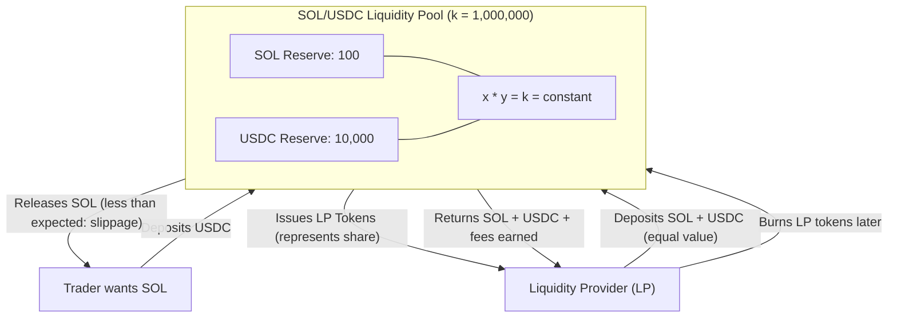
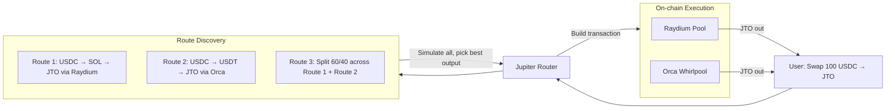
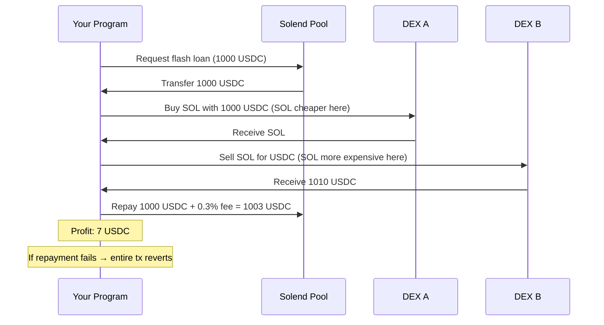

# Solana DeFi Fundamentals

> "DeFi is the internet of finance — open, permissionless, composable. Solana is the highway it runs on."

---

## 🌐 What Is DeFi, Really?

Imagine a bank with no employees, no headquarters, no opening hours, and no permission slips. Anyone with a wallet can deposit money, borrow money, trade assets, or earn interest — automatically, at any hour, in any country.

That's DeFi: **Decentralized Finance**. Code replaces bankers. Smart contracts replace paperwork. Blockchains replace ledgers.

Solana runs this vision better than almost any other chain. Here's why.

---

## 🔥 What Makes Solana DeFi Different?

Most blockchains force DeFi to be slow and expensive. Solana was built from the ground up to make DeFi feel like using a real financial app.

| Feature | Ethereum | Solana |
|---|---|---|
| Transaction finality | ~12 seconds | ~400ms |
| Average tx fee | $1–$50+ | $0.00025 |
| TPS (sustained) | ~15–30 | ~4,000+ (65,000 theoretical) |
| Parallel execution | No (sequential EVM) | Yes (Sealevel) |
| Native composability | Limited | Deep (same runtime) |

**Three pillars of Solana DeFi:**

1. **Fast** — trades confirm before you can blink. Market makers can quote tight spreads.
2. **Cheap** — you can swap $5 worth of tokens without losing $20 to gas.
3. **Composable** — one transaction can interact with 5 different protocols. Flash loans, atomic swaps, liquidations — all in one shot.

---

## 💱 DEX and AMM: The Heart of DeFi

### The Analogy

Traditional exchanges (like the NYSE) use an **order book** — buyers and sellers post bids and asks, and a trade happens when they match. This needs market makers who sit there all day posting orders.

An **AMM (Automated Market Maker)** replaces the order book with a **pool of two tokens and a math formula**. No humans needed. Anyone can trade against the pool 24/7.

### The x * y = k Formula

This is the most important equation in DeFi. Read it slowly.

```
x * y = k
```

- `x` = amount of Token A in the pool
- `y` = amount of Token B in the pool
- `k` = a constant that never changes

**Example:** A SOL/USDC pool starts with 100 SOL and 10,000 USDC.

```
k = 100 * 10,000 = 1,000,000
```

You want to buy 10 SOL. After your trade, the pool has 90 SOL. What does it need in USDC?

```
90 * y = 1,000,000
y = 11,111 USDC
```

So the pool now has 90 SOL and 11,111 USDC. You paid **1,111 USDC for 10 SOL** — effectively $111.11 per SOL (even though the starting price was $100). That extra cost is called **price impact** or **slippage** — you moved the market by trading.

### AMM Liquidity Pool Diagram



### Impermanent Loss — The Hidden Cost of Being an LP

Here's the painful part. When you provide liquidity, you deposit both tokens. If the price of one token changes a lot, you'd have been better off just holding the tokens instead of putting them in the pool.

**Analogy:** You split $1,000 evenly between apples and oranges in a store. Apples become 4x more valuable. Arbitrageurs buy apples from your store until the ratio rebalances. You end up with fewer apples than if you'd just held them. That loss compared to holding is **impermanent loss** (IL).

| Price Change (one token) | Impermanent Loss |
|---|---|
| 1.25x | 0.6% |
| 1.5x | 2.0% |
| 2x | 5.7% |
| 4x | 20.0% |
| 10x | 42.5% |

The loss is "impermanent" because if the price returns to the original ratio, the loss disappears. But if you withdraw while the price is different, the loss becomes permanent.

**Fee income** from traders using your pool offsets IL. High-volume pools (like USDC/USDT stablecoins) barely experience IL but earn tons of fees.

---

## 🌊 Raydium and Orca: The Big DEXes on Solana

### Raydium

Raydium is the oldest and largest AMM on Solana. What makes it unique:

- Uses Serum's (now OpenBook's) **central limit order book** alongside AMM pools
- LPs earn fees from both AMM trades AND order book activity
- Concentrated Liquidity Market Maker (CLMM) pools — LPs can choose a price range (like Uniswap v3)
- Deep integrations with most Solana DeFi protocols

### Orca

Orca is known for being developer-friendly and user-friendly:

- **Whirlpools** — Orca's concentrated liquidity product (similar to Uniswap v3)
- Clean SDK, great documentation
- High TVL in stablecoin and LST (liquid staking token) pairs
- Used heavily by Jupiter for routing

### When to use Raydium vs Orca

| Scenario | Use |
|---|---|
| You want to create a new token pool | Raydium (lower friction for new tokens) |
| You want concentrated liquidity with great tooling | Orca Whirlpools |
| You want order-book style features too | Raydium |
| You're building a protocol that needs LP position management | Orca (cleaner SDK) |

---

## 🪐 Jupiter Aggregator: The Smart Router

### The Analogy

When you search for a flight, you don't check every airline's website one by one. You use Google Flights or Kayak — they check all airlines and find the best route and price, maybe combining two flights to beat a direct fare.

Jupiter does this for token swaps. Instead of manually finding which DEX has the best price, Jupiter **checks every pool on every DEX and finds the optimal route** — sometimes splitting your trade across multiple DEXes and hopping through intermediate tokens to get you a better deal.

### How Jupiter Works Internally



Jupiter uses **off-chain quote computation** (fast) + **on-chain execution** (trustless). It:
1. Reads all pool states off-chain
2. Runs routing algorithms to find best output
3. Packages everything into one atomic Solana transaction
4. If any leg fails, the whole transaction fails — you never get stuck with half a swap

### Swapping Tokens Programmatically with Jupiter SDK

```typescript
import { createJupiterApiClient } from "@jup-ag/api";
import {
  Connection,
  Keypair,
  VersionedTransaction,
  PublicKey,
} from "@solana/web3.js";

const connection = new Connection("https://api.mainnet-beta.solana.com");
const jupiterApi = createJupiterApiClient();

async function swapUSDCtoSOL(
  wallet: Keypair,
  usdcAmountInSmallestUnit: number // 1 USDC = 1_000_000 (6 decimals)
) {
  const USDC_MINT = "EPjFWdd5AufqSSqeM2qN1xzybapC8G4wEGGkZwyTDt1v";
  const SOL_MINT = "So11111111111111111111111111111111111111112"; // Wrapped SOL

  // Step 1: Get the best quote from Jupiter
  const quote = await jupiterApi.quoteGet({
    inputMint: USDC_MINT,
    outputMint: SOL_MINT,
    amount: usdcAmountInSmallestUnit,
    slippageBps: 50, // 0.5% slippage tolerance
  });

  console.log(
    `Best route: ${quote.routePlan.map((r) => r.swapInfo.label).join(" → ")}`
  );
  console.log(
    `Output: ${Number(quote.outAmount) / 1e9} SOL`
  );
  console.log(
    `Price impact: ${quote.priceImpactPct}%`
  );

  // Step 2: Get the swap transaction
  const swapResponse = await jupiterApi.swapPost({
    swapRequest: {
      quoteResponse: quote,
      userPublicKey: wallet.publicKey.toBase58(),
      wrapAndUnwrapSol: true, // Auto wrap/unwrap SOL for us
      dynamicComputeUnitLimit: true, // Optimize CU usage
      prioritizationFeeLamports: 1000, // Priority fee for faster landing
    },
  });

  // Step 3: Deserialize and sign the transaction
  const swapTransactionBuf = Buffer.from(
    swapResponse.swapTransaction,
    "base64"
  );
  const transaction = VersionedTransaction.deserialize(swapTransactionBuf);
  transaction.sign([wallet]);

  // Step 4: Send and confirm
  const txId = await connection.sendRawTransaction(transaction.serialize(), {
    skipPreflight: false,
    maxRetries: 3,
  });

  await connection.confirmTransaction(txId, "confirmed");
  console.log(`Swap confirmed: https://solscan.io/tx/${txId}`);
  return txId;
}
```

---

## 📖 Reading Pool State from On-Chain Accounts

Every DEX pool is just a Solana account with structured data. You can read it directly.

```typescript
import { Connection, PublicKey } from "@solana/web3.js";
import { AmmV3, PoolUtils } from "@raydium-io/raydium-sdk";

const connection = new Connection("https://api.mainnet-beta.solana.com");

// Example: Read a Raydium CLMM pool state
async function readRaydiumPoolState(poolId: string) {
  const poolPubkey = new PublicKey(poolId);
  const accountInfo = await connection.getAccountInfo(poolPubkey);

  if (!accountInfo) throw new Error("Pool not found");

  // Decode pool state using Raydium SDK
  const poolState = AmmV3.decodePoolState(accountInfo.data);

  console.log({
    tokenA: poolState.tokenMint0.toBase58(),
    tokenB: poolState.tokenMint1.toBase58(),
    currentPrice: poolState.sqrtPriceX64.toString(),
    liquidity: poolState.liquidity.toString(),
    feeRate: poolState.ammConfig.tradeFeeRate,
    tickCurrent: poolState.tickCurrent,
  });
}

// Example: Read an Orca Whirlpool state
import { WhirlpoolContext, buildWhirlpoolClient, ORCA_WHIRLPOOL_PROGRAM_ID } from "@orca-so/whirlpools-sdk";
import { AnchorProvider } from "@coral-xyz/anchor";

async function readOrcaWhirlpoolState(whirlpoolAddress: string) {
  const provider = AnchorProvider.env();
  const ctx = WhirlpoolContext.from(
    provider.connection,
    provider.wallet,
    ORCA_WHIRLPOOL_PROGRAM_ID
  );
  const client = buildWhirlpoolClient(ctx);

  const pool = await client.getPool(new PublicKey(whirlpoolAddress));
  const data = pool.getData();

  console.log({
    tokenA: data.tokenMintA.toBase58(),
    tokenB: data.tokenMintB.toBase58(),
    liquidity: data.liquidity.toString(),
    sqrtPrice: data.sqrtPrice.toString(),
    currentTickIndex: data.tickCurrentIndex,
    feeRate: data.feeRate, // in hundredths of a bip
  });
}
```

---

## 💰 Lending Protocols: Solend and MarginFi

### The Analogy

Think of a pawn shop. You bring in something valuable (your watch). They give you cash — but not the full value, maybe 70%. If you don't repay, they keep the watch. If your watch becomes worthless overnight, they sell it immediately before they lose money.

Lending protocols work the same way. You deposit collateral, borrow against it at a percentage (LTV — Loan-to-Value), and if your collateral's value drops too low, **liquidators** automatically repay your debt and take your collateral.

### How It Works Step by Step

```
1. Deposit 10 SOL (worth $1,500) as collateral
2. Borrow up to 75% LTV → up to $1,125 USDC
3. You now have $1,125 USDC + still "own" 10 SOL (locked)
4. SOL price drops to $100 → your collateral is worth $1,000
5. Your loan is now undercollateralized (LTV > max)
6. Liquidator repays your USDC debt, receives your SOL at a discount (liquidation bonus)
7. You lose your collateral. This is a liquidation.
```

### Solend

Solend is the original lending protocol on Solana:

- Isolated pools for risky assets (limit contagion)
- Main Pool for blue-chip assets (SOL, ETH, BTC, USDC)
- Flash loans (borrow any amount, repay in same transaction)
- cTokens: deposit USDC, receive cUSDC that accrues interest

### MarginFi

MarginFi (mrgn) is the newer, more composable alternative:

- **Health factor** based system (not just LTV)
- **Points system** — deposit/borrow earns MRGN points
- Better SDK and developer experience
- Integrated with Jupiter for liquidation routes
- Supports cross-collateralization across accounts

### When to use Solend vs MarginFi

| Need | Use |
|---|---|
| Battle-tested protocol, highest TVL | Solend |
| Better developer SDK | MarginFi |
| Points/airdrops exposure | MarginFi |
| Flash loans | Either (both support them) |
| Isolated pool for risky token | Solend |

---

## 🌾 Yield Farming Basics

Yield farming = putting your assets to work to earn more assets.

**The stack:**

1. **Base yield** — deposit USDC on MarginFi → earn interest from borrowers
2. **LP yield** — provide SOL/USDC to Orca → earn trading fees
3. **Incentive yield** — some protocols pay extra tokens (emissions) to attract liquidity
4. **Stacked yield** — take your Orca LP token and deposit it on another protocol for even more yield

**The risks:**
- **Smart contract risk** — protocol gets hacked
- **Impermanent loss** — prices diverge, you lose value vs holding
- **Token inflation** — farming rewards are paid in a token that might go to zero
- **Liquidation risk** — if you borrow to farm, your collateral can get wiped out

---

## 🪙 Stablecoins on Solana

### USDC (USD Coin)

- Issued by Circle, fully backed by USD + short-term treasuries
- Most liquid stablecoin on Solana
- Native USDC on Solana (not bridged) — use this for DeFi
- Mint: `EPjFWdd5AufqSSqeM2qN1xzybapC8G4wEGGkZwyTDt1v`

### USDe (Ethena)

- Synthetic dollar protocol — not backed by real USD
- Backed by **delta-neutral positions**: long staked ETH + short ETH perp futures
- Earns the funding rate from perpetual futures as yield
- Higher yield than USDC but carries basis risk and smart contract risk
- Growing presence on Solana via bridging

### When to use which

| Use Case | Stablecoin |
|---|---|
| DeFi trading, payments, LP | USDC (safest, most liquid) |
| Earning yield on stablecoins | USDe (higher APY, more risk) |
| Collateral on Solend/MarginFi | USDC preferred |
| International transfers | USDC (widely supported) |

---

## 🚀 Jito: MEV on Solana

### The Analogy

Imagine a stock exchange where traders can see your order before it's filled and quickly place their own orders in front of yours to profit. That's **MEV (Maximal Extractable Value)** — money extracted by reordering, inserting, or censoring transactions.

On Ethereum, MEV is chaotic — bots compete by paying high gas fees, often clogging the network. Jito brings **organized MEV** to Solana.

### What Jito Does

Jito built a **modified Solana validator client** that supports a **block engine** — a marketplace where searchers (MEV bots) submit **bundles** of transactions with **tips** to be included atomically.

```
Normal Solana tx flow:
  Wallet → RPC → Leader Validator → Block

Jito tx flow:
  Searcher Bundle (with tip) → Jito Block Engine → Jito Validator → Block
```

**Key concepts:**

- **Bundle** — a group of up to 5 transactions that must be executed atomically and in order. If any fails, all fail.
- **Tip** — SOL paid to the validator (Jito distributes this to validators and stakers)
- **Jito-Solana** — the modified validator client (~60-70% of Solana validators run it)
- **Jito Labs Block Engine** — off-chain auction for block space

### Why You Should Care as a Developer

If you're building a bot (arbitrage, liquidation), you need Jito:

```typescript
import { Connection, Keypair, Transaction, SystemProgram } from "@solana/web3.js";
import { SearcherClient, searcherClient } from "jito-ts/dist/sdk/block-engine/searcher";
import { Bundle } from "jito-ts/dist/sdk/block-engine/types";

// Connect to Jito Block Engine
const client = searcherClient(
  "frankfurt.mainnet.block-engine.jito.wtf",
  YOUR_KEYPAIR // Auth keypair
);

async function sendBundleWithTip(
  transactions: Transaction[],
  tipLamports: number
) {
  // Add tip transaction (pays the validator)
  const tipAccounts = await client.getTipAccounts();
  const tipAccount = tipAccounts[Math.floor(Math.random() * tipAccounts.length)];

  const tipTx = new Transaction().add(
    SystemProgram.transfer({
      fromPubkey: wallet.publicKey,
      toPubkey: new PublicKey(tipAccount),
      lamports: tipLamports, // e.g., 10_000 = 0.00001 SOL
    })
  );

  // Bundle: your txs + tip tx
  const bundle = new Bundle([...transactions, tipTx], 5);

  const bundleId = await client.sendBundle(bundle);
  console.log(`Bundle sent: ${bundleId}`);
}
```

### When to use Jito

| Scenario | Use Jito? |
|---|---|
| Regular user swap | No — normal RPC is fine |
| Liquidation bot | Yes — need atomicity and speed |
| Arbitrage bot | Yes — compete with tips |
| High-frequency trading | Yes |
| NFT mint bot | Yes |

---

## 🔮 Pyth Network: Price Oracles on Solana

### The Analogy

Smart contracts live on-chain. The SOL price lives off-chain. How does a lending protocol know whether your collateral is undercollateralized? It needs a **trusted price feed** — that's an oracle.

Pyth is like Bloomberg Terminal for blockchains — it aggregates prices from dozens of institutional market makers and publishes them on-chain in real-time.

### How Pyth Works

```
Data Providers (Virtu, Jump, Jane Street, etc.)
    ↓ (publish raw prices + confidence intervals)
Pyth Aggregator (on-chain Solana program)
    ↓ (aggregates, computes confidence-weighted median)
Price Account (Solana account readable by any program)
    ↓
Your Protocol (reads price during transaction)
```

Price updates are **pushed on-chain every ~400ms** by a Pyth publisher program. Programs read the price account during transaction execution.

### Reading Pyth Prices in Your Program

```rust
// In your Solana program (Anchor)
use pyth_sdk_solana::load_price_feed_from_account_info;

#[derive(Accounts)]
pub struct LiquidatePosition<'info> {
    /// CHECK: Pyth price account for SOL/USD
    pub pyth_sol_price: AccountInfo<'info>,
    // ... other accounts
}

pub fn liquidate_position(ctx: Context<LiquidatePosition>) -> Result<()> {
    // Load price feed from the account
    let price_feed = load_price_feed_from_account_info(&ctx.accounts.pyth_sol_price)
        .map_err(|_| ErrorCode::InvalidPriceFeed)?;

    // Get the latest price (never use get_price_unchecked in production)
    let price = price_feed
        .get_price_no_older_than(60) // Max 60 seconds old
        .ok_or(ErrorCode::StalePriceFeed)?;

    let sol_price_usd = price.price; // i64, scaled by 10^expo
    let confidence = price.conf; // Uncertainty range
    let expo = price.expo; // Typically -8

    // Convert to actual USD price
    let actual_price = (sol_price_usd as f64) * 10f64.powi(expo);

    msg!("SOL price: ${:.4}", actual_price);
    msg!("Confidence: ±${:.4}", (confidence as f64) * 10f64.powi(expo));

    // Always check confidence — if spread is too wide, don't trade
    let max_confidence_ratio = 0.01; // 1%
    let confidence_ratio = confidence as f64 / sol_price_usd.abs() as f64;
    require!(
        confidence_ratio < max_confidence_ratio,
        ErrorCode::PriceTooUncertain
    );

    // Now use the price for your liquidation logic
    // ...

    Ok(())
}
```

**Key Pyth concepts:**

- **Confidence interval** — Pyth doesn't just give you one price, it gives you a range. Use this! High uncertainty = don't execute.
- **Price expo** — price is stored as `price * 10^expo`. SOL/USD expo is typically -8.
- **Age check** — always use `get_price_no_older_than()`. A stale price can be exploited.

**Important Pyth price feed addresses on mainnet:**

| Asset | Price Feed Address |
|---|---|
| SOL/USD | `H6ARHf6YXhGYeQfUzQNGk6rDNnLBQKrenN712K4AQJEG` |
| BTC/USD | `GVXRSBjFk6e6J3NbVPXohDJetcTjaeeuykUpbQF8UoMU` |
| ETH/USD | `JBu1AL4obBcCMqKBcHyycK4xaSZVCehAt4Kez9dRd5SE` |
| USDC/USD | `Gnt27xtC473ZT2Mw5u8wZ68Z3gULkSTb5DuxJy7eJotD` |

---

## ⚡ Flash Loans on Solana

### The Analogy

Imagine you can borrow $1 million from a bank, but you must return it within the same second — or the transaction is cancelled as if it never happened. You can use that $1M for anything in that one second: arbitrage, liquidations, collateral swaps. This is a flash loan.

On traditional blockchains this sounds impossible, but in Solana (and Ethereum), a "transaction" can contain many steps. Flash loans work by:

1. Borrow tokens from a lending pool
2. Do whatever you want with them (swap, liquidate, etc.)
3. Repay the loan + fee in the same transaction
4. If step 3 fails, the entire transaction reverts — the pool never loses money

### Flash Loan Flow



### Flash Loan with Solend (Simplified)

```typescript
// Flash loans on Solend happen via CPI (Cross-Program Invocation)
// The pool checks at the end of the transaction that the borrowed
// amount + fee was returned.

// High-level structure (pseudo-code for clarity):
async function executeFlashLoan() {
  const instructions = [
    // 1. Borrow instruction — Solend transfers USDC to your account
    solendFlashBorrowInstruction({
      amount: 1_000_000_000, // 1000 USDC (6 decimals)
      reserve: SOLEND_USDC_RESERVE,
      destinationLiquidityAccount: yourUsdcAccount,
      program: SOLEND_PROGRAM_ID,
    }),

    // 2. Your arbitrage/liquidation logic goes here
    // ... swap on DEX A ...
    // ... swap on DEX B ...

    // 3. Repay instruction — you return USDC + fee
    // Solend validates: final balance >= initial balance + fee
    solendFlashRepayInstruction({
      amount: 1_000_000_000, // Same amount
      borrowInstructionIndex: 0, // Points to the borrow ix
      reserve: SOLEND_USDC_RESERVE,
      sourceLiquidityAccount: yourUsdcAccount,
      program: SOLEND_PROGRAM_ID,
    }),
  ];

  // Send as one atomic transaction
  // If repay fails → whole tx reverts → pool safe
  const tx = new Transaction().add(...instructions);
  await sendAndConfirmTransaction(connection, tx, [wallet]);
}
```

### When Flash Loans Make Sense / Don't Make Sense

| When to use | When NOT to use |
|---|---|
| Arbitrage between DEXes (risk-free if profitable) | Random speculation — needs a clear profit path |
| Self-liquidation (repay your own loan to avoid penalty) | When you have the capital already — fee is unnecessary cost |
| Collateral swap (change collateral type atomically) | When the opportunity is gone by the time you code it |
| Protocol liquidations | Without MEV protection (Jito) — bots will front-run you |

---

## 🔗 How Everything Composes Together

The real power of Solana DeFi is that all these pieces work together in a single transaction:

```
One Transaction:
  1. Flash loan USDC from MarginFi
  2. Swap USDC → SOL via Jupiter (finds best route across Raydium + Orca)
  3. Deposit SOL as collateral on Solend
  4. Borrow USDC from Solend
  5. Repay flash loan to MarginFi
  6. Profit: you now have leveraged SOL exposure with no starting capital
```

This is **DeFi composability** — each protocol is a building block. Your program calls them all in sequence using CPIs. One failed step reverts everything.

---

## Key Takeaways

- **AMM formula x*y=k** determines price from pool reserves. Bigger trades = more slippage. Always check price impact.

- **Impermanent loss** affects every LP. Stable pairs (USDC/USDT) have almost none; volatile pairs can have significant IL. Fee income should offset it.

- **Jupiter** is the go-to aggregator for swaps — use their SDK rather than calling DEXes directly. It handles routing, slippage, and transaction building.

- **Lending protocols** (Solend, MarginFi) let you deposit collateral and borrow. Watch your health factor — liquidation is permanent and costly.

- **Jito** is mandatory for bots. If you're doing arbitrage or liquidations without Jito bundles, faster bots with Jito tips will front-run you.

- **Pyth oracles** are how on-chain programs get real-world prices. Always check the confidence interval and price age — never trust a stale or wide-spread price feed.

- **Flash loans** allow zero-capital atomic operations. They're powerful for arbitrage and self-liquidation but require a profitable path — there's no "free" borrow.

- **Composability** is Solana's superpower. Stack protocols in one transaction: flash loan → swap → deposit → borrow → repay. If any step fails, all revert atomically.

---

*Next chapter: Building Your Own AMM Pool from Scratch on Solana*
