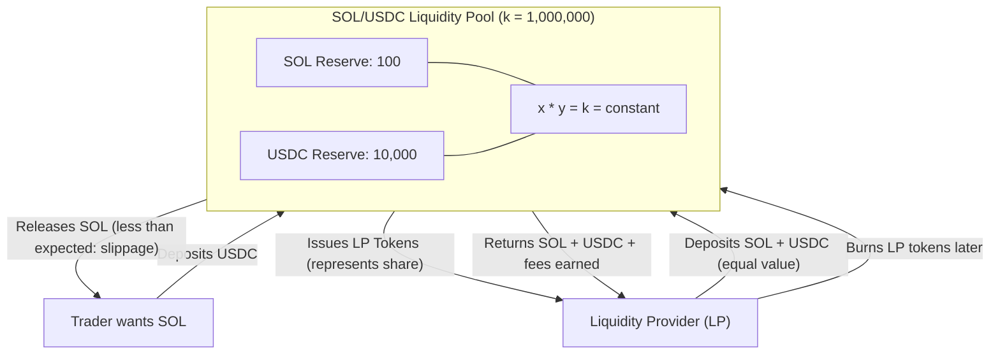
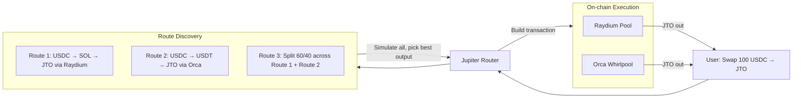
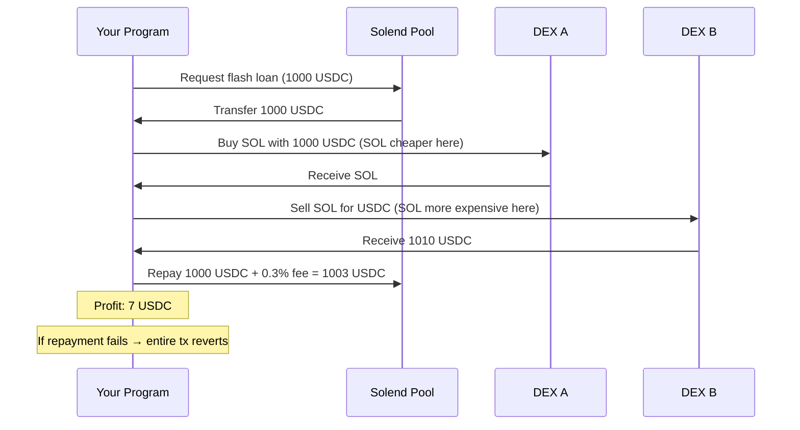

# Solana DeFi Fundamentals

> "DeFi is the internet of finance — open, permissionless, composable. Solana is the highway it runs on."

---

## 🌐 DeFi Hai Kya, Actually?

Zara socho — ek bank hai jisme koi employee nahi, koi head office nahi, opening hours nahi, aur koi permission slip bhi nahi lagti. Bas ek wallet hona chahiye, aur tum paisa deposit kar sakte ho, borrow kar sakte ho, assets trade kar sakte ho, ya interest kama sakte ho — automatically, kisi bhi time, duniya ke kisi bhi corner se.

Yahi hai DeFi: **Decentralized Finance**. Yaha bankers ki jagah code leta hai. Paperwork ki jagah smart contracts. Aur ledgers ki jagah blockchain.

Solana is vision ko kisi bhi doosri chain se better run karta hai. Chalo dekhte hai kyun.

---

## 🔥 Solana DeFi Alag Kyun Hai?

Zyada tar blockchains pe DeFi slow aur mehenga ho jaata hai — jaise IRCTC pe Tatkal booking, sab lag jaate hai lekin server hang ho jaata hai. Solana ko shuru se hi is tarah banaya gaya ki DeFi bilkul ek real financial app jaisa feel ho — fast aur smooth, jaise UPI payment karna.

| Feature | Ethereum | Solana |
|---|---|---|
| Transaction finality | ~12 seconds | ~400ms |
| Average tx fee | $1–$50+ | $0.00025 |
| TPS (sustained) | ~15–30 | ~4,000+ (65,000 theoretical) |
| Parallel execution | No (sequential EVM) | Yes (Sealevel) |
| Native composability | Limited | Deep (same runtime) |

**Solana DeFi ke teen pillars:**

1. **Fast** — trade confirm ho jaata hai palak jhapakte hi. Market makers tight spreads quote kar sakte hai.
2. **Cheap** — tum $5 ke tokens swap kar sakte ho bina $20 gas mein udaye.
3. **Composable** — ek transaction 5 alag protocols ke saath interact kar sakta hai. Flash loans, atomic swaps, liquidations — sab ek hi shot mein.

---

## 💱 DEX aur AMM: DeFi Ka Dil

### Analogy

Traditional exchanges (jaise NYSE) mein **order book** hota hai — buyers aur sellers apne bids aur asks post karte hai, aur jab match hota hai tab trade hota hai. Isme market makers chahiye jo pura din baithe orders post karte rahe.

**AMM (Automated Market Maker)** order book ko replace karta hai ek **pool of two tokens aur ek math formula** se. Koi insaan chahiye hi nahi. Koi bhi 24/7 us pool ke against trade kar sakta hai — bilkul Zomato pe khana order karne jaisa, no waiting for a human to take your order.

### x * y = k Formula

Ye DeFi ka sabse important equation hai. Zara slowly padhna.

```
x * y = k
```

- `x` = Pool mein Token A ki amount
- `y` = Pool mein Token B ki amount
- `k` = ek constant jo kabhi change nahi hota

**Example:** Ek SOL/USDC pool shuru hota hai 100 SOL aur 10,000 USDC ke saath.

```
k = 100 * 10,000 = 1,000,000
```

Tumhe 10 SOL kharidna hai. Trade ke baad pool mein 90 SOL bachega. Toh USDC kitna chahiye?

```
90 * y = 1,000,000
y = 11,111 USDC
```

Toh ab pool mein 90 SOL aur 11,111 USDC hai. Tumne **10 SOL ke liye 1,111 USDC** diye — matlab effectively $111.11 per SOL (jabki starting price $100 tha). Ye extra cost ko kehte hai **price impact** ya **slippage** — tumne trade karke market ko hila diya, bilkul jaise IRCTC pe last seat book karne ke chakkar mein price badh jaata hai.

### AMM Liquidity Pool Diagram



### Impermanent Loss — LP Banne Ka Chhupa Hua Cost

Ab dard wala part sunlo. Jab tum liquidity provide karte ho, tum dono tokens deposit karte ho. Agar ek token ka price bahut zyada change ho jaaye, toh better hota agar tum bas tokens ko hold kar lete instead of pool mein dalna.

**Analogy:** Socho tumne apne fruit stall mein $1,000 equally apple aur santre mein invest kiya. Ab apple ka price 4x ho gaya. Arbitrageurs tumhare stall se sasta apple kharidne aa jaayenge jab tak ratio wapas balance na ho jaaye. End mein tumhare paas apple kam bachenge us se jitna agar tumne bas hold kiya hota. Holding ke comparison mein ye jo loss hai, usko kehte hai **impermanent loss** (IL).

| Price Change (one token) | Impermanent Loss |
|---|---|
| 1.25x | 0.6% |
| 1.5x | 2.0% |
| 2x | 5.7% |
| 4x | 20.0% |
| 10x | 42.5% |

Ye loss "impermanent" isliye hai kyunki agar price wapas original ratio pe aa jaaye, toh loss gayab ho jaata hai. Lekin agar tum price different hone ke waqt withdraw kar lo, toh loss permanent ho jaata hai.

**Trader fees** se jo income aati hai, wo IL ko offset karti hai. High-volume pools (jaise USDC/USDT stablecoins) mein IL bilkul nahi ke barabar hota hai lekin fees bahut milti hai.

> [!tip]
> Stable pairs mein LP banna kaafi safe hota hai kyunki dono tokens ka price roughly same rehta hai — IL ka risk minimal hai.

---

## 🌊 Raydium aur Orca: Solana Ke Big DEXes

### Raydium

Raydium sabse purana aur sabse bada AMM hai Solana pe. Isko unique kya banata hai:

- Serum's (ab OpenBook) **central limit order book** ko AMM pools ke saath use karta hai
- LPs ko fees milti hai AMM trades AUR order book activity, dono se
- Concentrated Liquidity Market Maker (CLMM) pools — LPs price range choose kar sakte hai (Uniswap v3 jaisa)
- Zyada tar Solana DeFi protocols ke saath deep integration

### Orca

Orca developer-friendly aur user-friendly hone ke liye jaana jaata hai:

- **Whirlpools** — Orca ka concentrated liquidity product (Uniswap v3 jaisa)
- Clean SDK, badhiya documentation
- Stablecoin aur LST (liquid staking token) pairs mein high TVL
- Jupiter isko routing ke liye heavily use karta hai

### Kab Use Karo Raydium vs Orca

| Scenario | Use |
|---|---|
| Naya token pool banana hai | Raydium (naye tokens ke liye kam friction) |
| Concentrated liquidity badhiya tooling ke saath chahiye | Orca Whirlpools |
| Order-book style features bhi chahiye | Raydium |
| LP position management wala protocol bana rahe ho | Orca (cleaner SDK) |

---

## 🪐 Jupiter Aggregator: Smart Router

### Analogy

Jab tum flight search karte ho, tum har airline ki website ek-ek karke nahi check karte. Tum Google Flights ya Kayak use karte ho — wo sab airlines check karke best route aur price dhoond deta hai, kabhi kabhi do flights combine karke bhi direct fare se sasta deal deta hai.

Jupiter yahi kaam karta hai token swaps ke liye. Manually har DEX pe best price dhoondne ke bajaye, Jupiter **har pool, har DEX pe check karta hai aur optimal route nikaalta hai** — kabhi trade ko multiple DEXes mein split karke, kabhi intermediate tokens se hop karke, taaki tumhe best deal mile.

### Jupiter Andar Se Kaise Kaam Karta Hai



Jupiter **off-chain quote computation** (fast) + **on-chain execution** (trustless) use karta hai. Ye:
1. Sab pool states off-chain padhta hai
2. Routing algorithms chalaake best output dhoondta hai
3. Sab kuch ek atomic Solana transaction mein pack karta hai
4. Agar koi bhi leg fail ho, poora transaction fail ho jaata hai — tum kabhi half-swap mein phasoge nahi

### Jupiter SDK Se Programmatically Swap Karna

```typescript
import { createJupiterApiClient } from "@jup-ag/api";
import {
  Connection,
  Keypair,
  VersionedTransaction,
  PublicKey,
} from "@solana/web3.js";

const connection = new Connection("https://api.mainnet-beta.solana.com");
const jupiterApi = createJupiterApiClient();

async function swapUSDCtoSOL(
  wallet: Keypair,
  usdcAmountInSmallestUnit: number // 1 USDC = 1_000_000 (6 decimals)
) {
  const USDC_MINT = "EPjFWdd5AufqSSqeM2qN1xzybapC8G4wEGGkZwyTDt1v";
  const SOL_MINT = "So11111111111111111111111111111111111111112"; // Wrapped SOL

  // Step 1: Jupiter se best quote lo
  const quote = await jupiterApi.quoteGet({
    inputMint: USDC_MINT,
    outputMint: SOL_MINT,
    amount: usdcAmountInSmallestUnit,
    slippageBps: 50, // 0.5% slippage tolerance
  });

  console.log(
    `Best route: ${quote.routePlan.map((r) => r.swapInfo.label).join(" → ")}`
  );
  console.log(
    `Output: ${Number(quote.outAmount) / 1e9} SOL`
  );
  console.log(
    `Price impact: ${quote.priceImpactPct}%`
  );

  // Step 2: Swap transaction lo
  const swapResponse = await jupiterApi.swapPost({
    swapRequest: {
      quoteResponse: quote,
      userPublicKey: wallet.publicKey.toBase58(),
      wrapAndUnwrapSol: true, // SOL ko auto wrap/unwrap kar dega
      dynamicComputeUnitLimit: true, // CU usage optimize karta hai
      prioritizationFeeLamports: 1000, // Priority fee, taaki fast land ho
    },
  });

  // Step 3: Transaction deserialize karke sign karo
  const swapTransactionBuf = Buffer.from(
    swapResponse.swapTransaction,
    "base64"
  );
  const transaction = VersionedTransaction.deserialize(swapTransactionBuf);
  transaction.sign([wallet]);

  // Step 4: Send karo aur confirm karo
  const txId = await connection.sendRawTransaction(transaction.serialize(), {
    skipPreflight: false,
    maxRetries: 3,
  });

  await connection.confirmTransaction(txId, "confirmed");
  console.log(`Swap confirmed: https://solscan.io/tx/${txId}`);
  return txId;
}
```

---

## 📖 On-Chain Accounts Se Pool State Padhna

Har DEX pool ek Solana account hi hai jisme structured data hota hai. Tum use directly padh sakte ho.

```typescript
import { Connection, PublicKey } from "@solana/web3.js";
import { AmmV3, PoolUtils } from "@raydium-io/raydium-sdk";

const connection = new Connection("https://api.mainnet-beta.solana.com");

// Example: Raydium CLMM pool state padho
async function readRaydiumPoolState(poolId: string) {
  const poolPubkey = new PublicKey(poolId);
  const accountInfo = await connection.getAccountInfo(poolPubkey);

  if (!accountInfo) throw new Error("Pool not found");

  // Raydium SDK se pool state decode karo
  const poolState = AmmV3.decodePoolState(accountInfo.data);

  console.log({
    tokenA: poolState.tokenMint0.toBase58(),
    tokenB: poolState.tokenMint1.toBase58(),
    currentPrice: poolState.sqrtPriceX64.toString(),
    liquidity: poolState.liquidity.toString(),
    feeRate: poolState.ammConfig.tradeFeeRate,
    tickCurrent: poolState.tickCurrent,
  });
}

// Example: Orca Whirlpool state padho
import { WhirlpoolContext, buildWhirlpoolClient, ORCA_WHIRLPOOL_PROGRAM_ID } from "@orca-so/whirlpools-sdk";
import { AnchorProvider } from "@coral-xyz/anchor";

async function readOrcaWhirlpoolState(whirlpoolAddress: string) {
  const provider = AnchorProvider.env();
  const ctx = WhirlpoolContext.from(
    provider.connection,
    provider.wallet,
    ORCA_WHIRLPOOL_PROGRAM_ID
  );
  const client = buildWhirlpoolClient(ctx);

  const pool = await client.getPool(new PublicKey(whirlpoolAddress));
  const data = pool.getData();

  console.log({
    tokenA: data.tokenMintA.toBase58(),
    tokenB: data.tokenMintB.toBase58(),
    liquidity: data.liquidity.toString(),
    sqrtPrice: data.sqrtPrice.toString(),
    currentTickIndex: data.tickCurrentIndex,
    feeRate: data.feeRate, // hundredths of a bip mein
  });
}
```

---

## 💰 Lending Protocols: Solend aur MarginFi

### Analogy

Ek pawn shop (girvi rakhne wali dukaan) ke baare mein socho. Tum apni valuable cheez (watch) le jaate ho. Wo tumhe cash dete hai — lekin full value nahi, shayad 70%. Agar tum repay nahi karte, wo watch rakh lete hai. Agar watch ki value raatorat girne lagi, wo turant use bech dete hai taaki unka loss na ho.

Lending protocols bhi bilkul aise hi kaam karte hai. Tum collateral deposit karte ho, uske against ek percentage borrow karte ho (LTV — Loan-to-Value), aur agar collateral ki value bahut neeche gir jaaye, toh **liquidators** automatically tumhara debt repay karke tumhara collateral le lete hai.

### Step-by-Step Kaise Kaam Karta Hai

```
1. 10 SOL ($1,500 value ka) collateral deposit karo
2. 75% LTV tak borrow karo → up to $1,125 USDC
3. Ab tumhare paas $1,125 USDC hai + 10 SOL (locked) still "tumhare" hai
4. SOL ka price gir gaya $100 tak → tumhara collateral ab $1,000 ka reh gaya
5. Tumhara loan ab undercollateralized ho gaya (LTV > max)
6. Liquidator tumhara USDC debt repay karta hai, discount pe tumhara SOL le leta hai (liquidation bonus)
7. Tum apna collateral kho dete ho. Isko liquidation kehte hai.
```

### Solend

Solend Solana ka original lending protocol hai:

- Risky assets ke liye isolated pools (contagion limit karne ke liye)
- Blue-chip assets (SOL, ETH, BTC, USDC) ke liye Main Pool
- Flash loans (kitni bhi amount borrow karo, usi transaction mein repay karo)
- cTokens: USDC deposit karo, cUSDC milta hai jo interest accrue karta hai

### MarginFi

MarginFi (mrgn) newer, zyada composable alternative hai:

- **Health factor** based system (sirf LTV nahi)
- **Points system** — deposit/borrow karne se MRGN points milte hai
- Better SDK aur developer experience
- Jupiter ke saath integrated liquidation routes ke liye
- Cross-collateralization support karta hai multiple accounts ke across

### Kab Use Karo Solend vs MarginFi

| Need | Use |
|---|---|
| Battle-tested protocol, highest TVL | Solend |
| Better developer SDK | MarginFi |
| Points/airdrops exposure | MarginFi |
| Flash loans | Dono (dono support karte hai) |
| Risky token ke liye isolated pool | Solend |

---

## 🌾 Yield Farming Basics

Yield farming matlab apne assets ko kaam pe lagana taaki aur assets kama sako.

**Stack samjho:**

1. **Base yield** — MarginFi pe USDC deposit karo → borrowers se interest kamao
2. **LP yield** — Orca pe SOL/USDC provide karo → trading fees kamao
3. **Incentive yield** — kuch protocols liquidity attract karne ke liye extra tokens (emissions) dete hai
4. **Stacked yield** — apna Orca LP token lo aur kisi doosre protocol pe deposit kardo aur bhi zyada yield ke liye

**Risks:**
- **Smart contract risk** — protocol hack ho sakta hai
- **Impermanent loss** — prices diverge ho jaate hai, holding ke comparison mein value kam ho jaati hai
- **Token inflation** — farming rewards jis token mein milte hai wo zero tak bhi ja sakta hai
- **Liquidation risk** — agar tum farm karne ke liye borrow karte ho, tumhara collateral wipe ho sakta hai

---

## 🪙 Stablecoins on Solana

### USDC (USD Coin)

- Circle issue karta hai, fully backed hai USD + short-term treasuries se
- Solana pe sabse liquid stablecoin
- Native USDC on Solana (bridged nahi) — DeFi ke liye ise hi use karo
- Mint: `EPjFWdd5AufqSSqeM2qN1xzybapC8G4wEGGkZwyTDt1v`

### USDe (Ethena)

- Synthetic dollar protocol — real USD se backed nahi hai
- **Delta-neutral positions** se backed hai: long staked ETH + short ETH perp futures
- Perpetual futures ka funding rate hi yield ke roop mein milta hai
- USDC se zyada yield deta hai lekin basis risk aur smart contract risk carry karta hai
- Solana pe bridging ke through growing presence

### Kaunsa Kab Use Karna Hai

| Use Case | Stablecoin |
|---|---|
| DeFi trading, payments, LP | USDC (safest, sabse liquid) |
| Stablecoins pe yield kamana | USDe (higher APY, zyada risk) |
| Collateral on Solend/MarginFi | USDC preferred |
| International transfers | USDC (widely supported) |

---

## 🚀 Jito: Solana Pe MEV

### Analogy

Socho ek stock exchange hai jahan traders tumhara order fill hone se pehle hi dekh sakte hai aur jaldi se apna order aage laga dete hai profit kamane ke liye. Isko kehte hai **MEV (Maximal Extractable Value)** — transactions ko reorder, insert, ya censor karke nikala gaya paisa.

Ethereum pe MEV chaotic hai — bots high gas fees pay karke compete karte hai, jisse network jaam ho jaata hai. Jito Solana pe **organized MEV** leke aaya.

### Jito Kya Karta Hai

Jito ne ek **modified Solana validator client** banaya jo **block engine** support karta hai — ek marketplace jahan searchers (MEV bots) **bundles** submit karte hai transactions ke jisme **tips** hoti hai, taaki atomically include ho jaaye.

```
Normal Solana tx flow:
  Wallet → RPC → Leader Validator → Block

Jito tx flow:
  Searcher Bundle (with tip) → Jito Block Engine → Jito Validator → Block
```

**Key concepts:**

- **Bundle** — up to 5 transactions ka group jo atomically aur order mein execute hona chahiye. Agar ek bhi fail ho, sab fail.
- **Tip** — validator ko diya gaya SOL (Jito ise validators aur stakers mein distribute karta hai)
- **Jito-Solana** — modified validator client (~60-70% Solana validators isse run karte hai)
- **Jito Labs Block Engine** — block space ke liye off-chain auction

### Developer Hoke Tumhe Iski Parwah Kyun Karni Chahiye

Agar tum bot bana rahe ho (arbitrage, liquidation), tumhe Jito chahiye hi chahiye:

```typescript
import { Connection, Keypair, Transaction, SystemProgram } from "@solana/web3.js";
import { SearcherClient, searcherClient } from "jito-ts/dist/sdk/block-engine/searcher";
import { Bundle } from "jito-ts/dist/sdk/block-engine/types";

// Jito Block Engine se connect karo
const client = searcherClient(
  "frankfurt.mainnet.block-engine.jito.wtf",
  YOUR_KEYPAIR // Auth keypair
);

async function sendBundleWithTip(
  transactions: Transaction[],
  tipLamports: number
) {
  // Tip transaction add karo (validator ko pay karta hai)
  const tipAccounts = await client.getTipAccounts();
  const tipAccount = tipAccounts[Math.floor(Math.random() * tipAccounts.length)];

  const tipTx = new Transaction().add(
    SystemProgram.transfer({
      fromPubkey: wallet.publicKey,
      toPubkey: new PublicKey(tipAccount),
      lamports: tipLamports, // e.g., 10_000 = 0.00001 SOL
    })
  );

  // Bundle: tumhare txs + tip tx
  const bundle = new Bundle([...transactions, tipTx], 5);

  const bundleId = await client.sendBundle(bundle);
  console.log(`Bundle sent: ${bundleId}`);
}
```

### Jito Kab Use Karo

| Scenario | Jito Use Karo? |
|---|---|
| Regular user swap | Nahi — normal RPC theek hai |
| Liquidation bot | Haan — atomicity aur speed chahiye |
| Arbitrage bot | Haan — tips ke saath compete karo |
| High-frequency trading | Haan |
| NFT mint bot | Haan |

---

## 🔮 Pyth Network: Solana Pe Price Oracles

### Analogy

Smart contracts on-chain rehte hai. SOL ka price off-chain rehta hai. Toh ek lending protocol ko kaise pata chalega ki tumhara collateral undercollateralized hai ya nahi? Isko chahiye ek **trusted price feed** — yahi hota hai oracle.

Pyth blockchains ke liye Bloomberg Terminal jaisa hai — ye dozens institutional market makers se prices collect karta hai aur real-time mein on-chain publish karta hai.

### Pyth Kaise Kaam Karta Hai

```
Data Providers (Virtu, Jump, Jane Street, etc.)
    ↓ (raw prices + confidence intervals publish karte hai)
Pyth Aggregator (on-chain Solana program)
    ↓ (aggregate karta hai, confidence-weighted median compute karta hai)
Price Account (koi bhi program isse padh sakta hai)
    ↓
Tumhara Protocol (transaction ke dauran price padhta hai)
```

Price updates **har ~400ms mein on-chain push** hote hai ek Pyth publisher program se. Programs price account ko transaction execution ke dauran padhte hai.

### Apne Program Mein Pyth Prices Padhna

```rust
// Tumhare Solana program mein (Anchor)
use pyth_sdk_solana::load_price_feed_from_account_info;

#[derive(Accounts)]
pub struct LiquidatePosition<'info> {
    /// CHECK: Pyth price account for SOL/USD
    pub pyth_sol_price: AccountInfo<'info>,
    // ... other accounts
}

pub fn liquidate_position(ctx: Context<LiquidatePosition>) -> Result<()> {
    // Account se price feed load karo
    let price_feed = load_price_feed_from_account_info(&ctx.accounts.pyth_sol_price)
        .map_err(|_| ErrorCode::InvalidPriceFeed)?;

    // Latest price lo (production mein get_price_unchecked kabhi use mat karo)
    let price = price_feed
        .get_price_no_older_than(60) // Max 60 seconds purana
        .ok_or(ErrorCode::StalePriceFeed)?;

    let sol_price_usd = price.price; // i64, 10^expo se scaled
    let confidence = price.conf; // Uncertainty range
    let expo = price.expo; // Typically -8

    // Actual USD price mein convert karo
    let actual_price = (sol_price_usd as f64) * 10f64.powi(expo);

    msg!("SOL price: ${:.4}", actual_price);
    msg!("Confidence: ±${:.4}", (confidence as f64) * 10f64.powi(expo));

    // Hamesha confidence check karo — agar spread bahut wide hai, trade mat karo
    let max_confidence_ratio = 0.01; // 1%
    let confidence_ratio = confidence as f64 / sol_price_usd.abs() as f64;
    require!(
        confidence_ratio < max_confidence_ratio,
        ErrorCode::PriceTooUncertain
    );

    // Ab is price ko apni liquidation logic ke liye use karo
    // ...

    Ok(())
}
```

**Pyth ke key concepts:**

- **Confidence interval** — Pyth sirf ek price nahi deta, ek range deta hai. Isko use karo! Zyada uncertainty matlab execute mat karo.
- **Price expo** — price `price * 10^expo` ke roop mein store hota hai. SOL/USD ka expo typically -8 hota hai.
- **Age check** — hamesha `get_price_no_older_than()` use karo. Stale price ko exploit kiya ja sakta hai.

**Mainnet pe important Pyth price feed addresses:**

| Asset | Price Feed Address |
|---|---|
| SOL/USD | `H6ARHf6YXhGYeQfUzQNGk6rDNnLBQKrenN712K4AQJEG` |
| BTC/USD | `GVXRSBjFk6e6J3NbVPXohDJetcTjaeeuykUpbQF8UoMU` |
| ETH/USD | `JBu1AL4obBcCMqKBcHyycK4xaSZVCehAt4Kez9dRd5SE` |
| USDC/USD | `Gnt27xtC473ZT2Mw5u8wZ68Z3gULkSTb5DuxJy7eJotD` |

> [!warning]
> Kabhi bhi `get_price_unchecked()` production mein use mat karo, aur confidence interval ko ignore mat karo — warna ek narrow window mein manipulated price se tumhara protocol drain ho sakta hai.

---

## ⚡ Flash Loans on Solana

### Analogy

Socho tum bank se $1 million borrow kar sakte ho, lekin usi second mein wapas karna padega — nahi toh transaction cancel ho jaayega jaise hua hi nahi. Us $1M ka use tum us ek second mein kuch bhi karne ke liye kar sakte ho: arbitrage, liquidations, collateral swaps. Isko kehte hai flash loan.

Traditional blockchains pe ye impossible lagta hai, lekin Solana (aur Ethereum) mein ek "transaction" ke andar kai steps ho sakte hai. Flash loans is tarah kaam karte hai:

1. Lending pool se tokens borrow karo
2. Jo chaho karo unke saath (swap, liquidate, etc.)
3. Usi transaction mein loan + fee repay karo
4. Agar step 3 fail ho jaaye, poora transaction revert ho jaata hai — pool ka kabhi loss nahi hota

### Flash Loan Flow



### Solend Ke Saath Flash Loan (Simplified)

```typescript
// Solend pe flash loans CPI (Cross-Program Invocation) ke through hote hai
// Pool transaction ke end mein check karta hai ki borrowed
// amount + fee wapas mili ya nahi.

// High-level structure (samajhne ke liye pseudo-code):
async function executeFlashLoan() {
  const instructions = [
    // 1. Borrow instruction — Solend USDC transfer karta hai tumhare account mein
    solendFlashBorrowInstruction({
      amount: 1_000_000_000, // 1000 USDC (6 decimals)
      reserve: SOLEND_USDC_RESERVE,
      destinationLiquidityAccount: yourUsdcAccount,
      program: SOLEND_PROGRAM_ID,
    }),

    // 2. Yahan tumhara arbitrage/liquidation logic aayega
    // ... DEX A pe swap ...
    // ... DEX B pe swap ...

    // 3. Repay instruction — tum USDC + fee wapas karte ho
    // Solend validate karta hai: final balance >= initial balance + fee
    solendFlashRepayInstruction({
      amount: 1_000_000_000, // Same amount
      borrowInstructionIndex: 0, // Borrow ix ko point karta hai
      reserve: SOLEND_USDC_RESERVE,
      sourceLiquidityAccount: yourUsdcAccount,
      program: SOLEND_PROGRAM_ID,
    }),
  ];

  // Ek atomic transaction ke roop mein bhejo
  // Agar repay fail ho → poora tx revert → pool safe
  const tx = new Transaction().add(...instructions);
  await sendAndConfirmTransaction(connection, tx, [wallet]);
}
```

### Flash Loans Kab Sense Banate Hai / Kab Nahi

| Kab use karo | Kab NAHI use karo |
|---|---|
| DEXes ke beech arbitrage (profitable ho toh risk-free) | Random speculation — clear profit path chahiye |
| Self-liquidation (penalty se bachne ke liye apna loan repay karna) | Jab tumhare paas already capital ho — fee unnecessary cost hai |
| Collateral swap (atomically collateral type change karna) | Jab tak tum code karo, opportunity gayab ho chuki ho |
| Protocol liquidations | MEV protection (Jito) ke bina — bots tumhe front-run kar denge |

---

## 🔗 Sab Kuch Kaise Compose Hota Hai Saath Mein

Solana DeFi ki real power ye hai ki ye saare pieces ek hi transaction mein saath kaam karte hai:

```
Ek Transaction:
  1. MarginFi se USDC flash loan lo
  2. Jupiter se USDC → SOL swap karo (Raydium + Orca ke across best route dhoondega)
  3. SOL ko Solend pe collateral ke roop mein deposit karo
  4. Solend se USDC borrow karo
  5. MarginFi ko flash loan repay karo
  6. Profit: ab tumhare paas leveraged SOL exposure hai bina koi starting capital lagaye
```

Yahi hai **DeFi composability** — har protocol ek building block hai. Tumhara program inko sabko sequence mein CPIs use karke call karta hai. Ek step fail hua toh sab kuch revert ho jaata hai — bilkul Swiggy order jaisa jahan restaurant confirm na kare toh poora order hi cancel ho jaata hai.

---

## Key Takeaways

- **AMM formula x*y=k** pool reserves se price decide karta hai. Bade trades matlab zyada slippage. Hamesha price impact check karo.

- **Impermanent loss** har LP ko affect karta hai. Stable pairs (USDC/USDT) mein almost nahi hota; volatile pairs mein significant IL ho sakta hai. Fee income isko offset karni chahiye.

- **Jupiter** swaps ke liye go-to aggregator hai — DEXes ko directly call karne ke bajaye inka SDK use karo. Ye routing, slippage, aur transaction building khud handle karta hai.

- **Lending protocols** (Solend, MarginFi) tumhe collateral deposit karke borrow karne dete hai. Apna health factor dekhte raho — liquidation permanent aur costly hota hai.

- **Jito** bots ke liye mandatory hai. Agar tum arbitrage ya liquidations Jito bundles ke bina kar rahe ho, toh Jito tips wale faster bots tumhe front-run kar denge.

- **Pyth oracles** se on-chain programs ko real-world prices milte hai. Hamesha confidence interval aur price age check karo — kabhi bhi stale ya wide-spread price feed pe bharosa mat karo.

- **Flash loans** zero-capital atomic operations allow karte hai. Arbitrage aur self-liquidation ke liye powerful hai lekin profitable path chahiye hi chahiye — koi "free" borrow nahi hota.

- **Composability** Solana ka superpower hai. Ek hi transaction mein protocols stack karo: flash loan → swap → deposit → borrow → repay. Agar koi bhi step fail ho, sab atomically revert ho jaata hai.

---

*Next chapter: Building Your Own AMM Pool from Scratch on Solana*
