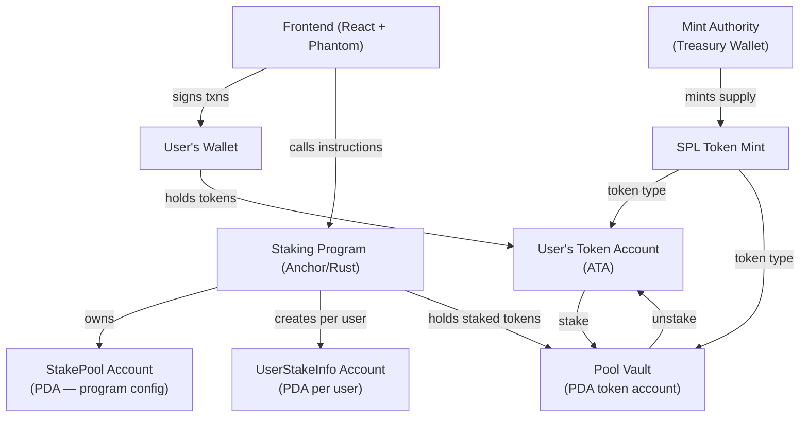
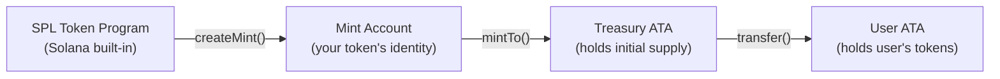
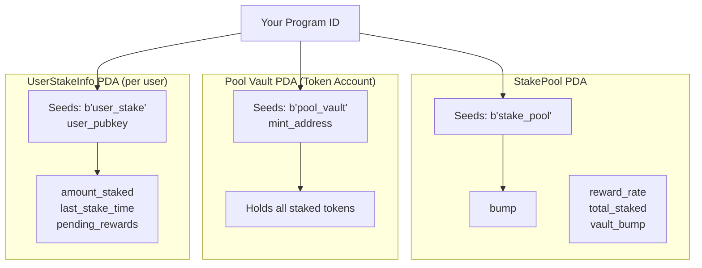
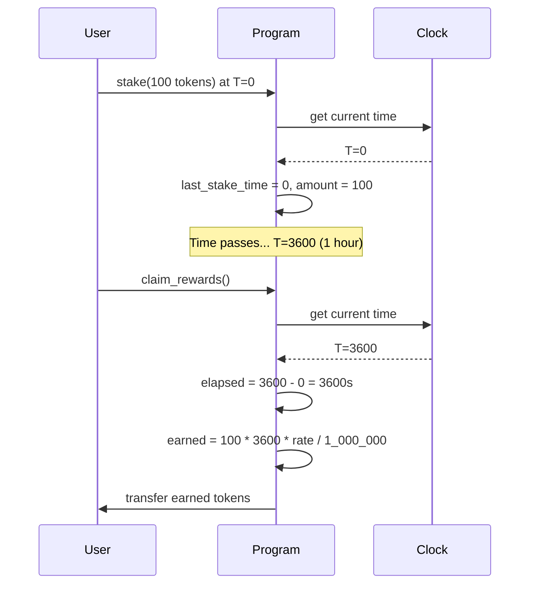
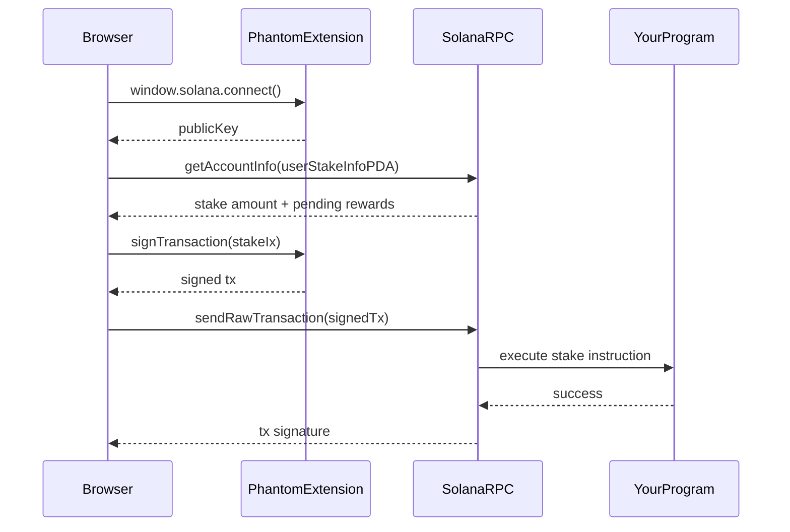
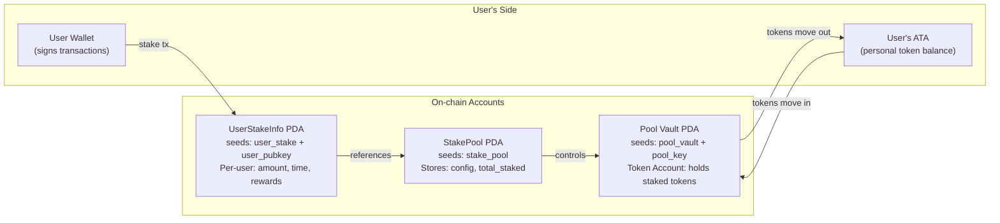

# Build a Solana Token + Staking Program

> A complete, production-style project: custom SPL token + staking program where users lock tokens to earn time-weighted rewards.

---

## 🗺️ What We Are Building

Imagine a bank that pays you interest for keeping your money deposited. The longer your money stays in, the more interest you earn. That is exactly what a staking program does — except instead of a bank, the rules live in immutable code on Solana.

By the end of this chapter you will have:

1. A custom SPL token (your project's currency)
2. An Anchor smart contract where users stake that token and earn rewards over time
3. A minimal TypeScript frontend that connects Phantom wallet and calls your program

---

## 🧭 Full Architecture Overview



---

## 🏗️ Part 1 — Create a Custom SPL Token

### What is an SPL Token?

Think of Solana's token standard (SPL) like a factory blueprint. The blueprint (the Token Program) already knows how to make any token. You just tell it: "I want a token with 9 decimal places, and I am the only one who can mint new ones." The factory stamps out a **Mint account** — the master record of your token.



### Key Concepts Before You Code

| Term | Real-World Analogy | What it Does |
|------|-------------------|--------------|
| Mint | The printing press | The authority that creates new tokens |
| Mint Authority | The person who owns the press | Only this keypair can mint new tokens |
| ATA (Associated Token Account) | Your bank account for one currency | Holds a specific token for one wallet |
| Freeze Authority | A lock on the press | Can freeze token accounts (optional) |

### When to Use a Custom Token

**Use when:**
- You are building a DeFi protocol, game, or DAO that needs its own currency
- You want users to earn, spend, or stake a unit of value specific to your project

**Do NOT use when:**
- You just need to transfer SOL — use SOL directly
- You are building a simple NFT — use Metaplex instead

---

### 📦 Setup: Install Dependencies

```bash
# Create project folder
mkdir solana-staking-project && cd solana-staking-project

# Initialize Node project
npm init -y

# Install Solana + SPL token tools
npm install @solana/web3.js @solana/spl-token ts-node typescript dotenv

# Install Anchor for the staking program
cargo install --git https://github.com/coral-xyz/anchor avm --locked
avm install latest && avm use latest
anchor init staking-program
```

---

### 📝 TypeScript: Create and Deploy Your Token

Create `scripts/create-token.ts`:

```typescript
import {
  Connection,
  Keypair,
  PublicKey,
  clusterApiUrl,
} from "@solana/web3.js";
import {
  createMint,
  getOrCreateAssociatedTokenAccount,
  mintTo,
  getMint,
} from "@solana/spl-token";
import * as fs from "fs";

// ─── 1. Connect to Devnet ────────────────────────────────────────────────────
// Think of this like dialing into the Solana network's test environment
const connection = new Connection(clusterApiUrl("devnet"), "confirmed");

// ─── 2. Load your treasury wallet keypair ───────────────────────────────────
// This wallet becomes the Mint Authority — it can mint new tokens
// NEVER commit your real keypair to git
const rawKeypair = JSON.parse(fs.readFileSync("./treasury-keypair.json", "utf8"));
const treasuryWallet = Keypair.fromSecretKey(Uint8Array.from(rawKeypair));

async function createToken() {
  console.log("Treasury wallet:", treasuryWallet.publicKey.toBase58());

  // ─── 3. Create the Mint ───────────────────────────────────────────────────
  // decimals: 9 means 1 token = 1_000_000_000 smallest units (like lamports for SOL)
  // mintAuthority: only this keypair can create new tokens
  // freezeAuthority: null means no one can freeze token accounts
  const mint = await createMint(
    connection,
    treasuryWallet,         // payer of the transaction fee
    treasuryWallet.publicKey, // mint authority
    null,                   // freeze authority (null = disabled)
    9                       // decimal places
  );

  console.log("Mint created:", mint.toBase58());

  // ─── 4. Create Treasury's Token Account ──────────────────────────────────
  // ATA = Associated Token Account — the "wallet slot" for this specific token
  // getOrCreate means: if treasury already has one, reuse it
  const treasuryATA = await getOrCreateAssociatedTokenAccount(
    connection,
    treasuryWallet,
    mint,
    treasuryWallet.publicKey
  );

  console.log("Treasury ATA:", treasuryATA.address.toBase58());

  // ─── 5. Mint Initial Supply ───────────────────────────────────────────────
  // Mint 1,000,000 tokens to treasury (multiply by 10^9 for decimals)
  const INITIAL_SUPPLY = 1_000_000 * 10 ** 9;

  await mintTo(
    connection,
    treasuryWallet,           // payer
    mint,                     // the mint
    treasuryATA.address,      // destination
    treasuryWallet,           // mint authority (must sign)
    INITIAL_SUPPLY
  );

  console.log(`Minted 1,000,000 tokens to treasury`);

  // ─── 6. Verify on-chain ───────────────────────────────────────────────────
  const mintInfo = await getMint(connection, mint);
  console.log("Total supply:", Number(mintInfo.supply) / 10 ** 9);

  // Save mint address for use in staking program
  fs.writeFileSync(
    "./mint-address.json",
    JSON.stringify({ mint: mint.toBase58() })
  );
}

createToken().catch(console.error);
```

Run it:

```bash
# First generate a treasury keypair
solana-keygen new --outfile treasury-keypair.json

# Airdrop SOL for fees (devnet only)
solana airdrop 2 $(solana-keygen pubkey treasury-keypair.json) --url devnet

# Create the token
npx ts-node scripts/create-token.ts
```

---

## ⚙️ Part 2 — Staking Anchor Program (Rust)

### How Staking Works — The Analogy

Picture a coat check at a restaurant. You hand over your coat (tokens), get a ticket (UserStakeInfo account), and when you return, you get your coat back PLUS a tip that grew the longer you left it. The coat room (Pool Vault) is locked — only the staking program can open it.

### PDA Structure

PDAs (Program Derived Addresses) are accounts owned by your program. No private key exists for them — the program itself is the only one who can move funds out.



---

### Full Anchor Program

Inside `staking-program/programs/staking-program/src/lib.rs`:

```rust
use anchor_lang::prelude::*;
use anchor_spl::token::{self, Mint, Token, TokenAccount, Transfer};

// ─── Program ID ──────────────────────────────────────────────────────────────
// Anchor generates this when you run `anchor build` for the first time
// Replace with your actual program ID after first build
declare_id!("YourProgramIDHere1111111111111111111111111111");

// ─── Constants ────────────────────────────────────────────────────────────────
// Reward rate: how many token units (smallest unit) earned per second per staked unit
// Example: 1 = 1 lamport-equivalent per second per token
// In production you would tune this carefully
const REWARD_RATE: u64 = 1;

// ─── Program Entry Point ─────────────────────────────────────────────────────
#[program]
pub mod staking_program {
    use super::*;

    // =========================================================================
    // INSTRUCTION 1: initialize_pool
    // Called once by the admin to set up the staking pool.
    // Like opening the coat check room before customers arrive.
    // =========================================================================
    pub fn initialize_pool(ctx: Context<InitializePool>, reward_rate: u64) -> Result<()> {
        let pool = &mut ctx.accounts.stake_pool;

        // Store the admin who initialized — only admin can change pool settings
        pool.admin = ctx.accounts.admin.key();

        // Store which token this pool accepts
        pool.token_mint = ctx.accounts.token_mint.key();

        // Store the vault address so we can verify it later
        pool.vault = ctx.accounts.pool_vault.key();

        // How many reward units are given per second per staked token
        pool.reward_rate = reward_rate;

        // Nobody has staked yet
        pool.total_staked = 0;

        // Save the vault's bump so we can use it to sign transactions later
        // A "bump" is the number that makes a valid PDA address
        pool.vault_bump = ctx.bumps.pool_vault;

        // Save the pool's own bump for the same reason
        pool.bump = ctx.bumps.stake_pool;

        msg!("Staking pool initialized. Reward rate: {}", reward_rate);
        Ok(())
    }

    // =========================================================================
    // INSTRUCTION 2: stake
    // User deposits tokens into the pool vault.
    // Like handing your coat to the coat check.
    // =========================================================================
    pub fn stake(ctx: Context<Stake>, amount: u64) -> Result<()> {
        // ── Validate amount ──────────────────────────────────────────────────
        // You cannot stake zero tokens — that would be meaningless
        require!(amount > 0, StakingError::ZeroAmount);

        let pool = &mut ctx.accounts.stake_pool;
        let user_stake = &mut ctx.accounts.user_stake_info;

        // ── Get current time ─────────────────────────────────────────────────
        // Solana gives us the on-chain clock — this is trustworthy unlike a server clock
        let clock = Clock::get()?;
        let now = clock.unix_timestamp as u64;

        // ── Settle pending rewards BEFORE changing the stake amount ──────────
        // IMPORTANT: Always calculate rewards based on the OLD amount before adding more
        // If you add first then calculate, you would give too many rewards
        if user_stake.amount_staked > 0 {
            let time_elapsed = now - user_stake.last_stake_time;
            // Simple time-weighted reward formula:
            // rewards = amount_staked * time_elapsed * reward_rate
            // Division by a large number prevents overflow for small reward rates
            let earned = user_stake.amount_staked
                .checked_mul(time_elapsed)
                .ok_or(StakingError::MathOverflow)?
                .checked_mul(pool.reward_rate)
                .ok_or(StakingError::MathOverflow)?
                .checked_div(1_000_000)  // scale factor to keep numbers reasonable
                .ok_or(StakingError::MathOverflow)?;

            // Add earned rewards to pending balance (not distributed yet)
            user_stake.pending_rewards = user_stake.pending_rewards
                .checked_add(earned)
                .ok_or(StakingError::MathOverflow)?;
        }

        // ── Transfer tokens from user to vault ───────────────────────────────
        // The Transfer CPI (Cross-Program Invocation) calls the SPL Token program
        // to move tokens. The user must have signed this transaction.
        let transfer_ctx = CpiContext::new(
            ctx.accounts.token_program.to_account_info(),
            Transfer {
                from: ctx.accounts.user_token_account.to_account_info(),
                to: ctx.accounts.pool_vault.to_account_info(),
                authority: ctx.accounts.user.to_account_info(),  // user must sign
            },
        );
        token::transfer(transfer_ctx, amount)?;

        // ── Update user's stake record ────────────────────────────────────────
        user_stake.owner = ctx.accounts.user.key();
        user_stake.amount_staked = user_stake.amount_staked
            .checked_add(amount)
            .ok_or(StakingError::MathOverflow)?;

        // Reset the clock — rewards accumulate from THIS moment forward
        user_stake.last_stake_time = now;
        user_stake.bump = ctx.bumps.user_stake_info;

        // ── Update pool total ─────────────────────────────────────────────────
        pool.total_staked = pool.total_staked
            .checked_add(amount)
            .ok_or(StakingError::MathOverflow)?;

        msg!("User staked {} tokens. Total staked: {}", amount, pool.total_staked);
        Ok(())
    }

    // =========================================================================
    // INSTRUCTION 3: unstake
    // User withdraws their tokens + pending rewards.
    // Like claiming your coat and receiving a tip.
    // =========================================================================
    pub fn unstake(ctx: Context<Unstake>, amount: u64) -> Result<()> {
        require!(amount > 0, StakingError::ZeroAmount);

        let pool = &mut ctx.accounts.stake_pool;
        let user_stake = &mut ctx.accounts.user_stake_info;

        // ── Validate user has enough staked ──────────────────────────────────
        require!(
            user_stake.amount_staked >= amount,
            StakingError::InsufficientStake
        );

        let clock = Clock::get()?;
        let now = clock.unix_timestamp as u64;

        // ── Calculate final rewards before unstaking ─────────────────────────
        let time_elapsed = now - user_stake.last_stake_time;
        let earned = user_stake.amount_staked
            .checked_mul(time_elapsed)
            .ok_or(StakingError::MathOverflow)?
            .checked_mul(pool.reward_rate)
            .ok_or(StakingError::MathOverflow)?
            .checked_div(1_000_000)
            .ok_or(StakingError::MathOverflow)?;

        user_stake.pending_rewards = user_stake.pending_rewards
            .checked_add(earned)
            .ok_or(StakingError::MathOverflow)?;

        // ── Transfer staked tokens back to user ──────────────────────────────
        // IMPORTANT: The vault PDA cannot sign like a regular wallet.
        // We use "signer seeds" — the same seeds that created the PDA.
        // Anchor uses these to prove: "yes, our program controls this account."
        let pool_key = pool.key();
        let signer_seeds: &[&[&[u8]]] = &[&[
            b"pool_vault",
            pool_key.as_ref(),
            &[pool.vault_bump],
        ]];

        let transfer_ctx = CpiContext::new_with_signer(
            ctx.accounts.token_program.to_account_info(),
            Transfer {
                from: ctx.accounts.pool_vault.to_account_info(),
                to: ctx.accounts.user_token_account.to_account_info(),
                authority: ctx.accounts.pool_vault.to_account_info(), // PDA is authority
            },
            signer_seeds,  // PDA "signature" using seeds
        );
        token::transfer(transfer_ctx, amount)?;

        // ── Update records ────────────────────────────────────────────────────
        user_stake.amount_staked = user_stake.amount_staked
            .checked_sub(amount)
            .ok_or(StakingError::MathOverflow)?;

        user_stake.last_stake_time = now;

        pool.total_staked = pool.total_staked
            .checked_sub(amount)
            .ok_or(StakingError::MathOverflow)?;

        msg!("User unstaked {} tokens", amount);
        Ok(())
    }

    // =========================================================================
    // INSTRUCTION 4: claim_rewards
    // User claims accumulated rewards without touching their stake.
    // Like collecting interest without closing your savings account.
    // =========================================================================
    pub fn claim_rewards(ctx: Context<ClaimRewards>) -> Result<()> {
        let pool = &mut ctx.accounts.stake_pool;
        let user_stake = &mut ctx.accounts.user_stake_info;

        let clock = Clock::get()?;
        let now = clock.unix_timestamp as u64;

        // ── Calculate rewards since last action ───────────────────────────────
        let time_elapsed = now - user_stake.last_stake_time;
        let earned = user_stake.amount_staked
            .checked_mul(time_elapsed)
            .ok_or(StakingError::MathOverflow)?
            .checked_mul(pool.reward_rate)
            .ok_or(StakingError::MathOverflow)?
            .checked_div(1_000_000)
            .ok_or(StakingError::MathOverflow)?;

        let total_rewards = user_stake.pending_rewards
            .checked_add(earned)
            .ok_or(StakingError::MathOverflow)?;

        // ── Check there are rewards to claim ─────────────────────────────────
        require!(total_rewards > 0, StakingError::NoRewards);

        // ── Transfer rewards from vault to user ───────────────────────────────
        let pool_key = pool.key();
        let signer_seeds: &[&[&[u8]]] = &[&[
            b"pool_vault",
            pool_key.as_ref(),
            &[pool.vault_bump],
        ]];

        let transfer_ctx = CpiContext::new_with_signer(
            ctx.accounts.token_program.to_account_info(),
            Transfer {
                from: ctx.accounts.pool_vault.to_account_info(),
                to: ctx.accounts.user_token_account.to_account_info(),
                authority: ctx.accounts.pool_vault.to_account_info(),
            },
            signer_seeds,
        );
        token::transfer(transfer_ctx, total_rewards)?;

        // ── Reset reward tracking ─────────────────────────────────────────────
        user_stake.pending_rewards = 0;
        user_stake.last_stake_time = now;

        msg!("Claimed {} reward tokens", total_rewards);
        Ok(())
    }
}

// ─── Account Structs ─────────────────────────────────────────────────────────
// These describe WHICH accounts each instruction needs and HOW to validate them

// ── InitializePool accounts ───────────────────────────────────────────────────
#[derive(Accounts)]
pub struct InitializePool<'info> {
    // The admin who creates the pool — they pay for the new accounts
    #[account(mut)]
    pub admin: Signer<'info>,

    // The SPL token mint that users will stake
    pub token_mint: Account<'info, Mint>,

    // StakePool PDA: seeds = ["stake_pool"], owned by this program
    // init: create it now, space: how many bytes to allocate
    #[account(
        init,
        payer = admin,
        space = 8 + StakePool::INIT_SPACE,  // 8 = Anchor discriminator
        seeds = [b"stake_pool"],
        bump
    )]
    pub stake_pool: Account<'info, StakePool>,

    // Pool Vault: a token account PDA that will hold all staked tokens
    // token::mint = token_mint means this vault only accepts token_mint tokens
    // token::authority = pool_vault means the vault itself is the authority (PDA)
    #[account(
        init,
        payer = admin,
        token::mint = token_mint,
        token::authority = pool_vault,
        seeds = [b"pool_vault", stake_pool.key().as_ref()],
        bump
    )]
    pub pool_vault: Account<'info, TokenAccount>,

    pub token_program: Program<'info, Token>,
    pub system_program: Program<'info, System>,
    pub rent: Sysvar<'info, Rent>,
}

// ── Stake accounts ────────────────────────────────────────────────────────────
#[derive(Accounts)]
pub struct Stake<'info> {
    #[account(mut)]
    pub user: Signer<'info>,

    #[account(
        mut,
        seeds = [b"stake_pool"],
        bump = stake_pool.bump
    )]
    pub stake_pool: Account<'info, StakePool>,

    // UserStakeInfo PDA: one per user per pool
    // init_if_needed: create on first stake, reuse on subsequent stakes
    #[account(
        init_if_needed,
        payer = user,
        space = 8 + UserStakeInfo::INIT_SPACE,
        seeds = [b"user_stake", user.key().as_ref()],
        bump
    )]
    pub user_stake_info: Account<'info, UserStakeInfo>,

    // The user's personal token account (they send tokens FROM here)
    #[account(
        mut,
        token::mint = stake_pool.token_mint,
        token::authority = user
    )]
    pub user_token_account: Account<'info, TokenAccount>,

    // The vault receives staked tokens
    #[account(
        mut,
        seeds = [b"pool_vault", stake_pool.key().as_ref()],
        bump = stake_pool.vault_bump
    )]
    pub pool_vault: Account<'info, TokenAccount>,

    pub token_program: Program<'info, Token>,
    pub system_program: Program<'info, System>,
}

// ── Unstake accounts ──────────────────────────────────────────────────────────
#[derive(Accounts)]
pub struct Unstake<'info> {
    #[account(mut)]
    pub user: Signer<'info>,

    #[account(
        mut,
        seeds = [b"stake_pool"],
        bump = stake_pool.bump
    )]
    pub stake_pool: Account<'info, StakePool>,

    #[account(
        mut,
        seeds = [b"user_stake", user.key().as_ref()],
        bump = user_stake_info.bump,
        // constraint: only the owner of this stake info can unstake
        constraint = user_stake_info.owner == user.key() @ StakingError::Unauthorized
    )]
    pub user_stake_info: Account<'info, UserStakeInfo>,

    #[account(
        mut,
        token::mint = stake_pool.token_mint,
        token::authority = user
    )]
    pub user_token_account: Account<'info, TokenAccount>,

    #[account(
        mut,
        seeds = [b"pool_vault", stake_pool.key().as_ref()],
        bump = stake_pool.vault_bump
    )]
    pub pool_vault: Account<'info, TokenAccount>,

    pub token_program: Program<'info, Token>,
}

// ── ClaimRewards accounts ─────────────────────────────────────────────────────
#[derive(Accounts)]
pub struct ClaimRewards<'info> {
    #[account(mut)]
    pub user: Signer<'info>,

    #[account(
        mut,
        seeds = [b"stake_pool"],
        bump = stake_pool.bump
    )]
    pub stake_pool: Account<'info, StakePool>,

    #[account(
        mut,
        seeds = [b"user_stake", user.key().as_ref()],
        bump = user_stake_info.bump,
        constraint = user_stake_info.owner == user.key() @ StakingError::Unauthorized
    )]
    pub user_stake_info: Account<'info, UserStakeInfo>,

    #[account(
        mut,
        token::mint = stake_pool.token_mint,
        token::authority = user
    )]
    pub user_token_account: Account<'info, TokenAccount>,

    #[account(
        mut,
        seeds = [b"pool_vault", stake_pool.key().as_ref()],
        bump = stake_pool.vault_bump
    )]
    pub pool_vault: Account<'info, TokenAccount>,

    pub token_program: Program<'info, Token>,
}

// ─── Data Structs (on-chain storage) ─────────────────────────────────────────

// StakePool holds global configuration for the pool
#[account]
#[derive(InitSpace)]
pub struct StakePool {
    pub admin: Pubkey,        // 32 bytes — who created this pool
    pub token_mint: Pubkey,   // 32 bytes — which token is staked
    pub vault: Pubkey,        // 32 bytes — where staked tokens live
    pub reward_rate: u64,     // 8 bytes  — rewards per second per token
    pub total_staked: u64,    // 8 bytes  — total tokens staked right now
    pub vault_bump: u8,       // 1 byte   — PDA bump for the vault
    pub bump: u8,             // 1 byte   — PDA bump for this account
}

// UserStakeInfo holds per-user staking data
#[account]
#[derive(InitSpace)]
pub struct UserStakeInfo {
    pub owner: Pubkey,           // 32 bytes — which wallet owns this stake
    pub amount_staked: u64,      // 8 bytes  — how much they have staked
    pub last_stake_time: u64,    // 8 bytes  — unix timestamp of last action
    pub pending_rewards: u64,    // 8 bytes  — accumulated but unclaimed rewards
    pub bump: u8,                // 1 byte   — PDA bump
}

// ─── Custom Errors ────────────────────────────────────────────────────────────
// Clear error messages make debugging much easier
#[error_code]
pub enum StakingError {
    #[msg("Amount must be greater than zero")]
    ZeroAmount,
    #[msg("Insufficient staked balance")]
    InsufficientStake,
    #[msg("Math overflow — numbers got too large")]
    MathOverflow,
    #[msg("No rewards to claim")]
    NoRewards,
    #[msg("You are not authorized to perform this action")]
    Unauthorized,
}
```

---

### Reward Calculation — Explained Simply



The formula is intentionally simple:
```
rewards = amount_staked × time_elapsed × reward_rate ÷ scale_factor
```

In production you would add:
- Reward rate decay over time
- Maximum reward caps
- APY-based calculations using basis points

---

### TypeScript Tests

Create `tests/staking-program.ts`:

```typescript
import * as anchor from "@coral-xyz/anchor";
import { Program } from "@coral-xyz/anchor";
import { StakingProgram } from "../target/types/staking_program";
import {
  createMint,
  createAssociatedTokenAccount,
  mintTo,
  getAccount,
} from "@solana/spl-token";
import { assert } from "chai";

describe("staking-program", () => {
  const provider = anchor.AnchorProvider.env();
  anchor.setProvider(provider);
  const program = anchor.workspace.StakingProgram as Program<StakingProgram>;

  let mint: anchor.web3.PublicKey;
  let userTokenAccount: anchor.web3.PublicKey;
  let stakePoolPDA: anchor.web3.PublicKey;
  let poolVaultPDA: anchor.web3.PublicKey;
  let userStakeInfoPDA: anchor.web3.PublicKey;

  const user = provider.wallet;

  before(async () => {
    // ── Create test token ─────────────────────────────────────────────────
    mint = await createMint(
      provider.connection,
      (user as anchor.Wallet).payer,
      user.publicKey,
      null,
      9
    );

    // ── Create user's token account and mint tokens ───────────────────────
    userTokenAccount = await createAssociatedTokenAccount(
      provider.connection,
      (user as anchor.Wallet).payer,
      mint,
      user.publicKey
    );

    await mintTo(
      provider.connection,
      (user as anchor.Wallet).payer,
      mint,
      userTokenAccount,
      user.publicKey,
      1_000 * 10 ** 9  // mint 1000 tokens for testing
    );

    // ── Derive PDAs ───────────────────────────────────────────────────────
    [stakePoolPDA] = anchor.web3.PublicKey.findProgramAddressSync(
      [Buffer.from("stake_pool")],
      program.programId
    );

    [poolVaultPDA] = anchor.web3.PublicKey.findProgramAddressSync(
      [Buffer.from("pool_vault"), stakePoolPDA.toBuffer()],
      program.programId
    );

    [userStakeInfoPDA] = anchor.web3.PublicKey.findProgramAddressSync(
      [Buffer.from("user_stake"), user.publicKey.toBuffer()],
      program.programId
    );
  });

  it("Initializes the staking pool", async () => {
    const REWARD_RATE = new anchor.BN(1);

    await program.methods
      .initializePool(REWARD_RATE)
      .accounts({
        admin: user.publicKey,
        tokenMint: mint,
        stakePool: stakePoolPDA,
        poolVault: poolVaultPDA,
      })
      .rpc();

    const pool = await program.account.stakePool.fetch(stakePoolPDA);
    assert.equal(pool.rewardRate.toNumber(), 1);
    assert.equal(pool.totalStaked.toNumber(), 0);
    console.log("Pool initialized successfully");
  });

  it("Stakes tokens", async () => {
    const STAKE_AMOUNT = new anchor.BN(100 * 10 ** 9); // 100 tokens

    const vaultBefore = await getAccount(provider.connection, poolVaultPDA);

    await program.methods
      .stake(STAKE_AMOUNT)
      .accounts({
        user: user.publicKey,
        stakePool: stakePoolPDA,
        userStakeInfo: userStakeInfoPDA,
        userTokenAccount: userTokenAccount,
        poolVault: poolVaultPDA,
      })
      .rpc();

    const userStake = await program.account.userStakeInfo.fetch(userStakeInfoPDA);
    const vaultAfter = await getAccount(provider.connection, poolVaultPDA);

    assert.equal(userStake.amountStaked.toNumber(), STAKE_AMOUNT.toNumber());
    assert.equal(
      Number(vaultAfter.amount) - Number(vaultBefore.amount),
      STAKE_AMOUNT.toNumber()
    );
    console.log("Staked 100 tokens successfully");
  });

  it("Unstakes tokens", async () => {
    const UNSTAKE_AMOUNT = new anchor.BN(50 * 10 ** 9); // unstake half

    await program.methods
      .unstake(UNSTAKE_AMOUNT)
      .accounts({
        user: user.publicKey,
        stakePool: stakePoolPDA,
        userStakeInfo: userStakeInfoPDA,
        userTokenAccount: userTokenAccount,
        poolVault: poolVaultPDA,
      })
      .rpc();

    const userStake = await program.account.userStakeInfo.fetch(userStakeInfoPDA);
    assert.equal(userStake.amountStaked.toNumber(), 50 * 10 ** 9);
    console.log("Unstaked 50 tokens successfully");
  });

  it("Claims rewards", async () => {
    // Wait a moment so rewards accumulate (in production, you'd advance the clock)
    await new Promise((resolve) => setTimeout(resolve, 2000));

    const userAccountBefore = await getAccount(provider.connection, userTokenAccount);

    await program.methods
      .claimRewards()
      .accounts({
        user: user.publicKey,
        stakePool: stakePoolPDA,
        userStakeInfo: userStakeInfoPDA,
        userTokenAccount: userTokenAccount,
        poolVault: poolVaultPDA,
      })
      .rpc();

    const userAccountAfter = await getAccount(provider.connection, userTokenAccount);
    console.log(
      "Rewards claimed:",
      Number(userAccountAfter.amount) - Number(userAccountBefore.amount)
    );
  });
});
```

Run tests:

```bash
cd staking-program
anchor test
```

---

### Trade-offs: Reward Models

| Model | How It Works | Pros | Cons |
|-------|-------------|------|------|
| Time-weighted (this chapter) | rewards ∝ time × amount | Simple, predictable | Inflation can be high |
| Emissions-based | fixed tokens/day split among all stakers | Fair as pool grows | Reward per user drops as more stake |
| NFT-boosted | NFT holders earn more | Engages community | Complex to implement |
| Lock-up periods | stake X days, earn more | Reduces sell pressure | Less flexible for users |

---

## 🖥️ Part 3 — Frontend (React + Phantom)

### Wallet Connection Flow



### Minimal React Component

```tsx
// src/StakingDashboard.tsx
import { useState, useEffect } from "react";
import { useWallet } from "@solana/wallet-adapter-react";
import { WalletMultiButton } from "@solana/wallet-adapter-react-ui";
import { Connection, PublicKey } from "@solana/web3.js";
import * as anchor from "@coral-xyz/anchor";
import { BN } from "@coral-xyz/anchor";

// ─── Constants ────────────────────────────────────────────────────────────────
const PROGRAM_ID = new PublicKey("YourProgramIDHere1111111111111111111111111111");
const TOKEN_MINT = new PublicKey("YourMintAddressHere111111111111111111111111");
const RPC_URL = "https://api.devnet.solana.com";

export function StakingDashboard() {
  const { publicKey, signTransaction, connected } = useWallet();
  const [stakeAmount, setStakeAmount] = useState("");
  const [stakedBalance, setStakedBalance] = useState<number>(0);
  const [pendingRewards, setPendingRewards] = useState<number>(0);
  const [loading, setLoading] = useState(false);

  // ── Derive PDAs deterministically on the frontend ─────────────────────────
  // This must match the exact same seeds as in your Rust program
  const getStakePoolPDA = () =>
    PublicKey.findProgramAddressSync([Buffer.from("stake_pool")], PROGRAM_ID)[0];

  const getUserStakeInfoPDA = (userPubkey: PublicKey) =>
    PublicKey.findProgramAddressSync(
      [Buffer.from("user_stake"), userPubkey.toBuffer()],
      PROGRAM_ID
    )[0];

  // ── Load user's current stake data ───────────────────────────────────────
  useEffect(() => {
    if (!connected || !publicKey) return;

    async function loadStakeData() {
      const connection = new Connection(RPC_URL);
      const provider = new anchor.AnchorProvider(connection, {
        publicKey: publicKey!,
        signTransaction: signTransaction!,
        signAllTransactions: async (txs) => txs,
      }, {});

      // Load IDL (the program's type definitions)
      // In production, import this from your generated types
      const idl = await anchor.Program.fetchIdl(PROGRAM_ID, provider);
      if (!idl) return;

      const program = new anchor.Program(idl, PROGRAM_ID, provider);
      const userStakePDA = getUserStakeInfoPDA(publicKey!);

      try {
        const userStake = await (program.account as any).userStakeInfo.fetch(userStakePDA);
        setStakedBalance(userStake.amountStaked.toNumber() / 10 ** 9);
        setPendingRewards(userStake.pendingRewards.toNumber() / 10 ** 9);
      } catch {
        // Account doesn't exist yet — user hasn't staked
        setStakedBalance(0);
        setPendingRewards(0);
      }
    }

    loadStakeData();
  }, [connected, publicKey]);

  // ── Handle Stake ──────────────────────────────────────────────────────────
  async function handleStake() {
    if (!publicKey || !stakeAmount) return;
    setLoading(true);

    try {
      const connection = new Connection(RPC_URL);
      const provider = new anchor.AnchorProvider(connection, {
        publicKey,
        signTransaction: signTransaction!,
        signAllTransactions: async (txs) => txs,
      }, {});

      const idl = await anchor.Program.fetchIdl(PROGRAM_ID, provider);
      const program = new anchor.Program(idl!, PROGRAM_ID, provider);

      const amount = new BN(parseFloat(stakeAmount) * 10 ** 9);
      const stakePoolPDA = getStakePoolPDA();
      const userStakePDA = getUserStakeInfoPDA(publicKey);

      // Build and send the stake transaction
      // Anchor handles instruction building — you just call the method by name
      await (program.methods as any)
        .stake(amount)
        .accounts({
          user: publicKey,
          stakePool: stakePoolPDA,
          userStakeInfo: userStakePDA,
          // userTokenAccount and poolVault auto-resolved from IDL constraints
        })
        .rpc();

      alert(`Successfully staked ${stakeAmount} tokens!`);
      setStakeAmount("");
    } catch (err) {
      console.error("Stake failed:", err);
      alert("Stake failed. Check console for details.");
    } finally {
      setLoading(false);
    }
  }

  // ── Handle Claim ──────────────────────────────────────────────────────────
  async function handleClaim() {
    if (!publicKey) return;
    setLoading(true);

    try {
      const connection = new Connection(RPC_URL);
      const provider = new anchor.AnchorProvider(connection, {
        publicKey,
        signTransaction: signTransaction!,
        signAllTransactions: async (txs) => txs,
      }, {});

      const idl = await anchor.Program.fetchIdl(PROGRAM_ID, provider);
      const program = new anchor.Program(idl!, PROGRAM_ID, provider);

      await (program.methods as any)
        .claimRewards()
        .accounts({
          user: publicKey,
          stakePool: getStakePoolPDA(),
          userStakeInfo: getUserStakeInfoPDA(publicKey),
        })
        .rpc();

      alert("Rewards claimed!");
    } catch (err) {
      console.error("Claim failed:", err);
    } finally {
      setLoading(false);
    }
  }

  // ── Render ────────────────────────────────────────────────────────────────
  return (
    <div className="staking-dashboard">
      <h1>Token Staking</h1>

      {/* Phantom wallet connect button */}
      <WalletMultiButton />

      {connected && (
        <div className="stake-info">
          <div className="stat-card">
            <h3>Your Staked Balance</h3>
            <p>{stakedBalance.toFixed(4)} tokens</p>
          </div>

          <div className="stat-card">
            <h3>Pending Rewards</h3>
            <p>{pendingRewards.toFixed(6)} tokens</p>
          </div>

          <div className="stake-actions">
            <input
              type="number"
              value={stakeAmount}
              onChange={(e) => setStakeAmount(e.target.value)}
              placeholder="Amount to stake"
              min="0"
            />
            <button onClick={handleStake} disabled={loading}>
              {loading ? "Processing..." : "Stake"}
            </button>
            <button onClick={handleClaim} disabled={loading || pendingRewards === 0}>
              Claim Rewards ({pendingRewards.toFixed(4)})
            </button>
          </div>
        </div>
      )}
    </div>
  );
}
```

---

## 🔒 Security Checklist

Before going to mainnet, verify every item:

| Risk | What Can Go Wrong | How We Handle It |
|------|-----------------|------------------|
| Integer overflow | Reward math produces wrong numbers | `checked_mul`, `checked_add` everywhere |
| Wrong signer | Someone drains the vault | `constraint = user_stake_info.owner == user.key()` |
| PDA seed collision | Two accounts get the same address | Unique seeds per account type |
| Re-entrancy | Callback exploits | Solana's account model prevents this natively |
| Admin key loss | Pool stuck forever | Store admin key in a multisig in production |
| Vault drain | Rewards exceed vault balance | Fund the vault BEFORE users stake |

---

## 📊 When to Use / When NOT to Use a Staking Program

### Use Staking When:
- You want users to hold your token long-term (reduces sell pressure)
- You need a governance mechanism (stakers = voters)
- You are building DeFi with liquidity incentives
- You want a loyalty system with token rewards

### Do NOT Use Staking When:
- Your project has no token economy — do not add one just to seem like DeFi
- Your reward rate is not funded — empty vaults = broken promises
- You have not audited the math — reward exploits are catastrophic
- You need instant liquidity — lock-up periods hurt user experience for certain apps

---

## 🧩 How PDAs Fit Together — Full Map



---

## 🚀 Deployment Steps

```bash
# 1. Build the Anchor program
cd staking-program
anchor build

# 2. Get your program ID from the build output
anchor keys list
# Copy the program ID into declare_id!() in lib.rs and Anchor.toml

# 3. Deploy to devnet
anchor deploy --provider.cluster devnet

# 4. Run tests against devnet
anchor test --provider.cluster devnet

# 5. Create your token (Part 1)
cd ..
npx ts-node scripts/create-token.ts

# 6. Fund the pool vault with reward tokens
# Send tokens from treasury to poolVaultPDA using spl-token CLI:
spl-token transfer <MINT> <REWARD_AMOUNT> <POOL_VAULT_ADDRESS> --fund-recipient

# 7. Initialize the pool
# Call initialize_pool via your frontend or a script
```

---

## 🗝️ Key Takeaways

1. **SPL tokens follow a factory pattern** — one Token Program handles all tokens; you just create a Mint account with your own rules.

2. **PDAs are the backbone of Solana programs** — they are accounts with no private key, owned by your program, signed using seed-based authority.

3. **Always settle rewards before changing stake amounts** — calculate based on the old amount, then update. Order matters.

4. **Use `checked_*` math everywhere** — `checked_mul`, `checked_add`, `checked_sub` prevent overflow silently corrupting your reward calculations.

5. **PDA vault signatures use signer_seeds** — when the program needs to move tokens OUT of a vault, it signs with the same seeds that created the vault PDA.

6. **`init_if_needed` is your friend for user accounts** — create the UserStakeInfo on first stake, reuse on every subsequent call.

7. **The staking formula is simple but the edge cases are not** — empty vault, zero stake, first stake, multiple stakes all need careful handling.

8. **Test with `anchor test` locally first** — the local validator advances time predictably, making reward tests reliable.

9. **Fund the reward vault before launch** — a vault with no reward tokens will fail on claim. Always pre-fund based on your projected reward emission.

10. **Audits are not optional for mainnet** — math exploits in staking programs have drained millions. Get a professional audit before real tokens are involved.

---

## 📚 What To Build Next

| Extension | Difficulty | Description |
|-----------|-----------|-------------|
| Lock-up periods | Medium | Require minimum stake duration before unstake |
| Tiered rewards | Medium | Higher rate for longer stakes |
| Governance voting | Hard | Staked tokens = voting power on proposals |
| Auto-compounding | Hard | Claim rewards and re-stake automatically |
| Multi-token rewards | Hard | Earn Token B for staking Token A |
| NFT reward boosts | Expert | NFT holders earn multiplied rewards |

---

*Next Chapter: Governance Program — Build On-Chain Voting With Your Staked Tokens*
