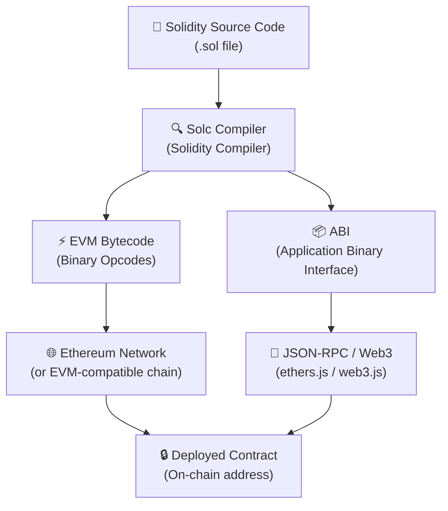

# 🧱 Introduction to Solidity

> "Smart contracts are the backbone of the decentralized web. Solidity is how you write them."

---

## 🗺️ Table of Contents

1. [What is Solidity?](#what-is-solidity)
2. [Why Solidity?](#why-solidity)
3. [How Solidity Compiles to EVM Bytecode](#how-solidity-compiles-to-evm-bytecode)
4. [Setting Up Your Environment](#setting-up-your-environment)
5. [Your First Solidity Contract: Hello World](#your-first-solidity-contract-hello-world)
6. [SPDX License Identifier and Pragma](#spdx-license-identifier-and-pragma)
7. [Contract Structure Overview](#contract-structure-overview)
8. [Compiling and Deploying on Remix](#compiling-and-deploying-on-remix)
9. [Solidity Versions and Why Version Locking Matters](#solidity-versions-and-why-version-locking-matters)
10. [Key Takeaways](#key-takeaways)
11. [Quiz](#quiz)

---

## 🔷 What is Solidity?

Socho tumhe blockchain pe ek "program" likhna hai jo khud-ba-khud chal jaaye, bina kisi server ke — bas ek baar deploy karo aur woh hamesha ke liye blockchain pe zinda rahega. Yehi kaam karta hai **Solidity**. Yeh ek **high-level, statically typed, curly-brace wali programming language** hai jo khaas taur pe **smart contracts** likhne ke liye banayi gayi hai — matlab aise self-executing programs jo blockchain pe rehte hain.

Agar tumne kabhi JavaScript, C++, ya Java likha hai, toh Solidity ki syntax tumhe kaafi familiar lagegi. Isme curly braces `{}` blocks define karne ke liye use hote hain, semicolons `;` statements khatam karne ke liye, aur overall structure object-oriented programming jaisa hi hai.

Solidity ki kuch defining characteristics samjho:

| Property | Description |
|---|---|
| **High-level** | Tum human-readable code likhte ho; compiler saare low-level details sambhal leta hai |
| **Statically typed** | Har variable ka type declare karna padta hai (`uint`, `string`, `address`, etc.), aur compile time pe hi pata chal jaata hai |
| **Curly-brace syntax** | Code blocks `{}` se define hote hain — C/Java/JS devs ko yeh dekh ke ghar jaisa feel aayega |
| **Contract-oriented** | Code ki basic unit `contract` hoti hai — bilkul OOP ki `class` jaisa |
| **EVM-targeted** | Yeh sirf aur sirf Ethereum Virtual Machine (EVM) bytecode mein compile hoti hai |

Solidity ko banaya tha **Gavin Wood** (Ethereum ke co-founder) ne, Ethereum team ke saath, aur iska development shuru hua tha lagbhag 2014 mein. Isko shuru se hi **Ethereum Virtual Machine (EVM)** — jo Ethereum aur usse compatible dusre blockchains ka decentralized computation engine hai — pe chalne ke liye design kiya gaya tha.

---

## 🚀 Why Solidity?

Market mein aur bhi smart contract languages available hain — Vyper, Fe, Yul. Toh phir Solidity se hi kyun shuru karein?

### 1. Yeh Sabse Popular Smart Contract Language Hai

Solidity ne smart contract ecosystem pe raaj kiya hua hai. Ethereum, Polygon, BNB Chain, Avalanche, aur baaki EVM-compatible networks pe deploy hue zyadatar contracts Solidity mein hi likhe gaye hain. Yeh koi accident nahi hai — Solidity sabse pehle market mein aayi, jaldi mature hui, aur ek zabardast network effect bana liya (bilkul waise jaise WhatsApp sabse pehle messaging mein aaya toh sabne use karna shuru kar diya).

### 2. Sabse Bada Ecosystem Aur Tooling

Popularity ka fayda yeh hai ki Solidity ke paas sabse rich ecosystem hai:

- **Frameworks**: Hardhat, Foundry, Truffle
- **Testing libraries**: Chai, Mocha, Forge
- **Security tools**: Slither, MythX, Echidna
- **Auditing resources**: OpenZeppelin, ConsenSys Diligence
- **Package libraries**: OpenZeppelin Contracts (battle-tested, reusable contracts — jaise npm ke trusted packages)

### 3. EVM Compatibility = Ek Baar Likho, Kahin Bhi Deploy Karo

Solidity EVM ko target karti hai, matlab ek hi contract deploy ho sakta hai:

- Ethereum Mainnet
- Polygon
- Arbitrum aur Optimism (Layer 2s)
- BNB Smart Chain
- Avalanche C-Chain
- Base, aur bhi bahut saare

Bilkul waise jaise ek React component web pe bhi chal jaata hai aur React Native ke through mobile pe bhi — same code, multiple platforms.

### 4. Zabardast Community Aur Learning Resources

Stack Overflow, GitHub, Discord servers, YouTube — sab jagah Solidity ke tutorials, answers, aur open-source code bhare pade hain. Jab bhi atkoge, help dhundna kaafi aasan hai — naye, kam-adopted languages ke comparison mein.

### 5. Industry Demand

Solidity developers software industry mein sabse zyada paid logon mein aate hain. Solidity samajhna tumhe DeFi protocol development, NFT projects, DAOs, aur blockchain security auditing ke darwaaze khol deta hai — kuch aisa jaise ek Swiggy delivery partner ke liye bike chalana aana zaruri hai, waise hi Web3 dev ke liye Solidity aana zaruri hai.

---

## ⚙️ How Solidity Compiles to EVM Bytecode

Tumhara Solidity code blockchain pe chalne se pehle **compile** hona padta hai — matlab human-readable source code ko machine-executable instructions mein badalna padta hai jo EVM samajh sake.

Poora compilation pipeline dekho:



### Step-by-Step Breakdown

**Step 1 — Solidity Likho (.sol)**
Tum apni contract logic ek `.sol` file mein Solidity language use karke likhte ho.

**Step 2 — Solc Compile Karta Hai**
Solidity compiler (`solc`) tumhare source code ko process karta hai. Yeh karta hai:
- Syntax aur type checking
- Imports aur dependencies resolve karna
- Do critical outputs generate karna

**Step 3 — Do Outputs Milte Hain**

- **ABI (Application Binary Interface)**: Yeh ek JSON hota hai jo batata hai tumhare contract ka public interface kya hai — kaunse functions hain, woh kya parameters lete hain, aur kya return karte hain. Isi ki madad se frontend apps (ethers.js ya web3.js use karke) jaante hain ki contract se kaise baat karni hai. Isko soch lo tumhare backend API ka Swagger/OpenAPI spec jaisa.

- **EVM Bytecode**: Yeh low-level opcodes ka sequence hota hai (jaise `PUSH1`, `ADD`, `SSTORE`) jise EVM execute kar sakta hai. Yehi asli program hai jo blockchain pe deploy hota hai.

**Step 4 — Deployment**
Bytecode ko network pe ek transaction ke through bheja jaata hai. Network ise ek unique address pe permanently store kar deta hai. Uske baad, koi bhi us contract ke functions call kar sakta hai.

> **Key insight**: Blockchain sirf bytecode store aur execute karta hai, Solidity nahi. Solidity sirf developer ki convenience ke liye hai — EVM ne kabhi Solidity ka naam bhi nahi suna.

---

## 🛠️ Setting Up Your Environment

Beginners ke liye, do tools chahiye shuru karne ke liye — aur inme se kisi ki bhi installation nahi chahiye.

### Remix IDE (Browser-Based)

**Remix** ek browser-based IDE hai jo khaas taur pe Solidity development ke liye banaya gaya hai. Zero se deployed contract tak pahunchne ka yeh sabse fast tareeka hai.

**Yahan access karo**: [https://remix.ethereum.org](https://remix.ethereum.org)

Remix tumhe out-of-the-box kya deta hai:

- Solidity syntax highlighting wala full code editor
- Built-in Solidity compiler (multiple versions ke saath)
- Ek local JavaScript VM jisse tum bina real ETH kharch kiye contracts deploy aur test kar sakte ho
- `.sol` files manage karne ke liye file explorer
- Ek deploy aur interact panel jisse tum browser mein hi contract functions call kar sakte ho

Na npm chahiye, na terminal, na koi config file. Bas URL khol ke code likhna shuru kar do.

### MetaMask (Browser Wallet)

**MetaMask** ek browser extension hai jo tumhare Ethereum wallet ka kaam karta hai. Jab tum real testnets ya mainnet pe deploy karna chahoge, tab yeh chahiye hoga.

**Yahan install karo**: [https://metamask.io](https://metamask.io)

MetaMask kya provide karta hai:

- ETH aur tokens rakhne ke liye ek wallet
- Browser se hi transactions sign aur broadcast karne ki ability
- Sepolia jaise testnets se connection (jahan tumhe faucets se free test ETH mil jaata hai)
- Remix ke saath integration — ek click mein Remix ko MetaMask se connect karke real network pe deploy kar sakte ho

> **Is chapter ke liye**: Sirf Remix chahiye. MetaMask tab important hoga jab tum built-in JavaScript VM se aage badh ke real test network pe deploy karoge.

---

## 📄 Your First Solidity Contract: Hello World

Chalo ek complete, working Solidity contract line-by-line samajhte hain:

```solidity
// SPDX-License-Identifier: MIT
pragma solidity ^0.8.0;

contract HelloWorld {
    string public greeting = "Hello, Blockchain!";
    
    function getGreeting() public view returns (string memory) {
        return greeting;
    }
    
    function setGreeting(string memory _newGreeting) public {
        greeting = _newGreeting;
    }
}
```

Yeh contract teen kaam karta hai:
1. Ek greeting string ko blockchain pe store karta hai
2. Kisi ko bhi current greeting padhne deta hai
3. Kisi ko bhi greeting update karne deta hai

---

## 📋 SPDX License Identifier and Pragma

### Line 1 — SPDX License Identifier

```solidity
// SPDX-License-Identifier: MIT
```

Yeh ek **comment** hai jo tumhare source code ke liye software license declare karta hai. SPDX ka matlab hai Software Package Data Exchange — license information express karne ka ek standardized format.

**Kyun zaruri hai:**

- Smart contract source code jo on-chain publish hota hai woh publicly visible hota hai
- Agar yeh line missing hai toh Solidity compiler warning dega (error nahi)
- Common choices: `MIT` (permissive, open-source friendly), `GPL-3.0`, `UNLICENSED` (proprietary), `BUSL-1.1` (business source)
- Learning projects aur open-source work ke liye, `MIT` standard choice hai

### Line 2 — Pragma Statement

```solidity
pragma solidity ^0.8.0;
```

`pragma` ek **compiler directive** hai — compiler ko batata hai file ko kaise handle karna hai. `solidity` pragma batata hai ki kaunsi Solidity compiler version(s) use honi chahiye.

`^0.8.0` ko break down karte hain:

| Symbol | Meaning |
|---|---|
| `^` | Is version aur usse upar ke minor/patch versions ke saath compatible |
| `0.8.0` | Minimum required version |
| `^0.8.0` | 0.8.0 se 0.8.x tak accept karega, but 0.9.0 NAHI |

Baaki pragma version patterns:

```solidity
pragma solidity 0.8.20;           // Sirf exact version
pragma solidity >=0.8.0 <0.9.0;  // Range: koi bhi 0.8.x version
pragma solidity ^0.8.19;          // 0.8.19 se leke (0.9.0 se pehle) tak
```

---

## 🏛️ Contract Structure Overview

Ek Solidity contract ek predictable structure follow karta hai. Isko object-oriented programming ki class jaisa samjho:

```solidity
// SPDX-License-Identifier: MIT
pragma solidity ^0.8.0;

contract ContractName {
    // 1. State variables (stored permanently on-chain)
    string public greeting = "Hello, Blockchain!";
    
    // 2. Events (for logging)
    // event GreetingChanged(string newGreeting);
    
    // 3. Modifiers (reusable access control logic)
    // modifier onlyOwner() { ... }
    
    // 4. Constructor (runs once at deployment)
    // constructor() { ... }
    
    // 5. Functions (the contract's behavior)
    function getGreeting() public view returns (string memory) {
        return greeting;
    }
    
    function setGreeting(string memory _newGreeting) public {
        greeting = _newGreeting;
    }
}
```

### Key Components Explained

**State Variables**
Contract level pe declare hue variables blockchain ke storage mein permanently store hote hain. Hamare example mein, `string public greeting` ek state variable hai. `public` keyword automatically ek getter function generate kar deta hai, isliye tum bina `getGreeting()` explicitly likhe uski value read kar sakte ho.

**Functions**
Functions define karte hain contract kya kar sakta hai. Hamare contract mein do hain:

- `getGreeting()` — `view` marked hai kyunki yeh sirf data read karta hai, state modify nahi karta. View functions externally call karne pe gas cost nahi lete.
- `setGreeting()` — state modify karta hai (blockchain pe likhta hai), isliye execute karne ke liye gas (ETH) lagta hai.

**Visibility Modifiers**

| Modifier | Kahan Se Access Hota Hai |
|---|---|
| `public` | Kahin bhi (contract ke andar, derived contracts, externally) |
| `private` | Sirf isi contract ke andar |
| `internal` | Isi contract aur derived contracts ke andar |
| `external` | Sirf contract ke bahar se |

**`memory` Keyword**
`string memory _newGreeting` mein, `memory` keyword Solidity ko batata hai ki yeh string function call ke duration ke liye temporarily memory mein store hona chahiye (on-chain nahi). Solidity tumhe reference types (jaise strings aur arrays) ke liye data location explicitly batane ko force karta hai.

---

## 🚢 Compiling and Deploying on Remix

Apna Hello World contract Remix mein compile aur deploy karne ke liye yeh steps follow karo.

### Step 1 — Remix Kholo

Browser mein [https://remix.ethereum.org](https://remix.ethereum.org) pe jaao.

### Step 2 — Naya File Banao

Left panel mein "File Explorer" ke neeche:
1. "contracts" folder pe click karo
2. New file icon pe click karo (document with a plus sign)
3. Naam do `HelloWorld.sol`

### Step 3 — Contract Code Paste Karo

Poora `HelloWorld` contract code copy karke editor mein paste kar do.

### Step 4 — Contract Compile Karo

1. Left sidebar mein **Solidity Compiler** tab pe click karo (`<>` icon with an S jaisa dikhta hai)
2. "Compiler" ke neeche, `0.8.0` ya koi bhi `0.8.x` version select karo
3. Blue **"Compile HelloWorld.sol"** button pe click karo
4. Compilation successful hone pe ek green checkmark aayega
5. Agar errors hain, toh neeche red mein dikhenge — error message tumhe line number bhi bataega

### Step 5 — Contract Deploy Karo

1. **Deploy & Run Transactions** tab pe click karo (rocket ship icon)
2. "Environment" ke neeche, **"Remix VM (Cancun)"** select karo — yeh ek local simulated blockchain hai, free aur instant
3. Tumhe pre-funded test accounts dikhenge jinme 100 ETH each hoga
4. "Contract" ke neeche, ensure karo ki dropdown mein `HelloWorld` select hai
5. Orange **"Deploy"** button pe click karo

### Step 6 — Contract Se Interact Karo

Deployment ke baad, Deploy panel ke neeche "Deployed Contracts" ke under ek naya section aayega:

- Apne contract address ke saamne dropdown arrow pe click karo
- Tumhe har public function aur variable ke liye buttons dikhenge:
  - **`greeting`** — click karke current greeting value read karo
  - **`getGreeting`** — click karke call karo aur returned string dekho
  - **`setGreeting`** — input box mein naya string type karo, phir click karke update karo

Badhai ho — tumne apna pehla smart contract deploy karke usse interact bhi kar liya!

---

## 🔒 Solidity Versions and Why Version Locking Matters

Solidity ek young, rapidly evolving language hai. Major versions ke beech breaking changes aur security improvements introduce hote rehte hain. Isliye smart contract development mein version management critical hai.

### Significant Versions Ki Short History

| Version | Notable Change |
|---|---|
| 0.4.x | Initial stable releases, basic features |
| 0.5.x | Explicit function visibility mandatory ho gayi, `address payable` introduce hua |
| 0.6.x | Inheritance ke liye `virtual`/`override` keywords |
| 0.7.x | `receive()` aur `fallback()` alag-alag functions mein split ho gaye |
| 0.8.x | **Arithmetic overflow/underflow checks built-in** (bahut bada security improvement) |
| 0.8.20+ | Shanghai EVM support, various optimizations |

### Version Locking Kyun Critical Hai

**1. Versions Ke Beech Breaking Changes**
Jo code `0.7.x` mein compile hota hai woh `0.8.x` mein fail ho sakta hai ya alag behave kar sakta hai. Version lock karne se yeh ensure hota hai ki tumhara code hamesha usi compiler ke saath compile ho jispe likha aur test kiya gaya tha.

**2. Security Implications**
`0.8.0` se pehle, integer overflow aur underflow silent bugs the. Ek `uint8` variable jisme `255` hoti thi, `1` add karne pe silently `0` pe wrap around ho jaata tha. Isse real exploits hue jinme millions of dollars ka nuksaan hua. `0.8.0+` mein, yeh automatic error throw karta hai. Purane pragma pe naya code (ya ulta) chalane se subtle vulnerabilities aa sakti hain.

**3. Reproducible Builds**
Jab dusre developers (ya auditors) tumhara code review karte hain, unhe usse waisa hi compile karna hota hai jaisa tumne kiya tha. Ek pinned version identical compilation results guarantee karta hai.

**4. Production Best Practice**
Production contracts mein, exact version pe pin karo:

```solidity
pragma solidity 0.8.20;  // Production: exact version
```

Libraries aur shared code mein, caret range acceptable hai:

```solidity
pragma solidity ^0.8.0;  // Library: compatible minor versions
```

> **Rule of thumb**: Jo bhi real value ke saath deploy karna hai, usse ek specific version pe lock karo jo thoroughly tested aur audited ho — bilkul waise jaise UPI transaction karne se pehle app version verify karna zaruri hai.

---

## ✅ Key Takeaways

- **Solidity** ek statically typed, high-level, curly-brace language hai smart contracts likhne ke liye jo EVM pe chalte hain.

- Yeh **sabse popular smart contract language** hai, sabse bade ecosystem, community, aur tooling support ke saath.

- Solidity source code **`solc` se compile** hoke EVM bytecode (jo on-chain chalta hai) aur ABI (jo frontends contract se interact karne ke liye use karte hain) banata hai.

- **Remix IDE** shuru karne ka sabse fast tareeka hai — browser-based, no setup, built-in compiler aur local test blockchain.

- Har Solidity file **SPDX license identifier** aur ek **pragma** statement se shuru honi chahiye jo compatible compiler version declare kare.

- `contract` Solidity ki fundamental unit hai — isme state variables, functions, events, aur modifiers hote hain.

- **Version locking production mein optional nahi hai** — Solidity versions ke beech breaking changes introduce karti hai, aur pre-0.8.0 contracts mein built-in overflow protection nahi hota.

- State variable pe `public` keyword automatic getter generate karta hai; function pe `view` keyword signal karta hai ki woh state read karta hai lekin modify nahi karta (external calls pe gas cost nahi lagta).

---

## 📝 Quiz

Agle chapter pe jaane se pehle apni understanding test karo.

**Question 1**

Solidity contract compile karne pe do outputs milte hain — woh kya hain?

- A) Source map aur deployment script
- B) ABI aur EVM bytecode
- C) Bytecode aur ek Solidity AST
- D) JSON config aur binary executable

<details>
<summary>Show Answer</summary>

**B) ABI aur EVM bytecode**

ABI (Application Binary Interface) ek JSON description hoti hai contract ke public interface ki, jo frontends use karte hain. EVM bytecode woh compiled program hai jo blockchain pe deploy aur execute hota hai.

</details>

---

**Question 2**

`pragma solidity ^0.8.0;` ka matlab kya hai?

- A) Contract sirf exactly version 0.8.0 ke saath compile hoga
- B) Contract ko version 0.8.0 ya usse baad ka koi bhi version chahiye, 0.9.0 sameth
- C) Contract version 0.8.0 aur usse upar ke 0.8.x versions ke saath compatible hai, lekin 0.9.0 ke saath nahi
- D) Compiler version runtime pe automatically select hota hai

<details>
<summary>Show Answer</summary>

**C) Contract version 0.8.0 aur usse upar ke 0.8.x versions ke saath compatible hai, lekin 0.9.0 ke saath nahi**

Caret (`^`) operator ka matlab hai "is version ke saath compatible" — yeh same major.minor version ke andar patch aur minor updates allow karta hai lekin agla minor increment (0.9.0) block kar deta hai. Yeh bilkul waisa hi hai jaise npm ke `package.json` mein `^` kaam karta hai.

</details>

---

**Question 3**

`view` keyword ke baare mein niche diye statements mein se kaunsa sahi hai?

- A) `view` functions state variables mein likh sakte hain
- B) `view` functions zyada gas kharch karte hain kyunki woh storage se read karte hain
- C) `view` functions state read karte hain lekin modify nahi karte, aur externally call karne pe koi gas nahi lagta
- D) `view` sirf `private` functions ke liye valid hai

<details>
<summary>Show Answer</summary>

**C) `view` functions state read karte hain lekin modify nahi karte, aur externally call karne pe koi gas nahi lagta**

Jab ek `view` function blockchain ke bahar se call hota hai (kisi frontend ya script dwara `call` use karke, `send`/transaction nahi), toh yeh node pe locally execute hota hai aur gas consume nahi karta. Agar yeh kisi state-modifying transaction ke andar se call hota hai, toh us transaction ke part ke roop mein gas use hota hai.

</details>

---

*Next Chapter: [02 — Data Types and Variables in Solidity](./02-data-types.md)*
